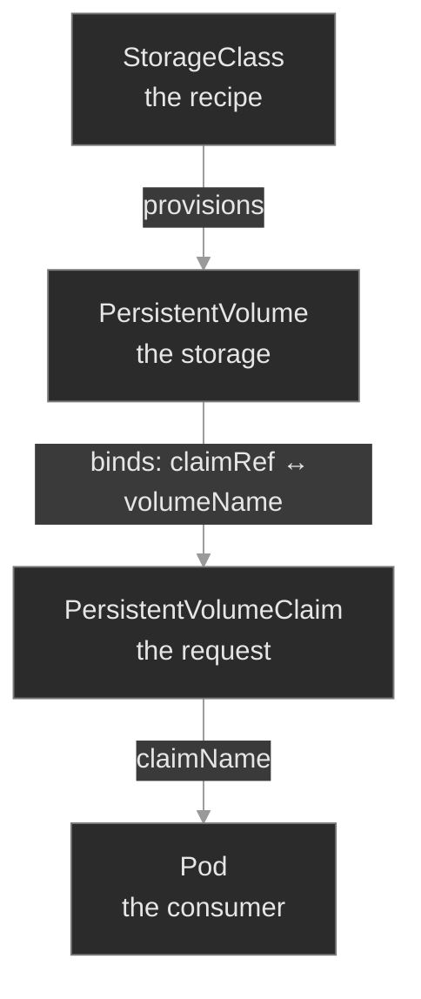
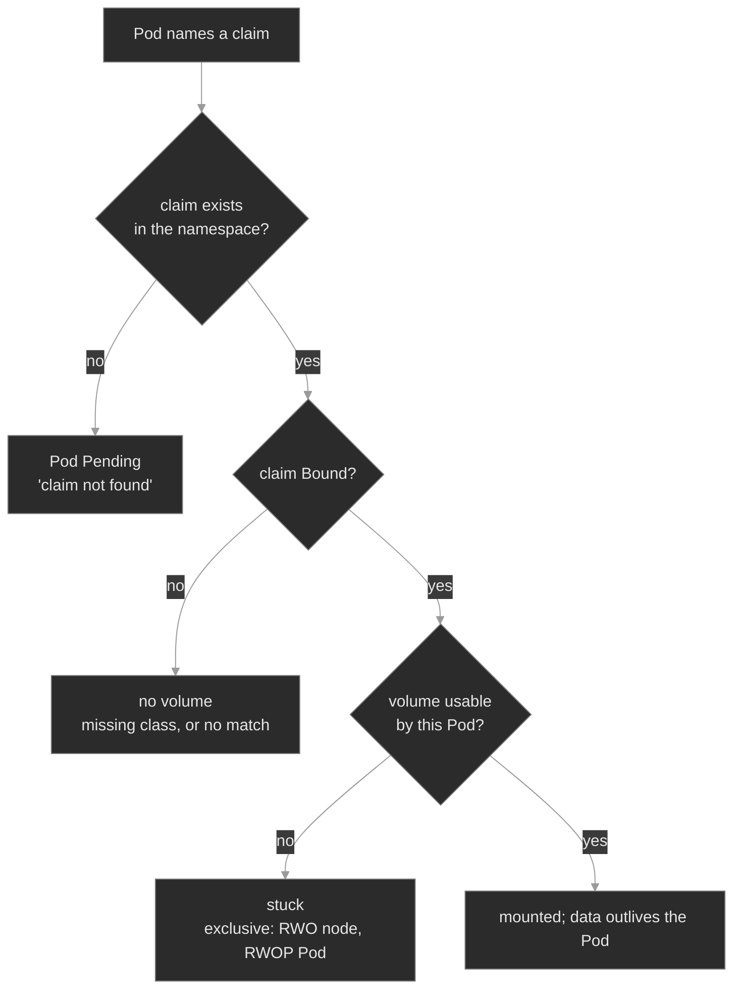

# M05 — Storage: Volumes, PersistentVolumes, Claims & StorageClasses

> A Pod's own filesystem dies with the Pod. This module covers the objects that give a Pod durable storage, and the three places on that path where a Pod stops before it runs.

## What you'll learn

- Define a volume as a directory the containers in a Pod can reach, declare one with `.spec.volumes` and `.spec.containers[*].volumeMounts`, and separate the ephemeral types from the persistent path
- Explain the split: a PVC requests storage, a PV is the storage, a StorageClass provisions a PV to satisfy the PVC, and `claimRef` records the binding
- Split a storage-stuck Pod three ways with one command: the claim is absent, `Pending`, or `Bound` while the volume still refuses the Pod
- Tell dynamic provisioning from static, and read a `WaitForFirstConsumer` claim in `Pending` as healthy
- State what each access mode permits, and diagnose both exclusivity failures: RWO across two nodes, RWOP across two Pods
- Predict what `kubectl delete pvc` does under each reclaim policy, and why that delete sometimes does not finish

## Why it matters

A container's filesystem is ephemeral. Restart the container and it reverts to the image. Delete the Pod and every byte it wrote is gone. That is correct for a stateless service. Polyphone also runs stateful ones: `cdr-writer` persists Call Detail Records, and `directory` keeps an address book. Their data must outlive the Pod, survive a reschedule onto another node, and be present when a replacement Pod starts.

Storage failures are hard to read, because the symptom and the cause sit in different objects. The Pod stops in `Pending` or `ContainerCreating` and writes no logs. The cause is one or two objects away, in a claim or a class the Pod's own events never name. An SRE who knows the chain runs `kubectl get pvc` first, and the claim's phase gives the answer. An SRE who does not know it reads logs that do not exist, restarts the ReplicaSet, and loses twenty minutes on a workload that was never unhealthy. It was waiting for storage that never arrived.

## Scope

**Covers:** the volume abstraction and the common volume types, ephemeral volumes in outline, the PersistentVolume and PersistentVolumeClaim model, `claimRef` binding, static and dynamic provisioning, StorageClasses, `volumeBindingMode`, the four access modes and the exclusivity failures they produce, PV phases, Storage Object in Use Protection, the reclaim policies, volume expansion, and the *absent / `Pending` / `Bound`-but-stuck* differential.

**Doesn't cover:** CSI driver internals, which are driver-specific; StatefulSet `volumeClaimTemplates` and per-Pod storage identity (M07, M24); ConfigMap and Secret volumes in depth (M03); node disk pressure and eviction (M06); and CSI `VolumeSnapshot`, named once here and left to M26.

**Assumes:** M00 (`get → describe → events → logs`, spec against status), M01 (Pods, Deployments, a `Pending` Pod), M03 (ConfigMap and Secret volumes), and M04's fact that a Pod runs on one specific node. That node is load-bearing here: a volume attaches to a node, so a Pod's storage constrains where the Pod can run.

## Vocabulary

| Term | Definition |
|------|------------|
| **volume** | A directory, possibly with data in it, that the containers in a Pod can reach. Its type sets its lifetime and its backing medium. |
| **PersistentVolume (PV)** | A piece of storage in the cluster that an administrator provisioned, or that a StorageClass provisioned dynamically. Cluster-scoped, with its own lifecycle. |
| **PersistentVolumeClaim (PVC)** | A request for storage by a user: a size, an access mode, optionally a class. Namespaced. Also called a claim. |
| **binding** | The exclusive, one-to-one association between one claim and one volume, recorded as `claimRef` on the volume and `volumeName` on the claim. |
| **StorageClass (SC)** | A named recipe for provisioning a volume: which provisioner, which parameters, which reclaim policy, which binding mode. A claim selects one by `storageClassName`. |
| **provisioning** | How a volume comes to exist: **dynamically**, when the claim's class creates one on demand, or **statically**, when an administrator pre-creates it. |
| **provisioner / CSI driver** | The component that creates and deletes the real storage. Modern drivers implement the Container Storage Interface (CSI). |
| **access mode** | How many nodes, or Pods, may mount a volume at once, and whether they may write. RWO, ROX, RWX or RWOP. |
| **`allowVolumeExpansion`** | The class field permitting a user to grow a claim. Absent or `false`, the API rejects the growth. |
| **Storage Object in Use Protection** | Finalizers that postpone deleting a claim a Pod uses, or a volume a claim is bound to. |

## Mental model

A Pod's storage travels a fixed chain, and a different object owns each hop. The Pod names a claim in `claimName`. The claim binds to a volume, provisioned on demand or pre-created. That volume **attaches** to the node the Pod landed on, then **mounts** into the container as a directory. Break any link and the Pod does not start. It waits.



StorageClass and PersistentVolume are cluster-scoped; the claim is where the chain turns namespaced, the one durable handle a Pod spec ever names.

The next diagram walks the same chain from the Pod's side, asking which link breaks first.



The three red leaves are the three ways a Pod fails to get storage, and one command separates them: **`kubectl get pvc`**. A claim absent from the list means the Pod points at an object that does not exist. A `Pending` claim cannot get a volume. A `Bound` claim with a stuck Pod means the volume refuses that Pod. M04 built the same instinct on `get endpoints`: **the Pod's status says it is stuck, and the claim says why. Read the claim first.**

## Concept walkthrough

### A volume is a directory

At its core, a volume is a directory, possibly with data in it, that the containers in a Pod can reach<sup><a href="https://kubernetes.io/docs/concepts/storage/volumes/">[1]</a></sup>. Nothing more. The volume's *type* decides what backs that directory, how long it lives, and which nodes reach it.

Using one takes two declarations. Specify the volumes to provide for the Pod in `.spec.volumes`, then declare where to mount them into containers in `.spec.containers[*].volumeMounts`<sup><a href="https://kubernetes.io/docs/concepts/storage/volumes/">[1]</a></sup>. The two halves join by name. A volume the Pod provides but never mounts does nothing, and a mount naming no volume is invalid.

```yaml
spec:
  volumes:
    - name: data                                  # what to provide
      persistentVolumeClaim: { claimName: cdr-data }
    - name: scratch
      emptyDir: {}
  containers:
    - name: app
      volumeMounts:
        - { name: data, mountPath: /data }        # where to put it
        - { name: scratch, mountPath: /tmp/work }
```

Most volume types are **ephemeral**: their lifetime matches the Pod's, so deleting the Pod deletes the volume<sup><a href="https://kubernetes.io/docs/concepts/storage/ephemeral-volumes/">[2]</a></sup>. That suits data a Pod can rebuild. Only `persistentVolumeClaim` reaches storage with a life of its own.

| Type | Lifetime | What it is for |
|------|----------|----------------|
| `emptyDir` | the Pod | Scratch space, a cache, a directory two containers share. |
| `configMap`, `secret`, `projected` | the Pod | Configuration and credentials, as files (M03). |
| `downwardAPI` | the Pod | Pod fields, such as its name or labels, as files. |
| `ephemeral` | the Pod | A **generic ephemeral volume**: data that only needs to exist during a Pod's lifecycle, sized and classed like a claim<sup><a href="https://kubernetes.io/docs/concepts/storage/ephemeral-volumes/">[2]</a></sup>. |
| `hostPath` | the node | A path on the node's filesystem. Restricted in production. |
| `local` | the node | A disk on one node, node-affine. Always through a PersistentVolumeClaim, never named directly in a Pod. |
| `persistentVolumeClaim` | independent | Durable data. The rest of this module. |
| `nfs` | independent | A network file share many nodes mount at once. |
| `csi` | independent | Any storage a CSI driver provides. Every cloud volume. |

### The claim and the volume

Kubernetes separates asking for storage from supplying it. A **PersistentVolume** is a piece of storage in the cluster that an administrator provisioned, or that a StorageClass provisioned dynamically<sup><a href="https://kubernetes.io/docs/concepts/storage/persistent-volumes/">[3]</a></sup>. It is a cluster resource, like a node. A **PersistentVolumeClaim** is a request for storage by a user<sup><a href="https://kubernetes.io/docs/concepts/storage/persistent-volumes/">[3]</a></sup>. The parallel is exact: Pods consume node resources, claims consume volume resources.

A control loop watches for new claims, finds a matching volume, and binds the two. **Binding is exclusive and one-to-one.** It is a `ClaimRef`, a bi-directional reference between the PersistentVolume and the PersistentVolumeClaim<sup><a href="https://kubernetes.io/docs/concepts/storage/persistent-volumes/">[3]</a></sup>: the volume's `spec.claimRef` names the claim, the claim's `spec.volumeName` names the volume, and `kubectl get pv` prints the same fact in its `CLAIM` column. Two consequences follow. No second claim can take a bound volume, however well it matches, because that volume already points at a claim. And a volume whose claim was deleted keeps its stale `claimRef`, which is why a `Released` volume never rebinds on its own.

A claim that no volume satisfies stays unbound indefinitely, then binds when a suitable volume appears. A pool of 50Gi volumes never satisfies a request for 100Gi.

Pods then use the claim as a volume, and **the claim must exist in the same namespace as the Pod using it**<sup><a href="https://kubernetes.io/docs/concepts/storage/persistent-volumes/">[3]</a></sup>. Claims are namespaced and volumes are not, so the namespace boundary sits at the claim. A claim in another namespace is invisible to the Pod, and so is a claim whose name differs by one character. The Pod stays `Pending`, and `describe pod` says it plainly: `persistentvolumeclaim "directory-store" not found`.

Two fields narrow which volume a claim accepts. `storageClassName` restricts it to volumes of that class, and a **selector** restricts it further by label, through `matchLabels` and `matchExpressions`<sup><a href="https://kubernetes.io/docs/concepts/storage/persistent-volumes/">[3]</a></sup>. Both matter mainly in static provisioning, where a claim chooses among pre-created volumes; on a dynamic claim a selector usually just prevents provisioning. Node placement is the related constraint, and the volume owns it: a `local` volume carries node affinity to the machine holding its disk, so any Pod mounting it runs there.

### StorageClasses, provisioning, and binding mode

A claim gets its volume in one of two ways. In **static provisioning**, an administrator creates volumes in advance and claims bind to whatever matches. That does not scale, because somebody carves every volume by hand. **Dynamic provisioning** is the default answer: when no static volume matches, the claim's StorageClass provisions one for it<sup><a href="https://kubernetes.io/docs/concepts/storage/dynamic-provisioning/">[4]</a></sup>. A StorageClass is a named recipe — which provisioner, which parameters, which reclaim policy, which binding mode<sup><a href="https://kubernetes.io/docs/concepts/storage/storage-classes/">[5]</a></sup>. This lab's class is `local-path`, which carves a directory on a node's disk. A cloud class calls a CSI driver instead.

A claim does not have to request a class, and two spellings differ<sup><a href="https://kubernetes.io/docs/concepts/storage/persistent-volumes/">[3]</a></sup>. With `storageClassName` **omitted**, the `DefaultStorageClass` admission plugin assigns the cluster's default class. With `storageClassName: ""`, the empty string disables dynamic provisioning for that claim, which then binds only to a pre-created classless volume. A class that does not exist is the third case, and it is a fault: no provisioner answers, no volume appears, and the claim sits `Pending` forever. `kubectl describe pvc` names the cause — `storageclass.storage.k8s.io "fast-ssd" not found`.

```yaml
apiVersion: v1
kind: PersistentVolumeClaim
metadata: { name: cdr-data, namespace: cdr-storage }
spec:
  accessModes: [ReadWriteOnce]      # one node, read-write
  storageClassName: local-path      # the class that provisions the PV
  resources: { requests: { storage: 1Gi } }
```

`storageClassName` is immutable once the claim exists, so the API rejects an edit onto a different class. Delete the claim and recreate it instead. That is safe while the claim never bound, and it is a data migration once it did. The same holds for `accessModes`.

The class also decides *when* the binding happens<sup><a href="https://kubernetes.io/docs/concepts/storage/storage-classes/#volume-binding-mode">[6]</a></sup>.

| `volumeBindingMode` | When the claim binds |
|---------------------|----------------------|
| `Immediate` | As soon as the claim is created. The default when a class omits the field. |
| `WaitForFirstConsumer` | When the first Pod uses the claim, so the volume lands on that Pod's node. |

`WaitForFirstConsumer` makes a *healthy* claim sit `Pending`, which is the most misread state in Kubernetes storage. Most node-local classes set it, `local-path` included. The reason is placement: the system cannot know which node's volume to create until the scheduler picks a node, so it waits. Such a claim shows `Pending` with the event `waiting for first consumer to be created before binding`. **`Pending` means broken only once a Pod is trying to use the claim and it still will not bind.**

A claim can also grow after it binds. Set `allowVolumeExpansion: true` on the class, then raise `spec.resources.requests.storage` on the claim<sup><a href="https://kubernetes.io/docs/concepts/storage/persistent-volumes/#expanding-persistent-volumes-claims">[7]</a></sup>. Three limits hold. Growth is one-way, because a claim never shrinks. The class must permit it, and that field defaults to absent. And expanding the device is not expanding the filesystem on it: some volume types finish that online, while others need the Pod to restart first.

### Access modes, attach, and exclusivity

A bound claim still has to become a mounted directory, in two steps: **attach** makes the volume available to a node, and **mount** exposes it inside the container. A CSI driver splits its work the same way, so the stage names a symptom's owner: a `Pending` claim on a class that exists is a provisioning fault, an attach error is the attach/detach controller, and a `FailedMount` is the driver's node plugin<sup><a href="https://kubernetes.io/docs/concepts/storage/volumes/#csi">[8]</a></sup>. Attach is where the access mode bites, and that mode is a property of both the volume and the claim<sup><a href="https://kubernetes.io/docs/concepts/storage/persistent-volumes/#access-modes">[9]</a></sup>.

| Mode | Short name | What the volume permits |
|------|-----------|-------------------------|
| `ReadWriteOnce` | RWO | Read-write mounting by a **single node**. Several Pods on that node may all read and write it. |
| `ReadOnlyMany` | ROX | Read-only mounting by **many nodes**. |
| `ReadWriteMany` | RWX | Read-write mounting by **many nodes**. |
| `ReadWriteOncePod` | RWOP | Read-write mounting by a **single Pod**, cluster-wide. |

Read the table by counting the right thing. Three modes count **nodes**, and only RWOP counts **Pods**. So RWO permits many Pods that share one node. ROX and RWX permit many nodes, and therefore many Pods on many nodes; the difference between those two is only whether the nodes may write. RWOP is the strict one — one Pod in the whole cluster reads or writes that claim, and a second Pod is refused even on the same node.

Two rules complete the picture. A volume advertises only the modes its storage supports, so a block disk cannot offer RWX however the claim is spelled. And a volume mounts under one access mode at a time, even when it supports several<sup><a href="https://kubernetes.io/docs/concepts/storage/persistent-volumes/#access-modes">[9]</a></sup>.

Exclusivity produces the failure that looks strangest, because the claim is perfectly `Bound`. Scale a Deployment that mounts one RWO claim until two replicas land on two nodes. The first node attaches the volume, and the second Pod cannot have it. On a network block volume the error is `Multi-Attach error for volume ... already exclusively attached to one node`. On a node-local volume the same rule reads `volume node affinity conflict`, because that volume is pinned to the machine holding its disk. RWOP gives the Pod-level twin, and the scheduler states it in words: `node has pod using PersistentVolumeClaim with the same name and ReadWriteOncePod access mode`.

None of the three is a broken volume. Each is an access mode keeping its promise. **A `Bound` claim with a stuck Pod means the volume refuses that consumer**, so read the access mode, not the provisioner. Stop asking for what the mode forbids: run one consumer where the mode allows one, move to RWX on network file storage when replicas on many nodes must genuinely share a volume, or give each replica its own volume with `volumeClaimTemplates` (M07).

### Phases, deletion, and reclaim policy

A volume reports its place in that lifecycle as a phase<sup><a href="https://kubernetes.io/docs/concepts/storage/persistent-volumes/#phase">[10]</a></sup>.

| Phase | Meaning |
|-------|---------|
| `Available` | A free resource, not bound to a claim. |
| `Bound` | The volume is bound to a claim. |
| `Released` | The claim is deleted; the cluster has not yet reclaimed the storage. |
| `Failed` | Automatic reclamation failed. |

A claim's own phase is a simpler set: `Pending`, `Bound`, or rarely `Lost` if its bound volume disappears out from under it<sup><a href="https://kubernetes.io/docs/concepts/storage/persistent-volumes/#phase">[10]</a></sup>.

Deleting a claim is where storage gets dangerous, and two mechanisms decide the outcome. The first is **Storage Object in Use Protection**, which stops a claim a Pod is using, or a volume a claim is bound to, from being removed out from under live data<sup><a href="https://kubernetes.io/docs/concepts/storage/persistent-volumes/#storage-object-in-use-protection">[11]</a></sup>. A claim counts as in use whenever a Pod references it. Delete such a claim and it stays: a `kubernetes.io/pvc-protection` finalizer holds it in `Terminating` until no Pod uses it, and a bound volume behaves the same way through its own finalizer. So `kubectl delete pvc` appears to hang, and nothing is wrong. Scale the consumer to zero and the deletion completes.

The second mechanism is the **reclaim policy**, which decides the volume's fate once the claim is gone<sup><a href="https://kubernetes.io/docs/concepts/storage/persistent-volumes/#reclaiming">[12]</a></sup>.

| Policy | When the claim is deleted | Use it for |
|--------|---------------------------|------------|
| `Delete` | Deletes the PV object **and** the storage behind it. The data is gone. | Scratch data. The default on most dynamic classes, `local-path` included. |
| `Retain` | Keeps the volume and its data. It moves to `Released` and waits for a human. | Data whose loss is an incident. |
| `Recycle` | Deprecated. Use dynamic provisioning instead. | Nothing new. |

So `kubectl delete pvc` is not harmless cleanup. On a `Delete`-policy class it is a data-destruction command, and the claim's small YAML makes that blast radius easy to underestimate. Put anything you cannot lose on a `Retain` class. One adjacent capability closes the loop: a CSI driver that supports snapshots captures a point-in-time copy through `VolumeSnapshot` and `VolumeSnapshotClass` objects, and a new claim can be created from it<sup><a href="https://kubernetes.io/docs/concepts/storage/volume-snapshots/">[13]</a></sup>. M26 treats backup and restore as an operational practice.

<details>
<summary>📖 Going deeper: recovering a Released volume, and the deletes that hang<sup><a href="https://kubernetes.io/docs/concepts/storage/persistent-volumes/#reclaiming">[12]</a></sup></summary>

On a `Retain` class, deleting the claim leaves the volume `Released` with the data intact. It will not bind to a new claim, even an identical one, because its `claimRef` still names the claim you deleted. Recovery is deliberate: edit the volume, clear `spec.claimRef`, and it returns to `Available`. When one specific claim must get it, pre-create that claim with `volumeName` set to the volume, so no other claim wins the race.

Three delete-time states are worth recognizing on sight. A claim in `Terminating` while a Pod still references it is in-use protection working correctly, so scale the consumer down. A volume in `Released` on a `Retain` class waits for the manual step above. A volume in `Failed` means reclamation errored, so the driver could not delete the backing storage, and the API object now misrepresents infrastructure that may still exist and still cost money.

Force-removing a finalizer is the last resort, never the fix: Kubernetes forgets the object while the real disk survives, which turns a stuck delete into an orphan nobody tracks.

</details>

## Hands-on

Five baseline steps and four break/fix scenarios on the full Polyphone fleet. The class throughout is `local-path`: dynamic, `WaitForFirstConsumer`, RWO, `Delete` policy.

- **`baseline/`** — volumes from the inside out: an `emptyDir` that dies with its Pod, a `Bound` claim and the volume a class provisioned for it, `WaitForFirstConsumer` holding a healthy claim `Pending`, data surviving a Pod delete, and the `get pvc` triage.
- **`breakfix-01-pvc-storageclass-missing/`** — a claim that never binds, because it names a class that does not exist.
- **`breakfix-02-pvc-claim-missing/`** — a Pod that names a claim which is absent.
- **`breakfix-03-rwo-multi-attach/`** — a `Bound` claim whose second Pod sits on another node, and an RWO volume that will not follow it.
- **`breakfix-04-rwop-single-pod/`** — the same shape on one node, where RWOP refuses a second Pod that RWO would have allowed.

Check yourself against `ANSWER-KEY.md` after each.

## Common failure modes

| Symptom | Likely cause | Where to look |
|---------|--------------|---------------|
| Pod `Pending`, `unbound ... PersistentVolumeClaims` | Its claim is `Pending` | `get pvc -n <ns>`, then `describe pvc` for the reason |
| Claim `Pending`, `storageclass ... not found` | A typo in `storageClassName`, or the class is not installed | `get storageclass`; delete and recreate the claim, because the field is immutable |
| Claim `Pending`, `waiting for first consumer` | Healthy `WaitForFirstConsumer`. No fault | Schedule a Pod that uses it; it binds on that Pod's node |
| Pod `Pending`, `persistentvolumeclaim "x" not found` | A `claimName` typo, or the claim is in another namespace | `get pvc -n <ns>`; correct the `claimName` |
| `Bound` claim, Pod stuck, `Multi-Attach error` | An RWO volume is wanted on a second node | `get pods -o wide`; run one consumer, or move to RWX |
| Same shape, `volume node affinity conflict` | An RWO **local** volume pinned to another node | `describe pv` node affinity against the Pod's node |
| Same shape, `... ReadWriteOncePod access mode` | RWOP already has its one Pod | Run one Pod, or recreate the claim as RWO |
| `delete pvc` never finishes; claim `Terminating` | In-use protection: a Pod still references it | `get pods -n <ns>`; scale the consumer to zero |
| A volume sits `Released`, no claim binds | The stale `claimRef` names the deleted claim | `get pv -o yaml`; clear `spec.claimRef` |
| Growing a claim is rejected | The class omits `allowVolumeExpansion` | `get storageclass -o yaml` |
| Data gone after `delete pvc` | A `Delete` reclaim policy destroyed the volume | `get storageclass -o yaml`; use `Retain` for data that matters |

## Recap

- **A volume is a directory the containers in a Pod can reach.** `.spec.volumes` provides it, `.spec.containers[*].volumeMounts` places it. Most types die with the Pod; only a claim reaches storage with its own lifecycle.
- **A claim requests storage, a volume is the storage, and a StorageClass provisions one to satisfy the other.** The binding is exclusive and one-to-one, and a Pod names only the claim, in its own namespace.
- **`kubectl get pvc` is the first look, and it splits every storage-stuck Pod three ways:** the claim is absent, `Pending`, or `Bound` while the Pod is still stuck. Not every `Pending` is broken — `WaitForFirstConsumer` holds a healthy claim there until a Pod consumes it.
- **Access modes count nodes, except RWOP, which counts Pods.** RWO gives one node many Pods, RWX gives many nodes, RWOP gives exactly one Pod. A `Bound` claim with a stuck Pod is an exclusivity problem, never a provisioning one.
- **`reclaimPolicy: Delete` makes `kubectl delete pvc` a data-destruction command.** In-use protection is the only thing that slows it down.

## Production thinking

- A team scales a stateful Deployment from one replica to three, all sharing one RWO claim. It works on their single-node test cluster and fails on a multi-node one. What is the failure, and what should they reach for instead of more replicas on RWO?
- A cleanup script deletes "unused" claims, and a service's data disappears. The class was on `reclaimPolicy: Delete`. Which single change would have made that a recoverable `Released` volume, and what does the safety cost afterwards?
- A volume is filling up and its class sets `allowVolumeExpansion: true`. You raise the request, the claim reports the new size, and the application still sees the old capacity. What has completed, what has not, and what do you do next?

## References

1. Kubernetes — Volumes: https://kubernetes.io/docs/concepts/storage/volumes/
2. Kubernetes — Ephemeral Volumes: https://kubernetes.io/docs/concepts/storage/ephemeral-volumes/
3. Kubernetes — Persistent Volumes: https://kubernetes.io/docs/concepts/storage/persistent-volumes/
4. Kubernetes — Dynamic Volume Provisioning: https://kubernetes.io/docs/concepts/storage/dynamic-provisioning/
5. Kubernetes — Storage Classes: https://kubernetes.io/docs/concepts/storage/storage-classes/
6. Kubernetes — Volume Binding Mode: https://kubernetes.io/docs/concepts/storage/storage-classes/#volume-binding-mode
7. Kubernetes — Expanding Persistent Volume Claims: https://kubernetes.io/docs/concepts/storage/persistent-volumes/#expanding-persistent-volumes-claims
8. Kubernetes — Volumes (CSI): https://kubernetes.io/docs/concepts/storage/volumes/#csi
9. Kubernetes — Access Modes: https://kubernetes.io/docs/concepts/storage/persistent-volumes/#access-modes
10. Kubernetes — PersistentVolume Phase: https://kubernetes.io/docs/concepts/storage/persistent-volumes/#phase
11. Kubernetes — Storage Object in Use Protection: https://kubernetes.io/docs/concepts/storage/persistent-volumes/#storage-object-in-use-protection
12. Kubernetes — Reclaiming: https://kubernetes.io/docs/concepts/storage/persistent-volumes/#reclaiming
13. Kubernetes — Volume Snapshots: https://kubernetes.io/docs/concepts/storage/volume-snapshots/
