# Polyphone Killercoda Lab — Full Study Guide (Concepts + Troubleshooting)

Each module below has two parts, back to back, so you can read them together:

1. **Concept section** (from that module's `LESSON.md`) — the mental model, vocabulary, how the pieces fit, and a failure-mode table, read top to bottom before you touch a cluster.
2. **Break/fix practice** — for every scenario in that module: the symptom, the questions to ask yourself, then (behind a collapsed reveal) the exact diagnostic commands, root cause, fix, and verify step.

---

# `m00-foundations/`

## Concept

## M00 — Mental Model & kubectl Fluency

> The foundation. How a Kubernetes cluster is organized, how `kubectl` actually works, and the four-command diagnostic loop every later module assumes.

### What you'll learn

- Identify the components of a Kubernetes cluster and what each one does
- Trace any `kubectl` command back to the HTTP request it produces
- Read any Kubernetes object using the universal `spec` / `status` shape
- Apply the canonical diagnostic loop — `get` → `describe` → `events` → `logs` — in order
- Pivot to cluster-wide situational awareness when you don't know where a problem lives
- Avoid the most common context/namespace mistakes that lead to wasted time or, worse, production blast radius

### Why it matters

The most common reason SREs flounder with Kubernetes is reaching for commands before having a mental model. Memorizing `kubectl get pods` without knowing why `-A` matters. Running `describe` without knowing where Events come from. Editing a Deployment and being surprised when a controller they didn't know existed creates a new ReplicaSet.

You operate dozens of Polyphone clusters, built and changed by people who aren't always still on the team. The skill that compounds is not memorization. It's the instinct to orient yourself fast, ask the cluster what it knows, and read what it tells you. This module is short on commands and long on concepts; every later module assumes you finished it.

### Scope

**Covers:** cluster anatomy (control plane vs nodes, the API server's role), the `spec` / `status` resource model, the canonical diagnostic loop (`get → describe → events → logs`), `kubectl` fluency for the everyday verbs and flags, reading the API with jsonpath / custom-columns / jq, and the most common pitfalls around context and namespace state.

**Doesn't cover:** writing Deployments or other workload objects (M01), Service/networking depth (M04), configuration via ConfigMaps/Secrets (M03), security/RBAC (M10), CRDs and operators (M08). The breakfix scenarios touch these lightly so you can diagnose; the mechanics come later.

**Assumes:** a container is a process-level isolation primitive; you're comfortable with basic Unix shell (`cd`, `ls`, `grep`, pipes, backgrounding with `&`); you've at least heard of Kubernetes as a container orchestrator. If you've never run `docker run`, start with a containers primer first.

### Vocabulary

| Term | Definition |
|------|------------|
| **Control plane** | The components that decide what should run: API server, etcd, scheduler, controller manager. |
| **Node** | A machine (VM or bare metal) that runs Pods. Hosts a kubelet and a container runtime. |
| **Pod** | The smallest deployable unit. Wraps one or more **containers** that share a network namespace (one IP), storage volumes, and lifecycle. |
| **Container** | The actual running process, packaged as an OCI image. A Pod runs one or more containers; in most cases it's exactly one. |
| **API server** (`kube-apiserver`) | The single entry point to the cluster. Reads and writes etcd. Authenticates and authorizes every request. |
| **etcd** | The cluster's database. A distributed key-value store holding desired and observed state of every object. |
| **kubelet** | The agent on each node that talks to the API server and instructs the container runtime. |
| **CNI plugin** | The node component that puts each Pod on the network and gives it its IP. The kubelet calls it when a Pod starts. |
| **Controller** | A program that watches the API for objects of a certain kind and acts to make their `status` match their `spec`. |
| **Object** (a.k.a. **resource**) | An addressable thing in the cluster: Pod, Deployment, Service, Node, etc. |
| **Kind** | The type of an object — `Pod`, `Deployment`, `Service`. |
| **Label / Selector** | A `key=value` tag on an object (label), and the filter that finds objects by those tags (selector). Services, Deployments, and NetworkPolicies all use selectors to find their Pods. |
| **Namespace** | A logical grouping inside a cluster. Most objects are namespaced; a few (Nodes, PersistentVolumes, ClusterRoles) are cluster-scoped. |
| **Spec** | The desired state declared on an object — what you want. |
| **Status** | The observed state reported by controllers — what is. |
| **Reconciliation** | The continuous loop in which controllers compare `spec` to `status` and try to converge them. |
| **Deployment** | Workload controller for stateless, fungible Pods. Owns a ReplicaSet; handles rolling updates when the Pod template changes. |
| **ReplicaSet** | The controller a Deployment creates to maintain a target replica count. You almost never write one directly — the Deployment owns and rolls it for you. |
| **StatefulSet** | Workload controller for Pods that need stable identity (`name-0`, `name-1`), per-Pod persistent storage, and ordered start/stop. |
| **DaemonSet** | Workload controller that runs exactly one Pod per (matching) node. Used for node-local agents — log shippers, network plugins, edge proxies. |
| **Service** | A stable virtual IP + DNS name that load-balances across a set of Pods selected by labels. Types: `ClusterIP` (internal), `NodePort` (per-node port), `LoadBalancer` (cloud LB). |
| **PersistentVolumeClaim (PVC)** | A Pod's request for persistent storage of a given size and class. Bound to a PersistentVolume (PV); PVCs are namespaced, PVs are cluster-scoped. |
| **ResourceQuota** | A per-namespace cap on what can exist there — Pod count, total CPU/memory requests, PVC count, etc. The API server rejects creates that would exceed the cap. |
| **Context** | A kubeconfig entry pointing at a cluster + user + default namespace. |
| **Event** | A timestamped note attached to an object, describing something that happened to it. |

### Mental model

A Kubernetes cluster has two halves. The **control plane** decides what should run; the **nodes** actually run it. The API server is the only thing that talks to etcd; everything else — including `kubectl` — goes through the API server<sup><a href="https://kubernetes.io/docs/concepts/overview/components/">[1]</a></sup>.

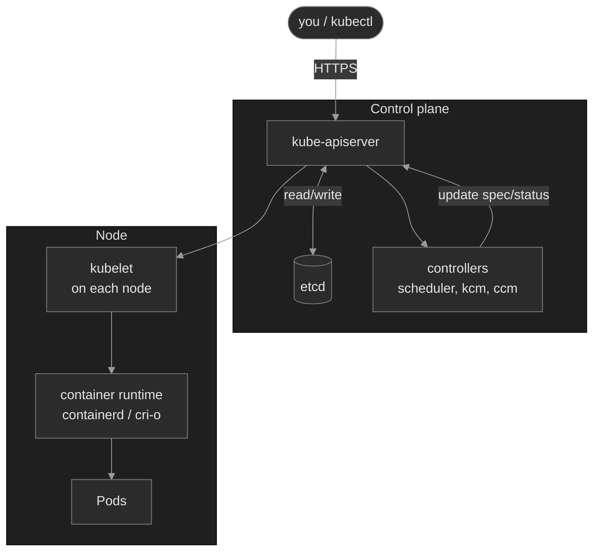

This picture carries one load-bearing insight: **`kubectl` is a thin HTTPS client over the API server.** Every `kubectl get`, `apply`, `edit` is an HTTP request. Whatever a controller does, you could do too — controllers are programs that watch the API and react. There is no magic.

### Concept walkthrough

The walkthrough breaks into four moves:

1. **How the cluster decides things** — what objects exist, and how controllers converge them.
2. **How kubectl talks to the cluster** — the thin REST client and the day-to-day toolkit.
3. **How to ask questions when something's wrong** — the diagnostic loop and cluster-wide awareness.
4. **Knowing where you're pointed** — context and namespace orientation.

#### How the cluster decides things

##### The resource model — everything is an object

Every thing in Kubernetes is an object addressed by three coordinates: `kind`, `namespace`, `name`. Most are namespaced; a few are cluster-scoped (Nodes, PersistentVolumes, ClusterRoles).

Every object has the same skeleton<sup><a href="https://kubernetes.io/docs/concepts/overview/working-with-objects/">[2]</a></sup>:

```yaml
apiVersion: apps/v1
kind: Deployment
metadata:
  name: portal-ui
  namespace: admin-portal
  labels:
    app: portal-ui
spec:
  # what you want
status:
  # what the controllers observe
```

`spec` is yours — you write it. `status` belongs to the controllers; they update it as the cluster converges. When something is wrong, the gap between `spec` and `status` is where the story lives. Every diagnostic command exists to expose part of that gap.

<details>
<summary>📖 Going deeper: namespace boundaries — what crosses, what doesn't<sup><a href="https://kubernetes.io/docs/concepts/overview/working-with-objects/namespaces/">[7]</a></sup></summary>

Namespaces are organizational scoping + RBAC scope + a DNS prefix. They are **not** a security boundary.

What crosses namespaces:
- **Services** — resolvable cluster-wide via `<svc>.<ns>.svc.cluster.local`. A pod in `admin-portal` can call `portal-ui.admin-portal` directly.
- **PersistentVolumes** — cluster-scoped; can be bound by a PVC in any namespace (subject to StorageClass policy).
- **Nodes, ClusterRoles, IngressClasses, StorageClasses** — cluster-scoped, visible from everywhere.

What doesn't:
- **Secrets, ConfigMaps, ServiceAccounts** — namespaced; a Pod can only mount one from its own namespace.
- **NetworkPolicies** — selectors are namespace-scoped unless you explicitly use a `namespaceSelector` (M14).
- **RBAC** — `Role` + `RoleBinding` is namespaced; `ClusterRole` + `ClusterRoleBinding` is cluster-wide. Mixing them is the most common RBAC bug.

This matters operationally: if your workload in namespace `A` "can't see" something in namespace `B`, the answer is almost always one of (a) it's namespaced and you're looking from the wrong place, (b) the FQDN you need is `<thing>.B.svc.cluster.local`, or (c) a NetworkPolicy is blocking the cross-namespace call.

</details>

<details>
<summary>📖 Going deeper: owner references and cascading deletion<sup><a href="https://kubernetes.io/docs/concepts/architecture/garbage-collection/">[8]</a></sup></summary>

Objects can own other objects. A Deployment owns ReplicaSets; ReplicaSets own Pods. When you delete the owner, what happens to the dependents depends on the deletion propagation policy:

- **Background** (default): API server returns immediately; the garbage collector deletes dependents asynchronously.
- **Foreground**: API server returns only after dependents are fully gone. The owner gets a `metadata.deletionTimestamp` and a `foregroundDeletion` finalizer; the GC removes the finalizer once dependents are gone.
- **Orphan**: dependents stay; they just lose their `ownerReference`.

Two surprises this causes:

1. **`kubectl delete pod <pod>` on a Deployment-owned pod doesn't kill the workload.** The ReplicaSet immediately recreates the pod. To actually remove the workload, delete the Deployment (which cascades down).

2. **`kubectl delete` seems to hang.** Look at `kubectl get <kind> <name> -o yaml` and check `metadata.finalizers`. Some controller is supposed to clean up before deletion can complete and hasn't. Common culprits: CSI driver finalizers on PVCs, cert-manager finalizers on Certificates, custom-resource finalizers from operators that have been uninstalled.

</details>

##### The reconciliation loop

You don't create Pods directly (you can, but you don't). You create higher-level objects — Deployments, StatefulSets, DaemonSets — and controllers create Pods for you. The Deployment controller watches Deployments. The ReplicaSet controller watches ReplicaSets. The scheduler watches Pods with no node assignment.

For Deployments specifically, the chain has three levels:

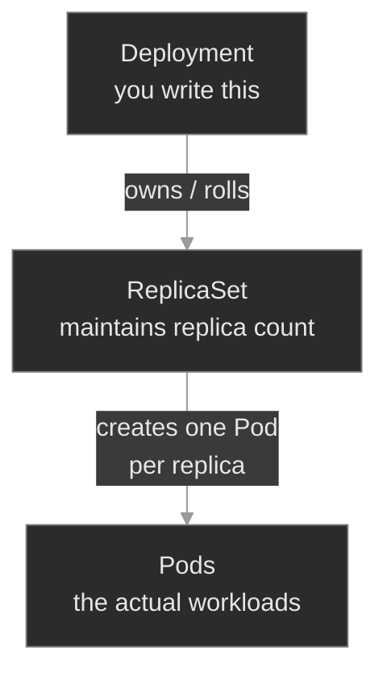

This **owner chain** matters for diagnosis. When a controller fails to create something, the failure event attaches to the *creator*, not to the thing that wasn't created. That's why `kubectl describe pod` shows nothing for a Pod that never got created — you must `kubectl describe rs` or `kubectl get events -n <ns>` instead. You'll exercise this exact instinct in `breakfix-03`. The same shape applies to other owner chains you'll meet later (`CronJob → Job → Pod`, `PVC → PV → StorageClass`).

A Deployment is a contract: "always have N replicas of this Pod template running." A controller reads the spec ("3 replicas"), reads the status ("2 ready"), and acts ("create one more"). Delete a Pod and the ReplicaSet controller creates a new one within seconds. Change the template and the Deployment controller runs a rolling replacement.

This is the difference between Kubernetes and a configuration management tool. You describe outcomes, not steps. You don't tell Kubernetes "start a container, wait for it, check it." You tell it "there should be a thing that looks like this." Controllers handle the rest, forever, on every cluster<sup><a href="https://kubernetes.io/docs/concepts/architecture/controller/">[4]</a></sup>.

#### How kubectl talks to the cluster

##### kubectl is a thin client

When you run `kubectl get pods -n admin-portal`, kubectl:

1. Reads your kubeconfig (typically `~/.kube/config`)
2. Resolves the current context: which cluster, which user, which default namespace
3. Builds an HTTPS request: `GET /api/v1/namespaces/admin-portal/pods`
4. Authenticates with the credential the context specifies (cert, token, OIDC, exec plugin)
5. Receives JSON, formats it as a table, prints it<sup><a href="https://kubernetes.io/docs/reference/kubectl/">[3]</a></sup>

That's it. `kubectl describe` does the same and also fetches related objects (events sharing the same UID, owner-reference chains) and pretty-prints them. `kubectl apply` is a `PATCH` with server-side apply semantics. `kubectl logs` proxies through the API server to `/log` on the kubelet.

The implication for diagnosis: when `kubectl` returns weird output, the first question is "what API call did it make, and what did the server say?" Add `-v=6` to any command and you'll see the raw URLs and status codes:

```bash
kubectl get pods -n admin-portal -v=6
```

<details>
<summary>📖 Going deeper: how <code>kubectl</code> authenticates<sup><a href="https://kubernetes.io/docs/concepts/security/controlling-access/">[5]</a></sup></summary>

The `users` block in your kubeconfig defines the credential. Four common shapes:

- **Client certificate** (`client-certificate` / `client-key`) — most common in local clusters (kubeadm bootstraps an admin cert for you).
- **Bearer token** (`token`) — service accounts use these; you'll see them when running pods that talk to the API.
- **OIDC** (`auth-provider: oidc` or, modern, `exec` plugin invoking an OIDC helper) — most cloud K8s offerings (EKS, GKE, AKS) authenticate human users this way against a corporate IdP.
- **Exec plugin** (`exec:`) — kubeconfig calls an external binary (`aws eks get-token`, `gke-gcloud-auth-plugin`, etc.) which prints a fresh token to stdout. Lets cloud providers do short-lived credentials without you noticing.

When a cluster says "Unauthorized" and the cert hasn't expired, the most common culprit is an exec plugin that can't find its dependency on `$PATH`.

</details>

##### Common kubectl idioms — what you'll type day-to-day

Eight verbs and a handful of flags carry you through 90% of routine work:

| Verb | Use |
|---|---|
| `get` | List objects — "what's there?" |
| `describe` | Pretty-print one object + its recent events |
| `logs` | Stream a container's stdout/stderr |
| `exec` | Run a command inside a running container |
| `apply` | Create or update from a manifest — the GitOps verb |
| `edit` | Open the live object in `$EDITOR`, save to apply — triage only |
| `delete` | Remove an object (cascades to dependents by default) |
| `port-forward` | Tunnel a local port to a Pod or Service |

Flags you'll combine endlessly: `-n <ns>`, `-A`, `-l key=value`, `-o wide` / `-o yaml` / `-o json`, `--watch`, `-f` (follow logs), `-c <container>`, `--previous`.

**`edit` vs `apply`:** `edit` is triage (opens live object, applies on save, diverges from GitOps); `apply` is declarative (three-way merge against your manifest, same operation Flux/Argo run). Change the manifest in git → `apply` for anything persistent. Read-only commands are safe anywhere; state-changing commands need a context check first — `breakfix-01` shows what happens when you skip it.

##### Asking the cluster what it knows — `api-resources` and `explain`

Two self-help commands that pay for themselves the first day on an unfamiliar cluster.

`kubectl api-resources` lists every Kind the cluster knows about — built-in (`Pod`, `Deployment`, `Service`) plus any custom resources installed by CRDs or operators<sup><a href="https://kubernetes.io/docs/reference/kubectl/">[3]</a></sup>. Useful filters:

```bash
kubectl api-resources --api-group=apps      # apps/v1 group: Deployment, StatefulSet, DaemonSet, ReplicaSet
kubectl api-resources --namespaced=false    # cluster-scoped only (Nodes, PVs, ClusterRoles, …)
```

`kubectl explain` prints the built-in schema docs for any resource or field<sup><a href="https://kubernetes.io/docs/reference/kubectl/">[3]</a></sup> — beats tab-completing through YAML or grepping for field names:

```bash
kubectl explain pod.spec.containers.livenessProbe
kubectl explain deployment.spec --recursive   # every nested field, no descriptions
```

Field-level coverage depends on whether the resource author wrote docstrings. Core resources are well-documented; some third-party CRDs aren't. When `--recursive` returns the field tree but per-field descriptions are blank, the CRD author skipped the docs.

<details>
<summary>📖 Going deeper: server-side apply — why <code>kubectl apply</code> surprises you<sup><a href="https://kubernetes.io/docs/reference/using-api/server-side-apply/">[6]</a></sup></summary>

`kubectl apply` doesn't simply overwrite the object. It does a three-way merge: the live state on the server, the previous applied configuration (stored in an annotation in older versions; tracked by `managedFields` since 1.22), and your new configuration<sup><a href="https://kubernetes.io/docs/reference/using-api/server-side-apply/">[6]</a></sup>. Fields you removed from your YAML get removed from the live object. Fields you didn't touch are left alone.

Two surprises you'll hit eventually:

- **Conflict errors** when another field manager (a different tool, a controller, or a previous `kubectl edit`) owns a field you're trying to set. The fix is either `--force-conflicts` (you take ownership) or coordinating with whoever owns the field.
- **Disappearing fields** when you apply a YAML that omits a field someone else (or a controller) added. Server-side apply remembers who set what; if you used to set it, removing it from your YAML deletes it from the object.

This is why GitOps tools that own a manifest end-to-end (Flux, Argo CD) avoid most of these — they're the single field manager. You'll meet that pattern in M18.

</details>

##### Reading the API: jsonpath, custom-columns, jq

Every Kubernetes object is JSON under the hood. Three tools pull specific fields out:

| You want… | Reach for | Example |
|---|---|---|
| One field | `-o jsonpath` | `kubectl get deploy foo -o jsonpath='{.spec.replicas}'` |
| A quick table | `-o custom-columns` | `kubectl get pods -A -o custom-columns=NS:.metadata.namespace,NAME:.metadata.name,NODE:.spec.nodeName` |
| Filter / transform | `\| jq` | `kubectl get pods -A -o json \| jq '.items[] \| select(.spec.nodeName == "n1")'` |

jsonpath ships with `kubectl`; jq is the de facto JSON query tool and handles `select`, `map`, `group_by`, and string composition that jsonpath can't. The `{range .items[*]}…{end}` template is the most useful pattern in jsonpath.

<details>
<summary>📖 Going deeper: <code>-l</code> vs <code>--field-selector</code> vs <code>jq</code> — three ways to filter</summary>

Three filtering mechanisms with very different cost:

- **`-l key=value`** (label selector) — server-side, labels indexed, cheapest. Use whenever you can.
- **`--field-selector status.phase=Pending`** — server-side but limited. Selectable fields are a small set per resource (commonly `metadata.name`, `metadata.namespace`, `spec.nodeName`, `status.phase`).
- **`jq '.items[] | select(...)'`** — client-side. You fetched ALL objects; jq filtered after. Slow on large clusters, but works for any condition.

Prefer labels → field selectors → jq, in that order. If you're jq-filtering by something that could be a label, add the label.

</details>

#### How to ask questions when something's wrong

##### The canonical diagnostic loop

When something is wrong, you reach for the same four commands in the same order:

```text
1. kubectl get <kind> -n <ns>           what's there? current phase?
   |
   v
2. kubectl describe <kind> <name> -n <ns>   what happened to it?
   |                                        events filtered to this object's UID
   v
3. kubectl get events -n <ns>           what's happening in the neighborhood?
   --sort-by='.lastTimestamp'           (events on other objects you didn't think to describe)
   |
   v
4. kubectl logs <pod> [-c <ctr>] -n <ns>    what does the app itself say?
   [--previous if crashed]
```

This loop is the foundation. If you do nothing else from this module, internalize it. Almost every problem in later modules — broken Services, scheduling failures, OOMKills, image pull errors, PVC binding issues — surrenders to this loop, in order.

`get` tells you *what's there.* `describe` tells you *what happened to it.* `events` tells you *what's happening in the neighborhood.* `logs` tells you *what the app thinks.*

The most common skipped step is `events`. Many problems have an answer that's plain text in `kubectl get events --sort-by='.lastTimestamp'` and learners never run it.

##### Cluster-wide situational awareness

When you don't know which namespace something is in, pivot to cluster-wide before zooming in:

```bash
kubectl get pods -A                                                                    # everything, everywhere
kubectl get pods -A --field-selector=status.phase!=Running,status.phase!=Succeeded     # only the unhappy ones (excludes Completed)
kubectl get events -A --sort-by='.lastTimestamp' | tail -50                            # recent activity, cluster-wide
```

> Why `!=Succeeded`? A Pod's `status.phase` has five values: `Pending`, `Running`, `Succeeded`, `Failed`, `Unknown`. `Succeeded` is a *good* terminal state (typical of Job/CronJob pods that finished cleanly). Filtering only `!=Running` would lump Completed pods in with the broken ones. In labs you'll also see this with `local-path-provisioner` helper pods that exit `Succeeded` after binding a PVC.

The `-A` flag (alias of `--all-namespaces`) is your friend whenever you're triaging an unfamiliar situation. The first command for "something is broken somewhere on the cluster" is always `kubectl get pods -A`.

#### Knowing where you're pointed

##### Contexts and namespaces

```bash
kubectl config get-contexts                                       # list known contexts
kubectl config current-context                                    # which cluster am I on?
kubectl config set-context --current --namespace=admin-portal     # set default ns
```

The most embarrassing class of incident in a multi-cluster shop is running a state-changing command against the wrong cluster. Always run `current-context` before any apply/patch/delete on production. Better: customize your shell prompt to display the current context, or use a tool like `kubectx` / `kubens` / `kubeswitch` so the active cluster is always visible.

### Hands-on

The M00 module has four scenarios. Each is a separate Killercoda environment provisioned with the full Polyphone fleet. Work them in order — each one stresses a different instinct from this lesson.

- **`baseline/`** — A guided tour of a healthy cluster. Cluster anatomy, the Polyphone fleet, common `kubectl` idioms, JSON unpacking with jsonpath/jq, and the diagnostic loop applied to a healthy workload. No fix required; the point is to internalize the patterns.
- **`breakfix-01-context-blindness/`** — `kubectl get pods` returns "No resources found." It looks like the cluster is empty. Tests the suspect-your-view-first instinct: read the error message, run `-A`, check `kubectl config view --minify` before assuming the cluster is broken. The simplest instinct, taught first.
- **`breakfix-02-namespace-blindness/`** — An alert fires with no namespace hint. Tests the `kubectl get pods -A` instinct: when you don't know where a problem lives, scan cluster-wide *before* zooming in.
- **`breakfix-03-event-only-failure/`** — A Deployment is short a replica, but every existing Pod looks fine and `describe pod` shows nothing. Tests the climb-the-owner-chain instinct: when the Pod-level loop comes up empty, the event lives on the controller that tried (and failed) to create the Pod.

After each scenario, check yourself against `ANSWER-KEY.md` — it walks through the canonical diagnostic path, names the instinct under test, and contrasts the production fix (GitOps source of truth) with the immediate triage fix.

### Common failure modes

| Symptom | Likely cause | Where to look |
|---------|--------------|---------------|
| `kubectl get pods` returns nothing | Wrong default namespace or wrong context | `kubectl config get-contexts`, then retry with `-A` |
| `describe` shows nothing useful | You're describing the wrong kind — the event is on the owning controller (ReplicaSet, Job) | `kubectl get events -n <ns>`, `kubectl describe rs/deploy` |
| `kubectl logs` returns nothing or "previous terminated" | Container hasn't started, or just got replaced | `--previous`; `describe` for `Last State` |
| `kubectl apply` succeeds but nothing changes | Applied to the wrong context, or another field manager owns the field | `current-context`; `kubectl get -o yaml` and inspect `managedFields` |
| Commands work for you, not a teammate | Different kubeconfig contexts pointing at different clusters | Compare `current-context` between the two terminals |

### Recap

- The control plane decides what should run; nodes run it. The API server is the only thing that talks to etcd; everything else, including `kubectl`, goes through the API server.
- `kubectl` is a thin HTTPS client. Every command is an API call. `-v=6` shows the exact request.
- Every object has the same `spec` (what you want) / `status` (what is) shape. When something's wrong, the gap between the two is where the answer lives.
- Controllers reconcile spec to status continuously. You describe outcomes; they handle the steps.
- The diagnostic loop is `get → describe → events → logs`, in order. When you don't know *where* to look, scan cluster-wide with `-A` first. `events` is the most-skipped step and often the fastest path to the answer.

### Production thinking

- A 5,000-pod cluster makes `kubectl get pods -A` return 5,000 lines. How do you triage at that scale? (`--field-selector`, `jq`, dashboards.)
- The diagnostic loop assumes the API server is reachable. If you're paged and the API server itself is down, what do you check first?
- You've spent 20 minutes in `prod-us-east-1`. You now need to change something in `lab-us-east-1`. What's the workflow that makes a wrong-cluster mistake impossible? (Prompt customization, separate terminals, `kubeswitch`, named windows.)

### References

1. Kubernetes Components — https://kubernetes.io/docs/concepts/overview/components/
2. Kubernetes Objects — https://kubernetes.io/docs/concepts/overview/working-with-objects/
3. kubectl Reference — https://kubernetes.io/docs/reference/kubectl/
4. Controllers — https://kubernetes.io/docs/concepts/architecture/controller/
5. Controlling Access to the Kubernetes API — https://kubernetes.io/docs/concepts/security/controlling-access/
6. Server-Side Apply — https://kubernetes.io/docs/reference/using-api/server-side-apply/
7. Namespaces — https://kubernetes.io/docs/concepts/overview/working-with-objects/namespaces/
8. Garbage Collection — https://kubernetes.io/docs/concepts/architecture/garbage-collection/


---

## Break/Fix Practice

## Break/fix 01 — Context Blindness

**Symptom — what you'd actually see:**

Alert fires that Polyphone workloads are degraded. You run `kubectl get pods` and get back:

```text
No resources found in default namespace.
```

The cluster appears empty. But the alert says workloads are unhealthy. Something doesn't add up.

**Think about this before you open the answer:**

- Did you reach for `kubectl get pods -A` BEFORE assuming the cluster was broken? That single command separates "view is wrong" from "cluster is wrong" in 2 seconds.
- Did you read the error message carefully? `"No resources found in default namespace"` literally told you the scope.
- Do you know `kubectl config current-context` (which cluster/user/namespace combo is active) and `kubectl config view --minify` (the full settings)?

The anti-pattern: assume the cluster is broken, start poking at individual workloads, waste 15 minutes before noticing the prompt says you're in the wrong place.

<details>
<summary><b>Click to reveal: diagnostic commands, root cause, exact fix, verify</b></summary>

**Root cause:**

The kubeconfig's default namespace is set explicitly to `default` (which is empty — Polyphone workloads all live in named namespaces like `app-services`, `media`, etc.). The cluster is fully healthy; the operator's *view* of it is misconfigured<sup><a href="https://kubernetes.io/docs/tasks/access-application-cluster/configure-access-multiple-clusters/">[1]</a></sup>.

**Diagnostic commands (run in this order):**

```bash
# 1. FIRST move: confirm the cluster isn't actually broken
kubectl get pods -A
# The cluster is fully populated. So the issue is with your view.

# 2. Re-read the original error message carefully
#    "No resources found in default namespace."
#    kubectl is telling you exactly where it looked

# 3. Confirm what your kubeconfig says
kubectl config current-context
kubectl config view --minify
# Shows context's namespace: default
kubectl config get-contexts
# The * row's NAMESPACE column also shows default
```

**Exact fix:**

```bash
# Scope to a workload namespace. The fleet has 10 named namespaces
# (app-services, media, signaling, admin-portal, analytics, …) — pick
# whichever fits the task at hand.
kubectl config set-context --current --namespace=app-services
```

**Verify:**

```bash
kubectl config view --minify | grep namespace:
# namespace: app-services  (or whichever you set)
kubectl get pods
# Shows the namespace's workloads — visible proof the cluster was
# always healthy, your view was scoped wrong.
```

**Production thinking:**

Three operational practices that make this class of incident impossible:

1. **Shell prompt customization** — show `<context>:<namespace>` in your prompt at all times (e.g., [kube-ps1](https://github.com/jonmosco/kube-ps1)). If you can see "prod-us-east-1:default" in your prompt, you'll never get surprised by a misconfigured scope.
2. **Separate terminals per environment** — don't share a terminal between prod and lab. Different windows, different colors, different tmux sessions. Make context-switching require deliberate action.
3. **Read-only contexts for prod by default** — kubeconfig maps prod to a read-only user; switching to write-capable is a deliberate, separate action. Cuts wrong-cluster mutations to near-zero.

</details>

---

## Break/fix 02 — Namespace Blindness

**Symptom — what you'd actually see:**

An alert fires: "Polyphone fleet — one or more workloads degraded." No namespace, no workload name, no hint about what's wrong.

**Think about this before you open the answer:**

The lesson is not fixing an image typo — that's trivial. The lesson is **finding the broken thing without being told where**. Self-grading questions:

- Did your first command include `-A`? That's the single biggest separator between strong and weak diagnostic flow.
- Did you reach for `kubectl get events -A --sort-by='.lastTimestamp'`? That command surfaces the failure as plain text in seconds. If you found the problem without it, fine — but build the habit, because some failures are event-only (the Pod shows no symptom; the event on the owning ReplicaSet does).
- Did you open one namespace at a time, hoping to guess right? That's the anti-pattern. It scales linearly with cluster size and feels productive while wasting minutes.

<details>
<summary>📖 Going deeper: <code>--field-selector</code> is the senior's <code>grep</code><sup><a href="https://kubernetes.io/docs/concepts/overview/working-with-objects/field-selectors/">[3]</a></sup></summary>

`kubectl get pods -A` returns everything. Real clusters have thousands of Pods; that output is unreadable. Three flags make it tractable:

- `--field-selector=status.phase!=Running,status.phase!=Succeeded` — only the unhappy ones (`Succeeded` is a good terminal state for Job/CronJob pods and for some lab helpers like `local-path-provisioner`)
- `--field-selector=spec.nodeName=<node>` — only Pods on a specific node (useful when triaging a node-level issue)
- `-o jsonpath='...'` — extract only the field you care about

Combine them:

```bash
# All non-Running pods cluster-wide, with their namespace and phase
kubectl get pods -A --field-selector=status.phase!=Running,status.phase!=Succeeded \
  -o custom-columns=NS:.metadata.namespace,NAME:.metadata.name,PHASE:.status.phase
```

The list of selectable fields per resource is limited (Kubernetes doesn't index every field for selection)<sup><a href="https://kubernetes.io/docs/concepts/overview/working-with-objects/field-selectors/">[3]</a></sup>. The most useful set: `metadata.name`, `metadata.namespace`, `spec.nodeName`, `status.phase`. Everything else needs `jq` or jsonpath on the output.

</details>

<details>
<summary><b>Click to reveal: diagnostic commands, root cause, exact fix, verify</b></summary>

**Root cause:**

The `metrics-aggregator` Deployment in the `analytics` namespace has its container image set to `nginx:doesnotexist-1.25-foobar`. Pods are stuck in `ImagePullBackOff` — the kubelet's status for "I tried to pull this image, the registry said no, and I'm now backing off retries"<sup><a href="https://kubernetes.io/docs/concepts/containers/images/#imagepullbackoff">[2]</a></sup>.

**Diagnostic commands (run in this order):**

```bash
# 1. Scan cluster-wide — the M00 instinct
kubectl get pods -A
# One workload stands out: STATUS = ImagePullBackOff or ErrImagePull, namespace = analytics
```

```bash
# 2. OR sort events cluster-wide — often faster
kubectl get events -A --sort-by='.lastTimestamp' | tail -30
# "Failed to pull image" events bubble to the bottom
```

```bash
# 3. Zoom in
kubectl describe pod -n analytics -l app=metrics-aggregator
# Events section: Failed to pull image "nginx:doesnotexist-1.25-foobar"
```

**Exact fix:**

```bash
# Option A: kubectl set image (one-liner; good for the immediate recovery)
kubectl set image deployment/metrics-aggregator app=nginx:1.25 -n analytics

# Option B: kubectl edit (good when you want to inspect the whole manifest)
kubectl edit deployment metrics-aggregator -n analytics
# Change spec.template.spec.containers[0].image to nginx:1.25
```

**Verify:**

```bash
# -w watches until you Ctrl-C; the new Pod transitions through Pending -> Running
kubectl get pods -n analytics -w
```

When done, confirm the fleet is back to green:

```bash
kubectl get pods -A -l plane --field-selector=status.phase!=Running --no-headers | wc -l
# Expect 0 (or a brief transient as old ReplicaSets clean up).
# `-l plane` scopes to Polyphone workloads; otherwise `-A` also surfaces
# cluster-service helpers in `Succeeded` phase, which inflates the count.
```

**Production thinking:**

`kubectl set image` is a bandaid. It works, but the change isn't reflected in your GitOps source of truth. On the next Flux reconciliation, the cluster could drift back to the broken state — or worse, your fix gets reverted when an unrelated PR merges. The production fix:

1. Triage with `kubectl set image` to stop the bleeding.
2. Open a PR to `platform-gitops` correcting the manifest.
3. Let Flux re-apply the corrected manifest, eliminating the out-of-band fix.
4. Post-mortem: how did the bad image tag merge in the first place? Should CI block deployments referencing non-existent images?

`kubectl` changes are temporary unless the source of truth agrees. You'll meet Flux and the GitOps loop in M18. For now, take away the principle.

</details>

---

## Break/fix 03 — Event-Only Failure

**Symptom — what you'd actually see:**

Alert fires that `port-processor` Deployment in `number-porting` is short a replica (`desired=3, available=2`). The pods that exist are `Running`, `1/1 READY`. `kubectl describe pod` shows nothing wrong.

**Think about this before you open the answer:**

- Did you reach for `kubectl get events` or `kubectl describe rs` when pod-level checks came up empty? That's the climb-the-owner-chain instinct.
- Did you recognize that `kubectl describe pod` can only show events on Pods? When the failure is "the Pod never got created in the first place," the event lives on whoever tried to create it (the ReplicaSet).
- Did you stop to ask "should I raise the quota or reduce replicas?" instead of mechanically running one fix? Quotas exist for a reason; the production answer depends on whether the quota was wrong or the replica count was wrong.

<details>
<summary><b>Click to reveal: diagnostic commands, root cause, exact fix, verify</b></summary>

**Root cause:**

The namespace's `ResourceQuota` caps total pods at 2, but the Deployment wants 3. The Pod that can't be created produces a `FailedCreate` event on the **ReplicaSet** (not on any Pod, because there's no Pod to attach the event to)<sup><a href="https://kubernetes.io/docs/concepts/workloads/controllers/replicaset/">[4]</a></sup>.

**Diagnostic commands (run in this order):**

```bash
# 1. Confirm the gap
kubectl get deploy port-processor -n number-porting
# READY 2/3 — the Deployment is unsatisfied

# 2. Pods themselves are fine
kubectl get pods -n number-porting
kubectl describe pod -n number-porting -l app=port-processor
# Nothing wrong with the 2 pods that exist

# 3. Climb the owner chain
kubectl describe rs -n number-porting -l app=port-processor
# Events: FailedCreate ... pods "..." is forbidden: exceeded quota
```

```bash
# Shortcut: events surface this in seconds
kubectl get events -n number-porting --sort-by='.lastTimestamp'
# Same FailedCreate event, no chain-climbing required
```

```bash
# Confirm the quota
kubectl get resourcequota -n number-porting
# NAME        REQUEST     LIMIT   AGE
# pod-limit   pods: 2/2           ...   <- used/hard for pods. The deployment wants 3.

# For the full breakdown (used, hard, scopes), use describe:
kubectl describe resourcequota pod-limit -n number-porting
# Resource  Used  Hard
# pods      2     2
```

**Fix (two valid options):**

```bash
# Option A: raise the quota to match demand (use when 3 replicas was the intended count)
# Set to 3 — exactly what the Deployment needs, no headroom. Adding headroom is a
# capacity-planning question, not a triage one; do it via PR with justification.
kubectl patch resourcequota pod-limit -n number-porting --type=merge \
  -p '{"spec":{"hard":{"pods":"3"}}}'

# Option B: reduce replicas (use when 2 was the intended count)
kubectl scale deployment port-processor --replicas=2 -n number-porting
```

**Exact fix:**

**Verify:**

```bash
kubectl get deploy port-processor -n number-porting
# READY 3/3 (option A) or 2/2 (option B)
kubectl get events -n number-porting --sort-by='.lastTimestamp' | tail -5
# Should now show SuccessfulCreate, not FailedCreate
```

<details>
<summary>📖 Going deeper: the ReplicaSet didn't heal — what now?<sup><a href="https://kubernetes.io/docs/concepts/workloads/controllers/replicaset/">[4]</a></sup></summary>

A common gotcha after fixing the quota: you patch `hard: pods: "3"`, you confirm the new value with `kubectl get resourcequota`, and the deployment is **still** stuck at `READY 2/3`. Fresh events still show `limited: pods=2`.

Two things to check:

1. **Is the event actually fresh?** Sort by `lastTimestamp` and look at the timestamp on the latest `FailedCreate`. If it's minutes old, it's stale — the message text was frozen when the event fired and isn't re-evaluated. Events stick around for ~1 hour by default.

2. **Is the ReplicaSet on its backoff timer?** If spacing between `FailedCreate` events looks like `30s → 1m → 2m → 4m → 8m`, the ReplicaSet controller is doing exponential backoff on pod creation. It doesn't watch the quota; it's just waiting for its next retry window. The deployment can sit at 2/3 for ~15 minutes before the controller tries again on its own.

Three nudges, in order of cleanliness:

```bash
# A. Rollout restart — creates a NEW ReplicaSet with zero backoff history.
kubectl rollout restart deployment/port-processor -n number-porting

# B. Scale-down/scale-up — resets the gap to 0, forces a fresh evaluation.
kubectl scale deploy/port-processor --replicas=2 -n number-porting && \
kubectl scale deploy/port-processor --replicas=3 -n number-porting

# C. Delete a healthy pod — the RS reconciles on the delete (no backoff path).
kubectl delete pod -n number-porting -l app=port-processor --limit=1
```

The teaching point: **fixing the root cause doesn't always heal the workload automatically.** Controllers with backoff need a kick. This is one of the most common reasons `kubectl rollout restart` exists in an SRE's muscle memory — it's not just for picking up new ConfigMap values, it's also for breaking controllers out of failure-retry loops after you've removed the underlying obstacle.

</details>

**Production thinking:**

`ResourceQuota` is a guardrail. Raising it to bypass a failure trains the wrong instinct — eventually quotas don't constrain anything. The real fix lives in `platform-gitops`: either justify the higher quota via PR (capacity review, cost) or revert the replica change that triggered the breach. `kubectl patch` is triage; Flux will overwrite it on next reconciliation unless the source of truth agrees.

</details>

---


---

# `m01-workloads-i/`

## Concept

## M01 — Workloads I: Pods, Deployments, ReplicaSets

> What a Pod actually is, how its lifecycle works, how the three probes decide "alive" and "ready," and why graceful shutdown is the difference between a clean rollout and dropped calls.

### What you'll learn

- Describe the Pod lifecycle — phases, container states, and how `restartPolicy` drives restarts
- Distinguish the three probes — liveness, readiness, startup — by what each one decides and what failing each one does
- Trace the Deployment → ReplicaSet → Pod owner chain and explain what declarative reconciliation buys you
- Diagnose a `CrashLoopBackOff` and tell a real crash apart from a self-inflicted liveness loop
- Configure graceful shutdown so in-flight work drains instead of being killed mid-flight
- Explain why the Pod — not the container — is the unit of scheduling, and where init, sidecar, and ephemeral containers fit

### Why it matters

A Pod is the unit you actually operate. Every later module — Services, storage, scheduling, security — is ultimately about getting Pods to run, stay healthy, and shut down cleanly. The mistakes that page you at 3am are rarely exotic: a liveness probe pointed at a path the app doesn't serve, restarting a perfectly healthy container into a crash loop. A readiness probe on the wrong port, quietly pulling every replica out of rotation while the Pods themselves look fine. A `terminationGracePeriodSeconds` too short for the drain, so every rollout sheds a few live calls.

At Polyphone these are not hypotheticals. `session-broker` holds in-flight media sessions; kill it without draining and customers hear their calls drop. `sip-app` sits behind a Service; mark it not-ready and the Service has nowhere to route. The probes and the shutdown sequence are the controls that decide whether a routine deploy is invisible to customers or shows up on the status page. This module is where you learn to read and set them.

### Scope

**Covers:** the Pod lifecycle (phases, container states, `restartPolicy`, `CrashLoopBackOff`), the three probes and their distinct jobs, the Deployment → ReplicaSet → Pod controller chain and declarative reconciliation, graceful termination (`SIGTERM`, `preStop`, `terminationGracePeriodSeconds`), and the shape of a multi-container Pod (init, sidecar, and ephemeral containers, including native sidecar containers).

**Doesn't cover:** rollout strategy tuning and rollbacks in depth (M09), Services and how readiness feeds Endpoints in depth (M04 — touched here because readiness only makes sense alongside it), images and pull semantics (M02), Jobs and CronJobs (M01b), StatefulSets and DaemonSets (M07), scheduling and resources (M06), the service mesh that popularizes sidecars (M15 — here you learn the Pod-level mechanic, not the mesh).

**Assumes:** you finished M00 — the `spec`/`status` model, the `get → describe → events → logs` loop, and the owner-chain idea (a controller's failure event lands on the controller, not the thing it failed to create). You know a container is a packaged process.

### Vocabulary

| Term | Definition |
|------|------------|
| **Pod** | The smallest deployable unit. One or more containers sharing a network namespace (one IP), volumes, and a lifecycle. |
| **Pod phase** | The high-level lifecycle state in `status.phase`: `Pending`, `Running`, `Succeeded`, `Failed`, `Unknown`. |
| **Container state** | The per-container state inside a Pod: `Waiting`, `Running`, `Terminated`. Finer-grained than the Pod phase. |
| **restartPolicy** | Pod-level rule for restarting containers that exit: `Always` (default), `OnFailure`, `Never`. Deployments require `Always`. |
| **CrashLoopBackOff** | Not a crash itself — the kubelet's state for "this container keeps exiting, so I'm waiting (with exponential backoff) before restarting it again." |
| **Liveness probe** | Decides whether a container is alive. On failure the kubelet **restarts** the container. |
| **Readiness probe** | Decides whether a container can serve traffic. On failure the Pod is **removed from Service Endpoints** — no restart. |
| **Startup probe** | Protects slow-starting containers. Liveness and readiness checks are suppressed until it succeeds once. |
| **Probe handler** | How a probe checks: `httpGet` (2xx/3xx = pass), `tcpSocket` (connect = pass), `exec` (exit 0 = pass), `grpc`. |
| **Deployment** | Controller for stateless, fungible Pods. Owns a ReplicaSet; runs rolling updates when the Pod template changes. |
| **ReplicaSet** | Controller that maintains a target replica count. Created and rolled by the Deployment — you rarely write one yourself. |
| **Reconciliation** | The control loop: read `spec`, read `status`, act to close the gap. Continuous, not one-shot. |
| **preStop hook** | A command or HTTP call the kubelet runs **before** `SIGTERM`, inside the grace period. Used to drain connections. |
| **terminationGracePeriodSeconds** | How long the kubelet waits after starting termination before sending `SIGKILL`. Default 30. Bounds `preStop` + `SIGTERM` handling. |
| **Init container** | A container that runs to completion before the app containers start. Sequential; used for setup/wait-for-dependency. |
| **Ephemeral container** | A throwaway container injected into a running Pod for debugging (`kubectl debug`). No probes, no restarts. |
| **Sidecar container** | A helper that runs alongside the app for the Pod's whole life (proxy, log shipper, config reloader). The native form is an init container with `restartPolicy: Always`. |

### Mental model

A Pod moves through **phases**, but the phase is coarse. The fine-grained truth lives in **container states** and the **conditions** (`PodScheduled`, `Initialized`, `ContainersReady`, `Ready`). Probes are the inputs that flip the `Ready` condition and trigger restarts; `restartPolicy` decides what a container exit means. Hold this picture: the phase tells you roughly where the Pod is; the container state and conditions tell you *why*.

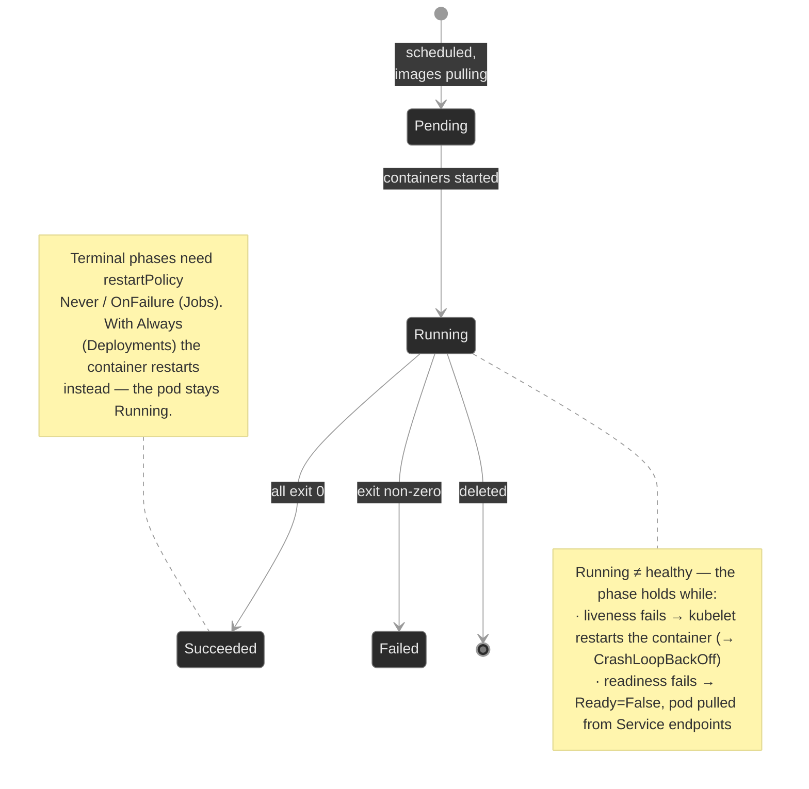

The load-bearing insight for this module: **a `Running` phase does not mean healthy.** A Pod can be `Running` and `0/1 READY` for an hour because its readiness probe fails. A Pod can be `Running` with 47 restarts because its liveness probe keeps killing it. The phase is the headline; the probes and container state are the story.

### Concept walkthrough

The walkthrough follows the life of a Pod: who creates it, how it lives, how its health is judged, and how it dies.

#### Who creates the Pod — declarative reconciliation

You don't create Pods directly. You write a Deployment, and a chain of controllers turns that into running Pods<sup><a href="https://kubernetes.io/docs/concepts/workloads/controllers/deployment/">[1]</a></sup>:


A Deployment is a contract: "always keep N copies of this Pod template running." The Deployment controller owns a ReplicaSet; the ReplicaSet controller keeps exactly N Pods alive<sup><a href="https://kubernetes.io/docs/concepts/workloads/controllers/replicaset/">[2]</a></sup>. Delete a Pod and the ReplicaSet makes a new one within seconds. Change the Pod template — a new image, a fixed probe — and the Deployment creates a *new* ReplicaSet and shifts replicas over: a **rolling update**.

This is why the owner chain matters for diagnosis (the M00 instinct): when a Pod can't be created, the failure event lands on the ReplicaSet, not on a Pod that doesn't exist. And it's why `kubectl edit`-ing a live Pod is almost always wrong — the ReplicaSet will replace it and your change vanishes. Edit the Deployment; let it roll.

#### The workload-controller family

Deployment is one of several controllers that manage Pods. They split cleanly by what they depend on, which is also the order you'll learn them:

| Controller | Use when | Where it's taught |
|------------|----------|-------------------|
| **ReplicaSet** | Never write one directly — a Deployment owns it | M01 (this module) |
| **Deployment** | Stateless, fungible Pods; rolling updates | M01 (this module) |
| **Job** | Run-to-completion batch work | M01b — Workloads: Batch |
| **CronJob** | Scheduled / recurring batch work | M01b — Workloads: Batch |
| **StatefulSet** | Stable identity + per-Pod storage + ordered start/stop | M07 (needs Services M04 + Storage M05) |
| **DaemonSet** | Exactly one Pod per node (node-local agents) | M07 (needs Scheduling M06) |

The first four — Deployment, ReplicaSet, Job, CronJob — need only the Pod lifecycle you're learning here, so they live in the "Workloads I" cluster (this module plus M01b). StatefulSets and DaemonSets are deferred to M07 because they only make sense once you've met headless Services (M04), PersistentVolumes (M05), and Scheduling (M06) — they're the *payoff* of those modules, not a prerequisite for them.

#### How the Pod lives — phases, states, and restartPolicy

`status.phase` is the coarse view. Underneath, each container is `Waiting`, `Running`, or `Terminated`, and `describe` shows the reason — `ContainerCreating`, `CrashLoopBackOff`, `Completed`, `Error`, `OOMKilled`<sup><a href="https://kubernetes.io/docs/concepts/workloads/pods/pod-lifecycle/">[3]</a></sup>.

When a container exits, `restartPolicy` decides what happens. It's set per Pod and applies to all containers:

- **`Always`** (the default, and the only value a Deployment allows) — restart on any exit, success or failure.
- **`OnFailure`** — restart only on non-zero exit. Used by Jobs (M07).
- **`Never`** — never restart; the Pod goes to `Succeeded` or `Failed`.

Restarts aren't instant. The kubelet backs off exponentially — 10s, 20s, 40s, … capped at 5 minutes — and a container stuck in that cycle reports `CrashLoopBackOff`<sup><a href="https://kubernetes.io/docs/concepts/workloads/pods/pod-lifecycle/#restart-policy">[3]</a></sup>. Read the name precisely: `CrashLoopBackOff` is not the crash. It's the kubelet *waiting between restart attempts*. The crash reason is one level down, in the container's last state:

```bash
kubectl describe pod <pod> -n <ns>        # in Containers:, read the Last State: block — Reason, Exit Code
kubectl logs <pod> -n <ns> --previous     # what the dead container said before it died
```

`--previous` is the key flag: the current container may have just started, so its logs are empty; `--previous` reads the *terminated* one that actually failed.

<details>
<summary>📖 Going deeper: is it really crashing, or is liveness killing it?<sup><a href="https://kubernetes.io/docs/tasks/configure-pod-container/configure-liveness-readiness-startup-probes/">[4]</a></sup></summary>

A `CrashLoopBackOff` has two very different root causes that look identical in `kubectl get pods`:

1. **The app genuinely crashes** — bad config, missing dependency, panic on startup. `kubectl logs --previous` shows the stack trace or error. Exit code is the app's.
2. **A liveness probe kills a healthy app** — the process is fine, but the probe checks something wrong (wrong port, a path that 404s, too tight a timeout), so the kubelet restarts it on a timer. `kubectl logs --previous` shows a *clean* log that just stops, and `kubectl describe pod` shows `Liveness probe failed` events with `Killing` right after.

The tell is in `describe`: a real crash shows `Last State: Terminated, Reason: Error` with the app's exit code and **no** liveness events. A liveness loop shows `Liveness probe failed: ...` followed by `Killing container with id ...`. Reading that distinction is the entire point of `breakfix-01`.

</details>

#### How health is judged — the three probes

Three probes, three different jobs. Confusing them is the most common probe mistake there is<sup><a href="https://kubernetes.io/docs/tasks/configure-pod-container/configure-liveness-readiness-startup-probes/">[4]</a></sup>.

| Probe | Question it answers | On failure | When you need it |
|-------|---------------------|------------|------------------|
| **liveness** | Is the process wedged and unrecoverable? | kubelet **restarts** the container | Deadlocks an app can't detect itself |
| **readiness** | Can this Pod serve traffic *right now*? | Pod **removed from Service Endpoints** (no restart) | Warm-up, loss of a dependency, backpressure |
| **startup** | Has a slow app finished booting? | container **killed** after `failureThreshold`; suppresses the other two until it passes | Apps with long, variable startup |

The distinction that matters most operationally is **liveness vs readiness**:

- A failing **liveness** probe is a *blunt* instrument — it restarts. If the cause isn't restart-fixable (a dependency is down), liveness turns a degraded service into a crash loop. **Default to no liveness probe, or a very conservative one.** Liveness should answer "this process is wedged and only a restart will help" — nothing else.
- A failing **readiness** probe is *gentle* — it pulls the Pod from rotation but leaves it running, so it can recover and rejoin. Lost a database connection? Fail readiness, keep the process, let the Service route elsewhere until it's back.

Every probe shares the same timing knobs: `initialDelaySeconds`, `periodSeconds`, `timeoutSeconds`, `successThreshold`, `failureThreshold`. A probe that's too aggressive (1s period, 1 failure threshold, tight timeout) will flap under normal load. Use a `startupProbe` for slow boots instead of inflating `initialDelaySeconds` on liveness — that's exactly what startup probes exist for<sup><a href="https://kubernetes.io/docs/tasks/configure-pod-container/configure-liveness-readiness-startup-probes/#define-startup-probes">[4]</a></sup>.

Readiness is the probe that ties into networking. A Service routes only to Pods whose `Ready` condition is true; a failed readiness probe drops the Pod from the Service's EndpointSlice and traffic stops arriving — even though the Pod is still `Running`. That's the "traffic blackhole" of `breakfix-02`: every replica `Running`, every replica `0/1 READY`, Service Endpoints empty, callers getting connection refused. (Services and Endpoints come in full in M04; here you only need the readiness → Endpoints link.)

#### How the Pod dies — graceful termination

Deletion is not instant, and it shouldn't be. When a Pod is deleted (directly, or because a rollout/scale-down is replacing it), the kubelet runs an ordered sequence<sup><a href="https://kubernetes.io/docs/concepts/workloads/pods/pod-lifecycle/#pod-termination">[3]</a></sup>:

```text
delete issued
   │
   ▼
Pod marked "Terminating"  →  dropped from Service Endpoints
                             (new traffic stops arriving)
   │
   ▼
┌─ terminationGracePeriodSeconds  (default 30s) ───────────────┐
│                                                              │
│ preStop hook runs (if defined)                               │
│       │                                                      │
│       ▼                                                      │
│ SIGTERM → PID 1   app should drain in-flight                 │
│                   work, then exit                            │
│       │                                                      │
│       ▼                                                      │
│ grace period expires                                         │
│                                                              │
└──────────────────────────────────────────────────────────────┘
   │
   ▼
SIGKILL (forced)  ─ container killed, pod object removed
```

Two controls shape this:

- **`preStop` hook** — a command or HTTP call the kubelet runs *before* `SIGTERM`<sup><a href="https://kubernetes.io/docs/concepts/containers/container-lifecycle-hooks/">[5]</a></sup>. The classic use is a short `sleep` to let load balancers and `kube-proxy` finish removing the Pod from rotation before the process starts refusing connections — endpoint removal and `SIGTERM` race otherwise.
- **`terminationGracePeriodSeconds`** — the total budget. `preStop` execution and `SIGTERM` handling both spend from it. If the budget is smaller than the drain takes, the kubelet sends `SIGKILL` mid-drain and in-flight work dies.

The failure mode: an app that needs, say, 15 seconds to finish in-flight sessions, behind a `terminationGracePeriodSeconds: 1`. The kubelet `SIGKILL`s it ~1 second in, every time it's replaced. Calls drop on every rollout. That's `breakfix-03` — and the fix is making the grace period exceed the real drain time, not removing the drain.

<details>
<summary>📖 Going deeper: the preStop / grace-period accounting<sup><a href="https://kubernetes.io/docs/concepts/workloads/pods/pod-lifecycle/#pod-termination">[3]</a></sup></summary>

The grace-period clock starts when termination begins and covers the **whole** sequence, `preStop` included. If your `preStop` sleeps 15s and `terminationGracePeriodSeconds` is 30, the app gets `SIGTERM` at ~15s and ~15s more to exit. If the grace period is 10, the kubelet kills the container while `preStop` is still sleeping — the hook is truncated and `SIGTERM` may never reach a draining app.

One subtlety: if a `preStop` hook is still running when the grace period expires, the kubelet grants a single short extension (about 2 seconds) before `SIGKILL` — enough to unwind, not enough to finish a real drain. Don't rely on it. Size the grace period for `preStop` + actual shutdown, with headroom.

Also: `SIGTERM` goes to PID 1 in the container. If your image launches the app under a shell (`sh -c "app"`), the shell is PID 1 and may not forward the signal — the app never hears `SIGTERM` and gets `SIGKILL`ed at grace expiry regardless. Use an init-like `tini`, exec-form `CMD`, or ensure the app is PID 1.

</details>

#### Why the Pod is the atom — init, sidecar, and ephemeral containers

You schedule Pods, not containers, because the containers in a Pod are a team: co-scheduled onto one node, sharing a network namespace (one IP; they reach each other on `localhost`), IPC, and volumes. That shared context is the reason the Pod is the unit at all — and it's what makes three secondary container types useful.

**Init containers** run to completion, in order, before any app container starts — used to wait for a dependency or prepare a volume<sup><a href="https://kubernetes.io/docs/concepts/workloads/pods/init-containers/">[6]</a></sup>; a Pod stuck in `Init:0/1` is an init container that hasn't finished.

**Sidecar containers** run *alongside* the app for the Pod's whole life — a mesh proxy, a log shipper, a config reloader. The modern form is a **native sidecar**: an init container with `restartPolicy: Always`<sup><a href="https://kubernetes.io/docs/concepts/workloads/pods/sidecar-containers/">[7]</a></sup> (beta and on by default since v1.29, GA in v1.33). Native sidecars fixed three long-standing problems with running a helper as an ordinary container — below.

**Ephemeral containers** are injected into a *running* Pod for debugging via `kubectl debug` — no probes, no restarts. They're how you debug a distroless or crashing Pod that `kubectl exec` can't help with (no shell to exec into): the ephemeral container brings its own tools and joins the Pod's namespaces without altering it.

<details>
<summary>📖 Going deeper: native sidecars and the three problems they solve<sup><a href="https://kubernetes.io/docs/concepts/workloads/pods/sidecar-containers/">[7]</a></sup></summary>

Before native sidecars, a helper ran as a normal entry in `containers`, which broke in three ways:

1. **Startup ordering.** Nothing guaranteed the proxy was ready before the app started taking traffic — the app could come up first and fail its first calls. A native sidecar (in `initContainers`) starts and becomes ready *before* later containers, so the app starts into a working proxy.
2. **Shutdown ordering.** On termination an ordinary sidecar could die before the app finished draining — cutting off the very path the app needed to drain through. The kubelet keeps native sidecars alive until the main containers exit, then shuts them down in reverse order: the graceful-shutdown story from this module, extended to multi-container Pods.
3. **Jobs never completing.** A Job's Pod is "done" only when *every* container exits. An ordinary sidecar that runs forever (a `tail -f` log shipper) keeps the Pod `Running` after the batch work finished, so the Job hangs at `0/1` forever. Native sidecars are terminated once the main container exits, so the Job completes. That exact failure — and the fix — is M01b `breakfix-04`.

The rule: if a helper must live as long as the app, make it a native sidecar (`initContainers` + `restartPolicy: Always`), not an ordinary container.

</details>

### Hands-on

Four scenarios, all on the full Polyphone fleet. The baseline shows what a well-configured workload looks like; each breakfix isolates one probe/lifecycle failure.

- **`baseline/`** — Tour a healthy, fully-configured `sip-app`: the Deployment → ReplicaSet → Pod chain, the lifecycle, all three probes reporting healthy, readiness feeding Service Endpoints, and a clean graceful shutdown. The reference for "what good looks like."
- **`breakfix-01-liveness-restart-loop/`** — A workload is in `CrashLoopBackOff`, but the app is fine. Tests telling a real crash from a liveness probe killing a healthy container.
- **`breakfix-02-readiness-traffic-blackhole/`** — Pods are `Running` but a Service has no endpoints and callers get nothing. Tests the readiness → Endpoints link, and the fact that readiness failures don't restart.
- **`breakfix-03-prestop-truncation/`** — A rollout drops in-flight work. Tests reading the termination sequence and sizing `terminationGracePeriodSeconds` against the real drain.

Check yourself against `ANSWER-KEY.md` after each one.

### Common failure modes

| Symptom | Likely cause | Where to look |
|---------|--------------|---------------|
| `CrashLoopBackOff`, app logs look clean and just stop | Liveness probe killing a healthy container | `describe pod` → `Liveness probe failed` + `Killing` events |
| `CrashLoopBackOff`, logs show an error/stack trace | App genuinely crashing | `kubectl logs --previous`; fix config/image |
| Pods `Running` but `0/1 READY`; Service has no endpoints | Readiness probe failing (wrong port/path) | `describe pod` → `Readiness probe failed`; `kubectl get endpoints <svc>` |
| Calls/requests drop on every deploy | `terminationGracePeriodSeconds` too short for the drain | `get pod -o yaml` → grace period vs `preStop`; time a deletion |
| Pod stuck `Init:0/1` | An init container hasn't completed | `kubectl logs <pod> -c <init-container>` |
| Liveness flaps under load | Probe too aggressive (period/timeout/threshold) | `describe pod` probe config; widen timing or use a startup probe |

### Recap

- A `Running` Pod is not a healthy Pod. Phase is the headline; container state, conditions, and probes are the story.
- The three probes have three jobs. **Liveness restarts** (use sparingly — a wrong one self-inflicts a crash loop). **Readiness gates traffic** (pulls from Endpoints, no restart). **Startup** protects slow boots and suppresses the other two until it passes.
- `CrashLoopBackOff` is the kubelet *backing off between restarts*, not the failure itself. The reason is in `lastState.terminated` and `logs --previous`.
- You write Deployments; controllers reconcile them into Pods continuously. Edit the Deployment, not the Pod — the ReplicaSet replaces Pods.
- Graceful shutdown is `preStop` then `SIGTERM`, all inside `terminationGracePeriodSeconds`. If the budget is smaller than the drain, work dies on every rollout.

### Production thinking

- A liveness probe restarts a container when it fails. Name a failure where restarting makes the incident *worse*, and decide whether that workload should have a liveness probe at all.
- Your readiness probe checks a downstream dependency. The dependency has a 30-second blip. What happens to every replica's `Ready` state at once, and what does that do to the Service — is the cure worse than the disease?
- You're setting `terminationGracePeriodSeconds` for a workload that holds long-lived sessions (a media leg, a websocket). How do you find the right number, and what's the cost of guessing too high versus too low?

### References

1. Kubernetes — Deployment: https://kubernetes.io/docs/concepts/workloads/controllers/deployment/
2. Kubernetes — ReplicaSet: https://kubernetes.io/docs/concepts/workloads/controllers/replicaset/
3. Kubernetes — Pod Lifecycle: https://kubernetes.io/docs/concepts/workloads/pods/pod-lifecycle/
4. Kubernetes — Configure Liveness, Readiness and Startup Probes: https://kubernetes.io/docs/tasks/configure-pod-container/configure-liveness-readiness-startup-probes/
5. Kubernetes — Container Lifecycle Hooks: https://kubernetes.io/docs/concepts/containers/container-lifecycle-hooks/
6. Kubernetes — Init Containers: https://kubernetes.io/docs/concepts/workloads/pods/init-containers/
7. Kubernetes — Sidecar Containers: https://kubernetes.io/docs/concepts/workloads/pods/sidecar-containers/


---

## Break/Fix Practice

## Break/fix 01 — Liveness Restart Loop

**Symptom — what you'd actually see:**

Alert: `route-engine` in `call-routing` is in `CrashLoopBackOff`. The restart count climbs every ~15 seconds.

**Think about this before you open the answer:**

Not fixing a probe path — that's trivial. The lesson is **telling a real crash from a probe killing a healthy app** before you waste an incident debugging code that was never broken. Self-grading questions:

- Did you run `kubectl logs --previous` and notice the log was *clean*?
- Did you read `describe` and spot `Liveness probe failed` + `Killing` (probe) versus a bare `Terminated/Error` with no probe events (real crash)?
- Did you resist "the app is broken, let me read the code" and instead ask "what's killing it"?

<details>
<summary>📖 Going deeper: should this workload have a liveness probe at all?<sup><a href="https://kubernetes.io/docs/tasks/configure-pod-container/configure-liveness-readiness-startup-probes/">[1]</a></sup></summary>

Liveness is a blunt instrument: its only action is restart. That helps exactly one failure class — a process wedged in a state only a restart clears (a deadlock it can't detect itself). For everything else, restarting is either useless or harmful:

- **Dependency down?** Restarting won't bring the database back; it just adds churn. Use readiness — stop taking traffic, keep the process, rejoin when the dependency recovers.
- **Slow under load?** A tight liveness timeout fires during a latency spike and restarts a busy-but-healthy pod, making the spike worse — a cascading-restart outage.

Rule of thumb: **default to no liveness probe.** Add one only when you can name the wedged state it rescues, and make it conservative (generous `timeoutSeconds`, `failureThreshold` ≥ 3). Use a `startupProbe` for slow boots rather than a long `initialDelaySeconds` on liveness.

</details>

<details>
<summary><b>Click to reveal: diagnostic commands, root cause, exact fix, verify</b></summary>

**Root cause:**

A `livenessProbe` with `httpGet` `path: /healthz` — a path nginx doesn't serve, so it returns `404`. Only HTTP `200`–`399` pass a probe, so liveness fails every period and the kubelet kills and restarts a perfectly healthy container<sup><a href="https://kubernetes.io/docs/tasks/configure-pod-container/configure-liveness-readiness-startup-probes/">[1]</a></sup>. The `CrashLoopBackOff` is the kubelet backing off between those forced restarts<sup><a href="https://kubernetes.io/docs/concepts/workloads/pods/pod-lifecycle/#restart-policy">[2]</a></sup> — not an application crash.

**Diagnostic commands (run in this order):**

```bash
# 1. Confirm it's a loop, not a one-off — restart count rising
kubectl get pods -n call-routing
```

```bash
# 2. Ask the dead container what happened. Clean log that just stops = app didn't crash.
POD=$(kubectl get pod -n call-routing -l app=route-engine -o jsonpath='{.items[0].metadata.name}')
kubectl logs $POD -n call-routing --previous
```

```bash
# 3. Find the killer. Liveness events + Killing = probe, not crash.
kubectl describe pod $POD -n call-routing
# Events: Liveness probe failed: HTTP probe failed with statuscode: 404
#         Killing container ... failed liveness probe
```

```bash
# 4. Read the offending probe — Pod Template's Liveness: line
kubectl describe deploy route-engine -n call-routing
#   Liveness:  http-get http://:http/healthz delay=0s timeout=1s period=10s #success=1 #failure=3
#   nginx serves / , not /healthz → every probe 404s
```

**Exact fix:**

```bash
# Option A: point the probe at a path the app serves
kubectl patch deployment route-engine -n call-routing --type=json \
  -p='[{"op":"replace","path":"/spec/template/spec/containers/0/livenessProbe/httpGet/path","value":"/"}]'

# Option B: kubectl edit, change path: /healthz → path: /
# Option C: if there's no real health endpoint, remove the liveness probe — a
#           wrong liveness probe is worse than none.
```

**Verify:**

```bash
kubectl rollout status deployment route-engine -n call-routing
kubectl get pods -n call-routing -w
# RESTARTS stops climbing; pods stay Running 1/1 READY
```

**Production thinking:**

The live `kubectl patch` stops the bleeding, but the bad probe is in your manifests — on the next Flux reconciliation the cluster drifts back to crash-looping. Real fix: PR to `platform-gitops` correcting (or removing) the probe, let Flux re-apply, then ask how a probe that never passed got merged — should CI have caught a liveness probe pointing at an unserved path? `kubectl` changes are temporary unless the source of truth agrees (Flux and the GitOps loop come in M18).

</details>

---

## Break/fix 02 — Readiness Traffic Blackhole

**Symptom — what you'd actually see:**

Alert: callers of the `directory` service in `app-services` get connection errors. The pods are `Running`. Nothing is restarting.

**Think about this before you open the answer:**

The readiness-vs-liveness distinction made concrete, and the readiness → Endpoints link. Self-grading questions:

- Did you read the `READY` column instead of stopping at `Running`?
- Did you check `kubectl get endpoints` — the command that proves the Service has no backends?
- Did you notice there were **no restarts and no `Killing` events**, and correctly conclude readiness (not liveness) was the cause?

<details>
<summary>📖 Going deeper: when readiness blackholes the whole service at once<sup><a href="https://kubernetes.io/docs/tasks/configure-pod-container/configure-liveness-readiness-startup-probes/">[1]</a></sup></summary>

Readiness is gentle per-Pod, but it has a dangerous failure mode at the fleet level. If a readiness probe checks a **shared downstream dependency** (the same database every replica uses), then when that dependency blips, *every replica fails readiness simultaneously* — and the Service drops to zero endpoints all at once. You've converted a brief dependency hiccup into a total outage of your own service.

Two guards:

- Keep readiness **local** — probe "can this process serve?", not "is the whole backend healthy?". Let a request to the dependency fail and be retried rather than de-registering every pod.
- If you must gate on a dependency, make the probe tolerant (high `failureThreshold`, longer `periodSeconds`) so a short blip doesn't empty the Service.

The general principle: a health check that all replicas evaluate identically against a shared input is a single point of failure wearing a health-check costume.

</details>

<details>
<summary><b>Click to reveal: diagnostic commands, root cause, exact fix, verify</b></summary>

**Root cause:**

A `readinessProbe` with `httpGet` `port: 8080`, but the container serves on `80`. The probe gets `connection refused` every period, so the Pod's `Ready` condition never goes true. A failing readiness probe does **not** restart the container — it removes the Pod from the Service's Endpoints<sup><a href="https://kubernetes.io/docs/tasks/configure-pod-container/configure-liveness-readiness-startup-probes/">[1]</a></sup>. With every replica unready, the Service has zero backends and blackholes traffic<sup><a href="https://kubernetes.io/docs/concepts/services-networking/service/">[3]</a></sup>.

**Diagnostic commands (run in this order):**

```bash
# 1. Read past the phase — Running but 0/1 READY, 0 RESTARTS
kubectl get pods -n app-services -l app=directory
```

```bash
# 2. Confirm the blackhole at the Service — no endpoints
kubectl get endpoints directory -n app-services
# ENDPOINTS   <none>
```

```bash
# 3. Why isn't it Ready? Conditions: Ready False, and NO Killing event (readiness ≠ restart)
POD=$(kubectl get pod -n app-services -l app=directory -o jsonpath='{.items[0].metadata.name}')
kubectl describe pod $POD -n app-services
# Conditions:  Ready  False
# Events:      Readiness probe failed: dial tcp 10.x.x.x:8080: connect: connection refused
```

```bash
# 4. Read the probe vs the served port — Pod Template's Port: and Readiness: lines
kubectl describe deploy directory -n app-services
#   Port:       80/TCP
#   Readiness:  http-get http://:8080/ ...   ← probes 8080, container serves 80
```

**Exact fix:**

```bash
# Point readiness at the served port. Named port 'http' is cleaner than a literal 80.
kubectl patch deployment directory -n app-services --type=json \
  -p='[{"op":"replace","path":"/spec/template/spec/containers/0/readinessProbe/httpGet/port","value":"http"}]'
# or kubectl edit, change port: 8080 → port: http (or 80)
```

**Verify:**

```bash
kubectl rollout status deployment directory -n app-services
kubectl get endpoints directory -n app-services
# ENDPOINTS now lists IP:80 entries — backends restored
kubectl get pods -n app-services -l app=directory
# Running, 1/1 READY
```

**Production thinking:**

Same GitOps story as breakfix-01 — patch to recover, PR to `platform-gitops` for the durable fix. The deeper question is detection: a probe that never passes should fail in staging, not production. Why did a readiness probe on the wrong port reach prod — no smoke test that the Service had endpoints after deploy? A synthetic check on `kubectl get endpoints <svc>` post-rollout would have caught it.

</details>

---

## Break/fix 03 — preStop Truncation

**Symptom — what you'd actually see:**

Report: `session-broker` in `media` drops in-flight call sessions every time it's rolled or scaled. `kubectl get pods` shows nothing wrong — the pod is `Running` and `Ready`.

**Think about this before you open the answer:**

Reading the termination sequence, and recognizing that a healthy-looking pod can still fail on shutdown. Self-grading questions:

- Did you look at the *shutdown controls* (`terminationGracePeriodSeconds`, `preStop`) instead of hunting for a problem in `get pods` (where there isn't one)?
- Did you reproduce the failure by **timing a delete**, rather than guessing?
- Did you fix it by sizing the budget to the drain — *keeping* the drain — rather than deleting the `preStop` hook to make the symptom vanish?

<details>
<summary>📖 Going deeper: grace-period accounting and the PID-1 trap<sup><a href="https://kubernetes.io/docs/concepts/workloads/pods/pod-lifecycle/#pod-termination">[2]</a></sup></summary>

The full sequence, precisely: on deletion the Pod is marked `Terminating` and removed from Endpoints; the kubelet runs `preStop`; then sends `SIGTERM` to PID 1; then waits out the remainder of `terminationGracePeriodSeconds`; then `SIGKILL`. `preStop` and the post-`SIGTERM` wait **share** the one budget. If `preStop` alone exceeds it, the kubelet grants a single ~2-second extension and kills — enough to unwind, not to finish a real drain. Size for `preStop` + app shutdown + headroom; don't lean on the extension.

Two traps beyond sizing:

1. **PID-1 signal forwarding.** `SIGTERM` goes to PID 1 in the container. If the image runs the app under a shell (`sh -c "app"`), the shell is PID 1 and often won't forward the signal — the app never hears `SIGTERM` and gets `SIGKILL`ed at grace expiry no matter how long the budget is. Use exec-form `CMD`, a tiny init like `tini`, or ensure the app itself is PID 1.

2. **Measuring, not guessing.** Don't pick the grace period by gut. Measure the real drain: how long does the longest in-flight unit of work take to complete (a media leg, a long request, a websocket close)? Set the grace period to the p99 of that plus headroom. Too low truncates work; too high makes rollouts and node drains crawl (every pod takes the full budget to leave).

</details>

<details>
<summary><b>Click to reveal: diagnostic commands, root cause, exact fix, verify</b></summary>

**Root cause:**

A `preStop` hook that drains for 15 seconds (`sleep 15`), behind a `terminationGracePeriodSeconds: 1`. The grace period is the total shutdown budget — `preStop` plus `SIGTERM` handling both spend from it<sup><a href="https://kubernetes.io/docs/concepts/containers/container-lifecycle-hooks/">[4]</a></sup>. With only 1 second, the kubelet grants one short (~2s) extension and then `SIGKILL`s the container while `preStop` is still draining<sup><a href="https://kubernetes.io/docs/concepts/workloads/pods/pod-lifecycle/#pod-termination">[2]</a></sup>. The drain is truncated on every termination, so in-flight sessions die.

**Diagnostic commands (run in this order):**

```bash
# 1. The bug is in the shutdown path — read the controls in the spec (describe hides them)
kubectl get deploy session-broker -n media -o yaml
#   terminationGracePeriodSeconds: 1        <- 1s budget
#   lifecycle: { preStop: { exec: { command: ["/bin/sleep","15"] } } }   <- 15s drain
```

```bash
# 2. Reproduce + time it. A delete runs the same sequence as a rollout/scale-down.
POD=$(kubectl get pod -n media -l app=session-broker -o jsonpath='{.items[0].metadata.name}')
time kubectl delete pod $POD -n media
# returns in ~1-3s, not the ~15s the drain needs → drain was cut short
```

**Exact fix:**

```bash
# Size the grace period to exceed the drain (15s) with headroom. Keep the drain.
kubectl patch deployment session-broker -n media \
  -p '{"spec":{"template":{"spec":{"terminationGracePeriodSeconds":30}}}}'
# or kubectl edit, terminationGracePeriodSeconds: 1 → 30
```

**Verify:**

```bash
kubectl rollout status deployment session-broker -n media
POD=$(kubectl get pod -n media -l app=session-broker -o jsonpath='{.items[0].metadata.name}')
time kubectl delete pod $POD -n media
# now blocks ~15s — the full drain runs to completion before the pod exits
```

**Production thinking:**

The patch fixes one workload; the pattern is what matters. Audit every workload that holds in-flight state (media, websockets, long requests) for a grace period that actually fits its drain — and tie it to node operations: `kubectl drain` and node autoscaling both respect `terminationGracePeriodSeconds`, so an undersized one drops work during routine node maintenance, not just deploys. Durable fix lives in `platform-gitops`; the audit and the measurement method are the real deliverable.

</details>

---


---

# `m01b-workloads-batch/`

## Concept

## M01b — Workloads: Jobs & CronJobs

> The other half of the workload family: controllers whose goal is *finishing*, not *staying up*. How a Job drives Pods to successful completion, how `backoffLimit` and `restartPolicy` decide what a failure costs, how `completions`/`parallelism` shard the work, and how a CronJob turns a Job into a clock-driven task.

### What you'll learn

- Explain how a Job differs from a Deployment — desired state is *N successful exits*, not *N running Pods*
- Choose `restartPolicy: OnFailure` vs `Never` for batch work and predict what each does on failure
- Read `backoffLimit` and tell a Job that's *retrying* from one that's permanently *Failed*
- Use `completions` and `parallelism` to run fixed-count and sharded work, and recognize when a "Complete" Job is still wrong
- Trace the CronJob → Job → Pod owner chain, and diagnose a CronJob that never fires (`suspend`, schedule, missed-deadline)
- Catch a silently-stalled batch workload before downstream data goes stale, and keep jobs idempotent because scheduling is at-least-once

### Why it matters

Not everything on the platform is a server that runs forever. A schema migration runs once before a release and must either succeed or block the rollout. The nightly Call Detail Record rollup has to fire every night or billing drifts. A usage export fans out across shards and is only correct when *all* of them finish. These are batch workloads, and they fail in ways a Deployment never does: a migration Job that silently retries past its limit and gives up, a CronJob that's been suspended since the last maintenance window and hasn't run in three weeks, an export that reports `Complete` while quietly processing a quarter of the data.

The trap is that batch failures are *quiet*. A crash-looping Deployment pages you because traffic drops. A CronJob that stopped firing pages no one — until someone downstream notices the data is stale. At Polyphone, `cdr-rollup` not running doesn't drop a call; it shows up two days later as a billing discrepancy nobody can explain. Learning to read batch state — `COMPLETIONS`, `LAST SCHEDULE`, `backoffLimit`, the controller chain — is learning to catch the failures that don't announce themselves.

### Scope

**Covers:** the Job controller (run-to-completion, `restartPolicy` `OnFailure`/`Never`, `backoffLimit`, `activeDeadlineSeconds`, `ttlSecondsAfterFinished`), fixed-count and parallel execution (`completions`, `parallelism`, a note on `completionMode: Indexed`), and the CronJob controller (`schedule`, `concurrencyPolicy`, `startingDeadlineSeconds`, `suspend`, history limits) including the CronJob → Job → Pod owner chain.

**Doesn't cover:** the Pod lifecycle, container states, probes, and graceful shutdown — that's M01, and this module assumes it. Deployments and ReplicaSets (M01). StatefulSets and DaemonSets (M07). Scheduling, requests/limits, and how batch Pods compete for capacity (M06). Argo Workflows / Tekton and other batch frameworks layered on top of Jobs (out of scope for the core curriculum).

**Assumes:** you finished M01 — Pod phases, container states, `restartPolicy` as a concept, the owner-chain diagnostic instinct (a controller's failure event lands on the controller, not the missing child), and `kubectl get/describe/logs`. You know that `Running` is not the same as `healthy`; this module adds that `Complete` is not the same as `correct`.

### Vocabulary

| Term | Definition |
|------|------------|
| **Job** | A controller that runs Pods until a specified number of them **terminate successfully**, then stops. The unit of run-to-completion work. |
| **CronJob** | A controller that creates a Job on a repeating **schedule**. A Job factory on a clock. |
| **run-to-completion** | The batch model: a Pod does work and **exits**. Success = exit 0. Contrast a Deployment Pod, which is expected to run forever. |
| **restartPolicy** | Pod-level rule for container exits. Jobs allow only **`OnFailure`** (restart the same Pod's container) or **`Never`** (leave it; the Job creates a *new* Pod). `Always` is forbidden — it would never let the Job finish. |
| **backoffLimit** | How many failed Pods/retries a Job tolerates before it gives up and marks itself **`Failed`**. Default 6. |
| **podFailurePolicy** | Rules that react to *why* a Pod failed (container exit code, or a disruption condition) — fail fast on a non-retriable error, or refuse to count an infra-caused failure against `backoffLimit`. |
| **completions** | How many Pods must succeed for the Job to be **Complete**. Default 1. Set it to N for N units of work. |
| **parallelism** | How many Pods the Job runs **at once**. Caps concurrency; independent of `completions`. |
| **completionMode** | `NonIndexed` (default — any N successes count) or `Indexed` (each Pod gets a fixed `JOB_COMPLETION_INDEX` 0…N-1; for sharded work that needs stable identity). |
| **activeDeadlineSeconds** | Wall-clock cap on the whole Job. Past it, the Job is terminated and marked `Failed` regardless of `backoffLimit`. |
| **ttlSecondsAfterFinished** | Auto-delete the Job (and its Pods) this many seconds after it finishes. Keeps finished Jobs from piling up. |
| **schedule** | A CronJob's cron expression (`min hour dom month dow`). Standard cron semantics. |
| **concurrencyPolicy** | What a CronJob does if the previous run is still going: `Allow` (default, overlap), `Forbid` (skip the new one), `Replace` (kill the old, start the new). |
| **startingDeadlineSeconds** | If a scheduled run is missed (controller down, cluster busy), how long late it may still start. Miss the window and that run is skipped. |
| **suspend** | A CronJob (or Job) field; `true` pauses it. A suspended CronJob creates no Jobs and looks otherwise healthy. |
| **at-least-once / idempotent** | A CronJob fires *about* once per slot — a controller restart or recovery can create two Jobs for one scheduled time, or none. Batch work must be **idempotent**: safe to run twice with the same result. |
| **Native sidecar** | A helper container that lives as long as the Pod, declared as an init container with `restartPolicy: Always`. In a Job it's terminated when the main container exits — an ordinary sidecar isn't, and blocks completion (see M01). |

### Mental model

A Deployment and a Job are the same machinery — a controller reconciling `spec` against `status` — pointed at **opposite goals**.

- A **Deployment**'s desired state is *“N Pods are Running.”* A Pod that exits is a failure to be corrected: the ReplicaSet starts a replacement, forever. There is no “done.”
- A **Job**'s desired state is *“N Pods have exited 0.”* A Pod that exits successfully is **progress**, not failure. When the count is reached, the Job is `Complete` and stops creating Pods. There is no “keep running.”

That single inversion explains every rule that follows. `restartPolicy: Always` is forbidden on a Job because “always restart” and “run to completion” are contradictions. `backoffLimit` exists because a Job needs a *give-up* condition a Deployment never needs. `completions`/`parallelism` exist because batch work has a known size a long-running server doesn't.

A **CronJob** sits one level up: it doesn't run Pods, it **creates Jobs** on a schedule. So the owner chain grows a link:

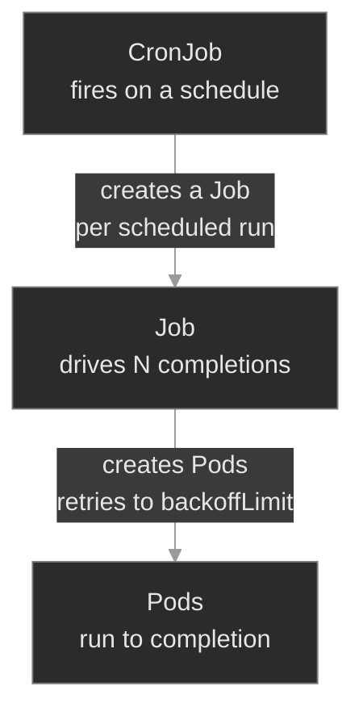

This is the M01 diagnostic instinct extended one rung: when a *scheduled* run misbehaves, the question is *which link broke* — did the CronJob create a Job (look at the CronJob's events and `LAST SCHEDULE`), did the Job create Pods (look at the Job's `COMPLETIONS` and events), did the Pods succeed (look at the Pod logs and exit codes)? The load-bearing insight, the batch sibling of M01's “`Running` ≠ healthy”: **`Complete` ≠ correct.** A Job reports `Complete` the instant it hits its `completions` target — even if that target was set wrong.

### Concept walkthrough

The walkthrough follows batch work from the smallest unit up: a single Job, then a parallel Job, then a CronJob scheduling them.

#### The Job: run-to-completion and what a failure costs

A Job creates a Pod, waits for it to exit, and judges the exit code. Exit 0 counts toward `completions`; a non-zero exit is a failure subject to `backoffLimit`<sup><a href="https://kubernetes.io/docs/concepts/workloads/controllers/job/">[1]</a></sup>. Because the Pod is *supposed* to exit, a Job's `restartPolicy` can only be `OnFailure` or `Never` — never `Always`, which the API rejects<sup><a href="https://kubernetes.io/docs/concepts/workloads/pods/pod-lifecycle/#restart-policy">[3]</a></sup>.

Those two values produce visibly different failure behavior, and knowing which you're looking at speeds diagnosis:

- **`OnFailure`** — the kubelet restarts the *same* Pod's container in place. You see one Pod with a climbing `RESTARTS` count (and `CrashLoopBackOff` between attempts, exactly as in M01).
- **`Never`** — the Job leaves the failed Pod and creates a *new* one. You see a growing list of Pods in `Error`, one per attempt, restart count stuck at 0.

Either way, `backoffLimit` is the give-up condition. It counts failures; once exceeded, the Job stops retrying and goes to `Failed`<sup><a href="https://kubernetes.io/docs/concepts/workloads/controllers/job/#pod-backoff-failure-policy">[1]</a></sup>. This is the single most misread piece of Job state: a Job at `COMPLETIONS 0/1` with Pods erroring is **retrying**; the same Job after `backoffLimit` is exhausted is **done failing** and will never make another attempt. The fix for the latter is not to wait — it's to find why every attempt failed and run a fresh Job. `kubectl describe job` tells you which state you're in: a `BackoffLimitExceeded` event with a `status.conditions` entry of type `Failed` means the controller has given up; their absence on a `0/1` Job means it's still mid-retry.

Two more bounds worth knowing. `activeDeadlineSeconds` is a wall-clock cap on the whole Job — it overrides `backoffLimit` and kills a Job that's taking too long, useful for batch work that must not run into the next window. `ttlSecondsAfterFinished` auto-deletes a finished Job and its Pods after a delay, so completed Jobs don't accumulate as clutter you have to garbage-collect by hand<sup><a href="https://kubernetes.io/docs/concepts/workloads/controllers/ttlafterfinished/">[5]</a></sup>.

<details>
<summary>📖 Going deeper: podFailurePolicy — not every failure deserves a retry<sup><a href="https://kubernetes.io/docs/tasks/job/pod-failure-policy/">[7]</a></sup></summary>

`backoffLimit` is blunt: it treats every failure the same. A config-error exit code and a node preemption both burn one retry. `podFailurePolicy` (stable since v1.31) lets the Job react to *why* a Pod failed<sup><a href="https://kubernetes.io/docs/tasks/job/pod-failure-policy/">[7]</a></sup>:

- **`FailJob`** on a specific container exit code — an exit `42` that means "bad config" will never succeed on retry, so fail the Job immediately instead of grinding through all of `backoffLimit`.
- **`Ignore`** on a `DisruptionTarget` condition — a Pod killed by node preemption, drain, or a spot reclaim wasn't the app's fault, so don't count it against the limit; just reschedule and try again.
- **`Count`** — the default: count it normally.

For an SRE this is the gap between a migration that fails *fast* on a real bug (you see it in a minute, not after six exponential-backoff retries) and one that doesn't give up just because a spot node got reclaimed mid-run. `podFailurePolicy` decides the *kind* of failure; `backoffLimit` remains the backstop for how many of the countable ones you tolerate.

</details>

<details>
<summary>📖 Going deeper: Jobs are immutable — you delete and recreate, you don't patch<sup><a href="https://kubernetes.io/docs/concepts/workloads/controllers/job/">[1]</a></sup></summary>

A Deployment is built to be edited: change the Pod template and it rolls a new ReplicaSet. A Job is not. Most of a Job's `spec` — the Pod template, `completions`, `completionMode`, `selector` — is **immutable** after creation. Try to `kubectl patch` the command or the completion count and the API server rejects it with `field is immutable`.

The reason is semantic, not arbitrary: a Job represents *one execution of a unit of work*. Mutating its template mid-flight would mean the Pods already created and the Pods not yet created ran different code — there'd be no coherent answer to “what did this Job do.” So the model is: a Job is disposable. To change it, delete it and apply a corrected one (`kubectl delete job <name>` then `kubectl apply -f`, or `kubectl replace --force`). A handful of fields *are* mutable — `parallelism`, `suspend`, `activeDeadlineSeconds`, `ttlSecondsAfterFinished` — because they govern *how* the remaining work runs, not *what* it is.

This immutability has an operational edge that surprises people coming from Deployments: **a `Failed` Job does not self-heal.** Correct a Deployment's image in your GitOps repo and the next reconcile rolls it back to health. Correct a Job's command in the same repo and nothing happens — the Job object already exists, so the controller sees no drift, and the corrected spec sits inert until the old Job is deleted and a new one applied. Recreation isn't just *a* fix for a Job; it's the only thing that makes the corrected version run at all.

</details>

One multi-container gotcha is specific to batch. A Job's Pod is "done" only when **every** container in it terminates. A sidecar that runs forever — a log shipper, a mesh proxy injected as an ordinary container — keeps the Pod `Running` even after the main workload exits 0, so the Job never reaches completion and hangs at `0/1`. The work succeeded; the Pod just can't finish. **Native sidecar containers** (init containers with `restartPolicy: Always`, introduced in M01) fix this: the kubelet stops them once the main container exits, so the Pod completes. The tell for this failure is a Pod stuck `Running` at `READY 1/2` — the main container shows `Completed`, the helper is still up — long after the work itself is done.

#### completions and parallelism: fixed-count and sharded work

By default a Job runs one Pod to one success (`completions: 1`). Set `completions: N` and the Job needs N successful Pods; set `parallelism: P` and it runs at most P at a time<sup><a href="https://kubernetes.io/docs/concepts/workloads/controllers/job/#parallel-jobs">[1]</a></sup>. The two are independent knobs: `completions: 4, parallelism: 2` runs four units of work, two at a time. `parallelism` without `completions` (default 1) just means “run one, but you may use up to P slots” — which mostly matters for the work-queue pattern.

The failure mode here is subtler than a crash. A Job marks itself `Complete` the moment its *succeeded* count reaches `completions`. If `completions` is set to 1 when the work is really 4 shards, the Job runs one shard, sees `1/1`, and reports `Complete` — green, healthy, done — while three-quarters of the data is never processed. Nothing errors. Nothing restarts. The status lies the same way a `Running`-but-unready Pod lied in M01. **A Job's correctness lives in whether `completions` matches the real size of the work — not in whether it reached `Complete`.**

<details>
<summary>📖 Going deeper: Indexed completion for sharded work that needs identity<sup><a href="https://kubernetes.io/docs/tasks/job/indexed-parallel-processing-static/">[6]</a></sup></summary>

`NonIndexed` (the default) treats all completions as interchangeable: any N successful Pods finish the Job. That's right when each Pod pulls the next item off a shared queue. But when the work is *statically sharded* — “process partition 0, 1, 2, 3” — each Pod needs to know *which* shard it owns. That's `completionMode: Indexed`: the Job assigns each Pod a unique `JOB_COMPLETION_INDEX` (0…`completions`-1), exposed as an env var and an annotation, and the Job is Complete only when every index has succeeded exactly once.

A sharded export in Indexed mode has each Pod handle exactly one partition by reading its index — no coordination, no double-processing. The operational payoff is diagnosability: a missing index in the succeeded set tells you *exactly which shard* failed, instead of just “one of four didn't finish.” When you see statically-sharded batch work, ask whether it should be Indexed.

</details>

#### The CronJob: a Job factory on a clock

A CronJob holds a `jobTemplate` and a `schedule`, and on each schedule tick it stamps out a Job from the template<sup><a href="https://kubernetes.io/docs/concepts/workloads/controllers/cron-jobs/">[2]</a></sup>. Everything you know about Jobs applies to the Jobs it creates; the CronJob layer only adds *when* and *whether*.

The schedule is standard cron — `min hour day-of-month month day-of-week` — so `0 2 * * *` is 02:00 daily and `*/5 * * * *` is every five minutes<sup><a href="https://kubernetes.io/docs/tasks/job/automated-tasks-with-cron-jobs/">[4]</a></sup>. Three controls govern behavior around the schedule:

- **`concurrencyPolicy`** — if the previous run hasn't finished when the next is due: `Allow` (let them overlap), `Forbid` (skip the new run), `Replace` (kill the running one, start fresh). For a CDR rollup you almost always want `Forbid` — two rollups racing on the same data is worse than skipping one.
- **`startingDeadlineSeconds`** — if a run is missed (the controller was down, or the cluster was too busy to start it on time), how many seconds late it may still launch. Past that, the run is dropped. Set it too low and transient delays silently eat scheduled runs.
- **`suspend`** — `true` pauses the CronJob entirely. It creates no Jobs and otherwise looks fine. This is the most common reason a CronJob “stopped working”: someone suspended it for a maintenance window and never un-suspended it. Nothing in `kubectl get cronjob` looks alarming — which is why `SUSPEND` is the first column to read.

History is bounded by `successfulJobsHistoryLimit` and `failedJobsHistoryLimit` — the CronJob keeps the last few finished Jobs (and their Pods) so you can inspect them, and garbage-collects the rest. `kubectl get cronjob` shows `LAST SCHEDULE` (when it last fired) and `ACTIVE` (how many of its Jobs are running now) — the two fields you read first when a scheduled task is suspect.

A CronJob is **at-least-once**, not exactly-once: a controller restart or recovery can create two Jobs for one scheduled slot (or, past `startingDeadlineSeconds`, none), and a Job retries failed Pods besides. The same work can run more than once — so design batch jobs to be **idempotent**: running a CDR rollup twice should produce the same totals, not double them.

A CronJob that appears stuck has a short differential: is it **suspended** (`SUSPEND True`)? Is the **schedule** valid but never matching (`0 0 31 2 *` — the 31st of February — is legal cron that never fires)? Were runs **missed and deadlined out**? Is a previous run **stuck Active** with `concurrencyPolicy: Forbid`, blocking all successors? Each is a one-field read on the CronJob spec — make those reads before assuming the controller itself is broken.

To trigger a scheduled task on demand — to test it, or to run a missed CDR rollup by hand — you create a one-off Job from the CronJob's template:

```bash
kubectl create job --from=cronjob/cdr-rollup cdr-rollup-manual -n cdr-storage
```

That's the standard “run it now” move, and it's how you confirm the Job template works independently of whether the schedule is firing.

#### Catching the silent failure

Batch failures are quiet — no page, just stale data noticed downstream days later. So you alert on the **absence of success**, not the presence of errors. Two signals carry it. **Freshness**: a CronJob's `LAST SCHEDULE` (`lastScheduleTime`, the `kube_cronjob_status_last_schedule_time` metric) should keep advancing — alert when it lags more than ~2× the schedule period. **Duration**: a Job `Active` far past its normal runtime is a hang — pair it with `activeDeadlineSeconds` so it surfaces as a `Failed`, not a silent stall. Every scheduled job needs a heartbeat; every job that can hang needs a deadline.

### Hands-on

Four steps in the baseline, three break/fix scenarios — all on the full Polyphone fleet, now with batch workloads layered on: `schema-migrate` (a one-shot Job), `usage-export` (a parallel Job), and `cdr-rollup` (a CronJob).

- **`baseline/`** — Tour healthy batch workloads: the Job → Pod and CronJob → Job → Pod owner chains, run-to-completion and `restartPolicy`, `completions`/`parallelism` in action, and a CronJob firing on schedule. The reference for what good batch looks like.
- **`breakfix-01-cronjob-never-fires/`** — The nightly `cdr-rollup` hasn't run. No errors, no pods, nothing in the logs. Tests the CronJob differential — `suspend` first.
- **`breakfix-02-job-backofflimit/`** — A `schema-migrate` Job won't complete; its Pods keep failing. Tests reading `backoffLimit`/`restartPolicy` and the fact that a Job is immutable — you recreate to fix it.
- **`breakfix-03-completions-shortfall/`** — `usage-export` reports `Complete`, but downstream only sees a fraction of the data. Tests `completions`/`parallelism` and that `Complete` is not `correct`.

Check yourself against `ANSWER-KEY.md` after each.

### Common failure modes

| Symptom | Likely cause | Where to look |
|---------|--------------|---------------|
| CronJob `LAST SCHEDULE <none>`, no Jobs ever created | CronJob is **suspended** | `kubectl get cronjob` → `SUSPEND` column; `.spec.suspend` |
| CronJob never fires but isn't suspended | Schedule valid but never matches, or runs missed past `startingDeadlineSeconds` | Read `.spec.schedule`; `describe cronjob` for missed-schedule events |
| CronJob stopped firing; one Job stuck `ACTIVE` | Previous run hung + `concurrencyPolicy: Forbid` blocks successors | `kubectl get jobs` → the stuck Active Job; fix or delete it |
| Job `COMPLETIONS 0/1`, one Pod with climbing `RESTARTS` | App failing every attempt, `restartPolicy: OnFailure`, retrying to `backoffLimit` | `kubectl logs job/<name>`; `describe job` for backoff/failed events |
| Job `COMPLETIONS 0/1`, growing list of `Error` Pods | Same, but `restartPolicy: Never` (new Pod per attempt) | `kubectl logs` on the most recent failed Pod |
| Job `Failed`, no more attempts | `backoffLimit` exhausted or `activeDeadlineSeconds` hit | `describe job` → `BackoffLimitExceeded` / `DeadlineExceeded` |
| Job `Complete` but downstream data is partial | `completions` set lower than the real work size | `.spec.completions` vs the intended shard/unit count |
| Job stuck `0/1`, Pod `Running` with one container `Completed` + a helper still up | An ordinary (non-native) sidecar runs forever, so the Pod never terminates | `get pod -o jsonpath` container states; move the helper to a native sidecar |

### Recap

- A Job's desired state is *N successful exits*, not *N running Pods* — the same controller machinery as a Deployment, inverted. That inversion explains `restartPolicy` (no `Always`), `backoffLimit`, and `completions`/`parallelism`.
- `restartPolicy: OnFailure` restarts the same Pod (climbing `RESTARTS`); `Never` spawns a new Pod per attempt (a list of `Error` Pods). `backoffLimit` is the give-up count — a retrying Job and a `Failed` one look similar but mean opposite things.
- `Complete` ≠ correct. A Job hits `Complete` when `succeeded` reaches `completions`, even if `completions` was set wrong — the batch analog of M01's `Running` ≠ ready.
- A CronJob creates Jobs on a schedule: CronJob → Job → Pod. When a scheduled task misbehaves, find which link broke. The first reads are `SUSPEND`, `LAST SCHEDULE`, `ACTIVE`, and the schedule itself.
- Jobs are immutable — fix one by deleting and recreating. CronJobs are patchable for the run-governing fields (`suspend`, `schedule`, `concurrencyPolicy`).
- Batch failures are *quiet*. Scheduling is **at-least-once**, so jobs must be idempotent; and a stalled CronJob pages no one — alert on the *absence of success* (`LAST SCHEDULE` freshness, a Job `Active` too long), not just on errors.

### Production thinking

- `cdr-rollup` hasn't fired in three weeks and no alert fired either. A crash-looping Deployment pages you; a silently-not-running CronJob doesn't. What signal would you alert on so a missed scheduled run is as loud as a down service — and where does that signal come from?
- A migration Job exhausted its `backoffLimit` and is `Failed`. The durable fix lives in the GitOps repo, but a `Failed` Job won't re-run itself on the next reconcile the way a Deployment self-heals. What has to happen for the corrected Job to actually execute, and who or what triggers it?
- You're setting `concurrencyPolicy` and `activeDeadlineSeconds` for a rollup that occasionally runs long. Talk through the failure you're protecting against with each, and the cost of choosing `Forbid` (a skipped run) versus `Allow` (two runs racing the same data).

### References

1. Kubernetes — Jobs: https://kubernetes.io/docs/concepts/workloads/controllers/job/
2. Kubernetes — CronJob: https://kubernetes.io/docs/concepts/workloads/controllers/cron-jobs/
3. Kubernetes — Pod Lifecycle (restart policy): https://kubernetes.io/docs/concepts/workloads/pods/pod-lifecycle/#restart-policy
4. Kubernetes — Running Automated Tasks with a CronJob: https://kubernetes.io/docs/tasks/job/automated-tasks-with-cron-jobs/
5. Kubernetes — TTL After Finished: https://kubernetes.io/docs/concepts/workloads/controllers/ttlafterfinished/
6. Kubernetes — Indexed Job for Parallel Processing: https://kubernetes.io/docs/tasks/job/indexed-parallel-processing-static/
7. Kubernetes — Handling retriable and non-retriable Pod failures with a Pod failure policy: https://kubernetes.io/docs/tasks/job/pod-failure-policy/


---

## Break/Fix Practice

## Break/fix 01 — CronJob Never Fires

**Symptom — what you'd actually see:**

Report: the `cdr-rollup` CronJob in `cdr-storage` hasn't produced output. No recent Jobs, no Pods, no error logs, no events. Billing reconciliation drifting on stale CDRs.

**Think about this before you open the answer:**

Not flipping a boolean — that's trivial. The skill is the **differential for a CronJob that creates nothing**, so you don't go spelunking through logs that don't exist. Self-grading questions:

- Did you recognize there were no logs/events *because* a suspended CronJob does nothing — rather than concluding the cluster was broken?
- Did you read `SUSPEND`/`LAST SCHEDULE`/`ACTIVE`/`schedule` as a checklist, instead of guessing one cause?
- Did you backfill the missed run with `kubectl create job --from=cronjob/...` rather than just waiting?

<details>
<summary>📖 Going deeper: the other ways a CronJob silently fires nothing<sup><a href="https://kubernetes.io/docs/concepts/workloads/controllers/cron-jobs/">[2]</a></sup></summary>

`suspend: true` is the most common, but the differential has more entries, and they all present identically (no Jobs, no obvious error):

- **A valid schedule that never matches.** `0 0 31 2 *` is legal cron — the 31st of February — and fires never. So is `0 0 30 2 *`. Always read the schedule semantically, not just for syntax errors (the API rejects *malformed* cron, but not *impossible* dates).
- **Missed runs past `startingDeadlineSeconds`.** If the controller was down or the cluster was too busy and a scheduled time slipped by more than `startingDeadlineSeconds`, that run is dropped. Set it very low and transient delays silently eat runs; `describe cronjob` shows "missed schedule" / "too many missed start times" events.
- **A previous run stuck `Active` with `concurrencyPolicy: Forbid`.** `Forbid` skips a new run while the old one is still going — so one hung Job blocks *all* successors. `kubectl get jobs` reveals the stuck `Active` Job; killing or fixing it unblocks the schedule.
- **Timezone confusion.** By default schedules are interpreted in the kube-controller-manager's timezone (UTC on most clusters). A `spec.timeZone` field exists; a mismatch between the expected and actual zone makes a CronJob fire "at the wrong time," which reads as "didn't fire" to whoever's watching the wrong clock.

The reflex: a silent CronJob is almost never a broken controller. It's a spec field — read them in order.

</details>

<details>
<summary><b>Click to reveal: diagnostic commands, root cause, exact fix, verify</b></summary>

**Root cause:**

The CronJob has `spec.suspend: true`. A suspended CronJob is valid and otherwise healthy — the scheduler simply skips it, so it creates no Jobs<sup><a href="https://kubernetes.io/docs/concepts/workloads/controllers/cron-jobs/">[2]</a></sup>. That's why there's nothing to find in logs or events: it isn't failing, it's switched off. The most common real-world cause is someone suspending it for a maintenance window and never re-enabling it.

**Diagnostic commands (run in this order):**

```bash
# 1. Confirm it's creating nothing — LAST SCHEDULE <none>, no Jobs
kubectl get cronjob cdr-rollup -n cdr-storage
kubectl get jobs -n cdr-storage -l app=cdr-rollup
```

```bash
# 2. Work the differential — the default columns ARE the differential
kubectl get cronjob cdr-rollup -n cdr-storage
# SCHEDULE / SUSPEND / ACTIVE / LAST SCHEDULE → SUSPEND=True, that's it
```

```bash
# 3. Confirm it on the resource itself — describe spells out the flag and shows events
kubectl describe cronjob cdr-rollup -n cdr-storage
# Suspend:  True
```

**Exact fix:**

```bash
# A CronJob is patchable — suspend is a mutable, run-governing field.
kubectl patch cronjob cdr-rollup -n cdr-storage -p '{"spec":{"suspend":false}}'
# or kubectl edit, suspend: true → false (or delete the line)

# Backfill the missed run immediately rather than waiting for the schedule:
kubectl create job --from=cronjob/cdr-rollup cdr-rollup-recover -n cdr-storage
```

**Verify:**

```bash
kubectl get cronjob cdr-rollup -n cdr-storage      # SUSPEND False; LAST SCHEDULE updates within a minute
kubectl get jobs -n cdr-storage -l app=cdr-rollup  # recover Job + scheduled Job(s) reappearing
```

**Production thinking:**

The deeper issue is detection. A crash-looping Deployment pages you because traffic drops; a suspended CronJob pages *no one* — the only signal is stale data noticed downstream days later. The durable fix is twofold: correct `suspend` in `platform-gitops` so a Flux reconcile doesn't re-suspend it, and add a freshness/heartbeat alert (alert if `time() - kube_cronjob_status_last_schedule_time > 2 × period`, or if the rollup output table hasn't advanced). Make a missed scheduled run as loud as a down service.

</details>

---

## Break/fix 02 — Job Stuck Retrying

**Symptom — what you'd actually see:**

Release blocked: the pre-deploy `schema-migrate` Job in `provisioning` won't complete. `COMPLETIONS` stuck at `0/1`; one Pod with a climbing `RESTARTS` count.

**Think about this before you open the answer:**

Reading Job failure state correctly and knowing Jobs are immutable. Self-grading questions:

- Did you check `.status.conditions` to tell *retrying* from *given up*, rather than assuming "0/1" means "stuck"?
- Did you read `kubectl logs job/<name>` to find the *actual* failure (a typo → exit 127), not guess?
- Did you reach for delete-and-recreate after the patch was rejected — rather than fighting the immutability error?

<details>
<summary>📖 Going deeper: OnFailure vs Never, and why a Failed Job won't self-heal<sup><a href="https://kubernetes.io/docs/concepts/workloads/controllers/job/">[1]</a></sup></summary>

**`OnFailure` vs `Never` change what you see.** `OnFailure` restarts the same container in place — one Pod, climbing `RESTARTS`, `CrashLoopBackOff` between tries (this scenario). `Never` leaves each failed Pod and creates a *new* one per attempt — a growing list of `Error` Pods, restart count stuck at 0. Same root-cause work; different surface. `Never` is useful when you want each attempt's Pod preserved for forensics; `OnFailure` is tidier when you don't.

**`backoffLimit` is the give-up count, and the give-up is sticky.** Once a Job is `Failed`, it does not retry on its own and — crucially — it does **not** self-heal the way a Deployment does. A Deployment with a fixed image rolls forward on the next reconcile; a `Failed` Job just sits there. So fixing the manifest in Git is necessary but not sufficient: something has to *re-run* the Job. In a GitOps world that usually means deleting the failed Job so Flux recreates it from the corrected manifest (or a pipeline step that re-applies it). Know that the corrected source won't execute itself.

**`activeDeadlineSeconds`** is the other bound: a wall-clock cap that overrides `backoffLimit` and fails a Job that runs too long — the right control for a migration that must not bleed into the maintenance window's end.

**`podFailurePolicy`** (stable since v1.31) is the modern complement to `backoffLimit`. This scenario's typo exits `127` every time — a guaranteed failure that `backoffLimit` still dutifully retries three times. A `podFailurePolicy` rule that does `FailJob` on that exit code would fail the Job on the *first* attempt, surfacing the bug in seconds. The mirror case: a rule that does `Ignore` on the `DisruptionTarget` condition so a node preemption or spot reclaim doesn't burn a retry. `podFailurePolicy` classifies *why* a Pod failed; `backoffLimit` caps how many countable failures you tolerate. See `LESSON.md` for the full breakdown.

</details>

<details>
<summary><b>Click to reveal: diagnostic commands, root cause, exact fix, verify</b></summary>

**Root cause:**

The Job's container command has a typo on its final step — `ecaho` instead of `echo` — so the shell exits `127` (command not found) every run<sup><a href="https://kubernetes.io/docs/concepts/workloads/controllers/job/">[1]</a></sup>. With `restartPolicy: OnFailure` the kubelet retries the *same* Pod in place (climbing restarts, `CrashLoopBackOff` between attempts), and the Job counts failures toward `backoffLimit` (3); once exhausted, the Job goes to `Failed` and stops trying<sup><a href="https://kubernetes.io/docs/concepts/workloads/pods/pod-lifecycle/#restart-policy">[3]</a></sup>. No number of retries fixes a typo.

**Diagnostic commands (run in this order):**

```bash
# 1. Read the bound + live status: retrying, or given up? (yaml carries both spec + status)
kubectl get job schema-migrate -n provisioning
kubectl get job schema-migrate -n provisioning -o yaml
# spec.backoffLimit: 3 , template restartPolicy: OnFailure
# status: no Failed condition = still retrying; conditions[].type=Failed = backoffLimit exhausted
```

```bash
# 2. OnFailure → one pod, climbing RESTARTS (not a pile of new pods)
kubectl get pods -n provisioning -l app=schema-migrate
```

```bash
# 3. Ask the pod WHY it dies — the log gets through early steps then errors
kubectl logs job/schema-migrate -n provisioning
# ...applying 001_init
# /bin/sh: ecaho: not found
```

```bash
# 4. Confirm a real non-zero exit (not a probe kill): in Containers:, the Last State: block
POD=$(kubectl get pod -n provisioning -l app=schema-migrate -o jsonpath='{.items[0].metadata.name}')
kubectl describe pod $POD -n provisioning
#   Last State:  Terminated   Reason: Error   Exit Code: 127
```

**Exact fix:**

A Job's pod template is immutable — `kubectl patch` of the command returns `field is immutable`. Delete and recreate with the corrected command:

```bash
kubectl delete job schema-migrate -n provisioning
cat <<'EOF' | kubectl apply -f -
apiVersion: batch/v1
kind: Job
metadata:
  name: schema-migrate
  namespace: provisioning
  labels: { app: schema-migrate, plane: control, tier: lab }
spec:
  backoffLimit: 3
  ttlSecondsAfterFinished: 3600
  template:
    metadata:
      labels: { app: schema-migrate, plane: control, tier: lab }
    spec:
      restartPolicy: OnFailure
      containers:
        - name: migrate
          image: busybox:1.36
          command: ["/bin/sh","-c","echo '[schema-migrate] connecting'; echo '[schema-migrate] applying 001_init'; sleep 3; echo '[schema-migrate] done'"]
EOF
```

**Verify:**

```bash
kubectl wait --for=condition=complete job/schema-migrate -n provisioning --timeout=60s
kubectl get job schema-migrate -n provisioning    # COMPLETIONS 1/1
```

**Production thinking:**

The live recreate unblocks the release, but the typo is in the manifest in `platform-gitops`. Correct it there and let Flux apply — then confront the detection gap: a migration command that exits 127 every time should fail in CI or staging, not in the release pipeline. Why did a Job whose command had never run successfully get promoted? And because a `Failed` Job won't re-run itself on reconcile, decide who owns re-triggering it after the fix lands (Flux deletes-and-recreates, a pipeline re-applies, or an operator does it by hand).

</details>

---

## Break/fix 03 — Completions Shortfall

**Symptom — what you'd actually see:**

Finance ticket: the daily `usage-export` in `analytics` is missing data — only 1 of 4 shards reached downstream. But the Job reports `COMPLETIONS 1/1`, `Complete`, exit 0, no errors, no failed Pods.

**Think about this before you open the answer:**

Not trusting a green status, and understanding `completions`/`parallelism`. Self-grading questions:

- Did you question `Complete` and compare `completions` to the *real* work size, rather than closing the ticket on a green Job?
- Did you confirm no Pods actually failed — distinguishing "did too little" from "errored"?
- Did you recreate (immutability) and confirm `4/4`, not just bump a number you assumed was patchable?

<details>
<summary>📖 Going deeper: Indexed completion makes "which shard is missing?" answerable<sup><a href="https://kubernetes.io/docs/tasks/job/indexed-parallel-processing-static/">[6]</a></sup></summary>

Default `NonIndexed` mode treats completions as interchangeable — any 4 successes finish the Job, and there's no built-in notion of *which* shard each Pod did. That's fine when Pods pull from a shared queue, but for statically partitioned work (export day-partition 0, 1, 2, 3) it has two weaknesses: nothing assigns each Pod a partition, and when one fails you only know "3 of 4 succeeded," not *which* one is missing.

`completionMode: Indexed` fixes both. The Job hands each Pod a unique `JOB_COMPLETION_INDEX` (0…`completions`-1) via env var and annotation; the Pod reads it to pick its partition, and the Job is Complete only when every index has succeeded exactly once. The operational payoff is diagnosability: the succeeded set is `{0,1,3}` and you instantly know shard 2 failed. For Polyphone's `usage-export`, Indexed mode would both eliminate the coordination problem and turn "missing data somewhere" into "shard 2 didn't run." When you see sharded batch work, ask whether it should be Indexed.

Note this scenario's bug — wrong `completions` — would still be a bug under Indexed mode (you'd set the count wrong either way). Indexed doesn't prevent under-sizing; it makes a *partial failure* legible. The guard against under-sizing is reviewing `completions` against the known work size, ideally in CI.

</details>

<details>
<summary><b>Click to reveal: diagnostic commands, root cause, exact fix, verify</b></summary>

**Root cause:**

`spec.completions` is `1` when the work is 4 shards. A Job marks itself `Complete` the instant `succeeded` reaches `completions`<sup><a href="https://kubernetes.io/docs/concepts/workloads/controllers/job/#parallel-jobs">[1]</a></sup> — so with `completions: 1` it ran one Pod, succeeded once, and declared done while shards 2–4 were never processed. Nothing failed; the spec was simply sized wrong. This is the batch analog of M01's "`Running` ≠ `Ready`": **`Complete` ≠ correct.**

**Diagnostic commands (run in this order):**

```bash
# 1. The status that lies — Complete, but is the target right?
kubectl get job usage-export -n analytics
# COMPLETIONS 1/1  Complete
```

```bash
# 2. Compare the target against the real work (4 shards) — describe shows the sizing + result
kubectl describe job usage-export -n analytics
#   Completions: 1   ← should be 4
#   Pods Statuses: 0 Active / 1 Succeeded / 0 Failed
```

```bash
# 3. Confirm only one pod ran — no hidden failures, just under-sized work
kubectl get pods -n analytics -l app=usage-export   # one Completed pod, 0 restarts
kubectl logs job/usage-export -n analytics          # one shard processed
```

**Exact fix:**

`completions` is immutable. Delete and recreate sized to the real work:

```bash
kubectl delete job usage-export -n analytics
cat <<'EOF' | kubectl apply -f -
apiVersion: batch/v1
kind: Job
metadata:
  name: usage-export
  namespace: analytics
  labels: { app: usage-export, plane: control, tier: lab }
spec:
  completions: 4
  parallelism: 2
  backoffLimit: 4
  ttlSecondsAfterFinished: 3600
  template:
    metadata:
      labels: { app: usage-export, plane: control, tier: lab }
    spec:
      restartPolicy: OnFailure
      containers:
        - name: export
          image: busybox:1.36
          command: ["/bin/sh","-c","echo '[usage-export] processing a usage shard'; sleep 4; echo '[usage-export] shard complete'"]
EOF
```

**Verify:**

```bash
kubectl wait --for=condition=complete job/usage-export -n analytics --timeout=60s
kubectl get job usage-export -n analytics
# COMPLETIONS 4/4  Complete
```

**Production thinking:**

This is the most dangerous failure in the module because it's invisible to every health check — the Job is `Complete`, so liveness of the *pipeline* looks fine. Detection has to come from the *output*, not the Job: reconcile row counts (does the export have 4 partitions?), or assert the expected `completions` in a policy check before deploy. The durable fix corrects `completions` in `platform-gitops`; the real deliverable is a data-completeness check so "the job is green but the data is short" can't reach finance again. Consider Indexed mode so future partial failures name the missing shard.

</details>

---


---

# `m02-images-registries/`

## Concept

## M02 — Container Images & Registries

> What a container image actually is, how a Pod *names* one, and every way the name can fail to become a running container. The pull-failure differential: read the kubelet's status and you know which link in registry → reference → policy → auth broke.

### What you'll learn

- Parse a full image reference — `registry/repository:tag@sha256:digest` — and explain why tags are mutable pointers and digests are immutable content addresses
- Predict what `imagePullPolicy` does given a tag, a digest, and what's already on the node — and recognize `ErrImageNeverPull`
- Pull from a private registry with an `imagePullSecret`, and diagnose the `401 Unauthorized` you get without one
- Work the **pull-failure differential**: map `ErrImagePull` / `ImagePullBackOff` / `ErrImageNeverPull` to a specific cause from the kubelet's message
- Place signing, scanning, mirrors, and promotion in the lifecycle, and know which module enforces each

### Why it matters

Every workload on the platform starts the same way: the kubelet reads a Pod's image reference, asks the container runtime to fetch it, and the runtime talks to a registry. When that handshake fails, the Pod never starts — and "didn't start" is one of the most common pages an SRE takes. The trap is that all the failures *look* the same at a glance: a Pod stuck in `ImagePullBackOff`, no logs (the container never ran, so there's nothing to log). The skill is not "restart it" — it's reading the *one line* in the kubelet's events that says whether the registry was unreachable, the credentials were rejected, the tag didn't exist, or the policy forbade the pull in the first place.

These failures also arrive at the worst times. A `:latest` tag that worked yesterday silently points at a new, broken build today. A registry credential rotates and every Pod that restarts across the fleet wedges at once. A digest pin protects you from exactly that — at the cost of an inscrutable `manifest unknown` when the digest is wrong. At Polyphone, `media-recorder` pulls a proprietary image from an internal registry; the difference between a two-minute fix and an hour of flailing is knowing the differential cold.

### Scope

**Covers:** image reference anatomy (registry, repository, tag, digest, manifest), the OCI image model at the level an operator needs it, `imagePullPolicy` and the node image cache, pulling from a private registry with `imagePullSecrets`, and the pull-failure differential (`ErrImagePull`, `ImagePullBackOff`, `ErrImageNeverPull`, auth vs not-found vs unreachable).

**Doesn't cover:** building images (Dockerfiles, BuildKit, multi-stage builds) — that's a CI concern, not a cluster one. Admission-time enforcement of signed/scanned images → M20 (Kyverno / signed-image admission). GitOps-driven promotion across environments → M16–M19. Mounting image content as config (ConfigMaps/Secrets) → M03. How images consume node CPU/memory and compete for capacity → M06.

**Assumes:** you finished M00 (the `get → describe → events → logs` diagnostic loop; that a failure event lands on the owner) and M01 (Pods, Deployments, container states, `CrashLoopBackOff`). You know a container is a process started from an image. This module is about the step *before* the process starts: turning an image *name* into image *bytes* on a node.

### Vocabulary

| Term | Definition |
|------|------------|
| **image** | A read-only bundle of filesystem layers plus a config (entrypoint, env, etc.), addressable by content. What a container is started from. |
| **registry** | A server that stores and serves images over the OCI distribution API. Docker Hub, GHCR, ECR, or an in-cluster `registry:2`. |
| **repository** | A named collection of related images within a registry (e.g. `polyphone/media-recorder`). |
| **image reference** | The full string a Pod uses to name an image: `[registry/]repository[:tag][@digest]`. |
| **tag** | A human-friendly, **mutable** pointer to an image within a repository (`:1.4.2`, `:latest`). Can be moved to point at different content later. |
| **digest** | A `sha256:` hash of the image's content — an **immutable**, content-addressed identifier. `@sha256:abc…` always names the exact same bytes. |
| **manifest** | The registry document listing an image's layers and config by digest. A **manifest list** (image index) maps platforms (amd64/arm64) to per-platform manifests. |
| **imagePullPolicy** | When the kubelet pulls vs reuses the node cache: `Always`, `IfNotPresent`, or `Never`. |
| **image cache** | Images already pulled onto a node by the runtime. `IfNotPresent` and `Never` read from it; `Always` checks the registry every time. |
| **imagePullSecret** | A Secret of type `kubernetes.io/dockerconfigjson` holding registry credentials, referenced by a Pod (or ServiceAccount) so the kubelet can authenticate the pull. |
| **ImagePullBackOff** | The kubelet tried to pull, failed, and is backing off retries. The *reason* (auth, not-found, unreachable) is in the events, not this status. |
| **ErrImageNeverPull** | `imagePullPolicy: Never` and the image isn't cached on the node — so the kubelet refuses to pull and the Pod can't start. |
| **mirror / pull-through cache** | A registry that fronts another, caching pulls — configured at the runtime (containerd `hosts.toml`), invisible to the Pod spec. |
| **signing / scanning** | Cryptographically attesting an image's provenance (cosign/sigstore) and inspecting it for known vulnerabilities (Trivy/Grype). Enforced at admission → M20. |

### Mental model

An image reference is a *name*; a running container needs the *bytes*. Everything in this module is one path — the kubelet resolving a name into bytes on a node — and the differential is just the set of points where that path can break. Read the kubelet's event message and you know which one.

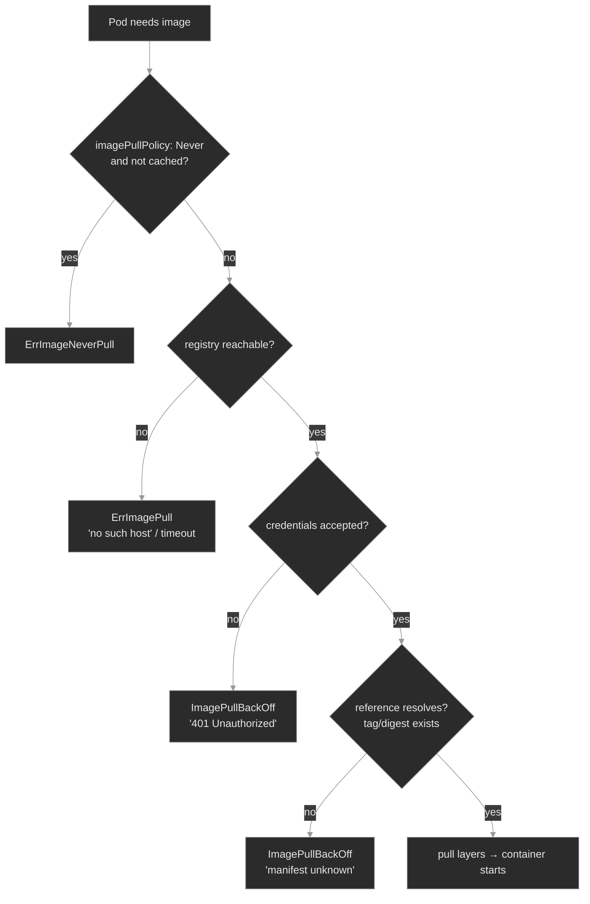

The four red leaves are the four ways the path breaks, in the order the kubelet hits them: policy refused to pull, the registry was unreachable, the credentials were rejected, or the reference didn't resolve. The diagnostic instinct, inherited straight from M00: **the status tells you it's stuck; the event message tells you why.** Never fix an `ImagePullBackOff` without reading the message first.

### Concept walkthrough

#### Anatomy of an image reference: tags move, digests don't

A full reference has up to four parts:

```text
registry.example.com / polyphone/media-recorder : 1.4.2 @ sha256:9f2a…c1
└──── registry ──────┘ └──── repository ───────┘ └tag┘  └──── digest ────┘
```

Omit the registry and the runtime defaults to Docker Hub (`docker.io`); omit the tag and it defaults to `:latest`<sup><a href="https://kubernetes.io/docs/concepts/containers/images/">[1]</a></sup>. The load-bearing distinction is between the two ways to name the content:

- A **tag** is a mutable label. `polyphone/media-recorder:1.4.2` points at whatever the registry currently has under `1.4.2`. Someone can push new bytes to that same tag tomorrow, and every node that pulls it afterward gets different content. `:latest` is the extreme case — it moves constantly.
- A **digest** is the SHA-256 of the image's manifest. `@sha256:9f2a…` names *exactly those bytes* and can never name anything else — if the content changes, the digest changes. This is content addressing<sup><a href="https://github.com/opencontainers/image-spec/blob/main/spec.md">[4]</a></sup>.

This is why production deployments **pin by digest**: a tag is a promise the registry can break, a digest is a fact. Pinning guarantees every node, every restart, every region runs byte-identical code, and it's the foundation that signing and promotion build on. The cost: get the digest wrong and the pull fails closed with `manifest unknown` — the safety feature working, not a bug. There is no "close enough" for a content address; the registry has no manifest stored under that hash, so it refuses rather than serving something approximate.

<details>
<summary>📖 Going deeper: the digest is the trust anchor — signing and promotion both ride on it<sup><a href="https://docs.sigstore.dev/">[5]</a></sup></summary>

Because a digest is immutable and unforgeable, it's the thing you sign and the thing you promote. Image signing (cosign/sigstore) produces a signature *over a digest* and stores it alongside the image; `cosign verify <ref>@sha256:…` checks that a trusted key signed exactly those bytes<sup><a href="https://docs.sigstore.dev/">[5]</a></sup>. Promotion across environments (lab → stage → prod) should move the **same digest**, not re-resolve a tag in each environment — otherwise "what I tested in stage" and "what shipped to prod" can silently differ. A tag like `:1.4.2` can mean different bytes in two registries; a digest cannot.

So the supply-chain story is one chain: build → push → **digest** → sign the digest → scan the digest → admission verifies the signature on the digest → promote the digest unchanged. M02 teaches the anchor; M20 teaches the admission controller that *enforces* "only signed, scanned digests run here." Pinning by digest in your manifests is the prerequisite that makes all of it meaningful.

</details>

#### How — and whether — the kubelet pulls: `imagePullPolicy` and the node cache

Before the kubelet pulls anything, `imagePullPolicy` decides whether it *should*<sup><a href="https://kubernetes.io/docs/concepts/containers/images/#image-pull-policy">[3]</a></sup>:

- **`Always`** — check the registry on every Pod start; pull if the digest differs from cache. Safe for mutable tags, costs a registry round-trip each time.
- **`IfNotPresent`** — use the node's cached image if any copy exists; only pull when it's absent. Fast, but a stale cache can serve old bytes for a mutable tag.
- **`Never`** — never contact a registry. Use the cache or fail. For images side-loaded onto nodes out of band.

If you don't set it, Kubernetes defaults based on the reference: a `:latest` tag (or no tag) defaults to `Always`; any other tag or a digest defaults to `IfNotPresent`<sup><a href="https://kubernetes.io/docs/concepts/containers/images/#imagepullpolicy-defaulting">[3]</a></sup>. That default encodes the lesson: a moving tag should be re-checked every time; a pinned reference can trust the cache because the cache can't be wrong about immutable content.

The failure mode to know: `imagePullPolicy: Never` on an image the node has never cached. The kubelet won't pull it, so the Pod stalls at `ErrImageNeverPull` — distinct from `ImagePullBackOff` because *no pull was even attempted*. The same `Never`/`IfNotPresent` reliance on cache is also how the subtle "it ran the old code" incidents happen: a mutable tag plus a warm cache means a node can keep serving bytes the registry no longer has under that tag.

#### Pulling from a private registry: `imagePullSecrets` and registry auth

Public images (Docker Hub's library, most of the Polyphone fleet's `nginx:1.25`) pull anonymously. Internal images don't — the registry demands credentials, and an anonymous pull gets `401 Unauthorized`. You give the kubelet credentials with an `imagePullSecret`: a Secret of type `kubernetes.io/dockerconfigjson`, created most easily with<sup><a href="https://kubernetes.io/docs/tasks/configure-pod-container/pull-image-private-registry/">[2]</a></sup>:

```bash
kubectl create secret docker-registry regcred \
  --docker-server=<registry-host:port> \
  --docker-username=<user> --docker-password=<pass> \
  -n <namespace>
```

Then reference it from the Pod spec (`spec.imagePullSecrets: [{name: regcred}]`) or attach it to the Pod's ServiceAccount so every Pod inherits it. Two operational facts decide most auth incidents:

- **The secret is namespaced and matched by host.** A `regcred` in `media` does nothing for a Pod in `signaling`, and its `--docker-server` must match the image reference's registry host exactly — `localhost:5000` ≠ `registry.local:5000`.
- **The failure is silent until a pull happens.** Already-running Pods keep running on cached images. The page comes when something *restarts* — a node reboot, a rollout, a scale-up — and suddenly authenticates against a registry whose credential rotated. The blast radius is "everything that restarts," which is why a rotated-then-not-updated pull secret can take out a swath of the fleet at once.

Concretely, the auth branch of the differential: a Pod references the internal registry with no (or wrong) `imagePullSecret`, the registry returns `401`, and the Pod sits in `ImagePullBackOff` with `unauthorized` in its events.

<details>
<summary>📖 Going deeper: registry mirrors and pull-through caches live in the runtime, not the Pod<sup><a href="https://github.com/containerd/containerd/blob/main/docs/hosts.md">[6]</a></sup></summary>

At scale you don't want every node pulling every image straight from Docker Hub — rate limits, egress cost, and a single point of failure. A **pull-through cache** (or mirror) is a registry that fronts an upstream one and caches what it serves. The key operational point: this is configured at the **container runtime**, not in the Pod spec. For containerd, a host-config file at `/etc/containerd/certs.d/<host>/hosts.toml` redirects pulls for a registry to one or more mirror endpoints (and is also where you mark a registry as plain-HTTP/insecure)<sup><a href="https://github.com/containerd/containerd/blob/main/docs/hosts.md">[6]</a></sup>:

```toml
server = "https://registry-1.docker.io"
[host."https://mirror.internal:5000"]
  capabilities = ["pull", "resolve"]
```

A Pod still says `image: nginx:1.25`; the runtime transparently sources it from the mirror. The diagnostic implication: when a pull behaves differently on one node than another, suspect node-level runtime config (`hosts.toml`, the image cache) — not the Pod spec, which is identical everywhere. The same `hosts.toml` mechanism is what lets a runtime pull from a registry served over plain HTTP — an entry marking that host insecure is the only reason an untrusted-TLS or no-TLS registry resolves at all.

</details>

<details>
<summary>📖 Going deeper: scanning and the supply-chain gate (deferred to M20)<sup><a href="https://kubernetes.io/docs/concepts/security/supply-chain-security/">[7]</a></sup></summary>

Scanning (Trivy, Grype) inspects an image's layers against vulnerability databases and produces a report keyed by digest. Like signing, scanning *produces information*; it doesn't *block* anything on its own. The block happens at admission: a policy controller (Kyverno, OPA Gatekeeper) rejects a Pod whose image isn't signed by a trusted key, or whose scan shows criticals, before the kubelet ever pulls it. That enforcement layer is M20. M02's job is to make sure you understand what's being gated — a digest, an `imagePullSecret`, a reference — so the admission rules in M20 read as obvious rather than magic.

</details>

### Hands-on

Four steps in the baseline, four break/fix scenarios — all on the full Polyphone fleet, now with one image-focused workload layered on: **`media-recorder`** (`media`), which pulls a proprietary image from an **in-cluster authenticated registry** (`registry:2` on `localhost:5000`). It's the anchor for every scenario.

- **`baseline/`** — Anatomy of a reference, tags vs digests, `imagePullPolicy` and the cache, and a healthy private-registry pull with an `imagePullSecret`. What "good" looks like before the differential breaks it.
- **`breakfix-01-never-pull/`** — A Pod stuck in `ErrImageNeverPull`. Tests `imagePullPolicy` and the node cache — telling "wouldn't pull" from "couldn't pull." (No pull was attempted.)
- **`breakfix-02-registry-unreachable/`** — `ImagePullBackOff` with `no such host`. Tests reading the event for a reachability failure (wrong registry host) vs an auth or not-found one.
- **`breakfix-03-imagepull-auth/`** — `media-recorder` in `ImagePullBackOff` with `401 Unauthorized`. Tests wiring an `imagePullSecret` to the internal registry.
- **`breakfix-04-digest-mismatch/`** — A digest-pinned workload fails with `manifest unknown`. Tests references vs digests and fail-closed pinning.

The four scenarios walk the differential diagram top-to-bottom — `ErrImageNeverPull` → `no such host` → `401` → `manifest unknown` — so each isolates one cause and one kubelet message.

Check yourself against `ANSWER-KEY.md` after each.

### Common failure modes

| Symptom | Likely cause | Where to look |
|---------|--------------|---------------|
| `ImagePullBackOff`, event says `401 Unauthorized` / `denied` | Missing/wrong `imagePullSecret`, or rotated credential | `kubectl describe pod` events; `.spec.imagePullSecrets`; secret's `--docker-server` vs image host |
| `ImagePullBackOff`, event says `manifest unknown` / `not found` | Bad reference: wrong tag or wrong `@sha256:` digest | `.spec.containers[].image`; compare digest with `crane digest <ref>` |
| `ErrImageNeverPull` | `imagePullPolicy: Never` and image not cached on the node | `.spec.containers[].imagePullPolicy`; the node's image cache |
| `ImagePullBackOff`, event says `no such host` / `i/o timeout` | Registry host unreachable: typo, DNS, network, or runtime not configured for it | registry host in the reference; node DNS / `hosts.toml` |
| Pod `Running` but serving old/wrong code | Mutable tag + warm cache (`IfNotPresent`) served stale bytes | the tag in use; pin by digest; consider `Always` |
| One node pulls, another fails, same spec | Node-level runtime config or cache differs | containerd `hosts.toml`, per-node image cache |

### Recap

- An image reference is `registry/repository:tag@digest`. **Tags are mutable pointers; digests are immutable content addresses.** Pin by digest when you need "the exact same bytes everywhere," which is also the anchor signing and promotion ride on.
- `imagePullPolicy` decides *whether* to pull: `Always` re-checks the registry, `IfNotPresent`/`Never` trust the node cache. The default is `Always` for `:latest`, `IfNotPresent` otherwise — moving tags get re-checked, pinned ones don't.
- Private registries need an `imagePullSecret` (`dockerconfigjson`), namespaced and matched to the registry host. Auth failures are silent until a Pod restarts and re-pulls — blast radius is "everything that restarts."
- **The pull-failure differential:** `ErrImageNeverPull` = policy refused to pull; `401` = auth; `manifest unknown` = bad reference/digest; `no such host` = unreachable. The status says *stuck*; the event message says *why* — read it first.
- Signing, scanning, and mirrors are real but live elsewhere: signing/scanning *produce* trust info, admission (M20) *enforces* it; mirrors live in the runtime (`hosts.toml`), not the Pod spec.

### Production thinking

- A registry credential rotates Friday night. Nothing breaks immediately — running Pods hold their cached images. Over the weekend, nodes reboot and rollouts happen, and Monday a chunk of the fleet is in `ImagePullBackOff`. What would have caught this before the weekend, and how do you roll a pull-secret change without a thundering-herd of re-pulls?
- Your team pins images by digest for reproducibility. A developer asks why they can't just use `:latest` "so it always gets the newest build." Walk through the failure that convinces them — and the cost digest-pinning adds to the release process.
- You run one cluster per region and pull from a single central registry. What's the blast radius when that registry has an outage, and what does a pull-through cache or per-region mirror change about it?

### References

1. Kubernetes — Images: https://kubernetes.io/docs/concepts/containers/images/
2. Kubernetes — Pull an Image from a Private Registry: https://kubernetes.io/docs/tasks/configure-pod-container/pull-image-private-registry/
3. Kubernetes — Image pull policy: https://kubernetes.io/docs/concepts/containers/images/#image-pull-policy
4. OCI Image Format Specification: https://github.com/opencontainers/image-spec/blob/main/spec.md
5. Sigstore — cosign documentation: https://docs.sigstore.dev/
6. containerd — Registry host configuration (hosts.toml): https://github.com/containerd/containerd/blob/main/docs/hosts.md
7. Kubernetes — Software Supply Chain Security: https://kubernetes.io/docs/concepts/security/supply-chain-security/


---

## Break/Fix Practice

## Break/fix 01 — ErrImageNeverPull

**Symptom — what you'd actually see:**

`metrics-aggregator` in `analytics` never starts after a deploy. `kubectl logs` is empty (the container never ran). Status is **`ErrImageNeverPull`** — not `ImagePullBackOff`.

**Think about this before you open the answer:**

Telling "wouldn't pull" from "couldn't pull." Self-grading questions:

- Did you notice the status was `ErrImageNeverPull`, not `ImagePullBackOff` — and know that means *no pull was attempted*?
- Did you check *both* `imagePullPolicy` and whether the image was cached, rather than fixing one half?
- Did you avoid wasting time on registry/credentials/network (none of which were involved)?

<details>
<summary><b>Click to reveal: diagnostic commands, root cause, exact fix, verify</b></summary>

**Root cause:**

The container has `imagePullPolicy: Never` *and* an image (`nginx:1.27`) that isn't cached on the node — the fleet only ever pulled `nginx:1.25`. `Never` forbids contacting a registry, so with nothing cached the kubelet refuses to start the pod<sup><a href="https://kubernetes.io/docs/concepts/containers/images/#image-pull-policy">[3]</a></sup>. No registry was contacted; this is the one differential branch where *no pull is attempted*.

**Diagnostic commands (run in this order):**

```bash
# 1. The status itself is the first clue — Never, not BackOff
kubectl get pods -n analytics
# 2. The event confirms no pull was tried (Events: section at the bottom of describe)
kubectl describe pod -n analytics -l app=metrics-aggregator
#    "Container image \"nginx:1.27\" is not present with pull policy of Never"
# 3. The two fields that cause it, together (describe hides pull policy → read the yaml)
kubectl get deploy metrics-aggregator -n analytics -o yaml
#    image: nginx:1.27  /  imagePullPolicy: Never
```

**Exact fix:**

Let the kubelet pull (the right fix when the image is meant to come from a registry):

```bash
kubectl patch deployment metrics-aggregator -n analytics \
  --type=json -p='[{"op":"replace","path":"/spec/template/spec/containers/0/imagePullPolicy","value":"IfNotPresent"}]'
```

For a genuinely air-gapped node, the opposite fix: keep `Never`, but pre-load the image (`ctr image import`) or pin a tag already cached (`nginx:1.25`).

**Verify:**

```bash
kubectl get pods -n analytics   # metrics-aggregator Running 1/1
```

**Production thinking:**

`imagePullPolicy: Never` belongs to air-gapped or pre-baked-node setups, where images are side-loaded and pulling is deliberately disabled. The failure here is a process gap: a tag bumped without the matching image being loaded onto every node. The durable fix is either to drop `Never` (pull normally) or to make image pre-loading part of the node-provisioning pipeline so a new tag can't be referenced before it's present.

</details>

---

## Break/fix 02 — Registry Unreachable

**Symptom — what you'd actually see:**

`account-provisioner` in `provisioning` is in `ImagePullBackOff`; tenant onboarding stalled.

**Think about this before you open the answer:**

Classifying a pull failure by its message instead of assuming the pull secret. Self-grading questions:

- Did you read the event and see `no such host`, rather than jumping to "it's an auth problem"?
- Did you identify the *registry* portion of the reference as wrong (vs the repository or tag)?
- Did you understand that `no such host` means it never reached the registry — so auth and manifest are irrelevant?

<details>
<summary><b>Click to reveal: diagnostic commands, root cause, exact fix, verify</b></summary>

**Root cause:**

The image reference names a registry host that doesn't resolve — `registry.polyphone.example/library/nginx:1.25`. The kubelet tries to pull, but DNS can't resolve the host, so containerd never opens a connection<sup><a href="https://kubernetes.io/docs/concepts/containers/images/">[1]</a></sup>. The repository and tag are fine; the *registry* portion of the reference is wrong.

**Diagnostic commands (run in this order):**

```bash
# 1. Status says pull problem — category, not cause
kubectl get pods -n provisioning
# 2. The event message is the diagnosis: "no such host" (Events: section of describe)
kubectl describe pod -n provisioning -l app=account-provisioner
#    Failed to pull ... dial tcp: lookup registry.polyphone.example ... no such host
# 3. Read the reference; the registry host is the broken part (Pod Template's Image: line)
kubectl describe deploy account-provisioner -n provisioning
#    Image:  registry.polyphone.example/library/nginx:1.25
```

**Exact fix:**

Point the reference at a registry that resolves (for this image, Docker Hub):

```bash
kubectl set image deployment/account-provisioner app=nginx:1.25 -n provisioning
```

**Verify:**

```bash
kubectl get pods -n provisioning   # account-provisioner Running 1/1
```

**Production thinking:**

`no such host` / `i/o timeout` in the real world is rarely a typo — it's a decommissioned registry, broken cluster DNS, or egress blocked by a NetworkPolicy or firewall (NetworkPolicy is M14). The fix follows the cause: correct the host, restore DNS, or open the path. A pull-through cache or per-region mirror reduces the blast radius when a central registry is the unreachable thing.

</details>

---

## Break/fix 03 — 401 Unauthorized

**Symptom — what you'd actually see:**

`media-recorder` in `media` is in `ImagePullBackOff`; call recording degraded.

**Think about this before you open the answer:**

Recognizing an auth failure and wiring an `imagePullSecret` correctly. Self-grading questions:

- Did the `401` (vs `no such host` / `manifest unknown`) tell you this was auth, reached-and-rejected?
- Did you get *both* the namespace and the `--docker-server` host right (a mismatch on either silently fails)?
- Did you remember that creating the secret isn't enough — it must be referenced by the pod or ServiceAccount?

<details>
<summary><b>Click to reveal: diagnostic commands, root cause, exact fix, verify</b></summary>

**Root cause:**

`media-recorder` pulls from the authenticated private registry at `localhost:5000` but has no `imagePullSecret`, and no `regcred` secret exists in `media`. The kubelet's pull is anonymous, and the registry rejects it with `401 Unauthorized`<sup><a href="https://kubernetes.io/docs/tasks/configure-pod-container/pull-image-private-registry/">[2]</a></sup>. The host resolved and the registry answered — the credentials are the missing piece.

**Diagnostic commands (run in this order):**

```bash
# 1. The event message: 401, not "no such host" or "manifest unknown" (Events: in describe)
kubectl describe pod -n media -l app=media-recorder
#    ... unexpected status from HEAD request: 401 Unauthorized
# 2. Prove it's an auth gate, not a broken registry
curl -s -o /dev/null -w "%{http_code}\n" http://localhost:5000/v2/                  # 401
curl -s -o /dev/null -w "%{http_code}\n" -u polyphone:reg-pass http://localhost:5000/v2/   # 200
# 3. Confirm no pull secret is wired and none exists
kubectl get pod -n media -l app=media-recorder -o yaml   # no imagePullSecrets: field in spec
kubectl get secret -n media                              # no regcred row
```

**Exact fix:**

Create a `docker-registry` secret in the pod's namespace, matched to the registry host, and attach it:

```bash
kubectl create secret docker-registry regcred \
  --docker-server=localhost:5000 \
  --docker-username=polyphone --docker-password=reg-pass -n media
kubectl patch deployment media-recorder -n media \
  -p '{"spec":{"template":{"spec":{"imagePullSecrets":[{"name":"regcred"}]}}}}'
```

(Attaching the secret to the namespace's ServiceAccount instead makes every pod inherit it.)

**Verify:**

```bash
kubectl get pods -n media -l app=media-recorder   # Running 1/1
```

**Production thinking:**

This is the failure that hits a fleet *all at once*. A rotated credential breaks nothing while pods run on cached images — then a node reboot or rollout triggers re-pulls and a swath of workloads wedge together. Detection: alert on `ImagePullBackOff` rate across the fleet, not per-pod. Remediation: store the pull secret in your secret manager (M11) and roll credential changes ahead of restarts, not after. The durable source of the secret belongs in `platform-gitops`, not a hand-run `kubectl create`.

</details>

---

## Break/fix 04 — Digest Mismatch

**Symptom — what you'd actually see:**

`directory` in `app-services` is in `ImagePullBackOff`; the contacts service is down.

**Think about this before you open the answer:**

Reading `manifest unknown` as a bad-reference failure, and understanding digests. Self-grading questions:

- Did the message (`manifest unknown`, not `401` or `no such host`) tell you the registry was reachable and authenticated, but the reference resolved to nothing?
- Did you recognize the `@sha256:` pin and target the *digest* as wrong (vs the repository)?
- Did you re-pin a real digest (preserving reproducibility) rather than reflexively dropping to a tag?

<details>
<summary><b>Click to reveal: diagnostic commands, root cause, exact fix, verify</b></summary>

**Root cause:**

`directory` is pinned by digest to `nginx@sha256:0000…0000`, a manifest that doesn't exist in the registry. The host resolves and the pull is authenticated (public nginx), but the registry has no manifest for that digest, so the pull fails closed with `manifest unknown`<sup><a href="https://github.com/opencontainers/image-spec/blob/main/spec.md">[4]</a></sup>. A wrong digest can never silently run the wrong image — it refuses to run at all.

**Diagnostic commands (run in this order):**

```bash
# 1. The event message: manifest unknown / not found (Events: section of describe)
kubectl describe pod -n app-services -l app=directory
#    failed to resolve reference ... nginx@sha256:0000...: not found
# 2. The reference is digest-pinned; the digest is the wrong part (Pod Template's Image: line)
kubectl describe deploy directory -n app-services
#    Image:  nginx@sha256:0000000000…0000
# 3. Find a digest that actually exists
crane digest nginx:1.25
```

**Exact fix:**

Re-pin to a digest that resolves (keeps immutability):

```bash
kubectl set image deployment/directory app=nginx@$(crane digest nginx:1.25) -n app-services
# or fall back to the tag if digest-pinning isn't required here:
kubectl set image deployment/directory app=nginx:1.25 -n app-services
```

**Verify:**

```bash
kubectl get pods -n app-services -l app=directory   # Running 1/1
```

**Production thinking:**

A bad digest is almost always a *promotion* bug: a stage→prod promotion referenced the wrong sha, or a manifest was hand-edited. The fail-closed behavior is the system protecting you — far better than silently running the wrong image. The durable practice is to promote the *same* digest across environments mechanically (M16–M19), so the digest that passed stage is byte-for-byte what reaches prod, and never retype a sha by hand. Pinning by digest is also the foundation that signed-image admission (M20) verifies against.

</details>

---


---

# `m03-configuration/`

## Concept

## M03 — Configuration

> How a Pod gets its configuration — ConfigMaps and Secrets, injected as environment variables or mounted as files — and the four ways that wiring breaks: the Pod won't start, won't update, or runs but reads the wrong value.

### What you'll learn

- Separate a workload's *config* from its *image*, and choose between the two delivery mechanisms: environment variables and mounted files
- Wire a Pod to a ConfigMap and a Secret with `env`, `envFrom`, and volume mounts — and predict the update behavior each one gives you
- Explain why an env var never changes after the container starts, while a mounted file does — eventually — and what `subPath` and `immutable` change about that
- Read a Secret's real contents and explain why base64 is encoding, not security
- Work the config-failure differential: tell `CreateContainerConfigError` from a stuck `ContainerCreating`, and both from a Pod that's `Running` on the wrong value

### Why it matters

The same image runs in `dev`, `stage`, and `prod`; what differs is configuration — the log level, the database host, the feature flags, the credentials. Kubernetes keeps that configuration out of the image, in ConfigMaps and Secrets, and injects it at container start. When the wiring is wrong, the failure lands in one of a few recognizable shapes, and an SRE who can name the shape fixes it in two minutes instead of twenty.

The traps are specific and they recur: a Pod that won't start because a referenced key doesn't exist; a Pod stuck in `ContainerCreating` mounting a Secret that was never created; a ConfigMap someone edited that changed nothing because the consuming Pods were never restarted; and the worst case — a Pod that is `Running` and `Ready` while serving a garbled credential. Each is a different root cause with a different fix, and each starts with reading the Pod's status and events — the instinct M00 and M02 drilled, pointed now at configuration.

### Scope

**Covers:** ConfigMaps and Secrets (Opaque and the common typed Secrets), the two ways a Pod consumes them — environment variables (`env`, `envFrom`) and mounted files (volume and projected volumes) — the update/propagation semantics of each, `immutable`, the downward API in passing, and the config-failure differential (`CreateContainerConfigError`, `FailedMount`, runs-but-wrong).

**Doesn't cover:** keeping Secrets *actually* secret at scale — encryption-at-rest config, External Secrets Operator, Vault, sealed-secrets, sops → M11 (Security II — Secrets at Scale). RBAC on who can read a Secret → M10. TLS material and cert issuance → M12. Templating config across environments (Kustomize/Helm overlays, the config-hash rollout pattern in anger) → M16–M19. This module is the *mechanics*: how config reaches a container and how that reach fails.

**Assumes:** M00 (`get → describe → events → logs`; spec vs status) and M01 (Pods, Deployments, container states, a rolling update). You know a container is a process started from an image (M02); this module is about handing that process its settings.

### Vocabulary

| Term | Definition |
|------|------------|
| **ConfigMap** | A namespaced API object holding non-confidential config as key/value pairs. Consumed as env vars or files. Capped at 1 MiB. |
| **Secret** | Like a ConfigMap, but for confidential data. Values are base64-encoded in `data` and stored in etcd. Encoding is not encryption. |
| **`data` / `stringData`** | A Secret's `data` holds base64-encoded values; `stringData` is a write-only convenience field — you write plaintext, the API server encodes it into `data` and never reads it back. |
| **Opaque** | The default Secret `type`. Other types (`kubernetes.io/dockerconfigjson`, `kubernetes.io/tls`, `kubernetes.io/service-account-token`) carry a required-key schema the kubelet understands. |
| **`env` / `envFrom`** | `env` injects one named key as an environment variable (`valueFrom.configMapKeyRef`/`secretKeyRef`); `envFrom` injects *every* key of a ConfigMap/Secret as env vars. |
| **volume mount** | Projecting a ConfigMap/Secret into a directory, one file per key. The other consumption mode; the one that updates live. |
| **projected volume** | A single mount that combines several sources — `configMap`, `secret`, `downwardAPI`, `serviceAccountToken` — into one directory. |
| **downward API** | A mechanism to expose Pod/container fields (name, namespace, IP, resource limits) to the container as env vars or files. |
| **`optional`** | A flag on a config reference that lets the Pod start even if the ConfigMap/Secret/key is absent, instead of failing. |
| **`immutable`** | A flag that freezes a ConfigMap/Secret's contents (delete-and-recreate to change) and lets the kubelet stop watching it. |
| **`CreateContainerConfigError`** | Container status: the kubelet couldn't assemble the container's config — usually a missing referenced key or object in an `env`/`envFrom` reference. |

### Mental model

Configuration lives in one place — a ConfigMap or Secret in etcd — and reaches a container by one of two paths. The path you pick decides everything downstream: how a missing reference fails, and whether a later edit ever reaches the running process.

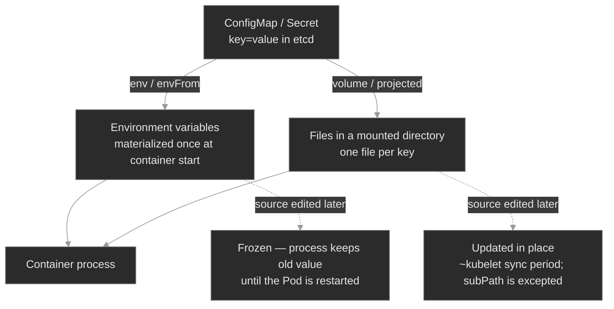

Two consequences fall out of this split. **At start:** a missing env reference fails the container *during creation* (`CreateContainerConfigError`); a missing mounted object fails *before* creation, leaving the Pod stuck in `ContainerCreating` on a `FailedMount`. **After start:** an env value is frozen for the life of the container, while a mounted file tracks the source — unless it's a `subPath` mount. Read the status and you know which path broke; know the path and you know whether an edit will ever take.

### Concept walkthrough

#### ConfigMaps and Secrets: two objects, one shape

A ConfigMap is a bag of key/value pairs for non-confidential settings — log levels, hostnames, tuning parameters, whole config files as multi-line values<sup><a href="https://kubernetes.io/docs/concepts/configuration/configmap/">[1]</a></sup>. A Secret is the same shape for confidential data, with two differences: values are base64-encoded in `data`, and the API treats them with more care (typed Secrets, separate RBAC conventions, optional encryption at rest)<sup><a href="https://kubernetes.io/docs/concepts/configuration/secret/">[2]</a></sup>. Both are namespaced and capped at **1 MiB** — they live in etcd and every kubelet that mounts one holds it in memory, so they're for settings, not data blobs.

The base64 in a Secret is the single most misunderstood thing in this module. **Base64 is encoding, not encryption.** Anyone who can `get` the Secret, anyone with etcd access, and anyone who can create a Pod in the namespace can read every Secret in it<sup><a href="https://kubernetes.io/docs/concepts/configuration/secret/#information-security-for-secrets">[3]</a></sup>. The encoding exists so a Secret can carry arbitrary bytes (binary keys, certs) in a JSON field — not to hide anything. To author one without hand-encoding, write plaintext into `stringData`; the API server encodes it into `data` and drops `stringData` on read, so `kubectl get secret -o yaml` always shows base64 `data`.

<details>
<summary>📖 Going deeper: why "Secret" doesn't mean secret — and what actually protects it<sup><a href="https://kubernetes.io/docs/concepts/security/secrets-good-practices/">[4]</a></sup></summary>

The name oversells it. Out of the box a Secret is just base64 in etcd; confidentiality comes from three things layered on top, none on by default in a vanilla cluster<sup><a href="https://kubernetes.io/docs/concepts/configuration/secret/#information-security-for-secrets">[3]</a></sup>:

1. **Encryption at rest.** An `EncryptionConfiguration` on the API server encrypts Secret values before they hit etcd, ideally via a KMS<sup><a href="https://kubernetes.io/docs/tasks/administer-cluster/encrypt-data/">[5]</a></sup>. Without it, an etcd backup is every credential in the clear.
2. **RBAC least privilege.** `get`/`list` on Secrets is the access boundary — with a subtle hole: *anyone who can create a Pod in a namespace can mount any Secret in it and read it*. Namespace boundaries are part of your Secret blast radius, not just `get secret` rules (RBAC → M10).
3. **An external store.** At scale, don't keep long-lived Secrets in the cluster at all — sync them from Vault/cloud managers via the External Secrets Operator, or commit only encrypted material (sealed-secrets, sops) to Git. That's M11.

M03 is the mechanics; M10–M11 are where "secret" becomes true.

</details>

#### Two ways in: environment variables vs mounted files

A container reads config exactly two ways, and the choice is architectural, not cosmetic.

**As environment variables.** `envFrom` injects every key of a ConfigMap or Secret as an env var; `env` with a `valueFrom` injects one named key<sup><a href="https://kubernetes.io/docs/tasks/configure-pod-container/configure-pod-configmap/">[6]</a></sup>:

```yaml
envFrom:
  - configMapRef: { name: app-config }      # every key → an env var
env:
  - name: DB_PASSWORD                        # one key → one env var
    valueFrom:
      secretKeyRef: { name: database-creds, key: DB_PASSWORD }
```

Env vars are simple and universal — every language reads them — but they have two sharp edges. They're materialized once, at container start, and never change after (the next section). And `envFrom` silently skips any key that isn't a valid environment-variable name: a key like `app.properties` is legal in a ConfigMap but illegal as an env var (the dot), so it's dropped, the Pod starts fine, and the only trace is one `InvalidEnvironmentVariableNames` warning event.

**As mounted files.** A ConfigMap or Secret volume projects each key as a file in a directory — `/etc/app-config/LOG_LEVEL` containing `info`<sup><a href="https://kubernetes.io/docs/concepts/configuration/configmap/#using-configmaps">[1]</a></sup>. This suits whole config files and large values, keeps confidential bytes off the process environment, and — critically — tracks the source object when it changes. A **projected volume** combines a ConfigMap, a Secret, downward-API fields, and a ServiceAccount token into one directory<sup><a href="https://kubernetes.io/docs/concepts/storage/projected-volumes/">[7]</a></sup>; the short-lived ServiceAccount token every Pod carries is delivered this way.

The **downward API** is the third source worth naming: it exposes the Pod's own metadata — name, namespace, IP, node, resource requests/limits — as env vars or files, so a process can learn things about itself that aren't in any ConfigMap<sup><a href="https://kubernetes.io/docs/concepts/workloads/pods/downward-api/">[8]</a></sup>. A few fields (labels, annotations) are file-only, because they can change while env is frozen.

#### The update problem: env is frozen, files drift, nothing rolls

This is the concept that pages people. **A ConfigMap or Secret edit does not restart anything** — no controller watches config objects to roll your Deployments. What happens next depends entirely on the consumption path:

- **Environment variables never update.** The value was baked into the container's environment at start. Editing the source ConfigMap changes the object in etcd and nothing else; the running process keeps the old value until its Pod is replaced<sup><a href="https://kubernetes.io/docs/concepts/configuration/configmap/#mounted-configmaps-are-updated-automatically">[9]</a></sup>.
- **Mounted files do update — eventually.** The kubelet refreshes mounted ConfigMaps/Secrets on its periodic sync; the change appears in the file after roughly the kubelet sync period (default ~1 minute) plus cache propagation<sup><a href="https://kubernetes.io/docs/concepts/configuration/configmap/#mounted-configmaps-are-updated-automatically">[9]</a></sup>. The application still has to *re-read* the file — many don't without a SIGHUP or a restart, so "the file updated" and "the app picked it up" are two different things.
- **`subPath` mounts are the trap.** Mounting a single key with `subPath` (to drop one file into an existing directory without hiding its other contents) opts you out of live updates entirely — that file is frozen like an env var<sup><a href="https://kubernetes.io/docs/concepts/configuration/configmap/#mounted-configmaps-are-updated-automatically">[9]</a></sup>.

So when you need a config change to take effect, you make it. The blunt instrument is `kubectl rollout restart deployment/<name>` — it rolls every Pod, which re-reads everything. The durable, GitOps-native one is a **config-hash annotation**: put a checksum of the ConfigMap/Secret into the Pod template's annotations, so changing the config changes the template hash and triggers a normal rolling update — the restart encoded in the manifest, auditable rather than hand-run<sup><a href="https://helm.sh/docs/howto/charts_tips_and_tricks/#automatically-roll-deployments">[10]</a></sup>.

<details>
<summary>📖 Going deeper: <code>immutable</code>, and making config changes safe by construction<sup><a href="https://kubernetes.io/docs/concepts/configuration/configmap/#configmap-immutable">[11]</a></sup></summary>

Setting `immutable: true` on a ConfigMap or Secret does two things (GA since Kubernetes v1.24)<sup><a href="https://kubernetes.io/docs/concepts/configuration/configmap/#configmap-immutable">[11]</a></sup>: it blocks all edits — you must delete and recreate to change the contents — and it lets the kubelet stop watching the object, which materially cuts API-server watch load in clusters with thousands of config objects.

The two benefits compose into a pattern. Name config objects by content — `app-config-7f3a9`, the suffix a hash of the data — mark them `immutable`, and reference the hashed name from the Pod template. Now "changing config" means *creating a new immutable object and updating the reference*, which is itself a Pod-template change, which rolls the Deployment. You get safety (nothing mutates a live config out from under a running Pod), an automatic rollout (the reference changed), and a clean rollback (the old object still exists). The "I edited the ConfigMap and nothing happened" footgun becomes structurally impossible — and it's exactly what Kustomize's and Helm's config generators do for you, garbage-collecting the old objects too.

</details>

#### When config breaks the Pod: the start-up differential

When a config reference is wrong, the failure shape tells you which path broke — the same read-the-status-and-events discipline from M00, applied to configuration. Three shapes cover almost everything:

- **`CreateContainerConfigError`** — the kubelet scheduled the Pod and tried to *create the container*, but couldn't assemble its environment: a required `env`/`envFrom` reference points at a ConfigMap/Secret that doesn't exist, or a key that isn't in it. The describe event is explicit: `Error: couldn't find key MAX_CONNECTIONS in ConfigMap media/app-config`<sup><a href="https://kubernetes.io/docs/tasks/configure-pod-container/configure-pod-configmap/">[6]</a></sup>. This is an *environment-injection* failure — the Pod got far enough to attempt container creation.
- **Stuck `ContainerCreating`, `FailedMount` event** — the Pod references a Secret/ConfigMap as a *volume* that doesn't exist. Volume setup is a precondition to container creation, so the container is never even attempted; the Pod sits in `ContainerCreating` while the kubelet retries the mount and emits `MountVolume.SetUp failed for volume … secret "portal-secrets" not found`. Same root cause as the first shape — a missing referenced object — but a different lifecycle phase, so a different status and a different event to look for.
- **`Running`, but wrong** — no error at all. The reference resolved, the value was injected, the Pod is `Ready` — and the value is wrong: a Secret base64-encoded twice that decodes to a still-encoded string, or a stale env after an un-rolled config edit. This is configuration's instance of a theme that recurs at every layer — the headline status is green and the system is still wrong (M01's `Running` ≠ `Ready`, M01b's `Complete` ≠ correct). You find it not in the status but by reading the value the container actually got: `kubectl exec … -- printenv` or `cat` the mounted file.

The escape hatch for the first two is `optional: true` on the reference — a missing object or key is then skipped and the Pod starts<sup><a href="https://kubernetes.io/docs/tasks/configure-pod-container/configure-pod-configmap/">[6]</a></sup>. Use it where the app has a sane fallback; avoid it where you'd rather fail loudly than start on an empty value, because `optional` converts a `CreateContainerConfigError` you'd notice into a silent missing value you might not.

### Hands-on

Four steps in the baseline, four break/fix scenarios — all on the full Polyphone fleet, configured the way real workloads are: `session-broker` (`media`) reads an `app-config` ConfigMap both as env vars and as mounted files; `account-provisioner` (`provisioning`) takes its `database-creds` Secret as env; `portal-ui` (`admin-portal`) mounts a Secret as files.

- **`baseline/`** — ConfigMaps and Secrets across the fleet, the two consumption modes read out of running containers, mounted files vs env, and a Secret decoded to show base64 isn't security. What healthy config wiring looks like.
- **`breakfix-01-configmap-key-missing/`** — a Pod in `CreateContainerConfigError`. Tests reading the config-key failure: a required `env` reference to a key the ConfigMap doesn't have.
- **`breakfix-02-secret-volume-missing/`** — a Pod stuck in `ContainerCreating`. Tests recognizing a `FailedMount` for a Secret that was never created — a different failure surface from the env case.
- **`breakfix-03-stale-env-config/`** — a ConfigMap was updated but the workload still serves the old value. Tests the propagation gap: env is frozen, and a config edit rolls nothing until you make it.
- **`breakfix-04-secret-double-base64/`** — a Pod `Running` and `Ready` on a wrong credential. Tests finding a green-but-wrong config by reading the value the container actually got, and the base64 boundary that produced it.

Check yourself against `ANSWER-KEY.md` after each.

### Common failure modes

| Symptom | Likely cause | Where to look |
|---------|--------------|---------------|
| `CreateContainerConfigError` | Required `env`/`envFrom` ref to a missing ConfigMap/Secret or a missing key | `kubectl describe pod` events (`couldn't find key …`); the container's `env`/`envFrom`; does the key exist in the object |
| Stuck `ContainerCreating` (no logs) | Volume mount of a Secret/ConfigMap that doesn't exist | `describe pod` events (`FailedMount … not found`); the Pod's volumes; `kubectl get secret/configmap -n <ns>` |
| Edited a ConfigMap/Secret, nothing changed | Env consumers are frozen; nothing rolls on a config edit | Is it consumed as env or as a file; did the Pods restart; `rollout restart` or a hash-annotation |
| Mounted file still stale after minutes | `subPath` mount (no live update), or app never re-read the file | The volumeMount's `subPath`; whether the app reloads config without a restart |
| `Running` but behaving on wrong value | Double-base64'd Secret, wrong key, or stale env | `kubectl exec … -- printenv` / `cat` the file; decode the Secret with `base64 -d` and compare |
| `envFrom` key silently absent | A ConfigMap key that isn't a valid env-var name (e.g. has a `.` or `-`) was skipped | `describe pod` for an `InvalidEnvironmentVariableNames` warning; use a volume mount or rename the key |

### Recap

- Configuration is separated from the image and delivered at runtime by ConfigMaps (non-confidential) and Secrets (confidential, base64-in-etcd). **Base64 is encoding, not encryption** — RBAC, encryption-at-rest, and external stores are what actually protect a Secret.
- A container consumes config two ways — **environment variables or mounted files** — and the choice is load-bearing: it determines both how a bad reference fails and whether a later edit ever reaches the process.
- **Env vars are frozen at container start; mounted files update with the source (after ~the kubelet sync period), except `subPath`.** A config edit restarts nothing on its own — force it with `rollout restart` or, GitOps-natively, a config-hash annotation (and `immutable` makes change-by-recreate the only path).
- **The config-failure differential:** `CreateContainerConfigError` = a missing env key/object; stuck `ContainerCreating` + `FailedMount` = a missing mounted object; `Running`-but-wrong = a value that resolved but is incorrect. Status and events name the first two; only reading the injected value catches the third.
- A green Pod can still hold the wrong config. `Running` ≠ correct — the same "the headline status lies" instinct from `Running` ≠ `Ready` and `Complete` ≠ correct, now pointed at the values inside the container.

### Production thinking

- A credential rotates and you update the Secret, but the workloads consume it as env vars. Nothing changes — running Pods hold the old value, and they'll keep authenticating with it until something restarts them. How do you make a Secret rotation actually reach every consumer, and how would you detect the ones still running on the stale value?
- Your team is split: one service reads config from env vars, another from a mounted file, and only the file-based one picks up edits live. What's your standard — do you mandate one consumption mode, lean on `rollout restart` everywhere, or adopt hashed-immutable config objects so every change rolls by construction? What does each choice cost the release process?
- A developer base64-encodes a password by hand, gets it wrong, and ships a Pod that's `Running` and `Ready` on a broken credential — no alert fires, because nothing crashed. What in your pipeline or your manifests would have caught a green-but-wrong config before it reached prod?

### References

1. Kubernetes — ConfigMaps: https://kubernetes.io/docs/concepts/configuration/configmap/
2. Kubernetes — Secrets: https://kubernetes.io/docs/concepts/configuration/secret/
3. Kubernetes — Information security for Secrets: https://kubernetes.io/docs/concepts/configuration/secret/#information-security-for-secrets
4. Kubernetes — Good practices for Kubernetes Secrets: https://kubernetes.io/docs/concepts/security/secrets-good-practices/
5. Kubernetes — Encrypting Confidential Data at Rest: https://kubernetes.io/docs/tasks/administer-cluster/encrypt-data/
6. Kubernetes — Configure a Pod to Use a ConfigMap: https://kubernetes.io/docs/tasks/configure-pod-container/configure-pod-configmap/
7. Kubernetes — Projected Volumes: https://kubernetes.io/docs/concepts/storage/projected-volumes/
8. Kubernetes — Downward API: https://kubernetes.io/docs/concepts/workloads/pods/downward-api/
9. Kubernetes — Mounted ConfigMaps are updated automatically: https://kubernetes.io/docs/concepts/configuration/configmap/#mounted-configmaps-are-updated-automatically
10. Helm — Automatically Roll Deployments (config-hash annotation): https://helm.sh/docs/howto/charts_tips_and_tricks/#automatically-roll-deployments
11. Kubernetes — Immutable ConfigMaps: https://kubernetes.io/docs/concepts/configuration/configmap/#configmap-immutable


---

## Break/Fix Practice

## Break/fix 01 — CreateContainerConfigError

**Symptom — what you'd actually see:**

`session-broker` in `media` won't start after a change; `kubectl logs` is empty (the container never ran). Status is **`CreateContainerConfigError`** — not a crash, not a pull error.

**Think about this before you open the answer:**

Reading a config-key failure from the status and event. Self-grading questions:

- Did the `CreateContainerConfigError` status (vs `CrashLoopBackOff` or `ImagePullBackOff`) tell you this was config, not code or image?
- Did you let the event name the exact key (`couldn't find key MAX_CONNECTIONS`) instead of guessing?
- Did you check *both* sides — the reference and the ConfigMap's actual keys — before deciding which one to fix?

<details>
<summary><b>Click to reveal: diagnostic commands, root cause, exact fix, verify</b></summary>

**Root cause:**

The container has a required `env.valueFrom.configMapKeyRef` pointing at key `MAX_CONNECTIONS` in the `app-config` ConfigMap, and that key doesn't exist (the map has `LOG_LEVEL` and `MAX_SESSIONS`). The kubelet schedules the Pod, tries to assemble the container's environment, can't find the key, and fails container creation<sup><a href="https://kubernetes.io/docs/tasks/configure-pod-container/configure-pod-configmap/">[1]</a></sup>. This is the env-injection branch — the Pod got far enough to attempt container creation.

**Diagnostic commands (run in this order):**

```bash
# 1. The status itself is the first clue — a config error, not a crash or pull
kubectl get pods -n media
# 2. The event names the exact missing key (Events: at the bottom of describe)
kubectl describe pod -n media -l app=session-broker
#    Error: couldn't find key MAX_CONNECTIONS in ConfigMap media/app-config
# 3. Confirm both sides — the env reference in the Deployment yaml (find env:)…
kubectl get deploy session-broker -n media -o yaml
#    env: … configMapKeyRef → key: MAX_CONNECTIONS
# 4. …and the ConfigMap's actual keys (describe lists the Data section)
kubectl describe configmap app-config -n media
#    Data: LOG_LEVEL=info, MAX_SESSIONS=500 — no MAX_CONNECTIONS
```

**Exact fix:**

Make the reference resolve. The intended key here is `MAX_SESSIONS`:

```bash
kubectl patch deployment session-broker -n media --type=json \
  -p='[{"op":"replace","path":"/spec/template/spec/containers/0/env/0/valueFrom/configMapKeyRef/key","value":"MAX_SESSIONS"}]'
```

If the app genuinely needs a `MAX_CONNECTIONS` setting, fix the other side — `kubectl patch configmap app-config -n media -p '{"data":{"MAX_CONNECTIONS":"200"}}'` then `kubectl rollout restart deployment session-broker -n media` (env is frozen). Marking the ref `optional: true` lets the Pod start without the value — only where the app has a sane fallback.

**Verify:**

```bash
kubectl get pods -n media -l app=session-broker   # Running 1/1
```

**Production thinking:**

A `configMapKeyRef` to a non-existent key is usually a rename gone half-done — the manifest was updated to a new key name, the ConfigMap wasn't (or vice-versa). The durable fix keeps the two in lockstep: template the env reference and the ConfigMap from the same source (Kustomize/Helm), so a key rename touches both at once. `optional: true` is a deliberate choice, not a default — it trades a loud `CreateContainerConfigError` for a silent missing value, which is the right call only when the app degrades gracefully.

</details>

---

## Break/fix 02 — stuck ContainerCreating (FailedMount)

**Symptom — what you'd actually see:**

`portal-ui` in `admin-portal` is stuck `0/1` `ContainerCreating` and never goes `Ready`; the admin portal is down. No logs, no config error.

**Think about this before you open the answer:**

Recognizing a stuck-`ContainerCreating` as a volume problem, not a config-error or scheduling one. Self-grading questions:

- Did `ContainerCreating` + no logs + no `CreateContainerConfigError` lead you to a *mount*, not an env reference?
- Did you read the `FailedMount` event for the exact missing object rather than assuming a node/scheduling issue?
- Did you remember Secrets are namespaced — that the fix has to land in `admin-portal`, not wherever the Secret might already exist?

<details>
<summary><b>Click to reveal: diagnostic commands, root cause, exact fix, verify</b></summary>

**Root cause:**

The Pod mounts a Secret named `portal-secrets` as a volume, but that Secret was never created in the namespace. Volume setup is a precondition to container creation, so the container is never attempted — the Pod sits in `ContainerCreating` while the kubelet retries the mount<sup><a href="https://kubernetes.io/docs/concepts/configuration/secret/">[2]</a></sup>. Same family of root cause as break/fix 01 (a referenced object that isn't there) but a different consumption mode, caught at a different phase.

**Diagnostic commands (run in this order):**

```bash
# 1. Stuck ContainerCreating (not a config error, not a crash) → suspect a volume
kubectl get pods -n admin-portal
# 2. The FailedMount event names the missing object (Events: in describe)
kubectl describe pod -n admin-portal -l app=portal-ui
#    Warning  FailedMount  ... secret "portal-secrets" not found
# 3. Confirm both sides — the volume the pod mounts (find volumes: in the yaml)…
kubectl get deploy portal-ui -n admin-portal -o yaml
#    volumes: … secret → secretName: portal-secrets
# 4. …and whether the Secret exists
kubectl get secret -n admin-portal
#    no portal-secrets row
```

**Exact fix:**

Create the missing Secret in the Pod's namespace; the kubelet's retry loop finishes the mount and the Pod starts — no manual restart needed:

```bash
kubectl create secret generic portal-secrets \
  --from-literal=SESSION_SECRET=s3ssion-signing-key \
  --from-literal=ADMIN_API_KEY=adm-9f2a1c7e \
  -n admin-portal
```

**Verify:**

```bash
kubectl get pods -n admin-portal -l app=portal-ui   # both Running 1/1
```

**Production thinking:**

A missing mounted Secret is rarely "it never existed" — it's applied to the wrong namespace, renamed, or dropped from a manifest set during a refactor. The hand-run `kubectl create` recovers the incident, but the durable fix restores it from the source of truth (a sealed-secret in Git, or a sync from your secret manager — M11), so a redeploy can't lose it again. Alerting on Pods stuck in `ContainerCreating` beyond a threshold catches this class before a human notices the outage.

</details>

---

## Break/fix 03 — config edited, nothing changed

**Symptom — what you'd actually see:**

Someone raised `session-broker`'s log level to `debug` by editing the `app-config` ConfigMap. `kubectl get configmap` confirms `debug`, but the workload's logs never changed. The Pod is `Running` and `Ready`; nothing looks broken.

**Think about this before you open the answer:**

Knowing that a config edit doesn't propagate to env consumers on its own. Self-grading questions:

- When "the change didn't take," did you compare the ConfigMap value against the *running container's* value, rather than re-checking the ConfigMap (which looked fine)?
- Did you know *why* — env frozen at start, no auto-rollout on a config edit — rather than just blindly restarting?
- Could you say what would have been different if the value were a mounted file (live-updated, except `subPath`)?

<details>
<summary><b>Click to reveal: diagnostic commands, root cause, exact fix, verify</b></summary>

**Root cause:**

`session-broker` consumes `app-config` via `envFrom`, as environment variables. Env vars are materialized once, at container start, and never update; and a ConfigMap edit doesn't restart any consumers<sup><a href="https://kubernetes.io/docs/concepts/configuration/configmap/#mounted-configmaps-are-updated-automatically">[3]</a></sup>. So the edit updated the object in etcd while the running Pod kept the `info` value it was born with. (Had the value been a *mounted file*, the kubelet would have refreshed it within ~the sync period — env is the mode with no live-update path.)

**Diagnostic commands (run in this order):**

```bash
# 1. The source of truth — the ConfigMap holds the new value (Data section)
kubectl describe configmap app-config -n media                        # LOG_LEVEL: debug
# 2. The running container — still the old value
kubectl exec deploy/session-broker -n media -- printenv LOG_LEVEL                  # info
# 3. The pod is healthy and old — it never restarted to pick up the edit
kubectl get pods -n media -l app=session-broker   # Running 1/1, AGE predates the edit
```

**Exact fix:**

Restart the consumers so they re-read the config at start:

```bash
kubectl rollout restart deployment session-broker -n media
kubectl rollout status deployment session-broker -n media
```

**Verify:**

```bash
kubectl exec deploy/session-broker -n media -- printenv LOG_LEVEL   # debug
```

**Production thinking:**

`rollout restart` is the right incident tool, but it's imperative and invisible to Git. The durable pattern is a **config-hash annotation** on the Pod template — a checksum of the ConfigMap/Secret, so any config change changes the template hash and rolls the Deployment automatically<sup><a href="https://helm.sh/docs/howto/charts_tips_and_tricks/#automatically-roll-deployments">[4]</a></sup>. Kustomize and Helm config generators do this for you; pairing it with `immutable` + hashed-name config objects makes "change config" mean "create a new object and roll," which can't silently fail to propagate. To detect the stale ones, you'd compare consumed config against current — non-trivial for env, which is why the hash pattern (prevention) beats detection.

</details>

---

## Break/fix 04 — Running, but the credential is wrong

**Symptom — what you'd actually see:**

`account-provisioner` in `provisioning` is `Running` and `Ready`, but can't authenticate to its database — provisioning is failing. No crash, no restart, no error event.

**Think about this before you open the answer:**

Finding a green-but-wrong config by reading the injected value, and understanding the base64 boundary. Self-grading questions:

- With every status green, did you think to read the *value* (`printenv`) rather than trusting `Running`/`Ready`?
- Did you recognize a password-shaped-like-base64 as a double-encoding tell, and decode to confirm?
- Did you fix the encoding *and* roll the consumer — knowing the Secret fix alone wouldn't reach the running Pod (the break/fix 03 lesson)?

<details>
<summary><b>Click to reveal: diagnostic commands, root cause, exact fix, verify</b></summary>

**Root cause:**

The `database-creds` Secret's `DB_PASSWORD` was base64-encoded twice. A Secret's `data` is already base64, and the kubelet decodes it once before injecting — so a double-encoded value arrives at the container still encoded: the env `DB_PASSWORD` is the literal string `Y2hhbmdlbWU=` (base64 of `changeme`) instead of `changeme`<sup><a href="https://kubernetes.io/docs/concepts/configuration/secret/">[2]</a></sup>. The reference resolved and a value was injected, so every status is green; the value is just wrong.

**Diagnostic commands (run in this order):**

```bash
# 1. The pod is healthy — the problem is the value, not the state
kubectl get pods -n provisioning   # Running 1/1
# 2. Read the value the container actually got — it looks like base64, not a password
kubectl exec deploy/account-provisioner -n provisioning -- printenv DB_PASSWORD
#    Y2hhbmdlbWU=
# 3. Decode it — that's the intended password, encoded one extra time
echo 'Y2hhbmdlbWU=' | base64 -d; echo        # changeme
# 4. The Secret's data is double-encoded: one decode leaves it still base64
kubectl get secret database-creds -n provisioning -o yaml   # data: DB_PASSWORD: WTJoaGJtZGxiV1U9
#    WTJoaGJtZGxiV1U9   → base64 -d → Y2hhbmdlbWU=  → base64 -d → changeme
```

**Exact fix:**

Recreate the Secret with the value encoded exactly once — let the tooling encode it instead of doing it by hand — then roll the consumer (env is frozen):

```bash
kubectl create secret generic database-creds \
  --from-literal=DB_HOST=postgres.polyphone.example \
  --from-literal=DB_PASSWORD=changeme \
  -n provisioning --dry-run=client -o yaml | kubectl apply -f -
kubectl rollout restart deployment account-provisioner -n provisioning
```

(Authoring YAML directly? Put the plaintext in `stringData` and let the API server encode it once.)

**Verify:**

```bash
kubectl exec deploy/account-provisioner -n provisioning -- printenv DB_PASSWORD   # changeme
```

**Production thinking:**

Hand-base64'ing is the root mistake — `stringData`, `kubectl create --from-literal`, and every secret-management tool exist so a human never types base64. A green-but-wrong credential is dangerous precisely because nothing pages: the catch is upstream. A schema/lint check in CI that rejects a `data` value which is itself valid base64 of valid base64, or smoke-testing a real auth after a secret change, catches it before prod. And because env is frozen, any secret rotation needs a consumer roll — automate the roll with the config-hash pattern so a rotated-but-not-restarted fleet doesn't keep running on the old credential.

</details>

---


---

# `m04-networking-services-dns/`

## Concept

## M04 — Networking I: Services & DNS

> How a stable name reaches a moving set of Pods — Services, selectors, EndpointSlices, kube-proxy, and cluster DNS — and the three places on that path where traffic silently stops flowing.

### What you'll learn

- Describe what already works before any Service exists: every Pod holds a routable IP, and Pods reach each other across nodes with no address translation
- Explain what a Service is and why it exists: a stable virtual IP and DNS name in front of a set of Pods whose own IPs change constantly
- Trace a request from a client all the way to a container: name → ClusterIP → node rules → Pod IP → listening socket, and name the component that owns each hop
- Read a Service's real backend set with `kubectl describe svc` or `kubectl get endpointslice`, and recognize the empty-endpoints black hole
- Distinguish `port`, `targetPort`, and `containerPort`, and diagnose the connection-refused you get when `targetPort` points at nothing
- Resolve a Service by DNS the way a Pod does — short name, `<svc>.<ns>`, and the FQDN — and explain why a bare name fails across namespaces
- Work the connectivity differential: split a failed request into *name didn't resolve* vs *no endpoints* vs *wrong port*

### Why it matters

Pods are disposable. A Deployment rolls, a node drains, an HPA scales, and the Pod IPs you had a minute ago are gone — no application could function while tracking them. Every call between Polyphone components therefore goes through a Service and a DNS lookup. When that plumbing breaks, the failure is rarely where you first look.

The trap is that the failure is quiet and the top-line objects look healthy. `kubectl get svc` shows a ClusterIP. `kubectl get pods` shows everything `Running` and `Ready`. The request still hangs or comes back refused, because the one thing that carries traffic — the EndpointSlice — is empty, or points at a port nothing listens on, or the client asked for a name that never resolved. An SRE who knows the request path checks the endpoints and the DNS answer first. One who doesn't restarts Pods that were never the problem.

### Scope

**Covers:** the flat Pod-network model a Service sits on, the Service object and its types (ClusterIP, NodePort, LoadBalancer, ExternalName, headless), how a selector becomes an EndpointSlice, the `port`/`targetPort`/`containerPort` distinction, the node datapath (network namespace, veth pair, kube-proxy rewrite, connection tracking), cluster DNS via CoreDNS, the five access paths, and the name-resolves / has-endpoints / port-answers differential.

**Doesn't cover:** NetworkPolicy and Ingress → M14 (traffic is default-allow here), service mesh and mesh mTLS → M15, CNI internals and the host-networking escape hatches (`hostNetwork`, `hostPort`, secondary interfaces) → M22, and cloud-specific load balancer provisioning. This module is the in-cluster L4 path: name to Pod.

**Assumes:** M00 (`get → describe → events → logs`; spec vs status), M01 (Pods, Deployments, labels, readiness — a Pod can be `Running` but not `Ready`).

### Vocabulary

| Term | Definition |
|------|------------|
| **Service** | A namespaced API object giving a stable identity (a virtual IP and a DNS name) to a logical set of Pods. The set is defined by a label selector. |
| **ClusterIP** | The default Service type: a virtual IP reachable only inside the cluster. The IP is stable for the Service's life and backed by no single Pod. |
| **selector** | The set of labels on a Service that defines which Pods are its backends. Matching is identical to a ReplicaSet's selector (M01). |
| **Endpoints / EndpointSlice** | The derived object listing a Service's real backend addresses (Pod IP + port). `Endpoints` is the original form — one object holding every backend. **EndpointSlice** is the modern one, which shards a large backend set across several objects so a single Pod change doesn't rewrite the whole list. `kubectl get endpoints` reads the old API, `kubectl get endpointslice` the new. **Only `Ready` Pods appear.** |
| **kube-proxy** | The node agent that watches Services and EndpointSlices and programs the node's forwarding state, so ClusterIP traffic reaches a backend. Some clusters use another dataplane. |
| **`port`** | The port the Service listens on — what clients connect to (`<svc>:<port>`). |
| **`targetPort`** | The Pod port the Service forwards to. Defaults to `port` if omitted. Can be a number or a named port. |
| **`containerPort`** | A port the container declares in its Pod spec. Informational — it does **not** open or close anything; the process listens (or doesn't) regardless. |
| **headless Service** | A Service with `clusterIP: None`. No virtual IP and no kube-proxy load-balancing; DNS returns the Pod IPs directly. Used for StatefulSets and client-side discovery. |
| **NodePort / LoadBalancer / ExternalName** | Exposure types layered outward from ClusterIP. **NodePort** keeps the ClusterIP and also opens the Service on one port on every node, so traffic from outside can reach it. **LoadBalancer** keeps both of those and asks the cloud provider for an external load balancer in front of the node ports. **ExternalName** proxies nothing at all — it is a CNAME to a DNS name outside the cluster. |
| **CNI plugin** | The component that attaches each Pod to the node network and carries Pod traffic between nodes. The kubelet calls it when a Pod starts. |
| **network namespace** | The kernel isolation giving a Pod its own interfaces, routing table, and port space. Every container in the Pod shares one, so they reach each other on `localhost` and cannot both bind the same port. |
| **veth pair** | A virtual cable with one end in the Pod's network namespace and the other in the node's. Every packet a Pod sends crosses it. |
| **connection tracking** | The kernel's record of an open connection, including the rewrite kube-proxy applied to it. It reverses that rewrite on the reply. |
| **`kubectl port-forward`** | A stream from your workstation to one Pod, carried by the apiserver and the kubelet. It uses no ClusterIP and no kube-proxy rule. |
| **CoreDNS** | The cluster DNS server (Pods in `kube-system`), itself fronted by a Service (`kube-dns`). Resolves Service and Pod names to cluster IPs. |
| **FQDN / search domains / `ndots`** | A Service's full name is `<svc>.<ns>.svc.cluster.local`. A Pod's `/etc/resolv.conf` lists `search` domains that expand short names, and `ndots` decides when a name is tried as-is instead. |

### Mental model

A request to a Service travels a fixed path, and each hop is owned by a different component. You write one field of that chain; named components write the rest.

| On the path | Written by | Written from |
|-------------|------------|--------------|
| Service + selector | you | your intent |
| ClusterIP | the apiserver | the Service IP range |
| DNS record | CoreDNS | the Service object |
| EndpointSlice | the EndpointSlice controller | the selector + `Ready` Pods |
| Kernel rules, per node | kube-proxy | the Service + its EndpointSlice |
| The listening socket | your process | your code or its config |

Read the table as failure domains. A broken path means one writer got the wrong input, or never ran.

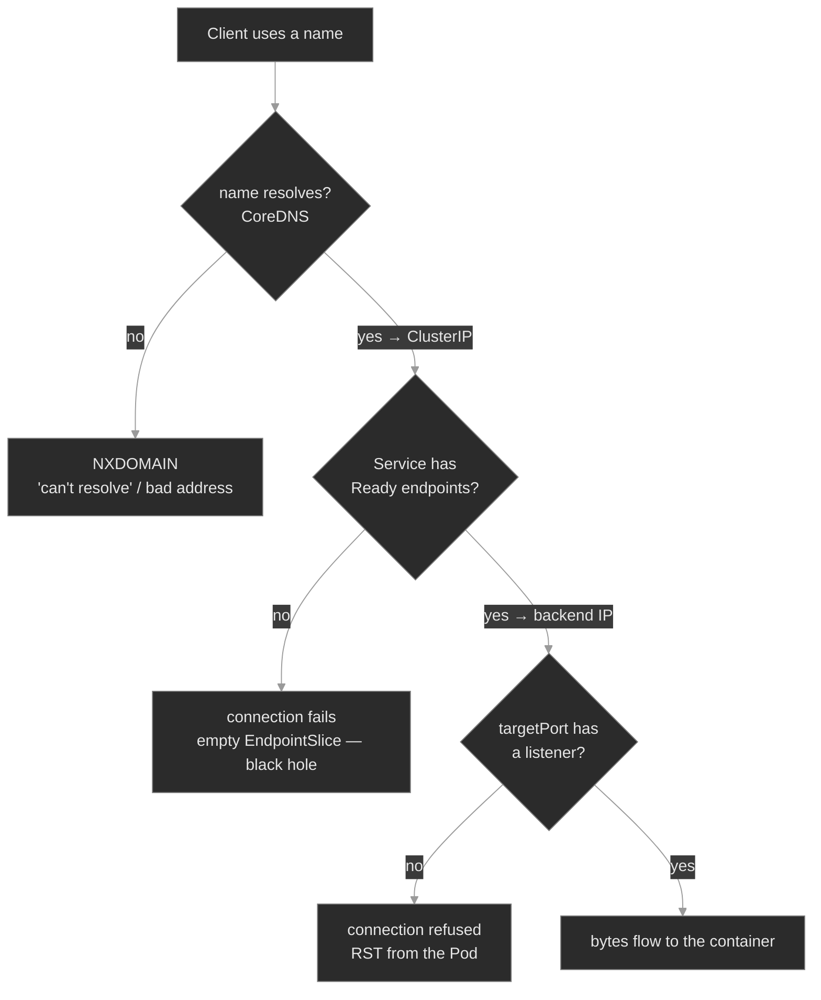

The three red leaves are the three ways the path breaks, in the order a request meets them. The instinct, inherited from M02's pull-failure differential and M03's config differential: **`connection refused` is a category, not a diagnosis.** The client's error says it failed; the EndpointSlice and the DNS answer say *where*. Read those first<sup><a href="https://kubernetes.io/docs/tasks/debug/debug-application/debug-service/">[6]</a></sup>.

### Concept walkthrough

#### Before the Service: every Pod already has an IP

Start one layer below the Service, because that layer already works. Kubernetes gives every Pod one IP address, shared by its containers, reachable from every other Pod in the cluster — including Pods on other nodes<sup><a href="https://kubernetes.io/docs/concepts/cluster-administration/networking/">[8]</a></sup>. Neither side's address is translated on the way, so a server sees the client's real Pod IP. The **CNI plugin** provides this: the kubelet calls it when a Pod starts, and the plugin attaches the Pod to the node and carries packets between nodes.

That no-translation guarantee stops at the cluster edge. Traffic leaving for an external endpoint is **source-NATed to the node's IP**, so the far side sees a node, not a Pod. It's why a partner's IP allowlist has to name your nodes, why external audit logs show node addresses, and why a Pod-level identity can't be inferred from an outbound connection.

So Pod-to-Pod calls need no Service at all. What Pod IPs cannot do is hold still. A rollout replaces a Pod and its IP is gone; an autoscaler adds three addresses nobody configured. No client can keep a Pod IP as configuration. **A Service is not a connectivity layer. It is a naming and load-balancing layer on top of one that already connects.** Keep that separation when a call fails: ask whether the name, the backend list, or the port broke — not whether the network is up.

#### A Service is a stable identity for a moving target

A Service separates *who you call* from *which Pods answer*<sup><a href="https://kubernetes.io/docs/concepts/services-networking/service/">[1]</a></sup>. You create a `session-broker` Service with the selector `app: session-broker`, and from then on anything in the cluster reaches it at a fixed ClusterIP and DNS name, however often the Pods behind it are replaced<sup><a href="https://kubernetes.io/docs/tutorials/services/connect-applications-service/">[7]</a></sup>. The default type, **ClusterIP**, allocates that virtual IP from the Service CIDR; it answers only inside the cluster.

The selector is the whole mechanism. The control plane runs an EndpointSlice controller that watches for Pods matching the selector and writes their addresses and conditions into an **EndpointSlice**. Traffic normally uses the endpoints considered **ready**<sup><a href="https://kubernetes.io/docs/concepts/services-networking/endpoint-slices/">[2]</a></sup>. This is M01's readiness gate doing load-balancer duty: a Pod that fails its probe leaves the EndpointSlice and stops receiving traffic without being killed. The Service and its EndpointSlice are two different objects, and that is the module's most important diagnostic fact: `kubectl get svc` says the Service *exists*; `kubectl get endpointslice` says whether it has anywhere to send traffic.

That gives the module's instance of a recurring theme: the headline status lies (M01's `Running` ≠ `Ready`). A Service with a ClusterIP, the right ports, and no errors routes nowhere if its EndpointSlice lists no addresses. That happens for exactly two reasons — the selector matches no Pods, or the matched Pods are not `Ready` — and both look identical at the Service.

```yaml
apiVersion: v1
kind: Service
metadata: { name: session-broker, namespace: media }
spec:
  selector: { app: session-broker }   # must match the Pods' labels exactly
  ports:
    - port: 80           # clients connect here:  session-broker:80
      targetPort: 80     # forwarded to this Pod port
```

#### Ports: `port` vs `targetPort` vs `containerPort`, and what kube-proxy does

Three port fields show up around a Service, and conflating them explains most of "the endpoints are right but it still won't connect." Vocabulary above defines each. What matters here is the division of labour: only **`targetPort`** decides *where* traffic is delivered, and only the **process** decides whether anything answers there. `containerPort` states intent and opens nothing<sup><a href="https://kubernetes.io/docs/concepts/services-networking/service/#defining-a-service">[1]</a></sup>. The failure mode: a Service whose `targetPort` points at a port no process is listening on. The EndpointSlice is fully populated (the selector matched, the Pods are Ready), the name resolves, the connection is delivered to the Pod — and the Pod's kernel sends a RST because nothing is bound there. The client sees `connection refused`, and the endpoints look perfect, which is exactly why this one sends people in circles.

Once a Service has endpoints, the **Service dataplane** on each node is what makes the ClusterIP work. On a normal cluster that is **kube-proxy**: it watches Services and EndpointSlices and *programs* the node's kernel — upstream, with nftables or iptables — so a packet sent to `ClusterIP:port` is redirected to one of the backend Pod addresses at its `targetPort`, selected per connection. kube-proxy is not a userspace proxy handling each packet; the kernel carries the traffic<sup><a href="https://kubernetes.io/docs/reference/networking/virtual-ips/">[3]</a></sup>. The ClusterIP itself is virtual: nothing holds it, no interface answers ARP for it; it exists only as forwarding state on the nodes running the dataplane. With **zero** usable endpoints there is nothing to forward to, and the client sees a refusal, a drop, or a timeout depending on the mode — which is why the EndpointSlice, not the client error, is what tells you why.

Zooming into one node makes that rewrite concrete. A packet leaves the client Pod through a **veth pair** — a virtual cable with one end in the Pod's network namespace and the other in the node's<sup><a href="https://kubernetes.io/docs/concepts/cluster-administration/networking/">[8]</a></sup>. In the node's network stack it meets kube-proxy's rules, which choose one backend from the EndpointSlice and rewrite the destination from `ClusterIP:port` to `PodIP:targetPort`. When that Pod sits on another node, the CNI routes or encapsulates the packet across. The reply needs no rule of its own: the kernel's **connection tracking** remembers the rewrite and reverses it, so the client sees an answer from the ClusterIP it dialed<sup><a href="https://kubernetes.io/docs/reference/networking/virtual-ips/">[3]</a></sup>. Two consequences follow. A backend is chosen once per connection, not per packet, so a backend dying mid-connection breaks that connection and not the next. And the state is per node, which is why one node can fail while the others serve the same Service.

<details>
<summary>📖 Going deeper: kube-proxy modes, and why the ClusterIP is "nowhere"<sup><a href="https://kubernetes.io/docs/reference/networking/virtual-ips/">[3]</a></sup></summary>

Upstream kube-proxy has two modes worth knowing<sup><a href="https://kubernetes.io/docs/reference/networking/virtual-ips/">[3]</a></sup>. **iptables**, the long-time default, writes one chain per Service and matches linearly, so its rule-update cost grows with Service count. **nftables** is its successor, addressing the same limits inside the nft framework. An **IPVS** mode also exists; it is legacy and deprecated, so do not build the mental model around it. Some networking implementations replace kube-proxy with their own dataplane, for example an eBPF one; the objects stay identical and only the tooling changes.

There is no "Service process" to restart and no host that owns the ClusterIP. On a node that can't reach a Service, read the mode first, then that mode's state — `iptables-save | grep <clusterip>`, or `nft list ruleset`. On a kube-proxy-free cluster, neither applies; you inspect the plugin's own state instead.

</details>

#### Cluster DNS: how a Pod turns a name into a ClusterIP

A ClusterIP is stable, but nobody wants to hardcode `10.96.x.y`. Cluster DNS lets you use names. **CoreDNS** runs as a Deployment in `kube-system`, fronted by a Service named `kube-dns`, and every Pod is configured to use it: the Pod's `/etc/resolv.conf` points `nameserver` at the `kube-dns` ClusterIP<sup><a href="https://kubernetes.io/docs/concepts/services-networking/dns-pod-service/">[4]</a></sup>. Every Service automatically gets an A/AAAA record at:

```text
<service>.<namespace>.svc.cluster.local
```

So `session-broker` in `media` is fully `session-broker.media.svc.cluster.local`. You rarely type that, because of the **search domains** in `resolv.conf`. A Pod in `media` gets a search list like `media.svc.cluster.local  svc.cluster.local  cluster.local`, so a bare `session-broker` resolves. That convenience is also the most common cluster-DNS bug: **a short name resolves only within its own namespace.** A Pod in `provisioning` asking for bare `session-broker` searches `session-broker.provisioning.svc.cluster.local` first, which doesn't exist, and gets NXDOMAIN — the search domains are built from the *client's* namespace, not the target's. Qualify it as `session-broker.media`, or use the full FQDN.

The same `resolv.conf` carries `options ndots:5`. It means: if a name has fewer than 5 dots, try it with each search domain appended *first*, and as a literal name only if all of those fail<sup><a href="https://kubernetes.io/docs/concepts/services-networking/dns-pod-service/#pod-s-dns-config">[5]</a></sup>. It is why short in-cluster names work — and why an *external* name like `api.stripe.com` (3 dots) costs several failing cluster lookups first, which adds up at scale. A trailing dot marks a name fully-qualified and skips the search list.

One caveat costs real debugging time: `ndots` is a glibc resolver feature, and busybox does not implement it. busybox queries any name containing a dot literally, so `nslookup <svc>.<ns>` from a busybox debug Pod returns NXDOMAIN for a Service the application resolves fine. Use the full FQDN in throwaway debug containers, or you will diagnose a working name as broken.

<details>
<summary>📖 Going deeper: headless Services, and DNS for the cases ClusterIP can't serve<sup><a href="https://kubernetes.io/docs/concepts/services-networking/dns-pod-service/">[4]</a></sup></summary>

A normal Service's DNS name returns one ClusterIP and the dataplane balances behind it, so the client never knows which Pod it got. Two cases need something else, and both bend DNS instead.

A **headless Service** (`clusterIP: None`) has no virtual IP and no dataplane involvement. Its name resolves straight to every backing Pod IP, as multiple A records, and — when it backs a StatefulSet — each Pod also gets a *stable per-Pod* name, `<pod>.<svc>.<ns>.svc.cluster.local`<sup><a href="https://kubernetes.io/docs/concepts/services-networking/dns-pod-service/">[4]</a></sup>. That per-Pod identity is what stateful systems need for leader election and replication (M07). Read `clusterIP: None` as "DNS returns Pods, not a VIP."

An **ExternalName** Service is the other bend — a CNAME to an external name (`spec.externalName: postgres.prod.example.com`), giving in-cluster clients a stable internal name for something outside. It confuses people because `kubectl get endpointslice` on it is empty *by design*: resolution happens in DNS, not in a backend set.

</details>

#### Reaching a Service: five paths, and what each one skips

Where a request starts decides which parts of the path can break — and a test that works proves every layer it crossed.

| Path | Starts at | Goes through | Skips |
|------|-----------|--------------|-------|
| Pod to Pod | a client Pod | the Pod network only | DNS, ClusterIP, kube-proxy |
| ClusterIP | a client Pod | DNS, node rules, Pod network | nothing |
| NodePort | any node's IP | that node's rules, then the Service | cluster DNS |
| LoadBalancer | outside the cluster | an external LB, then a NodePort | cluster DNS |
| `kubectl port-forward` | your workstation | the apiserver, the kubelet, one Pod | DNS, ClusterIP, kube-proxy |

`kubectl port-forward svc/session-broker 8080:80 -n media` looks like a test of the Service, and it is not. It uses the Service only to select **one** Pod, then streams to that Pod through the apiserver and the kubelet<sup><a href="https://kubernetes.io/docs/tasks/access-application-cluster/port-forward-access-application-cluster/">[9]</a></sup> — touching neither cluster DNS, the ClusterIP, nor kube-proxy's rules. That makes it a precise probe: if port-forward reaches the application and a ClusterIP call to the same Service does not, the fault is in the Service layer. Reverse the result and it's inside the container.

### Hands-on

Seven steps in the baseline, three break/fix scenarios — all on the full Polyphone fleet, exercising the Services it already runs. Traffic comes from a throwaway in-cluster client, since the fleet's own Pods don't originate calls.

- **`baseline/`** — the request path working end to end: the Pod network underneath it (interface, route, the namespace containers share), a Service's ClusterIP, the EndpointSlice behind a selector and who rebuilds it, `port`/`targetPort` resolved to a Pod, and DNS from inside a Pod (short name, FQDN, headless). What healthy looks like before the differential breaks it.
- **`breakfix-01-dns-cross-namespace/`** — a name that won't resolve. Tests the DNS naming scheme: a bare Service name used across namespaces returns NXDOMAIN; the fix is the qualified name.
- **`breakfix-02-selector-mismatch/`** — a Service with an empty EndpointSlice. Tests reading `get endpointslice`: the Service exists and the Pods are Ready, but the selector matches none of them, so traffic goes nowhere.
- **`breakfix-03-port-mismatch/`** — endpoints populated, connection still refused. Tests the `targetPort` vs listener distinction: the Service forwards to a port nothing is bound to.

The three scenarios walk the request-path diagram top to bottom — NXDOMAIN → empty endpoints → refused-with-endpoints — so each isolates one hop and one signature. Check yourself against `ANSWER-KEY.md` after each.

### Common failure modes

| Symptom | Likely cause | Where to look |
|---------|--------------|---------------|
| `nslookup`/client says can't resolve, NXDOMAIN | Short name used cross-namespace, or a typo'd Service name | the name vs `<svc>.<ns>`; `kubectl get svc -n <target-ns>`; the client Pod's `/etc/resolv.conf` search list |
| Connection hangs/refused, the EndpointSlice lists no addresses | Selector matches no Pods, or matched Pods aren't `Ready` | `kubectl get endpointslice`; compare `svc.spec.selector` to the Pods' labels; Pod readiness |
| Connection refused, but endpoints **are** populated | `targetPort` points at a port with no listener | `svc.spec.ports[].targetPort` vs what the process actually binds; not `containerPort` |
| Service reachable in its namespace, not from another | Short name; or a NetworkPolicy (M14) | qualify the name; check for NetworkPolicies in either namespace |
| One node connects, another doesn't, same Service | That node's Service dataplane state | the dataplane Pod on the failing node; read the state for its mode |
| A name resolves, but to the wrong Service | Two Services share a name in different namespaces; the short name matched the caller's | the FQDN the client actually asked for; `kubectl get svc -A --field-selector metadata.name=<svc>` |
| All cluster DNS failing everywhere | CoreDNS down or misconfigured | `kubectl get pods -n kube-system -l k8s-app=kube-dns`; CoreDNS logs; the `kube-dns` Service endpoints |

### Recap

- **Pod-to-Pod already works.** Every Pod holds a routable IP and reaches every other Pod without translation. A Service exists because those IPs move, not because Pods cannot reach each other.
- A Service is a **stable name and virtual IP in front of a changing set of Pods**, defined by a label selector and materialized — for `Ready` Pods only — in an **EndpointSlice**. So a healthy-looking Service can route to nothing: an empty EndpointSlice is a black hole, from a selector that matches no Pods or from Pods that aren't `Ready`. Same "the headline status lies" instinct as `Running` ≠ `Ready` — `get svc` proves the Service exists, the endpoints prove it has somewhere to send traffic.
- **`port` is what clients hit; `targetPort` is the Pod port forwarded to; `containerPort` is documentation that opens nothing.** Endpoints can be perfect while `targetPort` points at a dead port — the connection is refused with a fully-populated EndpointSlice.
- **Cluster DNS names Services as `<svc>.<ns>.svc.cluster.local`.** Short names resolve only inside the client's own namespace, because search domains are built from the client's namespace — qualify cross-namespace calls with `<svc>.<ns>`.
- **The connectivity differential:** NXDOMAIN = name didn't resolve (DNS); connection fails + empty endpoints = no backends (selector/readiness); connection refused + populated endpoints = wrong port (`targetPort`). The client error says it broke; the EndpointSlice and DNS answer say where.

### Production thinking

- A rollout renames the `app` label on a Deployment's Pod template but not on the Service's selector. Every Pod is `Running` and `Ready`; the Service empties and traffic blackholes. What signal would have paged you before users noticed, given that no Pod is unhealthy and nothing is logged?
- Your services call each other by short name today, and it works because callers share a namespace with their callee. A team splits one namespace into two. What breaks, why, and what naming convention would have made the split a no-op?
- You're past 8,000 Services in one cluster and connection setup latency is creeping up, worst on the busiest nodes. What's the first thing you'd measure, and what does kube-proxy's mode have to do with it?

### References

1. Kubernetes — Service: https://kubernetes.io/docs/concepts/services-networking/service/
2. Kubernetes — EndpointSlices: https://kubernetes.io/docs/concepts/services-networking/endpoint-slices/
3. Kubernetes — Virtual IPs and Service Proxies (kube-proxy): https://kubernetes.io/docs/reference/networking/virtual-ips/
4. Kubernetes — DNS for Services and Pods: https://kubernetes.io/docs/concepts/services-networking/dns-pod-service/
5. Kubernetes — Pod's DNS Config (`ndots`, search): https://kubernetes.io/docs/concepts/services-networking/dns-pod-service/#pod-s-dns-config
6. Kubernetes — Debug Services: https://kubernetes.io/docs/tasks/debug/debug-application/debug-service/
7. Kubernetes — Connecting Applications with Services: https://kubernetes.io/docs/tutorials/services/connect-applications-service/
8. Kubernetes — Cluster Networking (the Pod network model): https://kubernetes.io/docs/concepts/cluster-administration/networking/
9. Kubernetes — Use Port Forwarding to Access an Application: https://kubernetes.io/docs/tasks/access-application-cluster/port-forward-access-application-cluster/


---

## Break/Fix Practice

## Break/fix 01 — DNS: cross-namespace short name

**Symptom — what you'd actually see:**

`account-provisioner` in `provisioning` is configured to call the session broker at `http://session-broker/`, and reports it can't reach the upstream. The Pod itself is `Running` — this is a name-resolution failure, not a crash.

**Think about this before you open the answer:**

Understanding the Service DNS scheme and that short names are namespace-scoped. Self-grading questions:

- Did you reproduce the failure from the *caller's* namespace, not a random one? (A `busybox` in `media` would have resolved the short name and hidden the bug.)
- Did you reach for `nslookup` / the name, rather than assuming the Service was down or the pull was broken?
- Did you qualify the name (`<svc>.<ns>` or FQDN) instead of moving the workload or duplicating the Service into `provisioning`?

<details>
<summary><b>Click to reveal: diagnostic commands, root cause, exact fix, verify</b></summary>

**Root cause:**

The endpoint uses the **bare** Service name `session-broker`, but the target Service lives in the `media` namespace while the caller is in `provisioning`. A short name resolves only within the caller's own namespace, because the Pod's DNS search domains are built from *its* namespace (`provisioning.svc.cluster.local`, …). So the lookup becomes `session-broker.provisioning.svc.cluster.local` → NXDOMAIN. The Service is fine; the name is unqualified<sup><a href="https://kubernetes.io/docs/concepts/services-networking/dns-pod-service/">[4]</a></sup>.

**Diagnostic commands (run in this order):**

```bash
# 1. The configured endpoint — the bare name is the clue
kubectl describe deploy account-provisioner -n provisioning
#    Environment: BROKER_ENDPOINT: http://session-broker/

# 2. Reproduce resolution from the CALLER's namespace — NXDOMAIN
kubectl run dns-test --rm -i --restart=Never --image=busybox:1.36 -n provisioning -- \
  nslookup session-broker
#    ** server can't find session-broker...: NXDOMAIN

# 3. Prove the Service exists — just in another namespace
kubectl get svc session-broker -n media          # it's there, with a ClusterIP

# 4. Resolve it qualified — works
kubectl run dns-test --rm -i --restart=Never --image=busybox:1.36 -n provisioning -- \
  nslookup session-broker.media.svc.cluster.local
#    → the session-broker ClusterIP
```

**busybox caveat, worth knowing:** `session-broker.media` is the form application config normally carries, and a glibc-based image resolves it — `ndots:5` means a 1-dot name gets the search domains appended first, which completes it to `session-broker.media.svc.cluster.local`. busybox does not do that: it queries any name containing a dot literally, so `nslookup session-broker.media` returns NXDOMAIN from a busybox probe even though the Service is reachable. Use the FQDN in throwaway busybox clients, or you'll misdiagnose a healthy name as broken.

**Exact fix:**

Qualify the name with the target namespace (or the full FQDN):

```bash
kubectl set env deployment/account-provisioner -n provisioning \
  BROKER_ENDPOINT=http://session-broker.media.svc.cluster.local/
# (session-broker.media also works for a glibc-based app image — the search list completes it)
```

**Verify:**

```bash
kubectl describe deploy account-provisioner -n provisioning     # Environment: the qualified name
kubectl run dns-test --rm -i --restart=Never --image=busybox:1.36 -n provisioning -- \
  wget -qO- -T3 http://session-broker.media.svc.cluster.local/ | head -4   # nginx HTML
```

**Production thinking:**

Cross-namespace calls should use `<svc>.<ns>` (or the FQDN) as a convention, set in config, so a namespace split never silently breaks resolution. The bare-name habit works right up until a caller and callee stop sharing a namespace — then it fails for a subset of traffic in a way that looks like an outage of the callee. If real DNS resolution is failing *everywhere* (not just cross-namespace), that's a different incident: check CoreDNS in `kube-system` and the `kube-dns` Service's endpoints before touching app config.

</details>

---

## Break/fix 02 — Selector mismatch: the empty EndpointSlice

**Symptom — what you'd actually see:**

Calls to `route-engine` in `call-routing` fail — the connection hangs or is refused. `route-engine`'s Pods are all `Running` and `Ready`, and `kubectl get svc route-engine` shows a normal ClusterIP. Nothing looks wrong at the top line.

**Think about this before you open the answer:**

The single most important Service-debugging reflex — checking `get endpointslice` before anything else. Self-grading questions:

- Was `kubectl get endpointslice`  one of your first three commands?
- Did you compare the Service's `selector` to the Pods' actual labels, rather than restarting or scaling the Pods (which were never unhealthy)?
- Did you recognize that `get svc` looking normal proves nothing about reachability?

<details>
<summary><b>Click to reveal: diagnostic commands, root cause, exact fix, verify</b></summary>

**Root cause:**

The `route-engine` Service's selector was changed to `app: route-enginev2`, but the Pods are labeled `app: route-engine`. The selector matches nothing, so the endpoints controller writes an **empty** EndpointSlice<sup><a href="https://kubernetes.io/docs/concepts/services-networking/endpoint-slices/">[2]</a></sup>, and kube-proxy has no backend to send the ClusterIP's traffic to — it rejects the connection<sup><a href="https://kubernetes.io/docs/reference/networking/virtual-ips/">[3]</a></sup>. The Service exists and looks healthy; it just routes to nothing.

**Diagnostic commands (run in this order):**

```bash
# 1. The Service exists and looks fine
kubectl get svc route-engine -n call-routing            # ClusterIP, 80/TCP — normal

# 2. The diagnosis: NO endpoints behind it
kubectl get endpointslice -n call-routing \
  -l kubernetes.io/service-name=route-engine   # no endpoint addresses

# 3. Why empty? Compare the selector to the Pods' labels
kubectl describe svc route-engine -n call-routing
#    Selector:   app=route-enginev2
#    Endpoints:  <none>          ← the query and its answer, one screen
kubectl get pods -n call-routing --show-labels
#    app=route-engine   (and the Pods are Running + Ready)
```

The mismatch — selector `route-enginev2` vs label `route-engine` — is the whole bug. Endpoints are empty for one of two reasons; this is the selector one. (The other is "Pods matched but none are `Ready`" — there `get pods` would show them not-Ready.)

**Exact fix:**

Make the selector match the Pods (or, equivalently, fix whichever side drifted):

```bash
kubectl patch svc route-engine -n call-routing \
  -p '{"spec":{"selector":{"app":"route-engine"}}}'
# or: kubectl edit svc route-engine -n call-routing   → set selector.app: route-engine
```

**Verify:**

```bash
kubectl get endpointslice -n call-routing \
  -l kubernetes.io/service-name=route-engine   # now lists Pod addresses on :80
kubectl run net-test --rm -i --restart=Never --image=busybox:1.36 -n call-routing -- \
  wget -qO- --timeout=3 http://route-engine/             # nginx HTML
```

**Production thinking:**

This is the failure a label rename ships silently: someone updates the `app` label on a Deployment's Pod template and the Service's selector drifts out of sync, or vice-versa. No Pod is unhealthy, nothing logs an error, and the Service empties. Detect it by alerting on a Service with zero `Ready` endpoints (the `kube_endpoint_address_available`-style metric), not on Pod health — Pod health is green throughout. The durable fix is to keep selector and Pod labels in one templated source (Kustomize/Helm, M16–M17) so they can't drift independently.

</details>

---

## Break/fix 03 — Port mismatch: refused, with endpoints

**Symptom — what you'd actually see:**

Calls to `portal-ui` in `admin-portal` come back `connection refused` immediately. Unlike breakfix-02, the EndpointSlice for `portal-ui` is **populated** — the Pods are there, Ready, and in the EndpointSlice. The connection is reaching a Pod and getting rejected.

**Think about this before you open the answer:**

Telling a port failure from an endpoint failure, and the `port`/`targetPort`/`containerPort` distinction. Self-grading questions:

- Did the **populated** EndpointSlice stop you from chasing the selector (the breakfix-02 reflex), and point you at the port instead?
- Did you compare `targetPort` to what the process actually binds — not to `containerPort`, which is just documentation?
- Did you read `connection refused` (reached a Pod, rejected) as different from the black hole's hang/reject-with-no-endpoints?

<details>
<summary><b>Click to reveal: diagnostic commands, root cause, exact fix, verify</b></summary>

**Root cause:**

The `portal-ui` Service forwards `port: 80` to `targetPort: 8080`, but the container (nginx) listens on **80**, not 8080. Nothing is bound to 8080, so the Pod's kernel answers the forwarded connection with a RST → `connection refused`. The selector and endpoints are correct; the *port* the traffic is delivered to is wrong. `containerPort` declaring 8080 changes nothing — it never opened a listener<sup><a href="https://kubernetes.io/docs/concepts/services-networking/service/#defining-a-service">[1]</a></sup>.

**Diagnostic commands (run in this order):**

```bash
# 1. Endpoints ARE present — this is NOT the black-hole case
kubectl get endpointslice -n admin-portal \
  -l kubernetes.io/service-name=portal-ui   # lists Pod addresses on :8080

# 2. The connection is refused, not hung — something is rejecting it
kubectl run net-test --rm -i --restart=Never --image=busybox:1.36 -n admin-portal -- \
  wget -qO- --timeout=3 http://portal-ui/
#    wget: can't connect ... Connection refused

# 3. Read the Service's targetPort and compare to the real listener
kubectl describe svc portal-ui -n admin-portal
#    Port: 80/TCP   TargetPort: 8080/TCP   Endpoints: <PodIP>:8080
# nginx serves on 80 — prove it directly against the Pod:
kubectl run net-test --rm -i --restart=Never --image=busybox:1.36 -n admin-portal -- \
  sh -c 'wget -qO- --timeout=3 http://<a-portal-ui-pod-ip>:80 && echo OK-on-80'
```

The endpoints listing showing `:8080` while nginx serves `:80` is the discriminator: a populated EndpointSlice plus a refused connection equals a `targetPort` problem, never a selector one.

**Exact fix:**

Point `targetPort` at the port the process actually listens on:

```bash
kubectl patch svc portal-ui -n admin-portal \
  -p '{"spec":{"ports":[{"port":80,"targetPort":80}]}}'
# or: kubectl edit svc portal-ui -n admin-portal   → targetPort: 80
```

**Verify:**

```bash
kubectl get endpointslice -n admin-portal \
  -l kubernetes.io/service-name=portal-ui   # now shows the address on :80
kubectl run net-test --rm -i --restart=Never --image=busybox:1.36 -n admin-portal -- \
  wget -qO- --timeout=3 http://portal-ui/                # nginx HTML
```

**Production thinking:**

Port mismatches usually ship from a Service and a container image that were edited by different people or at different times — the app moved its listener, or a copy-pasted Service kept a `targetPort` from another workload. Named ports (`targetPort: http`, with the container declaring a `ports: [{name: http, containerPort: 80}]`) make this class of bug far rarer, because the Service references the port *by name* and the number lives in one place. Readiness probes help too: a probe against the real port fails the Pod out of the EndpointSlice, converting a silent refused-with-endpoints into a visible not-Ready Pod.

</details>

---


---

# `m05-storage/`

## Concept

## M05 — Storage: Volumes, PersistentVolumes, Claims & StorageClasses

> A Pod's own filesystem dies with the Pod. This module covers the objects that give a Pod durable storage, and the three places on that path where a Pod stops before it runs.

### What you'll learn

- Define a volume as a directory the containers in a Pod can reach, declare one with `.spec.volumes` and `.spec.containers[*].volumeMounts`, and separate the ephemeral types from the persistent path
- Explain the split: a PVC requests storage, a PV is the storage, a StorageClass provisions a PV to satisfy the PVC, and `claimRef` records the binding
- Split a storage-stuck Pod three ways with one command: the claim is absent, `Pending`, or `Bound` while the volume still refuses the Pod
- Tell dynamic provisioning from static, and read a `WaitForFirstConsumer` claim in `Pending` as healthy
- State what each access mode permits, and diagnose both exclusivity failures: RWO across two nodes, RWOP across two Pods
- Predict what `kubectl delete pvc` does under each reclaim policy, and why that delete sometimes does not finish

### Why it matters

A container's filesystem is ephemeral. Restart the container and it reverts to the image. Delete the Pod and every byte it wrote is gone. That is correct for a stateless service. Polyphone also runs stateful ones: `cdr-writer` persists Call Detail Records, and `directory` keeps an address book. Their data must outlive the Pod, survive a reschedule onto another node, and be present when a replacement Pod starts.

Storage failures are hard to read, because the symptom and the cause sit in different objects. The Pod stops in `Pending` or `ContainerCreating` and writes no logs. The cause is one or two objects away, in a claim or a class the Pod's own events never name. An SRE who knows the chain runs `kubectl get pvc` first, and the claim's phase gives the answer. An SRE who does not know it reads logs that do not exist, restarts the ReplicaSet, and loses twenty minutes on a workload that was never unhealthy. It was waiting for storage that never arrived.

### Scope

**Covers:** the volume abstraction and the common volume types, ephemeral volumes in outline, the PersistentVolume and PersistentVolumeClaim model, `claimRef` binding, static and dynamic provisioning, StorageClasses, `volumeBindingMode`, the four access modes and the exclusivity failures they produce, PV phases, Storage Object in Use Protection, the reclaim policies, volume expansion, and the *absent / `Pending` / `Bound`-but-stuck* differential.

**Doesn't cover:** CSI driver internals, which are driver-specific; StatefulSet `volumeClaimTemplates` and per-Pod storage identity (M07, M24); ConfigMap and Secret volumes in depth (M03); node disk pressure and eviction (M06); and CSI `VolumeSnapshot`, named once here and left to M26.

**Assumes:** M00 (`get → describe → events → logs`, spec against status), M01 (Pods, Deployments, a `Pending` Pod), M03 (ConfigMap and Secret volumes), and M04's fact that a Pod runs on one specific node. That node is load-bearing here: a volume attaches to a node, so a Pod's storage constrains where the Pod can run.

### Vocabulary

| Term | Definition |
|------|------------|
| **volume** | A directory, possibly with data in it, that the containers in a Pod can reach. Its type sets its lifetime and its backing medium. |
| **PersistentVolume (PV)** | A piece of storage in the cluster that an administrator provisioned, or that a StorageClass provisioned dynamically. Cluster-scoped, with its own lifecycle. |
| **PersistentVolumeClaim (PVC)** | A request for storage by a user: a size, an access mode, optionally a class. Namespaced. Also called a claim. |
| **binding** | The exclusive, one-to-one association between one claim and one volume, recorded as `claimRef` on the volume and `volumeName` on the claim. |
| **StorageClass (SC)** | A named recipe for provisioning a volume: which provisioner, which parameters, which reclaim policy, which binding mode. A claim selects one by `storageClassName`. |
| **provisioning** | How a volume comes to exist: **dynamically**, when the claim's class creates one on demand, or **statically**, when an administrator pre-creates it. |
| **provisioner / CSI driver** | The component that creates and deletes the real storage. Modern drivers implement the Container Storage Interface (CSI). |
| **access mode** | How many nodes, or Pods, may mount a volume at once, and whether they may write. RWO, ROX, RWX or RWOP. |
| **`allowVolumeExpansion`** | The class field permitting a user to grow a claim. Absent or `false`, the API rejects the growth. |
| **Storage Object in Use Protection** | Finalizers that postpone deleting a claim a Pod uses, or a volume a claim is bound to. |

### Mental model

A Pod's storage travels a fixed chain, and a different object owns each hop. The Pod names a claim in `claimName`. The claim binds to a volume, provisioned on demand or pre-created. That volume **attaches** to the node the Pod landed on, then **mounts** into the container as a directory. Break any link and the Pod does not start. It waits.

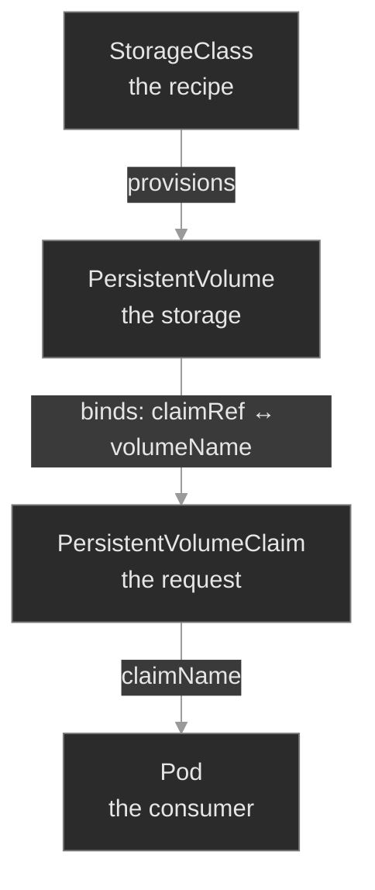

StorageClass and PersistentVolume are cluster-scoped; the claim is where the chain turns namespaced, the one durable handle a Pod spec ever names.

The next diagram walks the same chain from the Pod's side, asking which link breaks first.

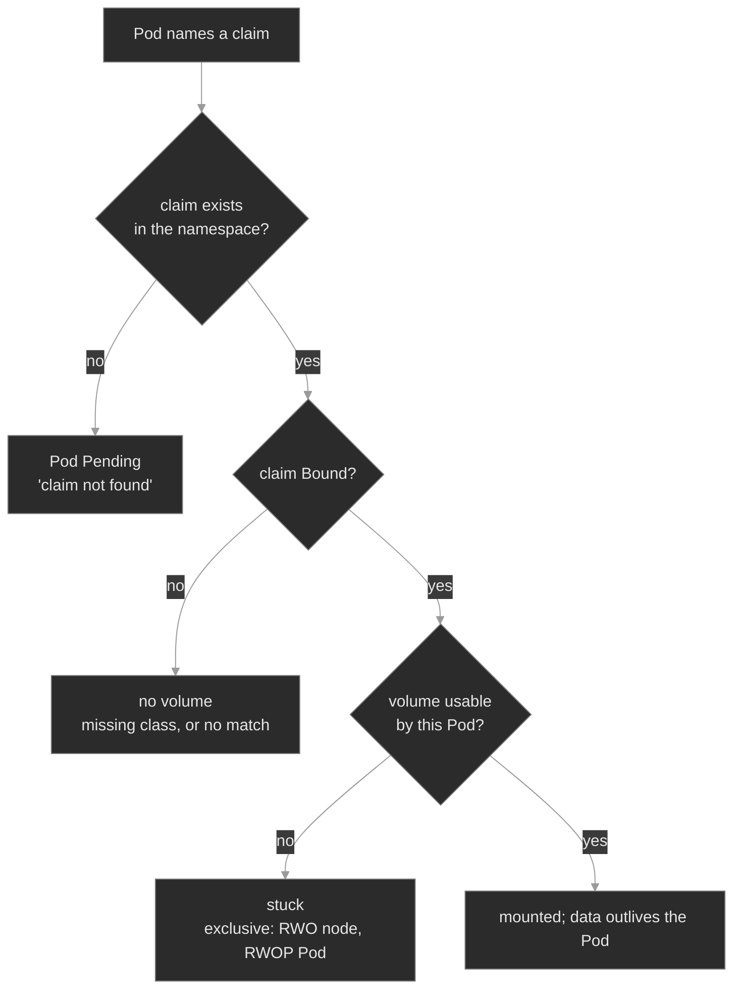

The three red leaves are the three ways a Pod fails to get storage, and one command separates them: **`kubectl get pvc`**. A claim absent from the list means the Pod points at an object that does not exist. A `Pending` claim cannot get a volume. A `Bound` claim with a stuck Pod means the volume refuses that Pod. M04 built the same instinct on `get endpoints`: **the Pod's status says it is stuck, and the claim says why. Read the claim first.**

### Concept walkthrough

#### A volume is a directory

At its core, a volume is a directory, possibly with data in it, that the containers in a Pod can reach<sup><a href="https://kubernetes.io/docs/concepts/storage/volumes/">[1]</a></sup>. Nothing more. The volume's *type* decides what backs that directory, how long it lives, and which nodes reach it.

Using one takes two declarations. Specify the volumes to provide for the Pod in `.spec.volumes`, then declare where to mount them into containers in `.spec.containers[*].volumeMounts`<sup><a href="https://kubernetes.io/docs/concepts/storage/volumes/">[1]</a></sup>. The two halves join by name. A volume the Pod provides but never mounts does nothing, and a mount naming no volume is invalid.

```yaml
spec:
  volumes:
    - name: data                                  # what to provide
      persistentVolumeClaim: { claimName: cdr-data }
    - name: scratch
      emptyDir: {}
  containers:
    - name: app
      volumeMounts:
        - { name: data, mountPath: /data }        # where to put it
        - { name: scratch, mountPath: /tmp/work }
```

Most volume types are **ephemeral**: their lifetime matches the Pod's, so deleting the Pod deletes the volume<sup><a href="https://kubernetes.io/docs/concepts/storage/ephemeral-volumes/">[2]</a></sup>. That suits data a Pod can rebuild. Only `persistentVolumeClaim` reaches storage with a life of its own.

| Type | Lifetime | What it is for |
|------|----------|----------------|
| `emptyDir` | the Pod | Scratch space, a cache, a directory two containers share. |
| `configMap`, `secret`, `projected` | the Pod | Configuration and credentials, as files (M03). |
| `downwardAPI` | the Pod | Pod fields, such as its name or labels, as files. |
| `ephemeral` | the Pod | A **generic ephemeral volume**: data that only needs to exist during a Pod's lifecycle, sized and classed like a claim<sup><a href="https://kubernetes.io/docs/concepts/storage/ephemeral-volumes/">[2]</a></sup>. |
| `hostPath` | the node | A path on the node's filesystem. Restricted in production. |
| `local` | the node | A disk on one node, node-affine. Always through a PersistentVolumeClaim, never named directly in a Pod. |
| `persistentVolumeClaim` | independent | Durable data. The rest of this module. |
| `nfs` | independent | A network file share many nodes mount at once. |
| `csi` | independent | Any storage a CSI driver provides. Every cloud volume. |

#### The claim and the volume

Kubernetes separates asking for storage from supplying it. A **PersistentVolume** is a piece of storage in the cluster that an administrator provisioned, or that a StorageClass provisioned dynamically<sup><a href="https://kubernetes.io/docs/concepts/storage/persistent-volumes/">[3]</a></sup>. It is a cluster resource, like a node. A **PersistentVolumeClaim** is a request for storage by a user<sup><a href="https://kubernetes.io/docs/concepts/storage/persistent-volumes/">[3]</a></sup>. The parallel is exact: Pods consume node resources, claims consume volume resources.

A control loop watches for new claims, finds a matching volume, and binds the two. **Binding is exclusive and one-to-one.** It is a `ClaimRef`, a bi-directional reference between the PersistentVolume and the PersistentVolumeClaim<sup><a href="https://kubernetes.io/docs/concepts/storage/persistent-volumes/">[3]</a></sup>: the volume's `spec.claimRef` names the claim, the claim's `spec.volumeName` names the volume, and `kubectl get pv` prints the same fact in its `CLAIM` column. Two consequences follow. No second claim can take a bound volume, however well it matches, because that volume already points at a claim. And a volume whose claim was deleted keeps its stale `claimRef`, which is why a `Released` volume never rebinds on its own.

A claim that no volume satisfies stays unbound indefinitely, then binds when a suitable volume appears. A pool of 50Gi volumes never satisfies a request for 100Gi.

Pods then use the claim as a volume, and **the claim must exist in the same namespace as the Pod using it**<sup><a href="https://kubernetes.io/docs/concepts/storage/persistent-volumes/">[3]</a></sup>. Claims are namespaced and volumes are not, so the namespace boundary sits at the claim. A claim in another namespace is invisible to the Pod, and so is a claim whose name differs by one character. The Pod stays `Pending`, and `describe pod` says it plainly: `persistentvolumeclaim "directory-store" not found`.

Two fields narrow which volume a claim accepts. `storageClassName` restricts it to volumes of that class, and a **selector** restricts it further by label, through `matchLabels` and `matchExpressions`<sup><a href="https://kubernetes.io/docs/concepts/storage/persistent-volumes/">[3]</a></sup>. Both matter mainly in static provisioning, where a claim chooses among pre-created volumes; on a dynamic claim a selector usually just prevents provisioning. Node placement is the related constraint, and the volume owns it: a `local` volume carries node affinity to the machine holding its disk, so any Pod mounting it runs there.

#### StorageClasses, provisioning, and binding mode

A claim gets its volume in one of two ways. In **static provisioning**, an administrator creates volumes in advance and claims bind to whatever matches. That does not scale, because somebody carves every volume by hand. **Dynamic provisioning** is the default answer: when no static volume matches, the claim's StorageClass provisions one for it<sup><a href="https://kubernetes.io/docs/concepts/storage/dynamic-provisioning/">[4]</a></sup>. A StorageClass is a named recipe — which provisioner, which parameters, which reclaim policy, which binding mode<sup><a href="https://kubernetes.io/docs/concepts/storage/storage-classes/">[5]</a></sup>. This lab's class is `local-path`, which carves a directory on a node's disk. A cloud class calls a CSI driver instead.

A claim does not have to request a class, and two spellings differ<sup><a href="https://kubernetes.io/docs/concepts/storage/persistent-volumes/">[3]</a></sup>. With `storageClassName` **omitted**, the `DefaultStorageClass` admission plugin assigns the cluster's default class. With `storageClassName: ""`, the empty string disables dynamic provisioning for that claim, which then binds only to a pre-created classless volume. A class that does not exist is the third case, and it is a fault: no provisioner answers, no volume appears, and the claim sits `Pending` forever. `kubectl describe pvc` names the cause — `storageclass.storage.k8s.io "fast-ssd" not found`.

```yaml
apiVersion: v1
kind: PersistentVolumeClaim
metadata: { name: cdr-data, namespace: cdr-storage }
spec:
  accessModes: [ReadWriteOnce]      # one node, read-write
  storageClassName: local-path      # the class that provisions the PV
  resources: { requests: { storage: 1Gi } }
```

`storageClassName` is immutable once the claim exists, so the API rejects an edit onto a different class. Delete the claim and recreate it instead. That is safe while the claim never bound, and it is a data migration once it did. The same holds for `accessModes`.

The class also decides *when* the binding happens<sup><a href="https://kubernetes.io/docs/concepts/storage/storage-classes/#volume-binding-mode">[6]</a></sup>.

| `volumeBindingMode` | When the claim binds |
|---------------------|----------------------|
| `Immediate` | As soon as the claim is created. The default when a class omits the field. |
| `WaitForFirstConsumer` | When the first Pod uses the claim, so the volume lands on that Pod's node. |

`WaitForFirstConsumer` makes a *healthy* claim sit `Pending`, which is the most misread state in Kubernetes storage. Most node-local classes set it, `local-path` included. The reason is placement: the system cannot know which node's volume to create until the scheduler picks a node, so it waits. Such a claim shows `Pending` with the event `waiting for first consumer to be created before binding`. **`Pending` means broken only once a Pod is trying to use the claim and it still will not bind.**

A claim can also grow after it binds. Set `allowVolumeExpansion: true` on the class, then raise `spec.resources.requests.storage` on the claim<sup><a href="https://kubernetes.io/docs/concepts/storage/persistent-volumes/#expanding-persistent-volumes-claims">[7]</a></sup>. Three limits hold. Growth is one-way, because a claim never shrinks. The class must permit it, and that field defaults to absent. And expanding the device is not expanding the filesystem on it: some volume types finish that online, while others need the Pod to restart first.

#### Access modes, attach, and exclusivity

A bound claim still has to become a mounted directory, in two steps: **attach** makes the volume available to a node, and **mount** exposes it inside the container. A CSI driver splits its work the same way, so the stage names a symptom's owner: a `Pending` claim on a class that exists is a provisioning fault, an attach error is the attach/detach controller, and a `FailedMount` is the driver's node plugin<sup><a href="https://kubernetes.io/docs/concepts/storage/volumes/#csi">[8]</a></sup>. Attach is where the access mode bites, and that mode is a property of both the volume and the claim<sup><a href="https://kubernetes.io/docs/concepts/storage/persistent-volumes/#access-modes">[9]</a></sup>.

| Mode | Short name | What the volume permits |
|------|-----------|-------------------------|
| `ReadWriteOnce` | RWO | Read-write mounting by a **single node**. Several Pods on that node may all read and write it. |
| `ReadOnlyMany` | ROX | Read-only mounting by **many nodes**. |
| `ReadWriteMany` | RWX | Read-write mounting by **many nodes**. |
| `ReadWriteOncePod` | RWOP | Read-write mounting by a **single Pod**, cluster-wide. |

Read the table by counting the right thing. Three modes count **nodes**, and only RWOP counts **Pods**. So RWO permits many Pods that share one node. ROX and RWX permit many nodes, and therefore many Pods on many nodes; the difference between those two is only whether the nodes may write. RWOP is the strict one — one Pod in the whole cluster reads or writes that claim, and a second Pod is refused even on the same node.

Two rules complete the picture. A volume advertises only the modes its storage supports, so a block disk cannot offer RWX however the claim is spelled. And a volume mounts under one access mode at a time, even when it supports several<sup><a href="https://kubernetes.io/docs/concepts/storage/persistent-volumes/#access-modes">[9]</a></sup>.

Exclusivity produces the failure that looks strangest, because the claim is perfectly `Bound`. Scale a Deployment that mounts one RWO claim until two replicas land on two nodes. The first node attaches the volume, and the second Pod cannot have it. On a network block volume the error is `Multi-Attach error for volume ... already exclusively attached to one node`. On a node-local volume the same rule reads `didn't match PersistentVolume's node affinity`, because that volume is pinned to the machine holding its disk. RWOP gives the Pod-level twin, and the scheduler states it in words: `node has pod using PersistentVolumeClaim with the same name and ReadWriteOncePod access mode`.

None of the three is a broken volume. Each is an access mode keeping its promise. **A `Bound` claim with a stuck Pod means the volume refuses that consumer**, so read the access mode, not the provisioner. Stop asking for what the mode forbids: run one consumer where the mode allows one, move to RWX on network file storage when replicas on many nodes must genuinely share a volume, or give each replica its own volume with `volumeClaimTemplates` (M07).

#### Phases, deletion, and reclaim policy

A volume reports its place in that lifecycle as a phase<sup><a href="https://kubernetes.io/docs/concepts/storage/persistent-volumes/#phase">[10]</a></sup>.

| Phase | Meaning |
|-------|---------|
| `Available` | A free resource, not bound to a claim. |
| `Bound` | The volume is bound to a claim. |
| `Released` | The claim is deleted; the cluster has not yet reclaimed the storage. |
| `Failed` | Automatic reclamation failed. |

A claim's own phase is a simpler set: `Pending`, `Bound`, or rarely `Lost` if its bound volume disappears out from under it<sup><a href="https://kubernetes.io/docs/concepts/storage/persistent-volumes/#phase">[10]</a></sup>.

Deleting a claim is where storage gets dangerous, and two mechanisms decide the outcome. The first is **Storage Object in Use Protection**, which stops a claim a Pod is using, or a volume a claim is bound to, from being removed out from under live data<sup><a href="https://kubernetes.io/docs/concepts/storage/persistent-volumes/#storage-object-in-use-protection">[11]</a></sup>. A claim counts as in use whenever a Pod references it. Delete such a claim and it stays: a `kubernetes.io/pvc-protection` finalizer holds it in `Terminating` until no Pod uses it, and a bound volume behaves the same way through its own finalizer. So `kubectl delete pvc` appears to hang, and nothing is wrong. Scale the consumer to zero and the deletion completes.

The second mechanism is the **reclaim policy**, which decides the volume's fate once the claim is gone<sup><a href="https://kubernetes.io/docs/concepts/storage/persistent-volumes/#reclaiming">[12]</a></sup>.

| Policy | When the claim is deleted | Use it for |
|--------|---------------------------|------------|
| `Delete` | Deletes the PV object **and** the storage behind it. The data is gone. | Scratch data. The default on most dynamic classes, `local-path` included. |
| `Retain` | Keeps the volume and its data. It moves to `Released` and waits for a human. | Data whose loss is an incident. |
| `Recycle` | Deprecated. Use dynamic provisioning instead. | Nothing new. |

So `kubectl delete pvc` is not harmless cleanup. On a `Delete`-policy class it is a data-destruction command, and the claim's small YAML makes that blast radius easy to underestimate. Put anything you cannot lose on a `Retain` class. One adjacent capability closes the loop: a CSI driver that supports snapshots captures a point-in-time copy through `VolumeSnapshot` and `VolumeSnapshotClass` objects, and a new claim can be created from it<sup><a href="https://kubernetes.io/docs/concepts/storage/volume-snapshots/">[13]</a></sup>. M26 treats backup and restore as an operational practice.

<details>
<summary>📖 Going deeper: recovering a Released volume, and the deletes that hang<sup><a href="https://kubernetes.io/docs/concepts/storage/persistent-volumes/#reclaiming">[12]</a></sup></summary>

On a `Retain` class, deleting the claim leaves the volume `Released` with the data intact. It will not bind to a new claim, even an identical one, because its `claimRef` still names the claim you deleted. Recovery is deliberate: edit the volume, clear `spec.claimRef`, and it returns to `Available`. When one specific claim must get it, pre-create that claim with `volumeName` set to the volume, so no other claim wins the race.

Three delete-time states are worth recognizing on sight. A claim in `Terminating` while a Pod still references it is in-use protection working correctly, so scale the consumer down. A volume in `Released` on a `Retain` class waits for the manual step above. A volume in `Failed` means reclamation errored, so the driver could not delete the backing storage, and the API object now misrepresents infrastructure that may still exist and still cost money.

Force-removing a finalizer is the last resort, never the fix: Kubernetes forgets the object while the real disk survives, which turns a stuck delete into an orphan nobody tracks.

</details>

### Hands-on

Five baseline steps and four break/fix scenarios on the full Polyphone fleet. The class throughout is `local-path`: dynamic, `WaitForFirstConsumer`, RWO, `Delete` policy.

- **`baseline/`** — volumes from the inside out: an `emptyDir` that dies with its Pod, a `Bound` claim and the volume a class provisioned for it, `WaitForFirstConsumer` holding a healthy claim `Pending`, data surviving a Pod delete, and the `get pvc` triage.
- **`breakfix-01-pvc-storageclass-missing/`** — a claim that never binds, because it names a class that does not exist.
- **`breakfix-02-pvc-claim-missing/`** — a Pod that names a claim which is absent.
- **`breakfix-03-rwo-multi-attach/`** — a `Bound` claim whose second Pod sits on another node, and an RWO volume that will not follow it.
- **`breakfix-04-rwop-single-pod/`** — the same shape on one node, where RWOP refuses a second Pod that RWO would have allowed.

Check yourself against `ANSWER-KEY.md` after each.

### Common failure modes

| Symptom | Likely cause | Where to look |
|---------|--------------|---------------|
| Pod `Pending`, `unbound ... PersistentVolumeClaims` | Its claim is `Pending` | `get pvc -n <ns>`, then `describe pvc` for the reason |
| Claim `Pending`, `storageclass ... not found` | A typo in `storageClassName`, or the class is not installed | `get storageclass`; delete and recreate the claim, because the field is immutable |
| Claim `Pending`, `waiting for first consumer` | Healthy `WaitForFirstConsumer`. No fault | Schedule a Pod that uses it; it binds on that Pod's node |
| Pod `Pending`, `persistentvolumeclaim "x" not found` | A `claimName` typo, or the claim is in another namespace | `get pvc -n <ns>`; correct the `claimName` |
| `Bound` claim, Pod stuck, `Multi-Attach error` | An RWO volume is wanted on a second node | `get pods -o wide`; run one consumer, or move to RWX |
| Same shape, `didn't match PersistentVolume's node affinity` | An RWO **local** volume pinned to another node | `describe pv` node affinity against the Pod's node |
| Same shape, `... ReadWriteOncePod access mode` | RWOP already has its one Pod | Run one Pod, or recreate the claim as RWO |
| `delete pvc` never finishes; claim `Terminating` | In-use protection: a Pod still references it | `get pods -n <ns>`; scale the consumer to zero |
| A volume sits `Released`, no claim binds | The stale `claimRef` names the deleted claim | `get pv -o yaml`; clear `spec.claimRef` |
| Growing a claim is rejected | The class omits `allowVolumeExpansion` | `get storageclass -o yaml` |
| Data gone after `delete pvc` | A `Delete` reclaim policy destroyed the volume | `get storageclass -o yaml`; use `Retain` for data that matters |

### Recap

- **A volume is a directory the containers in a Pod can reach.** `.spec.volumes` provides it, `.spec.containers[*].volumeMounts` places it. Most types die with the Pod; only a claim reaches storage with its own lifecycle.
- **A claim requests storage, a volume is the storage, and a StorageClass provisions one to satisfy the other.** The binding is exclusive and one-to-one, and a Pod names only the claim, in its own namespace.
- **`kubectl get pvc` is the first look, and it splits every storage-stuck Pod three ways:** the claim is absent, `Pending`, or `Bound` while the Pod is still stuck. Not every `Pending` is broken — `WaitForFirstConsumer` holds a healthy claim there until a Pod consumes it.
- **Access modes count nodes, except RWOP, which counts Pods.** RWO gives one node many Pods, RWX gives many nodes, RWOP gives exactly one Pod. A `Bound` claim with a stuck Pod is an exclusivity problem, never a provisioning one.
- **`reclaimPolicy: Delete` makes `kubectl delete pvc` a data-destruction command.** In-use protection is the only thing that slows it down.

### Production thinking

- A team scales a stateful Deployment from one replica to three, all sharing one RWO claim. It works on their single-node test cluster and fails on a multi-node one. What is the failure, and what should they reach for instead of more replicas on RWO?
- A cleanup script deletes "unused" claims, and a service's data disappears. The class was on `reclaimPolicy: Delete`. Which single change would have made that a recoverable `Released` volume, and what does the safety cost afterwards?
- A volume is filling up and its class sets `allowVolumeExpansion: true`. You raise the request, the claim reports the new size, and the application still sees the old capacity. What has completed, what has not, and what do you do next?

### References

1. Kubernetes — Volumes: https://kubernetes.io/docs/concepts/storage/volumes/
2. Kubernetes — Ephemeral Volumes: https://kubernetes.io/docs/concepts/storage/ephemeral-volumes/
3. Kubernetes — Persistent Volumes: https://kubernetes.io/docs/concepts/storage/persistent-volumes/
4. Kubernetes — Dynamic Volume Provisioning: https://kubernetes.io/docs/concepts/storage/dynamic-provisioning/
5. Kubernetes — Storage Classes: https://kubernetes.io/docs/concepts/storage/storage-classes/
6. Kubernetes — Volume Binding Mode: https://kubernetes.io/docs/concepts/storage/storage-classes/#volume-binding-mode
7. Kubernetes — Expanding Persistent Volume Claims: https://kubernetes.io/docs/concepts/storage/persistent-volumes/#expanding-persistent-volumes-claims
8. Kubernetes — Volumes (CSI): https://kubernetes.io/docs/concepts/storage/volumes/#csi
9. Kubernetes — Access Modes: https://kubernetes.io/docs/concepts/storage/persistent-volumes/#access-modes
10. Kubernetes — PersistentVolume Phase: https://kubernetes.io/docs/concepts/storage/persistent-volumes/#phase
11. Kubernetes — Storage Object in Use Protection: https://kubernetes.io/docs/concepts/storage/persistent-volumes/#storage-object-in-use-protection
12. Kubernetes — Reclaiming: https://kubernetes.io/docs/concepts/storage/persistent-volumes/#reclaiming
13. Kubernetes — Volume Snapshots: https://kubernetes.io/docs/concepts/storage/volume-snapshots/


---

## Break/Fix Practice

## Break/fix 01 — A claim that never binds (missing StorageClass)

**Symptom — what you'd actually see:**

`cdr-writer` in `cdr-storage` is Pending from cluster start, with no logs and nothing crashing. Its container never ran. It is waiting on storage.

**Think about this before you open the answer:**

The `get pvc` reflex, and the dynamic-provisioning chain from claim to class to volume. Self-grading questions:

- Was `kubectl get pvc` one of your first three commands, rather than describing the Pod in circles?
- Did you read `describe pvc` for the reason, instead of guessing?
- Did you hit the immutability of `storageClassName` and recreate the claim, rather than fighting a rejected patch?

<details>
<summary><b>Click to reveal: diagnostic commands, root cause, exact fix, verify</b></summary>

**Root cause:**

The `cdr-data` claim sets `storageClassName: fast-ssd`, and no such class exists on the cluster. With no class there is no provisioner to call, so no volume is created and the claim stays Pending<sup><a href="https://kubernetes.io/docs/concepts/storage/dynamic-provisioning/">[1]</a></sup>. A Pod that mounts a Pending claim cannot be scheduled, so `cdr-writer` is Pending too. The claim holds the diagnosis; the Pod is one object downstream.

**Diagnostic commands (run in this order):**

```bash
# 1. The Pod is Pending, and its events point at storage rather than a crash
kubectl get pods -n cdr-storage
kubectl describe pod -n cdr-storage -l app=cdr-writer
#    Events: ... pod has unbound immediate PersistentVolumeClaims

# 2. First look — the claim's status is the diagnosis
kubectl get pvc -n cdr-storage
#    cdr-data   Pending

# 3. Ask the claim why
kubectl describe pvc cdr-data -n cdr-storage
#    Events: storageclass.storage.k8s.io "fast-ssd" not found

# 4. Confirm the class is absent
kubectl get storageclass
#    only local-path
```

A Pod is using this claim, so Pending here is broken, not the healthy `WaitForFirstConsumer` case.

**Exact fix:**

Point the claim at the real class. `storageClassName` is **immutable**, so this is a delete and recreate rather than an edit. It is safe here, because the claim never bound and holds no data. Remove the consumer first, so the delete does not wait on it:

```bash
kubectl scale deployment cdr-writer -n cdr-storage --replicas=0
kubectl delete pvc cdr-data -n cdr-storage
kubectl apply -f - <<'YAML'
apiVersion: v1
kind: PersistentVolumeClaim
metadata: { name: cdr-data, namespace: cdr-storage }
spec:
  accessModes: [ReadWriteOnce]
  storageClassName: local-path
  resources: { requests: { storage: 1Gi } }
YAML
kubectl scale deployment cdr-writer -n cdr-storage --replicas=1
```

**Verify:**

```bash
kubectl get pvc cdr-data -n cdr-storage        # Bound
kubectl wait --for=condition=Ready pod -l app=cdr-writer -n cdr-storage --timeout=60s
```

**Production thinking:**

A class name typo, or an uninstalled class, fails every claim that names it, silently, at apply time. The workload simply never comes up. Guard it by pinning workloads to classes that exist in every target cluster, and by alerting on claims Pending beyond a threshold *with a consumer present* — that qualifier is what keeps `WaitForFirstConsumer` from paging you. The immutability is the sharp edge: fixing a wrong class on a claim that already holds data is a migration, not a one-liner. Provision a new claim on the right class, copy, cut over.

</details>

---

## Break/fix 02 — A Pod names a claim that is not there

**Symptom — what you'd actually see:**

`directory` in `app-services` is Pending. It looks like break/fix 01, and `describe pod` names a different cause: the claim the Pod mounts is not present at all.

**Think about this before you open the answer:**

That the Pod-to-claim link is by name and namespace, and that `get pvc` distinguishes absent from Pending. Self-grading questions:

- Did you correlate the Pod's `claimName` with the `get pvc` list, noticing `directory-store` is absent, rather than fixating on `directory-data` showing Pending?
- Did you read `persistentvolumeclaim "..." not found` as a wrong name, not a provisioning failure?
- Did you fix the reference, rather than creating a redundant `directory-store` claim to satisfy the typo?

<details>
<summary><b>Click to reveal: diagnostic commands, root cause, exact fix, verify</b></summary>

**Root cause:**

The `directory` Deployment's Pod template mounts a volume with `claimName: directory-store`, and no claim by that name exists. The real claim is `directory-data`. A Pod references a claim by exact name within its own namespace, so a name that matches nothing means the Pod waits for a volume nobody requested<sup><a href="https://kubernetes.io/docs/concepts/storage/persistent-volumes/">[2]</a></sup>. This is the absent-claim leaf, distinct from break/fix 01's Pending-claim leaf.

**Diagnostic commands (run in this order):**

```bash
# 1. The event names the exact claim, and the Volumes block names what the Pod wants
kubectl describe pod -n app-services -l app=directory
#    Events:  persistentvolumeclaim "directory-store" not found
#    Volumes: ClaimName: directory-store

# 2. First look — list the claims that exist
kubectl get pvc -n app-services
#    directory-data   Pending   <-- exists; healthy WaitForFirstConsumer, no consumer yet
#    (no directory-store at all — the claim the Pod named)
```

The discriminator against break/fix 01: there the named claim was present but Pending; here the named claim is not in the list. Do not be thrown that `directory-data` shows Pending — that is the healthy binding mode, because the mis-pointed Pod never consumed it. Correlate the Pod's `claimName` with the list, not just the claim statuses.

**Exact fix:**

Point the Deployment's `claimName` at the claim that exists. Unlike a claim's `storageClassName`, a Pod's `claimName` is freely mutable, and editing the Pod template rolls a new Pod:

```bash
kubectl patch deployment directory -n app-services --type=json \
  -p '[{"op":"replace","path":"/spec/template/spec/volumes/0/persistentVolumeClaim/claimName","value":"directory-data"}]'
# or: kubectl edit deployment directory -n app-services   → claimName: directory-data
```

**Verify:**

```bash
kubectl wait --for=condition=Ready pod -l app=directory -n app-services --timeout=60s
kubectl get pvc -n app-services                # directory-data now Bound
```

**Production thinking:**

This ships from a rename that touched one side only, or from a volume block copy-pasted between workloads. No storage is unhealthy; the Pod points at nothing. Keep the claim and the `claimName` in one templated source (Kustomize or Helm, M16–M17) so they cannot diverge. And remember that creating a second claim to match a typo'd name fixes the symptom while doubling your volumes and splitting your data. Correct the reference instead.

</details>

---

## Break/fix 03 — An RWO volume cannot serve two nodes

**Symptom — what you'd actually see:**

`directory` in `app-services` was scaled to 2 replicas. One is Running, the other will not schedule. `kubectl get pvc` shows `directory-data` Bound, so the storage exists and bound cleanly, and a Pod still cannot start.

**Think about this before you open the answer:**

The access modes, and reading the Bound-but-stuck signature as exclusivity. Self-grading questions:

- Did the Bound claim stop you chasing a provisioning bug that was not there, and send you to the access mode?
- Did you read `ReadWriteOnce` as one *node*, and recognize `didn't match PersistentVolume's node affinity` and `Multi-Attach` as the same rule?
- Did you land on a single node-bound consumer, or a genuine RWX or `volumeClaimTemplates` design, rather than deleting the stuck Pod and watching it return?

<details>
<summary><b>Click to reveal: diagnostic commands, root cause, exact fix, verify</b></summary>

**Root cause:**

`directory-data` is `ReadWriteOnce`, which permits read-write mounting by a single node<sup><a href="https://kubernetes.io/docs/concepts/storage/persistent-volumes/#access-modes">[3]</a></sup>. The two replicas were forced onto different nodes. The first attached the volume on its node, and the second cannot attach the same volume from another node. Because this is a node-local volume, the conflict surfaces as `didn't match PersistentVolume's node affinity` — the volume carries hard node affinity. On a cloud block volume the identical rule reads `Multi-Attach error for volume ... already exclusively attached to one node`. A Bound claim with a stuck Pod is the signature of exclusivity, not binding.

**Diagnostic commands (run in this order):**

```bash
# 1. One replica up, one stuck, and they are on different nodes
kubectl get pods -n app-services -l app=directory -o wide

# 2. First look — the claim is Bound, so neither leaf 1 nor leaf 2
kubectl get pvc -n app-services
#    directory-data   Bound

# 3. Read the scheduling failure — name the Pending replica, since -l matches both
kubectl describe pod -n app-services $(kubectl get pods -n app-services -l app=directory --field-selector=status.phase=Pending -o jsonpath='{.items[0].metadata.name}')
#    Events: ... node(s) didn't match PersistentVolume's node affinity ...

# 4. See where the volume is pinned
PV=$(kubectl get pvc directory-data -n app-services -o jsonpath='{.spec.volumeName}')
kubectl describe pv "$PV"
#    Node Affinity: the node running the healthy replica
```

Bound claim plus stuck Pod is always an access-mode or topology problem, never a binding one.

**Exact fix:**

Stop asking one RWO volume to serve Pods on two nodes. Run a single node-bound consumer:

```bash
kubectl scale deployment directory -n app-services --replicas=1
```

**Verify:**

```bash
kubectl rollout status deployment directory -n app-services --timeout=60s
kubectl get pods -n app-services -l app=directory -o wide     # one Running/Ready, none stuck
```

**Production thinking:**

This failure hides in a single-node dev cluster and detonates on a multi-node one. Two replicas on one node share an RWO volume fine, so it works in test, and the moment the scheduler spreads them the second replica jams. The design question is what the workload needs. A *shared* multi-writer volume means RWX, on network file storage or a driver that advertises it. A *per-replica* durable volume means a StatefulSet with `volumeClaimTemplates` (M07), one claim per Pod, no sharing. Scaling to one is the incident fix. Choosing the right access mode for the access pattern is the durable one.

</details>

---

## Break/fix 04 — RWOP refuses a second Pod

**Symptom — what you'd actually see:**

`cdr-writer` in `cdr-storage` runs 2 replicas. One is Running, the other never schedules. `kubectl get pvc` shows `cdr-data` Bound, and `kubectl get pods -o wide` shows both replicas targeting the *same* node — so nothing is being asked to span nodes either.

**Think about this before you open the answer:**

That access modes count nodes except RWOP, which counts Pods, and that a claim's spec is immutable while a live consumer blocks its deletion. Self-grading questions:

- Did you rule out break/fix 03 by checking the `NODE` column, instead of assuming every Bound-but-stuck Pod is a node-spanning conflict?
- Did you read the `FailedScheduling` message rather than inferring the cause, and separate it from the control-plane taint line in the same event?
- Did you recognize the Terminating claim as in-use protection working, rather than a stuck object needing a forced finalizer removal?

<details>
<summary><b>Click to reveal: diagnostic commands, root cause, exact fix, verify</b></summary>

**Root cause:**

`cdr-data` is `ReadWriteOncePod`, which permits read-write mounting by a single Pod across the whole cluster<sup><a href="https://kubernetes.io/docs/concepts/storage/persistent-volumes/#access-modes">[3]</a></sup>. The first replica took the claim, and the scheduler refuses every other Pod that mounts it, including Pods on the same node. `ReadWriteOnce` counts nodes and would have allowed both of these Pods, because they share one node. `ReadWriteOncePod` counts Pods. The claim is Bound throughout: the failure is exclusivity at the Pod level.

**Diagnostic commands (run in this order):**

```bash
# 1. One replica up, one Pending — and both want the same node
kubectl get pods -n cdr-storage -o wide

# 2. First look — the claim is Bound
kubectl get pvc -n cdr-storage
#    cdr-data   Bound

# 3. Rule out the node-spanning case: the volume is on the node already in use
PV=$(kubectl get pvc cdr-data -n cdr-storage -o jsonpath='{.spec.volumeName}')
kubectl describe pv "$PV"
#    Node Affinity: the node running the healthy replica

# 4. Read the scheduler's own words — name the Pending replica, since -l matches both
kubectl describe pod -n cdr-storage $(kubectl get pods -n cdr-storage -l app=cdr-writer --field-selector=status.phase=Pending -o jsonpath='{.items[0].metadata.name}')
#    Events: node has pod using PersistentVolumeClaim with the same name and
#            ReadWriteOncePod access mode

# 5. Confirm the access mode
kubectl describe pvc cdr-data -n cdr-storage
#    Access Modes: RWOP
```

**Exact fix:**

This workload runs two Pods on one node by design, so the claim needs `ReadWriteOnce`. A claim's `accessModes` is immutable, so that means delete and recreate. Deleting a claim a Pod still uses does not remove it — Storage Object in Use Protection holds it in Terminating behind a `kubernetes.io/pvc-protection` finalizer until the consumer is gone<sup><a href="https://kubernetes.io/docs/concepts/storage/persistent-volumes/#storage-object-in-use-protection">[4]</a></sup>. On a claim holding real records this procedure is a data migration, because the class reclaim policy is `Delete`.

```bash
kubectl patch pvc cdr-data -n cdr-storage -p '{"spec":{"accessModes":["ReadWriteOnce"]}}'   # rejected: immutable
kubectl delete pvc cdr-data -n cdr-storage --wait=false
kubectl get pvc -n cdr-storage                      # Terminating, held by the finalizer
kubectl scale deployment cdr-writer -n cdr-storage --replicas=0   # consumer gone → delete completes
kubectl apply -f - <<'YAML'
apiVersion: v1
kind: PersistentVolumeClaim
metadata: { name: cdr-data, namespace: cdr-storage }
spec:
  accessModes: [ReadWriteOnce]
  storageClassName: local-path
  resources: { requests: { storage: 1Gi } }
YAML
kubectl scale deployment cdr-writer -n cdr-storage --replicas=2
```

**Verify:**

```bash
kubectl rollout status deployment cdr-writer -n cdr-storage --timeout=90s
kubectl get pods -n cdr-storage -o wide       # both replicas Running/Ready on one node
kubectl get pvc cdr-data -n cdr-storage       # Bound, ACCESS MODES = RWO
```

**Production thinking:**

RWOP is the right tool for a volume that must never have two writers, such as a single-writer database, and it caps that workload at one Pod by design. The failure mode is tightening a shared claim to RWOP without noticing the Deployment runs more than one replica — the workload then loses capacity silently, one Pod at a time, with a perfectly healthy-looking claim. Put single-writer volumes behind a workload that cannot exceed one Pod, and treat a claim's access mode as part of the workload's contract rather than a storage detail. Force-removing the `pvc-protection` finalizer to hurry a delete is the anti-pattern: Kubernetes forgets the object while the real disk, and any process still writing to it, survives.

</details>

---


---

# `m06-scheduling/`

## Concept

## M06 — Scheduling

> How the scheduler decides which node runs each Pod — requests, limits, QoS, taints, and affinity — and the handful of ways a Pod ends up `Pending` forever or gets killed the moment it starts.

### What you'll learn

- Explain what the scheduler actually does: filter the nodes a Pod *can* run on, score the survivors, and bind the Pod to the best one — and read the `FailedScheduling` event it emits when the filter empties
- Distinguish **requests** (what the scheduler fits against a node's Allocatable) from **limits** (what the kubelet and kernel enforce at runtime), and stop conflating a scheduling failure with a runtime one
- Derive a Pod's **QoS class** (Guaranteed / Burstable / BestEffort) from its requests and limits, and predict who gets OOM-killed or evicted first under pressure
- Use **taints and tolerations** to keep Pods off nodes — and recognize the `untolerated taint` that keeps them off by accident
- Steer placement with **nodeSelector / node affinity**, and spread replicas across failure domains with **pod anti-affinity** and **topology spread constraints** — and see how a hard spread rule wedges a Deployment when the node set shrinks
- Work the **Pending differential**: split "won't schedule" into insufficient resources vs. untolerated taint vs. unmatched affinity vs. unsatisfiable spread — one `FailedScheduling` signature each

### Why it matters

A Pod that won't schedule is one of the most common pages an SRE takes, and one of the most misread. It sits `Pending` — no container starts, no application log is written — so every instinct that worked for a crashing Pod (logs, `--previous`, restart) returns nothing. The answer isn't in the Pod's logs, because the Pod never ran; it's in one event that names, node by node, why the scheduler rejected each one.

At Polyphone the pressure is constant. A media node drains for a kernel patch and its Pods need somewhere to go. A new region comes online with tainted node pools before anyone writes the tolerations. Someone right-sizes a request during a capacity review and fat-fingers the unit. A signaling service meant to survive a node failure quietly runs every replica on one box because nobody spread them. Each is a scheduling decision — made, or refused, by one component reading a few fields. Once you can read those fields, "why won't this Pod schedule?" becomes a two-minute lookup. The flip side matters as much: a Pod that schedules cleanly and then OOM-kills on a loop is *also* a resource problem, but a different one (its request fit, its limit didn't hold), and telling the two apart is half the skill.

### Scope

**Covers:** what the kube-scheduler does (filter → score → bind); resource **requests** and **limits** for CPU and memory, node **capacity** vs. **Allocatable**, and how requests drive placement; **QoS classes** and their role in OOM and node-pressure eviction; **taints and tolerations** (the three effects, the control-plane taint, and NoSchedule-vs-NoExecute); **nodeSelector** and **node affinity**; **pod anti-affinity** and **topology spread constraints** for HA placement; and the `Pending`/`FailedScheduling` differential that ties them together.

**Doesn't cover:** the Horizontal/Vertical Pod Autoscalers and Cluster Autoscaler that *change* how much you're asking for or how many nodes exist → M09; **PriorityClass and preemption** (a higher-priority Pod evicting a lower one to schedule) — related but a distinct mechanism, noted where it intersects QoS but taught in M09; CPU pinning, NUMA, and the Topology Manager for latency-sensitive media → M23; PodDisruptionBudgets and graceful drain mechanics → M09; storage-driven scheduling (a Pod pinned by where its volume can bind) touched only in passing → M05.

**Assumes:** M00 (`get → describe → events → logs`, and that a Pod's story lives in the gap between `spec` and `status`), M01 (Pods, Deployments, ReplicaSets, labels and selectors, and that a controller — not you — creates the Pods), and a working idea of a Linux **cgroup** as the kernel mechanism that caps a process's CPU and memory. Labels from M01 are load-bearing again here: affinity and spread are label queries against nodes and Pods.

### Vocabulary

| Term | Definition |
|------|------------|
| **kube-scheduler** | The control-plane component that watches for Pods with no `spec.nodeName` and assigns each to a node: it **filters** out nodes the Pod can't run on, **scores** the survivors, and **binds** the Pod to the best one. An empty filter result means `Pending`. |
| **request** | The amount of CPU/memory a container asks for. The scheduler sums a Pod's requests and places it only on a node whose **Allocatable** can still cover them. Requests are the *only* resource number scheduling uses. |
| **limit** | The runtime ceiling for a container. CPU over-limit is **throttled** (CFS quota); memory over-limit is **OOM-killed**. Limits do not affect scheduling. |
| **capacity vs. Allocatable** | A node's **Capacity** is its total CPU/memory; **Allocatable** is what's left for Pods after the kubelet and system daemons reserve their share. The scheduler fits against Allocatable, not Capacity. |
| **QoS class** | A label Kubernetes derives from a Pod's requests/limits: **Guaranteed**, **Burstable**, or **BestEffort**. It sets the order in which the kubelet kills Pods under node pressure. |
| **OOMKilled** | A container terminated by the kernel out-of-memory killer for exceeding its memory limit. Shows as `Reason: OOMKilled`, exit code **137** (128 + SIGKILL). |
| **eviction (node-pressure)** | The kubelet proactively killing Pods when a node runs low on memory/disk, in QoS order (BestEffort first). Distinct from scheduler preemption. |
| **taint** | A `key=value:effect` mark on a **node** that repels Pods. Effects: `NoSchedule`, `PreferNoSchedule`, `NoExecute`. |
| **toleration** | A mark on a **Pod** that lets it schedule onto a node with a matching taint. A taint repels; a matching toleration is the exception that lets one through. |
| **nodeSelector / node affinity** | Ways a Pod requires (or prefers) nodes carrying certain labels. `nodeSelector` is an exact-match hard filter; node affinity adds `required…` (hard) and `preferred…` (soft, weighted) forms. |
| **pod affinity / anti-affinity** | Rules that place a Pod near (affinity) or away from (anti-affinity) other Pods matching a label selector, within a **topologyKey** domain (e.g. per-hostname, per-zone). |
| **topologyKey** | A node-label key that defines the domain for spreading or co-location — `kubernetes.io/hostname` (per node), `topology.kubernetes.io/zone` (per zone). |
| **topology spread constraint** | A rule bounding how unevenly a Pod's replicas may be distributed across a topology (`maxSkew`), with `whenUnsatisfiable: DoNotSchedule` (hard) or `ScheduleAnyway` (soft). |

### Mental model

Scheduling is a fitting problem solved in two moves. For each `Pending` Pod, the scheduler runs every node through a set of **filters** (does the Pod fit the node's free resources? does the Pod tolerate the node's taints? does the node match the Pod's affinity and selectors? can the Pod's topology spread still be satisfied here?). Nodes that fail any filter are out. The scheduler **scores** whatever survives and **binds** the Pod to the best node by writing `spec.nodeName`; the kubelet on that node takes it from there<sup><a href="https://kubernetes.io/docs/concepts/scheduling-eviction/kube-scheduler/">[9]</a></sup>. When *no* node survives the filters, the Pod stays `Pending` and the scheduler records one event that lists, per node, the first filter each one failed:

```text
0/2 nodes are available: 1 node(s) had untolerated taint {node-role.kubernetes.io/control-plane: },
                         1 Insufficient memory.
```

That line is the whole diagnosis. Read right to left from "why won't it schedule": the message enumerates the reasons, and the reasons *are* the differential.

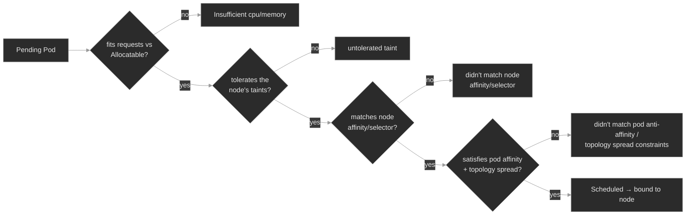

Two facts make this model pay off. First, **the scheduler fits requests, not limits** — a node can be overcommitted on limits and still accept Pods, because scheduling only sums requests against Allocatable. That's why a giant *request* won't schedule while a too-small *limit* schedules fine and then dies at runtime. Second, this lab's control-plane node is tainted, so **every** `FailedScheduling` message here carries an `untolerated taint {node-role.kubernetes.io/control-plane}` line — expected noise. The actionable cause is whatever the *worker* line says; skim past the control-plane line and read the rest.

### Concept walkthrough

#### The resource contract: requests, limits, and QoS

Every container can declare two numbers per resource. The **request** is a reservation: "I need at least this much." The scheduler adds up a Pod's requests and will only place it on a node whose **Allocatable** — total capacity minus what the kubelet and OS reserve for themselves — still has room<sup><a href="https://kubernetes.io/docs/concepts/configuration/manage-resources-containers/">[1]</a></sup>. That reservation is then held for the Pod whether or not it uses it. The **limit** is a runtime ceiling the node enforces, and the two resources enforce it differently: over its **CPU** limit a container is **throttled** — the kernel's CFS scheduler hands it fewer time slices, and it runs slower; over its **memory** limit it is **killed**, because memory can't be throttled — the OOM killer terminates the process and you see `OOMKilled`, exit code 137<sup><a href="https://kubernetes.io/docs/concepts/configuration/manage-resources-containers/">[1]</a></sup>.

This split is the single most useful distinction in the module. **Requests are what you fit; limits are what kills you.** A too-large request is a *scheduling* failure — the Pod never starts, it sits `Pending` with `Insufficient memory`. A too-small limit is a *runtime* failure — the Pod schedules, starts, and gets OOM-killed into `CrashLoopBackOff`. Same resource, opposite symptom, opposite fix. `Pending` → look at requests and node headroom; a running Pod dead with exit 137 → look at the memory limit.

From those same two numbers Kubernetes derives the Pod's **QoS class**, which decides its survival priority when a node runs out of memory<sup><a href="https://kubernetes.io/docs/concepts/workloads/pods/pod-qos/">[2]</a></sup>:

- **Guaranteed** — every container sets a CPU *and* memory limit equal to its request. The Pod gets exactly what it reserved and is the last to be evicted.
- **Burstable** — at least one request or limit is set, but it's not Guaranteed (the common case: requests below limits). It may use spare capacity but has no guarantee it'll keep it.
- **BestEffort** — no requests or limits anywhere. First to be killed when the node is under pressure.

Under **node-pressure eviction**, the kubelet reclaims memory by killing Pods in exactly that order — BestEffort, then Burstable, then Guaranteed — and within a class, those most over their requests go first<sup><a href="https://kubernetes.io/docs/concepts/scheduling-eviction/node-pressure-eviction/">[3]</a></sup>. That's why "just don't set limits" is bad advice: a BestEffort Pod is the first casualty of any node that gets tight, and you don't pick which one. Honest requests matter too — a Pod that requests far less than it uses gets packed onto a node that can't actually hold it, and the whole node starts evicting.

<details>
<summary>📖 Going deeper: OOMKill vs. eviction vs. preemption — three different killers<sup><a href="https://kubernetes.io/docs/concepts/scheduling-eviction/node-pressure-eviction/">[3]</a></sup></summary>

Three mechanisms end a running Pod's life, and conflating them sends you to the wrong fix:

- **OOMKill** is the **kernel**, acting on **one container** that touched its own **memory limit** (or a cgroup limit the node imposes). It's synchronous and local: the process dies, the container restarts per its `restartPolicy`, and you see `Last State: Terminated, Reason: OOMKilled`. Fix: the container's memory limit or its actual usage.
- **Node-pressure eviction** is the **kubelet**, acting on **whole Pods**, when the **node** as a whole crosses a memory or disk threshold. It picks victims by **QoS class** and by how far each Pod exceeds its requests. The Pod is deleted (and rescheduled elsewhere if it's controller-owned). Fix: node capacity, or requests that reflect reality.
- **Preemption** is the **scheduler**, deleting a **lower-PriorityClass** Pod to make room for a higher-priority `Pending` one. It is driven by **PriorityClass, not QoS** — a common and costly conflation. QoS never influences which Pod the scheduler preempts. Preemption and PriorityClass are M09.

The tell: OOMKill leaves the Pod in place with a climbing restart count; eviction and preemption make it *disappear* from its node. `kubectl get events` names which — `OOMKilling`, `Evicted`, and `Preempted` are three different reasons.

</details>

<details>
<summary>📖 Going deeper: resizing without a restart, and where sidecars land in the math<sup><a href="https://kubernetes.io/docs/tasks/configure-pod-container/resize-container-resources/">[8]</a></sup></summary>

Two facts that changed recently enough to be worth pinning:

**In-place Pod resize is stable (GA in v1.35, on by default).** You can change a running container's CPU/memory requests and limits without recreating the Pod, via the `resize` subresource (`kubectl patch pod … --subresource=resize`). CPU changes apply live; a memory *increase* often needs a container restart, controlled per-resource by `resizePolicy`. It does **not** change the Pod's QoS class — that's fixed at creation. Before this, giving a running Pod more memory meant deleting and rescheduling it; now a too-tight limit can sometimes be widened in place (subject to the node having the room).

**Native sidecar containers are stable (GA in v1.33)** — an init container with `restartPolicy: Always`. For scheduling, a sidecar's request counts toward the Pod's effective request for its *whole* life, unlike a plain init container whose reservation only spikes during init. A mesh or log-shipper sidecar (M13, M15) at 100m/128Mi adds that to every Pod's footprint the scheduler must fit — easy to forget when a node "mysteriously" stops accepting Pods after a mesh rollout.

</details>

#### Taints and tolerations: nodes that push back

Requests and affinity are the Pod saying where it *will* go. Taints are the **node** saying who it *won't* take. A taint is a `key=value:effect` mark on a node that repels every Pod without a matching **toleration**<sup><a href="https://kubernetes.io/docs/concepts/scheduling-eviction/taint-and-toleration/">[4]</a></sup>. The relationship is deliberately asymmetric: the taint is the default (keep off), the toleration is the exception (this Pod may). Three effects, in ascending severity:

- **`NoSchedule`** — the scheduler won't place a new Pod here unless it tolerates the taint. Pods already running are **left alone**.
- **`PreferNoSchedule`** — a soft version; the scheduler avoids the node if it can, but will use it rather than leave a Pod `Pending`.
- **`NoExecute`** — the strongest; not only blocks new Pods but **evicts** running ones that don't tolerate it. A toleration may carry `tolerationSeconds` to grant a grace period before eviction.

The NoSchedule-vs-NoExecute line is worth internalizing, because it explains a scene you'll meet: someone taints a node `NoSchedule` and is surprised the existing Pods stay put. They stay because `NoSchedule` only gates *new* scheduling — the taint you add now doesn't reach back and evict what's already there. Had they used `NoExecute`, the node would have emptied. Tainting a live node with `NoSchedule` leaves its running Pods in place while blocking any new Pod that lacks the toleration.

You already run tolerations. The `sbc-edge` DaemonSet carries a toleration for `node-role.kubernetes.io/control-plane:NoSchedule` — that's how a "one Pod per node" DaemonSet gets a Pod onto the control-plane node, which kubeadm taints to keep ordinary workloads off<sup><a href="https://kubernetes.io/docs/reference/labels-annotations-taints/">[7]</a></sup>. Every other workload lacks that toleration, which is exactly why the whole fleet lands on the worker and nothing but `sbc-edge` (and system Pods) touches the control-plane. Kubernetes also taints nodes automatically on trouble: `node.kubernetes.io/not-ready` and `.../unreachable` are the `NoExecute` taints the node controller adds to evict Pods off a failed node, and `kubectl cordon` adds `node.kubernetes.io/unschedulable:NoSchedule`<sup><a href="https://kubernetes.io/docs/reference/labels-annotations-taints/">[7]</a></sup>.

Reading them is one line of `describe`:

```bash
kubectl describe node <node> | grep -A2 Taints
```

#### Steering and spreading: affinity, anti-affinity, topology spread

The last family of filters is about labels — matching Pods to nodes, and Pods to each other.

**nodeSelector and node affinity** attract a Pod to nodes carrying particular labels. `nodeSelector` is the blunt form: an exact `key: value` match, hard-required<sup><a href="https://kubernetes.io/docs/concepts/scheduling-eviction/assign-pod-node/">[5]</a></sup>. **Node affinity** is the expressive form, with two flavors that recur across every affinity type: `requiredDuringSchedulingIgnoredDuringExecution` (a hard filter — no matching node, no schedule) and `preferredDuringSchedulingIgnoredDuringExecution` (a soft, weighted preference the scheduler won't leave you `Pending` over). The fleet uses this already: `media-engine` and `transcoder` require `disktype=ssd`, and the lab labels the worker `disktype=ssd` so they land cleanly. Point a `required` node affinity at a label no node carries and the Pod is `Pending` with `didn't match Pod's node affinity/selector`.

**Pod affinity and anti-affinity** place a Pod relative to *other Pods* rather than to nodes. Anti-affinity is the one you'll reach for most: "don't put two of these on the same node," the standard way to make a replicated service survive a single node failure. It works through a **topologyKey** — the node label that defines what "same place" means: `kubernetes.io/hostname` (same node), `topology.kubernetes.io/zone` (same zone). A `required` anti-affinity on hostname means *every* replica must be on a distinct node — a strong guarantee, and a trap: it needs at least as many schedulable nodes as replicas, or the surplus replicas sit `Pending` with `didn't match pod anti-affinity rules`. Three replicas under that rule on a cluster with only one usable node leaves two of them stuck.

**Topology spread constraints** are the modern, more flexible tool for the same goal — even distribution across a topology, rather than the all-or-nothing of required anti-affinity<sup><a href="https://kubernetes.io/docs/concepts/scheduling-eviction/topology-spread-constraints/">[6]</a></sup>. You set a `maxSkew` (how uneven it may get), a `topologyKey` (spread across nodes, zones), and a `whenUnsatisfiable`: `DoNotSchedule` (hard — the same wedge as required anti-affinity) or `ScheduleAnyway` (soft — pack them in but prefer to spread). The failure to know cold: a `DoNotSchedule` spread wedges a Deployment the moment the schedulable domain count drops below what the skew needs — a node drain or a zone outage silently turns "highly available" into "won't scale up." And two defaults bite: `whenUnsatisfiable` defaults to `DoNotSchedule` (the wedge-prone one), and `nodeTaintsPolicy` defaults to `Ignore`, so the skew math *counts* nodes the Pod can't even tolerate<sup><a href="https://kubernetes.io/docs/concepts/scheduling-eviction/topology-spread-constraints/">[6]</a></sup>.

The unifying idea: affinity, anti-affinity, and topology spread are all just more filters. Each steers a Pod toward the placement you want — and, in its `required`/`DoNotSchedule` form, keeps it `Pending` when the cluster can't satisfy it. The gap between "highly available" and "stuck" is often one node's worth of headroom.

### Hands-on

Four steps in the baseline, four break/fix scenarios — all on the full Polyphone fleet on a 2-node cluster (one tainted control-plane, one worker). Each break/fix layers one small extra workload that fails to schedule (or fails to stay up) for exactly one reason, so you practice reading a single `FailedScheduling` (or `OOMKilled`) signature at a time.

- **`baseline/`** — where the fleet actually landed and why: nodes and the control-plane taint, the requests/limits/QoS contract read off the running Pods (`kubectl top`, `describe node`'s allocated-resources table), the nodeAffinity and tolerations the fleet already uses, and the scheduler's `Scheduled` event. What healthy placement looks like before the differential breaks it.
- **`breakfix-01-insufficient-resources`** — a Pod stuck `Pending` with `Insufficient memory`: a request fat-fingered from Mi to Gi that fits no node. Tests reading `FailedScheduling` and node Allocatable, and the requests-drive-scheduling rule.
- **`breakfix-02-untolerated-taint`** — `Pending` with `untolerated taint`: a node tainted for a dedicated pool, and a new workload missing the toleration. Tests `describe node`'s Taints line and writing a matching toleration.
- **`breakfix-03-antiaffinity-unschedulable`** — two of three replicas `Pending` with `didn't match pod anti-affinity rules`: a required per-hostname spread that needs more nodes than the cluster can schedule. Tests hard-vs-soft placement and the spread wedge.
- **`breakfix-04-oom-killed`** — a Pod that *schedules* fine, then `CrashLoopBackOff` with `OOMKilled`, exit 137: a memory limit set below the container's working set. The runtime counterpart to breakfix-01 — requests fit, the limit didn't hold.

The first three walk the `Pending` differential — one filter, one signature each; the fourth flips to the runtime side to drive home that a request is what you fit and a limit is what kills you. Check yourself against `ANSWER-KEY.md` after each.

### Common failure modes

| Symptom | Likely cause | Where to look |
|---------|--------------|---------------|
| Pod `Pending`, `FailedScheduling: Insufficient cpu/memory` | Request larger than any node's free Allocatable (often a unit slip, or genuine capacity shortage) | `kubectl describe pod` Events; `kubectl describe node` "Allocated resources"; the container's `resources.requests` |
| Pod `Pending`, `untolerated taint {…}` | Node is tainted and the Pod lacks a matching toleration | `kubectl describe node \| grep Taints`; the Pod's `spec.tolerations` |
| Pod `Pending`, `didn't match Pod's node affinity/selector` | `nodeSelector`/required node affinity points at a label no node has | `kubectl get nodes --show-labels`; the Pod's `nodeSelector`/`nodeAffinity` |
| Some replicas `Pending`, `didn't match pod anti-affinity rules` / `topology spread constraints` | Required anti-affinity or `DoNotSchedule` spread needs more schedulable domains than exist | count schedulable nodes/zones vs. replicas; the Pod's `affinity`/`topologySpreadConstraints` |
| Pod runs, then `CrashLoopBackOff`, `Last State: OOMKilled`, exit 137 | Memory **limit** below the container's actual usage | `kubectl describe pod` Last State; `resources.limits.memory` vs. `kubectl top pod` |
| Pod `Evicted`, disappeared from its node | Node-pressure eviction (memory/disk); BestEffort/Burstable killed first | node conditions (`MemoryPressure`/`DiskPressure`); the Pod's QoS class and requests |
| Pod scheduled onto a surprising node, or none | Overcommitted limits masking honest requests; requests far below real usage | compare `requests` to `kubectl top`; the node's requests vs. Allocatable, not its live usage |

### Recap

- **The scheduler filters then scores.** A Pod that fits no node stays `Pending`, and its one `FailedScheduling` event names, per node, the first filter each one failed. That list *is* the differential — read it before anything else.
- **Requests are what you fit; limits are what kills you.** Scheduling sums **requests** against node **Allocatable** and ignores limits entirely. A too-big request → `Pending`; a too-small memory limit → `OOMKilled` at runtime. Same resource, opposite symptom, opposite fix.
- **QoS falls out of requests and limits and sets the kill order.** Guaranteed (request == limit everywhere) survives longest; BestEffort (nothing set) dies first under node pressure. QoS drives kubelet **eviction**, not scheduler preemption — don't conflate them.
- **Taints repel; tolerations are the exception.** `NoSchedule` blocks new Pods but leaves running ones alone; `NoExecute` evicts. On this cluster the control-plane taint puts an expected `untolerated taint` line in every `FailedScheduling` message — read past it to the worker's reason.
- **`required` affinity and `DoNotSchedule` spread are HA and a trap in one.** They enforce distribution, and they wedge — leaving replicas `Pending` — the moment the schedulable node/zone count drops below what the rule needs. Prefer `preferred`/`ScheduleAnyway` unless you truly need the hard guarantee and have the domains to back it.

### Production thinking

- A capacity review sets every service's memory request to its observed p99. A week later a node drain can't reschedule half its Pods — they're all `Pending`. What did tightening requests to p99 do to the cluster's ability to absorb a lost node, and what headroom would you have kept?
- You want every replica of a signaling service on a distinct node for HA, so you write a `required` per-hostname anti-affinity. It works in stage (5 nodes) and wedges in a small prod region (3 nodes, 4 replicas) during a node reboot. How do you get the availability guarantee without the wedge — and what's the trade-off of `preferred`/`ScheduleAnyway` you're accepting?
- A team ships services with no resource requests "to keep them flexible." Everything runs fine for weeks, then one busy node starts evicting their Pods first and at random during traffic spikes. Explain the QoS mechanism that made them the sacrifice, and what one field would have changed it.
### References

1. Kubernetes — Resource Management for Pods and Containers: https://kubernetes.io/docs/concepts/configuration/manage-resources-containers/
2. Kubernetes — Pod Quality of Service Classes: https://kubernetes.io/docs/concepts/workloads/pods/pod-qos/
3. Kubernetes — Node-pressure Eviction: https://kubernetes.io/docs/concepts/scheduling-eviction/node-pressure-eviction/
4. Kubernetes — Taints and Tolerations: https://kubernetes.io/docs/concepts/scheduling-eviction/taint-and-toleration/
5. Kubernetes — Assigning Pods to Nodes (nodeSelector, node affinity): https://kubernetes.io/docs/concepts/scheduling-eviction/assign-pod-node/
6. Kubernetes — Pod Topology Spread Constraints: https://kubernetes.io/docs/concepts/scheduling-eviction/topology-spread-constraints/
7. Kubernetes — Well-Known Labels, Annotations and Taints: https://kubernetes.io/docs/reference/labels-annotations-taints/
8. Kubernetes — Resize CPU and Memory Resources assigned to Containers: https://kubernetes.io/docs/tasks/configure-pod-container/resize-container-resources/
9. Kubernetes — kube-scheduler: https://kubernetes.io/docs/concepts/scheduling-eviction/kube-scheduler/


---

## Break/Fix Practice

## Break/fix 01 — Insufficient Resources

**Symptom — what you'd actually see:**

`stream-analyzer` in `analytics` has zero available replicas; its Pod is `Pending` with no assigned node and never starts. No logs (the container never ran), nothing to restart.

**Think about this before you open the answer:**

The most basic scheduling reflex — a `Pending` Pod means read `describe` / the `FailedScheduling` event, not the logs. Self-grading:

- Did you go to the event, not `kubectl logs` (which is empty — the Pod never ran)?
- Did you read past the expected control-plane taint line to the worker's `Insufficient memory`?
- Did you fix the *request* (the thing scheduling fits), not the image, the node, or the limit?

<details>
<summary><b>Click to reveal: diagnostic commands, root cause, exact fix, verify</b></summary>

**Root cause:**

The container's memory **request** was fat-fingered from `256Mi` to `256Gi` (a Mi→Gi unit slip). The scheduler places a Pod by summing its **requests** and checking them against each node's **Allocatable**; no node has 256Gi, so every node fails the resource-fit filter and the Pod stays `Pending` with `Insufficient memory`<sup><a href="https://kubernetes.io/docs/concepts/configuration/manage-resources-containers/">[1]</a></sup>. Limits are irrelevant to this — only requests are fit.

**Diagnostic commands (run in this order):**

```bash
# 1. Pending, no NODE
kubectl get pods -n analytics -o wide

# 2. The whole diagnosis is one event
kubectl describe pod -n analytics -l app=stream-analyzer | grep -A6 Events
#    FailedScheduling ... 1 node(s) had untolerated taint {control-plane}, 1 Insufficient memory
#    (skip the control-plane line; the worker's reason is "Insufficient memory")

# 3. What is it asking for, vs. what a node has?
kubectl get pod -n analytics -l app=stream-analyzer \
  -o jsonpath='{.items[0].spec.containers[0].resources.requests}'; echo   # memory:256Gi
kubectl get nodes -o custom-columns='NODE:.metadata.name,MEM:.status.allocatable.memory'
```

**Exact fix:**

Right-size the memory request (and its matching limit):

```bash
kubectl set resources deployment/stream-analyzer -n analytics \
  --requests=memory=256Mi --limits=memory=512Mi
# or: kubectl edit deployment stream-analyzer -n analytics  → requests.memory 256Gi → 256Mi
```

**Verify:**

```bash
kubectl get deploy stream-analyzer -n analytics                       # 1/1 available
kubectl describe pod -n analytics -l app=stream-analyzer | grep -A3 Events  # Scheduled … assigned to <worker>
```

**Production thinking:**

Unit slips (`Mi`↔`Gi`, `m`↔whole cores) are a top cause of "won't schedule" and of silent over-reservation — a Pod that requests `4` CPUs instead of `4m` reserves four whole cores and quietly starves a node. Guard it with admission policy (a `LimitRange` capping per-container requests, or an OPA/Kyverno rule — M20) and by templating requests in one place (Kustomize/Helm — M16–M17) rather than hand-editing YAML. If the request is *genuinely* too big for any node and not a typo, that's a capacity or a right-sizing conversation (M09's VPA), not a scheduling bug.

</details>

---

## Break/fix 02 — Untolerated Taint

**Symptom — what you'd actually see:**

`pstn-probe` in `edge` is `Pending`. No node is short on CPU or memory, and the rest of the fleet is `Running` normally on the same cluster.

**Think about this before you open the answer:**

Recognizing a taint as the cause and knowing taints live on the node. Self-grading:

- Did you read the event's `untolerated taint` and then look at the *node's* Taints, not keep inspecting the Pod?
- Did you match the toleration's key/value/effect to the taint (not a partial match that still won't satisfy it)?
- Did you understand *why* the rest of the fleet wasn't evicted (`NoSchedule` ≠ `NoExecute`)?

<details>
<summary><b>Click to reveal: diagnostic commands, root cause, exact fix, verify</b></summary>

**Root cause:**

The worker node was tainted `dedicated=telephony:NoSchedule` (a dedicated node pool), and `pstn-probe` has no matching **toleration**. A taint repels every Pod that doesn't tolerate it; with the worker carrying `dedicated=telephony` and the control-plane carrying its built-in taint, `pstn-probe` fits on no node and stays `Pending` with `untolerated taint`<sup><a href="https://kubernetes.io/docs/concepts/scheduling-eviction/taint-and-toleration/">[4]</a></sup>. The running fleet stayed put because `NoSchedule` blocks only *new* scheduling — it doesn't evict Pods already on the node (a `NoExecute` taint would have).

**Diagnostic commands (run in this order):**

```bash
# 1. Pending — read the reason
kubectl describe pod -n edge -l app=pstn-probe | grep -A6 Events
#    ... 1 node(s) had untolerated taint {dedicated: telephony}, 1 ... {control-plane}

# 2. Taints live on the NODE, not the Pod — read them there
kubectl describe node -l '!node-role.kubernetes.io/control-plane' | grep -A2 Taints
#    Taints: dedicated=telephony:NoSchedule

# 3. The Pod tolerates nothing; contrast with sbc-edge, which reaches the tainted control-plane
kubectl get deploy pstn-probe -n edge -o jsonpath='{.spec.template.spec.tolerations}'; echo   # empty
kubectl get ds sbc-edge -n edge -o jsonpath='{.spec.template.spec.tolerations}'; echo          # control-plane toleration
```

**Exact fix:**

Add a toleration matching the taint's key, value, and effect:

```bash
kubectl patch deployment pstn-probe -n edge --type=json -p \
  '[{"op":"add","path":"/spec/template/spec/tolerations","value":[{"key":"dedicated","value":"telephony","operator":"Equal","effect":"NoSchedule"}]}]'
# or: kubectl edit deployment pstn-probe -n edge  → add the tolerations block
```

**Verify:**

```bash
kubectl get deploy pstn-probe -n edge                                   # 1/1 available
kubectl describe pod -n edge -l app=pstn-probe | grep -A3 Events        # Scheduled … assigned to <worker>
```

**Production thinking:**

Node taints usually arrive from something automated — a node pool provisioned as `dedicated=`, a cordon (`node.kubernetes.io/unschedulable`), a drain for maintenance, or the node controller's `NoExecute` on `not-ready`/`unreachable`<sup><a href="https://kubernetes.io/docs/reference/labels-annotations-taints/">[7]</a></sup>. When a whole workload suddenly can't schedule after a cluster change, `kubectl describe node | grep Taints` across the pool is the fast check. Tolerations are a *permission*, not a *requirement* — a toleration lets a Pod onto a tainted node but doesn't pull it there; pair it with a `nodeSelector`/nodeAffinity if you actually want the Pod *on* that pool.

</details>

---

## Break/fix 03 — Anti-affinity Unschedulable

**Symptom — what you'd actually see:**

`sip-director` in `signaling` wants 3 replicas but reports `1/3` — one Pod `Running`, two `Pending`. No resource shortfall, no taint blocking it, and the one running replica proves the workload schedules.

**Think about this before you open the answer:**

Reading a partial-scheduling failure as a placement-rule problem, and the hard-vs-soft trade-off. Self-grading:

- Did "some schedule, some don't" point you at an affinity/spread rule rather than resources or a taint?
- Did you connect the rule (`required`, per-hostname) to the count of schedulable nodes, and see *why* two replicas are stuck?
- Did you recognize that softening to `preferred` trades the HA guarantee for schedulability — and note it (all three now share a node)?

<details>
<summary><b>Click to reveal: diagnostic commands, root cause, exact fix, verify</b></summary>

**Root cause:**

`sip-director` sets a `requiredDuringSchedulingIgnoredDuringExecution` **pod anti-affinity** on `topologyKey: kubernetes.io/hostname` — a hard "no two replicas on the same node." A required per-hostname anti-affinity needs at least as many schedulable nodes as replicas. This cluster has one schedulable node (the control-plane is tainted), so the first replica takes the worker and the other two have no distinct node to land on — they stay `Pending` with `didn't match pod anti-affinity rules`<sup><a href="https://kubernetes.io/docs/concepts/scheduling-eviction/assign-pod-node/">[5]</a></sup>. The rule is doing exactly what it says; the cluster can't satisfy it.

**Diagnostic commands (run in this order):**

```bash
# 1. Some scheduled, some not — a relative placement rule
kubectl get pods -n signaling -l app=sip-director -o wide             # 1 Running, 2 Pending

# 2. Why the Pending ones fail
kubectl describe pod -n signaling -l app=sip-director | grep -A6 Events
#    ... 1 node(s) didn't match pod anti-affinity rules, 1 ... {control-plane}

# 3. The rule, and the count of nodes it needs
kubectl get deploy sip-director -n signaling \
  -o jsonpath='{.spec.template.spec.affinity.podAntiAffinity}'; echo  # required…, topologyKey hostname
kubectl get nodes                                                     # 2 nodes, only 1 schedulable
```

**Fix (canonical — soften to best-effort spread):**

```bash
kubectl patch deployment sip-director -n signaling --type=json -p '[
  {"op":"remove","path":"/spec/template/spec/affinity/podAntiAffinity/requiredDuringSchedulingIgnoredDuringExecution"},
  {"op":"add","path":"/spec/template/spec/affinity/podAntiAffinity/preferredDuringSchedulingIgnoredDuringExecution","value":[{"weight":100,"podAffinityTerm":{"labelSelector":{"matchLabels":{"app":"sip-director"}},"topologyKey":"kubernetes.io/hostname"}}]}
]'
```

Alternatives: add schedulable nodes (or tolerate more) so the `required` rule *can* be met, or `kubectl scale deploy sip-director -n signaling --replicas=1` to fit the schedulable node count.

**Exact fix:**

**Verify:**

```bash
kubectl get pods -n signaling -l app=sip-director -o wide   # all Running (on the worker)
kubectl get deploy sip-director -n signaling                # 3/3 available
```

**Production thinking:**

This is the classic "HA rule wedges the Deployment during a node event." A `required` anti-affinity or a `DoNotSchedule` topology spread is exactly as available as the number of schedulable domains — drain a node or lose a zone and surplus replicas go `Pending`, turning a redundancy feature into an outage during scale-up<sup><a href="https://kubernetes.io/docs/concepts/scheduling-eviction/topology-spread-constraints/">[6]</a></sup>. Prefer topology spread with `whenUnsatisfiable: ScheduleAnyway` (or `preferred` anti-affinity) for graceful degradation, and reserve the hard form for cases where co-location is genuinely unacceptable *and* you keep enough domains (plus headroom for one to fail). Alert on `Pending` Pods with an anti-affinity/spread reason so a drain doesn't silently under-replicate a service.

</details>

---

## Break/fix 04 — OOMKilled

**Symptom — what you'd actually see:**

`media-buffer` in `media` schedules onto a node (unlike the first three) but won't stay up — `CrashLoopBackOff`, restart count climbing.

**Think about this before you open the answer:**

Telling a runtime failure from a scheduling one, and the request-vs-limit distinction. Self-grading:

- Did the Pod *having a node* stop you from treating this as a scheduling problem, and send you to Last State / `OOMKilled` / exit 137?
- Did you fix the **limit** (the runtime ceiling), not the request (which was fine — the Pod scheduled)?
- Did you avoid "just remove the limit," which makes the Pod BestEffort and the first thing evicted under node pressure?

<details>
<summary><b>Click to reveal: diagnostic commands, root cause, exact fix, verify</b></summary>

**Root cause:**

The container pre-allocates a ~60Mi in-memory buffer at startup, but its memory **limit** is set to `48Mi`. The **request** (`32Mi`) was small enough to schedule, so placement succeeded; at runtime the buffer exceeds the 48Mi limit and the kernel OOM-kills the container — `Last State: Terminated, Reason: OOMKilled`, exit code 137 (128 + SIGKILL) — which restarts into `CrashLoopBackOff`<sup><a href="https://kubernetes.io/docs/concepts/configuration/manage-resources-containers/">[1]</a></sup>. QoS is `Burstable` (request below limit). Requests fit; the limit didn't hold.

**Diagnostic commands (run in this order):**

```bash
# 1. It HAS a node — not a scheduling failure. It's crashing.
kubectl get pods -n media -l app=media-buffer -o wide       # Running/CrashLoopBackOff, restarts climbing

# 2. What killed it — the last terminated state, not the FailedScheduling event
kubectl describe pod -n media -l app=media-buffer | grep -A5 'Last State'
#    Reason: OOMKilled   Exit Code: 137

# 3. The limit that's too low, and the QoS
kubectl get deploy media-buffer -n media \
  -o jsonpath='{.spec.template.spec.containers[0].resources}'; echo         # limits.memory: 48Mi
kubectl get pod -n media -l app=media-buffer -o jsonpath='{.items[0].status.qosClass}'; echo  # Burstable
```

**Exact fix:**

Raise the memory limit above the working set:

```bash
kubectl set resources deployment/media-buffer -n media --limits=memory=128Mi
# or: kubectl edit deployment media-buffer -n media  → limits.memory 48Mi → 128Mi
```

**Verify:**

```bash
kubectl get deploy media-buffer -n media                                  # 1/1 available
kubectl describe pod -n media -l app=media-buffer | grep -A3 'State:'      # State: Running, no OOMKilled
```

**Production thinking:**

OOMKills are usually one of: a limit set too low for the real working set, a genuine leak, or a workload that spikes above its steady state (a big request, a batch, a cache warm). Set limits from *observed* peak usage plus headroom, not from steady-state — a limit pinned to steady-state OOMs the first time the workload does something bigger. In-place Pod resize (GA in v1.35) can widen a too-tight limit without recreating the Pod<sup><a href="https://kubernetes.io/docs/tasks/configure-pod-container/resize-container-resources/">[8]</a></sup>, but it treats the symptom — the durable fix is right-sizing (VPA recommendations, M09) and alerting on `OOMKilled` counts, which a bare `CrashLoopBackOff` alert can miss. Don't confuse this with **eviction**: OOMKill is the kernel on one container over its own limit; eviction is the kubelet on whole Pods when the *node* is out of memory, in QoS order<sup><a href="https://kubernetes.io/docs/concepts/scheduling-eviction/node-pressure-eviction/">[3]</a></sup>.

</details>

---


---

# `m07-workloads-ii/`

## Concept

## M07 — Workloads II: StatefulSets & DaemonSets

> The two workload controllers a Deployment can't replace: one gives each Pod a durable name, its own disk, and a strict startup order; the other pins one Pod to every node. Both trade the Deployment's interchangeable-replica model for something more specific — and both fail in ways a Deployment never does.

### What you'll learn

- Explain why a **StatefulSet** exists: stable per-Pod identity (a fixed ordinal name), stable network identity (a per-Pod DNS record served by a headless Service), and stable storage (a PersistentVolumeClaim that stays bound to its ordinal) — the three guarantees a Deployment deliberately doesn't give
- Trace the **headless Service** that a StatefulSet depends on, and recognize the failure when it's missing: Pods run, but `pod-0.svc.ns` doesn't resolve and peers can't find each other
- Read a StatefulSet's **ordered lifecycle** (`OrderedReady`): Pods are created `0…N-1`, each waiting for its predecessor to go `Ready` — so one wedged Pod stalls the entire rollout, a failure mode a Deployment doesn't have
- Explain what a **DaemonSet** guarantees — one Pod per eligible node — and how node eligibility is decided by `nodeSelector`/affinity **and** taint tolerations
- Diagnose a DaemonSet that silently under-covers the cluster: `DESIRED` counts only the nodes the Pod can actually land on, so a missing toleration drops a node without an error
- Tell these two controllers apart from a Deployment on sight, and reach for the right one — most workloads are still Deployments; these are the specific exceptions

### Why it matters

A Deployment treats its Pods as interchangeable: any replica can serve any request, any Pod can be deleted and replaced by an identical one with a random name and no memory of what came before. That model is right for most services and wrong for two whole classes of workload — and both classes are load-bearing in a real-time platform.

At Polyphone the stateful tier is where identity matters. `media-engine`, `reg-proxy`, `presence`, and `pstn-gateway` are StatefulSets because a replicated store needs each member to keep the same name and the same disk across a restart: a peer that reconnects to `reg-proxy-0` must reach the *same* Pod with the *same* registration state, not a fresh replica. Get the governing Service wrong and the members can't find each other — the Pods are up, healthy, and mutually invisible. The DaemonSet tier is the node-local agents: `sbc-edge` runs one Pod on every node because a Session Border Controller has to be present wherever media terminates. Miss a toleration and the agent silently skips a node — no error, no `Pending` Pod, just a coverage gap you find during an incident on the one node it didn't reach. Both failures are quiet; neither shows up as a crash. You find them by knowing what these controllers guarantee and checking that the guarantee actually held.

### Scope

**Covers:** the **StatefulSet** — ordinal identity, the governing **headless Service** and per-Pod DNS, `volumeClaimTemplates` and sticky per-Pod PVCs, `OrderedReady` vs. `Parallel` pod management, and `RollingUpdate`/`OnDelete` update strategies with `partition`; the **DaemonSet** — one-Pod-per-node semantics, how node eligibility is computed from selectors/affinity and tolerations, `desiredNumberScheduled`, and its rolling update; and the diagnostic signatures each controller produces when its specific guarantee breaks.

**Doesn't cover:** Deployments, ReplicaSets, and the Pod lifecycle/probes they share → M01 (assumed here); Jobs and CronJobs, the *other* non-Deployment controllers → M01b; the mechanics of PersistentVolumes, StorageClasses, access modes, and dynamic provisioning that `volumeClaimTemplates` sit on top of → M05 (assumed); the scheduler filters — taints, affinity, topology spread — that decide *which* node a Pod lands on → M06 (assumed); Services, Endpoints, and cluster DNS internals → M04 (assumed); leader election and quorum protocols *inside* a stateful app → M24; autoscaling and PodDisruptionBudgets → M09.

**Assumes:** M01 (Pods, ReplicaSets, Deployments, labels/selectors, readiness probes, and that a controller — not you — creates the Pods), M04 (a Service is a selector over Pods; a headless Service has `clusterIP: None` and DNS returns Pod IPs directly; the `<name>.<ns>.svc.cluster.local` scheme), M05 (a PVC binds to a PV; `ReadWriteOnce` means one node at a time), and M06 (taints repel Pods, tolerations are the exception, and the control-plane node is tainted `NoSchedule`).

### Vocabulary

| Term | Definition |
|------|------------|
| **StatefulSet** | A controller for workloads that need stable identity. It creates Pods with fixed, ordinal names (`<name>-0`, `<name>-1`, …), each with its own persistent storage and a stable network identity, created and destroyed in a defined order. |
| **ordinal index** | The integer suffix on a StatefulSet Pod's name (`reg-proxy-0` has ordinal 0). It's stable: delete `reg-proxy-0` and its replacement is *also* named `reg-proxy-0`, with the same storage and DNS name. |
| **governing (headless) Service** | The Service named in a StatefulSet's `spec.serviceName`. It must be **headless** (`clusterIP: None`) and you must create it yourself — the controller does not. It's what publishes each Pod's stable DNS record. |
| **stable network identity** | Each StatefulSet Pod gets a DNS A record `<pod>.<serviceName>.<ns>.svc.cluster.local` (e.g. `reg-proxy-0.reg-proxy.signaling.svc.cluster.local`) that always resolves to that ordinal, so peers can address a specific member. |
| **`volumeClaimTemplate`** | A PVC template in a StatefulSet spec. The controller stamps one PVC per replica, named `<template>-<sts>-<ordinal>` (e.g. `state-reg-proxy-0`). That claim stays bound to its ordinal across restarts and reschedules. |
| **pod management policy** | `spec.podManagementPolicy`: `OrderedReady` (default) creates/deletes Pods one at a time in ordinal order, each waiting on its neighbor; `Parallel` brings them all up/down at once. Identity is stable under both. |
| **`OrderedReady`** | The default: Pod `N+1` is not created until Pod `N` is Running **and** Ready; on scale-down, Pods terminate in reverse ordinal order. A Pod that never goes Ready stalls every Pod after it. |
| **update strategy** | `spec.updateStrategy`: `RollingUpdate` (default) replaces Pods in reverse ordinal order when the template changes; `OnDelete` updates a Pod only when you delete it by hand. |
| **`partition`** | A `RollingUpdate` knob: only Pods with an ordinal `>=` the partition are updated. Used for staged/canary rollouts of a StatefulSet. |
| **DaemonSet** | A controller that runs exactly one Pod on every node that matches its constraints — and adds/removes that Pod as nodes join or leave. Used for node-local agents: log shippers, CNI/CSI plugins, node exporters, edge proxies. |
| **`desiredNumberScheduled`** | A DaemonSet's count of nodes that *should* run its Pod — computed from the nodes matching its `nodeSelector`/affinity **and** tolerating their taints. Nodes the Pod can't land on aren't counted, so this number is the coverage check. |
| **default DaemonSet tolerations** | Tolerations the controller adds to every DaemonSet Pod automatically — for `not-ready`, `unreachable`, and the node-pressure/`unschedulable` taints — so agents keep running on troubled nodes. The control-plane taint is **not** among them; you add that yourself. |

### Mental model

Both controllers are answers to "a Deployment's Pods are interchangeable, and mine aren't." They differ in *why*.

A **StatefulSet** says: my Pods are not interchangeable because each one *is* something — a specific cluster member, with a name others know, a disk holding its share of the data, and a place in a startup order. So the controller nails down three things a Deployment leaves loose. **Identity**: Pods are named by ordinal (`reg-proxy-0`, `reg-proxy-1`) instead of a random hash, stable across restarts. **Network**: a headless Service gives each ordinal a DNS record that follows it, so `reg-proxy-0` is addressable as a specific peer. **Storage**: a `volumeClaimTemplate` stamps one PVC per ordinal, and that PVC re-binds to the same ordinal every time — reschedule `reg-proxy-0` and it comes back with *its* data, not a blank volume.

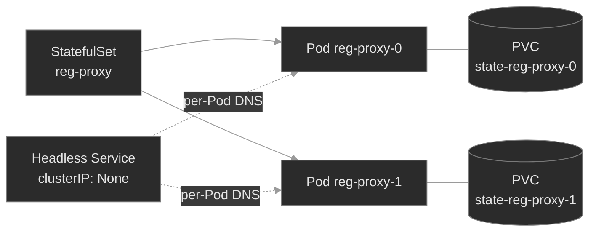

Read that as an ownership chain with two attachments: the StatefulSet **creates** each Pod (solid arrows — delete a Pod and the controller remakes it with the same name), while the headless Service and the per-ordinal PVC **attach** identity to each Pod (DNS and storage that follow the ordinal, not the individual Pod instance). The controller also enforces *order*: under the default `OrderedReady` policy, `reg-proxy-1` isn't created until `reg-proxy-0` is Ready. That ordering is the point for systems that bootstrap a leader first — and the trap when Pod-0 never becomes Ready.

A **DaemonSet** says something simpler: this Pod belongs to the *node*, not to a replica count. One per node, everywhere the workload should run. You don't set `replicas`; the node set *is* the replica count. Add a node and a Pod appears on it; drain a node and its Pod goes with it. The only question a DaemonSet ever really asks is "which nodes count?" — every node that matches its selectors/affinity and tolerates its taints. A DaemonSet under-covers exactly when a node it should reach carries a taint the Pod doesn't tolerate.

The unifying idea: a Deployment guarantees *a number of Pods somewhere*; a StatefulSet guarantees *these specific Pods, in order, with their storage and names*; a DaemonSet guarantees *one Pod per node*. Each stronger guarantee has its own way to break.

### Concept walkthrough

#### The StatefulSet's three guarantees

A Deployment's ReplicaSet creates Pods with random-suffix names (`session-broker-7d9f8-abc12`), interchangeable and stateless by intent — three replicas with no relationship to each other. That's ideal for a stateless service and useless for a database, a message broker, or a registrar cache, where a specific member owns specific data and others address it by name.

A **StatefulSet** replaces the random suffix with a stable ordinal and pins three things to it<sup><a href="https://kubernetes.io/docs/concepts/workloads/controllers/statefulset/">[1]</a></sup>:

**Ordinal identity.** Pods are `<name>-0` through `<name>-(N-1)`. The name is durable: kill `reg-proxy-0` and the controller recreates a Pod with the *same* name, not a new random one. Applications rely on this — `reg-proxy-0` might be the seed node others join, and that only works if "0" always means the same member.

**Stable network identity.** A StatefulSet names a **governing Service** in `spec.serviceName`, and that Service must be **headless** (`clusterIP: None`). A headless Service has no virtual IP; instead, cluster DNS publishes a per-Pod A record for each member: `<pod>.<serviceName>.<ns>.svc.cluster.local`<sup><a href="https://kubernetes.io/docs/concepts/services-networking/dns-pod-service/">[2]</a></sup>. So `reg-proxy-0.reg-proxy.signaling.svc.cluster.local` always resolves to whichever Pod currently holds ordinal 0. This is how stateful peers discover *each other specifically* rather than being load-balanced across a VIP. The sharp edge: **the StatefulSet controller does not create this Service — you do**<sup><a href="https://kubernetes.io/docs/concepts/workloads/controllers/statefulset/#limitations">[1]</a></sup>. Forget it, or give it a ClusterIP instead of `None`, and the Pods still start and run — but the per-Pod DNS records never appear, so every peer lookup returns NXDOMAIN and the cluster can't form. The Pods look healthy; the membership is broken.

**Stable storage.** A `volumeClaimTemplate` is a PVC template embedded in the StatefulSet. For each replica the controller stamps a distinct PVC named `<template>-<name>-<ordinal>` — `state-reg-proxy-0`, `state-reg-proxy-1` — and mounts it into that ordinal's Pod<sup><a href="https://kubernetes.io/docs/concepts/workloads/controllers/statefulset/#stable-storage">[1]</a></sup>. The binding is sticky: reschedule `reg-proxy-0` to another node and it re-mounts *its* PVC with *its* data. Scaling down does **not** delete these PVCs by default — the data outlives the Pod, so a scale-down-then-up doesn't silently discard state (see the deep-dive below).

<details>
<summary>📖 Going deeper: StatefulSet or Deployment + PVC — which do you actually need?<sup><a href="https://kubernetes.io/docs/concepts/workloads/controllers/statefulset/">[1]</a></sup></summary>

Having a PVC does not mean you need a StatefulSet. The fleet's `directory` and `cdr-writer` are **Deployments** with a plain PVC — one replica, one volume, no per-Pod identity required. Reach for a StatefulSet only when the workload needs one of the three guarantees:

- **Stable name** — members address each other by identity (`node-0` is the seed), or an external system pins to a specific replica.
- **Per-replica storage that follows the replica** — each member owns a *distinct* shard/copy of the data, and replica `N` must always get volume `N`. A Deployment with N replicas sharing one `ReadWriteOnce` PVC can't even schedule past one Pod; giving each its own volume that tracks its identity is exactly `volumeClaimTemplates`.
- **Ordered, controlled rollout** — the app must bootstrap or upgrade one member at a time, in order.

If none of those hold — a stateless web tier, a worker pool, anything where "any replica will do" — a Deployment is simpler and rolls out faster (all replicas in parallel, random names, no ordering constraints). Most workloads are Deployments. StatefulSets are the deliberate exception, and every one you run is a small ongoing cost (slower rollouts, ordering foot-guns, storage you must reason about). Don't pay it unless the guarantee earns it.

</details>

#### Ordered lifecycle: creation, scaling, and updates

A StatefulSet's second personality is *order*. Under the default `podManagementPolicy: OrderedReady`, the controller brings Pods up strictly in sequence: it creates `<name>-0`, waits until it is **Running and Ready**, then creates `<name>-1`, and so on<sup><a href="https://kubernetes.io/docs/concepts/workloads/controllers/statefulset/#deployment-and-scaling-guarantees">[1]</a></sup>. Scale-down runs in reverse — the highest ordinal terminates first, fully, before the next. This is deliberate: a clustered store often needs its seed member healthy before the rest join, and a controlled teardown before the leader.

It's also a failure mode a Deployment simply doesn't have. A Deployment asked for three replicas creates all three at once; if one is unhealthy, the other two still come up. A StatefulSet asked for three replicas where **Pod-0 never goes Ready** creates *only Pod-0* — Pods 1 and 2 are never created, because the gate before them never opens. The signature is unmistakable once you know it: `kubectl get statefulset` shows `READY 0/3`, and `kubectl get pods` shows a single Pod, `<name>-0`, Running but `0/1` ready. The instinct to look for three crashing Pods is wrong; there's one Pod and two absences. The fix is always to make Pod-0 Ready — usually a readiness probe pointed at the wrong port, a missing dependency, or a bad config — and the rest of the set unblocks itself the moment it does. (If your app doesn't need ordered startup, `podManagementPolicy: Parallel` removes this gate while keeping stable names and storage.)

Updates follow the same ordered discipline. The default `updateStrategy: RollingUpdate` replaces Pods in **reverse ordinal order** when the template changes, one at a time, waiting for each to go Ready before the next<sup><a href="https://kubernetes.io/docs/concepts/workloads/controllers/statefulset/#update-strategies">[1]</a></sup>. The `partition` field makes it a staged rollout: set `partition: 2` and only ordinals `>= 2` update, leaving `0` and `1` on the old revision — a canary you widen by lowering the partition. `OnDelete` opts out of automation: the controller applies the new template to a Pod only when you delete that Pod. The through-line: a StatefulSet does everything *in order* — a feature you exploit and a constraint you respect.

<details>
<summary>📖 Going deeper: what happens to the PVCs when you scale down or delete<sup><a href="https://kubernetes.io/docs/concepts/workloads/controllers/statefulset/#persistentvolumeclaim-retention">[1]</a></sup></summary>

The PVCs a `volumeClaimTemplate` creates are, by default, **not** owned by the StatefulSet's lifecycle — they persist when you scale down and when you delete the StatefulSet itself. That default is a safety feature: scaling `reg-proxy` from 3 to 1 to ride out low traffic doesn't throw away `state-reg-proxy-1` and `-2`; scale back up and the returning ordinals re-bind their old data. It's also a surprise the first time you `kubectl delete statefulset` expecting the storage to go with it and find the PVCs (and their PVs) still there, still billing.

The `persistentVolumeClaimRetentionPolicy` field (stable since v1.32) lets you opt into deletion with two independent knobs: `whenScaled` (delete a PVC when its ordinal is scaled away) and `whenDeleted` (delete PVCs when the whole StatefulSet is deleted), each `Retain` (default) or `Delete`<sup><a href="https://kubernetes.io/docs/concepts/workloads/controllers/statefulset/#persistentvolumeclaim-retention">[1]</a></sup>. Leave it at the default for stores where the data is precious; set `whenScaled: Delete` for a scratch cache whose per-ordinal volume is worthless once the ordinal is gone. Either way, know which you've chosen — "I deleted the StatefulSet and the data's still there" and "I scaled down and lost the shard" are the same field set two different ways.

</details>

#### DaemonSets: one Pod per node

A **DaemonSet** exists for workloads that are properties of a *node* rather than of a service: something that must run wherever there are packets to inspect, logs to ship, or hardware to expose<sup><a href="https://kubernetes.io/docs/concepts/workloads/controllers/daemonset/">[3]</a></sup>. You don't declare a replica count — the controller watches the node list and maintains exactly one Pod on each node that qualifies, adding one when a node joins and letting it die with its node when one leaves. `sbc-edge` is a DaemonSet because a Session Border Controller has to be present on every node that terminates media; a node without one is a node whose media has no edge.

"Every node that qualifies" is the entire subtlety. For each node, the controller decides whether the Pod *should* run there using the same placement rules the scheduler uses: the Pod's `nodeSelector` and node affinity must match the node's labels, **and** the Pod must tolerate the node's taints<sup><a href="https://kubernetes.io/docs/concepts/scheduling-eviction/taint-and-toleration/">[4]</a></sup>. A node the Pod can't tolerate is not a candidate, so it is **not** counted in `desiredNumberScheduled`. That's the field to read: `kubectl get daemonset` shows `DESIRED CURRENT READY UP-TO-DATE AVAILABLE`, and `DESIRED` is the number of *eligible* nodes, not the number of nodes in the cluster. When those two disagree, coverage is the story.

This is where DaemonSets fail quietly. There's no `Pending` Pod to trip over — an untolerated node simply isn't a candidate, so no Pod is ever created for it and nothing goes red. `sbc-edge` reaches both nodes of this cluster *only because* it carries an explicit toleration for the control-plane taint (`node-role.kubernetes.io/control-plane:NoSchedule`) that kubeadm applies to keep ordinary workloads off. The controller auto-adds tolerations for the transient node-condition taints (`not-ready`, `unreachable`, memory/disk/PID pressure, `unschedulable`) so agents keep running while a node is troubled<sup><a href="https://kubernetes.io/docs/concepts/scheduling-eviction/taint-and-toleration/">[4]</a></sup> — but **not** one for the control-plane taint. Drop that toleration and `sbc-edge` lands on the worker only: `DESIRED 1`, no error, a control-plane node with no edge agent. The reflex: when a DaemonSet's `DESIRED` is below your node count, compare the Pod's tolerations against the missing node's taints.

DaemonSet updates use the same `RollingUpdate`/`OnDelete` vocabulary as a StatefulSet: `RollingUpdate` (the default) replaces Pods node-by-node under a `maxUnavailable` budget, so you never take the agent off too many nodes at once<sup><a href="https://kubernetes.io/docs/tasks/manage-daemon/update-daemon-set/">[5]</a></sup>. The mental shift from a Deployment is complete: there's no "how many," only "which nodes, and is each one covered and current."

### Hands-on

Four baseline steps, three break/fix scenarios — all on the full Polyphone fleet on a 2-node cluster (one tainted control-plane, one worker). The baseline tours the controllers the fleet already runs; each break/fix layers one small purpose-built workload that breaks exactly one guarantee.

- **`baseline/`** — the fleet's StatefulSets and DaemonSet as healthy reference: `media-engine`/`reg-proxy` ordinal names, their headless Services and per-Pod DNS, the sticky `state-<sts>-<ordinal>` PVCs, and `sbc-edge` covering both nodes via its control-plane toleration. What each guarantee looks like when it holds.
- **`breakfix-01-headless-service-missing`** — a 3-replica StatefulSet whose Pods are all Running, but `session-store-0.session-store…` returns NXDOMAIN: the governing headless Service was never created. Tests knowing that stable network identity is the Service's job and the Service is *yours* to create.
- **`breakfix-02-ordered-rollout-stall`** — a StatefulSet stuck at `READY 0/3` with only Pod-0 present, Running but not Ready: a readiness probe on the wrong port, and `OrderedReady` refusing to create Pod-1 behind it. Tests reading the ordered lifecycle and seeing that one Pod's un-readiness is two Pods' absence.
- **`breakfix-03-daemonset-node-coverage`** — a node-local agent that should be everywhere but reports `DESIRED 1` on a 2-node cluster: a DaemonSet missing the control-plane toleration, silently skipping that node. Tests reading `desiredNumberScheduled` as a coverage check and matching tolerations to taints.

Work them in order; the baseline makes each broken guarantee stand out. Check yourself against `ANSWER-KEY.md` after each.

### Common failure modes

| Symptom | Likely cause | Where to look |
|---------|--------------|---------------|
| StatefulSet Pods Running, but `pod-0.svc.ns` won't resolve (NXDOMAIN) | Governing headless Service missing, misnamed, or not headless (`serviceName` points at nothing / a ClusterIP Service) | `kubectl get svc -n <ns>`; the StatefulSet's `spec.serviceName`; the Service's `clusterIP` (must be `None`) |
| StatefulSet stuck `READY 0/N`, only `<name>-0` exists and is `0/1` | `OrderedReady` blocked — Pod-0 never went Ready, so no later ordinal is created | `kubectl get pods`; `kubectl describe pod <name>-0` (readiness probe, events); the probe's port/path |
| StatefulSet won't scale up past an ordinal; a middle Pod is `Pending` | That ordinal's PVC can't bind, or the Pod can't schedule where its `RWO` volume attaches | `kubectl get pvc -n <ns>`; `describe pod` events (M05/M06) |
| Deleted a StatefulSet, storage still there (or scaled down, data gone) | `persistentVolumeClaimRetentionPolicy` — default `Retain`, or set to `Delete` | the StatefulSet's `persistentVolumeClaimRetentionPolicy`; `kubectl get pvc` |
| DaemonSet `DESIRED` lower than the node count; a node has no agent | Pod doesn't tolerate that node's taint (or doesn't match its `nodeSelector`/affinity) | `kubectl get ds`; `kubectl get pods -o wide`; the Pod's `tolerations` vs. `kubectl describe node <missing> \| grep Taints` |
| DaemonSet Pods on all nodes but one won't go Ready | Node-local dependency (host path, port, device) absent on that node — a Pod problem, not a coverage one | `kubectl describe pod` on that node's DaemonSet Pod; its logs |

### Recap

- **A StatefulSet nails down what a Deployment leaves loose:** ordinal names, a per-Pod DNS record, and a per-Pod PVC — all sticky to the ordinal across restarts. Use one only when the workload needs one of those three; otherwise a Deployment is simpler and faster.
- **Stable network identity is the headless Service's job, and the Service is yours to create.** Miss it and the Pods run fine while every per-Pod DNS name returns NXDOMAIN — a healthy-looking set that can't form a cluster.
- **`OrderedReady` means Pod-0 gates the whole set.** A StatefulSet stuck at `READY 0/N` with only Pod-0 present is one un-ready Pod blocking every ordinal behind it — fix Pod-0's readiness and the rest unblock. A Deployment never fails this way.
- **A DaemonSet guarantees one Pod per *eligible* node, and eligibility includes tolerating the node's taints.** `desiredNumberScheduled` counts only reachable nodes, so it's your coverage check — when it's below the node count, read tolerations against the missing node's taints.
- **These controllers fail quietly.** No crash, no `Pending` in the identity and coverage cases — the Pods are up. You catch the failure by verifying the guarantee (does the name resolve? are all ordinals present? is every node covered?), not by waiting for something to go red.

### Production thinking

- A stateful cache runs as a 5-replica StatefulSet. During an incident you scale it to 2 to shed load, then back to 5 an hour later — and two members come back with empty volumes and re-replicate from scratch, briefly halving capacity. Which retention setting produced that, what would the alternative have done to your storage bill during the scale-down, and how would you decide per-workload?
- You add a node-local security agent as a DaemonSet and it rolls out clean — `DESIRED` matches `CURRENT`, all Ready. Weeks later an audit finds the control-plane nodes were never covered. Nothing ever alerted. What single field explains the gap, and what check — on a metric or in CI — would have caught "DaemonSet covers fewer nodes than exist" before the audit did?
- A StatefulSet's rollout wedges: you pushed a new image, ordinal 4 updated and crash-loops on a bad config, and the rollout stops there with 0–3 on the old revision and 4 down. Explain why `RollingUpdate` halted instead of continuing, how `partition` could have made this a contained canary, and how you'd recover ordinal 4 without disturbing the members still serving.

### References

1. Kubernetes — StatefulSets: https://kubernetes.io/docs/concepts/workloads/controllers/statefulset/
2. Kubernetes — DNS for Services and Pods: https://kubernetes.io/docs/concepts/services-networking/dns-pod-service/
3. Kubernetes — DaemonSet: https://kubernetes.io/docs/concepts/workloads/controllers/daemonset/
4. Kubernetes — Taints and Tolerations: https://kubernetes.io/docs/concepts/scheduling-eviction/taint-and-toleration/
5. Kubernetes — Perform a Rolling Update on a DaemonSet: https://kubernetes.io/docs/tasks/manage-daemon/update-daemon-set/


---

## Break/Fix Practice

## Break/fix 01 — Headless Service Missing

**Symptom — what you'd actually see:**

`session-store` (a 3-replica StatefulSet in `app-services`) has all three Pods `Running`, `READY 3/3`, correctly named — but its members can't reach each other, and `nslookup session-store-0.session-store.app-services.svc.cluster.local` returns NXDOMAIN.

**Think about this before you open the answer:**

Knowing that a StatefulSet's network identity is a Service you own, and that "Pods Running" ≠ "identity working." Self-grading:

- Did you check the *name resolution*, not just `get pods` (which looked healthy)?
- Did you find the missing Service via `serviceName` + `get svc`, rather than assuming the Pods or DNS were broken?
- Did you create it **headless** (`clusterIP: None`) — knowing a normal ClusterIP Service wouldn't publish the per-Pod records?

<details>
<summary><b>Click to reveal: diagnostic commands, root cause, exact fix, verify</b></summary>

**Root cause:**

The StatefulSet's governing Service — named in `spec.serviceName: session-store` — was never created. A StatefulSet does **not** create its governing Service; you must, and it must be **headless** (`clusterIP: None`)<sup><a href="https://kubernetes.io/docs/concepts/workloads/controllers/statefulset/">[1]</a></sup>. Without a headless Service selecting the Pods, cluster DNS has no basis to publish the per-Pod A records `<pod>.<serviceName>.<ns>.svc.cluster.local`<sup><a href="https://kubernetes.io/docs/concepts/services-networking/dns-pod-service/">[2]</a></sup>. Ordinal identity and storage are intact — only the network identity is missing — so the Pods look perfectly healthy.

**Diagnostic commands (run in this order):**

```bash
# 1. Pods are up and correctly named — this is NOT a crash or scheduling problem
kubectl get statefulset session-store -n app-services       # READY 3/3
kubectl get pods -n app-services -l app=session-store       # -0, -1, -2 all Running

# 2. The per-Pod name doesn't resolve
kubectl run dns --rm -i --restart=Never --image=busybox:1.36 -n app-services -- \
  nslookup session-store-0.session-store.app-services.svc.cluster.local   # NXDOMAIN

# 3. The governing Service the StatefulSet expects — and its absence
kubectl get statefulset session-store -n app-services -o jsonpath='{.spec.serviceName}'; echo  # session-store
kubectl get svc -n app-services                              # no session-store Service
```

**Exact fix:**

Create the headless governing Service the StatefulSet points at:

```bash
cat <<'EOF' | kubectl apply -f -
apiVersion: v1
kind: Service
metadata:
  name: session-store
  namespace: app-services
  labels: { app: session-store, plane: app, tier: lab }
spec:
  clusterIP: None
  selector: { app: session-store }
  ports: [{ port: 80, name: http }]
EOF
```

**Verify:**

```bash
kubectl get svc session-store -n app-services               # CLUSTER-IP None
kubectl run dns --rm -i --restart=Never --image=busybox:1.36 -n app-services -- \
  nslookup session-store-0.session-store.app-services.svc.cluster.local   # resolves to Pod-0 IP
```

**Production thinking:**

This is the single most common StatefulSet mistake — the manifest ships the StatefulSet and forgets (or misnames, or gives a ClusterIP to) the governing Service. It passes every "are the Pods up?" check and fails only when peers try to find each other, which may be minutes into a cluster bootstrap. Guard it by templating the StatefulSet and its headless Service together (one Helm chart / Kustomize base — M16–M17) so they can't drift apart, and by adding a readiness or startup check in the app that actually resolves a peer name, turning a silent DNS gap into a failing probe.

</details>

---

## Break/fix 02 — Ordered Rollout Stall

**Symptom — what you'd actually see:**

`session-store` (declared `replicas: 3`, headless Service present this time) is stuck at `READY 0/3`, and only `session-store-0` exists — `Running` but `0/1` ready. `session-store-1` and `-2` were never created.

**Think about this before you open the answer:**

Reading the ordered lifecycle — recognizing that missing higher ordinals are a *symptom* of an un-ready lower one, not a separate failure. Self-grading:

- Did you notice only Pod-0 existed and read that as "the gate never opened," rather than looking for three failed Pods?
- Did you diagnose Pod-0's readiness (probe port vs. container port), not restart the whole set blindly?
- Do you understand *why* a Deployment wouldn't fail this way (parallel creation, no ordering gate)?

<details>
<summary><b>Click to reveal: diagnostic commands, root cause, exact fix, verify</b></summary>

**Root cause:**

`session-store-0`'s **readiness probe** targets port `8080`, but the container serves on port `80`; the probe is refused every time, so the kubelet never marks Pod-0 Ready. Under the default `podManagementPolicy: OrderedReady`, the controller creates ordinals one at a time and will not create Pod `N+1` until Pod `N` is Running **and** Ready<sup><a href="https://kubernetes.io/docs/concepts/workloads/controllers/statefulset/">[1]</a></sup>. Pod-0 never goes Ready, so ordinals 1 and 2 are never created. A Deployment would have created all three replicas at once and left the two healthy ones serving — the ordered lifecycle is what makes one un-ready Pod a whole-set stall.

**Diagnostic commands (run in this order):**

```bash
# 1. Only Pod-0 exists, and the set is 0/3 — a StatefulSet-shaped stall
kubectl get statefulset session-store -n app-services       # READY 0/3
kubectl get pods -n app-services -l app=session-store       # only session-store-0, 0/1 Running

# 2. Pod-0 is Running but not Ready — the probe is failing
kubectl describe pod session-store-0 -n app-services | grep -A8 Conditions   # Ready: False
kubectl describe pod session-store-0 -n app-services | grep -A6 Events        # Readiness probe failed: connection refused

# 3. The probe's port vs. the container's port
kubectl get statefulset session-store -n app-services \
  -o jsonpath='{.spec.template.spec.containers[0].readinessProbe.httpGet}'; echo   # port 8080
kubectl get statefulset session-store -n app-services \
  -o jsonpath='{.spec.template.spec.containers[0].ports}'; echo                    # containerPort 80
```

**Exact fix:**

Point the readiness probe at the port the container serves (80):

```bash
kubectl patch statefulset session-store -n app-services --type=json -p \
  '[{"op":"replace","path":"/spec/template/spec/containers/0/readinessProbe/httpGet/port","value":80}]'
# The RollingUpdate recreates Pod-0 with the corrected probe. If it doesn't re-roll promptly:
kubectl delete pod session-store-0 -n app-services   # comes back with the same name + PVC
```

**Verify:**

```bash
kubectl rollout status statefulset/session-store -n app-services --timeout=120s
kubectl get statefulset session-store -n app-services       # READY 3/3
kubectl get pods -n app-services -l app=session-store       # -0, -1, -2 all 1/1 Running
```

**Production thinking:**

`OrderedReady` is a feature for apps that must bootstrap a seed member before peers join — and a foot-gun when a health check is wrong, because it converts one Pod's misconfiguration into a total rollout stall. Know the escape hatches: `podManagementPolicy: Parallel` drops the ordering gate (keeping stable names and storage) for apps that don't need sequential startup; and for updates, `partition` lets you canary a new revision to the top ordinals only, so a bad rollout is contained to a few Pods instead of stopping at ordinal 0. Either way, get the readiness probe right — in a StatefulSet it gates far more than one Pod.

</details>

---

## Break/fix 03 — DaemonSet Node Coverage

**Symptom — what you'd actually see:**

`rtp-probe`, a DaemonSet in `edge` meant to run on every node, reports `DESIRED 1` on a 2-node cluster. Its one Pod runs on the worker; the control-plane node has no `rtp-probe` Pod. Nothing is `Pending`, no event or error appears.

**Think about this before you open the answer:**

Reading `desiredNumberScheduled` as a coverage check, and knowing DaemonSet eligibility includes taint tolerations. Self-grading:

- Did you notice `DESIRED` was below the node count and treat *that* as the bug, rather than looking for a crashed or `Pending` Pod (there isn't one)?
- Did you find the uncovered node's taint and compare tolerations between the two DaemonSets?
- Did you match the toleration to the taint (key/effect), rather than guess at resources or affinity?

<details>
<summary><b>Click to reveal: diagnostic commands, root cause, exact fix, verify</b></summary>

**Root cause:**

`rtp-probe`'s Pod template is missing a toleration for the control-plane taint `node-role.kubernetes.io/control-plane:NoSchedule`. A DaemonSet counts a node in `desiredNumberScheduled` only if the Pod matches the node's selectors/affinity **and** tolerates its taints<sup><a href="https://kubernetes.io/docs/concepts/workloads/controllers/daemonset/">[4]</a></sup><sup><a href="https://kubernetes.io/docs/concepts/scheduling-eviction/taint-and-toleration/">[3]</a></sup>. The control-plane node is tainted, `rtp-probe` doesn't tolerate it, so that node is ineligible — not counted, never scheduled, and silent (there's no rejected Pod to leave a `Pending` trail). The fleet's `sbc-edge` DaemonSet reaches both nodes precisely because it *does* carry that toleration.

**Diagnostic commands (run in this order):**

```bash
# 1. DESIRED is the coverage number, and it's short of the node count
kubectl get daemonset -n edge                # sbc-edge DESIRED 2; rtp-probe DESIRED 1
kubectl get nodes                            # 2 nodes
kubectl get pods -n edge -o wide             # rtp-probe only on the worker; control-plane uncovered

# 2. The uncovered node is tainted
kubectl describe node -l node-role.kubernetes.io/control-plane | grep -A2 Taints
#    node-role.kubernetes.io/control-plane:NoSchedule

# 3. sbc-edge tolerates it; rtp-probe tolerates nothing
kubectl get ds sbc-edge  -n edge -o jsonpath='{.spec.template.spec.tolerations}'; echo   # control-plane toleration
kubectl get ds rtp-probe -n edge -o jsonpath='{.spec.template.spec.tolerations}'; echo   # empty
```

**Exact fix:**

Add the control-plane toleration (the same form `sbc-edge` uses):

```bash
kubectl patch daemonset rtp-probe -n edge --type=json -p \
  '[{"op":"add","path":"/spec/template/spec/tolerations","value":[{"key":"node-role.kubernetes.io/control-plane","operator":"Exists","effect":"NoSchedule"}]}]'
# or: kubectl edit daemonset rtp-probe -n edge  → add the tolerations block
```

**Verify:**

```bash
kubectl get daemonset rtp-probe -n edge      # DESIRED 2 CURRENT 2 READY 2
kubectl get pods -n edge -o wide -l app=rtp-probe   # a Pod now on the control-plane node too
```

**Production thinking:**

This is how node-local agents (log shippers, security agents, CNI/CSI plugins, node exporters) silently miss nodes — a taint added to a node pool after the DaemonSet shipped, or a DaemonSet that never tolerated the control-plane/dedicated taints in the first place. Because it's silent, add a check that compares each critical DaemonSet's `desiredNumberScheduled` (or `numberReady`) against the node count and alerts on a gap — the control-plane and any tainted pools are where coverage quietly disappears. When you *do* want an agent everywhere including tainted nodes, the blunt instrument is `tolerations: [{ operator: Exists }]` (tolerate everything); prefer specific tolerations so you don't accidentally schedule onto nodes cordoned or under-pressure for a reason.

</details>

---


---

# `m08-crds-operators/`

## Concept

## M08 — CRDs & Operators

> The API server ships with a fixed vocabulary — Pods, Deployments, Services. A CustomResourceDefinition adds your own words to it; an operator is the program that makes those words mean something. Together they're how every capability above the built-ins — databases, certificates, mesh config — gets delivered, and how it quietly fails.

### What you'll learn

- Explain what a **CRD** does: it registers a new resource *type* (schema and all) with the API server, so a custom resource is first-class — `kubectl get/describe/explain`, RBAC, and admission validation all work on it — not a YAML blob you parse yourself.
- Read the anatomy of a **custom resource**: `.spec` (desired state, which you declare) vs. `.status` (observed state, which the controller writes on a separate subresource) — and why that split is the contract every operator follows.
- Describe the **controller/operator pattern**: a level-triggered **reconcile loop** that compares desired to observed and acts to close the gap — and see that an operator is just a CRD **plus** a controller.
- Read **operator-managed state** during an incident from the three surfaces that reveal it: the CR's `.status`/conditions, the child resources the operator created, and the operator's own logs.
- Diagnose **stuck reconciliation** — an operator that's `Running` but making no progress — and tell the causes apart: the controller is down, its RBAC forbids the action, or it watches a CRD version that isn't served.
- Trace **owner references**: how operator-created children point back to their CR, how cascading garbage collection follows that link, and how a missing or stale ownerReference produces orphans (and a finalizer, a stuck deletion).

### Why it matters

Everything above the built-in resource types on a real cluster is delivered by an operator. Cert-manager issues TLS certificates from a `Certificate`; the Prometheus operator turns a `ServiceMonitor` into scrape config; External Secrets syncs a `Secret` from a vault. Each is the same shape: a CRD that adds a type, and a controller that watches instances of it and makes the cluster match. You'll operate far more operators than you ever write, so the skill that matters is *reading* one under pressure — not building one.

At Polyphone the platform team ships an operator so product teams don't hand-write infrastructure. A team needing media capacity creates a **MediaTenant** — a custom resource declaring a tier and a replica count — and the **tenant-operator** turns that intent into a correctly-sized Deployment, linked back to the tenant, with progress in the tenant's `.status`. Self-service in, capacity out — a small version of exactly how the big operators work.

The reason this earns a lesson is that operators fail in ways built-in controllers don't, and they fail *quietly*: a stuck operator's Pod stays `Running` while nothing it manages progresses; a schema-invalid resource is rejected before the operator ever sees it; an un-owned child survives the cleanup that should have removed it. None shows up as a red status. You catch them by knowing the pattern — type, controller, reconcile, owner reference — and checking that each link held.

### Scope

**Covers:** the **CustomResourceDefinition** — how it registers a type (group/version/kind, plural, scope), the structural OpenAPI **schema** the API server validates every custom resource against, the `Established` condition, and `served`/`storage` versions; the **custom resource** — the `.spec`/`.status` split and the status **subresource**; the **controller/operator pattern** — level-triggered reconciliation, desired vs. observed state, reading operator-managed state, and the diagnostic signatures of **stuck reconciliation**; and **owner references** — controller references, cascading **garbage collection**, orphans, and (in a deep dive) finalizers.

**Doesn't cover:** *writing* an operator — Go, controller-runtime, Kubebuilder/Operator SDK, watches, and work queues are a development topic, not this one; the goal here is reading operators, not building them. Admission **webhooks** (validating/mutating) and CEL validation rules beyond basic schema → out of scope here. **Aggregated API servers**, the heavier alternative to CRDs for extending the API → out of scope. The full **RBAC** model an operator's ServiceAccount relies on → M10; this module defines just enough to diagnose a permission-denied reconcile. Packaging operators with Helm/Kustomize → M16–M17. Specific ecosystem operators live with their topics: Prometheus operator → M13, cert-manager → M12, External Secrets → M11.

**Assumes:** M00 (every object is `spec` + `status`; group/version/kind; namespaces; `kubectl get/describe/explain`), and M01 (a controller — not you — creates Pods, and a Deployment owns its ReplicaSet which owns its Pods; built-in controllers already reconcile). ServiceAccounts and RBAC are introduced here on first use and treated in full in M10.

### Vocabulary

| Term | Definition |
|------|------------|
| **CustomResourceDefinition (CRD)** | An object (`kind: CustomResourceDefinition`) that registers a new resource *type* with the API server. Its name is always `<plural>.<group>` (e.g. `mediatenants.polyphone.example`). Once it exists, the API server serves that type like a built-in. |
| **custom resource (CR)** | An instance of the type a CRD defines — e.g. a `MediaTenant` named `orion`. Stored, validated, and served by the API server exactly like a Pod or Deployment. |
| **group / version / kind (GVK)** | The three-part identity of a resource type. A CRD declares its `group` (`polyphone.example`), `versions` (`v1`), and `kind` (`MediaTenant`) — the same scheme built-ins use (`apps/v1` `Deployment`). |
| **structural schema** | The OpenAPI v3 schema in a CRD (`openAPIV3Schema`) constraining a CR's fields — types, enums, `required`, min/max. The API server validates every CR against it at admission, so a bad field is rejected, not stored. |
| **`Established`** | A CRD condition that flips `True` once the API server has registered the type and will serve it. Until then, `kubectl get <kind>` fails with "the server doesn't have a resource type." |
| **served / storage version** | Per-version flags. `served: true` means the API accepts that version; exactly one version is `storage: true`, the form persisted to etcd. Multiple served versions let consumers migrate gradually. |
| **controller** | A program running a control loop that watches a resource type and drives the cluster toward each object's declared state. Built-in controllers (Deployment, Job) ship in the control plane; a custom one you run yourself. |
| **reconcile loop / reconciliation** | The controller's core action: read desired state (`.spec`), observe actual state, take steps to close the gap — then repeat, forever. |
| **level-triggered** | The loop acts on the *current* desired-vs-observed difference, not a one-time event. A missed event is harmless — the next pass re-checks and corrects. This is why an unblocked operator recovers without a restart. |
| **operator** | A controller paired with one or more CRDs, encoding operational knowledge for a specific application. An operator = CRD(s) + controller. |
| **`.status` subresource** | A separate write path for `status` (enabled by `subresources: {status: {}}`). The controller updates `.status` through `/status`; a normal `apply` of `.spec` can't touch it — enforcing "you own spec, the controller owns status." |
| **owner reference** | A field in a child's `metadata.ownerReferences` naming an owner by kind, name, and **uid** — recording that the child belongs to that owner. With `controller: true` it's the single managing owner (a *controller reference*). |
| **garbage collection / cascading deletion** | The control-plane process that deletes an object's dependents when the owner is deleted, by finding every object whose `ownerReferences` names it. No ownerReference, no cascade. |
| **finalizer** | A key in `metadata.finalizers` that blocks hard deletion: the API server marks the object `Terminating` and waits until the responsible controller cleans up and removes the key. A finalizer whose controller is gone wedges the object in `Terminating`. |
| **ServiceAccount** | The in-cluster identity a Pod authenticates as. An operator runs as one and can only do what that identity's RBAC grants (full treatment: M10). |

### Mental model

Two pieces, one idea. A **CRD teaches the API server a new noun** — register `MediaTenant` and the server stores, validates, versions, and serves them, with RBAC and `kubectl` treating them like any built-in. But a noun with no verb is inert: creating a MediaTenant changes nothing on its own, just as a Deployment object would do nothing with no Deployment controller running. The **operator is the verb** — a control loop that watches MediaTenants and makes each one *mean* a running, correctly-sized Deployment.

The loop is **level-triggered**<sup><a href="https://kubernetes.io/docs/concepts/architecture/controller/">[4]</a></sup>. It doesn't handle "a MediaTenant was created" as a one-shot event; it repeatedly asks "for every MediaTenant that exists, does reality match its `.spec`?" and closes whatever gap it finds. That's why a healthy operator is self-correcting — delete a child it manages and the next pass recreates it — and why an unblocked operator recovers on its own, no restart needed.

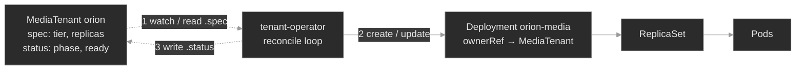

Read it as one turn of the loop: the operator reads each MediaTenant's `.spec` (1), creates or updates the child Deployment to match (2), and writes what it observed back into `.status` (3). The Deployment owns its ReplicaSet, which owns its Pods — the built-in chain from M01 — so the whole tree hangs off the CR. That's literal: the child carries an **ownerReference** back to the MediaTenant, and that single link lets cascading deletion tear the tree down when the tenant is deleted. Read the other direction, it's your debugging aid — from any child find the CR that owns it, from a CR find everything it spawned.

Three failure surfaces fall out of this picture, one per link you'll break: the **type** can reject a CR (schema), the **loop** can stall (operator down, forbidden, or watching the wrong version), and the **owner link** can be missing (an orphan survives cleanup). Different link, different symptom, different place to look.

### Concept walkthrough

#### Extending the API with CRDs

A **CustomResourceDefinition** is an object you apply like any other, but applying it has an unusual effect: the API server gains a new endpoint and starts serving a new type<sup><a href="https://kubernetes.io/docs/concepts/extend-kubernetes/api-extension/custom-resources/">[1]</a></sup>. The CRD declares the type's identity — `group`, `versions`, `kind`, the `plural`/`singular`/`shortNames` you'll type — and its `scope` (`Namespaced` or `Cluster`). Its name is mechanical: always `<plural>.<group>`, here `mediatenants.polyphone.example`.

Registration isn't instant. When the type is ready to serve, the API server sets the `Established` condition `True`<sup><a href="https://kubernetes.io/docs/tasks/extend-kubernetes/custom-resources/custom-resource-definitions/">[2]</a></sup>. Before that flips, `kubectl get mediatenants` fails with "the server doesn't have a resource type" — the same error as a typo. So the first question when a custom type "doesn't exist" is: is the CRD installed, and `Established`?

What makes a custom resource *first-class* rather than a free-form blob is the **structural schema** — an OpenAPI v3 document embedded in the CRD's version<sup><a href="https://kubernetes.io/docs/tasks/extend-kubernetes/custom-resources/custom-resource-definitions/">[2]</a></sup>. It declares each field's type and constraints: `spec.tier` a string restricted to the enum `gold`/`silver`/`bronze`, `spec.replicas` an integer 1–5, both `required`. The API server validates every CR against it at admission, exactly as it validates a built-in — a MediaTenant with `tier: platinum` or a missing `replicas` is **rejected and never stored**. Operationally: "my custom resource won't apply" is almost always a schema mismatch, and the rejection message names the offending field. `kubectl explain mediatenant.spec` reads the same schema back, because `explain` is generated from it.

A CRD can serve more than one **version** at once. Each version flags whether it's `served` (the API accepts it) and which single one is `storage` (the form written to etcd)<sup><a href="https://kubernetes.io/docs/tasks/extend-kubernetes/custom-resources/custom-resource-definitions/">[2]</a></sup> — the machinery of schema migration, and a quiet source of operator breakage (see the deep dive).

<details>
<summary>📖 Going deeper: CRD versions, served vs. storage, and the version-skew trap<sup><a href="https://kubernetes.io/docs/tasks/extend-kubernetes/custom-resources/custom-resource-definitions/">[2]</a></sup></summary>

A type evolves. You ship `MediaTenant` at `v1alpha1`, then add fields and want `v1`. A CRD lets both versions be `served` at once so consumers migrate on their own schedule, while exactly one is `storage: true` — every object is persisted in the storage version and converted on read to whatever version the client asked for. Schema-compatible changes convert automatically; structural changes need a **conversion webhook**.

The operational trap is **version skew**. Say the operator watches `polyphone.example/v1`, but a CRD change left only `v1alpha1` served (someone dropped `served: true` from `v1`, or a controller upgrade lagged the CRD). The operator's watch now targets a version the API won't serve, so it sees *no* MediaTenants and reconciles nothing — every CR sits untouched. This looks identical to "the operator is asleep." The tell is in the CRD: `kubectl get crd mediatenants.polyphone.example -o jsonpath='{.spec.versions[*].name} {.spec.versions[*].served}'` shows which versions exist and which are served — compare that to the `apiVersion` the operator is built for. When you upgrade an operator, upgrade its CRD in lockstep, and never drop a served version consumers still use.

</details>

#### The controller pattern: reconciliation

A **controller** watches a resource type and drives the cluster toward each object's declared state<sup><a href="https://kubernetes.io/docs/concepts/architecture/controller/">[4]</a></sup>. You already rely on dozens — the Deployment controller reconciles Deployments into ReplicaSets, the Job controller runs Pods to completion. An **operator** is the same idea aimed at a *custom* type: a controller paired with a CRD, packaging the knowledge of running some specific thing<sup><a href="https://kubernetes.io/docs/concepts/extend-kubernetes/operator/">[3]</a></sup>. There's no magic ingredient — "operator" is just "custom controller + its CRD(s)."

The loop's discipline is **reconciliation**: read `.spec` (desired), observe what exists, take the steps that make reality match — then repeat, forever. Because it's **level-triggered**, it reasons about the current difference rather than a stream of events, so a dropped notification, a restart, or an API blip all self-heal on the next pass. The tenant-operator's loop is small enough to read in one breath — for each MediaTenant, ensure a child Deployment at the right replica count, stamp the ownerReference, write `.status` — but it has the full shape: observe, act, report.

That last step, **report**, is where operators talk back. A well-behaved controller writes what it observed into the CR's `.status` — here `phase` (`Provisioning` → `Ready`) and `readyReplicas` — through the **status subresource**<sup><a href="https://kubernetes.io/docs/tasks/extend-kubernetes/custom-resources/custom-resource-definitions/">[2]</a></sup>, which splits the halves at the API: you write `.spec`, the controller writes `.status`, neither clobbers the other. So **reading operator-managed state** means reading three surfaces together: the CR's `.status`/conditions (what the operator claims), the child resources (what exists), and the operator's **logs** (what it tried and what stopped it). Agreement means healthy; a gap localizes the fault.

Which raises the failure mode that trips people: **stuck reconciliation**. An operator can be a healthy *process* — Pod `Running`, no restarts — and a stalled *controller*; the Pod's status only says the program is alive, not that its loop progresses. When custom resources sit un-advanced, suspect three things: the controller is **down** (crashlooping, scaled to zero) — visible in `get pods`; it's **forbidden** — it runs as a ServiceAccount, and if that identity's RBAC lacks a verb the loop needs, every attempt is denied `403` (in the logs, and via `kubectl auth can-i --as=<the operator's SA>`), the most common cause; or it watches an unserved **CRD version** (the skew above). Same symptom, three surfaces — and the logs usually name which.

#### Owner references and the object graph

When the operator creates `orion-media`, it sets an **ownerReference** on it pointing back to the `orion` MediaTenant<sup><a href="https://kubernetes.io/docs/concepts/overview/working-with-objects/owners-dependents/">[5]</a></sup>. The reference names the owner by kind, name, and **uid** — the uid pins it to *this specific* MediaTenant, not something that merely shares the name — and with `controller: true` it marks the single managing owner, which is how a controller finds "its" objects and how the control plane identifies who's in charge.

Its headline job is **cascading deletion**. The **garbage collector** watches for deleted owners; delete a MediaTenant and it finds every object whose `ownerReferences` names it (by uid) and deletes those too<sup><a href="https://kubernetes.io/docs/concepts/architecture/garbage-collection/">[6]</a></sup>. That's why you never hand-delete an operator's children — remove the CR and the whole tree under it goes, each link a thread the collector follows. Read the reference the other way and it's a debugging map: from any child you find its parent, from a CR you enumerate what it spawned.

The failure is the absence. A child created **without** an ownerReference — by hand, or by an older operator that didn't stamp one — has no thread tying it to an owner. Delete its logical parent and the garbage collector has nothing to follow, so the child isn't collected: it becomes a silent **orphan**, running on, holding resources for something gone. Nothing errors; it just persists. You find orphans by comparing a suspect child's `ownerReferences` to a properly-managed sibling's, and by noticing children whose named owner no longer exists. The stale-uid variant bites from the other side: a reference to a uid that no longer exists marks the child for deletion, so a recreated parent (new uid) can leave old children pointing at a ghost.

<details>
<summary>📖 Going deeper: finalizers and the stuck-Terminating resource<sup><a href="https://kubernetes.io/docs/concepts/overview/working-with-objects/finalizers/">[7]</a></sup></summary>

Owner references handle *cascade*; **finalizers** handle *cleanup that must happen before* an object may disappear. A finalizer is a key in `metadata.finalizers`. Delete an object that has one and the API server doesn't remove it — it sets `metadata.deletionTimestamp`, moves the object to `Terminating`, and waits. The controller responsible notices the deletionTimestamp, does its external cleanup (deregister a load balancer, drain a volume, delete a cloud resource the CR represented), then removes its key. Only when the last finalizer is gone does the API server actually delete the object.

This is why `kubectl delete` sometimes hangs forever, stuck `Terminating`. The classic cause: the finalizer's controller is gone — you uninstalled the operator, or it crashed — so nobody removes the key. It's also why deleting a *namespace* can wedge: it won't finish while it holds objects with finalizers whose controllers are absent. The safe fix is to make the controller healthy again so it completes cleanup. Force-removing the finalizer by hand (`kubectl patch ... -p '{"metadata":{"finalizers":[]}}'`) is a **last resort** — it deletes the object immediately while skipping whatever external cleanup the finalizer guarded, potentially leaking the real resource it represented. Reach for it only when you're sure cleanup is already done or no longer matters.

</details>

### Hands-on

Four baseline steps, three break/fix scenarios — all on the full Polyphone fleet on a 2-node cluster (one tainted control-plane, one worker), plus the `MediaTenant` CRD and the `tenant-operator`. The baseline tours a healthy operator; each break/fix snaps one link in the chain.

- **`baseline/`** — the CRD as a registered type, two MediaTenants (`orion`, `lyra`) with the `.spec`/`.status` split, the operator reconciling them into child Deployments, and the ownerReferences cascading deletion follows. What "healthy" looks like across all three surfaces.
- **`breakfix-01-cr-schema-rejected`** — a new tenant never appears because its custom resource violates the CRD's enum and admission refuses it. Tests that a CRD's schema is real, API-server-enforced validation, and that a rejected resource fails silently downstream.
- **`breakfix-02-reconcile-stuck-rbac`** — the operator is `Running`, but every tenant sits `Provisioning` with no children: its ServiceAccount can't create Deployments, so reconciliation stalls at the first write. Tests reading `.status` + logs over Pod status, and RBAC as the usual cause.
- **`breakfix-03-orphaned-owner-reference`** — an offboarded tenant's child Deployment still runs because it carries no ownerReference, so cascading deletion never reached it. Tests owner references as the thread the garbage collector follows, and spotting an orphan by comparison.

Work them in order; the baseline makes each broken link obvious. Check yourself against `ANSWER-KEY.md` after each.

### Common failure modes

| Symptom | Likely cause | Where to look |
|---------|--------------|---------------|
| `kubectl get <kind>` → "the server doesn't have a resource type" | CRD not installed, not yet `Established`, or wrong plural/group | `kubectl get crd`; `kubectl api-resources \| grep <group>`; the CRD's `Established` condition |
| A custom resource won't apply — validation error | CR violates the structural schema (bad enum/type, missing `required` field) | the admission error message; `kubectl explain <kind>.spec`; the CRD's `openAPIV3Schema` |
| CR created, but `.status` stays empty and no child resources appear | Reconciliation stuck — operator down, RBAC-forbidden, or watching an unserved CRD version | `kubectl get pods -n <op-ns>`; operator **logs**; `kubectl auth can-i --as=<op SA>`; CRD served versions |
| CR `.status` shows an error/stuck condition | Operator reconciled but the desired state is unachievable (bad spec, missing dependency) | `kubectl describe <kind> <cr>` (conditions/events); operator logs |
| Deleted a CR, but its child resources keep running | Children lack an ownerReference to the CR (created out-of-band or by an older operator) | the child's `metadata.ownerReferences`; compare to a healthy CR's child |
| `kubectl delete <kind> <cr>` hangs in `Terminating` | A finalizer whose controller isn't removing it (operator gone/crashed) | the CR's `metadata.finalizers`; the controller that owns that finalizer |
| A child keeps getting deleted right after creation | Stale ownerReference — points at an owner uid that no longer exists | the child's `ownerReferences[].uid` vs. the current owner's `metadata.uid` |

### Recap

- **A CRD adds a type; an operator gives it meaning.** The CRD registers a first-class resource (schema-validated, RBAC-governed, `kubectl`-native); the controller is a level-triggered reconcile loop that makes instances of it *do* something. An operator is nothing more than a CRD plus a controller.
- **A CR's schema is real, API-server-enforced validation.** A custom resource that violates the CRD's structural schema is rejected at admission and never stored, so "it won't apply" is a schema mismatch you read from the error — not an operator problem.
- **An operator's Pod status is not its reconciliation status.** A `Running` operator can be making zero progress. When custom resources sit un-advanced, read the three surfaces — `.status`, child resources, and the operator's logs — and check the usual suspects: the controller is down, forbidden by RBAC, or watching an unserved version.
- **Owner references are the thread cascading deletion follows.** Operator-created children point back at their CR by name and uid; the garbage collector deletes dependents when the owner goes. A missing ownerReference orphans a child; a stale one can delete it prematurely; a finalizer can wedge deletion in `Terminating`.
- **Operators fail quietly.** No crash in the schema, stuck-reconcile, or orphan cases — the failure is a resource that never appeared, never progressed, or never left. You catch it by verifying each link held, not by waiting for something to go red.

### Production thinking

- An operator you didn't write has a custom resource stuck `Provisioning` for an hour. Lay out your diagnosis order and why: `.status`/conditions, then events, then the operator's logs, then its ServiceAccount's RBAC (`auth can-i --as=`), then whether the CRD version it watches is still `served`. Which does a "the Pod is Running, so it's fine" instinct skip, and why is that instinct wrong for controllers?
- You're deleting a namespace and it hangs `Terminating` for an hour on a single custom resource with a finalizer — and the operator that owned that finalizer was uninstalled last week. Explain what's blocking deletion, why the namespace can't finish, the *safe* way to unblock it, and why force-removing the finalizer is a last resort, not the first move.
- You're deciding whether a new platform capability should be a CRD + operator or just a Helm chart of built-in objects. What does an operator buy you that a chart doesn't (continuous reconciliation, drift correction, encoded day-2 knowledge, a typed API), and what does it cost (a controller to run and upgrade, its RBAC, CRD/version discipline)? Give one case where it's clearly worth it and one where it's over-engineering.

### References

1. Kubernetes — Custom Resources: https://kubernetes.io/docs/concepts/extend-kubernetes/api-extension/custom-resources/
2. Kubernetes — Extend the Kubernetes API with CustomResourceDefinitions: https://kubernetes.io/docs/tasks/extend-kubernetes/custom-resources/custom-resource-definitions/
3. Kubernetes — Operator pattern: https://kubernetes.io/docs/concepts/extend-kubernetes/operator/
4. Kubernetes — Controllers: https://kubernetes.io/docs/concepts/architecture/controller/
5. Kubernetes — Owners and Dependents: https://kubernetes.io/docs/concepts/overview/working-with-objects/owners-dependents/
6. Kubernetes — Garbage Collection: https://kubernetes.io/docs/concepts/architecture/garbage-collection/
7. Kubernetes — Finalizers: https://kubernetes.io/docs/concepts/overview/working-with-objects/finalizers/


---

## Break/Fix Practice

## Break/fix 01 — Custom Resource Rejected by Schema

**Symptom — what you'd actually see:**

A product team's new tenant, `vega`, never appears. `kubectl get mediatenants -A` lists only `orion` and `lyra`, and there's no `vega-media` Deployment. The operator is healthy — nothing crashed, nothing logged an error about `vega`. The manifest is at `/root/vega-tenant.yaml`.

**Think about this before you open the answer:**

Understanding that a CRD's schema is real, API-server-enforced validation, and that a rejected resource fails silently downstream. Self-grading:

- Did you read the *admission error* (by applying the manifest), rather than hunting for a crash or an operator log that doesn't exist?
- Did you find the constraint in the CRD's schema (`explain` / the enum), not guess?
- Do you see *why* there was no operator involvement — the resource was never stored, so the loop never saw it?

<details>
<summary><b>Click to reveal: diagnostic commands, root cause, exact fix, verify</b></summary>

**Root cause:**

The manifest sets `spec.tier: platinum`, but the CRD's structural schema constrains `spec.tier` to the enum `["gold","silver","bronze"]`. The API server validates every custom resource against the CRD's schema at admission, so it **rejects** the resource — `vega` is never stored<sup><a href="https://kubernetes.io/docs/tasks/extend-kubernetes/custom-resources/custom-resource-definitions/">[2]</a></sup>. The operator only reconciles resources that exist, so a rejected CR produces no child and no error: the failure is upstream of the operator entirely.

**Diagnostic commands (run in this order):**

```bash
# 1. vega isn't there — and there's no child for it either
kubectl get mediatenants -A                       # only orion, lyra
kubectl get deployments -n media -l managed-by=tenant-operator   # only orion-media, lyra-media

# 2. Apply the manifest and read the API server's rejection
kubectl apply -f /root/vega-tenant.yaml
#   The MediaTenant "vega" is invalid: spec.tier: Unsupported value: "platinum":
#   supported values: "gold", "silver", "bronze"

# 3. Read the schema you have to satisfy
kubectl explain mediatenant.spec.tier
kubectl get crd mediatenants.polyphone.example \
  -o jsonpath='{.spec.versions[0].schema.openAPIV3Schema.properties.spec.properties.tier.enum}'; echo  # [gold silver bronze]
grep tier /root/vega-tenant.yaml                  # tier: platinum
```

**Exact fix:**

Correct `spec.tier` to a valid enum value (confirm with the team which tier they meant; assume `gold`) and re-apply:

```bash
sed -i 's/tier: platinum/tier: gold/' /root/vega-tenant.yaml
kubectl apply -f /root/vega-tenant.yaml           # mediatenant.polyphone.example/vega created
```

**Verify:**

```bash
kubectl get mediatenants -A                       # vega now listed
kubectl get deployment vega-media -n media        # operator provisioned it
kubectl get mediatenant vega -n media -o jsonpath='{.status.phase}'; echo   # Ready
```

**Production thinking:**

This is the everyday CRD failure — a custom resource that a schema refuses. The API server's message names the field and the rule, so it's fast to fix once you apply and read it. Guard against it earlier: validate manifests in CI against the CRD's schema (`kubectl apply --dry-run=server`, or a schema linter) so a bad enum or missing required field fails the pipeline, not a 2 a.m. apply — and keep the schema tight, because a permissive schema pushes the same validation into the operator, where it's harder to see.

</details>

---

## Break/fix 02 — Reconciliation Stuck (Operator RBAC)

**Symptom — what you'd actually see:**

Both MediaTenants applied cleanly and show in `kubectl get mediatenants`, but neither reaches `Ready`: `PHASE Provisioning`, `READY 0`, and there are **no** child media Deployments. The `tenant-operator` Pod is `Running` with 0 restarts.

**Think about this before you open the answer:**

Reading operator-managed state (`.status` + logs) instead of trusting Pod status, and knowing RBAC is the usual reason a healthy-looking operator does nothing. Self-grading:

- Did you treat "Pod Running" as *not* proof the operator works, and go to `.status` + logs?
- Did the operator's own logs (the `Forbidden` line) point you at the permission, rather than guessing at the CRD or the CRs?
- Did you confirm with `auth can-i --as=<the operator's SA>` and grant *only* the needed verbs, not `*`?

<details>
<summary><b>Click to reveal: diagnostic commands, root cause, exact fix, verify</b></summary>

**Root cause:**

The operator's ClusterRole grants only `get`/`list`/`watch` on `deployments` — not `create`. The operator's reconcile loop reads both tenants and tries to create their child Deployments, but the API server denies each attempt `403 Forbidden` because the ServiceAccount it authenticates as (`system:serviceaccount:platform:tenant-operator`) lacks the verb<sup><a href="https://kubernetes.io/docs/concepts/architecture/controller/">[3]</a></sup>. The loop runs (the process is alive) but makes no progress (it can't perform its write), so every tenant stays `Provisioning`. The Pod's status says nothing is wrong — the signal is in `.status` and the operator's logs.

**Diagnostic commands (run in this order):**

```bash
# 1. Stuck status, and nothing built
kubectl get mediatenants -A                       # both PHASE Provisioning, READY 0
kubectl get deployments -n media -l managed-by=tenant-operator   # (none)

# 2. The operator is Running — so this isn't a crash
kubectl get pods -n platform                       # tenant-operator Running, 0 restarts

# 3. Ask the operator what's failing
kubectl logs deployment/tenant-operator -n platform --tail=12
#   Error from server (Forbidden): deployments.apps is forbidden: User
#   "system:serviceaccount:platform:tenant-operator" cannot create resource
#   "deployments" in API group "apps" in the namespace "media"

# 4. Confirm the missing permission from the identity's side
kubectl auth can-i create deployments -n media \
  --as=system:serviceaccount:platform:tenant-operator          # no
kubectl get clusterrole tenant-operator \
  -o jsonpath='{range .rules[?(@.resources[0]=="deployments")]}{.verbs}{"\n"}{end}'  # ["get","list","watch"]
```

**Exact fix:**

Grant the operator the write verbs its loop needs on `deployments` (re-apply the ClusterRole with the full set):

```bash
cat <<'EOF' | kubectl apply -f -
apiVersion: rbac.authorization.k8s.io/v1
kind: ClusterRole
metadata:
  name: tenant-operator
  labels: { plane: platform, tier: lab }
rules:
  - apiGroups: ["polyphone.example"]
    resources: ["mediatenants"]
    verbs: ["get", "list", "watch"]
  - apiGroups: ["polyphone.example"]
    resources: ["mediatenants/status"]
    verbs: ["get", "update", "patch"]
  - apiGroups: ["apps"]
    resources: ["deployments"]
    verbs: ["get", "list", "watch", "create", "update", "patch", "delete"]
EOF
```

No restart is needed — the loop is level-triggered and retries every few seconds.

**Verify:**

```bash
kubectl auth can-i create deployments -n media \
  --as=system:serviceaccount:platform:tenant-operator          # yes
kubectl get mediatenants -A                       # both move to PHASE Ready
kubectl get deployments -n media -l managed-by=tenant-operator   # orion-media, lyra-media appear
kubectl logs deployment/tenant-operator -n platform --tail=6     # Forbidden gone; phase=Ready
```

**Production thinking:**

RBAC is the number-one reason an operator silently stalls — a new controller version needs a verb its shipped ClusterRole didn't include, or an aggregation/label change breaks its access. Because the Pod stays healthy, alert on the *outcome*, not the process: a custom resource whose `.status` hasn't reached its ready phase within an SLO, or a rising count of `Forbidden` events for the operator's ServiceAccount. And scope the operator's role to exactly the resources and verbs it uses — broad `*` grants hide these gaps and widen blast radius (full RBAC discipline: M10).

</details>

---

## Break/fix 03 — Orphaned Child (Missing Owner Reference)

**Symptom — what you'd actually see:**

`vega-media` is `Running` in `media` (2 replicas), but there's no `vega` MediaTenant — the tenant was offboarded weeks ago. The operator is healthy (`orion`/`lyra` `Ready`) and doesn't touch `vega-media`. Cascading deletion should have removed it when `vega` was deleted.

**Think about this before you open the answer:**

Owner references as the thread cascading deletion follows, and identifying an orphan by comparison. Self-grading:

- Did you diagnose by *comparing* `vega-media`'s ownerReferences to a properly-managed child's, rather than just deleting the odd Deployment out?
- Do you understand *why* it wasn't collected — no ownerReference means the garbage collector can't associate it with the deleted CR?
- Did you leave the legitimate, owned children (`orion-media`, `lyra-media`) intact?

<details>
<summary><b>Click to reveal: diagnostic commands, root cause, exact fix, verify</b></summary>

**Root cause:**

`vega-media` has **no** `ownerReferences`. Cascading deletion works by the garbage collector finding every object whose `ownerReferences` names a deleted owner<sup><a href="https://kubernetes.io/docs/concepts/architecture/garbage-collection/">[5]</a></sup>. `vega-media` was created out-of-band (by an older operator that didn't stamp owner references), so it never had a link to the `vega` MediaTenant — when `vega` was deleted, the collector had nothing to follow and left the child running. It's now a permanent **orphan**<sup><a href="https://kubernetes.io/docs/concepts/overview/working-with-objects/owners-dependents/">[4]</a></sup>. The current operator only manages children of tenants that exist, so with no `vega` CR it ignores the orphan.

**Diagnostic commands (run in this order):**

```bash
# 1. A child with no living parent
kubectl get mediatenants -A                       # no vega
kubectl get deployments -n media -l managed-by=tenant-operator   # vega-media still Running

# 2. Compare owner references: a healthy child vs. the orphan
kubectl get deployment orion-media -n media -o jsonpath='{.metadata.ownerReferences}'; echo  # MediaTenant/orion, controller:true
kubectl get deployment vega-media  -n media -o jsonpath='{.metadata.ownerReferences}'; echo  # (empty)
```

`orion-media` points back at its MediaTenant; `vega-media` points nowhere. That absence is why the garbage collector never reclaimed it.

**Exact fix:**

The parent is already gone, so there's no cascade left to trigger — delete the orphan directly to reclaim its capacity:

```bash
kubectl delete deployment vega-media -n media
```

**Verify:**

```bash
kubectl get deployments -n media -l managed-by=tenant-operator   # vega-media gone; orion-media, lyra-media remain
kubectl get deployment orion-media -n media \
  -o jsonpath='{.metadata.ownerReferences[0].kind}/{.metadata.ownerReferences[0].name}'; echo  # MediaTenant/orion
```

The live children still carry their owner references, so *they* will cascade correctly when their tenants are offboarded — only the un-owned orphan needed manual removal.

**Production thinking:**

Orphans accumulate silently and cost real money — capacity for tenants, customers, or environments that no longer exist. Two habits catch them: when you adopt owner-reference stamping (or migrate to an operator that does), sweep once for pre-existing un-owned children, because only *new* resources get the link; and periodically reconcile "children whose owner no longer exists" as a cleanup job or an alert. The related failure worth knowing is the opposite — a **finalizer** on a CR whose operator is gone wedges deletion in `Terminating`; the safe fix is to restore the controller so it completes cleanup, with force-removing the finalizer as a last resort<sup><a href="https://kubernetes.io/docs/concepts/overview/working-with-objects/finalizers/">[6]</a></sup>.

</details>

---


---

# `m09-resilience-autoscaling/`

## Concept

## M09 — Resilience & Autoscaling

> How Kubernetes keeps a service available while the world changes underneath it — demand rising and falling, versions shipping, nodes draining — and the handful of ways each of those controls quietly stops protecting you.

### What you'll learn

- See resilience as the response to three kinds of change — **demand**, **version**, and **disruption** — each with its own control, and diagnose each control when it fails
- Read a **HorizontalPodAutoscaler**: how it turns a metric into a replica count, why CPU utilization is measured *as a percentage of the request*, and why a missing request leaves it stuck at `<unknown>`
- Distinguish the four autoscalers — **HPA** (more replicas), **VPA** (bigger replicas), **Cluster Autoscaler / Karpenter** (more nodes), **KEDA** (event-driven) — and know which axis each one moves
- Drive a **rolling update**: `maxSurge`/`maxUnavailable`, the two-ReplicaSet handoff, `progressDeadlineSeconds`, and why a bad release *stalls* instead of taking the service down — then recover it with `rollout undo`
- Use a **PodDisruptionBudget** to pace voluntary disruption safely, compute its **allowed disruptions**, and recognize the budget that blocks a drain forever
- Trace the **graceful-shutdown** lifecycle — endpoint removal, `preStop`, `SIGTERM`, the grace period, `SIGKILL` — and see how rolling updates, PDBs, and graceful shutdown compose into lossless change

### Why it matters

Availability isn't a property a service has; it's a property Kubernetes actively maintains against a stream of changes that never stops. Traffic doubles at the top of the hour. A release ships every afternoon. A node gets drained for a CVE patch on someone else's schedule. Each of those is a chance to drop calls — and Kubernetes has a specific mechanism to absorb each one without a blip. The failures in this module are what happens when one of those mechanisms is misconfigured: the autoscaler that silently never scales, the release that wedges half-deployed, the disruption budget that turns a routine node patch into a stuck maintenance window.

At Polyphone these are the pages that arrive *between* incidents, when nothing is on fire yet. An HPA that reads `<unknown>` doesn't alarm — it just fails to add capacity when the surge comes, and the first symptom is latency, not an error. A `minAvailable` set one too high doesn't break anything today — it blocks the drain three weeks from now when a node needs patching, and the on-call engineer stares at a hung `kubectl drain` at 3am. These controls are quiet when healthy and quiet when broken; the skill is reading their state directly instead of waiting for the downstream symptom.

### Scope

**Covers:** the **HorizontalPodAutoscaler** (the control loop, the resource-metrics pipeline, utilization vs. request, min/max, and the missing-request failure); the wider autoscaler family — **Cluster Autoscaler/Karpenter**, **VPA**, **KEDA** — at the level of *which axis each scales and when to reach for it*; **Deployment rolling updates** (`RollingUpdate` strategy, `maxSurge`/`maxUnavailable`, the ReplicaSet handoff, `progressDeadlineSeconds`) and **rollback** (`rollout undo`, revisions); **PodDisruptionBudgets** (voluntary vs. involuntary disruption, `minAvailable`/`maxUnavailable`, allowed disruptions, the eviction API, node drain); and the **graceful-shutdown** lifecycle that makes each individual Pod termination lossless.

**Doesn't cover:** installing or operating the autoscalers themselves (metrics-server is pre-installed; CA/VPA/KEDA are described, not deployed — they need cloud or operator infrastructure a single lab cluster can't provide); **custom and external metrics** for the HPA (queue depth, RPS) beyond noting KEDA as the usual answer → M13 for the metrics stack; **PriorityClass and preemption** (a higher-priority Pod evicting a lower one) — the involuntary counterpart to PDBs, noted where it intersects but a distinct mechanism; the **probe and `preStop` mechanics** themselves, which were drilled in M01 (`prestop-truncation`) and are reused here as one stage of the disruption lifecycle rather than re-taught.

**Assumes:** M01 (Deployments, ReplicaSets, the reconciliation loop, readiness probes, and `terminationGracePeriodSeconds`/`preStop` from the lifecycle lesson), M06 (resource **requests** as the scheduler's reservation — the same number the HPA divides by), and M00 fluency (`get → describe → events`, reading a controller's `.status.conditions`). Requests from M06 are load-bearing again: here a request is also the autoscaler's definition of "100%."

### Vocabulary

| Term | Definition |
|------|------------|
| **HorizontalPodAutoscaler (HPA)** | A controller that adjusts a workload's **replica count** to keep an observed metric near a target. Runs a loop (~15s): read metric, compute desired replicas, clamp to `minReplicas`/`maxReplicas`. |
| **resource-metrics pipeline** | **metrics-server** scrapes each Pod's live CPU/memory and serves it on the metrics API; the HPA reads from there. No metrics-server → no resource metrics → HPA reads `<unknown>`. |
| **utilization (HPA)** | Current usage expressed as a percentage of the container's **request** (`usage ÷ request`). The request is the denominator; without one, CPU/memory utilization is undefined. |
| **Cluster Autoscaler / Karpenter** | Node-level autoscalers: they add/remove **nodes** when Pods can't schedule (or nodes sit idle). They scale the cluster, not the workload. |
| **Vertical Pod Autoscaler (VPA)** | Right-sizes a workload's **requests/limits** (bigger or smaller Pods) from observed usage, rather than changing the replica count. |
| **KEDA** | Event-driven autoscaling: scales on external signals (queue depth, stream lag, cron) and can scale **to zero**. Drives an HPA under the hood. |
| **rolling update** | The default Deployment update: replace Pods gradually, bounded by `maxSurge` (extra Pods allowed) and `maxUnavailable` (Pods allowed down), so the service keeps serving throughout. |
| **revision / rollback** | Each rollout is a numbered revision (a stored ReplicaSet template). `kubectl rollout undo` re-applies a prior revision — a rollback. |
| **progressDeadlineSeconds** | How long a rollout may go without progress before the Deployment reports `Progressing=False, ProgressDeadlineExceeded`. It flags a stuck rollout; it does **not** auto-roll-back. |
| **voluntary vs. involuntary disruption** | Voluntary: you cause it (drain, node upgrade, autoscaler scale-down). Involuntary: it happens to you (node crash, kernel OOM). PDBs constrain only *voluntary* disruptions. |
| **PodDisruptionBudget (PDB)** | A floor on how many replicas must stay up during voluntary disruption. `minAvailable` or `maxUnavailable`; the eviction API enforces it. |
| **allowed disruptions** | `currentHealthy − desiredHealthy`, floored at 0 — how many Pods the budget will let go *right now*. `0` means no eviction is permitted. |
| **eviction API** | The graceful Pod-removal path (`.../eviction`) that `kubectl drain` and the Cluster Autoscaler use. Unlike `kubectl delete pod`, it consults PDBs first. |
| **graceful shutdown** | The termination sequence: remove from Service Endpoints → run `preStop` → send `SIGTERM` → wait up to `terminationGracePeriodSeconds` → `SIGKILL`. Lets an app finish in-flight work. |

### Mental model

Resilience is Kubernetes absorbing change so the service doesn't feel it. Three kinds of change hit a running fleet, and each has one control that keeps availability flat while it happens:

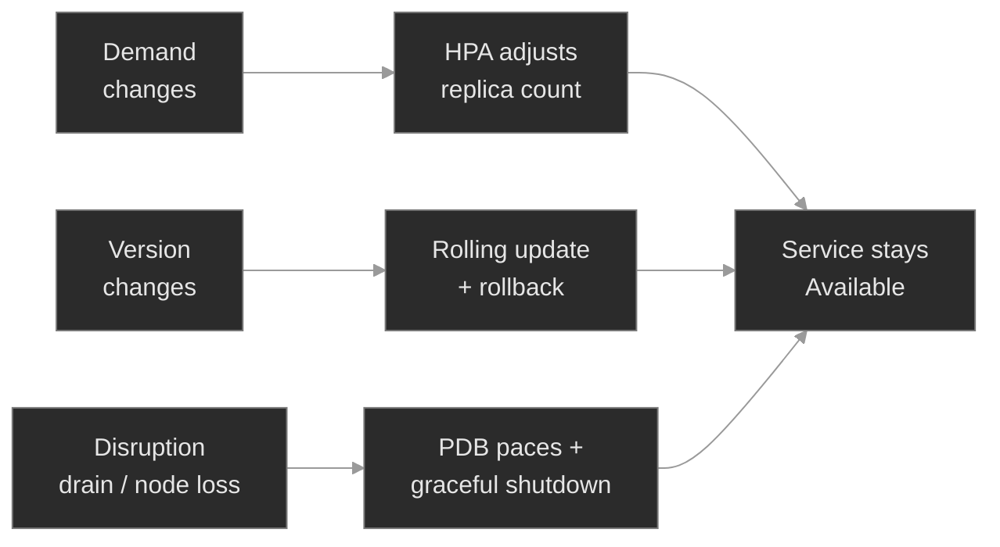

Two facts make this model pay off. First, **each control has a signature failure that is silent until the change it guards actually arrives.** A broken HPA looks fine until the surge; a bad `minAvailable` looks fine until the drain; a stuck rollout looks fine (the old version serves) until you notice the new one never landed. So you read the control's *own* state — `kubectl get hpa`, `kubectl get pdb`, `kubectl rollout status` — rather than waiting for the downstream page.

Second, **these controls compose, and they share their inputs with the scheduler.** A rolling update terminates Pods; a PDB paces how many terminate at once during a drain; graceful shutdown makes each termination lossless. And the **request** you set for the scheduler in M06 is the same number the HPA treats as 100% — so one field, wrong, breaks placement *and* autoscaling. Resilience isn't a separate subsystem bolted on; it's the same primitives (replicas, requests, ReplicaSets, the reconciliation loop) driven by controllers that watch for change.

### Concept walkthrough

#### Autoscaling: matching capacity to demand

The **HorizontalPodAutoscaler** is a control loop, and reading it as one demystifies every failure. About every 15 seconds it reads a metric for the target workload, computes `desiredReplicas = ceil(currentReplicas × currentMetricValue ÷ targetValue)`, and clamps the result between `minReplicas` and `maxReplicas`<sup><a href="https://kubernetes.io/docs/tasks/run-application/horizontal-pod-autoscale/">[1]</a></sup>. Then it sets the Deployment's replica count — which rolls out through the ordinary ReplicaSet machinery. The HPA doesn't create Pods; it moves the same replica dial you'd move by hand.

The subtlety that causes most HPA incidents is what "50% CPU" actually means. The HPA doesn't scale on raw CPU — it scales on **utilization**, defined as usage divided by the container's **request**<sup><a href="https://kubernetes.io/docs/tasks/run-application/horizontal-pod-autoscale/">[1]</a></sup>. The request is the denominator. metrics-server supplies the numerator (live usage, scraped per Pod), the HPA divides, and gets a percentage. Pull out the request and the arithmetic has no denominator: the HPA can't compute utilization, reports the metric as `<unknown>`, sets `ScalingActive=False`, and freezes at the current replica count. This is the single most common reason an HPA silently doesn't scale, and it's entirely on the *target* side — the metrics pipeline can be perfectly healthy. It's the same lesson as M06 from the other direction: the request is load-bearing twice over, once as the scheduler's reservation and once as the autoscaler's yardstick.

The HPA scales replicas, but that's only one of four axes you can autoscale, and confusing them wastes an incident.

<details>
<summary>📖 Going deeper: the four autoscalers and which axis each moves<sup><a href="https://kubernetes.io/docs/concepts/cluster-administration/node-autoscaling/">[7]</a></sup></summary>

Four autoscalers, four different questions — reaching for the wrong one is a common misstep:

- **HPA — "more replicas."** Horizontal: keep a per-Pod metric near target by changing the *count*. The default for stateless request-serving workloads. Needs a request for resource metrics.
- **VPA — "bigger replicas."** Vertical: adjust the *requests and limits* of the Pods from observed usage, right-sizing rather than multiplying<sup><a href="https://github.com/kubernetes/autoscaler/tree/master/vertical-pod-autoscaler">[8]</a></sup>. Historically it recreated Pods to apply a change; recent versions can update some resources in place (leaning on the in-place resize from M06). **Don't run VPA and HPA on the same resource** (both on CPU) — they fight, one growing Pods while the other multiplies them. VPA suits workloads you can't shard: a single big consumer, a stateful process.
- **Cluster Autoscaler / Karpenter — "more nodes."** When Pods are `Pending` for lack of room, these add nodes; when nodes sit underused, they drain and remove them (via the eviction API, so PDBs apply)<sup><a href="https://kubernetes.io/docs/concepts/cluster-administration/node-autoscaling/">[7]</a></sup>. They scale the *cluster*, and pair with the HPA: HPA asks for more Pods, CA provides nodes to put them on.
- **KEDA — "scale on events, including to zero."** HPA's resource metrics can't see a queue backlog or a Kafka lag. KEDA scales on external/event signals and can scale a workload **to zero** when idle, spinning it back up on the first event<sup><a href="https://keda.sh/docs/latest/concepts/">[9]</a></sup>. Under the hood it manages an HPA. The right tool for queue consumers and bursty, event-driven work.

The axes are orthogonal: HPA × count, VPA × size, CA × nodes, KEDA × event-driven count. A real platform often runs HPA + CA together (and KEDA for the event-driven tier); VPA sits alongside for the workloads that can't scale horizontally.

</details>

#### Rolling updates and rollback: changing versions without downtime

When you change a Deployment's Pod template, the default `RollingUpdate` strategy replaces Pods a few at a time, bounded by two knobs: **`maxSurge`** (how many *extra* Pods may exist during the update) and **`maxUnavailable`** (how many may be *down*), both defaulting to 25%<sup><a href="https://kubernetes.io/docs/concepts/workloads/controllers/deployment/">[2]</a></sup>. Mechanically it's a handoff between two ReplicaSets: the Deployment scales up a new ReplicaSet (the new version) while scaling down the old, respecting those bounds at every step, so most of the fleet is always serving. Each such update is a numbered **revision**, and Kubernetes keeps recent ones (`revisionHistoryLimit`) so you can rewind.

The load-bearing behavior for an SRE is what happens when the new version is broken. The rolling update is deliberately *careful*: it will not retire an old Pod until a new one is Ready. So a bad release — an image that won't pull, a container that crashes, a readiness probe that never passes — doesn't take the service down; it **stalls**. The old ReplicaSet keeps serving, the new one sits with unready Pods, and the rollout hangs partway. After `progressDeadlineSeconds` of no progress, the Deployment reports `Progressing=False` with reason `ProgressDeadlineExceeded`<sup><a href="https://kubernetes.io/docs/concepts/workloads/controllers/deployment/">[2]</a></sup> — but that is a *report*, not an action. **Kubernetes does not auto-roll-back.** The rollout stays wedged until a human or a pipeline intervenes.

Recovery is `kubectl rollout undo`, which re-applies the previous revision's template and rolls forward to it — a rollback is just a rolling update aimed at an older revision. `rollout status` is how you know a release landed (it blocks until Ready, then returns success); `rollout history` shows the revisions; `rollout undo --to-revision=N` targets a specific one. The instinct to build: a stuck rollout is diagnosed on the Deployment's conditions and the *new* ReplicaSet's Pods (why aren't they Ready?), and recovered with a rollback while you fix the release out of the hot path. (`Recreate` is the other strategy — kill all old Pods, then start new ones — which trades a downtime gap for a clean cutover; use it only when two versions can't run at once.)

#### Disruption budgets and graceful shutdown: staying up while the platform changes

Nodes don't stay put. They get drained for kernel patches, removed by the Cluster Autoscaler, or simply die. Kubernetes splits these into **voluntary** disruptions (ones you initiate — a drain, an upgrade, a scale-down) and **involuntary** ones (a node crash, a kernel OOM)<sup><a href="https://kubernetes.io/docs/concepts/workloads/pods/disruptions/">[3]</a></sup>. A **PodDisruptionBudget** constrains the *voluntary* kind: it declares how many replicas of a workload must stay available, as `minAvailable` (at least N up) or `maxUnavailable` (at most N down)<sup><a href="https://kubernetes.io/docs/tasks/run-application/configure-pdb/">[4]</a></sup>.

The number that governs everything is **allowed disruptions**: `currentHealthy − desiredHealthy`, floored at 0. With 2 healthy replicas and `minAvailable: 1`, that's `1` — the budget will let one Pod go at a time. The enforcement point is the **eviction API**: `kubectl drain` doesn't delete Pods, it *evicts* them, and the eviction API checks every relevant PDB and refuses an eviction that would breach the budget<sup><a href="https://kubernetes.io/docs/tasks/administer-cluster/safely-drain-node/">[5]</a></sup>. That's what makes a rolling node drain safe: evict one replica, wait for the Deployment to bring a fresh one up elsewhere (restoring the budget), then evict the next. The trap is setting `minAvailable` equal to the replica count (or `maxUnavailable: 0`): allowed disruptions is then permanently `0`, no eviction is ever permitted, and a drain blocks *forever* — a budget that protects nothing because it protects everything.

Where the PDB paces *how many* Pods go down, **graceful shutdown** governs *how* each one goes. When a Pod is terminated, four things happen<sup><a href="https://kubernetes.io/docs/concepts/workloads/pods/pod-lifecycle/">[6]</a></sup>: it's removed from its Service's Endpoints (new traffic stops arriving); its `preStop` hook runs if it has one; the container gets **`SIGTERM`** (a well-behaved app stops taking new work and drains in-flight requests); and if it's still alive when `terminationGracePeriodSeconds` (default 30) elapses, it gets **`SIGKILL`**<sup><a href="https://kubernetes.io/docs/concepts/containers/container-lifecycle-hooks/">[10]</a></sup>. The grace period is the app's budget to finish cleanly; too short, or an app that ignores `SIGTERM`, and in-flight work is cut off mid-request. (M01's `prestop-truncation` is exactly this failure at the hook level.)

These three compose into lossless change: a rolling update terminates Pods a batch at a time, a PDB caps how many terminate at once during a drain, and graceful shutdown drains each terminating Pod. Get all three right and you patch nodes and ship releases without dropping a call. Get one wrong — a too-tight budget, a too-short grace period — and the same operation drops traffic.

<details>
<summary>📖 Going deeper: what a PodDisruptionBudget does and does not protect<sup><a href="https://kubernetes.io/docs/concepts/workloads/pods/disruptions/">[3]</a></sup></summary>

A PDB is narrower than most people assume, and the gaps are where it bites:

- **It guards the eviction API only.** `kubectl drain` and the Cluster Autoscaler's scale-down evict, so they respect it. A plain `kubectl delete pod` does **not** go through eviction — it deletes regardless of budget. So a PDB will not stop a careless `delete`, only a well-behaved drain.
- **It does not touch rolling updates.** A Deployment rollout is bounded by `maxUnavailable`, *not* by the PDB — the two are separate systems. A PDB set for drains won't slow or block a rollout, and a rollout can briefly take more replicas down than the PDB would allow an eviction to. Conflating "PDB" with "how many Pods my rollout takes down" is a classic mistake.
- **It cannot help against involuntary disruption.** A node that crashes takes its Pods with it; there's no eviction to check the budget against. PDBs bound the disruptions you *cause*, not the ones that happen to you — for those you need enough replicas (and spread, M06) to survive the loss.
- **It can starve maintenance.** Because the eviction API strictly honors it, an over-tight PDB (allowed disruptions `0`) turns a routine drain into an indefinite hang. A blocked drain is more often a bad PDB than a bad node.

Rule of thumb: express the budget as `maxUnavailable` when an HPA moves the replica count (a fixed `minAvailable` silently drifts between "block everything" and "protect nothing" as replicas scale), and always leave room for at least one Pod to go.

</details>

### Hands-on

Four steps in the baseline, three break/fix scenarios — all on the full Polyphone fleet on a 2-node cluster (one tainted control-plane, one worker). The baseline tours the healthy machinery; each break/fix breaks exactly one piece of it.

- **`baseline/`** — the healthy controls end to end: a Deployment's rolling-update strategy, revision history, and `rollout undo`; a working HPA reading CPU utilization off metrics-server; a PDB with one disruption's worth of headroom; and the graceful-termination lifecycle. What "resilient" looks like before it breaks.
- **`breakfix-01-pdb-blocks-drain`** — a node drain that hangs: a PDB with `minAvailable` equal to the replica count, so `ALLOWED DISRUPTIONS` is `0` and the eviction API refuses every eviction. Tests reading a PDB's status and the allowed-disruptions math, and demonstrates the refusal against the real eviction API.
- **`breakfix-02-hpa-no-requests`** — an HPA stuck at `<unknown>/50%` that never scales: the target has no CPU request, so there's no denominator for utilization. Tests reading an HPA's `ScalingActive`/`FailedGetResourceMetric` condition and connecting it to the missing request.
- **`breakfix-03-rollout-stuck`** — a rolling update wedged half-done on a bad image: the new ReplicaSet's Pods `ImagePullBackOff`, the old version still serving, `ProgressDeadlineExceeded`. Tests diagnosing a stuck rollout on the Deployment's conditions and the new ReplicaSet, and recovering with `rollout undo`.

Each break/fix breaks one control from the baseline; check yourself against `ANSWER-KEY.md` after each.

### Common failure modes

| Symptom | Likely cause | Where to look |
|---------|--------------|---------------|
| HPA `TARGETS <unknown>/…`, never scales | Target container has no request for the metric's resource (usually CPU) | `kubectl describe hpa` Conditions (`ScalingActive False`, `FailedGetResourceMetric`); the target's `resources.requests` |
| HPA `<unknown>` but requests are set | metrics-server missing/unhealthy, or `kubectl top` also fails | `kubectl top pods`; metrics-server Deployment in `kube-system` |
| HPA scales but wildly over/under | Request far from real usage (wrong denominator), or a too-tight target | compare `requests.cpu` to `kubectl top pod`; the HPA's `averageUtilization` |
| `kubectl drain` hangs; eviction refused | PDB with allowed disruptions `0` (`minAvailable` == replicas, or `maxUnavailable: 0`) | `kubectl get pdb` ALLOWED DISRUPTIONS; the PDB's `minAvailable`/`maxUnavailable` vs. replica count |
| Rollout never finishes; `rollout status` hangs | New ReplicaSet's Pods not Ready (bad image, crash, failing readiness) | `kubectl get rs`; `kubectl describe pod` on the new Pods; Deployment `Progressing`/`ProgressDeadlineExceeded` |
| New version shows partial (`UP-TO-DATE` < replicas) | Stalled rolling update holding the old ReplicaSet up until the new is Ready | `kubectl rollout status`; `kubectl get rs` (old still at count, new not Ready) |
| Dropped connections on every deploy/drain | Grace period too short, or app ignores `SIGTERM` (no clean drain) | Pod `terminationGracePeriodSeconds`; whether the app handles `SIGTERM`/has a `preStop` (M01) |

### Recap

- **Resilience is the response to three kinds of change — demand, version, disruption — each with one control (HPA / rolling update + rollback / PDB + graceful shutdown), and each with a signature failure that is silent until that change arrives.** Read the control's own state, don't wait for the downstream page.
- **An HPA scales on utilization = usage ÷ request.** No request on the target, no denominator, no percentage — it reads `<unknown>` and freezes. The autoscaler family splits by axis: HPA (count), VPA (size), CA/Karpenter (nodes), KEDA (events).
- **A rolling update fails safe: a bad release stalls, it doesn't crash the service.** The old ReplicaSet serves until the new is Ready; `ProgressDeadlineExceeded` flags the stall but Kubernetes never auto-rolls-back. `rollout undo` is the recovery.
- **A PDB paces voluntary disruption via the eviction API; allowed disruptions = currentHealthy − desiredHealthy.** Set `minAvailable` at the replica count and it's `0` — the budget blocks maintenance instead of protecting the service. It does nothing for rollouts or involuntary loss.
- **Graceful shutdown makes each termination lossless — endpoints out, `preStop`, `SIGTERM`, grace, `SIGKILL`.** Rolling updates, PDBs, and graceful shutdown compose; one misconfigured piece turns routine change into dropped traffic.

### Production thinking

- A team fronts a bursty queue-consumer with a CPU-based HPA "to be safe," and it never scales during backlogs because CPU stays flat while the queue grows. What signal should actually drive that autoscaler, which tool provides it, and what does scaling that workload *to zero* between bursts buy you — and cost you?
- You set `minAvailable: 3` on a 3-replica service so it "never loses capacity." Months later a node needs an urgent security patch and the drain won't budge. Explain exactly why, what you'd change the budget to, and how expressing it as `maxUnavailable` would have behaved differently once an HPA started moving the replica count.
- A release goes out, the rollout wedges on a failing readiness probe, and the service stays perfectly healthy on the old version — but no alert fires and the bad deploy sits half-rolled for hours. What should have alerted (and on what signal), and what belongs in the pipeline so a rollout that exceeds its progress deadline rolls back on its own instead of waiting for a human?

### References

1. Kubernetes — Horizontal Pod Autoscaling: https://kubernetes.io/docs/tasks/run-application/horizontal-pod-autoscale/
2. Kubernetes — Deployments (rolling update, rollback, progress deadline): https://kubernetes.io/docs/concepts/workloads/controllers/deployment/
3. Kubernetes — Disruptions (voluntary/involuntary, PDB concepts): https://kubernetes.io/docs/concepts/workloads/pods/disruptions/
4. Kubernetes — Specifying a Disruption Budget for your Application: https://kubernetes.io/docs/tasks/run-application/configure-pdb/
5. Kubernetes — Safely Drain a Node: https://kubernetes.io/docs/tasks/administer-cluster/safely-drain-node/
6. Kubernetes — Pod Lifecycle (Pod termination): https://kubernetes.io/docs/concepts/workloads/pods/pod-lifecycle/
7. Kubernetes — Node Autoscaling (Cluster Autoscaler / Karpenter): https://kubernetes.io/docs/concepts/cluster-administration/node-autoscaling/
8. Kubernetes Autoscaler — Vertical Pod Autoscaler: https://github.com/kubernetes/autoscaler/tree/master/vertical-pod-autoscaler
9. KEDA — Concepts: https://keda.sh/docs/latest/concepts/
10. Kubernetes — Container Lifecycle Hooks (preStop): https://kubernetes.io/docs/concepts/containers/container-lifecycle-hooks/


---

## Break/Fix Practice

## Break/fix 01 — PDB Blocks Drain

**Symptom — what you'd actually see:**

A `kubectl drain` of the worker for a kernel patch hangs — the eviction it attempts comes back `TooManyRequests: Cannot evict pod as it would violate the pod's disruption budget`. `sip-registrar` in `signaling` is healthy the whole time (`2/2` Running); nothing is crashing or `Pending`.

**Think about this before you open the answer:**

Recognizing that a blocked drain is a budget problem, and the allowed-disruptions math. Self-grading:

- Did you read the *PDB's* status (`ALLOWED DISRUPTIONS 0`) rather than hunting for an unhealthy Pod (there isn't one)?
- Did you connect `minAvailable == replicas` to `allowedDisruptions = 0`, and understand *why* that blocks every eviction?
- Did you fix it by lowering the floor (or moving to `maxUnavailable`), not by deleting the PDB outright (which removes the protection entirely)?

<details>
<summary><b>Click to reveal: diagnostic commands, root cause, exact fix, verify</b></summary>

**Root cause:**

`sip-registrar`'s PodDisruptionBudget has `minAvailable: 2` — equal to the Deployment's replica count. Allowed disruptions is `currentHealthy − desiredHealthy = 2 − 2 = 0`, so the eviction API permits no voluntary eviction at all<sup><a href="https://kubernetes.io/docs/concepts/workloads/pods/disruptions/">[3]</a></sup>. A drain is a series of evictions, so it blocks indefinitely. The budget meant to protect the service instead protects it into un-maintainability.

**Diagnostic commands (run in this order):**

```bash
# 1. The budget, not the workload — read allowed disruptions
kubectl get pdb -n signaling                       # sip-registrar: ALLOWED DISRUPTIONS 0

# 2. See the refusal against the real eviction API (safe: one Pod, recreated)
POD=$(kubectl get pod -n signaling -l app=sip-registrar -o jsonpath='{.items[0].metadata.name}')
cat <<EOF > /tmp/evict.json
{"apiVersion":"policy/v1","kind":"Eviction","metadata":{"name":"$POD","namespace":"signaling"}}
EOF
kubectl create --raw "/api/v1/namespaces/signaling/pods/$POD/eviction" -f /tmp/evict.json
#    Error ... TooManyRequests ... Cannot evict pod ... disruption budget

# 3. The math and the offending field
kubectl describe pdb sip-registrar -n signaling    # Current Healthy 2, Desired Healthy 2, Allowed Disruptions 0
kubectl get pdb sip-registrar -n signaling -o jsonpath='{.spec.minAvailable}'; echo   # 2 (== replicas)
```

**Exact fix:**

Give the budget headroom — `minAvailable` below the replica count:

```bash
kubectl patch pdb sip-registrar -n signaling --type merge -p '{"spec":{"minAvailable":1}}'
# or switch to maxUnavailable: 1 (better when an HPA moves the replica count)
```

**Verify:**

```bash
kubectl get pdb sip-registrar -n signaling         # ALLOWED DISRUPTIONS 1
# the eviction from step 2, re-run, now succeeds and the Deployment restores 2/2
```

**Production thinking:**

A blocked drain is more often a bad PDB than a bad node — `kubectl get pdb -A` with `ALLOWED DISRUPTIONS 0` is the fast check when maintenance stalls. Express budgets as `maxUnavailable` for HPA-driven workloads (a fixed `minAvailable` drifts between "block everything" and "protect nothing" as replicas scale), never set the floor at the replica count, and alert on drains that exceed a timeout. Remember the limits: a PDB constrains only *voluntary* disruption — it does nothing for a node crash, and a plain `kubectl delete pod` bypasses it entirely<sup><a href="https://kubernetes.io/docs/tasks/administer-cluster/safely-drain-node/">[5]</a></sup>. The Cluster Autoscaler's scale-down also removes nodes through the eviction API, so a sane PDB protects a service from being drained off a node the autoscaler decides to reclaim<sup><a href="https://kubernetes.io/docs/concepts/cluster-administration/node-autoscaling/">[7]</a></sup>.

</details>

---

## Break/fix 02 — HPA Can't Read Its Metric

**Symptom — what you'd actually see:**

`transcode-scaler` in `media` has an HPA, but `kubectl get hpa` shows `TARGETS <unknown>/50%` and it never scales off `1` replica regardless of load. metrics-server is healthy — `kubectl top pods -n media` returns live CPU for the Pod.

**Think about this before you open the answer:**

Reading an HPA's condition to find *why* it's dead, and the request-is-the-denominator rule. Self-grading:

- Did you treat `<unknown>` as "can't read the metric," and go to `describe hpa` Conditions rather than assuming a metrics outage?
- Did you connect `FailedGetResourceMetric` / `missing request for cpu` to the target's missing request, not to metrics-server?
- Did you fix the **request** (the denominator), and understand why the container's memory *limit* was irrelevant to a CPU-utilization HPA?

<details>
<summary><b>Click to reveal: diagnostic commands, root cause, exact fix, verify</b></summary>

**Root cause:**

The HPA targets CPU *utilization*, which it computes as `usage ÷ request`, but `transcode-scaler`'s container declares no CPU request. With no denominator the utilization is undefined, so the HPA can't get the metric: `ScalingActive False`, reason `FailedGetResourceMetric`, message `missing request for cpu`<sup><a href="https://kubernetes.io/docs/tasks/run-application/horizontal-pod-autoscale/">[1]</a></sup>. The metrics pipeline is fine; the gap is on the target.

**Diagnostic commands (run in this order):**

```bash
# 1. The unknown target — the metric can't be read, it isn't "0% load"
kubectl get hpa -n media                           # transcode-scaler: <unknown>/50%, REPLICAS 1

# 2. The HPA states the reason in its conditions
kubectl describe hpa transcode-scaler -n media     # ScalingActive False, FailedGetResourceMetric, "missing request for cpu"

# 3. Confirm the target has no CPU request; contrast with the working one
kubectl get deployment transcode-scaler -n media -o jsonpath='{.spec.template.spec.containers[0].resources}'; echo   # {"limits":{"memory":"128Mi"}}
kubectl get deployment sip-router -n signaling -o jsonpath='{.spec.template.spec.containers[0].resources.requests}'; echo   # cpu: 25m (has a denominator)
```

**Exact fix:**

Add a CPU request to the target:

```bash
kubectl set resources deployment/transcode-scaler -n media --requests=cpu=100m
# or: kubectl edit deployment transcode-scaler -n media  → add resources.requests.cpu
```

**Verify:**

```bash
# give metrics-server ~15-30s for a sample of the new Pod
kubectl get hpa transcode-scaler -n media          # TARGETS now a real %, e.g. 1%/50%
kubectl describe hpa transcode-scaler -n media | grep -A5 Conditions   # ScalingActive True
```

**Production thinking:**

No request is the top reason an HPA reads `<unknown>`. Enforce requests on autoscaled workloads with a `LimitRange` or admission policy (M20) so a Deployment can't ship without one. Size the request honestly: the target percentage is relative to it, so a too-small request makes the workload look busy (over-scale) and a too-large one hides load (under-scale) — the same M06 request now doing double duty as the autoscaler's 100% mark. If you can't size it by hand, VPA recommends requests from observed usage<sup><a href="https://github.com/kubernetes/autoscaler/tree/master/vertical-pod-autoscaler">[8]</a></sup> (but don't run it *and* an HPA on the same resource — they fight). And pick the right metric: a CPU HPA can't see a queue backlog, which is what KEDA is for<sup><a href="https://keda.sh/docs/latest/concepts/">[9]</a></sup>.

</details>

---

## Break/fix 03 — Stuck Rollout

**Symptom — what you'd actually see:**

A `portal-web` release in `admin-portal` has been rolling out for minutes and `kubectl rollout status` never returns. The service is up (users unaffected), but `kubectl get deployment` shows `READY 2/2`, `AVAILABLE 2`, `UP-TO-DATE 1` — only one Pod is the new version.

**Think about this before you open the answer:**

Diagnosing a stuck rollout on the Deployment's own state, and knowing rollback is the fast recovery. Self-grading:

- Did the "service is fine but the rollout won't finish" split point you at the *new* ReplicaSet's Pods rather than at the running old ones?
- Did you read `ProgressDeadlineExceeded` and the bad image, instead of restarting Pods or scaling in the hope it clears?
- Did you recover with `rollout undo` (or a corrected roll-forward), and note that Kubernetes never rolled back on its own?

<details>
<summary><b>Click to reveal: diagnostic commands, root cause, exact fix, verify</b></summary>

**Root cause:**

Revision 2 set the image to `nginx:1.25-doesnotexist`, a tag not in the registry. The new ReplicaSet's Pod can't pull it (`ImagePullBackOff`); because the default `maxUnavailable` rounds down to `0` for 2 replicas, the Deployment won't retire an old Pod until the new one is Ready — which never happens — so the rollout stalls with the old version still serving<sup><a href="https://kubernetes.io/docs/concepts/workloads/controllers/deployment/">[2]</a></sup>. After `progressDeadlineSeconds` (60), `Progressing=False, ProgressDeadlineExceeded`. Kubernetes reports the stall but does not auto-roll-back.

**Diagnostic commands (run in this order):**

```bash
# 1. Rollout not done — new version partial, old still serving
kubectl get deployment portal-web -n admin-portal            # READY 2/2, UP-TO-DATE 1
kubectl rollout status deployment/portal-web -n admin-portal --timeout=10s
#    Waiting ... 1 out of 2 new replicas have been updated

# 2. The broken new ReplicaSet
kubectl get rs -n admin-portal -l app=portal-web             # new RS 0 ready
kubectl get pods -n admin-portal -l app=portal-web           # one ImagePullBackOff

# 3. Why it's stuck, and the offending image
kubectl describe deployment portal-web -n admin-portal | grep -A8 Conditions   # Progressing False, ProgressDeadlineExceeded
kubectl get deployment portal-web -n admin-portal -o jsonpath='{.spec.template.spec.containers[0].image}'; echo   # nginx:1.25-doesnotexist
kubectl rollout history deployment/portal-web -n admin-portal   # rev1 good, rev2 bad
```

**Exact fix:**

Roll back to the last good revision:

```bash
kubectl rollout undo deployment/portal-web -n admin-portal
kubectl rollout status deployment/portal-web -n admin-portal   # successfully rolled out
# roll-forward alternative: kubectl set image deployment/portal-web app=nginx:1.25 -n admin-portal
```

**Verify:**

```bash
kubectl get deployment portal-web -n admin-portal            # READY 2/2, UP-TO-DATE 2, AVAILABLE 2
kubectl get deployment portal-web -n admin-portal -o jsonpath='{.spec.template.spec.containers[0].image}'; echo   # nginx:1.25
```

**Production thinking:**

The rolling update failing *safe* — stalling, not crashing — is the feature that saved you here, but it also means a bad deploy can sit half-rolled and silent. Alert on `Progressing=False`/`ProgressDeadlineExceeded`, not just on error rate (the old version masks it). The durable prevention is upstream: a readiness probe so a bad Pod is never counted Ready, a canary or progressive rollout, and a pipeline that verifies the image exists (M02) and rolls back automatically on a deadline breach. Rollback is the emergency lever; roll-forward with a fixed image is right when the fix is trivial and you'd rather not lose the revision's other changes.

</details>

---


---

# `m10-security-rbac/`

## Concept

## M10 — Security I: RBAC & Pod Security

> The two questions every request to the API server must pass — *who are you* and *what may you do* — plus the admission gate that decides whether a Pod's security posture is allowed at all, and the handful of ways each one returns `Forbidden`.

### What you'll learn

- Trace a request through the API server's three gates — **authentication** (who), **authorization** (may they), **admission** (is this object allowed) — and tell which gate a `Forbidden` came from
- Read RBAC: a **Role**/**ClusterRole** as a set of rules (`apiGroups` × `resources` × `verbs`), a **RoleBinding**/**ClusterRoleBinding** tying a subject to a role, and the additive/deny-by-default evaluation
- Use `kubectl auth can-i` (with `--as` and `--list`) to reproduce and prove any authorization decision instead of guessing
- Understand a **ServiceAccount** as a Pod's API identity — `system:serviceaccount:<ns>:<name>`, the auto-projected short-lived token — and why the `default` SA is bound to nothing
- Set a container's **securityContext** (`runAsNonRoot`, `allowPrivilegeEscalation`, dropped capabilities, seccomp) and know which fields the `restricted` standard requires
- Enforce the **Pod Security Standards** with PodSecurity admission's namespace labels (`enforce`/`audit`/`warn`), and recognize an admission rejection — a Deployment with zero Pods and no `Pending` Pod
- Work the **`Forbidden` differential**: the same 403 from a missing verb vs. the wrong identity vs. the wrong scope — one phrase in the message tells them apart

### Why it matters

Security failures don't crash — they deny. A Pod that can't reach the API doesn't OOM or sit `Pending`; its app logs one line — `Forbidden` — and stalls, and every reflex from the workload modules (`logs`, `--previous`, restart) returns nothing useful. The signal is a single string from the API server that names the identity, the verb, the resource, and the scope. Read it and the fix is obvious; skim past it and you'll spend an hour editing an app that was never wrong.

At Polyphone the surface is everywhere. A discovery sidecar needs to `list endpoints` and someone granted it `get`. A workload ships without a ServiceAccount, so it authenticates as `default` — bound to nothing — and every API call is denied. A new component wants to read node labels and the RoleBinding that "grants" it silently does nothing, because nodes are cluster-scoped and a namespaced binding can't reach them. The security team enforces the `restricted` standard on a namespace and the next Deployment there creates zero Pods with no error on any Pod, because no Pod was ever admitted. Each is one field, in one of three gates. This module is about reading which gate said no, and why.

### Scope

**Covers:** the API request pipeline (authentication → authorization → admission) and where each says no; **RBAC** — Roles and ClusterRoles, RoleBindings and ClusterRoleBindings, the rule triple (`apiGroups`/`resources`/`verbs`), namespaced vs. cluster scope, additive/deny-by-default evaluation, and `kubectl auth can-i`; **ServiceAccounts** as Pod identity, the projected bound token, the `default` SA; **securityContext** at Pod and container level; the **Pod Security Standards** (privileged/baseline/restricted) and **PodSecurity admission** (the `enforce`/`audit`/`warn` namespace labels); and the `Forbidden` differential that ties RBAC and admission together.

**Doesn't cover:** user/group authentication mechanisms — client certs, OIDC, the fact that Kubernetes has no first-class User object — named where they intersect but the identity providers themselves are out; secrets management at scale (External Secrets, Vault, sealed-secrets) → M11; PKI, cert-manager, and mTLS between workloads → M12; NetworkPolicy and traffic isolation → M14; policy-as-code admission webhooks (Kyverno, OPA Gatekeeper) that go beyond built-in PodSecurity → M20–M21; the audit log that records every authorization decision → M13; image provenance (scanning, signing), covered in M02.

**Assumes:** M00 (`get → describe → events → logs`, and that a resource's story lives between `spec` and `status`), M01 (Pods, Deployments, ReplicaSets — a *controller*, not you, creates the Pods, which matters for how an admission rejection surfaces), M03 (a ServiceAccount token is mounted into a Pod the same way the projected Secret volumes there already are), and a working idea of an HTTP request carrying an `Authorization` header — because every `kubectl` command is exactly that.

### Vocabulary

| Term | Definition |
|------|------------|
| **authentication (authn)** | The API server deciding *who* is calling, from a token or client cert. The result is a username (or `system:serviceaccount:<ns>:<name>`) plus groups. Kubernetes stores no User objects; ServiceAccounts are the only first-class identities. |
| **authorization (authz)** | Deciding whether that identity may perform this **verb** on this **resource**. RBAC is the authorizer here. Deny-by-default: if no rule allows, the answer is no. |
| **admission** | The stage *after* authz (writes only) where admission controllers inspect the object and may reject or mutate it. PodSecurity is a built-in admission controller. |
| **RBAC** | Role-Based Access Control. Permissions are grouped into Roles; Roles are granted to subjects by Bindings. |
| **Role / ClusterRole** | A named set of **rules**. A **Role** is namespaced (rules apply in one namespace); a **ClusterRole** is cluster-scoped — usable in any namespace, and the only kind that can grant cluster-scoped resources. |
| **rule** | One line of a Role: `apiGroups` × `resources` × `verbs`, ANDed. A request is allowed if any rule matches all three. RBAC never denies explicitly; it only fails to allow. |
| **RoleBinding / ClusterRoleBinding** | Ties a **subject** to a Role/ClusterRole. A **RoleBinding** grants within its namespace; a **ClusterRoleBinding** grants cluster-wide. |
| **subject** | Who a binding grants to. For a Pod: `kind: ServiceAccount` with a `name` and `namespace`. |
| **verb** | The action: `get`, `list`, `watch`, `create`, `update`, `patch`, `delete`. Reading one named object is `get`; reading a collection is `list`. |
| **ServiceAccount (SA)** | A namespaced identity for processes in Pods. Every Pod runs as exactly one SA (`default` if unset) and authenticates as `system:serviceaccount:<ns>:<name>`. |
| **bound service account token** | The short-lived, audience- and Pod-bound JWT the kubelet projects into every Pod at `/var/run/secrets/kubernetes.io/serviceaccount/token`. Auto-rotated; invalid once the Pod is gone. Replaced the old permanent Secret-based tokens. |
| **securityContext** | Pod- and container-level fields setting the process's security posture: `runAsNonRoot`, `runAsUser`, `allowPrivilegeEscalation`, `capabilities`, `seccompProfile`, `readOnlyRootFilesystem`. |
| **Pod Security Standards** | Three named policies: **Privileged** (unrestricted), **Baseline** (blocks known escalations), **Restricted** (hardened best practice). |
| **PodSecurity admission** | The built-in controller that enforces a Standard per namespace via labels `pod-security.kubernetes.io/<mode>: <level>`, where mode is `enforce` (reject), `audit` (log), or `warn` (warn). |
| **capability** | A slice of root's power (e.g. `NET_BIND_SERVICE`). Dropping `ALL` and adding back only what's needed is the hardening default. |

### Mental model

Every `kubectl` command — and every API call your Pods make — is an HTTP request to the API server, and the server runs it through three gates, in order<sup><a href="https://kubernetes.io/docs/concepts/security/controlling-access/">[9]</a></sup>:

1. **Authentication** — *who are you?* The server validates your credential (a token, a client cert) and resolves it to a username and groups. A Pod's credential is its projected ServiceAccount token, which resolves to `system:serviceaccount:<ns>:<name>`.
2. **Authorization** — *may you do this?* With RBAC, the server looks for a rule — reachable from your identity through some binding — that allows this verb on this resource in this scope. There is no explicit deny; if nothing allows, you get `403 Forbidden`<sup><a href="https://kubernetes.io/docs/reference/access-authn-authz/rbac/">[1]</a></sup>.
3. **Admission** — *is this object allowed?* Writes only. Admission controllers see the object and can reject or modify it. PodSecurity checks a Pod's `securityContext` against the namespace's Standard<sup><a href="https://kubernetes.io/docs/concepts/security/pod-security-admission/">[6]</a></sup>.

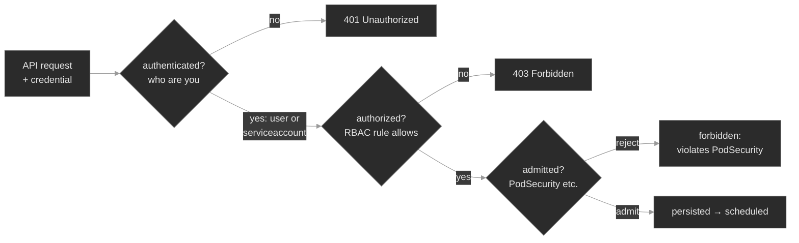

The payoff is that a `Forbidden` names exactly which gate and why. An **authorization** Forbidden reads: `<resource> is forbidden: User "<identity>" cannot <verb> resource "<resource>" in API group "<group>" in the namespace "<ns>"` (or, for a cluster-scoped resource, `at the cluster scope`). Every field in that sentence is a place the fix could live: the **identity** (are you who you meant to be?), the **verb** and **resource** (does a rule cover them?), and the **scope** (namespace vs. cluster — did you use the right kind of binding?). An **admission** Forbidden reads differently — `pods "<name>" is forbidden: violates PodSecurity "restricted:latest": <fields>` — and it lands not on your command but on the ReplicaSet that tried to create the Pod, because the *controller*, not you, is the caller the server refused.

Two facts make RBAC quick to reason about. First, it is **purely additive and deny-by-default**: you can only grant, never deny, and a subject's permissions are the union of every binding that reaches it — so "why can't it?" is always "no rule allows it," never "something blocked it"<sup><a href="https://kubernetes.io/docs/reference/access-authn-authz/rbac/">[1]</a></sup>. Second, RBAC matches **strings**, not intent: `endpoints` and `endpoint`, `get` and `list`, apiGroup `""` and `"apps"` are different keys, and a near-miss is a silent denial. The fix is never to argue with the error; it is to make some rule, reachable from the right subject, match all three strings in the right scope.

### Concept walkthrough

#### RBAC: rules, bindings, and the two scopes

RBAC has exactly two kinds of object, each in a namespaced and a cluster-scoped form. A **Role** (or **ClusterRole**) is a bag of rules; a **RoleBinding** (or **ClusterRoleBinding**) grants a role to subjects. A rule is three lists ANDed together<sup><a href="https://kubernetes.io/docs/reference/access-authn-authz/rbac/">[1]</a></sup>:

```yaml
rules:
- apiGroups: [""]            # "" is the core group (pods, services, endpoints, secrets…)
  resources: ["endpoints"]
  verbs: ["get", "list", "watch"]
```

A request is authorized if some rule reachable from the caller matches its apiGroup, its resource, *and* its verb. Miss any one — ask to `list` when the rule only grants `get`, name `endpoints` when the rule says `services` — and no rule matches, so it's denied. There is no `deny` rule to look for; the *absence* of an allow is the denial.

The scope distinction is the part that bites. Roles and RoleBindings are **namespaced**: a RoleBinding grants its role's rules only within its own namespace, and a Role can only usefully grant namespaced resources. ClusterRoles and ClusterRoleBindings are **cluster-scoped**: a ClusterRoleBinding grants across every namespace, and — the load-bearing fact — a **cluster-scoped resource (`nodes`, `namespaces`, `persistentvolumes`) can only be granted by a ClusterRole through a ClusterRoleBinding**<sup><a href="https://kubernetes.io/docs/reference/access-authn-authz/rbac/">[1]</a></sup>. Put `nodes` in a namespaced Role, bind it with a RoleBinding, and RBAC accepts the YAML without complaint — but the grant does nothing: nodes live outside every namespace, so a namespaced binding can never reach them. The request is denied `at the cluster scope`, and that word — *scope* — is the whole tell.

One useful combination: a RoleBinding may reference a *ClusterRole*, which grants that ClusterRole's rules *only within the RoleBinding's namespace* — the standard way to reuse a built-in ClusterRole like `view` per namespace without copying its rules.

You don't have to reason about any of this in your head. `kubectl auth can-i` asks the API server the exact question the authorizer answers<sup><a href="https://kubernetes.io/docs/reference/access-authn-authz/authorization/">[2]</a></sup>:

```bash
kubectl auth can-i list endpoints -n media \
  --as=system:serviceaccount:media:endpoint-watcher            # yes / no
kubectl auth can-i --list \
  --as=system:serviceaccount:media:endpoint-watcher -n media   # everything that SA can do
```

`--as` impersonates any identity (you need impersonation rights, which cluster-admin has); `--list` dumps the full matrix. This is the first move on any Forbidden: reproduce it as a yes/no, then widen with `--list` to see what the subject actually holds.

<details>
<summary>📖 Going deeper: the built-in ClusterRoles, and why you rarely write rules from scratch<sup><a href="https://kubernetes.io/docs/reference/access-authn-authz/rbac/">[1]</a></sup></summary>

Kubernetes ships default ClusterRoles you should reach for before hand-writing rules. The four user-facing ones are namespace-grantable via a RoleBinding that references them:

- **view** — read-only on most namespaced resources, *excluding* Secrets (reading Secrets is a privilege escalation — a viewer who could read Secrets could read every ServiceAccount token in the namespace).
- **edit** — read/write on most namespaced resources; still no RBAC editing, and no Secret read by default.
- **admin** — everything `edit` has, plus managing Roles and RoleBindings *within* the namespace.
- **cluster-admin** — everything, everywhere. The built-in `system:masters` group maps here and bypasses RBAC entirely, which is why a leaked cluster-admin kubeconfig is game over.

Grant `view` in one namespace with `kubectl create rolebinding … --clusterrole=view --serviceaccount=ns:sa`. Prefer these to bespoke Roles: they track new resource types as the API grows, and they encode escalation boundaries (like the Secret exclusion) that are easy to get wrong by hand. Write a custom Role only when you need something *narrower* than `view` — a controller that lists exactly one resource, say.

</details>

#### ServiceAccounts: a Pod's identity

Authorization needs an identity, and for a Pod that identity is a **ServiceAccount**. Every Pod runs as exactly one SA — the one named in `spec.serviceAccountName`, or `default` if you don't set one — and the kubelet projects a token for that SA into the container at `/var/run/secrets/kubernetes.io/serviceaccount/`<sup><a href="https://kubernetes.io/docs/tasks/configure-pod-container/configure-service-account/">[3]</a></sup>. When the process calls the API with that token, the server authenticates it as `system:serviceaccount:<namespace>:<name>`. That string is the subject your RoleBindings must name — and the identity a Forbidden error quotes back at you.

The `default` SA is the trap. Kubernetes auto-creates a `default` ServiceAccount in every namespace, and it is **bound to nothing** — it can talk to the API server (authenticate) but is authorized for almost nothing<sup><a href="https://kubernetes.io/docs/concepts/security/service-accounts/">[4]</a></sup>. A Pod rolled out without `serviceAccountName` runs as `default`, so a workload that needs API access and whose author forgot the one line gets a `Forbidden` naming `…:default` — even when the Role and RoleBinding they carefully wrote are sitting right there, correct, granting the *intended* SA the Pod never adopted. The difference between "the permission is wrong" and "the caller isn't who you think" is one word in the error: the subject.

The token itself changed in a way worth knowing<sup><a href="https://kubernetes.io/docs/concepts/security/service-accounts/">[4]</a></sup>. Modern clusters project a **bound service account token**: a short-lived JWT, scoped to a specific audience and Pod, auto-rotated by the kubelet, and invalid the moment the Pod is gone. This replaced the old model where every SA got a permanent, non-expiring token stored in a Secret — a token that, if exfiltrated, worked forever. You no longer get an automatic Secret per SA; ask for a token explicitly with `kubectl create token <sa>` when you need one out-of-band. If a workload never calls the API, set `automountServiceAccountToken: false` and it gets no token to leak.

#### securityContext and the Pod Security Standards

Authorization governs what a Pod's *process* may ask the API. The last gate governs what the Pod itself may *be*. A container, by default, can run as root, escalate privileges, and hold a broad set of Linux capabilities — fine on a laptop, a liability in a multi-tenant cluster where a container escape becomes a node compromise. The **securityContext** is where you tighten that, at the Pod level (applies to all containers) or per container<sup><a href="https://kubernetes.io/docs/tasks/configure-pod-container/security-context/">[8]</a></sup>:

- `runAsNonRoot: true` — the kubelet refuses to start the container if its image would run as UID 0.
- `runAsUser: 1000` — pin the UID (needed alongside `runAsNonRoot` when the image defaults to root).
- `allowPrivilegeEscalation: false` — no child process can gain more privileges than its parent (blocks setuid escalation).
- `capabilities: { drop: ["ALL"] }` — start from zero Linux capabilities and add back only what's needed.
- `seccompProfile: { type: RuntimeDefault }` — apply the container runtime's default syscall filter.

Setting these on every workload by hand is error-prone, so Kubernetes standardizes them into three **Pod Security Standards** and enforces them per namespace<sup><a href="https://kubernetes.io/docs/concepts/security/pod-security-standards/">[5]</a></sup>:

- **Privileged** — unrestricted. The default when a namespace carries no label.
- **Baseline** — blocks the known-dangerous: no privileged containers, no host namespaces, no `hostPath`. Minimal friction.
- **Restricted** — the hardened profile: everything Baseline blocks, *plus* `runAsNonRoot`, `allowPrivilegeEscalation: false`, `capabilities: drop [ALL]`, and a `seccompProfile`. Exactly the fields listed above.

**PodSecurity admission** turns a Standard on for a namespace with a label, `pod-security.kubernetes.io/<mode>: <level>`, in three independent modes<sup><a href="https://kubernetes.io/docs/tasks/configure-pod-security-admission/enforce-standards-namespace-labels/">[7]</a></sup>:

```bash
kubectl label ns payments \
  pod-security.kubernetes.io/enforce=restricted \
  pod-security.kubernetes.io/warn=restricted
```

`enforce` **rejects** a non-compliant Pod at admission; `audit` records it in the audit log; `warn` returns a warning to the client but admits it. Because the three are independent, the safe rollout pattern is `warn`/`audit` first (learn what would break), then `enforce`.

The failure mode is specific and easy to misread. Because enforce runs at **admission**, a rejection lands on the object that *tries to create* the Pod — for a Deployment, that's the ReplicaSet — not on a Pod, because no Pod is ever created. So a Deployment in an enforced namespace can sit at `0/3` ready with **no Pods at all**, not even `Pending` ones, and the reason is an event on the ReplicaSet: `Error creating: … violates PodSecurity "restricted:latest": …`. `kubectl get pods` shows nothing to describe; you look at the controller or the namespace events. (This mirrors what M06 taught about `NoSchedule`: enforce gates *creation* — Pods already admitted before the label went on keep running.)

### Hands-on

Four steps in the baseline, four break/fix scenarios — all on the full Polyphone fleet on a 2-node cluster. The baseline reads the healthy security posture; each break/fix breaks exactly one gate so you practice reading a single denial at a time.

- **`baseline/`** — who the fleet's Pods are (their ServiceAccounts and projected tokens), what they may do (RBAC roles, bindings, and `kubectl auth can-i`), the `securityContext` they carry, and which namespaces enforce a Pod Security Standard. Healthy security, so a denial stands out later.
- **`breakfix-01-rbac-missing-verb`** — a reader Pod in `CrashLoopBackOff`, its logs a `403 Forbidden`: its Role grants `get`/`watch` on endpoints but the app does a `list`. Tests parsing the Forbidden and reading a Role's rules.
- **`breakfix-02-serviceaccount-default`** — the same 403, but the message names `…:default`: the Pod omits `serviceAccountName`, so the correctly-bound SA is never adopted. Tests reading *which identity* the error names, and fixing the Pod, not the RBAC.
- **`breakfix-03-rbac-cluster-scope`** — a 403 that ends `at the cluster scope`: a namespaced Role/RoleBinding trying to grant `nodes`, which only a ClusterRole can. Tests the scope distinction.
- **`breakfix-04-podsecurity-restricted`** — a Deployment stuck `0/1` with no Pods at all: a workload with no `securityContext` in a namespace that enforces `restricted`. Tests recognizing an admission rejection and writing a compliant `securityContext`.

The first three walk the `Forbidden` differential — one phrase in the message each — and the fourth flips to the admission gate. Check yourself against `ANSWER-KEY.md` after each.

### Common failure modes

| Symptom | Likely cause | Where to look |
|---------|--------------|---------------|
| App logs `Forbidden … cannot list … in the namespace` | An RBAC rule doesn't cover the verb/resource for this SA | `kubectl auth can-i --list --as=system:serviceaccount:ns:sa -n ns`; the Role's `rules` |
| `Forbidden` names `…:default` | Pod runs as the `default` SA (no `serviceAccountName`) | the Pod's `.spec.serviceAccountName`; the RoleBinding's subject |
| `Forbidden … at the cluster scope` | A cluster-scoped resource granted via a namespaced Role/RoleBinding | is it a Role or ClusterRole; `kubectl api-resources --namespaced=false` to confirm the resource is cluster-scoped |
| Deployment `0/N`, no Pods, no `Pending` Pod | PodSecurity `enforce` rejected the Pod at admission | `kubectl get events -n ns`; `kubectl describe rs`; the namespace's `pod-security…/enforce` label |
| Container won't start: `has runAsNonRoot and image will run as root` | `runAsNonRoot: true` but no non-root `runAsUser` and a root image | the `securityContext.runAsUser`; the image's default user |
| `auth can-i` says yes but the app still gets 403 | The Pod isn't using the SA you tested, or its token isn't mounted | the Pod's *actual* SA; `automountServiceAccountToken` |
| Everything denied for an SA that "has admin" | Binding subject name/namespace typo, or RoleBinding vs. ClusterRoleBinding mismatch | `kubectl describe rolebinding/clusterrolebinding`; the subject `kind`/`name`/`namespace` |

### Recap

- **Every API request passes three gates in order** — authentication (who), authorization (may they), admission (is the object allowed) — and a `Forbidden` names which gate and why. Read the gate before you touch the app.
- **RBAC is additive, deny-by-default, and matches strings.** A request is allowed only if some rule, reachable from the caller's identity through a binding, matches its apiGroup, resource, *and* verb. A near-miss (`get` vs. `list`, singular vs. plural) is a silent denial — there is nothing to "unblock," only a rule to make match.
- **A Pod's identity is its ServiceAccount**; unset means `default`, which is bound to nothing. The subject named in a Forbidden tells you whether the permission is wrong or the caller isn't who you meant — one is an RBAC fix, the other a one-line Pod fix.
- **Scope is a hard boundary.** Cluster-scoped resources (nodes, PVs, namespaces) can only be granted by a ClusterRole through a ClusterRoleBinding. A namespaced binding for them parses fine and grants nothing — the error ends `at the cluster scope`.
- **PodSecurity admission enforces the Standards per namespace by label.** `enforce` rejects at *creation*, so a rejected Deployment has zero Pods and the reason lives on the ReplicaSet, not on any Pod. `restricted` needs `runAsNonRoot`, no privilege escalation, dropped capabilities, and a seccomp profile.

### Production thinking

- A ServiceAccount is granted `cluster-admin` "to unblock a rollout" and never walked back. What's the blast radius of that one binding if the Pod using it is ever compromised, and how would you find out what the workload actually needs so you can scope it back down?
- You enforce `restricted` on a namespace that already runs a dozen workloads. Existing Pods keep running; the next deploy of any of them fails admission. How would you sequence turning enforcement on so you learn what breaks before it breaks a production rollout?
- A workload authenticates as `default` and someone "fixes" the Forbidden by granting `default` the permissions it needed. Why is that the wrong fix — what does it hand to every *other* Pod in the namespace that also uses `default`, and what should they have done instead?

### References

1. Kubernetes — Using RBAC Authorization: https://kubernetes.io/docs/reference/access-authn-authz/rbac/
2. Kubernetes — Authorization Overview (checking access, `can-i`): https://kubernetes.io/docs/reference/access-authn-authz/authorization/
3. Kubernetes — Configure Service Accounts for Pods: https://kubernetes.io/docs/tasks/configure-pod-container/configure-service-account/
4. Kubernetes — Service Accounts (concept): https://kubernetes.io/docs/concepts/security/service-accounts/
5. Kubernetes — Pod Security Standards: https://kubernetes.io/docs/concepts/security/pod-security-standards/
6. Kubernetes — Pod Security Admission: https://kubernetes.io/docs/concepts/security/pod-security-admission/
7. Kubernetes — Enforce Pod Security Standards with Namespace Labels: https://kubernetes.io/docs/tasks/configure-pod-security-admission/enforce-standards-namespace-labels/
8. Kubernetes — Configure a Security Context for a Pod or Container: https://kubernetes.io/docs/tasks/configure-pod-container/security-context/
9. Kubernetes — Controlling Access to the Kubernetes API: https://kubernetes.io/docs/concepts/security/controlling-access/


---

## Break/Fix Practice

## Break/fix 01 — RBAC: a missing verb

**Symptom — what you'd actually see:**

`endpoint-watcher` in `media` is a discovery reader that lists Service endpoints. Its Pod is in `CrashLoopBackOff` with the restart count climbing. This is not an app crash — the container's own logs show `GET /api/v1/namespaces/media/endpoints -> HTTP 403` and a `Forbidden` Status object, then the process exits non-zero.

**Think about this before you open the answer:**

Parsing a `Forbidden` and reading a Role's `rules`, plus the `get`-vs-`list` distinction. Self-grading questions:

- Did you read the logs and treat the CrashLoop as a *permission* failure, not reach for `--previous`, image, or scheduling checks?
- Did you notice the verb was `list` (a collection GET), not `get`, and match it against the Role's `Verbs: [get watch]`?
- Did you fix the Role rather than "solve" it by granting the SA `cluster-admin` or a wildcard verb?

<details>
<summary><b>Click to reveal: diagnostic commands, root cause, exact fix, verify</b></summary>

**Root cause:**

The `endpoint-reader` Role grants `verbs: ["get", "watch"]` on `endpoints` but not `list`. The reader does a `GET` on the endpoints *collection* URL, and a collection GET is governed by the **`list`** verb (a GET on a single named object is `get`). No rule reachable from the SA matches `list endpoints`, so RBAC — which is additive and has no explicit deny — simply fails to allow, and the API server returns 403. The identity, the RoleBinding, and the app are all correct; the Role is one verb too narrow<sup><a href="https://kubernetes.io/docs/reference/access-authn-authz/rbac/">[1]</a></sup>.

**Diagnostic commands (run in this order):**

```bash
# 1. It's crashing, but the Pod started — not an image/scheduling problem
kubectl get pods -n media -l app=endpoint-watcher            # CrashLoopBackOff

# 2. The logs are the diagnosis: read the Forbidden like a sentence
kubectl logs -n media deploy/endpoint-watcher --tail=8
#    ... "system:serviceaccount:media:endpoint-watcher" cannot LIST resource
#        "endpoints" in API group "" in the namespace "media"
#    identity = the SA we intended | verb = list | resource = endpoints | scope = namespace media

# 3. Reproduce as a yes/no, then see what the SA actually holds
kubectl auth can-i list endpoints -n media \
  --as=system:serviceaccount:media:endpoint-watcher          # no
kubectl auth can-i --list -n media \
  --as=system:serviceaccount:media:endpoint-watcher | grep -i endpoints
#    endpoints … [get watch]   — no list

# 4. Read the Role that identity is bound to
kubectl describe role endpoint-reader -n media               # Verbs: [get watch]
```

The identity in the message is the SA you meant (not `default`), so the caller is right — the permission is what's short. `list` is missing.

**Exact fix:**

Add the `list` verb to the Role (no restart needed for the *authorization* to flip; RBAC changes take effect immediately):

```bash
kubectl patch role endpoint-reader -n media --type=json \
  -p '[{"op":"replace","path":"/rules/0/verbs","value":["get","list","watch"]}]'
# or: kubectl edit role endpoint-reader -n media   → verbs: ["get","list","watch"]
```

**Verify:**

```bash
kubectl auth can-i list endpoints -n media \
  --as=system:serviceaccount:media:endpoint-watcher          # yes
# The Pod is still backing off from earlier failures — nudge it rather than wait
kubectl rollout restart deployment endpoint-watcher -n media
kubectl rollout status  deployment endpoint-watcher -n media --timeout=60s
kubectl logs -n media deploy/endpoint-watcher --tail=4       # HTTP 200 with the endpoints list
```

**Production thinking:**

Near-miss RBAC is the common case — a controller that was granted `get` and then started paging a collection, or `endpoints` vs. `endpointslices` after an API migration. Grant the exact verbs a workload uses (`kubectl auth can-i --list` on the running SA tells you what it exercises), and prefer a built-in ClusterRole like `view` per namespace over hand-written rules where you can, since the built-ins track new resource types and encode escalation boundaries (like excluding Secrets) that are easy to get wrong by hand. A wildcard verb "to make it work" turns a one-verb reader into something that can `delete` and `patch` — the opposite of least privilege.

</details>

---

## Break/fix 02 — ServiceAccount: the default identity

**Symptom — what you'd actually see:**

`route-watcher` in `call-routing` is the same kind of endpoint reader, and it too is in `CrashLoopBackOff` with a 403. Same shape as break/fix 01 — but read *who* the 403 names.

**Think about this before you open the answer:**

Reading *which identity* a Forbidden names, and fixing the Pod instead of the RBAC. Self-grading questions:

- Did the `…:default` in the message tell you the caller was wrong before you touched the Role or RoleBinding?
- Did you confirm the Pod's actual `serviceAccountName` was unset, rather than assuming the binding was broken?
- Critically: did you resist "fixing" it by granting `default` the permission? What would that have handed every *other* Pod in `call-routing` that also runs as `default`?

<details>
<summary><b>Click to reveal: diagnostic commands, root cause, exact fix, verify</b></summary>

**Root cause:**

The RBAC is correct: there is a `route-watcher` ServiceAccount, a `route-endpoint-reader` Role granting `get`/`list`/`watch` on endpoints, and a RoleBinding tying them together. The bug is on the Pod — its template omits `serviceAccountName`, so the Pod runs as the namespace **`default`** SA, which is bound to nothing. The reader authenticates as `system:serviceaccount:call-routing:default` and is denied. The permission is right; the caller isn't who you think<sup><a href="https://kubernetes.io/docs/concepts/security/service-accounts/">[3]</a></sup>.

**Diagnostic commands (run in this order):**

```bash
# 1. Crashing again
kubectl get pods -n call-routing -l app=route-watcher        # CrashLoopBackOff

# 2. Read the identity in the 403 — this is the whole diagnosis
kubectl logs -n call-routing deploy/route-watcher --tail=8
#    ... "system:serviceaccount:call-routing:DEFAULT" cannot list resource "endpoints" ...
#    same verb/resource as bf01, but the identity is :default, not route-watcher

# 3. Prove the RBAC is fine and that default is the unbound one
kubectl auth can-i list endpoints -n call-routing \
  --as=system:serviceaccount:call-routing:route-watcher      # yes  (the grant works)
kubectl auth can-i list endpoints -n call-routing \
  --as=system:serviceaccount:call-routing:default            # no   (default is bound to nothing)

# 4. Confirm which SA the Pod actually runs as
kubectl get deploy route-watcher -n call-routing \
  -o jsonpath='{.spec.template.spec.serviceAccountName}'; echo   # empty → default
```

`route-watcher` is authorized and `default` is not, yet the Pod runs as `default` — so the grant is correct and the Pod simply never adopted it.

**Exact fix:**

Point the Pod at its intended SA (this changes the template, so the Deployment rolls a new Pod that authenticates as `route-watcher`):

```bash
kubectl set serviceaccount deployment route-watcher route-watcher -n call-routing
# or: kubectl edit deployment route-watcher -n call-routing
#     under spec.template.spec:  serviceAccountName: route-watcher
```

**Verify:**

```bash
kubectl get deploy route-watcher -n call-routing \
  -o jsonpath='{.spec.template.spec.serviceAccountName}'; echo   # route-watcher
kubectl rollout status deployment route-watcher -n call-routing --timeout=60s
kubectl logs -n call-routing deploy/route-watcher --tail=4       # HTTP 200
```

**Production thinking:**

Granting `default` a permission is the seductive wrong fix — it clears the error and silently widens access to every unconfigured Pod in the namespace, since they all share `default`. The right pattern is one dedicated SA per workload, named in the Pod template, bound to exactly what it needs. Make it a review rule that any Deployment calling the API sets `serviceAccountName`, and consider `automountServiceAccountToken: false` on workloads that never talk to the API so there's no token to leak in the first place. The `default` SA is best left bound to nothing precisely so a forgotten `serviceAccountName` fails loudly here instead of quietly inheriting privilege.

</details>

---

## Break/fix 03 — RBAC: cluster scope

**Symptom — what you'd actually see:**

`node-inspector` in `analytics` reads the node inventory and is in `CrashLoopBackOff` with a 403. The verb it needs *is* granted and the identity is the one you intended — so read the message to its very last words.

**Think about this before you open the answer:**

The scope distinction — that cluster-scoped resources need a ClusterRole + ClusterRoleBinding, and that a namespaced grant for them is silently inert. Self-grading questions:

- Did the `at the cluster scope` ending (vs. `in the namespace …`) point you at scope rather than at the verb, which was already granted?
- Did you confirm `nodes` is cluster-scoped with `api-resources --namespaced=false` instead of guessing?
- Did you drop the `-n` when reproducing with `auth can-i`, since the question isn't about a namespace?

<details>
<summary><b>Click to reveal: diagnostic commands, root cause, exact fix, verify</b></summary>

**Root cause:**

`nodes` are a **cluster-scoped** resource — they don't live in any namespace. The grant was written as a namespaced **Role** + **RoleBinding**, which RBAC accepts as valid YAML, but a namespaced binding only grants within its own namespace and can never reach a resource that lives outside every namespace. So the grant is inert: the request is denied, and the message ends `at the cluster scope` rather than `in the namespace "analytics"`. A cluster-scoped resource can only be granted by a **ClusterRole** through a **ClusterRoleBinding**<sup><a href="https://kubernetes.io/docs/reference/access-authn-authz/rbac/">[1]</a></sup>.

**Diagnostic commands (run in this order):**

```bash
# 1. Crashing
kubectl get pods -n analytics -l app=node-inspector          # CrashLoopBackOff

# 2. The last words of the message are the tell — "at the cluster scope"
kubectl logs -n analytics deploy/node-inspector --tail=8
#    ... "system:serviceaccount:analytics:node-inspector" cannot list resource
#        "nodes" in API group "" AT THE CLUSTER SCOPE
#    identity right, verb (list) granted — but scope is cluster, not namespace

# 3. Prove the namespaced grant does nothing (no -n: the question is cluster-scoped)
kubectl auth can-i list nodes \
  --as=system:serviceaccount:analytics:node-inspector        # no

# 4. Confirm the grant is namespaced, and that nodes really are cluster-scoped
kubectl get role,rolebinding -n analytics | grep node        # a Role + a RoleBinding (both namespaced)
kubectl api-resources --namespaced=false | grep -E 'NAME|nodes'   # nodes → NAMESPACED false
```

The YAML parsed and the objects exist — but a namespaced RoleBinding for a cluster-scoped resource grants nothing. The word `scope` in the error is the whole diagnosis.

**Exact fix:**

Re-grant `list nodes` with a ClusterRole and a ClusterRoleBinding:

```bash
kubectl create clusterrole node-reader \
  --verb=get,list,watch --resource=nodes
kubectl create clusterrolebinding node-inspector \
  --clusterrole=node-reader \
  --serviceaccount=analytics:node-inspector
# the old namespaced Role/RoleBinding are inert — leave them or tidy up:
kubectl delete role node-reader rolebinding node-inspector-binding -n analytics
```

**Verify:**

```bash
kubectl auth can-i list nodes \
  --as=system:serviceaccount:analytics:node-inspector        # yes  (no -n — cluster-scoped)
kubectl rollout restart deployment node-inspector -n analytics
kubectl rollout status  deployment node-inspector -n analytics --timeout=60s
kubectl logs -n analytics deploy/node-inspector --tail=4     # HTTP 200 with the node list
```

**Production thinking:**

This is the grant that passes review and does nothing — YAML is valid, `kubectl apply` succeeds, and the failure only shows at runtime as a 403. It bites hardest for controllers and monitoring agents that read `nodes`, `persistentvolumes`, `namespaces`, or `storageclasses`. Scope a ClusterRole to exactly the cluster-scoped resources a workload needs, bind it with a ClusterRoleBinding, and remember the reach is cluster-wide — there is no "this ClusterRole but only for one namespace" for a cluster-scoped resource. When you only need a *namespaced* resource across namespaces, a RoleBinding that references a ClusterRole still confines the grant to that one namespace; that trick does not exist for `nodes`.

</details>

---

## Break/fix 04 — PodSecurity: restricted admission

**Symptom — what you'd actually see:**

The `payments-api` Deployment in the hardened `payments` namespace sits at `0/1` ready with **no Pods at all** — not `Pending`, not `CrashLoopBackOff`, nothing to describe. A Pod that merely failed to schedule would at least exist as `Pending`; here none was ever created.

**Think about this before you open the answer:**

Recognizing an admission rejection (zero Pods, not `Pending`) and writing a `restricted`-compliant `securityContext`. Self-grading questions:

- Did the absence of any Pod — not even `Pending` — tell you this was admission, not scheduling or a crash?
- Did you find the reason on the ReplicaSet's `FailedCreate` event rather than looking (in vain) for a Pod to describe?
- Did you set both levels — pod-level `runAsNonRoot`/`runAsUser`/`seccompProfile` and container-level `allowPrivilegeEscalation: false`/`capabilities.drop: [ALL]` — matching every line of the violation?

<details>
<summary><b>Click to reveal: diagnostic commands, root cause, exact fix, verify</b></summary>

**Root cause:**

The `payments` namespace enforces the `restricted` Pod Security Standard (`pod-security.kubernetes.io/enforce=restricted`). The Deployment's Pod template sets no `securityContext`, so every Pod its ReplicaSet tries to create is rejected at **admission** — the gate that runs before a Pod is persisted. Because enforcement rejects at *creation*, the caller the API server refuses is the ReplicaSet controller, not you, and no Pod object is ever written. The Deployment itself was admitted (it isn't a Pod); the failure surfaces as a `FailedCreate` event on the ReplicaSet<sup><a href="https://kubernetes.io/docs/concepts/security/pod-security-admission/">[5]</a></sup>.

**Diagnostic commands (run in this order):**

```bash
# 1. 0/1, a ReplicaSet wanting 1 with 0 current, and NO Pods — upstream of scheduling
kubectl get deploy,rs,pods -n payments

# 2. The rejection is a FailedCreate event on the ReplicaSet, and it's a checklist
kubectl get events -n payments | grep -i -E 'failed|forbidden'
#    Error creating: pods "payments-api-..." is forbidden: violates PodSecurity
#    "restricted:latest": allowPrivilegeEscalation != false (...), unrestricted
#    capabilities (...), runAsNonRoot != true (...), seccompProfile (...)

# 3. Confirm the namespace enforces restricted
kubectl get ns payments -o jsonpath='{.metadata.labels}'; echo
#    ... pod-security.kubernetes.io/enforce: restricted ...
```

No Pod to `logs` or `describe` is itself the signal: an empty Pod list under a `0/N` Deployment means admission, and the reason lives on the controller<sup><a href="https://kubernetes.io/docs/concepts/security/pod-security-standards/">[4]</a></sup>.

**Exact fix:**

Give the Pod template a `securityContext` that satisfies every line of the violation — exactly the `restricted` fields:

```bash
kubectl patch deployment payments-api -n payments -p '{
  "spec": {"template": {"spec": {
    "securityContext": {"runAsNonRoot": true, "runAsUser": 1000, "seccompProfile": {"type": "RuntimeDefault"}},
    "containers": [{"name": "app", "securityContext": {"allowPrivilegeEscalation": false, "capabilities": {"drop": ["ALL"]}}}]
  }}}
}'
# strategic-merge: the containers entry merges into the container named "app" by name,
# keeping its image/command and only adding the container-level securityContext.
```

**Verify:**

```bash
kubectl rollout status deployment payments-api -n payments --timeout=60s
kubectl get pods  -n payments                                # a Pod now exists and is Running
kubectl get deploy payments-api -n payments                  # 1/1 available
```

**Production thinking:**

Enforce gates *creation*, so turning `enforce=restricted` on a namespace that already runs workloads doesn't kill the running Pods — it fails their *next* deploy, which is a latent outage waiting for a rollout. Sequence the rollout: set `warn` and `audit` to `restricted` first to learn what would break without blocking anything, fix each workload's `securityContext`, then flip `enforce`. Bake the `restricted` fields into your base manifests (Kustomize/Helm) so every workload ships compliant and a hardened namespace is a no-op rather than a wall. And read the violation as the checklist it is — the message names the exact standard and every field to set.

</details>

---


---

# `m11-secrets-at-scale/`

## Concept

## M11 — Security II: Secrets at Scale

> Why a plaintext Secret can't live in Git, and the two patterns that fix it — sync a secret in from an external store, or commit it encrypted and decrypt it in-cluster. Both turn a Secret into something a controller *materializes*, which moves the failure surface out of the Pod and into the pipeline that feeds it.

### What you'll learn

- Explain why a Kubernetes Secret is unsafe to commit to Git — base64 is not encryption — and name the two patterns that make secret delivery GitOps-safe: **sync-from-store** and **encrypt-and-commit**
- Read the **materialization pipeline** — external source → controller → Kubernetes `Secret` → consumer Pod — and locate which link broke when a workload can't get its credential
- Map the **External Secrets Operator** model (`SecretStore`, `ExternalSecret`, provider, `remoteRef`) onto that pipeline, and read an `ExternalSecret`'s status the way you'd read a Pod's
- Recognize the **encrypt-and-commit** tools — Sealed Secrets and SOPS — and the coupling that breaks each: a `SealedSecret`'s namespace/name **scope**, a SOPS-encrypted file's decryption key
- Work the **secrets-at-scale differential**: no Secret because the *store* is unreachable, vs. no Secret because the *key* is missing, vs. a Secret that synced fine but the consumer runs on a **stale** value after rotation

### Why it matters

Everything in M03 assumed a human wrote the Secret and `kubectl apply`'d it. That doesn't survive contact with GitOps. Once a repository is the source of truth for the cluster, a Secret has to live *somewhere*, and the one place it can't live is a plaintext manifest in Git — because base64 is encoding, and a git history is forever. So at scale the Secret stops being a thing you write. It becomes a thing a controller **produces**: pulled from a secrets manager, or decrypted from an encrypted blob you *can* safely commit.

That shift is the whole module. It buys you rotation, audit, and a Git-safe workflow — and it adds a pipeline behind every credential. When `account-provisioner` at Polyphone can't reach its database, the Secret might be missing because a token in the external store expired, because the operator lost read access, because someone typo'd a key name, or because the value rotated an hour ago and the Pod is still holding the old one. None of those is a bug in the app. Each is a different broken link in the chain that feeds it, and the fix is to read the pipeline's own status — not the Pod's logs — to see which link went dark.

### Scope

**Covers:** why plaintext Secrets can't go in Git and what "GitOps-safe" means; the two delivery patterns and the tools that implement them — **sync-from-store** (External Secrets Operator, HashiCorp Vault, cloud secrets managers) and **encrypt-and-commit** (Sealed Secrets, SOPS); the ESO object model (`SecretStore`/`ClusterSecretStore`, `ExternalSecret`, `remoteRef`, refresh) as the worked example; reading an `ExternalSecret`'s sync status; **encryption at rest** for etcd; secret **rotation** and why it doesn't reach a running consumer on its own.

**Doesn't cover:** the Secret *mechanics* — how a Pod consumes a Secret as env or file, and `CreateContainerConfigError` vs `FailedMount` — that's M03, and it's assumed here. RBAC on who may read a Secret → M10 (used, not re-taught). PKI, cert issuance, and mTLS material (`cert-manager`, the `kubernetes.io/tls` type) → M12. The GitOps engines that drive these pipelines (Flux, Argo) and their SOPS integration → M18. This module is the *supply chain* for a Secret: how it gets made, and how that making fails.

**Assumes:** M03 (a Secret is base64 in etcd; a Pod reads it as env or file; env is frozen at container start), M10 (a controller runs as a ServiceAccount and can only do what RBAC grants it; `kubectl auth can-i --as=`), and M08 (a controller runs a level-triggered reconcile loop and reports progress in a resource's `.status`). Secrets at scale is those three ideas pointed at one problem.

### Vocabulary

| Term | Definition |
|------|------------|
| **GitOps-safe** | A manifest that can be committed to a Git repository without leaking a credential. A plaintext `Secret` is *not* GitOps-safe; an `ExternalSecret` or a `SealedSecret` is. |
| **sync-from-store** | The pattern where the real secret lives in an external manager (Vault, AWS/GCP secrets manager) and a controller pulls it into a Kubernetes `Secret`, keeping it refreshed. |
| **encrypt-and-commit** | The pattern where the secret is committed to Git *encrypted*, and a controller (or a decrypt step) turns the encrypted object into a `Secret` inside the cluster. |
| **External Secrets Operator (ESO)** | A controller that implements sync-from-store. It watches `ExternalSecret` objects and materializes each into a Kubernetes `Secret`. |
| **`SecretStore` / `ClusterSecretStore`** | An ESO object describing *where* secrets come from and *how to authenticate* — a provider (Vault, AWS, Kubernetes) plus credentials. Namespaced, or cluster-wide. |
| **`ExternalSecret`** | An ESO object declaring *which* remote keys to pull, from which store, into which target `Secret`. The GitOps-safe stand-in for the Secret — it names secrets, it doesn't contain them. |
| **`remoteRef`** | The pointer inside an `ExternalSecret` to a specific key in the store (`key`, optional `property`). A wrong `remoteRef` is a sync error, not a Kubernetes error. |
| **materialize** | For a controller to create/update the actual Kubernetes `Secret` from its declarative source (`ExternalSecret`/`SealedSecret`). The target Secret is a *derived* object. |
| **Sealed Secrets** | An encrypt-and-commit tool: `kubeseal` encrypts a Secret with the cluster controller's public key into a `SealedSecret`; only that controller's private key can decrypt it. |
| **scope (Sealed Secrets)** | What a `SealedSecret`'s ciphertext is bound to — by default **strict**: the exact namespace *and* name. Move or rename it and the controller refuses to decrypt. |
| **SOPS** | Secrets OPerationS: encrypts the *values* in a YAML/JSON file (leaving keys readable) using age, PGP, or a cloud KMS. Flux and others decrypt it at apply time. |
| **encryption at rest** | An `EncryptionConfiguration` on the API server that encrypts Secret values before they're written to etcd. Off by default — without it, an etcd backup is every credential in cleartext. |
| **rotation** | Replacing a secret's value with a new one. The store and the Kubernetes `Secret` update; a Pod that read the old value as an env var does **not**, until it restarts. |

### Mental model

In M03 a Secret was a leaf: you wrote it, a Pod read it, done. At scale a Secret is the *output* of a pipeline. The real secret lives outside the cluster (in a manager) or outside the cluster in plaintext terms (encrypted in Git), and a controller turns that source into the Kubernetes `Secret` a Pod actually consumes.

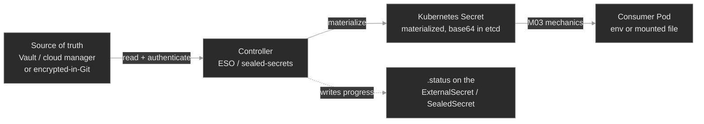

Two things follow. First, **the Secret is derived** — editing it by hand is pointless, because the controller reconciles it back to the source on the next pass. You change the source, not the Secret. Second, **the failure surface moved left.** A consumer Pod stuck in `CreateContainerConfigError` (M03) now has three new upstream causes before you even get to the Pod: the *source* was unreachable, the *reference* was wrong, or the controller wasn't *allowed* to read the source. The diagnostic reflex changes accordingly: when a materialized Secret is missing or wrong, you don't start at the Pod — you start at the object that was supposed to produce it and read *its* `.status`, exactly the M08 move of reading operator-managed state instead of trusting a Running process.

### Concept walkthrough

#### Why plaintext Secrets break GitOps

A Kubernetes `Secret` stores its values base64-encoded, and base64 is reversible by anyone — `base64 -d` and it's plaintext (M03). Commit that manifest to Git and the credential is now in the repository's history permanently, readable by everyone with clone access and every CI system that ever checked it out. Rotating the leaked value doesn't help; the old one is still in the history, and often still valid somewhere. This is the wall every team hits the moment they adopt GitOps: the declarative model wants *everything* in Git, and a Secret is the one thing that can't go there in the clear<sup><a href="https://kubernetes.io/docs/concepts/security/secrets-good-practices/">[1]</a></sup>.

There are exactly two ways out, and every tool in this space is one or the other. **Sync-from-store:** don't put the secret in Git at all — keep it in a purpose-built manager and let a controller pull it into the cluster. **Encrypt-and-commit:** put the secret in Git, but *encrypted* with a key the repo doesn't hold, and decrypt it inside the cluster. The first keeps a single external source of truth; the second keeps Git as the source of truth but makes the committed form safe.

#### Sync-from-store: the External Secrets Operator

The **External Secrets Operator** is the common way to do sync-from-store<sup><a href="https://external-secrets.io/latest/introduction/overview/">[2]</a></sup>. It splits the job into two objects. A **`SecretStore`** says *where* and *how to authenticate* — a provider (HashiCorp Vault, AWS/GCP/Azure managers, or the in-cluster Kubernetes provider) plus a credential. An **`ExternalSecret`** says *what* to pull and *where to put it*:

```yaml
apiVersion: external-secrets.io/v1
kind: ExternalSecret
metadata:
  name: db-credentials
  namespace: provisioning
spec:
  refreshInterval: 1h
  secretStoreRef: { name: polyphone-vault, kind: SecretStore }
  target:
    name: db-credentials            # the Kubernetes Secret ESO will create
  data:
    - secretKey: DB_PASSWORD         # the key in the target Secret
      remoteRef:
        key: prod/database           # the path/name in the store
        property: password           # the field within it
```

The `ExternalSecret` is the GitOps-safe artifact: it *names* `prod/database/password`, it doesn't contain it, so it's safe to commit. ESO reconciles it — authenticate to the store, read `prod/database`, take `password`, write a `Secret` named `db-credentials` with key `DB_PASSWORD` — then re-checks every `refreshInterval`. The consumer Pod references `db-credentials` like any Secret from M03 and never knows ESO exists.

Because ESO is a controller, it reports on the same channel M08 taught: the object's `.status`. An `ExternalSecret` carries a `Ready` condition — `SecretSynced` when the target exists and matches, an error reason like `SecretSyncedError` when it can't pull. That status is the first thing you read when a synced Secret goes wrong, and it names the failing step: store unreachable, key not found, transform failed. `kubectl get externalsecret` shows the state at a glance; `kubectl describe` shows the provider's actual error.

<details>
<summary>📖 Going deeper: the store's own identity, and why "SecretStore not ready" downs everything under it<sup><a href="https://external-secrets.io/latest/provider/kubernetes/">[3]</a></sup></summary>

A `SecretStore` doesn't authenticate as ESO — it authenticates as an identity *you* give it, and that identity has to be allowed to read the backend. With the in-cluster Kubernetes provider, the store names a ServiceAccount and ESO validates the store by asking the API server, on that ServiceAccount's behalf, whether it may read secrets in the remote namespace — the same `SelfSubjectRulesReview` that backs `kubectl auth can-i`<sup><a href="https://external-secrets.io/latest/provider/kubernetes/">[3]</a></sup>. If the RBAC isn't there, the store's own `Ready` condition goes `False` with a `ValidationFailed` reason, and — this is the part that bites — *every* `ExternalSecret` pointing at that store fails at once, because the shared dependency they all lean on is down. The blast radius of one missing RoleBinding is every secret synced through that store.

This is why the diagnostic order is store-first: a fan-out of `ExternalSecret` errors that all name the same store is a store problem, not twenty separate secret problems. Read `kubectl get secretstore` before you read any single `ExternalSecret`, and confirm the store identity with `kubectl auth can-i get secrets -n <backend-ns> --as=<the store's SA>` — the exact M10 reflex, now pointed at a controller's own credential.

</details>

#### Encrypt-and-commit: Sealed Secrets and SOPS

The other pattern keeps Git as the source of truth. **Sealed Secrets** (the `kubeseal` tool plus an in-cluster controller) does it with asymmetric crypto<sup><a href="https://github.com/bitnami-labs/sealed-secrets">[4]</a></sup>. The controller holds a private key and publishes the matching public key. You run `kubeseal` on a normal Secret; it encrypts the values with the public key and emits a **`SealedSecret`** custom resource that only *this* cluster's controller can decrypt. That `SealedSecret` is safe to commit — no other party, not even someone with the YAML, can read it. The controller watches for `SealedSecret`s, decrypts each into a normal `Secret`, and from there it's ordinary M03.

The sharp edge is **scope**. By default a `SealedSecret` is sealed *strict*: the ciphertext is cryptographically bound to its exact namespace **and** name<sup><a href="https://github.com/bitnami-labs/sealed-secrets#scopes">[5]</a></sup>. This is deliberate — it stops someone who can create Pods in namespace `A` from copying your `SealedSecret` into `A` to have the controller decrypt it for them. But it means moving a `SealedSecret` to another namespace, or renaming it, silently breaks decryption: the controller computes the binding from the object's *current* namespace/name, finds it doesn't match what was sealed, and refuses. No `Secret` is produced, and the only signal is the controller's log and the `SealedSecret`'s own status — the derived Secret simply never appears.

**SOPS** takes a lighter approach — it encrypts the *values* in a YAML or JSON file while leaving the keys readable, using age, PGP, or a cloud KMS as the key backend<sup><a href="https://github.com/getsops/sops">[6]</a></sup>. The encrypted file is a readable diff (you can see *which* keys changed, never their values) and commits cleanly. A GitOps engine like Flux decrypts it at apply time with a key held in the cluster<sup><a href="https://fluxcd.io/flux/guides/mozilla-sops/">[7]</a></sup>. Its failure mode rhymes with Sealed Secrets': if the decryption key isn't present or isn't the one the file was encrypted to, the apply fails and no Secret lands — the coupling is the key, not the scope, but the shape is the same. Both patterns fail *closed*: a broken link produces no Secret, never a wrong-but-plausible one.

#### The floor under all of it: encryption at rest

Every pattern above ends the same way — a Kubernetes `Secret`, base64 in etcd. That base64 is not encryption (M03), so a stolen etcd snapshot or a backup file is every credential in the cluster, in the clear. **Encryption at rest** closes that: an `EncryptionConfiguration` on the API server encrypts Secret values before they hit etcd, ideally with an external KMS holding the key<sup><a href="https://kubernetes.io/docs/tasks/administer-cluster/encrypt-data/">[8]</a></sup>. It's off in a vanilla cluster and it's orthogonal to the delivery pattern — you want it *regardless* of whether secrets arrive via ESO or Sealed Secrets, because it protects the materialized Secret at rest no matter how it got there. Managed control planes often enable it for you; on a self-managed cluster it's a deliberate step, and its absence is a finding, not a footnote.

#### Rotation: the Secret updates, the Pod doesn't

The reason to run any of this is rotation — credentials should change on a schedule, and a leaked one must be replaceable in minutes. Sync-from-store makes rotation *look* automatic: change the value in the store, and within a refresh interval ESO updates the Kubernetes `Secret`. But updating the Secret is only half the delivery. A Pod that consumes that Secret as an **environment variable** read it once, at container start, and froze it (M03) — so the Secret now holds the new value while the running process still authenticates with the old one. Nothing crashed; `kubectl get externalsecret` is green; the Secret is correct; and the workload is quietly wrong until something restarts it. That gap — the materialization pipeline is healthy end to end but the *consumer* is stale — is the signature secrets-at-scale failure, and it's why "rotate the secret" and "roll the consumers" are two steps, not one. Mounted-file consumers pick up the change after the kubelet sync (M03); env consumers need a `rollout restart`, or a controller that watches the Secret's hash and rolls them for you.

### Hands-on

The lab runs a **secrets-sync operator** on the Polyphone fleet: a `SecretSync` custom resource that models an ESO `ExternalSecret`, and a reconcile loop that reads a backing store (`vault-backend` in `secrets-source`, standing in for Vault), validates its access the way ESO validates a `SecretStore`, and materializes a Kubernetes `Secret` for each consumer. It's a legible offline stand-in for ESO — same pipeline, same `.status`, same failure modes — so you practice reading the chain, not installing a controller. Two syncs feed two consumers: `db-credentials` → `billing-processor` (`provisioning`) and `partner-api` → `partner-connector` (`media`).

- **`baseline/`** — the healthy pipeline: the backing store, the `SecretSync` objects reporting `Ready`, the Secrets they materialized, and the consumers running on them. What "the supply chain is intact" looks like, so a broken link stands out.
- **`breakfix-01-source-key-missing`** — a `SecretSync` in `SyncError`: its `remoteRef` names a key the store doesn't have, so no target Secret is created and the consumer is stuck in `CreateContainerConfigError`. Tests reading the sync object's status instead of the Pod's logs.
- **`breakfix-02-store-access-denied`** — every sync `StoreNotReady` at once: the operator lost RBAC to read the backing store, so the whole pipeline is down. Tests store-first diagnosis and the `auth can-i --as=` reflex from M10.
- **`breakfix-03-rotation-not-propagated`** — a green pipeline and a stale consumer: the store value rotated, the Secret updated, but the env-consuming Pod still holds the old credential. Tests catching the failure the status *doesn't* show.

Check yourself against `ANSWER-KEY.md` after each.

### Common failure modes

| Symptom | Likely cause | Where to look |
|---------|--------------|---------------|
| Consumer `CreateContainerConfigError`, target Secret absent | The sync object is in error — bad `remoteRef` key/property, or a failed transform | `kubectl get externalsecret/secretsync -n <ns>`; its `.status` reason (`SecretSyncedError`); does the key exist in the store |
| Many sync objects fail at once, all naming one store | `SecretStore` not ready — the store's identity lost access to the backend | `kubectl get secretstore`; `kubectl auth can-i get secrets -n <backend> --as=<store SA>`; the store's RBAC |
| Synced Secret exists and is correct, consumer behaves on old value | Rotation reached the Secret but not the Pod — env is frozen at start | `kubectl exec … -- printenv`; compare to the Secret; did the consumers `rollout restart` after rotation |
| `SealedSecret` applied, no `Secret` appears | Scope mismatch — sealed for a different namespace/name than where it's deployed | controller logs; the `SealedSecret`'s namespace/name vs. how it was sealed; re-seal for the right scope |
| Hand-edited a materialized Secret, it reverted | It's a *derived* object — the controller reconciles it back to the source | Change the source (`ExternalSecret`/store), not the Secret; the sync object's `refreshInterval` |
| etcd backup contains readable credentials | No encryption at rest — base64 is not encryption | the API server's `--encryption-provider-config`; `EncryptionConfiguration`; whether a KMS is wired |

### Recap

- **Base64 is not encryption, so a plaintext Secret can't live in Git.** Secrets at scale are *materialized* by a controller, one of two ways: **sync-from-store** (ESO, Vault) or **encrypt-and-commit** (Sealed Secrets, SOPS). The committed artifact — an `ExternalSecret`, a `SealedSecret` — names or encrypts the secret; it never contains it in the clear.
- **The Secret becomes a derived object, and the failure surface moves upstream.** A missing or wrong Secret now has causes *before* the Pod: the source, the reference, the controller's access. Diagnose by reading the producing object's `.status`, not the consumer's logs — the M08 reflex, pointed at secrets.
- **A `SecretStore` is a shared dependency.** When its identity loses access, every `ExternalSecret` under it fails together. A fan-out of sync errors that all name one store is one problem; go store-first, and confirm the store's identity with `auth can-i --as=` (M10).
- **Encrypt-and-commit fails closed on a coupling:** Sealed Secrets on **scope** (namespace + name), SOPS on the **decryption key**. Move or rename a `SealedSecret` and it stops decrypting — no Secret, not a wrong one.
- **Rotation is two steps, not one.** The pipeline updating the Secret is not the consumer picking it up — an env-consumer stays frozen on the old value until it's rolled. A green sync status can sit above a workload authenticating with a stale credential.

### Production thinking

- A `SecretStore`'s credential expires overnight and by morning forty `ExternalSecret`s across a dozen namespaces are all failing to sync. Nothing has restarted yet, so no app is down — but the moment any of those Pods reschedules, it comes up with no Secret. How would you detect the store outage *before* the first Pod reschedules, and what's the difference between alerting on the store's `Ready` condition versus on each individual `ExternalSecret`?
- Your team standardizes on encrypt-and-commit with Sealed Secrets, and six months in you need to move a workload — and its `SealedSecret` — from the `staging` namespace to `prod`. The copied `SealedSecret` won't decrypt. Walk through *why* strict scope did exactly what it was designed to do, and what your options are (re-seal, a wider scope, a different tool) with the trade-off each makes between convenience and blast radius.
- You rotate a database password in the external store, confirm every `ExternalSecret` re-synced green, and consider the incident closed — then connections start failing an hour later as Pods slowly reschedule onto the new-but-not-yet-adopted value, half the fleet on each. What in your rollout process should have coupled "the Secret changed" to "the consumers restarted," and how would you have known which Pods were still running on the old credential?

### References

1. Kubernetes — Good practices for Kubernetes Secrets: https://kubernetes.io/docs/concepts/security/secrets-good-practices/
2. External Secrets Operator — Introduction: https://external-secrets.io/latest/introduction/overview/
3. External Secrets Operator — Kubernetes provider: https://external-secrets.io/latest/provider/kubernetes/
4. Sealed Secrets — Overview (Bitnami Labs): https://github.com/bitnami-labs/sealed-secrets
5. Sealed Secrets — Scopes: https://github.com/bitnami-labs/sealed-secrets#scopes
6. SOPS — Secrets OPerationS (getsops): https://github.com/getsops/sops
7. Flux — Manage Kubernetes secrets with SOPS: https://fluxcd.io/flux/guides/mozilla-sops/
8. Kubernetes — Encrypting Confidential Data at Rest: https://kubernetes.io/docs/tasks/administer-cluster/encrypt-data/


---

## Break/Fix Practice

## Break/fix 01 — SecretSync SyncError (Missing Source Key)

**Symptom — what you'd actually see:**

`partner-connector` (`media`) is in `CreateContainerConfigError` and its `partner-api` Secret doesn't exist, while `billing-processor`/`db-credentials` are healthy. The operator is Running; nothing crashed.

**Think about this before you open the answer:**

That a derived Secret's failure story lives in the object that produces it. Self-grading:

- Did you go to the SecretSync's `.status` after seeing the Secret was missing, instead of hand-creating the Secret (which the operator would overwrite)?
- Did you diagnose by *comparing* the sync's `sourceKey` to the store's actual keys, rather than guessing?
- Did you fix the *source* (the SecretSync) and understand why editing the derived Secret directly wouldn't hold?

<details>
<summary><b>Click to reveal: diagnostic commands, root cause, exact fix, verify</b></summary>

**Root cause:**

The `partner-api` SecretSync names `sourceKey: api-tokn`, but the store's key is `api-token` (a typo). The operator reads the store fine, but the named key resolves to nothing, so it sets the SecretSync to `reason=SyncError` and — by design — refuses to materialize a partial Secret. No `partner-api` Secret is ever created, so its consumer, referencing a Secret that never existed, can't build its container environment (the M03 `CreateContainerConfigError` shape). Because only one SecretSync is wrong, only one consumer is affected — this is a single-reference failure, not a store-wide one.

**Diagnostic commands (run in this order):**

```bash
# 1. The consumer can't start, and its Secret is absent
kubectl get pods -n media -l app=partner-connector          # CreateContainerConfigError
kubectl describe pod -n media -l app=partner-connector | grep -i 'secret'   # secret "partner-api" not found
kubectl get secret partner-api -n media                      # NotFound

# 2. The Secret is derived — read the producing object's status, don't hand-create it
kubectl get secretsync -A                                    # partner-api: READY False, REASON SyncError (db-credentials Synced)
kubectl get secretsync partner-api -n media -o jsonpath='{.status.message}'; echo
#   source keys not found in store: api-tokn

# 3. Compare what the sync asks for against what the store has
kubectl get secretsync partner-api -n media -o jsonpath='{.spec.data}'; echo   # sourceKey: api-tokn
kubectl get secret vault-backend -n secrets-source -o jsonpath='{.data}'; echo # keys: db-password, api-token, signing-key
```

**Exact fix:**

Correct the `sourceKey` in the SecretSync (the source of truth), not the Secret. Re-apply it:

```bash
cat <<'EOF' | kubectl apply -f -
apiVersion: polyphone.example/v1
kind: SecretSync
metadata: { name: partner-api, namespace: media, labels: { plane: media, tier: lab } }
spec:
  storeRef: { name: vault-backend }
  target:   { name: partner-api }
  data:
    - { secretKey: API_TOKEN, sourceKey: api-token }
EOF
```

**Verify:**

```bash
kubectl get secretsync partner-api -n media                  # READY True, REASON Synced
kubectl get secret partner-api -n media                      # now exists, managed-by=secret-operator
kubectl get pods -n media -l app=partner-connector           # Running 1/1 (kubelet retries the config error on a backoff)
kubectl exec deploy/partner-connector -n media -- printenv API_TOKEN   # the store's token
```

**Production thinking:**

This is the everyday sync failure — a reference that names something the store doesn't have, or a key renamed on the store side without updating the ExternalSecret. The operator names the failing key in `.status`, so it's fast once you look there. Guard against it earlier: validate that referenced keys exist against the store in CI, and alert on any ExternalSecret whose `Ready` condition has been `False` past a short threshold — the Secret is only missing until the next Pod reschedule, so a silent SyncError is a latent outage.

</details>

---

## Break/fix 02 — Store Access Denied (SecretStore Not Ready)

**Symptom — what you'd actually see:**

Both `billing-processor` (`provisioning`) and `partner-connector` (`media`) are in `CreateContainerConfigError`, and neither `db-credentials` nor `partner-api` Secret exists. Every SecretSync reads `StoreNotReady`. The operator Pod is Running, 0 restarts.

**Think about this before you open the answer:**

Recognizing a fan-out as one store-level problem and proving the store's identity lost access with `auth can-i --as`. Self-grading:

- Did the pattern — many syncs failing identically, all naming one store — send you to the store layer instead of opening two investigations?
- Did you use `kubectl auth can-i … --as=<the operator's SA>` to turn "why is nothing syncing" into a yes/no, rather than guessing?
- Did you fix the binding's subject and grant store-read to *only* the operator's SA, not widen access?

<details>
<summary><b>Click to reveal: diagnostic commands, root cause, exact fix, verify</b></summary>

**Root cause:**

The `secret-operator-store` RoleBinding in `secrets-source` — the grant that lets the operator read the backing store — names the wrong subject: `secret-operator-ro`, a ServiceAccount that doesn't exist, instead of the operator's real identity `secret-operator`. So the operator's ServiceAccount has no read access in `secrets-source`; its attempt to read `vault-backend` is denied, and it sets *every* SecretSync to `StoreNotReady` and materializes nothing. Because all syncs depend on the one store, one mis-subjected binding takes the whole pipeline offline — a fan-out from a single shared dependency<sup><a href="https://external-secrets.io/latest/provider/kubernetes/">[3]</a></sup>. The RBAC parses fine and the operator process is healthy; the signal is in the syncs' `.status` and an access check, not the Pod (RBAC in full: M10<sup><a href="https://kubernetes.io/docs/reference/access-authn-authz/rbac/">[7]</a></sup>).

**Diagnostic commands (run in this order):**

```bash
# 1. Two consumers down in two namespaces, and every sync fails the same way → shared dependency
kubectl get secretsync -A                                    # BOTH READY False, REASON StoreNotReady
kubectl get secretsync db-credentials -n provisioning -o jsonpath='{.status.message}'; echo
#   cannot read backing store secrets-source/vault-backend
kubectl get secrets -A -l managed-by=secret-operator         # none produced

# 2. Operator Running → this is access, not a crash. Prove it as the operator (M10)
kubectl get pods -n secrets-system                           # secret-operator Running, 0 restarts
kubectl auth can-i get secrets -n secrets-source \
  --as=system:serviceaccount:secrets-system:secret-operator  # no

# 3. Read the store binding — it grants the wrong identity
kubectl get rolebinding secret-operator-store -n secrets-source -o jsonpath='{.subjects}'; echo
#   name: secret-operator-ro  (a ServiceAccount that doesn't exist)
```

**Exact fix:**

Point the RoleBinding at the operator's real ServiceAccount and re-apply:

```bash
cat <<'EOF' | kubectl apply -f -
apiVersion: rbac.authorization.k8s.io/v1
kind: RoleBinding
metadata: { name: secret-operator-store, namespace: secrets-source, labels: { plane: security, tier: lab } }
roleRef: { apiGroup: rbac.authorization.k8s.io, kind: ClusterRole, name: secret-operator-secrets }
subjects:
  - { kind: ServiceAccount, name: secret-operator, namespace: secrets-system }
EOF
```

No restart is needed — the loop is level-triggered and retries every few seconds.

**Verify:**

```bash
kubectl auth can-i get secrets -n secrets-source \
  --as=system:serviceaccount:secrets-system:secret-operator  # yes
kubectl get secretsync -A                                    # both move to Synced
kubectl get secrets -A -l managed-by=secret-operator         # db-credentials, partner-api appear
kubectl get pods -n provisioning -l app=billing-processor    # Running 1/1
kubectl get pods -n media -l app=partner-connector           # Running 1/1
```

**Production thinking:**

A `SecretStore`'s identity is a shared dependency, so its failures are the widest-blast-radius secret failures you have — a rotated store credential or a revoked binding fails every ExternalSecret under it at once. Because existing Pods keep running on their already-materialized Secrets, nothing is *down* until the first reschedule — so alert on the store's `Ready` condition and on a rising count of `StoreNotReady`/`Denied` syncs, not on Pod health, which lags the outage by hours. And scope store access to exactly the operator's identity; broad grants hide these gaps and widen the blast radius.

</details>

---

## Break/fix 03 — Rotation Not Propagated (Stale Consumer)

**Symptom — what you'd actually see:**

`billing-processor` is failing its database auth, but the whole pipeline is green: every SecretSync `Synced`, the operator healthy, and the `db-credentials` Secret holds the current (rotated) password. Nothing is red anywhere.

**Think about this before you open the answer:**

Catching the failure that no pipeline status shows — a healthy supply chain above a workload still running on the old value — by reading what the process actually holds. Self-grading:

- When every status was green, did you read the *injected value* (`exec … printenv`) instead of trusting `Synced`?
- Can you explain why the Secret updated but the process didn't — env frozen at start, and nothing rolls a Pod on a Secret change?
- Did you fix it by rolling the *consumer* (not re-syncing the already-correct Secret), and can you name the durable version (config-hash annotation / reloader)?

<details>
<summary><b>Click to reveal: diagnostic commands, root cause, exact fix, verify</b></summary>

**Root cause:**

The store's `db-password` was rotated to a new value (`R0tated-prod-8842`), and the operator synced it into the `db-credentials` Secret — so the Secret is correct. But `billing-processor` consumes `DB_PASSWORD` as an **environment variable**, and env vars are materialized once at container start and then frozen for the life of the container (M03<sup><a href="https://kubernetes.io/docs/concepts/configuration/secret/">[5]</a></sup>). The Pod started before the rotation and captured the old value (`S3cure-prod-4417`); the Secret updating underneath it changed nothing in the running process, and no controller watches a Secret to restart its consumers. The rotation reached the Secret and stopped there — a green pipeline above a stale consumer. This is the same "the headline status lies" theme as `Running` ≠ `Ready`, now `Synced` ≠ *adopted*.

**Diagnostic commands (run in this order):**

```bash
# 1. The pipeline is genuinely healthy — the Secret holds the current value
kubectl get secretsync -A                                    # both Synced, READY True
echo "store : $(kubectl get secret vault-backend -n secrets-source -o jsonpath='{.data.db-password}' | base64 -d)"
echo "secret: $(kubectl get secret db-credentials -n provisioning -o jsonpath='{.data.DB_PASSWORD}' | base64 -d)"
#   both R0tated-prod-8842

# 2. Read what the PROCESS holds — the gap the status can't show
kubectl exec deploy/billing-processor -n provisioning -- printenv DB_PASSWORD   # S3cure-prod-4417 (OLD)

# 3. Confirm nothing rolled the Pod since the rotation
kubectl get pods -n provisioning -l app=billing-processor    # old AGE, 0 restarts
```

**Exact fix:**

The Secret is already correct — roll the consumer so a fresh container re-reads it:

```bash
kubectl rollout restart deployment/billing-processor -n provisioning
kubectl rollout status  deployment/billing-processor -n provisioning
```

**Verify:**

```bash
echo "store: $(kubectl get secret vault-backend -n secrets-source -o jsonpath='{.data.db-password}' | base64 -d)"
echo "proc : $(kubectl exec deploy/billing-processor -n provisioning -- printenv DB_PASSWORD)"
#   both R0tated-prod-8842 — the rotation reached the process
```

**Production thinking:**

Rotation is the reason to run any of this, and it's a two-step operation that reads like one: change the value, *and* roll every consumer. Miss the second step and you get the worst kind of incident — no alert fires (nothing crashed, nothing is `False`), and the fleet drifts onto two different credentials as Pods slowly reschedule, half on each. Couple the two by construction: a checksum of the Secret in the Pod-template annotations so a change triggers a rolling update, or a reloader controller that watches the Secret and restarts consumers. And to find who's still stale, compare the value each running Pod holds against the store — the pipeline's `Synced` won't tell you.

</details>

---


---

# `m12-pki-tls/`

## Concept

## M12 — PKI & TLS

> How workloads get a cryptographic identity and use it to talk securely. cert-manager turns a declarative `Certificate` into a signed key pair; an internal CA signs the fleet's certs; mutual TLS proves *both* ends. Every TLS failure is one of three questions — was the cert **issued**, does its **identity** match, is it **trusted** — and this module teaches you to tell them apart at a glance.

### What you'll learn

- Read the **cert-manager issuance chain** — `Issuer`/`ClusterIssuer` → `Certificate` → `CertificateRequest` → a `kubernetes.io/tls` Secret — and diagnose a `Certificate` that never goes `Ready`
- Stand up an **internal CA** in-cluster (a self-signed root that signs every workload's leaf cert) and explain why a private CA, not a public one, secures east-west traffic
- Read a leaf certificate's **identity** — its Subject Alternative Names (SANs) — and recognize the handshake failure when a client connects by a name the cert doesn't cover
- Explain **trust**: why a TLS client accepts or rejects a server based on which CA signed it, and how the CA's public cert (`ca.crt`) gets distributed to the workloads that need it
- Set up **mutual TLS (mTLS)** between two workloads — both present a cert, both verify the other — and read each of the three ways it breaks
- Place **ACME** (the Let's Encrypt protocol) in the picture: what the HTTP-01 / DNS-01 challenge proves, and why it's for *public* certs, not internal ones

### Why it matters

Every service-to-service call at Polyphone carrying a SIP credential, a call detail record, or tenant provisioning data should be encrypted and mutually authenticated — because a flat internal network is one compromised Pod away from an attacker reading everything east-west. TLS makes the wire unreadable and the peer verifiable; PKI — public key infrastructure — is the machinery that hands out and vouches for the identities TLS checks.

The reason this is a whole module and not a footnote is that TLS fails in ways that look identical from the outside — "the call didn't connect" — but have three different causes. The cert was never issued (nothing to serve). The cert exists but claims the wrong name (the client won't believe it's the right server). The cert is fine but the client doesn't trust the CA that signed it (it rejects a valid certificate). Reach for the wrong cause and you burn an hour rotating a key that was never the problem. An SRE who reads `kubectl get certificate`, `openssl`, and a one-line `curl` error and instantly says *issuance*, *identity*, or *trust* is worth a rotation of people who can't.

The other half is operational: certificates **expire**. A cert nobody renews is a self-inflicted outage with a timer on it — the classic 2 a.m. page is a service that worked yesterday and now throws `certificate has expired`. cert-manager makes issuance and renewal a control loop instead of a calendar reminder; this module is about reading that loop when it stalls.

### Scope

**Covers:** the **cert-manager** model — the `Issuer`/`ClusterIssuer`, `Certificate`, and `CertificateRequest` custom resources, the reconciliation from a declared `Certificate` to a real `kubernetes.io/tls` Secret, and the `Ready` condition; building an **internal CA** with the `SelfSigned` and `CA` issuer types; the **`kubernetes.io/tls` Secret contract** (`tls.crt` / `tls.key` / `ca.crt`) and how a workload mounts it; certificate **identity** (SANs vs the legacy Common Name) and **hostname verification**; the **chain of trust** and how `ca.crt` is distributed; **mutual TLS** between two workloads and its three failure modes; certificate **expiry and automatic renewal**; and **ACME** (HTTP-01 / DNS-01) as a concept.

**Doesn't cover:** running *public* ACME issuance end-to-end — Let's Encrypt needs a publicly reachable name and inbound network an offline lab can't provide, so ACME is a model, not deployed (the reason M13 kept the Prometheus stack concept-only). Also deferred: secret **distribution/rotation at fleet scale** (External Secrets, sealed-secrets, `sops`) → M11; **service-mesh-managed mTLS**, where a sidecar injects and rotates certs → M15; TLS **termination at the Ingress edge** (M14 introduced it); and the handshake's cryptographic internals (cipher suites, key exchange).

**Assumes:** M03 (Secrets — a TLS cert lives in one, and the double-base64 reflex from M03 applies here too), M08 (CRDs and the controller pattern — cert-manager *is* an operator: it installs CRDs and runs a reconcile loop, exactly the shape M08 taught), M10 (RBAC and ServiceAccounts — cert-manager's controller authenticates as a ServiceAccount with permission to write Secrets), and M04 (Service DNS — a cert's SANs are the DNS names from M04, and hostname verification checks the name you dialed).

### Vocabulary

| Term | Definition |
|------|------------|
| **TLS** | Transport Layer Security: encrypts a connection and authenticates the server (and, in mTLS, the client) using certificates. The `S` in HTTPS. |
| **PKI** | Public Key Infrastructure: the system of CAs, certificates, and trust relationships that lets one party verify another's identity without a shared secret. |
| **Certificate (X.509)** | A signed document binding a **public key** to an **identity** (a set of names), vouched for by a CA's signature. Public — safe to hand out. |
| **Private key** | The secret half of the key pair. Never leaves the workload; whoever holds it *is* the identity. Lives in `tls.key`. |
| **CA (Certificate Authority)** | An entity whose signature vouches for certificates. A **root CA** signs itself; everything else chains up to it. |
| **Leaf / end-entity certificate** | A certificate issued *to* a workload (not a CA). What `config-api` presents in the handshake. |
| **Chain of trust** | Leaf → (intermediate) → root. A verifier accepts a leaf if it can follow the signatures up to a root it already trusts. |
| **CSR (Certificate Signing Request)** | A request carrying a public key + desired names, sent to a CA to be signed. cert-manager creates these for you as `CertificateRequest` objects. |
| **SAN (Subject Alternative Name)** | The list of names (DNS names, IPs) a certificate is valid for. The **only** field modern TLS checks for identity. |
| **CN (Common Name)** | The legacy single-name field. Ignored for hostname verification by modern clients — SANs won. Still shown in `Subject:`. |
| **mTLS (mutual TLS)** | Both ends present and verify certificates. The server proves it's the right server *and* the client proves it's an allowed caller. |
| **cert-manager** | The de-facto Kubernetes operator for X.509 certs: CRDs (`Certificate`, `Issuer`, …) + a controller that issues and auto-renews them. |
| **Issuer / ClusterIssuer** | A cert-manager CRD naming *how* to sign certs (SelfSigned, CA, ACME, Vault). `Issuer` is namespaced; `ClusterIssuer` is cluster-wide. |
| **Certificate (the CRD)** | The cert-manager object where you *declare* a desired cert (names, issuer, duration). The controller reconciles it into a Secret. |
| **CertificateRequest** | The one-shot CSR object cert-manager creates per issuance; reading it is how you see *why* an issuance failed. |
| **`kubernetes.io/tls` Secret** | The Secret type holding a cert (`tls.crt`), its private key (`tls.key`), and often the issuing CA (`ca.crt`). What workloads mount. |
| **ACME** | The IETF protocol Let's Encrypt uses to issue *public* certs automatically, proving domain control via an HTTP-01 or DNS-01 challenge. cert-manager auto-renews at ⅔ of a cert's lifetime. |

### Mental model

A certificate answers one question — *who are you?* — and it does so with a signature you can check without asking anyone. Three separable properties make it work, and every TLS problem is a failure of exactly one of them:

- **Issuance** — does a signed cert *exist*? Someone with a CA key had to sign the workload's public key.
- **Identity** — does the cert claim the *right name*? A cert for `config-api` proves nothing about `session-broker`.
- **Trust** — does the verifier *believe the signer*? A cert is only as good as your trust in the CA that signed it.

cert-manager automates the first. It's an operator (M08's pattern exactly): you write a declarative `Certificate` object, its controller creates a `CertificateRequest`, an `Issuer` signs it, and the result lands in a `kubernetes.io/tls` Secret your workload mounts<sup><a href="https://cert-manager.io/docs/concepts/">[1]</a></sup>. The chain, for the internal CA this module builds:

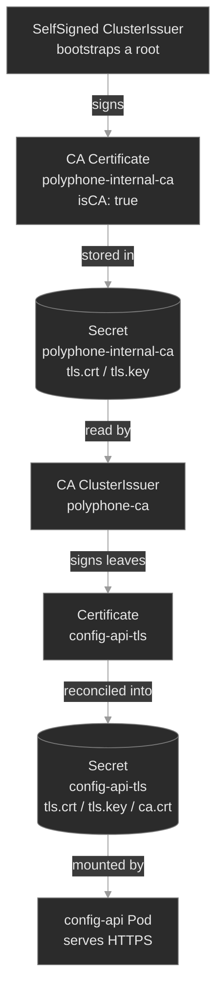

The load-bearing insight: **the Secret is the deliverable, and the CA cert (`ca.crt`) is the trust anchor.** The server mounts the Secret to *serve* TLS; any client that wants to *verify* that server must independently hold the same `ca.crt`. Issuance produces the first; trust distribution produces the second. Keep those two jobs separate in your head and the whole module snaps into focus.

### Concept walkthrough

#### cert-manager and the issuance chain

Before cert-manager, getting a cert into a Pod meant a human running `openssl`, submitting a CSR, and pasting the result into a Secret — every 90 days. cert-manager makes it a reconciliation loop: install it once (its CRDs plus a controller, a webhook, and a cainjector), and a certificate becomes just another declarative object<sup><a href="https://cert-manager.io/docs/concepts/">[1]</a></sup>.

Two kinds of object drive it. An **`Issuer`** (or its cluster-scoped twin, **`ClusterIssuer`**) declares *how* certs get signed — the signing backend. A **`Certificate`** declares *what* you want: the DNS names, the duration, the Secret to write, and which issuer to use<sup><a href="https://cert-manager.io/docs/configuration/">[3]</a></sup>. When you create a `Certificate`, the controller doesn't sign anything itself — it creates a short-lived **`CertificateRequest`** (a CSR wrapped as a Kubernetes object), the issuer processes that, and the signed cert plus its key are written into a `kubernetes.io/tls` Secret. That indirection is why diagnosis has a *ladder*: when a cert won't issue, the `Certificate` tells you it's not `Ready`, and the `CertificateRequest` beneath it tells you *why*.

```bash
kubectl get certificate -n media                       # READY column: True or False
kubectl describe certificate config-api-tls -n media   # conditions + the child request
kubectl get certificaterequest -n media                # the CSR object; describe it for the real error
```

The most common issuance failure is the dumbest and the most instructive: the `Certificate` names an issuer that doesn't exist, or references it with the wrong `kind`. cert-manager can't sign, the `Certificate` sits `Ready: False` forever, and — critically — **the Secret is never created**. Any Pod that mounts that Secret as a volume is then stuck `ContainerCreating` with a `FailedMount` event, because you can't mount a Secret that isn't there. Two symptoms, one root cause: read the `Certificate`, not the Pod.

<details>
<summary>📖 Going deeper: the four issuer types, and why we chained SelfSigned → CA<sup><a href="https://cert-manager.io/docs/configuration/">[3]</a></sup></summary>

An issuer's backend is one of several types<sup><a href="https://cert-manager.io/docs/configuration/">[3]</a></sup>:

- **SelfSigned** — the cert signs *itself*. No CA involved. Useful for exactly one thing: bootstrapping a root, because a root CA is by definition self-signed.
- **CA** — signs leaf certs using a CA key + cert that already live in a Secret<sup><a href="https://cert-manager.io/docs/configuration/ca/">[4]</a></sup>. This is your internal CA. It signs everything east-west and costs nothing.
- **ACME** — talks to Let's Encrypt (or any ACME server) to get *publicly trusted* certs, proving domain control via a challenge (covered below).
- **Vault / Venafi / external** — delegates signing to an enterprise PKI.

Building an internal CA is a two-step chain, which is why the diagram has two issuers. You can't ask a CA issuer to sign your CA cert — there's no CA yet. So a **SelfSigned** issuer mints the root (`isCA: true`), that root lands in a Secret, and a **CA** issuer is pointed at that Secret to sign every leaf. Bootstrap once, sign forever. (The CA issuer reads its signing Secret from the cluster resource namespace, `cert-manager` — which is why the CA `Certificate` is created there, not in `media`.)

</details>

#### Certificate identity — SANs and hostname verification

A signed cert proves a public key belongs to *some* identity. Which identity is the **Subject Alternative Name** list — the set of DNS names (and sometimes IPs) the cert is valid for. When a client opens `https://config-api.media.svc.cluster.local`, TLS does two independent checks: is the cert **trusted** (signed by a CA I believe), and does the name I *dialed* appear in the cert's **SANs**? Both must pass. A cert can be freshly issued, perfectly trusted, and still rejected because it's valid for `config-api-legacy` and you asked for `config-api`<sup><a href="https://cert-manager.io/docs/usage/certificate/">[5]</a></sup>.

This trips people because the legacy **Common Name** field looks like "the name" and it isn't — modern clients ignore CN for hostname verification and check SANs only. A cert with `CN=config-api` and no matching SAN fails. The error is specific and worth memorizing on sight:

```text
curl: (60) SSL: no alternative certificate subject name matches target host name 'config-api.media.svc.cluster.local'
```

Read a cert's SANs directly — this is a muscle to build, not a tool to hide behind:

```bash
## from the Secret, decode the cert and read its SANs
kubectl get secret config-api-tls -n media -o jsonpath='{.data.tls\.crt}' | base64 -d \
  | openssl x509 -noout -text | grep -A1 'Subject Alternative Name'
```

The operational rule: **a service's cert must list every name any client uses to reach it.** In Kubernetes that's usually three forms of the same Service — `config-api`, `config-api.media.svc`, `config-api.media.svc.cluster.local` — because a same-namespace caller uses the short form and a cross-namespace caller uses the FQDN. Miss one and *some* callers fail while others succeed — an intermittent-looking bug that's actually deterministic.

#### Trust — the chain, the CA, and distributing `ca.crt`

Issuance and identity are about the cert the *server* holds; trust is about what the *client* holds. A TLS client ships with a set of CAs it trusts — for the public web, the ~150 roots baked into your OS. An **internal** CA no OS has heard of is trusted by nobody by default, so verification fails with the other error you must know cold:

```text
curl: (60) SSL certificate problem: unable to get local issuer certificate
```

That is not "the cert is bad." It's "I don't recognize who signed it." The fix is never to weaken verification (`curl -k` / `insecureSkipVerify` is how internal TLS quietly rots into unauthenticated plaintext-equivalent); the fix is to **give the client the CA's public cert** so it can complete the chain. That public cert is `ca.crt`, and cert-manager conveniently writes it into every leaf Secret alongside `tls.crt`. Distributing it to the workloads that need it is a first-class job — this module does it by copying the CA cert into a small bundle Secret each client mounts and points its verifier at (`--cacert`). Mount the *wrong* CA and you get the exact error above, even though the server's cert is flawless.

<details>
<summary>📖 Going deeper: distributing trust at scale, and why <code>ca.crt</code> is safe to spread<sup><a href="https://kubernetes.io/docs/concepts/configuration/secret/#tls-secrets">[2]</a></sup></summary>

`ca.crt` is a **public** certificate — no private key. Handing it to every workload leaks nothing; the system's security rests entirely on the CA's *private* key (in the `polyphone-internal-ca` Secret, which only cert-manager reads). So trust distribution is a plumbing problem, not a secrets problem: get a public file to a lot of Pods.

Copying it by hand into a bundle Secret per namespace — what this module does for legibility — doesn't scale. The production answer is **trust-manager**, a cert-manager companion whose `Bundle` resource syncs a set of CA certs into a ConfigMap in every namespace, so a client mounts the same well-known bundle everywhere and you rotate the CA in one place. The mental model is unchanged; the CA cert just arrives by controller instead of copy-paste. This also solves the rotation trap: when you replace the CA, clients must trust the *new* CA before servers present certs signed by it, or every call fails at once — a bundle holding *both* CAs during the overlap is how you rotate a root without an outage.

</details>

#### Mutual TLS — both ends prove identity

Ordinary server TLS authenticates one direction: the client checks the server, the server accepts anyone. **Mutual TLS** closes the loop — the server also demands a client certificate and verifies it against a CA. Now `config-api` knows the caller really is `config-client` (a holder of an internal-CA-signed cert), not just some Pod that reached its IP. In a zero-trust network that's the point: identity on both ends, enforced by cryptography, not network position.

Concretely, the server adds two settings — "require a client cert" and "trust clients signed by *this* CA" — and the client presents its own `tls.crt` / `tls.key` in addition to verifying the server:

```bash
## config-client calls config-api over mTLS: --cert/--key = its identity, --cacert = its trust anchor
curl --cert /etc/tls/id/tls.crt --key /etc/tls/id/tls.key \
     --cacert /etc/tls/trust/ca.crt \
     https://config-api.media.svc.cluster.local/
```

mTLS multiplies the failure surface — now *either* side's cert can be un-issued, mis-named, or untrusted — but it adds no new *kinds* of failure. It's still issuance, identity, trust, from two vantage points. That's why each breakfix isolates one layer: build the reflex once, and mTLS is the same reflex applied twice.

#### ACME and public certificates (concept only)

Everything above uses a *private* CA, right for internal traffic because you control both ends. But the cert on `portal.polyphone.example` that a customer's browser hits must be signed by a CA the *browser* already trusts — a public one like Let's Encrypt. You can't just self-sign that; no browser would believe it. **ACME** is the IETF protocol that automates public issuance<sup><a href="https://letsencrypt.org/how-it-works/">[7]</a></sup>, and cert-manager speaks it via an ACME issuer<sup><a href="https://cert-manager.io/docs/configuration/acme/">[6]</a></sup>.

The core idea is a **challenge** that proves you control the domain before the CA signs for it. Two flavors: **HTTP-01** asks you to serve a random token at `http://your-domain/.well-known/acme-challenge/…`, proving you control the web server behind that name; **DNS-01** asks you to publish a `TXT` record, proving you control the domain's DNS (and can issue wildcards). cert-manager drives the whole dance — request, solve, retrieve, and renew before expiry<sup><a href="https://cert-manager.io/docs/usage/certificate/">[8]</a></sup> — through `Order` and `Challenge` objects you inspect when it stalls.

This module doesn't run ACME live: HTTP-01 needs an inbound path from Let's Encrypt to the cluster, and an offline lab has neither a public name nor inbound reachability, so it's taught as a model. The reflex: **internal traffic → private CA (instant, free, you own trust); public traffic → ACME (a real CA, but you must prove domain control).** An ACME issuer will never sign `config-api.media.svc.cluster.local` — you can't prove domain control over a name that only exists inside the cluster.

### Hands-on

Four steps in the baseline, three break/fix scenarios — all on the full Polyphone fleet on a 2-node cluster, with cert-manager installed and an internal CA already minted. The baseline tours a healthy mTLS setup; each break/fix breaks exactly one PKI layer so you practice one diagnosis at a time.

- **`baseline/`** — read the healthy chain end to end: cert-manager's components and the two `ClusterIssuer`s, the CA `Certificate` and the leaf `Certificate`s (`Ready: True`) with the `kubernetes.io/tls` Secrets they produced; decode a leaf cert and read its SANs; watch `config-client` call `config-api` over **mTLS** and succeed; and read a cert's expiry and cert-manager's automatic renewal.
- **`breakfix-01-certificate-not-ready`** — `config-api` is stuck `ContainerCreating` and its `Certificate` reads `Ready: False`: the `issuerRef` names an issuer that doesn't exist, so no Secret is ever written. Tests the issuance ladder — read the `Certificate` and its `CertificateRequest`, not the Pod.
- **`breakfix-02-san-mismatch`** — the cert issues fine and the Secret exists, but the mTLS call fails with `no alternative certificate subject name matches`: the server cert's SANs omit the name the client dials. Tests reading a cert's identity and fixing the `dnsNames`.
- **`breakfix-03-trust-mismatch`** — the server's cert is valid and correctly named, but the client fails with `unable to get local issuer certificate`: it's mounting the wrong CA bundle. Tests the trust half — the client's CA, not the server's cert.

Check yourself against `ANSWER-KEY.md` after each.

### Common failure modes

| Symptom | Likely cause | Where to look |
|---------|--------------|---------------|
| `Certificate` stuck `Ready: False`, no Secret created | Issuer missing / wrong `kind` / not `Ready`; CSR rejected | `kubectl describe certificate`, then `describe certificaterequest` |
| Pod stuck `ContainerCreating`, `FailedMount` on a `tls` volume | The `Certificate` that fills that Secret hasn't issued | the `Certificate` behind the Secret, not the Pod |
| `no alternative certificate subject name matches target host name` | Cert's SANs don't include the name the client dialed | `openssl x509 -text` on `tls.crt` → the SAN list vs. the URL |
| `unable to get local issuer certificate` / `unknown authority` | Client trusts the wrong CA (or none) — a *trust* failure, not a bad cert. In mTLS the server side fails the same way when its client-CA doesn't match the caller's issuer | the client's `--cacert` / CA bundle vs. the CA that signed the server |
| `certificate has expired` on a service that worked yesterday | Renewal didn't happen (cert-manager down, or a manually-managed cert) | `kubectl get certificate` `NOT AFTER`; cert-manager controller health |
| ACME `Certificate` never ready, `Order`/`Challenge` pending | Challenge can't be solved — no inbound path (HTTP-01) or DNS not updated (DNS-01) | `kubectl describe order` / `describe challenge` |

### Recap

- **Every TLS failure is one of three questions — issuance, identity, trust.** Was a cert *signed* (Secret exists)? Does it claim the *right name* (SANs)? Does the verifier *trust the signer* (the CA)? Name the layer and you've halved the fix.
- **cert-manager makes certs a reconciliation loop.** An `Issuer` says how to sign, a `Certificate` says what you want; the controller writes a `kubernetes.io/tls` Secret and renews it. When it stalls, climb the ladder: `Certificate` → `CertificateRequest` for the real reason.
- **A missing cert is a missing Secret is a stuck Pod.** A `Certificate` that won't issue never writes its Secret, and a workload mounting that Secret can't start. Diagnose the cert, not the Pod.
- **Identity is SANs, not CN.** Modern TLS checks the Subject Alternative Names against the name you dialed and ignores the Common Name; a service's cert must list every name its clients use.
- **Trust is the client's CA, distributed separately from the cert.** `ca.crt` is public and safe to spread; a client mounting the wrong one rejects a flawless server. Never fix a trust error by disabling verification.

### Production thinking

- A leaf cert renews automatically at ⅔ of its life — but only if cert-manager is healthy and the issuer still works. What's your alert for "within N days of expiry *and* not renewed," and why is expiry-based alerting on the cert itself more reliable than trusting the renewal loop to fire?
- You need to rotate the internal CA (new root key). What's the ordering — new CA into every client's trust bundle first, or new leaf certs first — and why does trust-manager holding *both* CAs during the overlap prevent a fleet-wide outage?
- A teammate "fixes" an `unable to get local issuer certificate` error by adding `--insecure` to the client, and the ticket closes. What did that turn off, what's the blast radius (MITM, unauthenticated peers), and what review rule keeps `insecureSkipVerify` out of the codebase?

### References

1. cert-manager — Concepts (Certificate, Issuer, CertificateRequest): https://cert-manager.io/docs/concepts/
2. Kubernetes — TLS Secrets (`kubernetes.io/tls`): https://kubernetes.io/docs/concepts/configuration/secret/#tls-secrets
3. cert-manager — Issuer configuration (SelfSigned / CA / ACME): https://cert-manager.io/docs/configuration/
4. cert-manager — CA Issuer: https://cert-manager.io/docs/configuration/ca/
5. cert-manager — Certificate dnsNames & SANs: https://cert-manager.io/docs/usage/certificate/
6. cert-manager — ACME issuer (HTTP-01 / DNS-01): https://cert-manager.io/docs/configuration/acme/
7. Let's Encrypt — How it works (ACME challenges): https://letsencrypt.org/how-it-works/
8. cert-manager — Certificate lifecycle & renewal: https://cert-manager.io/docs/usage/certificate/


---

## Break/Fix Practice

## Break/fix 01 — Issuance: a Certificate that won't issue

**Symptom — what you'd actually see:**

`config-api` in `media` is stuck `ContainerCreating`, `0/1`, and never serves HTTPS. The rest of the fleet is healthy.

**Think about this before you open the answer:**

Climbing the issuance ladder instead of debugging the Pod. Self-grading questions:

- Did the `FailedMount` send you to the *Secret*, and the missing Secret to the *Certificate*, rather than to the Pod's image or command?
- Did you read the `CertificateRequest` (not just the `Certificate`) to get the actual reason issuance failed<sup><a href="https://cert-manager.io/docs/troubleshooting/">[2]</a></sup>?
- Did you recognize that a `Ready: False` cert writes no Secret, so the Pod *couldn't* start — the two symptoms have one cause?

<details>
<summary><b>Click to reveal: diagnostic commands, root cause, exact fix, verify</b></summary>

**Root cause:**

The `config-api-tls` `Certificate`'s `issuerRef` names `polyphone-ca-typo`, an issuer that doesn't exist. cert-manager has nothing to sign with, so the `Certificate` sits `Ready: False`, the `kubernetes.io/tls` Secret<sup><a href="https://kubernetes.io/docs/concepts/configuration/secret/#tls-secrets">[4]</a></sup> `config-api-tls` is **never written**, and the Pod that mounts that Secret can't start — a `FailedMount` for a Secret that isn't there<sup><a href="https://cert-manager.io/docs/concepts/">[1]</a></sup>.

**Diagnostic commands (run in this order):**

```bash
# 1. Stuck, not crashing — it can't even start
kubectl get pods -n media -l app=config-api               # ContainerCreating, 0/1

# 2. What is it waiting on? A Secret that doesn't exist
kubectl describe pod -n media -l app=config-api | sed -n '/Events:/,$p'
#    Warning FailedMount ... secret "config-api-tls" not found

# 3. That Secret is written by a Certificate — is it Ready?
kubectl get certificate config-api-tls -n media           # READY False

# 4. WHY isn't it? The reason is on the child CertificateRequest
kubectl describe certificaterequest -n media -l cert-manager.io/certificate-name=config-api-tls | sed -n '/Status:/,$p'
#    Referenced "ClusterIssuer" not found: ... "polyphone-ca-typo" not found

kubectl get clusterissuers                                # the real one is polyphone-ca
```

**Exact fix:**

Repoint the `Certificate` at the real internal-CA issuer.

```bash
kubectl patch certificate config-api-tls -n media --type=merge \
  -p '{"spec":{"issuerRef":{"name":"polyphone-ca"}}}'
```

**Verify:**

```bash
kubectl wait --for=condition=Ready certificate/config-api-tls -n media --timeout=90s   # True
kubectl get secret config-api-tls -n media                                             # now exists
kubectl rollout restart deployment/config-api -n media                                 # nudge the stuck Pod
kubectl rollout status  deployment/config-api -n media --timeout=90s
```

**Production thinking:**

A single wrong `issuerRef` in a manifest takes a service fully offline, and the failure surfaces as a stuck Pod that looks nothing like a cert problem. Two guards: an admission check (or CI lint) that every `issuerRef` resolves to an existing issuer before merge; and an alert on `Certificate` objects that are `Ready: False` for more than a few minutes, which catches issuance failures — bad issuer, RBAC on the issuer, an unreachable CA — before a rollout mounts the missing Secret.

</details>

---

## Break/fix 02 — Identity: a cert valid for the wrong name

**Symptom — what you'd actually see:**

`config-api` is `Running 1/1`, its `Certificate` is `Ready`, the Secret exists — but `config-client`'s mTLS call fails: `curl: (60) SSL: no alternative certificate subject name matches target host name 'config-api.media.svc.cluster.local'`.

**Think about this before you open the answer:**

Splitting a handshake failure into identity vs trust from the error text, and reading a cert's SANs. Self-grading questions:

- Did the error's wording (`subject name matches`, not `local issuer certificate`) tell you this was identity, not trust?
- Did you decode the served cert and compare its SANs to the exact name the client dialed, rather than assuming the `Ready` cert was correct?
- Did you fix `dnsNames` **and** roll the server (cert-manager reissues, but nginx won't reload a mounted cert on its own)?

<details>
<summary><b>Click to reveal: diagnostic commands, root cause, exact fix, verify</b></summary>

**Root cause:**

The server cert's Subject Alternative Names list only `config-api-legacy.media.svc.cluster.local`, but clients reach the Service at `config-api.media.svc.cluster.local`. Modern TLS verifies the connection's target host against the cert's **SANs** (the Common Name doesn't count), so a valid, trusted cert is rejected because its identity doesn't cover the name dialed<sup><a href="https://cert-manager.io/docs/usage/certificate/">[3]</a></sup>.

**Diagnostic commands (run in this order):**

```bash
# 1. Reproduce — read WHICH check failed
kubectl exec -n app-services deploy/config-client -- \
  curl -sS --cert /etc/tls/id/tls.crt --key /etc/tls/id/tls.key \
       --cacert /etc/tls/trust/ca.crt https://config-api.media.svc.cluster.local/
#    (60) ... no alternative certificate subject name matches target host name  → identity, not trust

# 2. The app is fine; a green Certificate says "issued", not "correct"
kubectl get pods -n media -l app=config-api               # Running 1/1
kubectl get certificate config-api-tls -n media           # READY True

# 3. Read the served cert's SANs, and the dnsNames driving them
kubectl get secret config-api-tls -n media -o jsonpath='{.data.tls\.crt}' | base64 -d \
  | openssl x509 -noout -ext subjectAltName                # DNS:config-api-legacy.media.svc.cluster.local
kubectl get certificate config-api-tls -n media -o jsonpath='{.spec.dnsNames}{"\n"}'
```

**Exact fix:**

Put every name clients use back into `dnsNames`, let cert-manager reissue, and roll nginx so it loads the new cert.

```bash
kubectl patch certificate config-api-tls -n media --type=merge -p \
  '{"spec":{"dnsNames":["config-api.media.svc.cluster.local","config-api.media.svc","config-api"]}}'
kubectl wait --for=condition=Ready certificate/config-api-tls -n media --timeout=90s
kubectl rollout restart deployment/config-api -n media       # nginx loaded the OLD cert at startup
```

**Verify:**

```bash
kubectl get secret config-api-tls -n media -o jsonpath='{.data.tls\.crt}' | base64 -d \
  | openssl x509 -noout -ext subjectAltName                  # now includes config-api.media.svc.cluster.local
kubectl exec -n app-services deploy/config-client -- \
  curl -sS --cert /etc/tls/id/tls.crt --key /etc/tls/id/tls.key \
       --cacert /etc/tls/trust/ca.crt https://config-api.media.svc.cluster.local/   # config-api: mTLS OK
```

**Production thinking:**

A missing SAN is a deterministic bug that *looks* intermittent — same-namespace callers using the short name may pass while cross-namespace callers using the FQDN fail, or vice-versa, depending on which names made it into the cert. Generate `dnsNames` from the Service's real names (or let a mesh/ingress integration derive them) so the cert and the Service can't drift, and remember `CN` is legacy: put every name in the SANs.

</details>

---

## Break/fix 03 — Trust: the client trusts the wrong CA

**Symptom — what you'd actually see:**

`config-api`'s cert is issued, `Ready`, and correctly named — but `config-client`'s mTLS call fails: `curl: (60) SSL certificate problem: unable to get local issuer certificate`.

**Think about this before you open the answer:**

Recognizing a trust failure and fixing it by distributing the right CA — not by disabling verification. Self-grading questions:

- Did `unable to get local issuer certificate` read as *trust* (the client's CA), sending you to compare the server's *issuer* against the CA the client holds?
- Did you find the mismatch by reading both certs (`-issuer` on the server cert, `-subject` on the client's mounted CA), not by guessing?
- Did you fix it by mounting the correct CA bundle, and explicitly **not** by adding `--insecure` / `insecureSkipVerify`?

<details>
<summary><b>Click to reveal: diagnostic commands, root cause, exact fix, verify</b></summary>

**Root cause:**

`config-client` mounts the wrong trust bundle. Its `/etc/tls/trust` volume points at `legacy-ca-bundle` — an unrelated CA (`polyphone-legacy-ca`) — while the server's cert is signed by `polyphone-internal-ca`. The client can't chain the server's cert up to any CA it holds, so it rejects a perfectly valid certificate. This is a *trust* failure, not a bad cert<sup><a href="https://cert-manager.io/docs/configuration/ca/">[5]</a></sup>.

**Diagnostic commands (run in this order):**

```bash
# 1. Reproduce — the error is trust, not identity
kubectl exec -n app-services deploy/config-client -- \
  curl -sS --cert /etc/tls/id/tls.crt --key /etc/tls/id/tls.key \
       --cacert /etc/tls/trust/ca.crt https://config-api.media.svc.cluster.local/
#    (60) ... unable to get local issuer certificate   → the client doesn't trust the signer

# 2. Who signed the server's cert?
kubectl get secret config-api-tls -n media -o jsonpath='{.data.tls\.crt}' | base64 -d \
  | openssl x509 -noout -issuer                         # issuer=CN=polyphone-internal-ca

# 3. Which CA is the client actually trusting?
kubectl exec -n app-services deploy/config-client -- \
  openssl x509 -in /etc/tls/trust/ca.crt -noout -subject # subject=CN=polyphone-legacy-ca  ← mismatch

# 4. Where does the wrong bundle come from?
kubectl get deploy config-client -n app-services \
  -o jsonpath='{.spec.template.spec.volumes[?(@.name=="trust")].secret.secretName}{"\n"}'   # legacy-ca-bundle
```

**Exact fix:**

Mount the correct trust bundle (the internal CA's public cert). A strategic-merge patch updates the `trust` volume by name and leaves the identity volume alone.

```bash
kubectl patch deployment config-client -n app-services -p \
  '{"spec":{"template":{"spec":{"volumes":[{"name":"trust","secret":{"secretName":"internal-ca-bundle"}}]}}}}'
kubectl rollout status deployment/config-client -n app-services --timeout=90s
```

**Verify:**

```bash
kubectl exec -n app-services deploy/config-client -- \
  openssl x509 -in /etc/tls/trust/ca.crt -noout -subject   # subject=CN=polyphone-internal-ca
kubectl exec -n app-services deploy/config-client -- \
  curl -sS --cert /etc/tls/id/tls.crt --key /etc/tls/id/tls.key \
       --cacert /etc/tls/trust/ca.crt https://config-api.media.svc.cluster.local/   # config-api: mTLS OK
```

**Production thinking:**

`curl --insecure` makes this error vanish by making verification meaningless — the client will now accept *any* cert, including an attacker's, so a trust bug becomes a silent MITM hole. The real fix is trust *distribution*: get the correct `ca.crt` (public, safe to spread) to every client. Copy-per-namespace doesn't scale; **trust-manager** syncs a CA bundle into every namespace and lets you hold two CAs during a root rotation so the swap doesn't cause a fleet-wide outage. Ban `insecureSkipVerify` in review — a passing test with verification off is worse than a failing one.

</details>

---


---

# `m13-observability/`

## Concept

## M13 — Observability

> The three signals a running cluster already gives you — **events**, **logs**, **metrics** — plus the fourth you add yourself, **traces**; which question each answers, why every one of them is ephemeral, and how to read the right signal instead of guessing.

### What you'll learn

- Separate the three built-in signals by the question each answers — **events** (what the control plane *did*), **logs** (what the process *said*), **metrics** (how much it's *using* / how it's *behaving*) — and reach for the right one first
- Read an **Event** as a structured object — `type` (Normal/Warning), `reason`, `involvedObject`, `count` — and survey the stream with `--field-selector` and `--sort-by`, knowing it's namespaced and expires (~1h TTL)
- Retrieve container logs under pressure: `--previous` for a container that already crashed, `-c` / `--all-containers` for the right container in a multi-container Pod, and `--since` / `--tail` / `-f` to scope the firehose
- Read the **container logging contract** — the kubelet captures only stdout/stderr, so an app that writes to a file inside the container is invisible to `kubectl logs` — and know the two fixes: log to stdout, or add a streaming **sidecar**
- Tell the **two metrics pipelines** apart — the **Resource Metrics API** (metrics-server → `kubectl top`, HPA) versus **application metrics** (Prometheus's pull/scrape model, the `/metrics` exposition format, ServiceMonitor) — and diagnose a scrape target that's silently down
- Place **traces** (OpenTelemetry) in the picture: what a span is, and why distributed tracing answers the cross-service latency question that logs and metrics structurally can't

### Why it matters

Observability is how you answer *what is this thing doing right now* without shelling into a box. Kubernetes ships three signals for free, and each answers a different question: an event tells you what the **control plane** tried and decided, a log line tells you what the **process** thought, a metric tells you how much it's **consuming** or how it's **behaving over time**. Reach for the wrong one and you burn an hour — reading app code for a scheduling failure, or staring at CPU graphs for a config bug the logs named in one line.

At Polyphone the split is constant. `session-broker` gets slow; events say the control plane is fine, logs say the app is fine, and only `kubectl top` shows it pinned at its memory limit — one workload, three signals, one answer. A monitoring sidecar quietly dies and the app keeps serving, so `get pods` reads `1/2` and nothing pages — you're blind on that workload until you read *which* container the event stream names. A scrape target's port is off by a digit and every dashboard for it goes flat, though the app is healthy and `kubectl top` still works, because that's a different pipeline.

The other half of the job is knowing that **all three built-in signals are ephemeral** — events expire (~1h TTL), logs die when the Pod is deleted, `kubectl top` keeps no history at all. That impermanence is the entire reason a real platform bolts durable pipelines on top. This module is about reading the live signal fast, and understanding what the durable stack is *for*.

### Scope

**Covers:** the three built-in signals and which question each answers; **Events** as first-class objects (`type`/`reason`/`involvedObject`/`count`/timestamps), their namespacing and TTL, surveying with `--field-selector` and `--sort-by`, and `describe`-aggregation versus `get events`; **container logs** — `kubectl logs` and its load-bearing flags (`--previous`, `-c`/`--all-containers`, `--since`/`--tail`/`-f`), the stdout/stderr contract, node-side rotation and log ephemerality, and the two shipping patterns (node-level collector DaemonSet, streaming sidecar); the **two metrics pipelines** — the Resource Metrics API (metrics-server, `kubectl top`, the HPA from M09) and the **Prometheus** pull model (the `/metrics` exposition format, the four metric types, the `prometheus.io/*` scrape convention, and the Prometheus Operator's ServiceMonitor); and **traces** / **OpenTelemetry** as a concept (spans, trace context, the Collector, OTLP).

**Doesn't cover:** installing and operating a full metrics/logging/tracing stack — Prometheus, Loki/Elasticsearch, Grafana, and an OTel Collector are *described*, not deployed, because each needs operator or storage infrastructure a single lab can't stand up (the same reason M09 kept VPA/KEDA/Cluster-Autoscaler concept-only); **PromQL**, recording/alerting rules, and SLO math; **dashboards**; the **audit log**, which records authorization decisions, not workload behavior → M10; and language-specific instrumentation SDKs.

**Assumes:** M00 (the `get → describe → events → logs` loop, `spec`/`status`, owner chains — this module goes deep on the last two of those commands), M01 (the Pod lifecycle and probes — a failing probe is an event you'll read; a crashing container is what `--previous` is for), M06 (requests and limits — a metric is only meaningful against a request), and M09 (the HPA reads the Resource Metrics API — the pipeline `kubectl top` reads).

### Vocabulary

| Term | Definition |
|------|------------|
| **Event** | A short-lived object recording something that happened to another object. Not a log line — it's the control plane (scheduler, kubelet, controllers) narrating its own actions. |
| **Normal / Warning** | An Event's `type`. `Normal` is routine (`Scheduled`, `Pulled`, `Started`); `Warning` is trouble (`Unhealthy`, `BackOff`, `FailedScheduling`). Triage reads Warnings first. |
| **reason** | An Event's short machine token for *what* happened — `Unhealthy`, `BackOff`, `Killing`, `OOMKilling`, `FailedMount`. The best `--field-selector` key. |
| **involvedObject** | The object an Event is about (`kind`/`name`/`uid`). `describe` finds an object's events by matching this to its UID. |
| **count / lastTimestamp** | Repeated identical events aggregate into one row with a `count` and a `lastTimestamp` — a line reading `count=47` recurred 47 times; you didn't miss 46. A high, climbing count is an active fire. |
| **event TTL** | Events are garbage-collected after a fixed age (default ~1 hour, `--event-ttl` on the API server). They are not durable history. |
| **container logging contract** | The kubelet captures a container's **stdout** and **stderr** only. Anything written to a file inside the container is invisible to `kubectl logs`. |
| **`--previous`** | `kubectl logs --previous` returns the logs of the *prior, terminated* instance of a container — the only way to see why a container that has since restarted actually died. |
| **sidecar (streaming)** | A second container in a Pod that `tail`s an app's log file (on a shared volume) to its own stdout, so a stdout-only log collector can ship it. |
| **Resource Metrics API** | The API (`metrics.k8s.io`) served by **metrics-server**: live CPU/memory per Pod and Node, point-in-time, no history. Powers `kubectl top` and the HPA. |
| **application metrics** | Numbers a workload publishes about *itself* (calls/sec, queue depth, error rate) at an HTTP `/metrics` endpoint, in the Prometheus exposition format. |
| **scrape / pull model** | Prometheus *pulls*: it periodically fetches `/metrics` from each target it discovers. The workload doesn't push; it just exposes an endpoint and waits to be scraped. |
| **exposition format** | The plain-text line format at `/metrics`: `metric_name{label="v"} value`, with `# HELP` / `# TYPE` headers. Metric types: **counter**, **gauge**, **histogram**, **summary**. |
| **ServiceMonitor** | A Prometheus Operator custom resource that declares *which* Services to scrape and on which port — the operator-managed alternative to hand-written scrape configs or `prometheus.io/*` annotations. |
| **span / trace / OTel** | A **span** is one timed operation (one service handling one request); a **trace** is the tree of spans for a single request crossing services, tied by a propagated trace ID. **OpenTelemetry** is the vendor-neutral standard for producing them (SDKs, the **OTLP** format, the **Collector**). |

### Mental model

Three signals come with the cluster, and a fourth you add. The trick is not memorizing commands — it's matching the *question* to the *signal*, because each answers exactly one kind of question and each has a different lifetime.

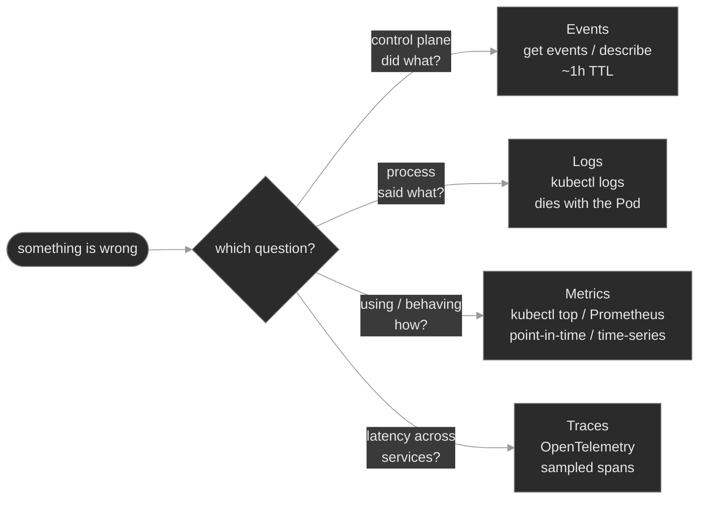

The load-bearing insight is the shared weakness: **the three built-in signals are all ephemeral.** Events expire, logs die with the Pod, `kubectl top` keeps no history. That's not a flaw to route around — it's the reason a production platform runs a durable layer on top: a log store fed by node collectors, a Prometheus time-series database fed by scrapes, a tracing backend fed by spans. `kubectl` reads the live, expiring signal at 3am; the stack answers "what happened last Tuesday." Know both, and know which one you're holding.

### Concept walkthrough

#### Events — the control plane narrating itself

An Event is not a log line. Your app doesn't write it; the **control plane** does — the scheduler, the kubelet, and the various controllers emit an Event whenever they do something worth recording *to* an object. `Scheduled`, `Pulling`, `Pulled`, `Created`, `Started` are the Normal lifecycle beats; `FailedScheduling`, `Unhealthy`, `BackOff`, `Killing`, `OOMKilling`, `FailedMount` are the Warnings. When a Pod is `Pending` and its own logs don't exist yet, the event stream is the *only* signal that exists.

Each Event is a structured object worth reading field by field<sup><a href="https://kubernetes.io/docs/reference/kubernetes-api/cluster-resources/event-v1/">[1]</a></sup>:

```text
LAST SEEN   TYPE      REASON      OBJECT             MESSAGE
2m (x47)    Warning   Unhealthy   pod/reg-proxy-0    Readiness probe failed: HTTP probe failed with statuscode: 404
```

- `type` — `Normal` or `Warning`. In triage you filter to `Warning` first.
- `reason` — the machine token (`Unhealthy`). It's stable, so it's the best thing to select on.
- `involvedObject` — what it's about (`pod/reg-proxy-0`). This is the key `describe` uses.
- `count` / `lastTimestamp` — the `x47` means this exact event fired 47 times and was aggregated into one row. A high, climbing count is a fast, ongoing failure; a count of 1 an hour ago is stale.

Two properties shape how you use them. Events are **namespaced** — `kubectl get events` shows only the current namespace, so reach for `-A` when you don't yet know where the problem lives. And they're **ephemeral**: the API server garbage-collects them after a TTL (~1 hour)<sup><a href="https://kubernetes.io/docs/concepts/cluster-administration/logging/">[2]</a></sup>, so a failure that recovered two hours ago has *no* events left — which is why teams run an event exporter to ship them somewhere durable.

Two ways to read them, for two questions. `kubectl describe <kind> <name>` shows the events for **one object** (matching `involvedObject` to its UID) — when you know the suspect. `kubectl get events` surveys the **stream**, shaped with selectors<sup><a href="https://kubernetes.io/docs/tasks/debug/debug-application/debug-running-pod/">[3]</a></sup>:

```bash
kubectl get events -n signaling --sort-by=.lastTimestamp          # oldest→newest; read the bottom
kubectl get events -A --field-selector type=Warning               # only the trouble, cluster-wide
kubectl get events -n signaling --field-selector reason=BackOff,involvedObject.name=reg-proxy-0
```

`get events` is unsorted by default — always add `--sort-by=.lastTimestamp` or you'll misread the order. When you don't know the object, survey by `type=Warning`; when you do, `describe` it.

<details>
<summary>📖 Going deeper: why <code>count</code> exists, and the two Event API groups<sup><a href="https://kubernetes.io/docs/reference/kubernetes-api/cluster-resources/event-v1/">[1]</a></sup></summary>

A crashlooping container could emit a `BackOff` event every ten seconds — thousands per hour, enough to strain etcd. Kubernetes deduplicates: identical events (same `reason`, `involvedObject`, message) collapse into one object whose `count` increments and `lastTimestamp` advances. So a `kubectl get events` row reading `(x2033)` is an aggregate, not a sample — and that `count` *is* the severity signal: the same Warning is a one-off at `count=1` and an active fire at `count=2033`.

Historically there are two Event APIs: the original `core/v1` `Event` that `describe` reads, and a newer `events.k8s.io/v1` carrying richer, better-deduplicated events that the kubelet emits through. `kubectl get events` shows a unified view; you'll see both `.involvedObject` (core) and `.regarding` (events.k8s.io) only if you dump raw YAML.

</details>

#### Logs — what the process said, and the contract behind them

`kubectl logs <pod>` returns a container's output — and it returns *only* stdout and stderr, because that's the entire **container logging contract**. The kubelet redirects the container's stdout/stderr to a file on the node (under `/var/log/pods/…`) and `kubectl logs` streams that file back through the API server<sup><a href="https://kubernetes.io/docs/concepts/cluster-administration/logging/">[2]</a></sup>. The corollary bites people: an app that writes its "logs" to a file *inside* the container — `/var/log/app/app.log` — produces an empty `kubectl logs`, because nothing went to stdout. The app is running and logging; you just can't see it. The fix is to make the app log to stdout (the twelve-factor convention), or, when you can't change the app, to run a **streaming sidecar**.

The flags that matter when it counts<sup><a href="https://kubernetes.io/docs/reference/kubectl/generated/kubectl_logs/">[4]</a></sup>:

- `--previous` (`-p`) — the logs of the **prior terminated instance**. When a container has restarted, `kubectl logs` shows the *fresh* start (often clean and misleading); `--previous` shows why the last one died. This is the single most important logs flag at 3am.
- `-c <container>` / `--all-containers` — a Pod with more than one container makes `kubectl logs` ambiguous; name the container, or read them all. A `1/2` Pod means one of two containers is down — read *that* one.
- `--since=15m` / `--tail=100` — scope the firehose to a window or a count.
- `-f` — follow (stream) live.

The other half of the story is that **logs are as ephemeral as the Pod**. They're files on the node, and the kubelet rotates them (a default cap around 10Mi per file, a few files kept — older lines are discarded)<sup><a href="https://kubernetes.io/docs/concepts/cluster-administration/logging/">[2]</a></sup>. Delete the Pod and the files go with it; `kubectl logs` on a gone Pod returns nothing. So anything you'll want *after* the Pod is gone has to be shipped off the node while it's still there — which is what the durable log stack does.

<details>
<summary>📖 Going deeper: the two log-shipping patterns<sup><a href="https://kubernetes.io/docs/concepts/cluster-administration/logging/">[2]</a></sup></summary>

Two standard ways to get logs off the node into a central store, for two situations.

- **Node-level collector (a DaemonSet).** One agent per node (Fluent Bit, Vector, Fluentd) tails every container's stdout/stderr files under `/var/log/pods`, tags each line with its Pod/namespace/labels, and forwards to a store (Loki, Elasticsearch, a cloud sink). This is the default: zero-config for the app *as long as it logs to stdout*, one agent covers every Pod on the node. It's why "log to stdout" is the whole contract — do that and the platform's collector already ships you.

- **Streaming sidecar.** When an app insists on writing to a file (a legacy binary, an access log it won't send to stdout), add a second container that shares a volume with the app and does `tail -F /var/log/app/app.log` to *its* stdout, so the file's contents flow to stdout and the node collector picks them up like any other container. It costs a container and some memory per Pod — the fallback, not the default.

</details>

#### Metrics — two pipelines, and never confuse them

"Metrics" in Kubernetes means two entirely separate pipelines. Confusing them is the most common metrics mistake, so pin the distinction first.

**Pipeline 1 — the Resource Metrics API.** `metrics-server` scrapes each kubelet for live CPU and memory per Pod and Node and serves it on the `metrics.k8s.io` API<sup><a href="https://kubernetes.io/docs/tasks/debug/debug-cluster/resource-metrics-pipeline/">[5]</a></sup>. That's the pipeline behind `kubectl top`:

```bash
kubectl top nodes                 # per-node CPU/memory usage vs. capacity
kubectl top pods -A --sort-by=memory
```

It is deliberately minimal: CPU and memory only, *right now* only, no history, no custom numbers. It answers "how loaded is this?" and feeds the HPA, which divides live usage by the Pod's **request** to get the utilization it scales on (M09). No metrics-server → `kubectl top` errors and the HPA reads `<unknown>` — same pipeline, same failure.

**Pipeline 2 — application metrics (the Prometheus model).** Anything richer — calls per second, queue depth, error ratio, p99 latency — the *workload* has to publish about itself, and the ecosystem standard is **Prometheus**<sup><a href="https://prometheus.io/docs/concepts/data_model/">[6]</a></sup>. The model is **pull**: each workload exposes an HTTP endpoint (by convention `/metrics`) in a plain-text **exposition format**, and Prometheus periodically *scrapes* it:

```text
## HELP sip_calls_active Currently active SIP calls.
## TYPE sip_calls_active gauge
sip_calls_active 42
## HELP sip_calls_total Total SIP calls processed since start.
## TYPE sip_calls_total counter
sip_calls_total 18734
```

The four metric types are worth knowing on sight: a **counter** only goes up (totals — you `rate()` it), a **gauge** goes up and down (a level — active calls, memory), a **histogram** buckets observations (latency distributions, for percentiles), and a **summary** is a client-side percentile. The workload doesn't push anywhere; it exposes and waits.

How does Prometheus know *what* to scrape? The lightweight convention is **Pod annotations** — `prometheus.io/scrape: "true"`, `prometheus.io/port: "80"`, `prometheus.io/path: "/metrics"`. The production one is the **Prometheus Operator**: install Prometheus as an operator (the CRD/controller pattern) and declare targets as **ServiceMonitor** or **PodMonitor** custom resources — "scrape every Pod behind this Service, on the port named `metrics`"<sup><a href="https://github.com/prometheus-operator/prometheus-operator/blob/main/Documentation/design.md">[7]</a></sup>. Either way the failure mode is the same and specific: if the declared **port** doesn't match the port the workload serves `/metrics` on, the scrape is refused, the target shows **DOWN**, and every graph for it goes flat — while the app is healthy and `kubectl top` (pipeline 1) still works. A metrics gap with a green `kubectl top` is almost always a pipeline-2 scrape problem, not a sick app. (One caution: every distinct label *value* is its own time series, so a label like `call_id` with millions of values — **high cardinality** — can bury the database. Keep labels bounded.)

#### Traces — the fourth signal

Metrics aggregate (p99 across *all* calls); logs are per-process (what *this* container said). Neither answers "for *this one slow call*, which of the eight services it touched ate the 900ms?" That's **distributed tracing**. A **span** is one timed operation — one service handling one request, with a start, duration, and attributes. A **trace** is the tree of spans for a single request as it flows `sip-proxy → sip-router → sip-app → route-engine`, stitched together because each hop propagates a shared **trace ID** (the W3C `traceparent` header). Read the trace and the slow hop is the long bar.

**OpenTelemetry (OTel)** is the vendor-neutral standard for producing this: instrumentation SDKs, the **OTLP** wire format, and the **Collector** — an in-cluster pipeline that receives spans, processes them, and exports to a backend (Jaeger, Tempo, a vendor)<sup><a href="https://opentelemetry.io/docs/concepts/signals/traces/">[8]</a></sup>. It isn't installed here — tracing needs app instrumentation and a backend a single lab can't stand up — so you'll learn its shape, not run it. The reflex to carry: when metrics say "slow" and logs say "each service looks fine," the missing signal is a trace across the call path.

### Hands-on

Four steps in the baseline, three break/fix scenarios — all on the full Polyphone fleet on a 2-node cluster. The baseline tours a healthy version of each signal; each break/fix breaks the reading of exactly one signal so you practice a single instrument at a time.

- **`baseline/`** — read all three live signals on a healthy fleet: survey the **event** stream (`--field-selector`, `--sort-by`, the `type`/`reason`/`count` fields); pull **logs** with `--previous`, `-c`, `--since`; read **resource metrics** with `kubectl top`; and inspect a healthy **application-metrics** target — its `/metrics` exposition output and `prometheus.io/*` annotations. What "observable" looks like before a signal goes dark.
- **`breakfix-01-logs-to-stdout`** — `session-logger` is `Running 1/1` but `kubectl logs` shows only a startup banner: the app writes its real logs to a file inside the container, breaking the stdout contract. Tests recognizing an empty-but-healthy log and restoring visibility (stdout, or a streaming sidecar).
- **`breakfix-02-sidecar-crashloop`** — `sip-monitor` sits at `1/2`: the app container is fine, but its telemetry **sidecar** crashloops. Tests reading *which* container the event stream names, then `logs -c <sidecar> --previous` to see why the dead instance died.
- **`breakfix-03-metrics-scrape-port`** — `call-metrics` is healthy and `kubectl top` works, but its dashboards are flat: the `prometheus.io/port` annotation points at a port nothing serves, so the scrape target is DOWN. Tests the two-pipeline distinction and fixing a scrape target.

Check yourself against `ANSWER-KEY.md` after each.

### Common failure modes

| Symptom | Likely cause | Where to look |
|---------|--------------|---------------|
| `kubectl logs` is empty but the Pod is `Running` | App writes logs to a file, not stdout/stderr | `kubectl exec … -- ls /var/log/…`; the container's log destination |
| `kubectl logs` shows a clean fresh start for a Pod that keeps restarting | You're reading the *current* instance, not the one that died | `kubectl logs --previous`; `describe` → `Last State` |
| Pod `1/2` (or `2/3`) and nothing obvious wrong | One container of several is down | `describe` events name the container; `kubectl logs -c <container> [--previous]` |
| A failure "has no events" | Events aged out (TTL), or you're in the wrong namespace | shorten the window / `get events -A`; capture events durably next time |
| `get events` looks out of order | It's unsorted by default | add `--sort-by=.lastTimestamp` |
| `kubectl top` errors: `Metrics API not available` | metrics-server missing/unhealthy (also breaks HPA) | metrics-server Deployment in `kube-system`; wait if it just started |
| App dashboards flat, but app healthy and `kubectl top` fine | Scrape target DOWN — wrong port/path (pipeline 2, not pipeline 1) | the `prometheus.io/port` (or ServiceMonitor port) vs. the port `/metrics` actually serves on |
| Prometheus slow / TSDB bloated | High-cardinality label (unbounded values) | the label set on the offending metric |

### Recap

- **Three built-in signals, three questions.** Events = what the *control plane* did; logs = what the *process* said; metrics = how much it's *using* / how it's *behaving*. Match the question to the signal before you start typing, and you skip the hour spent reading the wrong one.
- **All three are ephemeral** — events expire (~1h TTL), logs die with the Pod, `kubectl top` keeps no history. That impermanence is the whole reason a durable stack (log store, metrics TSDB, tracing backend) exists. `kubectl` reads live; the stack reads history.
- **Events are structured objects, not text.** Read `type`, `reason`, `involvedObject`, and `count`; `describe` for one object, `get events --field-selector type=Warning --sort-by=.lastTimestamp` to survey. A climbing `count` is an active fire.
- **The logging contract is stdout/stderr only.** An app that logs to a file is invisible to `kubectl logs` — fix it with stdout or a streaming sidecar. And `--previous` (plus `-c` for the right container) is how you read a container that already died.
- **Metrics are two pipelines.** The Resource Metrics API (metrics-server → `kubectl top`, HPA) is CPU/memory, point-in-time. Application metrics (Prometheus pull, `/metrics` exposition, ServiceMonitor) are everything else. A metrics gap with a healthy `kubectl top` is a scrape problem, not a sick app.

### Production thinking

- A failure happened at 02:00, self-healed by 02:20, and paged no one; at 09:00 you're asked what happened. The Pod's logs are gone (it was replaced), its events have aged out, and `kubectl top` has no history. Which of the three signals *could* have told the story if it had been shipped somewhere durable, and what would you stand up so next time it isn't a guess?
- A workload's `/metrics` endpoint adds a label keyed on `call_id`. Within a day Prometheus is slow and its disk is filling. What happened, why is unbounded label cardinality so expensive in a time-series database, and what's the review rule that keeps it from recurring?
- You standardize on "everything logs to stdout" so one node-level collector ships the whole fleet. A vendored component only writes to a file and can't be changed. What do you add for just that Pod, what does it cost, and why is that the exception rather than the default?

### References

1. Kubernetes — Event API reference: https://kubernetes.io/docs/reference/kubernetes-api/cluster-resources/event-v1/
2. Kubernetes — Logging Architecture: https://kubernetes.io/docs/concepts/cluster-administration/logging/
3. Kubernetes — Debug Running Pods: https://kubernetes.io/docs/tasks/debug/debug-application/debug-running-pod/
4. Kubernetes — `kubectl logs` reference: https://kubernetes.io/docs/reference/kubectl/generated/kubectl_logs/
5. Kubernetes — Resource Metrics Pipeline: https://kubernetes.io/docs/tasks/debug/debug-cluster/resource-metrics-pipeline/
6. Prometheus — Data model and metric types: https://prometheus.io/docs/concepts/data_model/
7. Prometheus Operator — Design (ServiceMonitor/PodMonitor): https://github.com/prometheus-operator/prometheus-operator/blob/main/Documentation/design.md
8. OpenTelemetry — Traces (spans, context, the Collector): https://opentelemetry.io/docs/concepts/signals/traces/


---

## Break/Fix Practice

## Break/fix 01 — Logs: an app that writes to a file

**Symptom — what you'd actually see:**

`session-logger` in `app-services` is `Running 1/1`, no restarts — healthy by every status check — but `kubectl logs deploy/session-logger` returns a single startup line and nothing else. The workload is obviously doing work (it was deployed to record per-session activity), yet its log is empty.

**Think about this before you open the answer:**

Recognizing that an empty log on a healthy Pod is a *logging-contract* problem, and bridging file output to stdout. Self-grading questions:

- Did you read the Pod as healthy (Running, 0 restarts) and treat the empty log as "not logging to stdout," rather than assuming a crash?
- Did the startup banner (or an `exec … ls /var/log`) lead you to the file, instead of concluding "this app has no logs"?
- Did you fix it by getting output to stdout (reconfigure or sidecar), rather than telling people to `exec` in and `tail` the file forever?

<details>
<summary><b>Click to reveal: diagnostic commands, root cause, exact fix, verify</b></summary>

**Root cause:**

The container writes its real output to a file *inside* the container, `/var/log/app/session.log`, instead of to stdout. The kubelet's logging pipeline captures **stdout/stderr only**, so `kubectl logs` sees only the one banner line the app prints to stdout at startup. The app is logging correctly *to the wrong place*; nothing is broken except the logging contract<sup><a href="https://kubernetes.io/docs/concepts/cluster-administration/logging/">[2]</a></sup>.

**Diagnostic commands (run in this order):**

```bash
# 1. Healthy Pod — not a crash, not scheduling
kubectl get pods -n app-services -l app=session-logger            # Running 1/1, 0 restarts

# 2. The log is nearly empty — and the one line it prints is the clue
kubectl logs -n app-services deploy/session-logger
#    [session-logger] starting; writing session events to /var/log/app/session.log
#    ^ it told you where it logs: a FILE, not stdout

# 3. Confirm the output is on disk, not on stdout
kubectl exec -n app-services deploy/session-logger -- ls -l /var/log/app
kubectl exec -n app-services deploy/session-logger -- tail -5 /var/log/app/session.log
#    a growing session.log full of "session sess-N established ..." lines
```

A `Running` Pod with an empty log is not a dead end — it means the app isn't writing to stdout. Read the banner (it often names the file); confirm with `exec`.

**Exact fix:**

Get that output onto stdout. Either reconfigure the app (preferred when you own it), or add a streaming sidecar (when you can't change it — the file already lives on a shared `emptyDir`):

```bash
# Option A — log to stdout (the twelve-factor default)
kubectl edit deployment session-logger -n app-services
#   in containers[0].args, drop the "  >> /var/log/app/session.log" redirect → echo to stdout

# Option B — streaming sidecar that tails the file to its stdout
kubectl patch deployment session-logger -n app-services --type=json -p='[
  {"op":"add","path":"/spec/template/spec/containers/-","value":{
    "name":"log-stream","image":"busybox:1.36",
    "command":["/bin/sh","-c","touch /var/log/app/session.log; exec tail -f /var/log/app/session.log"],
    "volumeMounts":[{"name":"logs","mountPath":"/var/log/app"}]}}]'
```

**Verify:**

```bash
kubectl rollout status deployment session-logger -n app-services --timeout=60s
kubectl logs -n app-services deploy/session-logger --all-containers=true --tail=6
#    the "session sess-N established ..." lines are now visible via kubectl logs
```

Use `--all-containers` — after the sidecar fix the lines come from `log-stream`, not `app`.

**Production thinking:**

The whole log stack keys on stdout/stderr — a node-level collector (Fluent Bit/Vector as a DaemonSet) tails every container's stdout and ships it centrally. An app that logs to a file is invisible to all of it, so its logs never leave the node and vanish when the Pod is replaced. Standardize on "log to stdout"; reserve the streaming sidecar for vendored binaries you genuinely can't change, and know it costs a container and some memory per Pod.

</details>

---

## Break/fix 02 — Logs & Events: a crashlooping sidecar

**Symptom — what you'd actually see:**

`sip-monitor` in `signaling` sits at `1/2` with a climbing restart count and `STATUS CrashLoopBackOff`. The SIP monitoring app itself serves fine; one of its two containers keeps dying, and nothing paged because the app never went down.

**Think about this before you open the answer:**

Isolating one failing container in a multi-container Pod, and the `-c` + `--previous` pair. Self-grading questions:

- Did the `1/2` push you to find *which* container (per-container status / the `BackOff` event) before touching anything?
- Did you reach for `--previous` — because the current instance is mid-restart and only the dead one carries the error — rather than reading empty live logs?
- Did you read `-c metrics-agent` specifically, not the default (`app`) container that was fine all along?

<details>
<summary><b>Click to reveal: diagnostic commands, root cause, exact fix, verify</b></summary>

**Root cause:**

The Pod runs two containers — `app` (nginx, healthy) and `metrics-agent` (a telemetry sidecar). The sidecar's command execs `/usr/local/bin/metrics-agent`, a binary that isn't present in its `busybox` image, so it exits 127 immediately and the kubelet restarts it forever. The Pod can never be Ready (readiness requires *all* containers), so it stays `1/2` and that workload's telemetry export is dark<sup><a href="https://kubernetes.io/docs/tasks/debug/debug-application/debug-running-pod/">[3]</a></sup>.

**Diagnostic commands (run in this order):**

```bash
# 1. 1/2 and CrashLoopBackOff — one of two containers is down
kubectl get pods -n signaling -l app=sip-monitor            # READY 1/2, RESTARTS climbing

# 2. WHICH container? Per-container status names it
kubectl get pod -n signaling -l app=sip-monitor -o \
  custom-columns='CONTAINER:.status.containerStatuses[*].name,READY:.status.containerStatuses[*].ready,RESTARTS:.status.containerStatuses[*].restartCount'
#    app=true, metrics-agent=false (restarts climbing)

# 3. The event stream names it too
kubectl describe pod -n signaling -l app=sip-monitor | sed -n '/Events:/,$p'
#    Warning  BackOff  ...  Back-off restarting failed container=metrics-agent

# 4. Read the DEAD instance's logs — the live one is mid-backoff
kubectl logs -n signaling deploy/sip-monitor -c metrics-agent --previous
#    [metrics-agent] starting; exporting sip-monitor telemetry
#    /bin/sh: exec: line 3: /usr/local/bin/metrics-agent: not found     (exit 127)
```

`get pods` aggregates; the per-container status and the `BackOff` event name the failing container; `-c … --previous` reads why the dead instance died.

**Exact fix:**

Correct the sidecar's command so it runs something the image can execute (in production you'd fix the image or the binary path). `metrics-agent` is container index `1`:

```bash
kubectl patch deployment sip-monitor -n signaling --type=json -p='[
  {"op":"replace","path":"/spec/template/spec/containers/1/args/0",
   "value":"echo \"[metrics-agent] starting; exporting sip-monitor telemetry\"\nwhile true; do echo \"[metrics-agent] exported telemetry batch\"; sleep 30; done\n"}]'
```

**Verify:**

```bash
kubectl rollout status deployment sip-monitor -n signaling --timeout=90s
kubectl get pods -n signaling -l app=sip-monitor                 # READY 2/2, Running
kubectl logs -n signaling deploy/sip-monitor -c metrics-agent --tail=3   # exporting again
```

**Production thinking:**

Sidecars *are* the observability topology — log shippers, metrics agents, mesh proxies all ride alongside the app. When one dies quietly, the app keeps serving and no alert fires, but you go blind on that workload. Alert on Pods that are `Ready < desired` for more than a few minutes (not just on Pods that are fully down), and treat a crashlooping telemetry sidecar as an incident, because the thing that would normally tell you something is wrong is itself the thing that's broken.

</details>

---

## Break/fix 03 — Metrics: a scrape target that's DOWN

**Symptom — what you'd actually see:**

`call-metrics` in `analytics` is `Running 1/1`, `kubectl top` shows it consuming CPU/memory normally, and its `/metrics` endpoint serves fine — but every dashboard and alert built on its metrics has gone flat. No new data is arriving.

**Think about this before you open the answer:**

The two-pipelines distinction, and fixing a scrape target rather than the app. Self-grading questions:

- Did a healthy `kubectl top` tell you the app and metrics-server were fine, steering you to the scrape rather than the workload?
- Did you prove the app exposes `/metrics` on its real port *before* concluding the app was fine — so the fault had to be in discovery/scraping?
- Did you compare the advertised scrape port to the serving port, and fix the annotation (or ServiceMonitor), not the app?

<details>
<summary><b>Click to reveal: diagnostic commands, root cause, exact fix, verify</b></summary>

**Root cause:**

Two separate metrics pipelines. The **resource metrics** pipeline (metrics-server → `kubectl top`) is healthy, which is why `top` still works. The **application metrics** pipeline is broken: the Pod's `prometheus.io/port` annotation advertises `9090`, but the container serves `/metrics` on `80`. A Prometheus discovers the Pod by its annotations and scrapes `podIP:9090`, gets connection-refused, and marks the target **DOWN** — so the metric never arrives and the graph flatlines<sup><a href="https://prometheus.io/docs/concepts/data_model/">[6]</a></sup>. The app is healthy; the scrape target is misconfigured.

**Diagnostic commands (run in this order):**

```bash
# 1. App healthy, and the OTHER pipeline (kubectl top) works
kubectl get pods -n analytics -l app=call-metrics          # Running 1/1
kubectl top  pod  -n analytics -l app=call-metrics          # CPU/mem returned → pipeline 1 fine

# 2. The app really exposes /metrics — on its real port (80)
POD_IP=$(kubectl get pod -n analytics -l app=call-metrics -o jsonpath='{.items[0].status.podIP}')
kubectl run obs-curl --rm -i --restart=Never --image=curlimages/curl:8.11.1 -n analytics \
  -- curl -s http://$POD_IP:80/metrics                      # exposition output returns

# 3. But the scrape annotation points elsewhere
kubectl get pod -n analytics -l app=call-metrics \
  -o jsonpath='{.items[0].metadata.annotations.prometheus\.io/port}{"\n"}'   # 9090

# 4. Reproduce the scrape at the advertised port → refused
kubectl run obs-curl --rm -i --restart=Never --image=curlimages/curl:8.11.1 -n analytics \
  -- curl -s -m 5 -o /dev/null -w "HTTP %{http_code}\n" http://$POD_IP:9090/metrics   # HTTP 000
```

A healthy `kubectl top` with flat app dashboards is the tell: pipeline 1 is fine, so the fault is in pipeline 2 — the scrape.

**Exact fix:**

Point the scrape port at the port `/metrics` is actually served on (80). With annotations:

```bash
kubectl patch deployment call-metrics -n analytics -p \
  '{"spec":{"template":{"metadata":{"annotations":{"prometheus.io/port":"80"}}}}}'
# With the Prometheus Operator, you'd fix the ServiceMonitor's `port` instead — same mismatch.
```

**Verify:**

```bash
kubectl rollout status deployment call-metrics -n analytics --timeout=60s
kubectl get deploy call-metrics -n analytics \
  -o jsonpath='{.spec.template.metadata.annotations.prometheus\.io/port}{"\n"}'   # 80
POD_IP=$(kubectl get pod -n analytics -l app=call-metrics -o jsonpath='{.items[0].status.podIP}')
kubectl run obs-curl --rm -i --restart=Never --image=curlimages/curl:8.11.1 -n analytics \
  -- curl -s -o /dev/null -w "HTTP %{http_code}\n" http://$POD_IP:80/metrics        # HTTP 200
```

**Production thinking:**

A one-digit port typo silently drops an entire workload from monitoring — no error on the app, no failed deploy, just a target that reads DOWN in Prometheus and graphs that go flat. This is why teams alert on `up == 0` (the scrape-health metric Prometheus records for every target) in addition to app-level metrics: it catches the workload that fell out of monitoring before someone notices the dashboard is blank during an incident. Bake the scrape port into the same manifest as the container port so the two can't drift, and prefer a ServiceMonitor that references the port *by name* over a hard-coded number.

</details>

---


---

# `m14-networking-policy-ingress/`

## Concept

## M14 — Networking II: Policy & Ingress

> Two controls that shape traffic the Service layer leaves wide open: NetworkPolicy, which turns a flat, default-open pod network into segmented east-west lanes, and Ingress, the L7 front door for north-south HTTP — plus the failure signatures each one adds.

### What you'll learn

- Explain the NetworkPolicy model precisely: a pod is default-*allow* until a policy selects it, at which point it becomes default-*deny* for the covered direction — and every policy after that only *adds* permissions, never removes them
- Read a NetworkPolicy the way you read a Service: `podSelector` (who it governs), `policyTypes` (Ingress/Egress), and the `from`/`to` peers (`podSelector`, `namespaceSelector`, `ipBlock`) and `ports` that define what's allowed
- Get the peer-selector semantics right — `podSelector` alone is namespace-local, `namespaceSelector` reaches across namespaces, and the two combined in one list element is an **AND**, not an OR
- Recognize the policy-drop signature: a dropped packet *hangs to a timeout*, distinct from DNS `NXDOMAIN` and from `connection refused` — the fourth branch of M04's connectivity differential
- Explain what an Ingress is and what it is not: an L7 HTTP routing object that is inert data until an **Ingress controller** claims it via an `IngressClass` and forwards matched requests to a backend Service
- Work an Ingress failure top to bottom (no ADDRESS, `404`, or `503`): from controller present, to class matched, to the backend Service's port and endpoints

### Why it matters

M04 gave every workload a stable name and got traffic flowing. What it left in place is a flat network: by default, any pod can open a connection to any other pod, in any namespace. That's fine until it isn't — a compromised `sip-app` that reaches `cdr-storage` and `provisioning` directly, a noisy tenant hammering another's service, an auditor asking "prove only the billing plane can reach the billing database." **NetworkPolicy is the in-cluster segmentation control** that answers those. It is also the control most likely to cause a self-inflicted outage, because turning it on changes the default: the first policy you apply to a pod stops being additive and starts *denying everything you didn't explicitly allow*. That includes, famously, the pod's own DNS lookups, if you reach for egress.

Ingress is the other half. A ClusterIP Service is reachable only inside the cluster; something has to accept HTTP from the outside world and route it to the right Service by hostname and path. **Ingress is that L7 front door**, and its defining trap is that the object does nothing on its own — it is a routing spec that a separate controller has to pick up and act on. An Ingress that looks perfect in `kubectl get ingress` routes nothing if no controller claimed it, and returns `503` if the Service it names has no endpoints. Both controls fail quietly, in ways the top-line objects don't show, which is exactly why an SRE has to know where to look.

### Scope

**Covers:** the NetworkPolicy object end to end — `podSelector`, `policyTypes`, `ingress`/`egress` rules, the three peer kinds (`podSelector`, `namespaceSelector`, `ipBlock`) and the `ports` they gate; the default-allow → default-deny transition and the additive-allow model; that enforcement is the CNI's job, not the API server's (so a policy on a non-enforcing CNI is a silent no-op); cross-namespace and multi-tenant isolation patterns; the egress-breaks-DNS trap. On the north-south side: the Ingress object (`ingressClassName`, rules, `host`, `path`, `pathType`, backend Service + port), the Ingress controller and `IngressClass`, and the request path controller → Service → EndpointSlice → Pod. Throughout: the timeout / refused / `NXDOMAIN` / `404` / `503` differential.

**Doesn't cover:** the CNI's own L3 dataplane (the overlay, routing, and pod-to-pod plumbing *beneath* policy), assumed working here → M22; service mesh and L7 mTLS / traffic policy (Istio, Linkerd) → M15; the Gateway API in depth (named here as Ingress's successor); admission-time policy engines that validate or mutate objects rather than shape packets (Kyverno, OPA Gatekeeper) → M20–M21; and cloud LoadBalancer provisioning specifics (M04 covered the Service *types*).

**Assumes:** M04 is load-bearing — Services, selectors, the EndpointSlice, ClusterIP, cluster DNS, and the connectivity differential (`NXDOMAIN` / empty-endpoints / refused). This module adds two more failure branches to that same differential. M01 labels and selectors are the vocabulary NetworkPolicy peers are written in; M00 namespaces are the boundary both controls operate across.

### Vocabulary

| Term | Definition |
|------|------------|
| **NetworkPolicy** | A namespaced object listing which traffic is *allowed* to or from a set of pods. A whitelist: selecting a pod denies everything not listed. |
| **`podSelector`** (of the policy) | The label selector choosing which pods in the policy's namespace it governs. Empty `{}` matches **every** pod in the namespace. |
| **`policyTypes`** | The directions governed: `Ingress`, `Egress`, or both. A direction listed with no matching rules means "deny all in that direction." |
| **ingress / egress rule** | An allow rule. `ingress` lists sources (`from`) permitted to connect *to* the pods; `egress` lists destinations (`to`) they may connect *out to*. Each carries optional `ports`. |
| **peer** | An entry under `from`/`to`: `podSelector` (pods in *this* namespace), `namespaceSelector` (pods in matching namespaces), or `ipBlock` (a CIDR, for non-pod IPs). `podSelector` + `namespaceSelector` in one element is an **AND**. |
| **default-deny** | A policy that selects pods (often `podSelector: {}`) and names a direction with no allow rules — denying all traffic that way. The baseline before adding specific allows. |
| **additive-allow** | Multiple policies on the same pod are **unioned** — allowed if *any* policy allows it. Nothing *subtracts* an allow; there is no "deny rule." |
| **CNI enforcement** | Policy is enforced by the network plugin (Calico, Cilium, Weave, …), not the API server. On a plugin that doesn't implement it (e.g. plain Flannel), policies are stored but never enforced. |
| **Ingress** | A namespaced object of L7 (HTTP/HTTPS) routing rules — by `host` and `path` — to backend Services. A spec only; a controller does the routing. |
| **Ingress controller** | A running workload (e.g. ingress-nginx) that watches Ingress objects and proxies external HTTP to backends. Without one, Ingress objects do nothing. |
| **IngressClass** | Names a controller. An Ingress's `ingressClassName` selects which controller claims it; an unclassed Ingress no controller defaults to is claimed by nobody. |
| **`pathType` / backend** | `pathType` (`Prefix`, `Exact`, `ImplementationSpecific`) decides how a rule's `path` matches. The `backend.service` names the target Service and **port**. |

### Mental model

Hold the two controls as two axes of traffic. **East-west** is pod-to-pod, inside the cluster; NetworkPolicy shapes it at L3/L4 (IPs and ports). **North-south** is outside-to-inside HTTP; Ingress shapes it at L7 (hostnames and paths). They are independent — a request from the internet through the Ingress becomes east-west pod traffic the moment the controller forwards it, and a NetworkPolicy can block that second hop even when the Ingress is perfect.

For NetworkPolicy, the one idea that prevents most outages: **a policy is a whitelist that switches on the moment it selects a pod.** Before any policy selects a pod, everything is allowed. The instant one does (even a policy that allows a single source), that pod is default-deny for the covered direction, and *only* the listed peers get through. More policies only ever *add* to the allowed set.

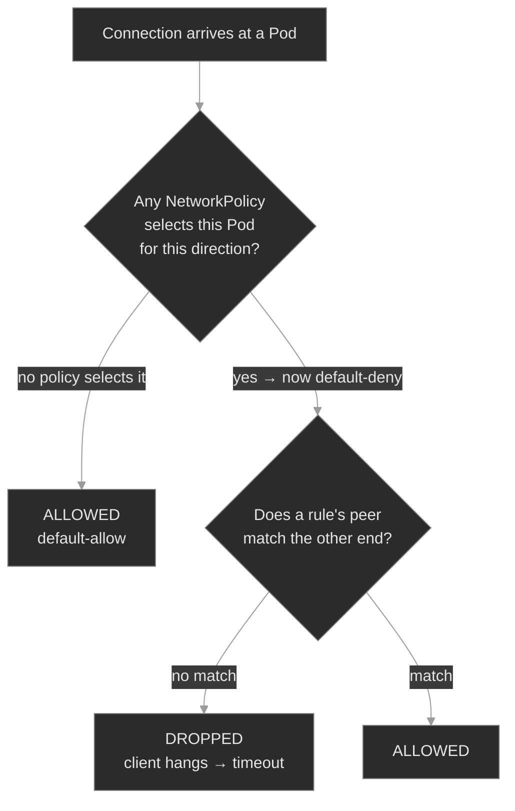

The red leaf is the signature that matters: a NetworkPolicy drop is *silent*. The packet is discarded, no RST comes back, and the client waits until it times out. That's the fourth branch of the M04 differential — `NXDOMAIN` (name didn't resolve), `connection refused` (reached a pod, no listener), empty-endpoints (Service had no backends), and now **timeout with everything else healthy** (a policy is dropping it)<sup><a href="https://kubernetes.io/docs/tasks/debug/debug-application/debug-service/">[7]</a></sup>.

North-south, an Ingress request walks a fixed chain, and each link has its own failure code:

```text
client ──HTTP, Host: portal.polyphone.example──▶ Ingress controller (claims class "nginx")
                                                   │  no rule matches host/path?  → 404
                                                   │  rule matches → backend Service:port
                                                   ▼
                                           Service ───▶ EndpointSlice
                                                   │  no endpoints / wrong port?  → 503
                                                   ▼
                                             backend Pod  (:80)
```

`get ingress` shows an ADDRESS only once a controller has claimed the object; a `404` means the request reached the controller but no rule matched; a `503` means a rule matched but the backend Service had nothing to send to. The M04 reflex holds — the client's status code says it broke; the Ingress rules and the backend's endpoints say *where*.

### Concept walkthrough

#### The NetworkPolicy model: default-allow until you say otherwise

A NetworkPolicy is a namespaced whitelist for pod traffic<sup><a href="https://kubernetes.io/docs/concepts/services-networking/network-policies/">[1]</a></sup>. It has three moving parts: a `podSelector` that chooses which pods it governs (empty `{}` = the whole namespace), a `policyTypes` list naming the directions it controls (`Ingress`, `Egress`), and the `ingress`/`egress` rules listing allowed peers. The behavior that trips everyone: **selecting a pod for a direction flips that pod's default for that direction from allow to deny.** A pod that no policy selects accepts traffic from anywhere; the first policy to select it accepts traffic only from the peers that policy (and any other policy selecting it) lists.

That gives the canonical baseline — a *default-deny* — as a policy with no rules at all<sup><a href="https://kubernetes.io/docs/tasks/administer-cluster/declare-network-policy/">[2]</a></sup>:

```yaml
apiVersion: networking.k8s.io/v1
kind: NetworkPolicy
metadata: { name: default-deny-ingress, namespace: media }
spec:
  podSelector: {}          # every pod in `media`
  policyTypes: [Ingress]   # governs ingress…
  # …with no `ingress:` rules → deny all ingress
```

Apply that and every pod in `media` stops accepting connections. You then *open* specific paths by adding more policies. Here is the second load-bearing fact: **policies are additive.** Multiple policies selecting the same pod are unioned; a connection is allowed if *any* of them allows it. There is no deny rule and no ordering: you cannot write "allow X but not Y," only "allow X" and "allow Z"<sup><a href="https://kubernetes.io/docs/concepts/services-networking/network-policies/">[1]</a></sup>. Isolation comes from the *absence* of an allow, never from a deny. So the default-deny above plus an "allow from the app plane" policy yields exactly: app-plane pods in, everything else dropped.

The direction distinction matters more than it looks. `policyTypes: [Ingress]` controls who may connect *to* these pods; it says nothing about what these pods may connect *out to*. Egress is a separate direction with its own trap, below. And one hard boundary: **enforcement is the CNI's job.** The API server accepts and stores a NetworkPolicy regardless of whether anything acts on it; the cluster's network plugin is what actually programs the drops<sup><a href="https://kubernetes.io/docs/concepts/services-networking/network-policies/">[1]</a></sup>. On a plugin that doesn't implement policy, your carefully-written default-deny is a stored object that changes nothing — a false sense of security that only a real connectivity test exposes. Confirm your CNI supports NetworkPolicy before you rely on one for isolation.

#### Peers and selectors: the AND/OR trap, and the DNS landmine

An allow rule lists *peers* — the other end of connections it permits. There are three kinds, and mixing them up is the most common way a policy that "looks right" still drops traffic<sup><a href="https://kubernetes.io/docs/concepts/services-networking/network-policies/">[1]</a></sup>:

- **`podSelector`** — pods, *in the policy's own namespace*, matching these labels. It does not reach across namespaces. On its own it means "these pods, here."
- **`namespaceSelector`** — pods in any namespace whose labels match. Namespaces need labels for this to select them; every namespace automatically carries `kubernetes.io/metadata.name: <name>`, which is the reliable handle for "namespace X"<sup><a href="https://kubernetes.io/docs/concepts/services-networking/network-policies/">[1]</a></sup>.
- **`ipBlock`** — a CIDR range, for traffic whose source isn't a pod (external clients, node IPs, a VPN range).

The trap is the difference between one peer element and two. YAML list structure encodes AND vs OR:

```yaml
## AND — sip-app pods that are ALSO in the app-services namespace
from:
  - namespaceSelector: { matchLabels: { kubernetes.io/metadata.name: app-services } }
    podSelector:       { matchLabels: { app: sip-app } }

## OR — anything in app-services, PLUS any sip-app pod in THIS namespace
from:
  - namespaceSelector: { matchLabels: { kubernetes.io/metadata.name: app-services } }
  - podSelector:       { matchLabels: { app: sip-app } }
```

The first is a single `from` element with two selectors — both must match, so it means "`sip-app` pods in `app-services`." The second is two elements: a union. The failure mode this produces: someone wants to allow `sip-app` from another namespace, writes `from: [{ podSelector: { app: sip-app } }]`, and it silently allows nothing, because a bare `podSelector` never leaves the policy's namespace and there's no `sip-app` pod there. The fix is to add the `namespaceSelector` (as an AND) so the peer actually reaches across the boundary. Cross-namespace allow *always* needs a `namespaceSelector`; a `podSelector` alone is a namespace-local statement.

Egress carries the landmine. The moment you add `Egress` to a pod's `policyTypes` with restrictive rules, you have to remember that DNS is egress too. A pod resolving `session-broker.media` sends a UDP/TCP packet to the CoreDNS Service on port 53; if your egress policy doesn't allow that, every name lookup times out and the symptom looks like "DNS is broken" when it's your own policy. A policy that governs only ingress never hits this — it doesn't touch the pod's outbound path — but any real egress lockdown must allow `kube-dns` explicitly.

<details>
<summary>📖 Going deeper: the egress default-deny that breaks every lookup<sup><a href="https://kubernetes.io/docs/concepts/services-networking/network-policies/">[1]</a></sup></summary>

A default-deny that includes egress is the single most common self-inflicted NetworkPolicy outage. This selects all pods and denies all outbound traffic:

```yaml
spec:
  podSelector: {}
  policyTypes: [Ingress, Egress]   # note: Egress too
```

Every pod it covers can now reach *nothing* outbound — including CoreDNS. Applications don't report "egress policy blocked me"; they report timeouts and DNS failures, because their first outbound act (a name lookup) is dropped. You debug it as a DNS incident in `kube-system` before realizing the block is a policy in the app's own namespace. The companion allow every egress lockdown needs:

```yaml
egress:
  - to:
      - namespaceSelector: { matchLabels: { kubernetes.io/metadata.name: kube-system } }
    ports:
      - { protocol: UDP, port: 53 }
      - { protocol: TCP, port: 53 }
```

The lesson generalizes: **an egress policy is only as complete as its list of allowed dependencies**, and DNS is a dependency of nearly everything. Reach for ingress isolation first (lower blast radius); add egress only when you've enumerated what the workload actually calls, DNS included.

</details>

#### Ingress: an L7 router that's inert without a controller

An Ingress object is a set of HTTP routing rules — "host `portal.polyphone.example`, path `/`, send to Service `portal-ui:80`"<sup><a href="https://kubernetes.io/docs/concepts/services-networking/ingress/">[3]</a></sup>. What makes it different from every object so far is that **it does nothing by itself.** A Service is acted on by kube-proxy, which every cluster runs; an Ingress is acted on by an **Ingress controller**, which is an ordinary workload someone has to install and which many clusters don't have<sup><a href="https://kubernetes.io/docs/concepts/services-networking/ingress-controllers/">[4]</a></sup>. The controller watches Ingress objects, and for each rule programs its proxy (nginx, in ingress-nginx's case) to accept the named host/path and forward to the backend Service.

The link between object and controller is the **IngressClass**. An Ingress sets `ingressClassName: nginx`; the controller claims Ingresses whose class names it. Set no class, and unless a controller is marked default, *nobody* claims the object — it sits there with no ADDRESS and routes nothing. That empty ADDRESS column is the first diagnostic: no ADDRESS means no controller took ownership (missing/unknown class, or no controller running at all).

Once a controller owns the Ingress, the request path is the M04 path with an L7 hop bolted on the front:

```yaml
apiVersion: networking.k8s.io/v1
kind: Ingress
metadata: { name: portal, namespace: admin-portal }
spec:
  ingressClassName: nginx
  rules:
    - host: portal.polyphone.example
      http:
        paths:
          - path: /
            pathType: Prefix
            backend:
              service:
                name: portal-ui      # a real Service in this namespace…
                port: { number: 80 } # …and a port the Service actually exposes
```

The controller resolves `backend.service` to that Service's EndpointSlice and load-balances across the Ready pods behind it, so an Ingress inherits every Service failure mode from M04. If the backend Service name is wrong, or the port doesn't match one the Service exposes, or the Service has no Ready endpoints, the controller has nowhere to forward the matched request and answers **`503`**. A **`404`** is different and earlier: the request reached the controller but no rule matched its host or path (wrong `host`, wrong `pathType`, a typo in `path`). Reading `503` vs `404` tells you which half to inspect: `503` is a backend problem (Service/port/endpoints), `404` is a routing-rule problem (host/path).

<details>
<summary>📖 Going deeper: `pathType`, and why Ingress is being succeeded by the Gateway API<sup><a href="https://kubernetes.io/docs/concepts/services-networking/gateway/">[5]</a></sup></summary>

`pathType` decides how `path` matches, and getting it wrong yields a `404` that looks like a backend outage. `Prefix` matches by path-segment prefix (`/api` matches `/api/v1`); `Exact` matches the whole path and nothing else (`/api` does *not* match `/api/`); `ImplementationSpecific` hands matching to the controller and varies between them. A rule with `pathType: Exact` and `path: /` matches only `/` — a request to `/login` gets no rule and a `404`.

Ingress has real limits: HTTP/HTTPS-centric, host/path routing only, everything else (rewrites, canaries, auth) pushed into controller-specific annotations that don't port between controllers. The **Gateway API** is the successor the project is steering toward — a role-split, extensible replacement (`GatewayClass` / `Gateway` / `HTTPRoute`) that models L4/L7 routing as first-class typed resources instead of annotation soup<sup><a href="https://kubernetes.io/docs/concepts/services-networking/gateway/">[5]</a></sup>. Ingress is still the most widely deployed north-south control and what you'll meet on existing clusters, so know it cold. But new designs should evaluate Gateway API, and note that the long-dominant reference controller, ingress-nginx, entered retirement in 2026<sup><a href="https://kubernetes.github.io/ingress-nginx/">[6]</a></sup>, which makes migration concrete rather than theoretical.

</details>

### Hands-on

Four steps in the baseline, three break/fix scenarios — all on the full Polyphone fleet. The baseline installs an Ingress controller (ingress-nginx) and applies a healthy policy set so you can see enforcement working before the differential breaks it; traffic is driven from throwaway in-cluster clients (`kubectl run --rm … busybox`), since the fleet's own pods don't originate calls.

- **`baseline/`** — the two controls healthy: a `default-deny` plus an allow in `media` (a call from an allowed source succeeds, a call from a denied one hangs, proving the CNI enforces), a cross-namespace allow written correctly, and an Ingress routing external HTTP to `portal-ui`. What "shaped, working traffic" looks like.
- **`breakfix-01-networkpolicy-default-deny/`** — a service that went dark after a lockdown. Tests the model: a `default-deny` selects the pods and *no* allow was added, so every caller times out. The fix adds the allow, without deleting the deny.
- **`breakfix-02-networkpolicy-cross-namespace/`** — an allow that allows nothing. Tests peer semantics: the policy permits `sip-app` with a bare `podSelector`, so the cross-namespace caller is silently denied. The fix adds the `namespaceSelector`.
- **`breakfix-03-ingress-misrouting/`** — an Ingress that returns `503` with a healthy backend. Tests the controller → Service → port chain: the rule forwards to a port the Service doesn't expose. The fix corrects the port.

The three scenarios add two branches to M04's differential (silent timeout = policy drop) and one L7 signature (`503` = Ingress backend). Check yourself against `ANSWER-KEY.md` after each.

### Common failure modes

| Symptom | Likely cause | Where to look |
|---------|--------------|---------------|
| Connection **times out**; endpoints populated, DNS resolves, pods Ready | A NetworkPolicy is dropping it (selects the pod, no allow matches the source) | `kubectl get netpol -n <ns>`; `describe` the policy; compare its `from` peers to the caller's labels/namespace |
| Worked same-namespace, blocked cross-namespace | Allow peer is a bare `podSelector` (namespace-local), or the source namespace isn't labeled | add/fix `namespaceSelector`; check `kubectl get ns --show-labels` |
| Whole namespace lost connectivity right after a policy landed | `default-deny` applied with missing or insufficient allows (often egress → DNS) | check for a `podSelector: {}` policy; confirm an egress allow to `kube-dns:53` if egress is governed |
| Policy applied, traffic unchanged (still wide open) | CNI doesn't enforce NetworkPolicy | `kubectl get pods -n kube-system` for the network plugin; confirm it supports policy |
| Ingress shows **no ADDRESS** | No controller claimed it — missing/unknown `ingressClassName`, or no controller running | `kubectl get pods -n ingress-nginx`; `kubectl get ingressclass`; the Ingress's `ingressClassName` |
| Ingress returns **503** | Backend Service is missing, has no endpoints, or the rule's port doesn't match the Service | `kubectl describe ingress`; `kubectl get endpoints <backend-svc>`; Service `ports` vs the rule's `backend.service.port` |
| Ingress returns **404** | No rule matched the request's host or path (wrong `host`, `path`, or `pathType`) | the rule's `host`/`path`/`pathType` vs the request; the controller's access log |

### Recap

- **A NetworkPolicy is a whitelist that switches on the instant it selects a pod.** No policy = default-allow; the first policy to select a pod (even one that allows a single source) makes that pod default-deny for the covered direction. Isolation comes from the absence of an allow, never from a deny — there are no deny rules.
- **Policies are additive and CNI-enforced.** Multiple policies on one pod are unioned (allowed if *any* allows it); nothing subtracts. And the network plugin does the enforcing — a policy on a non-enforcing CNI is a stored no-op, so verify support before trusting isolation.
- **Peer selectors are exact, and cross-namespace needs `namespaceSelector`.** A bare `podSelector` is namespace-local; combining `namespaceSelector` + `podSelector` in one `from` element is an AND. The classic silent bug is a cross-namespace allow written with `podSelector` only.
- **An Ingress is inert without a controller.** It's an L7 routing spec; a controller claims it by `IngressClass` and does the proxying. No ADDRESS = no controller claimed it; the rule is only as good as the backend Service and port it names.
- **The differential now has six branches.** `NXDOMAIN` (DNS) · empty-endpoints (Service has no backends) · `connection refused` (reached a pod, no listener) · **timeout** (a NetworkPolicy dropped it) · **`503`** (Ingress backend broken) · **`404`** (no Ingress rule matched). The client's error names the class; the policies, endpoints, and rules name the spot.

### Production thinking

- A security review asks you to lock a tenant's namespace to "only its own pods, plus DNS." You apply a `default-deny` for ingress and egress. Within a minute, half the namespace's workloads are erroring — but *not* the ones you'd expect. What did the egress half of the policy break first, and what's the minimum allow that restores the namespace to working-but-isolated?
- You inherit a cluster where every namespace has a tidy set of NetworkPolicies, and someone insists traffic is "properly segmented." Before you trust that claim, what one test would tell you whether the policies are actually *enforced* — and what property of the cluster would make every one of those policies a no-op?
- A team exposes a new service through the shared Ingress. It works from a curl on their laptop but `503`s for real users about 30 seconds after each deploy, then recovers. No Ingress or policy config changed. What's the interaction between rolling updates, readiness, and the Ingress backend's endpoints that produces a transient `503` — and which M04 mechanism makes it self-heal?

### References

1. Kubernetes — Network Policies: https://kubernetes.io/docs/concepts/services-networking/network-policies/
2. Kubernetes — Declare Network Policy (walkthrough): https://kubernetes.io/docs/tasks/administer-cluster/declare-network-policy/
3. Kubernetes — Ingress: https://kubernetes.io/docs/concepts/services-networking/ingress/
4. Kubernetes — Ingress Controllers: https://kubernetes.io/docs/concepts/services-networking/ingress-controllers/
5. Kubernetes — Gateway API: https://kubernetes.io/docs/concepts/services-networking/gateway/
6. Ingress-NGINX Controller documentation: https://kubernetes.github.io/ingress-nginx/
7. Kubernetes — Debug Services: https://kubernetes.io/docs/tasks/debug/debug-application/debug-service/


---

## Break/Fix Practice

## Break/fix 01 — NetworkPolicy default-deny

**Symptom — what you'd actually see:**

`session-broker` in `media` is unreachable — callers hang and time out. Its Pods are `Running` and `Ready`, `kubectl get endpoints session-broker -n media` lists the Pod IPs, and DNS for `session-broker.media` resolves. Nothing is refused, nothing is `NXDOMAIN`, nothing logs an error.

**Think about this before you open the answer:**

Recognizing the silent-timeout signature and the default-deny model. Self-grading questions:

- Did you read the **hang** (vs `NXDOMAIN` / `connection refused`) as a policy drop, rather than restarting the healthy Pods?
- Did you rule out endpoints and DNS *before* concluding "policy," so it was a diagnosis and not a guess?
- Did you **add an allow** rather than delete the deny — keeping the namespace isolated?

<details>
<summary><b>Click to reveal: diagnostic commands, root cause, exact fix, verify</b></summary>

**Root cause:**

A `default-deny-ingress` policy (empty `podSelector`, `policyTypes: [Ingress]`, no rules) selects every pod in `media` and denies all ingress. It is the *only* policy present — the companion allow that the baseline had is missing. Selecting a pod flips it to default-deny, and with no allow, every caller (including ones in `media` itself) is dropped<sup><a href="https://kubernetes.io/docs/concepts/services-networking/network-policies/">[1]</a></sup>. Ingress-only policies don't touch egress, so DNS still works — which is why the path looks healthy right up to the silent drop.

**Diagnostic commands (run in this order):**

```bash
# 1. Reproduce — a hang, not a refusal or NXDOMAIN
kubectl run client --rm -i --restart=Never --image=busybox:1.36 -n media -- \
  wget -qO- --timeout=5 http://session-broker.media/     # times out

# 2. Rule out the M04 layers: endpoints present, DNS resolves
kubectl get endpoints session-broker -n media            # lists PodIPs:80
kubectl run dns --rm -i --restart=Never --image=busybox:1.36 -n media -- \
  nslookup session-broker.media                          # resolves

# 3. A silent drop with a healthy path == NetworkPolicy
kubectl get networkpolicy -n media                       # only default-deny-ingress
kubectl describe networkpolicy default-deny-ingress -n media
#    PodSelector: <none>   policyTypes: Ingress   (no allow rules) → deny all ingress
```

**Exact fix:**

Add an allow that selects `session-broker` and permits its callers — do **not** delete the deny (the lockdown is intended):

```bash
cat <<'EOF' | kubectl apply -f -
apiVersion: networking.k8s.io/v1
kind: NetworkPolicy
metadata: { name: allow-session-broker-internal, namespace: media }
spec:
  podSelector: { matchLabels: { app: session-broker } }
  policyTypes: [Ingress]
  ingress:
    - from: [ { podSelector: {} } ]          # any pod in this namespace
      ports: [ { protocol: TCP, port: 80 } ]
EOF
```

**Verify:**

```bash
kubectl run client --rm -i --restart=Never --image=busybox:1.36 -n media -- \
  wget -qO- --timeout=5 http://session-broker.media/     # nginx HTML
# and the isolation you kept is intact — a caller from outside still can't:
kubectl run client --rm -i --restart=Never --image=busybox:1.36 -n signaling -- \
  wget -qO- --timeout=5 http://session-broker.media/     # still times out
```

**Production thinking:**

This ships the moment someone applies a hardening `default-deny` and forgets the allows, or deletes an allow during a refactor. No Pod is unhealthy and nothing logs an error, so alert on it at the connectivity layer — synthetic probes between the pairs that are *supposed* to talk, not Pod health. And prefer ingress-only lockdowns first: an egress `default-deny` additionally breaks the namespace's DNS, turning one outage into two.

</details>

---

## Break/fix 02 — NetworkPolicy cross-namespace

**Symptom — what you'd actually see:**

`sip-app` in `app-services` can't reach `session-broker` in `media` — the call times out, the same hang as breakfix-01. But an allow policy *exists* (`allow-broker-from-app`) and it names `sip-app`. On paper the traffic is permitted.

**Think about this before you open the answer:**

Peer-selector semantics — `podSelector` vs `namespaceSelector`, and the AND-in-one-element rule. Self-grading questions:

- Did you reproduce from the **caller's** namespace and label, not a random client? (A test from the wrong place would mislead.)
- Did you spot that the `from` peer had no `namespaceSelector`, and know that makes it namespace-local?
- Did you put both selectors in **one** `from` element (AND), understanding that splitting them into two elements would be a looser OR?

<details>
<summary><b>Click to reveal: diagnostic commands, root cause, exact fix, verify</b></summary>

**Root cause:**

The allow's `from` peer is a bare `podSelector: { app: sip-app }` with **no `namespaceSelector`**. A `podSelector` on its own is evaluated in the policy's *own* namespace — here `media` — so it means "pods labeled `app=sip-app` in `media`," of which there are none. The allow matches an empty set; the `default-deny-ingress` denies everything else; the cross-namespace caller is dropped<sup><a href="https://kubernetes.io/docs/concepts/services-networking/network-policies/">[1]</a></sup>. The policy looks correct and allows nothing.

**Diagnostic commands (run in this order):**

```bash
# 1. Reproduce AS the caller — sip-app's namespace and label
kubectl run sip-app --rm -i --restart=Never --labels app=sip-app \
  --image=busybox:1.36 -n app-services -- \
  wget -qO- --timeout=5 http://session-broker.media/     # times out

# 2. An allow exists — read its peer
kubectl get networkpolicy allow-broker-from-app -n media -o yaml | grep -A8 ingress:
#    from:
#      - podSelector: { matchLabels: { app: sip-app } }   # no namespaceSelector!

# 3. Prove the peer matches nothing: no sip-app pod in the policy's namespace
kubectl get pods -n media -l app=sip-app                 # none
kubectl get pods -n app-services -l app=sip-app          # the real one is here
```

**Exact fix:**

Add a `namespaceSelector` so the peer reaches into `app-services`. Combine it with the `podSelector` in **one** `from` element (an AND — "`sip-app` pods in `app-services`"):

```bash
cat <<'EOF' | kubectl apply -f -
apiVersion: networking.k8s.io/v1
kind: NetworkPolicy
metadata: { name: allow-broker-from-app, namespace: media }
spec:
  podSelector: { matchLabels: { app: session-broker } }
  policyTypes: [Ingress]
  ingress:
    - from:
        - namespaceSelector: { matchLabels: { kubernetes.io/metadata.name: app-services } }
          podSelector:       { matchLabels: { app: sip-app } }
      ports: [ { protocol: TCP, port: 80 } ]
EOF
```

**Verify:**

```bash
kubectl run sip-app --rm -i --restart=Never --labels app=sip-app \
  --image=busybox:1.36 -n app-services -- \
  wget -qO- --timeout=5 http://session-broker.media/     # nginx HTML
# precision check — an app-services client WITHOUT the label is still denied:
kubectl run other --rm -i --restart=Never --image=busybox:1.36 -n app-services -- \
  wget -qO- --timeout=5 http://session-broker.media/     # still times out
```

**Production thinking:**

This is the most common NetworkPolicy authoring bug, and it fails *open-looking but closed* — the policy is present, so a reviewer skims past it. Two guards: templatize cross-namespace allows (Kustomize/Helm, M16–M17) so the `namespaceSelector` can't be dropped by hand, and test policies with a real cross-namespace probe in CI, since the object applying cleanly proves nothing about whether it allows the intended traffic. Mind the AND/OR shape too — one misplaced list dash turns a scoped allow into a namespace-wide one, which is a silent widening of a security boundary.

</details>

---

## Break/fix 03 — Ingress misrouting

**Symptom — what you'd actually see:**

`portal.polyphone.example` returns `503 Service Temporarily Unavailable` from outside. But `portal-ui` in `admin-portal` is healthy: Pods `Running`/`Ready`, a ClusterIP, and `kubectl get endpoints portal-ui` lists the Pod IPs on `:80`. Reached directly by its Service, `portal-ui` answers fine.

**Think about this before you open the answer:**

Telling an Ingress backend failure (`503`) from a routing miss (`404`), and reading the rule's `backend.service.port` against the Service. Self-grading questions:

- Did the **`503`** (vs `404`) tell you the rule matched and the *backend* was the problem, so you inspected the Service/port rather than the host/path?
- Did you prove `portal-ui` was healthy directly before touching the Ingress, so you knew the break was in the rule?
- Did you compare `backend.service.port` to the Service's actual `ports`, rather than assuming the Service or its endpoints were down?

<details>
<summary><b>Click to reveal: diagnostic commands, root cause, exact fix, verify</b></summary>

**Root cause:**

The `portal` Ingress rule forwards to `portal-ui` on port **8080**, but the Service exposes only **80**. The controller claims the Ingress (class `nginx`)<sup><a href="https://kubernetes.io/docs/concepts/services-networking/ingress-controllers/">[3]</a></sup> and matches the host — so routing works — but it resolves the backend `portal-ui:8080` to *zero* endpoints and has nothing to forward to, returning `503`<sup><a href="https://kubernetes.io/docs/concepts/services-networking/ingress/">[2]</a></sup>. The Service, Pods, and endpoints are all healthy on 80; only the port the rule names is wrong. (A `404` would be the other failure — no rule matched the host/path at all.)

**Diagnostic commands (run in this order):**

```bash
# 1. Reproduce through the controller — a 503 (rule matched, backend didn't resolve)
CIP=$(kubectl get svc ingress-nginx-controller -n ingress-nginx -o jsonpath='{.spec.clusterIP}')
kubectl run client --rm -i --restart=Never --image=busybox:1.36 -n admin-portal -- \
  wget -O- --timeout=5 --header "Host: portal.polyphone.example" "http://$CIP/"
#    wget: server returned error: HTTP/1.1 503 Service Temporarily Unavailable

# 2. Prove the backend is healthy — this is NOT a Service/endpoints outage
kubectl get endpoints portal-ui -n admin-portal          # PodIPs:80
kubectl run client --rm -i --restart=Never --image=busybox:1.36 -n admin-portal -- \
  wget -qO- --timeout=5 http://portal-ui.admin-portal/   # nginx HTML

# 3. Read the rule against the Service — the port doesn't line up
kubectl describe ingress portal -n admin-portal          # backend portal-ui:8080
kubectl get svc portal-ui -n admin-portal                # PORT(S): 80/TCP only
```

**Exact fix:**

Point the backend port at 80 (what the Service exposes):

```bash
kubectl patch ingress portal -n admin-portal --type=json \
  -p '[{"op":"replace","path":"/spec/rules/0/http/paths/0/backend/service/port/number","value":80}]'
# or: kubectl edit ingress portal -n admin-portal   → backend.service.port.number: 80
```

**Verify:**

```bash
CIP=$(kubectl get svc ingress-nginx-controller -n ingress-nginx -o jsonpath='{.spec.clusterIP}')
kubectl run client --rm -i --restart=Never --image=busybox:1.36 -n admin-portal -- \
  wget -qO- --timeout=5 --header "Host: portal.polyphone.example" "http://$CIP/"   # nginx HTML
```

**Production thinking:**

Port mismatches ship when an Ingress and a Service are edited by different people or at different times — the app moved its listener, or a copied Ingress kept another workload's port. Named ports remove the class of bug: have the Service declare `ports: [{ name: http, port: 80 }]` and the Ingress reference `port: { name: http }`, so the number lives in one place. And distinguish a **steady** `503` (config: wrong port/service) from a **transient** `503` right after a deploy (the backend's endpoints briefly empty during a rollout) — the second self-heals via readiness (M04, M09) and is not an Ingress bug.

</details>

---


---

# `m15-service-mesh/`

## Concept

## M15 — Service Mesh

> A second dataplane, layered inside the pod network: a proxy beside every workload that carries its traffic, so routing, retries, timeouts, circuit breaking, and mutual TLS become platform config instead of application code — plus the new failure signatures that dataplane introduces, and the tool that reads them.

### What you'll learn

- Explain what a service mesh *is* structurally: a **control plane** (istiod) that compiles config and a **dataplane** of **Envoy sidecars** it injects next to each workload — and that a pod is "in the mesh" only if it actually carries a sidecar
- Read how sidecar injection happens: a mutating admission webhook fires for pods in a namespace labeled `istio-injection=enabled`, adds the `istio-proxy` container, and an init container programs the iptables redirect that routes the pod's traffic through it (so `2/2` vs `1/1` is the fastest membership check)
- Shape L7 traffic with the two core objects: a **VirtualService** (routing, timeout, retries) and a **DestinationRule** (subsets, connection pool, the outlier-detection **circuit breaker**) — and understand that both are enforced by the *caller's* sidecar
- Reason about **mesh-managed mTLS** as a two-sided contract: a **PeerAuthentication** sets what a *server* accepts; a DestinationRule's `tls` mode sets what a *client* sends; automatic mTLS negotiates it when you don't override
- Debug the dataplane with `istioctl`: `proxy-status` for config sync, and `proxy-config` to walk Envoy's **listener → route → cluster → endpoint** chain — because the objects you apply are intent, and the compiled Envoy config is what moves packets

### Why it matters

M14 shaped traffic with the controls Kubernetes ships: NetworkPolicy at L3/L4, Ingress at the edge. Both stop at the packet. Neither can retry a failed request, enforce a per-call timeout, trip a circuit breaker on a flapping backend, or encrypt and authenticate one pod to another. Historically each service wrote that logic itself, differently, in whatever language it was built in — and got it subtly wrong. A **service mesh** moves that whole layer out of the application and into a proxy that sits beside every workload and intercepts all of its traffic. Retries become a field in a VirtualService. mTLS becomes a one-line policy. The application keeps making a plain HTTP call to `session-broker.media` and never knows a proxy rewrote, secured, and load-balanced it.

That power has a cost an SRE pays directly: the mesh adds a second dataplane with its own failure modes, and they don't show up in the places you're trained to look. A pod can be `Running`, `Ready`, backed by a healthy Service with populated endpoints, and still return `503` to every caller — because it has no sidecar, or the route points at a subset with no pods, or the two ends disagree about mTLS. `kubectl get pods` says everything is fine; the truth is in the Envoy config the mesh compiled. Knowing a mesh means knowing that config exists, where each failure lands in it, and which `istioctl` command prints the link that broke. This module uses **Istio**, the most widely deployed mesh, whose dataplane is **Envoy** — so "debugging the mesh" is concretely "reading Envoy config."

### Scope

**Covers:** the mesh dataplane model — control plane (istiod) vs dataplane (Envoy sidecars); **sidecar injection** via the mutating webhook and the `istio-injection=enabled` namespace label, the injected `istio-proxy` container and the `istio-init` iptables redirect, and mesh membership as a per-pod property (`2/2`, and a line in `proxy-status`). **Traffic management**: the VirtualService (host/route matching, `timeout`, `retries`) and the DestinationRule (`subsets`, `connectionPool`, `outlierDetection` as the circuit breaker), both applied by the caller's sidecar. **Mesh-managed mTLS**: workload identity, PeerAuthentication modes (`STRICT`/`PERMISSIVE`/`DISABLE`) on the server side, DestinationRule `tls` modes (`ISTIO_MUTUAL`/`DISABLE`) on the client side, and automatic mTLS. Throughout: **debugging with `istioctl`** — `proxy-status` and `proxy-config` (clusters/endpoints/routes/listeners), and the `503` differential a mesh introduces.

**Doesn't cover:** the mesh's own installation and upgrade lifecycle, revisions, and canary control-plane upgrades (assumed installed here); north-south ingress *gateways* and the Gateway API binding (this module drives east-west traffic in-cluster) → touched in M14; multi-cluster and multi-primary mesh topologies; **sidecarless / ambient mesh** dataplane (named in a deep dive as the current direction); authorization policy beyond authentication (`AuthorizationPolicy` L7 RBAC) → M20's admission-policy neighbors; and mesh observability dashboards (Kiali, distributed tracing) → M13 covers the telemetry stack the mesh feeds.

**Assumes:** M04 is load-bearing — Services, ClusterIP, the EndpointSlice, cluster DNS, and the `503`/refused/`NXDOMAIN` differential the mesh extends. M14's request-path reflex (the client's error names the class of failure; the config names the spot) carries straight over. M10's ServiceAccount is the identity mesh mTLS is built on; M12's mTLS-between-workloads is the same guarantee, here delivered by the mesh instead of hand-rolled certs. M01 labels are the vocabulary subsets and selectors are written in.

### Vocabulary

| Term | Definition |
|------|------------|
| **Service mesh** | An infrastructure layer that puts a proxy beside every workload and routes the workload's traffic through it, so routing, resilience, and mTLS are handled by the platform, not the app. |
| **Control plane (istiod)** | The mesh's brain. Watches Kubernetes and mesh config, compiles it into Envoy configuration, and pushes it to every sidecar. In Istio it is a single component, `istiod`. |
| **Dataplane / sidecar** | The Envoy proxies that actually carry traffic. One is injected per pod as a second container (`istio-proxy`); it intercepts the pod's inbound and outbound connections. |
| **Sidecar injection** | Adding the sidecar to a pod at creation. A mutating admission webhook does it automatically for pods in a namespace labeled `istio-injection=enabled`; a pod annotation `sidecar.istio.io/inject: "false"` opts out. |
| **VirtualService** | A namespaced object of L7 routing rules for a host: which requests go where, plus per-route `timeout` and `retries`. Applied by the caller's sidecar. |
| **DestinationRule** | Policy for *how* to talk to a host after routing: named `subsets`, the `connectionPool` limits and `outlierDetection` circuit breaker, and the client-side `tls` mode. |
| **subset** | A named group of a host's pods, selected by labels (typically a version). A VirtualService routes to a subset; a subset that selects zero pods is a valid rule with an empty backend. |
| **PeerAuthentication** | Server-side mTLS policy. `STRICT` = accept only mutually-authenticated Istio mTLS; `PERMISSIVE` = accept mTLS or plaintext; `DISABLE` = plaintext only. |
| **mTLS / `ISTIO_MUTUAL`** | Mutual TLS between sidecars using mesh-issued identities. `ISTIO_MUTUAL` is the DestinationRule `tls` mode telling the *client* to originate it; **automatic mTLS** negotiates it with no DestinationRule at all. |
| **Envoy config: listener / route / cluster / endpoint** | Envoy's four resource types. A **listener** is a port it accepts on; a **route** maps a request to a **cluster** (an upstream); a cluster's **endpoints** are the real pod IPs. The mesh request path in four links. |
| **`istioctl proxy-status` / `proxy-config`** | The debugging lens. `proxy-status` shows whether each sidecar has istiod's latest config (`SYNCED`); `proxy-config` dumps the compiled listeners/routes/clusters/endpoints for one pod. |

### Mental model

A mesh is two planes. The **control plane** (`istiod`) never touches your traffic — it watches Kubernetes plus the mesh objects you write, compiles them into Envoy configuration, and pushes that to the sidecars. The **dataplane** is those sidecars: an Envoy next to each pod, carrying every byte in and out. You configure the control plane declaratively; the dataplane is what actually moves packets. Almost every mesh mystery resolves to one question: *does the dataplane's compiled config match what you meant?*

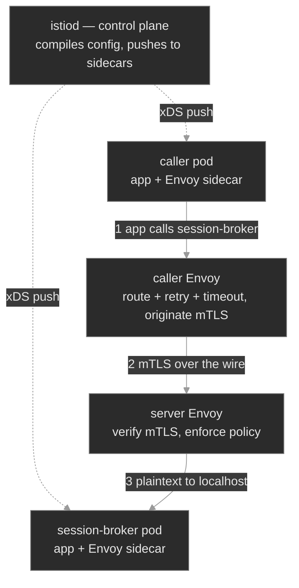

Two facts do most of the diagnostic work. First, **the caller's sidecar enforces routing and client-side policy** (which subset, the timeout, the retry budget, whether to send mTLS), and **the server's sidecar enforces admission** (does it require mTLS). A `503` therefore has a *side*: a routing or connect failure is usually the caller's config; a rejected connection is usually the server's policy. Second, **a pod that has no sidecar is not in the mesh at all** — none of this applies to it, which is its own failure class.

The mesh request path is four Envoy links, and each module failure is a broken link:

```text
app ──▶ caller Envoy ──[ LISTENER :80 ]──▶ [ ROUTE match host ]──▶ [ CLUSTER subset ]──▶ [ ENDPOINTS pod IPs ] ──mTLS──▶ server Envoy ──▶ app
                              │                     │                      │                        │                         │
              no sidecar? not in mesh        wrong host → 404      subset has 0 pods → 503    empty/unhealthy → 503     mTLS mismatch → 503
```

`istioctl proxy-config` prints exactly these links for a given pod. When the object you applied and the compiled config disagree, the config wins — so you read the config. The M14 reflex holds and sharpens: the client's status code names the class of failure; `proxy-config` names the link.

### Concept walkthrough

#### The dataplane: sidecar injection

A workload joins the mesh by gaining a sidecar, and that happens at pod-creation time through a **mutating admission webhook**<sup><a href="https://istio.io/latest/docs/setup/additional-setup/sidecar-injection/">[1]</a></sup>. Label a namespace `istio-injection=enabled`, and every pod created in it afterward is intercepted by the webhook, which rewrites the pod spec to add two things: an `istio-proxy` container (the Envoy sidecar) and an `istio-init` init container. The init container runs first and installs iptables rules inside the pod's network namespace that redirect all inbound and outbound TCP through Envoy<sup><a href="https://istio.io/latest/docs/ops/deployment/architecture/">[2]</a></sup>. The application container is unchanged and unaware; it still binds `:80` and makes ordinary calls, but the kernel now routes those through the proxy. The visible tell is the container count: a meshed pod reports `2/2`, a bare pod `1/1`.

Two properties of injection cause most of its incidents. It is **admission-time**, so it applies only to pods created *after* the namespace is labeled — label an existing namespace and nothing changes until the workloads roll. And it is **per-pod overridable**: the annotation `sidecar.istio.io/inject: "false"` on a pod template opts that workload out even in an enabled namespace<sup><a href="https://istio.io/latest/docs/setup/additional-setup/sidecar-injection/">[1]</a></sup>. A workload that skipped injection is not "partly in the mesh" — it is entirely outside it. No traffic policy, retry, or mTLS applies to it, and it never registers with istiod, so `istioctl proxy-status` — which lists every sidecar and its config-sync state — simply doesn't show it<sup><a href="https://istio.io/latest/docs/ops/diagnostic-tools/proxy-cmd/">[3]</a></sup>. When a workload behaves as if mesh config is being ignored, the first check is always whether it has a sidecar at all.

<details>
<summary>📖 Going deeper: what the injector actually writes, and the sidecarless alternative<sup><a href="https://istio.io/latest/docs/overview/dataplane-modes/">[4]</a></sup></summary>

The webhook doesn't just append a container. It injects `istio-init` (or, in CNI-plugin installs, a node-level component) to program the iptables redirect; it sets the Envoy container to run as UID 1337 and excludes that UID from redirection, so Envoy's own traffic doesn't loop back through itself; and it wires in the pod's mesh identity. That identity is the crux of security: Envoy is issued a short-lived X.509 certificate whose SPIFFE name encodes the pod's ServiceAccount (`spiffe://<trust-domain>/ns/<namespace>/sa/<serviceaccount>`), which is what the other side authenticates.

The sidecar-per-pod model has a real cost — a proxy's memory and CPU on every workload, and pod startup ordering to manage. Istio's **ambient** mode is the response: a sidecarless dataplane that moves L4 into a per-node component and makes L7 proxies opt-in, so workloads join the mesh without a container injected into each pod<sup><a href="https://istio.io/latest/docs/overview/dataplane-modes/">[4]</a></sup>. The sidecar model remains the most widely deployed and is what you'll meet on existing clusters, so know it cold — `2/2` is still the membership test there — but new large deployments should evaluate ambient for the resource math.

</details>

#### Traffic management: VirtualService and DestinationRule

Once a workload is in the mesh, two objects shape traffic to it, and the division between them is worth memorizing. A **VirtualService** answers *where does this request go* — it matches on host (and optionally path, headers) and routes to a destination, carrying per-route resilience: a `timeout` that caps how long the caller waits, and a `retries` block with an attempt count, per-try timeout, and the conditions to retry on<sup><a href="https://istio.io/latest/docs/concepts/traffic-management/">[5]</a></sup>. A **DestinationRule** answers *how do we talk to that destination once chosen* — it defines named `subsets` of the host's pods, the `connectionPool` limits, the `outlierDetection` circuit breaker, and the client-side `tls` mode<sup><a href="https://istio.io/latest/docs/reference/config/networking/destination-rule/">[6]</a></sup>. Both are enforced by the **caller's** sidecar, on the way out. This is the single most counter-intuitive fact about mesh traffic management: the rules for reaching `session-broker` live in and are applied by the proxy of whoever is *calling* it, not by `session-broker`'s own proxy.

A **subset** is a named label-selected group of a host's pods — usually a version — and it is where routing meets a sharp edge. The DestinationRule declares `subsets: [{ name: stable, labels: {...} }, { name: canary, labels: { version: canary } }]`, and the VirtualService routes to one by name. istiod compiles each subset into a separate Envoy **cluster**. If a subset's labels select zero pods — a canary defined before its build is deployed — the cluster is valid but has **no endpoints**, and a request routed to it has no healthy upstream, so Envoy returns `503`<sup><a href="https://istio.io/latest/docs/concepts/traffic-management/">[5]</a></sup>. Nothing is unhealthy; the route simply aims at an empty set. You see it only in the compiled config: `istioctl proxy-config routes <caller-pod>` shows the route targeting the subset's cluster, and `istioctl proxy-config endpoints <caller-pod>` shows that cluster with no addresses behind it<sup><a href="https://istio.io/latest/docs/ops/diagnostic-tools/proxy-cmd/">[3]</a></sup>.

The **circuit breaker** is `outlierDetection` in the DestinationRule: eject a backend endpoint from the load-balancing pool after it returns some number of consecutive `5xx`s (`consecutive5xxErrors`), for a `baseEjectionTime`, up to a `maxEjectionPercent` of the pool<sup><a href="https://istio.io/latest/docs/tasks/traffic-management/circuit-breaking/">[7]</a></sup>. Paired with `connectionPool` limits (caps on concurrent connections and pending requests), it stops one slow or failing replica from consuming the caller's resources and turning a partial outage into a total one. Like retries and timeouts, it is caller-side config that the application never sees — resilience the platform applies uniformly instead of each team reinventing it.

#### Mesh-managed mTLS

The mesh can require that every pod-to-pod hop be mutually authenticated and encrypted, using the per-pod identities from injection — and it delivers this without the application handling a single certificate. The control is **PeerAuthentication**, and it is a **server-side** policy: it sets what a workload's sidecar will *accept*<sup><a href="https://istio.io/latest/docs/tasks/security/authentication/mtls-migration/">[8]</a></sup>. `STRICT` accepts only Istio mTLS and rejects plaintext; `PERMISSIVE` accepts either (the migration setting); `DISABLE` turns it off. Apply a namespace-wide `STRICT` PeerAuthentication and every meshed server in that namespace now demands mTLS on its inbound port.

The other half is the **client** side, and this is where mismatches hide. What a caller *sends* is governed by the DestinationRule `tls` mode: `ISTIO_MUTUAL` originates Istio mTLS, `DISABLE` sends plaintext<sup><a href="https://istio.io/latest/docs/reference/config/networking/destination-rule/">[6]</a></sup>. The two must agree. A `STRICT` server with a caller whose DestinationRule says `DISABLE` is a contradiction: the caller sends plaintext into a server that rejects everything but mTLS, the server's sidecar resets the connection, and the caller gets `503`. Both pods are healthy and in the mesh; the transport policies simply disagree, and you find it only by reading the PeerAuthentication and the DestinationRule *together*. The safe repair direction is to raise the client to mTLS, never to drop the server to `PERMISSIVE` — that would silently make the protected hop plaintext again.

<details>
<summary>📖 Going deeper: automatic mTLS, and why the mismatch is a self-inflicted wound<sup><a href="https://istio.io/latest/docs/tasks/security/authentication/authn-policy/">[9]</a></sup></summary>

You rarely need a DestinationRule `tls` block at all. Istio's **automatic mTLS** negotiates it: when no explicit client-side mode is set, the caller's sidecar detects whether the destination has a sidecar and uses mTLS when it does, plaintext when it doesn't<sup><a href="https://istio.io/latest/docs/tasks/security/authentication/authn-policy/">[9]</a></sup>. Under automatic mTLS a `STRICT` namespace "just works" for meshed callers, and the whole mismatch class disappears — which is why an explicit `tls: DISABLE` override against a `STRICT` server is a self-inflicted wound: someone reached past the automatic behavior to hard-code the wrong thing.

Automatic mTLS also explains a quieter danger from the injection section. If a *server* has no sidecar, automatic mTLS on the caller downgrades to plaintext (nothing on the far end can terminate mTLS) — so a missing sidecar can turn a `STRICT`-intended hop into an *unencrypted* one with no error at all. An explicit `ISTIO_MUTUAL` DestinationRule instead makes that same missing sidecar fail loudly with a `503`, because it forces mTLS regardless. This is the standard migration path in reverse: you roll `STRICT` out safely by first setting `PERMISSIVE` (accept both) while workloads gain sidecars, watch telemetry until all traffic is mTLS, then flip to `STRICT`<sup><a href="https://istio.io/latest/docs/tasks/security/authentication/mtls-migration/">[8]</a></sup>. Skipping the `PERMISSIVE` step is how a namespace-wide `STRICT` takes out every not-yet-meshed caller at once.

</details>

### Hands-on

Four steps in the baseline, three break/fix scenarios — all on the full Polyphone fleet with Istio installed and the `media` namespace enrolled in the mesh. Traffic is driven from a long-lived in-mesh `mesh-client` pod via `kubectl exec` (a throwaway `kubectl run` client would get a sidecar that never terminates, so a persistent one is baked in).

- **`baseline/`** — a healthy mesh: meshed pods at `2/2`, a VirtualService and DestinationRule shaping `session-broker` (timeout, retries, subsets, circuit breaker), `STRICT` mTLS proven by a plaintext caller getting rejected, and the `istioctl proxy-status` / `proxy-config` toolkit for reading the compiled Envoy config.
- **`breakfix-01-sidecar-not-injected/`** — a workload opted out of injection (`1/1`), so it's not in the mesh; with mTLS required upstream, callers `503`. The fix re-enrolls it (`2/2`), not touching mTLS.
- **`breakfix-02-virtualservice-subset/`** — a route pointed at a subset with no pods. The pod is healthy and in the mesh; the Envoy cluster is empty, so `503`. The fix routes back to a subset that exists, read straight from `proxy-config`.
- **`breakfix-03-mtls-mode-mismatch/`** — the DestinationRule tells callers to send plaintext while the PeerAuthentication requires mTLS. Everything is healthy; the two ends disagree, so `503`. The fix aligns the client to mTLS.

All three produce the same `503` from three different roots — no sidecar, empty subset, mTLS mismatch — and the diagnosis is which `istioctl` output localizes the break. Check yourself against `ANSWER-KEY.md` after each.

### Common failure modes

| Symptom | Likely cause | Where to look |
|---------|--------------|---------------|
| Workload ignores all mesh config (no mTLS, no routing, no metrics) | It has no sidecar — not in the mesh | `kubectl get pods` for `1/1` vs `2/2`; `istioctl proxy-status` (absent); pod annotations for `sidecar.istio.io/inject: "false"` |
| `503`, backend Pods `Running`/`Ready`, Service has endpoints, workload is `1/1` | No sidecar to terminate the callers' mTLS | container count; `istioctl proxy-status`; re-enroll and roll the Deployment |
| `503`, pods `2/2` and healthy, endpoints present | Route targets a subset/cluster with no endpoints | `istioctl proxy-config routes <caller>` (which cluster) then `proxy-config endpoints <caller>` (is it empty); the VirtualService `subset` and matching pod labels |
| `503`, pods `2/2`, route correct, endpoints present | Client and server disagree on mTLS | PeerAuthentication `mtls.mode` (server) vs DestinationRule `tls.mode` (client) — read both |
| Config change applied but behavior unchanged | The sidecar hasn't received the new config | `istioctl proxy-status` for `STALE`/`NOT SENT`; check istiod health |
| Meshed hop is plaintext when you expected `STRICT` | Server missing a sidecar + automatic mTLS downgraded the caller | server pod `1/1`; enforce with explicit `STRICT` + `ISTIO_MUTUAL`, and re-enroll the server |
| `404` (not `503`) through the mesh | No route matched the request's host/path | the VirtualService `hosts`/match rules vs the request; `istioctl proxy-config routes` |

### Recap

- **A pod is in the mesh only if it has a sidecar.** Injection is an admission-time webhook keyed on the `istio-injection=enabled` namespace label; `2/2` (and a line in `istioctl proxy-status`) means mesh policy applies, `1/1` means none of it does. Check the container count first.
- **The control plane is intent; the dataplane is truth.** istiod compiles your VirtualService / DestinationRule / PeerAuthentication into Envoy config and pushes it to the sidecars. When behavior and config disagree, read the compiled config with `istioctl proxy-config` — listener → route → cluster → endpoint.
- **Traffic management is caller-side, and subsets can be empty.** The VirtualService (routing, timeout, retries) and DestinationRule (subsets, connection pool, circuit breaker) are applied by the *caller's* sidecar. A route to a subset that selects zero pods is a valid rule with no backend — a `503` with everything healthy.
- **mTLS is a two-sided contract.** PeerAuthentication sets what the *server* accepts (`STRICT`/`PERMISSIVE`/`DISABLE`); the DestinationRule `tls` mode sets what the *client* sends. They must agree — and automatic mTLS makes them agree for free, so an explicit override that mismatches is self-inflicted. Repair upward (client to mTLS), never downward.
- **The mesh adds `503` branches to the M04 differential.** No sidecar, empty subset, mTLS mismatch — same client-visible `503`, three different links in the Envoy path. The client's code names the class; `istioctl` names the link.

### Production thinking

- A team enables `istio-injection=enabled` on their namespace and reports "the mesh isn't doing anything — no mTLS, no metrics." Every pod predates the label. What one operation makes injection take effect, and why did labeling the namespace alone change nothing? What's the risk of doing that operation to every Deployment at once during business hours?
- You're asked to turn on `STRICT` mTLS across a namespace that currently has a mix of meshed and not-yet-meshed workloads. Applying `STRICT` directly would `503` every plaintext caller instantly. What's the staged migration that gets you to `STRICT` with zero downtime, and which telemetry tells you it's safe to flip the final switch?
- A canary rollout shifts 10% of `session-broker` traffic to `subset: canary`, and 10% of requests immediately start returning `503` while the other 90% are fine. The canary Deployment shows `0/0` ready. Walk the Envoy path that produces exactly a *fractional* `503`, and explain why the VirtualService applying cleanly told you nothing about whether the subset had pods.

### References

1. Istio — Sidecar injection: https://istio.io/latest/docs/setup/additional-setup/sidecar-injection/
2. Istio — Architecture (istiod and the Envoy dataplane): https://istio.io/latest/docs/ops/deployment/architecture/
3. Istio — Debugging Envoy with istioctl proxy-config / proxy-status: https://istio.io/latest/docs/ops/diagnostic-tools/proxy-cmd/
4. Istio — Dataplane modes (sidecar and ambient): https://istio.io/latest/docs/overview/dataplane-modes/
5. Istio — Traffic management concepts (VirtualService, subsets, timeouts, retries): https://istio.io/latest/docs/concepts/traffic-management/
6. Istio — DestinationRule reference: https://istio.io/latest/docs/reference/config/networking/destination-rule/
7. Istio — Circuit breaking (outlier detection): https://istio.io/latest/docs/tasks/traffic-management/circuit-breaking/
8. Istio — Mutual TLS migration (PeerAuthentication, PERMISSIVE → STRICT): https://istio.io/latest/docs/tasks/security/authentication/mtls-migration/
9. Istio — Authentication policy and automatic mutual TLS: https://istio.io/latest/docs/tasks/security/authentication/authn-policy/


---

## Break/Fix Practice

## Break/fix 01 — Sidecar not injected

**Symptom — what you'd actually see:**

Callers of `session-broker` in `media` get `HTTP 503`. Its Pod is `Running`/`Ready`, `kubectl get endpoints session-broker -n media` lists the Pod IP on `:80`, and DNS resolves. Nothing logs an error; the app container is serving.

**Think about this before you open the answer:**

Reading `2/2` vs `1/1` as a mesh-membership check, and knowing a sidecar-less pod is entirely outside the mesh. Self-grading questions:

- Did you check the container count and `proxy-status` before assuming the app or the Service was broken?
- Did you connect "no sidecar" to "no mTLS terminator" as the reason for the `503`, rather than blaming the DestinationRule?
- Did you fix by **re-enrolling** the workload, leaving `STRICT` mTLS intact — not by weakening the server to accept plaintext?

<details>
<summary><b>Click to reveal: diagnostic commands, root cause, exact fix, verify</b></summary>

**Root cause:**

The `session-broker` Deployment's pod template carries `sidecar.istio.io/inject: "false"`, which overrides the namespace's `istio-injection=enabled` and admits the pod **without a sidecar** — it comes up `1/1` and is not in the mesh<sup><a href="https://istio.io/latest/docs/setup/additional-setup/sidecar-injection/">[1]</a></sup>. Every caller's sidecar is told by the `session-broker` DestinationRule to originate `ISTIO_MUTUAL` mTLS. With no sidecar on `session-broker` to terminate that mTLS, the caller's Envoy can't complete the connection and returns `503`. The workload is healthy; only its mesh membership is missing.

**Diagnostic commands (run in this order):**

```bash
# 1. Reproduce from the in-mesh client — a 503
kubectl exec -n media deploy/mesh-client -c curl -- \
  curl -s -o /dev/null -w "HTTP %{http_code}\n" --max-time 5 http://session-broker.media/   # 503

# 2. Rule out the Service layer — endpoints present, DNS resolves
kubectl get endpoints session-broker -n media                     # PodIP:80
kubectl exec -n media deploy/mesh-client -c curl -- nslookup session-broker.media

# 3. Count containers — the tell
kubectl get pods -n media                                         # session-broker is 1/1, siblings 2/2
istioctl proxy-status | grep session-broker                       # absent — no sidecar registered with istiod
kubectl get pod -n media -l app=session-broker -o yaml | grep -A2 'annotations:'
#    sidecar.istio.io/inject: "false"
```

**Exact fix:**

Re-enroll the workload — set injection back on and let the Deployment roll a new, injected pod. Do **not** touch mTLS:

```bash
kubectl patch deployment session-broker -n media \
  -p '{"spec":{"template":{"metadata":{"annotations":{"sidecar.istio.io/inject":"true"}}}}}'
kubectl rollout status deployment session-broker -n media
# or: kubectl edit deployment session-broker -n media  → delete the inject: "false" annotation
```

**Verify:**

```bash
kubectl get pods -n media -l app=session-broker                   # now 2/2
istioctl proxy-status | grep session-broker                       # now listed, SYNCED
kubectl exec -n media deploy/mesh-client -c curl -- \
  curl -s -o /dev/null -w "HTTP %{http_code}\n" --max-time 5 http://session-broker.media/   # 200
kubectl get peerauthentication default -n media -o jsonpath='{.spec.mtls.mode}{"\n"}'        # still STRICT
```

**Production thinking:**

This ships whenever a workload is templated with injection disabled, or deployed into a namespace before it was labeled. The loud `503` here is a lucky consequence of the explicit `ISTIO_MUTUAL` DestinationRule; under *automatic* mTLS the same missing sidecar would silently downgrade the hop to plaintext — an unencrypted security hole with no error. Alert on it structurally: a check that every pod in a meshed namespace is `2/2`, and mesh telemetry showing the workload is absent, catch it before a caller does.

</details>

---

## Break/fix 02 — VirtualService subset

**Symptom — what you'd actually see:**

`session-broker` returns `HTTP 503`, but every `media` pod is `2/2` and in the mesh (`istioctl proxy-status` lists `session-broker` as `SYNCED`), the Service has endpoints, and mTLS is healthy. The workload is fine.

**Think about this before you open the answer:**

Debugging a mesh `503` in the compiled Envoy config rather than in `kubectl get pods`, and knowing a subset can be valid but empty. Self-grading questions:

- Did the `2/2` pods steer you away from "the workload is down" and toward the route?
- Did you use `istioctl proxy-config routes` then `endpoints` to see the route landing on an empty cluster, instead of guessing?
- Did you connect the empty cluster to the VirtualService `subset` and the absence of `version: canary` pods?

<details>
<summary><b>Click to reveal: diagnostic commands, root cause, exact fix, verify</b></summary>

**Root cause:**

The `session-broker` VirtualService routes to `subset: canary`. The DestinationRule defines `canary` as `labels: { version: canary }` — a version nobody deployed — so istiod compiles it into an Envoy cluster (`outbound|80|canary|session-broker.media.svc.cluster.local`) with **zero endpoints**. The route matches, Envoy selects the canary cluster, finds no healthy upstream, and returns `503`<sup><a href="https://istio.io/latest/docs/concepts/traffic-management/">[2]</a></sup>. The `stable` subset has the running pods; the route just aims at the empty one.

**Diagnostic commands (run in this order):**

```bash
# 1. Reproduce — 503
kubectl exec -n media deploy/mesh-client -c curl -- \
  curl -s -o /dev/null -w "HTTP %{http_code}\n" --max-time 5 http://session-broker.media/   # 503

# 2. Rule out the workload — all 2/2, endpoints present (NOT breakfix-01)
kubectl get pods -n media
kubectl get endpoints session-broker -n media                     # PodIP:80

# 3. Follow the route in Envoy — the caller's sidecar routes it
POD=$(kubectl get pod -n media -l app=mesh-client -o jsonpath='{.items[0].metadata.name}')
istioctl proxy-config routes "$POD" -n media --name 80 -o json | grep -i '"cluster"'
#    ...|canary|session-broker...   ← route targets the canary subset
istioctl proxy-config endpoints "$POD" -n media | grep session-broker
#    |stable| cluster has PodIPs:80 ; |canary| cluster is EMPTY

# 4. Confirm the source
kubectl get virtualservice session-broker -n media -o yaml | grep -A3 route:   # subset: canary
kubectl get pods -n media -l version=canary                       # none
```

**Exact fix:**

Point the route at a subset that has pods (`stable`); the canary build doesn't exist to deploy:

```bash
kubectl patch virtualservice session-broker -n media --type=json \
  -p '[{"op":"replace","path":"/spec/http/0/route/0/destination/subset","value":"stable"}]'
# or: kubectl edit virtualservice session-broker -n media  → subset: canary → stable
```

**Verify:**

```bash
POD=$(kubectl get pod -n media -l app=mesh-client -o jsonpath='{.items[0].metadata.name}')
istioctl proxy-config routes "$POD" -n media --name 80 -o json | grep -i '"cluster"'   # ...|stable|...
kubectl exec -n media deploy/mesh-client -c curl -- \
  curl -s -o /dev/null -w "HTTP %{http_code}\n" --max-time 5 http://session-broker.media/   # 200
```

**Production thinking:**

This is the classic canary footgun: shift traffic to `version: canary` *before* the canary pods are `Ready`, and every routed request falls into an empty cluster. A VirtualService applying cleanly proves nothing about whether its subset has backends. Guard it by ordering the rollout (pods `Ready` before the traffic shift) and by testing routing with a real request in CI — and remember that a *partial* traffic split turns this into a *fractional* `503` that's easy to misread as flakiness.

</details>

---

## Break/fix 03 — mTLS mode mismatch

**Symptom — what you'd actually see:**

`session-broker` returns `HTTP 503`. Every pod is `2/2`, the VirtualService routes to `stable`, `istioctl proxy-config endpoints` shows that cluster with healthy endpoints — and it still fails. Neither of the previous two causes applies.

**Think about this before you open the answer:**

Recognizing mTLS as a two-sided contract and reading the server policy against the client policy. Self-grading questions:

- Did you rule out breakfix-01 (`2/2`) and breakfix-02 (endpoints present) before concluding "mTLS"?
- Did you read **both** the PeerAuthentication and the DestinationRule, rather than trusting either in isolation?
- Did you fix by raising the **client** to mTLS, keeping `STRICT`, instead of dropping the server to `PERMISSIVE` (which would silently make the hop plaintext)?

<details>
<summary><b>Click to reveal: diagnostic commands, root cause, exact fix, verify</b></summary>

**Root cause:**

mTLS is configured on both sides and they **disagree**. The namespace `PeerAuthentication default` is `mtls.mode: STRICT` — `session-broker`'s sidecar accepts only mTLS. The `session-broker` DestinationRule sets `trafficPolicy.tls.mode: DISABLE` — callers' sidecars send **plaintext**. The caller sends plaintext into a server that rejects everything but mTLS; the server's sidecar resets the connection and the caller's Envoy returns `503`<sup><a href="https://istio.io/latest/docs/tasks/security/authentication/mtls-migration/">[3]</a></sup>. Both ends are healthy and in the mesh; only the transport policies conflict.

**Diagnostic commands (run in this order):**

```bash
# 1. Reproduce — 503
kubectl exec -n media deploy/mesh-client -c curl -- \
  curl -s -o /dev/null -w "HTTP %{http_code}\n" --max-time 5 http://session-broker.media/   # 503

# 2. Rule out 01 and 02 — sidecar present, route lands on endpoints
kubectl get pods -n media                                         # all 2/2 (not breakfix-01)
POD=$(kubectl get pod -n media -l app=mesh-client -o jsonpath='{.items[0].metadata.name}')
istioctl proxy-config endpoints "$POD" -n media | grep 'session-broker' | grep ':80'   # stable has endpoints (not breakfix-02)

# 3. Read both halves of mTLS
kubectl get peerauthentication default -n media -o yaml | grep -A2 mtls:            # mode: STRICT   (server)
kubectl get destinationrule session-broker -n media -o yaml | grep -A2 'tls:'       # mode: DISABLE  (client)
#    server requires mTLS, client sends plaintext → mismatch
```

**Exact fix:**

Align the client to the server. Raise the DestinationRule to `ISTIO_MUTUAL`; keep the server `STRICT`:

```bash
kubectl patch destinationrule session-broker -n media --type=json \
  -p '[{"op":"replace","path":"/spec/trafficPolicy/tls/mode","value":"ISTIO_MUTUAL"}]'
# or: kubectl edit destinationrule session-broker -n media  → mode: DISABLE → ISTIO_MUTUAL
# (removing the tls block entirely also works — automatic mTLS then negotiates it)
```

**Verify:**

```bash
kubectl exec -n media deploy/mesh-client -c curl -- \
  curl -s -o /dev/null -w "HTTP %{http_code}\n" --max-time 5 http://session-broker.media/   # 200
kubectl get peerauthentication default -n media -o jsonpath='{.spec.mtls.mode}{"\n"}'        # still STRICT
```

**Production thinking:**

With no DestinationRule `tls` block, automatic mTLS would have negotiated this correctly — so an explicit `DISABLE` against a `STRICT` server is a self-inflicted mismatch, usually a copy-pasted rule or a leftover from a plaintext migration. Roll `STRICT` out the safe way: set `PERMISSIVE` first, let workloads gain sidecars and traffic become mTLS, confirm with telemetry, then flip to `STRICT`. And treat "fix by dropping to `PERMISSIVE`" as a regression, not a fix — it re-opens the plaintext path the mesh existed to close.

</details>

---


---

# `m16-kustomize/`

## Concept

## M16 — Kustomize Bases & Overlays

> One base, many environments, no templating language. How Kustomize composes and transforms plain YAML — and the three distinct layers where it fails.

### What you'll learn

- Compose an environment from a shared **base** plus environment-specific **overlays**, and read any `kustomization.yaml`
- Render a kustomization locally with `kubectl kustomize` and apply it with `kubectl apply -k` — and know why rendering first is the whole discipline
- Patch resources two ways (strategic-merge and JSON 6902) and understand how a patch finds the resource it targets
- Generate ConfigMaps and Secrets, and reason about the **name-suffix hash** and the reference rewriting it drives
- Apply transformers (`namespace`, `labels`, `images`, `namePrefix`) without walking into the immutable-selector trap
- Reuse cross-cutting slices with **components**
- Locate any Kustomize failure to the right layer — **build**, **apply**, or **runtime** — because each has a different first command

### Why it matters

Every Polyphone environment runs the same workloads with different settings: prod wants more replicas and a pinned image, lab wants verbose logging, each region wants its own node placement. The naive answer — a folder of complete manifests per environment — rots immediately. A security fix to a Pod spec now has to be copied into a dozen files, and the day someone misses one is the day lab and prod quietly diverge.

Kustomize<sup><a href="https://kubernetes.io/docs/tasks/manage-kubernetes-objects/kustomization/">[1]</a></sup> removes the copies. You keep one base — the single source of truth for what's common — and describe each environment as a small, reviewable *diff* against it. There is no templating language and no string interpolation; it is YAML transformed by more YAML, which is why every GitOps repository you'll operate is built on it (or on Helm, M17) and why Flux renders it for you in M18.

The catch is that Kustomize's failure surface is unlike anything in the earlier modules. A broken Deployment shows up in `kubectl describe`. A broken *kustomization* might fail before any object exists, or produce a perfectly valid render that the API server rejects, or apply cleanly and only misbehave at runtime. Knowing which of those three you're looking at is most of the job.

### Scope

**Covers:** the base/overlay composition model; `kubectl kustomize` (render) vs `kubectl apply -k` (render + apply); patches (strategic-merge and JSON 6902) and how targets are selected; generators (`configMapGenerator`/`secretGenerator`), the content-hash suffix, and reference rewriting; transformers (`namespace`, `labels`/`commonLabels`, `images`, `namePrefix`/`nameSuffix`); components; and the build → apply → runtime failure model.

**Doesn't cover:** Helm's templating approach and the Kustomize-vs-Helm decision (M17); Flux, GitOps reconciliation, and drift detection (M18); multi-cluster promotion, per-region overlays, and cluster variables (M19); secrets encryption for git (M11 — `secretGenerator` base64-encodes, it does not encrypt); and the resource types themselves, which earlier modules already taught.

**Assumes:** you can read a Deployment, Service, and ConfigMap (M01, M03, M04); you know labels and selectors and that a Deployment's selector is immutable (M00, M04); you understand namespaces (M00) and `kubectl apply`'s declarative model (M00).

### Vocabulary

| Term | Definition |
|------|------------|
| **kustomization** | A directory containing a `kustomization.yaml`. The unit Kustomize builds. |
| **Base** | A kustomization meant to be built on. It renders on its own and captures what's common across environments. |
| **Overlay** | A kustomization whose `resources:` points at one or more bases, then layers changes on top. One overlay per environment is the usual shape. |
| **Transformer** | A field that rewrites every resource in the build: `namespace`, `labels`, `commonLabels`, `namePrefix`/`nameSuffix`, `images`. |
| **Patch** | A targeted change to specific resources. Two dialects: **strategic-merge** (a YAML fragment merged in) and **JSON 6902** (an explicit op list: add/replace/remove). |
| **Strategic-merge patch** | A partial resource; Kustomize merges it onto the matching resource by `apiVersion`/`kind`/`name`, understanding list-merge semantics for known fields. |
| **JSON 6902 patch** | An RFC 6902 operation list against explicit paths (`/spec/replicas`), applied to a `target:` you name. |
| **Generator** | `configMapGenerator` / `secretGenerator` — builds a ConfigMap/Secret from literals, files, or env files, and *owns* the resulting object. |
| **Name-suffix hash** | A hash of a generated object's contents, appended to its name (`edge-relay-config-4f9dk2`). Different content → different name. |
| **Reference rewriting** | Kustomize updating references (a Deployment's `configMapRef`, a volume's `configMap.name`) to a generated object's hashed name — done by matching the reference's name to the generator's declared name. |
| **Component** | `kind: Component` — a reusable slice (patches + resources + generators) an overlay opts into via `components:`. Unlike a base, it can carry patches. |
| **`behavior`** | On a generator in an overlay: `create` (new), `merge` (add/override onto a base generator of the same name), or `replace`. |
| **`kubectl kustomize <dir>`** | Build a kustomization and print the result. Touches no cluster. |
| **`kubectl apply -k <dir>`** | Build, then apply the result — `kubectl kustomize` piped into `apply -f -`. |

### Mental model

Kustomize is a **renderer, not a runtime**. `kubectl kustomize <dir>` is a pure function: directory of YAML in, single stream of YAML out, no cluster involved. `kubectl apply -k <dir>` is that same function with an `apply` stapled to the end. The cluster never sees the kustomization — only the rendered objects, which look exactly like hand-written manifests. Nothing in the cluster knows Kustomize exists.

That single fact organizes every failure you'll debug. A Kustomize problem lands in exactly one of three layers, and the layer decides your first command:

```mermaid
%%{init: {'theme':'base', 'themeVariables': {
  'primaryColor':'#2b2b2b', 'primaryTextColor':'#e6e6e6',
  'primaryBorderColor':'#7a7a7a', 'lineColor':'#9a9a9a',
  'secondaryColor':'#3a3a3a', 'tertiaryColor':'#1f1f1f',
  'background':'#0f0f0f'
}}}%%
flowchart LR
    base[base<br/>+ overlay files] -->|kubectl kustomize| render[rendered<br/>YAML]
    render -->|kubectl apply| api[API server<br/>admission]
    api --> rt[running<br/>Pods]

    base -. BUILD fails<br/>patch/path/dupe .-> x1((✗))
    render -. APPLY fails<br/>immutable/quota .-> x2((✗))
    api -. RUNTIME fails<br/>bad render, valid object .-> x3((✗))
```

- **Build** — `kustomize build` errors; nothing reaches the cluster. First command: `kubectl kustomize <dir>` and *read the error*. `describe` has nothing to show because nothing was created.
- **Apply** — the render is valid YAML, but the API server rejects an object (an immutable field, a quota, a bad reference). First command: re-run `apply -k` and read the API error; diff the render against what's live.
- **Runtime** — build and apply both succeed, but the rendered result is *wrong*, and it only bites when a Pod runs. First command: your normal `get → describe → events → logs` loop, then compare it to the render.

Hold this picture. The rest of the module is one worked failure per layer.

### Concept walkthrough

#### Composition: bases and overlays

A **base** lists raw resources and the transformations common to every environment:

```yaml
## base/kustomization.yaml
resources:
  - deployment.yaml
  - service.yaml
namespace: edge
configMapGenerator:
  - name: edge-relay-config
    literals: [LOG_LEVEL=info, MAX_SESSIONS=500]
```

An **overlay** points its `resources:` at that base and layers on the environment's departures:

```yaml
## overlays/prod/kustomization.yaml
resources:
  - ../../base
images:
  - {name: nginx, newTag: "1.27"}
patches:
  - path: replicas-patch.yaml
```

`resources:` is doing double duty — it accepts raw manifest files *and* other kustomization directories, and it's how composition happens. Overlays can stack on overlays (a regional overlay on top of a prod overlay), though two levels is plenty for most fleets. The base renders on its own; each overlay renders to the base *plus* its diff. A fix to the base reaches every environment on the next build — that's the entire value proposition. When `resources:` names a path that doesn't exist, the build fails at accumulation (`accumulating resources ... no such file or directory`) — a broken relative path is the most common composition error, usually from a directory that moved.

#### Patches: how a change finds its target

A **transformer** touches every resource; a **patch** touches specific ones. That makes targeting the crux of patching: a patch has to identify *which* resource it modifies, and if it can't, Kustomize fails the build rather than silently doing nothing<sup><a href="https://kubectl.docs.kubernetes.io/references/kustomize/kustomization/patches/">[2]</a></sup>.

A **strategic-merge patch** is a partial resource. Kustomize matches it to a resource in the build by `apiVersion`/`kind`/`metadata.name`, then merges:

```yaml
## replicas-patch.yaml — targets Deployment/edge-relay by its own identity
apiVersion: apps/v1
kind: Deployment
metadata: {name: edge-relay}
spec: {replicas: 3}
```

If that `metadata.name` matches no resource, the build errors with `no matches for Id ...; failed to find unique target for patch`. The fix is always to reconcile the two names — either the patch is wrong, or the base got renamed and the patch wasn't updated.

A **JSON Patch**<sup><a href="https://kubernetes.io/docs/tasks/manage-kubernetes-objects/update-api-object-kustomize/">[3]</a></sup> (the RFC 6902 operation-list dialect, also written `patchesJson6902`) instead names an explicit `target:` and a list of operations against exact paths:

```yaml
patches:
  - target: {kind: Deployment, name: edge-relay}
    patch: |
      - {op: replace, path: /spec/replicas, value: 3}
```

<details>
<summary>📖 Going deeper: strategic-merge vs JSON Patch — when to reach for which<sup><a href="https://kubernetes.io/docs/tasks/manage-kubernetes-objects/update-api-object-kustomize/">[3]</a></sup></summary>

Both are first-class `patches:` entries; the difference is how they treat structure, especially lists.

- **Strategic-merge** understands Kubernetes' merge keys. Patch one container in a Pod by giving a list with just that container's `name`, and Kustomize merges by the `name` key rather than replacing the whole list. It reads naturally — it looks like the resource — and is the default choice for "change these fields."
- **JSON 6902** operates on positional paths and has no merge-key knowledge: `/spec/template/spec/containers/0/image` addresses the *first* container by index. It's the tool when you need to `remove` a field, `add` to a specific list position, or when there's no natural merge key. It's precise and brittle — reorder the list and the index is wrong.

Rule of thumb: strategic-merge for shaping fields; JSON 6902 for surgical `add`/`remove`/`replace` where merge semantics get in your way. A `patches:` entry auto-detects which dialect you wrote.

</details>

#### Generators and the name-suffix hash

You could write a ConfigMap by hand and list it in `resources:`. A **generator** builds it for you instead — and, critically, changes its name based on its contents<sup><a href="https://kubectl.docs.kubernetes.io/references/kustomize/kustomization/configmapgenerator/">[4]</a></sup>:

```yaml
configMapGenerator:
  - name: edge-relay-config
    literals: [LOG_LEVEL=info, MAX_SESSIONS=500]
```

The rendered object isn't named `edge-relay-config` — it's `edge-relay-config-` plus a hash of its data. This is the single most surprising thing about Kustomize, and it exists to make config changes *safe*. A hand-written ConfigMap has a fixed name; edit its data and running Pods keep their loaded values, because nothing changed in any Pod template to trigger a rollout. A generator ties the name to the content, so any edit produces a new name → which changes every reference to it → which is a Pod-template change → which rolls the Deployment. Config change becomes rollout, automatically.

For that to work, Kustomize has to rewrite the references. It does — but only where the reference's **name matches the generator's declared name**. A Deployment whose `envFrom` names `edge-relay-config` gets rewritten to `edge-relay-config-<hash>`; a Deployment that names `edge-relay-conf` does not, because Kustomize never recognizes it as a reference to *this* generator. The render then contains a hashed ConfigMap and a Deployment pointing at a plain name that doesn't exist — valid YAML, valid apply, and a Pod that can't start. The name match is the load-bearing detail.

Two consequences worth internalizing. First, `behavior: merge` lets an overlay add or override values on a base generator of the same name (prod overriding `MAX_SESSIONS` while inheriting the rest) — the names must match for the merge to bind. Second, because each content change produces a *new* object, `apply -k` leaves the old generated ConfigMap behind; it only creates and updates, never deletes. Stale generated objects accumulate unless you `apply -k --prune` with a label selector or let a GitOps controller garbage-collect them. That leftover is the price of automatic rollouts. (`disableNameSuffixHash: true` turns the hash off and gets you a stable name — at the cost of losing the automatic rollout. `secretGenerator` works identically but base64-encodes; base64 is not encryption, which is the whole subject of M11.)

#### Transformers and the immutable-selector trap

Transformers rewrite fields across the whole build. `namespace` stamps a namespace; `images` re-points image names and tags without editing the Deployment YAML<sup><a href="https://kubectl.docs.kubernetes.io/references/kustomize/kustomization/images/">[5]</a></sup>; `namePrefix`/`nameSuffix` rename resources (and update references to them). The label transformers are where people get hurt.

There are two<sup><a href="https://kubectl.docs.kubernetes.io/references/kustomize/kustomization/labels/">[6]</a></sup>. The legacy `commonLabels` writes its labels onto metadata, Pod templates, **and every selector** — including a Deployment's `spec.selector`. The modern `labels:` transformer defaults to leaving selectors alone unless you set `includeSelectors: true`. That difference is the trap, because a Deployment's selector is **immutable after creation**<sup><a href="https://kubernetes.io/docs/concepts/workloads/controllers/deployment/#selector">[7]</a></sup>: it's the identity link between the Deployment and the ReplicaSets/Pods it owns, and changing it would orphan them.

On a fresh namespace, `commonLabels` is harmless — the selector is being set for the first time. Promote that same overlay over an *already-running* Deployment and the API server rejects the apply: `spec.selector: ... field is immutable`. The build was fine; the render was valid; the object already in the cluster is what made it illegal. The fix is to keep the label off the selector — use `labels:` with `includeSelectors: false` — so the promotion is an ordinary field update, not a selector change. Reserve selector-touching labels for greenfield resources.

#### Components

A base can't carry patches; a **component** can<sup><a href="https://kubectl.docs.kubernetes.io/guides/config_management/components/">[8]</a></sup>. A component (`apiVersion: kustomize.config.k8s.io/v1alpha1`, `kind: Component`) is a reusable slice — patches, resources, generators — that an overlay opts into via `components:`. Where a base is "the thing everyone builds on," a component is "an optional capability some environments turn on": a regional-affinity pin, a debug sidecar, a monitoring annotation set. Prod might enable it and lab skip it, from the same definition. Reach for a component when the same *change* recurs across overlays; reach for a base when the same *resources* do.

### Hands-on

Four Killercoda scenarios, each on the full Polyphone fleet plus one Kustomize-managed workload, `edge-relay`, whose tree lives at `/root/edge-relay`.

- **`baseline/`** — the healthy machine: render the base, diff the lab and prod overlays, apply prod, and watch a generator's hash turn a config edit into a clean rollout. No fix; the point is to see patches, generators, transformers, and a component all working.
- **`breakfix-01-patch-target-mismatch`** — the **build** layer. A patch targets a name no resource carries; `kustomize build` errors and nothing reaches the cluster. Read the build error, not the (empty) cluster.
- **`breakfix-02-generator-name-mismatch`** — the **runtime** layer. A Deployment's config reference drifted from the generator name, so the hash was never rewritten in; build and apply succeed, the Pod lands in `CreateContainerConfigError`.
- **`breakfix-03-commonlabels-immutable-selector`** — the **apply** layer. `commonLabels` injects a label into the immutable Deployment selector; the render is valid and the API server rejects the promotion.

Work them in order and check each against `ANSWER-KEY.md`. The three form one differential: same tool, three layers, three different first moves.

### Common failure modes

| Symptom | Likely cause | Where to look |
|---------|--------------|---------------|
| `no matches for Id ...; failed to find unique target for patch` | A patch's target name/kind matches no resource | The patch's `metadata.name`/`target:` vs the base's real names |
| `accumulating resources ... no such file or directory` | A `resources:`/`components:` path is wrong | The relative paths in `kustomization.yaml` |
| Pod `CreateContainerConfigError`, generated ConfigMap "not found" | A reference name ≠ the generator's name, so the hash wasn't rewritten in | `kubectl kustomize` — compare the generated name to the reference |
| Apply rejected: `spec.selector ... field is immutable` | `commonLabels` / `labels` with `includeSelectors:true` wrote into the selector | Diff the live selector against the render; the transformer list |
| Overlay change didn't take effect | Applied the wrong overlay, or didn't re-render before applying | `kubectl kustomize <overlay>` and read what it actually produced |
| `may not add resource with an already registered id` | The same resource is pulled in twice (base + explicit file) | The `resources:` list for duplicates |
| Stale `*-<hash>` ConfigMaps piling up | Generators create new objects; `apply` never deletes | `apply -k --prune` with a selector, or a GitOps controller's GC |

### Recap

- **Kustomize renders; it never runs.** `kubectl kustomize` is a pure function; `apply -k` is that plus an apply. The cluster only ever sees plain rendered objects.
- **One base is the source of truth; overlays are reviewable diffs.** No templating language — YAML transformed by YAML. Render before you apply, every time.
- **A generator ties a ConfigMap's name to its contents and rewrites references by name match.** That match is what makes config changes roll the workload; break the match and you get a valid apply that can't start.
- **Failures live in three layers — build, apply, runtime — and each has a different first command.** An empty cluster after `apply -k` means read the build; an immutable-field rejection means diff live-vs-render; a broken Pod means the normal loop.
- **Transformers that reach into selectors collide with immutability.** Keep labels off the selector (`includeSelectors: false`) for anything already running.

### Production thinking

- A build-layer failure (bad patch target, missing path, duplicate id) fails a deploy with an error no `kubectl describe` can explain. What would you add to the pipeline so those never reach a human waiting on a rollout? (What command renders every overlay?)
- Generators create a new hashed object on every config change, and `apply` never deletes the old one. Six months in, how do you keep stale `*-<hash>` ConfigMaps from accumulating into an audit problem — and is that the pipeline's job or a GitOps controller's?
- A teammate wants to store a database password with `secretGenerator` and commit it. What do you tell them actually lands in git, and where does *encrypting* secrets for git belong instead? (You'll answer this properly in M11.)
- A render is clean on your laptop and subtly different in CI. Which piece of the toolchain would you pin — and across which machines — so a build is reproducible everywhere it runs?
- The same three-line patch is now copy-pasted across five overlays. When does that cross the line into a component, and what's the cost of extracting it too early? When you're differentiating dozens of clusters, what makes the base/overlay/component layout itself the hard design problem (M19)?

### References

1. Kubernetes — Declarative Management of Kubernetes Objects Using Kustomize: https://kubernetes.io/docs/tasks/manage-kubernetes-objects/kustomization/
2. Kustomize — `patches` field reference: https://kubectl.docs.kubernetes.io/references/kustomize/kustomization/patches/
3. Kubernetes — Update an API Object In Place Using kubectl (strategic-merge and JSON-patch dialects): https://kubernetes.io/docs/tasks/manage-kubernetes-objects/update-api-object-kustomize/
4. Kustomize — `configMapGenerator` field reference: https://kubectl.docs.kubernetes.io/references/kustomize/kustomization/configmapgenerator/
5. Kustomize — `images` field reference: https://kubectl.docs.kubernetes.io/references/kustomize/kustomization/images/
6. Kustomize — `labels` / `commonLabels` field reference: https://kubectl.docs.kubernetes.io/references/kustomize/kustomization/labels/
7. Kubernetes — Deployment selector (label selector updates): https://kubernetes.io/docs/concepts/workloads/controllers/deployment/#selector
8. Kustomize — Components guide: https://kubectl.docs.kubernetes.io/guides/config_management/components/


---

## Break/Fix Practice

## Break/fix 01 — Patch Target Mismatch

**Symptom — what you'd actually see:**

The `edge-relay` prod promotion isn't landing; the deploy job running `kubectl apply -k overlays/prod` exits non-zero, and there is no `edge-relay` Deployment in `edge` at all — not crashing, absent. The rest of the fleet is healthy.

**Think about this before you open the answer:**

- When `apply -k` produces *nothing*, did you run `kubectl kustomize` and read the build error — instead of poking a cluster that had nothing to show? A build error is a first-class diagnosis, not a mystery.
- Did you read the error literally? It names the target identity (`Deployment/edge-relayer`) that couldn't be matched.
- Do you understand that a `patches:` entry selects its target by the patch's own name, so `metadata.name` must match a real resource?

The anti-pattern: run `kubectl describe`/`logs` against a workload that was never created, then conclude the cluster is broken.

<details>
<summary><b>Click to reveal: diagnostic commands, root cause, exact fix, verify</b></summary>

**Root cause:**

The prod overlay's replicas patch (`overlays/prod/replicas-patch.yaml`) names its target `edge-relayer`, but the base Deployment is `edge-relay`. A `patches:` entry with a `path:` and no explicit `target:` selects by the patch's own `apiVersion`/`kind`/`metadata.name`; when nothing matches, Kustomize fails the whole build rather than skip the patch<sup><a href="https://kubectl.docs.kubernetes.io/references/kustomize/kustomization/patches/">[1]</a></sup>. `apply -k` never sends anything to the API server, so nothing exists to describe.

**Diagnostic commands (run in this order):**

```bash
# 1. Confirm the workload is absent, not broken — nothing to run the normal loop on
kubectl get deploy -n edge
kubectl get pods -n edge -l app=edge-relay
# No edge-relay. When apply -k yields nothing, suspect the build.

# 2. Run the build half yourself and READ the error
cd /root/edge-relay
kubectl kustomize overlays/prod
# Error: ... no matches for Id Deployment.v1.apps/edge-relayer...;
#        failed to find unique target for patch ...

# 3. Line up what the patch targets against what the base names
cat overlays/prod/replicas-patch.yaml            # metadata.name: edge-relayer
kubectl kustomize base | grep -E '^kind:|  name:'  # base Deployment is edge-relay
```

**Exact fix:**

```bash
# Point the patch at the name that exists
sed -i 's/name: edge-relayer/name: edge-relay/' overlays/prod/replicas-patch.yaml
# (Mirror-image fix: if the BASE was renamed and everything else expects
#  edge-relayer, rename the base instead. Fix whichever side drifted.)
```

**Verify:**

```bash
kubectl kustomize overlays/prod | grep -E 'kind: Deployment|replicas:'   # builds now; replicas: 3
kubectl apply -k overlays/prod
kubectl rollout status deployment/edge-relay -n edge --timeout=90s
kubectl get deploy edge-relay -n edge                                    # READY 3/3
```

**Production thinking:**

This entire class of failure is a CI gate. Running `kustomize build` (or `kubectl kustomize`) on every overlay in the pipeline and failing on error catches bad patch targets, missing `resources:` paths, and duplicate ids *before* a human waits on a deploy. The fix also belongs in git, not in a live `sed` — a GitOps controller (M18) would re-render the committed overlay; an out-of-band edit is overwritten on the next reconciliation.

</details>

---

## Break/fix 02 — Generator Name Mismatch

**Symptom — what you'd actually see:**

The prod overlay built cleanly and `apply -k` reported success, but `edge-relay` is `0/3`: its Pod is stuck in `CreateContainerConfigError`.

**Think about this before you open the answer:**

- When a generated object seems "missing," did you compare the *render* to the *cluster*? `kubectl kustomize` shows the hashed name Kustomize created and the exact reference it wrote (or didn't).
- Do you understand that reference rewriting is a name match — not magic — and that a four-character drift silently disables it?
- Did you resist "just create the missing ConfigMap by hand"? That treats the symptom; the next render would regenerate the hashed name and drift again.

<details>
<summary><b>Click to reveal: diagnostic commands, root cause, exact fix, verify</b></summary>

**Root cause:**

The base Deployment's `envFrom` references `edge-relay-conf`, while the `configMapGenerator` is named `edge-relay-config`. Kustomize rewrites a reference to a generated object only when the reference's name matches the generator's declared name<sup><a href="https://kubectl.docs.kubernetes.io/references/kustomize/kustomization/configmapgenerator/">[2]</a></sup>. They differ, so the reference is left as the bare `edge-relay-conf`; the render emits a ConfigMap named `edge-relay-config-<hash>` and a Deployment pointing at a name that doesn't exist. The object is valid, so admission accepts it; the kubelet then can't find the ConfigMap and fails container creation.

**Diagnostic commands (run in this order):**

```bash
# 1. The object exists, so the normal loop works this time
kubectl get pods -n edge -l app=edge-relay          # 0/1 CreateContainerConfigError
kubectl describe pod -n edge -l app=edge-relay | grep -A3 Events
#   Error: configmap "edge-relay-conf" not found

# 2. What ConfigMaps actually exist?
kubectl get configmap -n edge | grep edge-relay
#   edge-relay-config-<hash>  exists; edge-relay-conf does not

# 3. Read the render to see WHY the reference wasn't rewritten
cd /root/edge-relay
kubectl kustomize overlays/prod | grep -E 'kind: ConfigMap|name: edge-relay|configMapRef'
#   generator produced edge-relay-config-<hash>; Deployment asks for bare edge-relay-conf

# 4. Line up the two names
grep -A1 configMapRef base/deployment.yaml          # edge-relay-conf
grep -A1 configMapGenerator base/kustomization.yaml # edge-relay-config
```

**Exact fix:**

```bash
# Make the reference match the generator name so Kustomize rewrites it to the hashed object
sed -i 's/name: edge-relay-conf }/name: edge-relay-config }/' base/deployment.yaml
# (Mirror-image fix: rename the generator to edge-relay-conf instead. Either
#  way the two names must be identical — that match is what triggers the rewrite.)
```

**Verify:**

```bash
kubectl kustomize overlays/prod | grep -A1 configMapRef   # now edge-relay-config-<hash>
kubectl apply -k overlays/prod
kubectl rollout status deployment/edge-relay -n edge --timeout=90s
kubectl get pods -n edge -l app=edge-relay                # Running, 1/1
```

**Production thinking:**

The hash-and-rewrite machinery is what makes config changes roll a workload automatically — that's why you keep it rather than hand-writing ConfigMaps. Two operational corollaries: run `apply -k --prune` (or let a GitOps controller GC) so superseded `*-<hash>` ConfigMaps don't accumulate, and remember that `secretGenerator` behaves identically but only base64-encodes — encrypting secrets for git is a separate concern (M11).

</details>

---

## Break/fix 03 — commonLabels vs the Immutable Selector

**Symptom — what you'd actually see:**

`edge-relay` is running and healthy on the *lab* spec (one replica, the lab image). Promoting the same base to prod fails: `kubectl apply -k overlays/prod` exits non-zero and the prod spec never lands.

**Think about this before you open the answer:**

- When an apply is rejected for an immutable field, did you diff the live object against the render? The rejection names the field; the render shows what your overlay tried to put there.
- Did you connect the injected selector label back to `commonLabels` — and know that `labels:` with `includeSelectors: false` is the surgical alternative?
- Did you understand *why* this passed in the baseline (fresh create) but failed here (promotion over a live object)? The bug only exists relative to an already-running selector.

<details>
<summary><b>Click to reveal: diagnostic commands, root cause, exact fix, verify</b></summary>

**Root cause:**

The prod overlay uses `commonLabels: {tier: prod}`. `commonLabels` applies its labels to metadata, Pod templates, **and every selector** — including the Deployment's `spec.selector`, which is immutable after creation<sup><a href="https://kubernetes.io/docs/concepts/workloads/controllers/deployment/#selector">[3]</a></sup>. The build is valid, but applying it onto the already-running Deployment tries to change the selector from `{app: edge-relay}` to `{app: edge-relay, tier: prod}`, and the API server rejects it: `spec.selector ... field is immutable`. (The lab overlay avoided this by using the modern `labels:` transformer with `includeSelectors: false`<sup><a href="https://kubectl.docs.kubernetes.io/references/kustomize/kustomization/labels/">[4]</a></sup>.)

**Diagnostic commands (run in this order):**

```bash
# 1. Which spec is live? (prod should be 3 replicas)
kubectl get deploy edge-relay -n edge               # READY 1/1 — still the lab spec

# 2. Reproduce the rejection and read the field the API server names
cd /root/edge-relay
kubectl apply -k overlays/prod
#   The Deployment "edge-relay" is invalid: spec.selector: ... field is immutable

# 3. Diff the live selector against what the overlay renders
kubectl get deploy edge-relay -n edge -o jsonpath='{.spec.selector.matchLabels}{"\n"}'  # {"app":"edge-relay"}
kubectl kustomize overlays/prod | grep -A2 matchLabels                                   # app + tier: prod

# 4. Find the transformer that reached into the selector
grep -A1 commonLabels overlays/prod/kustomization.yaml
```

**Exact fix:**

Replace `commonLabels` with the `labels:` transformer set to leave selectors alone.

```bash
# In overlays/prod/kustomization.yaml, replace:
#   commonLabels:
#     tier: prod
# with:
#   labels:
#     - pairs: { tier: prod }
#       includeSelectors: false
awk '
  /^commonLabels:/ { print "labels:"; print "  - pairs: { tier: prod }"; print "    includeSelectors: false"; skip=1; next }
  skip==1 && /^[[:space:]]+tier: prod[[:space:]]*$/ { skip=0; next }
  { print }
' overlays/prod/kustomization.yaml > /tmp/prod.yaml && mv /tmp/prod.yaml overlays/prod/kustomization.yaml
```

If the label genuinely must be *in* the selector, the only path is to delete and recreate the Deployment (`kubectl delete deploy edge-relay -n edge`, then apply) — an outage — which is exactly why you keep selector-touching labels out of promotions.

**Verify:**

```bash
kubectl kustomize overlays/prod | grep -A2 matchLabels    # selector back to app only
kubectl apply -k overlays/prod
kubectl rollout status deployment/edge-relay -n edge --timeout=90s
kubectl get deploy edge-relay -n edge -o jsonpath='selector={.spec.selector.matchLabels}  meta-tier={.metadata.labels.tier}{"\n"}'
# selector={"app":"edge-relay"}  meta-tier=prod  — label applied, selector untouched, READY 3/3
```

**Production thinking:**

`commonLabels` is deprecated precisely because of this footgun; prefer the explicit `labels:` transformer and reserve `includeSelectors: true` for greenfield resources. More broadly: a change that's valid in isolation can still be rejected by the state already in the cluster, which is why promotion pipelines apply to a canary/stage environment before prod — the immutable-field rejection surfaces one environment earlier, where the blast radius is small.

</details>

---


---

# `m17-helm/`

## Concept

## M17 — Helm Fundamentals

> The Kubernetes package manager. How a chart plus values renders into manifests, what a release actually is, and how to debug the three ways Helm bites you: a value that doesn't take, an upgrade that "succeeds" but breaks, and a render that fails before anything deploys.

### What you'll learn

- Explain the Helm pipeline — chart + values → rendered manifests → applied release — and where each step can fail
- Read a chart on disk: `Chart.yaml`, `values.yaml`, and templates, and know which value keys the templates actually consume
- Trace a value from your `--set`/`-f` input through the render to the live object with `helm template` and `helm get manifest`
- Reason about values precedence and why Helm silently keeps override keys it never reads
- Use the release model — revisions, `helm history`, `helm status`, `helm rollback` — to recover from a bad upgrade
- Decide when Helm is the right tool and when Kustomize fits better

### Why it matters

Most of the Kubernetes you operate at Polyphone did not arrive as hand-written YAML you can `kubectl edit`. It arrived as Helm releases — the ingress controller, cert-manager, the metrics stack, and a growing share of the fleet's own services. When one of those breaks, the object in the cluster is the *output* of a render you didn't watch happen, driven by values spread across a chart default, a base values file, an environment overlay, and a `--set` on some CI runner. Debugging it means working backwards through that pipeline.

Three failures recur, and all three look nothing like a normal Kubernetes problem. A value you know you set has no effect, because it sat at a key the chart doesn't read and Helm never warned you. An upgrade reports `deployed` and the pipeline goes green, but the workload is wedged, because Helm grades itself on "manifest applied," not "pods healthy." An install fails outright with a Go-template error and nothing reaches the cluster, so there's no Pod to `describe`. This module builds the instinct to read Helm's own state — values, manifest, history — instead of only the cluster's.

### Scope

**Covers:** the chart structure (`Chart.yaml` / `values.yaml` / `templates/`), the render pipeline and `helm template`, values precedence and override key paths, the `required` template function, the release/revision model (`helm history`, `helm status`, `helm get`, `helm rollback`), where Helm stores release state, and the decision between Helm and Kustomize.

**Doesn't cover:** authoring complex charts (named templates, `range`/`with`, subcharts and dependencies beyond a mention → deferred to advanced Helm), chart repositories and OCI registries in depth → M18, running Helm *through* a GitOps controller (Flux `HelmRelease`, Argo CD) → M18, and Kustomize itself as a build tool → M16. This module uses one small local chart throughout so the mechanics stay in view.

**Assumes:** M00–M04 — you can read a Deployment and a Service, run the `get → describe → events → logs` loop, and recognize `ImagePullBackOff`. Helm sits on top of those primitives; it doesn't replace them.

### Vocabulary

| Term | Definition |
|------|------------|
| **Helm** | The Kubernetes package manager. A client-side CLI that renders charts into manifests, applies them, and tracks the result as a release<sup><a href="https://helm.sh/docs/topics/charts/">[1]</a></sup>. Since Helm 3 there is no server-side component. |
| **Chart** | A directory (or packaged `.tgz`) describing a set of Kubernetes resources: `Chart.yaml` (metadata), `values.yaml` (default inputs), and `templates/` (manifests with placeholders)<sup><a href="https://helm.sh/docs/topics/charts/">[1]</a></sup>. |
| **Template** | A manifest file in `templates/` containing Go template actions (`{{ .Values.replicaCount }}`) that are filled in at render time<sup><a href="https://helm.sh/docs/chart_template_guide/builtin_objects/">[4]</a></sup>. |
| **Values** | The inputs to a render. Chart defaults from `values.yaml`, overridden by `-f file` and `--set` at install/upgrade time. Exposed to templates as `.Values`. |
| **Render** | The step where Helm merges values and evaluates templates into plain YAML manifests. Happens before anything is applied; reproducible offline with `helm template`. |
| **Release** | One installed instance of a chart in a cluster, identified by name + namespace. Helm records it as state in the cluster<sup><a href="https://helm.sh/docs/intro/using_helm/">[3]</a></sup>. |
| **Revision** | A numbered version of a release. Every `install`, `upgrade`, and `rollback` increments it by one and keeps the prior revision for history<sup><a href="https://helm.sh/docs/intro/using_helm/">[3]</a></sup>. |
| **`required`** | A template function that aborts the render with a message if the given value is empty or missing — the chart author's way of forcing an input<sup><a href="https://helm.sh/docs/chart_template_guide/functions_and_pipelines/">[5]</a></sup>. |
| **`--set` / `-f`** | The two override mechanisms. `-f`/`--values` supplies a YAML file; `--set key=value` sets one path on the command line. `--set` has higher precedence<sup><a href="https://helm.sh/docs/chart_template_guide/values_files/">[2]</a></sup>. |
| **`--reuse-values`** | On upgrade, reuse the previous release's values as the base and merge new overrides on top — so you only state what changes. |
| **Repository** | A source of charts: a classic HTTP index (`helm repo add`) or an OCI registry. Deferred to M18; this module installs from a local chart directory. |
| **Kustomize** | A template-free alternative that layers patches (overlays) onto base manifests, built into `kubectl` (`kubectl apply -k`)<sup><a href="https://kubernetes.io/docs/tasks/manage-kubernetes-objects/kustomization/">[9]</a></sup>. |

### Mental model

Helm is a rendering-and-bookkeeping layer over ordinary `kubectl apply`. It does two jobs the API server doesn't: it turns one parameterized chart into per-environment manifests, and it remembers what it applied so it can upgrade and roll back as a unit.

The pipeline has three stages, and each failure this module covers lives in one of them:

```mermaid
%%{init: {'theme':'base', 'themeVariables': {
  'primaryColor':'#2b2b2b', 'primaryTextColor':'#e6e6e6',
  'primaryBorderColor':'#7a7a7a', 'lineColor':'#9a9a9a',
  'secondaryColor':'#3a3a3a', 'tertiaryColor':'#1f1f1f',
  'background':'#0f0f0f'
}}}%%
flowchart LR
    vdef[values.yaml<br/>chart defaults]
    vovr[-f file / --set<br/>overrides]
    tpl[templates/]
    vdef --> merge[MERGE]
    vovr --> merge
    merge --> render[RENDER<br/>helm template]
    tpl --> render
    render --> man[manifests]
    man --> apply[APPLY + record<br/>release revision]
    apply --> obj[live objects<br/>Deployment, Service]
```

Read it left to right and the failures fall out. A wrong-key override enters at "overrides" but never reaches a template that reads it, so the value is carried but inert. A `required` value missing at "merge" aborts "render", so nothing is applied and no release is recorded. A bad value that renders a valid-but-wrong manifest sails through "apply", so Helm records the revision as `deployed` while the live object misbehaves.

The load-bearing insight: **what runs in the cluster is the render's output, and Helm keeps its own record of that output.** So Helm gives you three views the plain cluster can't. `helm get values` shows the inputs. `helm get manifest` shows the rendered output that was applied. `helm history` shows the timeline of revisions. When a Helm-managed thing is wrong, you compare those three against the live objects, and the discrepancy names the stage that failed.

### Concept walkthrough

#### Charts and the render pipeline

A chart is inputs and templates. `values.yaml` holds the defaults; `templates/` holds manifests with holes. `helm install` merges your overrides over the defaults, evaluates the templates, and applies the result<sup><a href="https://helm.sh/docs/topics/charts/">[1]</a></sup>. A one-line Deployment template makes it concrete:

```yaml
spec:
  replicas: {{ .Values.replicaCount }}
  # ...
    image: "{{ .Values.image.repository }}:{{ .Values.image.tag }}"
```

At render, `{{ .Values.replicaCount }}` becomes whatever the merged values say `replicaCount` is. The template reads *specific key paths*. It has no idea what other keys exist in your values; it pulls the ones it names and ignores the rest. That single fact is behind the most common Helm confusion, addressed below.

`helm template` runs merge + render locally and prints the manifests without touching the cluster. It is the most useful command in the toolkit: it answers "what would these values produce?" before you apply anything, and it reproduces render errors offline. `helm get manifest <release>` is its live counterpart — the manifests Helm actually applied for the current revision, read back from stored release state. When you need to know whether the cluster is running what you think, `helm get manifest` is the authoritative answer, not the chart on disk (which may have changed since the release was installed).

The `required` function deserves a mention because it changes *where* a failure surfaces. `{{ required "message" .Values.config.sipRealm }}` aborts the render if `sipRealm` is empty<sup><a href="https://helm.sh/docs/chart_template_guide/functions_and_pipelines/">[5]</a></sup>. That failure happens client-side, before the cluster is touched — so there is no Pod, no event, nothing for the normal diagnostic loop to find. The error text and `helm template` are the entire diagnosis.

<details>
<summary>📖 Going deeper: the render is Go templating, so values have types<sup><a href="https://helm.sh/docs/chart_template_guide/functions_and_pipelines/">[5]</a></sup></summary>

Templates are Go's `text/template` with the Sprig function library added. Two consequences bite people:

- **String-vs-bool with `--set-string`.** Plain `--set enabled=false` coerces to a real boolean, so `{{ if .Values.enabled }}` behaves. But `--set-string enabled=false` — or a value that's inherently a string — passes the *string* `"false"`, and in Go templating every non-empty string is truthy, so the block fires when you meant to disable it. Keep booleans as `--set`/YAML values; reserve `--set-string` for things that must stay strings (a numeric-looking tag, a leading-zero code).
- **Missing map keys render as `<no value>`, not an error.** Only `required` (or `--debug`) turns a missing value into a visible failure. Without it, a typo'd key path renders empty and produces a subtly wrong manifest that applies cleanly — the quietest class of Helm bug.

This is why `helm template` and `helm get manifest` matter more than reading the chart: you have to see the *rendered* text, because the type coercion and empty-value rules make "what the template does with your value" non-obvious.

</details>

#### Values and precedence

Values merge in a fixed order, lowest to highest precedence<sup><a href="https://helm.sh/docs/chart_template_guide/values_files/">[2]</a></sup>:

```text
chart values.yaml   <   -f valuesA.yaml   <   -f valuesB.yaml   <   --set key=value
   (defaults)            (earlier -f)         (rightmost -f wins)     (highest)
```

Repeated `-f` files layer left to right — the rightmost wins a conflict. `--set` beats every file. This is a deep merge, not a replace: a `-f` file that sets `image.tag` leaves `image.repository` at the chart default. The mental checklist when a value "isn't working" is precedence first (is something higher overriding me?), key path second (am I setting the key the template reads?).

The key-path half is the sharper edge, because **Helm does not validate your overrides against the chart.** If you `--set relicaCount=3` (typo) or set `replicas: 3` when the chart reads `replicaCount`, Helm keeps your key in the release's values and renders the chart default anyway. No warning. `helm get values <release>` will cheerfully show you the key you set — which is why it's misleading on its own. `helm get values <release> -a` (all/computed) shows the *effective* merged values including defaults, so a wrong-key override appears alongside the real key it failed to override, and the mismatch is visible. Newer charts increasingly ship a `values.schema.json` to reject unknown or mistyped keys at install time; when a chart has one, this whole class of bug becomes a validation error instead of a silent no-op.

#### Releases, revisions, and rollback

A release is Helm's record of an installed chart. Every `install`, `upgrade`, and `rollback` writes a new revision and keeps the old ones<sup><a href="https://helm.sh/docs/intro/using_helm/">[3]</a></sup>. That history is stored *in the cluster* — by default as a Secret per revision in the release's namespace, named `sh.helm.release.v1.<release>.v<n>`<sup><a href="https://helm.sh/docs/topics/advanced/#storage-backends">[7]</a></sup>. Because the source of truth is the cluster, any operator with access sees the same history; Helm holds no local state.

Two commands read this: `helm status <release>` is the current snapshot (which revision is live, deployed vs failed), and `helm history <release>` is the timeline. The timeline is what makes recovery cheap — a bad upgrade always has a prior good revision to return to.

The trap is that **`helm status: deployed` does not mean the workload is healthy.** By default `helm upgrade` applies the manifests and returns as soon as the apply succeeds; it does not wait for Pods to become ready<sup><a href="https://helm.sh/docs/intro/using_helm/">[3]</a></sup>. So an upgrade that sets an unpullable image tag renders a valid Deployment, applies it, records the revision as `deployed`, and exits 0 — while the rollout wedges on `ImagePullBackOff`. Helm graded the manifest, not the Pods. Reading past a green `helm status` to `kubectl get pods` / `kubectl rollout status` is the reflex that separates "Helm succeeded" from "the workload is up."

`helm rollback <release> <revision>` recovers by re-applying an old revision's manifests as a *new* revision<sup><a href="https://helm.sh/docs/helm/helm_rollback/">[6]</a></sup>. It rolls forward, not back — revision 2 stays in the history; the rollback becomes revision 3. Recover *through Helm*, not with `kubectl rollout undo`: undoing at the Deployment level fixes the live object but leaves Helm's stored release pointing at the broken revision, so the next `helm upgrade` or GitOps reconcile re-applies the break. The release record and the live objects must stay in agreement.

<details>
<summary>📖 Going deeper: <code>--wait</code>, <code>--atomic</code>, and stuck releases<sup><a href="https://helm.sh/docs/intro/using_helm/">[3]</a></sup></summary>

The defaults are fail-open; production Helm usually turns that off:

- **`--wait`** makes `helm upgrade` block until the resources report ready (Deployments hit their ready replica count, etc.) before declaring success. With it, a bad-image upgrade fails visibly instead of reporting `deployed`.
- **`--atomic`** implies `--wait` and, on failure, automatically rolls back to the prior revision. A CI pipeline that runs `helm upgrade --atomic` never leaves a half-applied release behind.
- **`--timeout`** bounds the wait (default 5m).

The cost: `--wait` in Helm 4 uses a watch-based status checker that needs `watch` permission on the release's resources, not just `list`. And an interrupted `--wait` upgrade can leave a release in `pending-upgrade`; a subsequent upgrade then refuses with "another operation in progress." The recovery is `helm rollback` to the last good revision (or, on modern Helm, `--force`), not deleting Secrets by hand.

</details>

#### Helm vs Kustomize

Both solve "one config, many environments," and Polyphone uses each where it fits. Kustomize is template-free: you write real manifests as a base and layer *patches* (overlays) that add or override fields, and `kubectl apply -k` builds the result<sup><a href="https://kubernetes.io/docs/tasks/manage-kubernetes-objects/kustomization/">[9]</a></sup>. Helm is templated and packaged: you write manifests with `{{ }}` holes, parameterize with values, and get versioning, dependencies, and rollback as a unit.

| | Helm | Kustomize |
|---|---|---|
| Mechanism | Go templates + values | Strategic-merge / JSON patches over a base |
| Packaging & sharing | Charts, repos, versioned dependencies | None built in (plain files in git) |
| Release tracking | Revisions, `history`, `rollback` | None — the cluster is the state |
| Failure mode to know | Wrong key silently ignored; green status ≠ healthy | Patch targets nothing; base drifts from overlay |
| Fits | Third-party apps, anything you install-and-forget, workloads that benefit from rollback | Your own manifests, small per-env deltas, teams that dislike templating |

The honest summary: reach for Helm when you're consuming someone else's packaged app or you want release/rollback semantics; reach for Kustomize when you own the manifests and the per-environment difference is a handful of patches. They also compose — Kustomize can post-process Helm output, and GitOps controllers run both — which is the M18 story.

### Hands-on

Four scenarios, each a Killercoda environment with the full Polyphone fleet plus one Helm-managed `voicemail` release. Work them in order.

- **`baseline/`** — Tour a healthy release end to end: read the chart, render it with `helm template`, compare to `helm get manifest`, change a value with `helm upgrade`, walk `helm history`, and roll back. Builds the muscle memory for the three views (values / manifest / history).
- **`breakfix-01-values-key-ignored/`** — A values file sets `replicas: 3` but the release runs one pod. Tests the gap between `helm get values` (what you asked for) and `helm get manifest` (what rendered), and the wrong-key-path diagnosis.
- **`breakfix-02-bad-upgrade-rollback/`** — An upgrade reports `deployed` but the rollout is stuck on an unpullable image. Tests reading past a green status and recovering with `helm rollback` instead of fighting the release with `kubectl`.
- **`breakfix-03-render-required-value/`** — An install fails and nothing deploys. Tests reading a Go-template render error, reproducing it offline with `helm template`, and supplying the `required` value.

Check yourself against `ANSWER-KEY.md` after each — it names the instinct under test and contrasts the `--set` triage fix with the values-in-git durable fix.

### Common failure modes

| Symptom | Likely cause | Where to look |
|---------|--------------|---------------|
| Value set but no effect on the workload | Wrong key path, or a higher-precedence source overriding it | `helm get values <r> -a`; compare to `helm get manifest`; check the chart's real keys with `helm show values` |
| `helm status: deployed` but Pods unhealthy | Helm graded the apply, not readiness (no `--wait`) | `kubectl get pods` / `kubectl rollout status`; then `helm history` for the good revision |
| `helm install` errors, nothing deployed | Render failure — `required` value missing or a template error | The error names the template + value; reproduce with `helm template` |
| `Error: ... another operation in progress` | A prior `--wait` upgrade was interrupted, release stuck `pending-*` | `helm history`; `helm rollback` to the last deployed revision |
| Live object keeps reverting your `kubectl edit` | You edited a Helm-managed object; the release still holds the old manifest | Change values and `helm upgrade`, not `kubectl edit` |
| `--set-string enabled=false` doesn't disable anything | The string `"false"` is truthy in Go templates | Pass booleans via `--set` or a `-f` file, not `--set-string` |

### Recap

- Helm is render + bookkeeping over `kubectl apply`: chart + values → manifests → an applied, versioned release. Every failure lives in one of those stages.
- Templates read specific key paths and ignore everything else, and Helm doesn't validate your overrides — so a wrong-key value is kept but inert. `helm get values -a` versus `helm get manifest` exposes it.
- A release is a numbered revision history stored in the cluster. `helm status` is now; `helm history` is the timeline; `helm rollback` rolls *forward* to an old revision.
- `helm status: deployed` means "manifest applied," not "workload healthy." Read past it to the Pods. Use `--wait`/`--atomic` to make Helm grade readiness.
- Recover Helm-managed workloads through Helm. `kubectl edit`/`rollout undo` fixes the object but drifts it from the release record, and the next reconcile undoes your fix.

### Production thinking

- Every `--set` in this module is triage; the durable source of truth is a committed values file CI applies. When you patch a live release with `--set` mid-incident, what's your discipline for getting that change back into git before the next reconcile silently reverts it?
- Default `helm upgrade` returns `deployed` the moment the manifest applies; `--atomic --wait --timeout` makes it wait for readiness and self-roll-back. What are you trading — deploy latency, the `watch` RBAC surface `--wait` needs, blast radius — by turning that on, or by leaving it off?
- A `values.schema.json` turns "wrong key silently ignored" into an install-time error. If you run two hundred releases of a chart you *don't* own, how do you catch that class of bug without a schema you control?
- Helm 4 is GA (2026) but most fleets still run v3; the chart/values/release model is identical, though v4 shifts the server-side-apply default and the `--wait` semantics/RBAC<sup><a href="https://helm.sh/docs/overview/">[8]</a></sup>. How would you sequence a binary cutover across environments so a `--wait`-using release doesn't break on the new `watch` requirement mid-rollout?
- A Helm release, an operator, and a hand-run `kubectl apply` fighting over one object is a real incident. Before you `kubectl edit` something in production, how do you find out whether Helm — or a GitOps controller (M18) — will just undo you on the next pass?

### References

1. Helm — Charts — https://helm.sh/docs/topics/charts/
2. Helm — Values Files — https://helm.sh/docs/chart_template_guide/values_files/
3. Helm — Using Helm (install / upgrade / rollback / get) — https://helm.sh/docs/intro/using_helm/
4. Helm — Built-in Objects — https://helm.sh/docs/chart_template_guide/builtin_objects/
5. Helm — Functions and Pipelines (`required`) — https://helm.sh/docs/chart_template_guide/functions_and_pipelines/
6. Helm — `helm rollback` — https://helm.sh/docs/helm/helm_rollback/
7. Helm — Storage backends (release state) — https://helm.sh/docs/topics/advanced/#storage-backends
8. Helm — Overview (Helm 4) — https://helm.sh/docs/overview/
9. Kubernetes — Declarative Management with Kustomize — https://kubernetes.io/docs/tasks/manage-kubernetes-objects/kustomization/


---

## Break/Fix Practice

## Break/fix 01 — Values Key Ignored

**Symptom — what you'd actually see:**

The `voicemail` release was installed from a values file that sets 3 replicas, `helm install` exited 0, and `helm list` shows `deployed`. But the Deployment runs one pod. The override appears in `helm get values` yet has no effect.

**Think about this before you open the answer:**

- Did you distinguish `helm get values` (what you asked for) from `helm get manifest` (what rendered)? The gap between them *is* the bug.
- Did you reach for `helm get values -a` to see the effective merged values, where the stray key and the real key sit side by side?
- Do you know Helm keeps unknown override keys silently — so "the value is in the release" doesn't mean "the template uses it"?

The anti-pattern: trust `helm get values` alone, see `replicas: 3`, and conclude Helm is broken — instead of checking what rendered.

<details>
<summary><b>Click to reveal: diagnostic commands, root cause, exact fix, verify</b></summary>

**Root cause:**

The values file sets `replicas: 3`. The chart's Deployment template reads `.Values.replicaCount`, not `.Values.replicas`. Helm does not validate override keys against the chart, so it keeps the unknown `replicas` key in the release's values and renders the chart's default `replicaCount: 1`<sup><a href="https://helm.sh/docs/chart_template_guide/values_files/">[1]</a></sup>. Right value, wrong key path.

**Diagnostic commands (run in this order):**

```bash
# 1. Confirm the gap: what you asked for vs what's running
helm get values voicemail -n app-services      # shows replicas: 3 (what you supplied)
kubectl get deployment voicemail -n app-services   # READY 1/1

# 2. Read what actually rendered — the authoritative output
helm get manifest voicemail -n app-services | grep -E "replicas:"
# replicas: 1  -> the override never reached the manifest

# 3. See the merged/effective values — the wrong key sits next to the real one
helm get values voicemail -n app-services -a
# replicaCount: 1   <- what the template reads (default)
# replicas: 3       <- what you set (nothing reads this)

# 4. Confirm the key the chart actually consumes
helm show values /root/voicemail | grep -i replica   # replicaCount
```

**Exact fix:**

Set the value at the key the chart reads. `--reuse-values` preserves the required `sipRealm`:

```bash
helm upgrade voicemail /root/voicemail \
  --namespace app-services \
  --reuse-values \
  --set replicaCount=3
```

**Verify:**

```bash
helm get manifest voicemail -n app-services | grep -E "replicas:"   # replicas: 3
kubectl get deployment voicemail -n app-services                    # READY 3/3
```

**Production thinking:**

The `--set` fixes the live release; the values *file* on disk still has the wrong key, so the next install repeats the bug. The durable fix corrects the file in git (a reviewed commit) so the source of truth is right. Better still, ship a `values.schema.json` with the chart: it rejects unknown/mistyped keys at install time, converting this silent no-op into a hard error for every consumer.

</details>

---

## Break/fix 02 — Bad Upgrade, Rollback

**Symptom — what you'd actually see:**

A `helm upgrade` bumped the `voicemail` image tag, exited 0, and `helm status` reports `deployed`, revision 2. But the rollout won't finish: two pods `Running`, one stuck `ImagePullBackOff`, and `kubectl get deployment` shows `UP-TO-DATE 1` against a replica count of 2.

**Think about this before you open the answer:**

- Did you read past `helm status: deployed` to `kubectl get pods` / `rollout status`? Helm "deployed" means manifest applied, not workload healthy.
- Did you use `helm history` to find a known-good revision instead of hand-reconstructing the fix?
- Did you recover *through Helm* (`helm rollback`) rather than `kubectl rollout undo` or `kubectl edit`?

The anti-pattern: `kubectl rollout undo deployment/voicemail`. It fixes the live object but leaves Helm's stored release on the broken revision 2 — so the next `helm upgrade` (or a GitOps reconcile) re-applies the break, and now the release record and the cluster disagree.

<details>
<summary><b>Click to reveal: diagnostic commands, root cause, exact fix, verify</b></summary>

**Root cause:**

The upgrade set `image.tag` to `1.25-eol-removed`, a tag that doesn't exist. The rendered manifest is valid, so Helm applied it and recorded revision 2 as `deployed` — Helm grades the apply, not Pod readiness (no `--wait` was passed)<sup><a href="https://helm.sh/docs/intro/using_helm/">[2]</a></sup>. The Deployment's rolling update creates one new-image pod that can't pull, and (with default `maxUnavailable`) keeps the old pods serving, so the rollout wedges rather than taking the app fully down.

**Diagnostic commands (run in this order):**

```bash
# 1. Helm's view vs the workload's view
helm status voicemail -n app-services            # STATUS: deployed, REVISION: 2
kubectl get pods -n app-services -l app=voicemail # 2 Running + 1 ImagePullBackOff
kubectl get deployment voicemail -n app-services  # UP-TO-DATE 1 -> rollout stuck

# 2. Confirm the cause
kubectl describe pod -n app-services -l app=voicemail | grep -A3 Failed
# Failed to pull image "nginx:1.25-eol-removed"

# 3. Read the history for the recovery target
helm history voicemail -n app-services            # rev 1 superseded (good), rev 2 deployed (bad)
helm get values voicemail -n app-services --revision 1 -a | grep -A2 image  # rev 1 used nginx:1.25
```

**Exact fix:**

Roll back to the last good revision through Helm:

```bash
helm rollback voicemail 1 -n app-services
```

**Verify:**

```bash
helm history voicemail -n app-services   # revision 3, "Rollback to 1", deployed
kubectl get deployment voicemail -n app-services \
  -o jsonpath='{.spec.template.spec.containers[0].image}{"\n"}'   # nginx:1.25
kubectl get deployment voicemail -n app-services                 # UP-TO-DATE matches replicas
```

**Production thinking:**

`helm rollback` is the right *incident* action. The durable fix corrects the image tag in the values in git and rolls *forward* (a new, good revision) so the release history reflects intent. To make this class of failure loud instead of silent, pipelines should run `helm upgrade --atomic --wait --timeout 5m`: the upgrade then waits for readiness and auto-rolls-back on failure, so a bad tag never reports `deployed`. Note Helm 4's `--wait` needs the `watch` RBAC verb on the release's resources.

</details>

---

## Break/fix 03 — Render Required Value

**Symptom — what you'd actually see:**

A deploy job ran `helm install voicemail` and failed non-zero. Nothing deployed — `helm list` shows no release, and there are no `voicemail` objects in the namespace. There's no Pod to inspect.

**Think about this before you open the answer:**

- Did you recognize a *render-stage* failure — no release, no objects — as different from a runtime failure, and stop looking for a Pod?
- Did you read the render error, which names the template and the exact value?
- Did you use `helm template` to reproduce and iterate offline instead of repeatedly hitting the cluster?

The anti-pattern: treat "nothing deployed" as a cluster/RBAC/scheduling problem and dig through events and nodes — when the failure was client-side, in the render, and the error message already named the cause.

<details>
<summary><b>Click to reveal: diagnostic commands, root cause, exact fix, verify</b></summary>

**Root cause:**

The install omitted `config.sipRealm`. The Deployment template wraps that value in `required`, which aborts the *render* when it's empty<sup><a href="https://helm.sh/docs/chart_template_guide/functions_and_pipelines/">[3]</a></sup>. Render happens client-side, before anything is applied, so the failure never reaches the cluster: no release is recorded, no objects are created.

**Diagnostic commands (run in this order):**

```bash
# 1. Confirm the release is genuinely absent (not half-installed)
helm list -n app-services
helm list -A --all --pending --failed | grep voicemail || echo "no release in any state"
kubectl get all -n app-services -l app=voicemail   # nothing

# 2. Make the failure show itself — re-run the install
helm install voicemail /root/voicemail --namespace app-services --set replicaCount=2
# Error: execution error at (voicemail/templates/deployment.yaml:NN:MM):
#        voicemail: .Values.config.sipRealm is required (the SIP realm to register under)

# 3. Reproduce offline — no cluster needed to debug a render error
helm template voicemail /root/voicemail --set replicaCount=2   # same error

# 4. Confirm the chart's expectation
helm show values /root/voicemail | grep -A2 "config:"   # sipRealm: "" (empty default)
```

**Exact fix:**

Supply the required value (render clean first if you like):

```bash
helm install voicemail /root/voicemail \
  --namespace app-services \
  --set replicaCount=2 \
  --set config.sipRealm=polyphone.example
```

**Verify:**

```bash
helm list -n app-services                          # voicemail, deployed
kubectl get deployment voicemail -n app-services   # READY 2/2
kubectl get deployment voicemail -n app-services \
  -o jsonpath='{.spec.template.spec.containers[0].env[?(@.name=="SIP_REALM")].value}{"\n"}'
# polyphone.example
```

**Production thinking:**

`--set` on the command line works but relies on every caller remembering the value. The durable fix puts required inputs in a committed values file the pipeline always applies, so the install can't run without them. Chart-author's choice: `required` (hard-fail, correct when there's no safe default) versus a sensible default in `values.yaml` (convenient, correct when one exists). A value like a SIP realm that must differ per environment is a legitimate `required`; a value with an obvious default shouldn't be.

</details>

---


---

# `m18-flux/`

## Concept

## M18 — Flux (GitOps Delivery)

> Git is the desired state; a controller in the cluster makes it true and keeps it true. How Flux fetches a source, reconciles it, corrects drift, and orders dependent releases — and the three places the pipeline stalls without touching your workload.

### What you'll learn

- Explain GitOps — declarative state in git, continuously reconciled by an in-cluster agent — and how Flux implements it as a set of controllers and CRDs
- Separate a **source** (`GitRepository`) from a **consumer** (`Kustomization`, `HelmRelease`), and read each object's `Ready` condition top-down to locate a stall
- Trace the reconcile loop: source artifact → server-side apply → live objects, running on an interval you can force with `flux reconcile`
- Reason about **drift correction** — why a manual `kubectl edit` on a Flux-managed object is reverted — and when `suspend` deliberately turns that off
- Order releases with `dependsOn`, and read why a dependent is stuck waiting
- Drive the fleet with the `flux` CLI: `get sources`, `get kustomizations`, `get helmreleases`, `reconcile`, `suspend`/`resume`, `logs`, `events`

### Why it matters

By the time Polyphone's platform outgrew hand-run `kubectl apply`, nobody could answer the question that matters during an incident: *what is supposed to be running right now?* The cluster held the answer, but the cluster is also where the drift lives — the emergency `kubectl scale` from last Tuesday that nobody reverted, the `kubectl edit` that fixed a symptom and became permanent. GitOps closes that gap by making git the single declared source of truth and putting an agent in the cluster whose only job is to make the cluster match git, forever<sup><a href="https://opengitops.dev/">[1]</a></sup>.

Flux is that agent<sup><a href="https://fluxcd.io/flux/concepts/">[2]</a></sup>. It turns the earlier modules into a delivery system: the Kustomize overlays from M16 and the Helm charts from M17 stop being things you render and apply by hand and become things Flux renders and applies for you, on a loop, from a commit. That changes what "broken" looks like. A Flux failure usually isn't a crashing Pod — it's a *reconcile* that stalled. The source can't fetch, so the cluster quietly runs last week's manifests. A Kustomization is suspended, so your merged fix never lands. A release is blocked on a dependency that will never be ready. In every case the workload looks fine or looks stale, and the real signal is in Flux's own objects. This module builds the reflex to read those objects — source first, then consumer, then the thing it manages — instead of staring at a Deployment that Flux isn't even touching.

### Scope

**Covers:** the GitOps model and Flux's controller architecture (source, kustomize, helm, notification); `GitRepository` as a source and its artifact/interval; `Kustomization` (the Flux CRD, not the `kustomization.yaml` file from M16) as a consumer with `path`, `prune`, and health; the reconcile loop, drift correction, and `suspend`/`resume`; `HelmRelease` driven by helm-controller with its chart sourced from a `GitRepository`; ordering with `dependsOn`; and reading `Ready` conditions with the `flux` CLI.

**Doesn't cover:** `flux bootstrap` and wiring Flux to a real hosted git provider with a token → this module runs `flux install` against an in-cluster repo to keep the mechanics in view; multi-tenancy, RBAC service-account impersonation, and cross-namespace source access → deferred; secrets decryption in the pipeline (SOPS/`kustomize-controller` with age) → M11; multi-cluster promotion and per-environment cluster variables → M19; and Argo CD, the other major GitOps controller → mentioned for contrast only.

**Assumes:** you can read a Deployment and Service and run the `get → describe → events` loop (M00–M04); you know what a Kustomize base/overlay is and that `kubectl apply -k` renders it (M16); and you know a Helm chart is templates plus values that render into a release (M17). Flux orchestrates both; it doesn't replace them.

### Vocabulary

| Term | Definition |
|------|------------|
| **GitOps** | An operating model: the desired state of the system is declared in git, and an automated agent continuously pulls that state and reconciles the cluster to match it<sup><a href="https://opengitops.dev/">[1]</a></sup>. |
| **Flux** | A set of Kubernetes controllers (the GitOps Toolkit) that implement GitOps as custom resources<sup><a href="https://fluxcd.io/flux/concepts/">[2]</a></sup>. Installed into the `flux-system` namespace. |
| **Reconciliation** | The loop each controller runs: fetch desired state, compare to the cluster, apply the difference, repeat every `interval`. The core of GitOps. |
| **Source** | An object that fetches artifacts and makes them available to consumers. `GitRepository`, `HelmRepository`, `OCIRepository`, and `Bucket` are sources, managed by source-controller<sup><a href="https://fluxcd.io/flux/components/source/">[3]</a></sup>. |
| **`GitRepository`** | A source that clones a git URL at a ref (branch/tag/commit) on an interval and exposes the result as an internal **artifact** other objects consume<sup><a href="https://fluxcd.io/flux/components/source/gitrepositories/">[4]</a></sup>. |
| **Artifact / revision** | The packaged, versioned snapshot a source produces from a fetch, identified by a **revision** (e.g. `main@sha1:abcd…`). Consumers reconcile *from the artifact*, not by cloning git themselves. |
| **`Kustomization`** | The Flux CRD (kustomize-controller) that builds a `path` from a source and applies the result, with pruning and health checks<sup><a href="https://fluxcd.io/flux/components/kustomize/kustomizations/">[5]</a></sup>. Distinct from the `kustomization.yaml` file it may build (M16). |
| **`HelmRelease`** | The Flux CRD (helm-controller) that installs and upgrades a Helm release from a chart source, driven declaratively instead of by `helm` on a laptop<sup><a href="https://fluxcd.io/flux/components/helm/helmreleases/">[6]</a></sup>. |
| **Drift** | Any difference between the live cluster and the declared state. Flux corrects it by re-applying the desired state each interval, so out-of-band edits are reverted. |
| **Prune** | Garbage collection: with `prune: true`, a resource removed from git is deleted from the cluster on the next reconcile<sup><a href="https://fluxcd.io/flux/components/kustomize/kustomizations/">[5]</a></sup>. |
| **`suspend` / `resume`** | A per-object switch (`spec.suspend`, or `flux suspend`/`resume`) that stops reconciliation for that object. Suspended means frozen: no drift correction, no new applies. |
| **`dependsOn`** | An ordering field that references objects of the **same kind** — a `Kustomization` waits on other `Kustomization`s, a `HelmRelease` on other `HelmRelease`s — holding the dependent until every listed object is `Ready` before it reconciles<sup><a href="https://fluxcd.io/flux/components/kustomize/kustomizations/">[5]</a> <a href="https://fluxcd.io/flux/components/helm/helmreleases/">[6]</a></sup>. |
| **`Ready` condition** | The status every Flux object carries: `True` when its last reconcile succeeded, `False` with a reason/message when it didn't. The first thing you read. |

### Mental model

Flux is a control loop wearing several hats. source-controller fetches and packages *sources*; kustomize-controller and helm-controller *consume* a source and apply the result; every controller re-runs on its interval. The single most useful idea is the split between a source and its consumers, because it tells you where to look when something stalls.

```mermaid
%%{init: {'theme':'base', 'themeVariables': {
  'primaryColor':'#2b2b2b', 'primaryTextColor':'#e6e6e6',
  'primaryBorderColor':'#7a7a7a', 'lineColor':'#9a9a9a',
  'secondaryColor':'#3a3a3a', 'tertiaryColor':'#1f1f1f',
  'background':'#0f0f0f'
}}}%%
flowchart LR
    git[(git repo<br/>desired state)]
    subgraph flux[flux-system]
      src[GitRepository<br/>source-controller<br/>fetch every interval]
      art[artifact<br/>revision main@sha1]
      kz[Kustomization<br/>kustomize-controller<br/>build path + apply]
      hr[HelmRelease<br/>helm-controller<br/>install / upgrade]
    end
    obj[live objects<br/>Deployments, Services, release]
    git --> src --> art
    art --> kz
    art --> hr
    kz --> obj
    hr --> obj
    obj -. drift reverted<br/>next reconcile .-> kz
```

Read it top-down and the failures fall out. If the `GitRepository` can't fetch — wrong branch, unreachable URL — its artifact goes stale, and every `Kustomization` and `HelmRelease` downstream keeps serving the *last good* revision while reporting they're blocked on the source. Nothing in the cluster changes; nothing crashes. If the source is healthy but a `Kustomization` is suspended, the loop for that object simply doesn't run: drift isn't corrected and new commits aren't applied. If both are healthy but a `HelmRelease` lists a `dependsOn` that isn't `Ready`, the release waits — correctly, on purpose — and never installs.

The load-bearing insight: **Flux's objects carry the diagnosis, not the workload.** A stale Deployment isn't the bug; the `GitRepository` that stopped feeding it is. So the diagnostic order is fixed — `flux get sources git`, then `flux get kustomizations` / `flux get helmreleases`, then the managed object — and each layer's `Ready` condition either clears it or names the failure.

### Concept walkthrough

#### GitOps and the reconcile loop

GitOps has four principles: the desired state is **declarative**, **versioned and immutable** (git history), **pulled automatically** by an agent, and **continuously reconciled**<sup><a href="https://opengitops.dev/">[1]</a></sup>. The last two are what separate it from a CI pipeline that runs `kubectl apply`. A pipeline *pushes* once, when it happens to run; if someone edits the cluster afterward, the pipeline neither knows nor cares until the next push. A GitOps agent *pulls* the declared state on a loop and re-asserts it every interval, so the cluster is continuously dragged back toward git. Drift has a bounded lifetime — one reconcile interval — instead of living until the next deploy.

Flux implements this as controllers, each owning one CRD family<sup><a href="https://fluxcd.io/flux/concepts/">[2]</a></sup>. source-controller turns external state (a git repo, a Helm repo, an OCI artifact) into an internal, content-addressed **artifact**. kustomize-controller and helm-controller consume an artifact and reconcile the cluster to it. notification-controller reports outcomes and receives webhooks. They coordinate only through the Kubernetes API — each writes status on its own objects — which is why the whole system is debuggable with `kubectl get` and `flux get`, and why there's no central "Flux daemon" to restart.

`flux install` lays these controllers into the `flux-system` namespace<sup><a href="https://fluxcd.io/flux/installation/">[7]</a></sup>. In production you'd usually `flux bootstrap` instead — it commits Flux's own manifests into a git repo and points Flux at that repo, so Flux manages Flux. That closes the loop (upgrading Flux is a commit) but needs a hosted provider and a token, which is beyond this module's self-contained cluster.

#### Sources: `GitRepository` and the artifact

A `GitRepository` names a URL and a ref, and fetches on an interval<sup><a href="https://fluxcd.io/flux/components/source/gitrepositories/">[4]</a></sup>:

```yaml
apiVersion: source.toolkit.fluxcd.io/v1
kind: GitRepository
metadata:
  name: polyphone-config
  namespace: flux-system
spec:
  interval: 1m
  url: http://gitea.flux-system.svc.cluster.local:3000/flux/polyphone-config.git
  ref:
    branch: main
```

Every interval, source-controller clones that ref, packages the tree as an artifact, and stamps it with a revision like `main@sha1:9c4f…`. It does *not* apply anything — a source only fetches. Consumers read the artifact. This separation is the whole design: one fetch feeds many `Kustomization`s and `HelmRelease`s, and a fetch failure is isolated to one place. When the ref is wrong or the server is unreachable, the `GitRepository` goes `Ready: False` with the git error verbatim, its artifact freezes at the last good revision, and every consumer keeps reconciling *that stale revision* — reporting they're waiting on the source rather than failing outright. That is why the source is always the first object you read: a green consumer on a red source means the cluster is running yesterday's truth.

<details>
<summary>📖 Going deeper: sources are shared, cached, and content-addressed<sup><a href="https://fluxcd.io/flux/components/source/">[3]</a></sup></summary>

The artifact indirection buys three things beyond isolation. Sharing: ten `Kustomization`s pointing at one `GitRepository` cause one clone per interval, not ten — source-controller fetches once and serves the cached artifact over an in-cluster URL. Verifiability: the revision is a content digest, so a consumer can prove it reconciled *exactly* commit `abcd`, and `spec.verify` can require a valid signature on tags before the artifact is served. Efficiency: source-controller only re-packages when the remote revision actually changed, so a 1-minute interval on an unchanged repo is nearly free. The trade-off is one more layer to reason about — "the source has revision X but the consumer applied revision W" is a real state, visible in the two objects' `status`, and it's exactly what a stalled reconcile looks like.

</details>

#### `Kustomization`: build, apply, prune, and drift

The Flux `Kustomization` is a consumer. It points at a source, builds a `path` within that source's artifact (running the same Kustomize engine as `kubectl apply -k` from M16), and applies the result with server-side apply<sup><a href="https://fluxcd.io/flux/components/kustomize/kustomizations/">[5]</a></sup>:

```yaml
apiVersion: kustomize.toolkit.fluxcd.io/v1
kind: Kustomization
metadata:
  name: apps
  namespace: flux-system
spec:
  interval: 5m
  sourceRef:
    kind: GitRepository
    name: polyphone-config
  path: ./apps
  prune: true
  wait: true
```

Two behaviors define it. **Drift correction:** because it re-applies the desired manifests every interval, any out-of-band change is reverted. Scale a managed Deployment with `kubectl scale` and within one interval Flux sets it back to the replica count in git — the cluster cannot durably disagree with the declared state. This is the property that makes GitOps trustworthy and also the one that surprises operators mid-incident: your `kubectl edit` fix will vanish, because Flux owns that field. The correct move is to fix it in git (or `suspend` first — below), not to fight the controller. **Pruning:** with `prune: true`, deleting a manifest from git deletes the object from the cluster; Flux tracks an inventory of what it applied and garbage-collects what's no longer declared. Without pruning, removed resources linger as orphans that no longer appear in git — quiet, and a real source of "why is this old thing still here."

The `path` is the field that bites. It's a directory inside the artifact; if it doesn't exist or doesn't contain a buildable kustomization, the build fails and the `Kustomization` goes `Ready: False` with a build error — before anything is applied, so the cluster is untouched and there's no Pod to inspect. `flux get kustomizations` shows the failure; `flux build kustomization` and `flux diff kustomization` reproduce and preview it. `wait: true` makes Flux block until the applied objects report healthy (like Helm's `--wait`), so a `Kustomization` only reports `Ready` when its workloads actually came up.

#### Suspend and resume

`suspend` freezes an object's reconciliation<sup><a href="https://fluxcd.io/flux/components/kustomize/kustomizations/">[5]</a></sup>. Set `spec.suspend: true` (or run `flux suspend kustomization apps`) and kustomize-controller stops touching it: no drift correction, no new commits applied, no pruning. `flux resume` turns it back on and triggers an immediate reconcile.

Suspend is a real operational tool — you suspend a `Kustomization` before a manual intervention so Flux won't fight you, or to freeze a subsystem during an incident while you work upstream. The hazard is the second half: **a suspended object is invisible unless you look for it.** It reports its last state, which was `Ready: True`, so `get` output looks healthy at a glance; only the explicit suspended marker distinguishes it. The classic outage is a change merged to git, CI green, dashboards green — and nothing happens in the cluster, because someone suspended that `Kustomization` during last week's incident and never resumed it. The reflex: when a commit "doesn't take" and the source is healthy, check whether the consumer is suspended before you look anywhere else.

#### `HelmRelease` and dependencies

helm-controller runs Helm — the same install/upgrade/rollback model from M17 — but driven by a `HelmRelease` object instead of a `helm` command on someone's laptop<sup><a href="https://fluxcd.io/flux/components/helm/helmreleases/">[6]</a></sup>. The chart comes from a source: a `HelmRepository`, an `OCIRepository`, or — usefully for a self-contained repo — a chart directory inside a `GitRepository`. Values live in the object's `spec.values` (or a referenced ConfigMap/Secret), so the entire release is declared in git and reconciled like everything else:

```yaml
apiVersion: helm.toolkit.fluxcd.io/v2
kind: HelmRelease
metadata:
  name: voicemail
  namespace: flux-system
spec:
  interval: 5m
  targetNamespace: app-services      # where the release installs
  chart:
    spec:
      chart: ./charts/voicemail       # a chart directory inside the GitRepository
      sourceRef:
        kind: GitRepository
        name: polyphone-config
  dependsOn:
    - name: message-store            # another HelmRelease, made ready first
  values:
    replicaCount: 2
```

`dependsOn` is the ordering primitive, and it references objects of the **same kind**: a `HelmRelease`'s `dependsOn` lists other `HelmRelease`s<sup><a href="https://fluxcd.io/flux/components/helm/helmreleases/">[6]</a></sup>, a `Kustomization`'s lists other `Kustomization`s<sup><a href="https://fluxcd.io/flux/components/kustomize/kustomizations/">[5]</a></sup>. The dependent holds until every listed object is `Ready` before it reconciles — so an app release ordered behind the datastore release it needs (here `voicemail` waits for `message-store`), or an `apps` `Kustomization` ordered behind an `infra` `Kustomization` that installs the CRDs and namespaces its manifests reference, won't apply until that dependency lands. When the named object isn't `Ready` — because it's failing, suspended, or *because the name is wrong and points at nothing* — the dependent stalls with a `dependency ... is not ready` message and never proceeds. That's working as designed: Flux would rather wait than install into a half-built world. The sharp edge is a typo or a stale rename that leaves the dependent pointing at a name (or the wrong kind) that will never be ready, which reads identically to a genuinely-blocked release. You confirm by checking the named dependency actually exists — as the right kind — and is `Ready`.

helm-controller also owns remediation. `spec.install.remediation` and `spec.upgrade.remediation` let a failed release retry or auto-rollback, so the "green status hides a stuck rollout" trap from M17 can be closed declaratively — the `HelmRelease` reports `Ready: False` when the release genuinely didn't come up, not just when the manifest applied.

<details>
<summary>📖 Going deeper: Flux vs Argo CD<sup><a href="https://fluxcd.io/flux/concepts/">[2]</a></sup></summary>

The two CNCF-graduated GitOps controllers make different bets. Flux is a toolkit of composable controllers with no built-in UI; you drive it with `kubectl`/`flux` and observe it through your existing metrics and logging stack, and it leans on Kubernetes-native primitives (CRDs, server-side apply, RBAC). Argo CD ships an opinionated `Application` abstraction with a web UI and a visual diff/sync view, which teams value for at-a-glance status and manual sync gates. Mechanically they converge — both pull from git, both reconcile continuously, both correct drift — so the choice is usually about operating model: Flux fits fleets that want GitOps as plumbing under their own tooling; Argo CD fits teams that want the dashboard and the app-centric view. The concepts in this module — source vs consumer, reconcile interval, drift correction, dependency ordering — transfer to either.

</details>

### Hands-on

Four Killercoda scenarios on the full Polyphone fleet, with Flux installed (`flux install`) and reconciling from an in-cluster git server whose repo is mirrored at `/root/polyphone-config`. Work them in order.

- **`baseline/`** — the healthy loop: read the `GitRepository` and its artifact, watch a `Kustomization` apply the repo's `apps` path, scale a managed Deployment and watch Flux revert the drift, then read a `HelmRelease` ordered behind another release by `dependsOn`. See sources, consumers, drift correction, and ordering all working.
- **`breakfix-01-source-ref-not-found`** — the **source** layer. A `GitRepository` points at a branch that doesn't exist; the artifact is stale and every consumer runs last-known-good. Read the source's `Ready` condition first.
- **`breakfix-02-kustomization-suspended`** — the **reconcile** layer. A `Kustomization` is suspended, so drift isn't corrected and a fix never lands, while `get` output looks healthy. Find the suspended marker and `flux resume`.
- **`breakfix-03-helmrelease-dependency`** — the **ordering** layer. A `HelmRelease` is stuck `not ready` on a `dependsOn` that names another `HelmRelease` that doesn't exist. Read the dependency message and correct the reference.

Check yourself against `ANSWER-KEY.md` after each — it names the instinct under test and contrasts the `flux`-CLI triage with the fix-in-git durable action.

### Common failure modes

| Symptom | Likely cause | Where to look |
|---------|--------------|---------------|
| Merged commit has no effect on the cluster | The consuming `Kustomization`/`HelmRelease` is suspended, or the source isn't fetching the new ref | `flux get kustomizations` (Suspended column); `flux get sources git` (revision vs git HEAD) |
| Cluster runs stale manifests, nothing crashing | `GitRepository` can't fetch (bad ref/URL/auth); artifact frozen at last good revision | `flux get sources git` → `Ready: False` message; `flux reconcile source git <name>` |
| Your `kubectl edit`/`scale` keeps reverting | The object is Flux-managed; drift correction re-applies git each interval | Change it in git, or `flux suspend` before intervening; `flux diff kustomization` |
| `Kustomization` `Ready: False`, no objects created | Build failed — `path` missing or not a valid kustomization | `flux get kustomizations` message; `flux build kustomization <name>` |
| `HelmRelease` stuck `not ready`, never installs | `dependsOn` target missing/not ready, or chart source failing | `flux get helmreleases`; check the named dependency exists and is `Ready` |
| Old resource still in the cluster after removal from git | `prune: false` (or was), so no garbage collection | Set `prune: true`; `flux get kustomizations` inventory; `flux tree kustomization <name>` |
| Everything `Ready` but you're unsure it's current | Reconcile hasn't run since the last commit | Compare source revision to git HEAD; `flux reconcile kustomization <name> --with-source` |

### Recap

- GitOps is continuous reconciliation, not a one-shot deploy: git is the declared truth and Flux re-asserts it every interval, so drift has a lifetime of one interval instead of living until the next push.
- Flux splits **sources** (fetch an artifact) from **consumers** (apply it). A fetch failure freezes the artifact and stalls every consumer on the last good revision — which is why you read the source's `Ready` condition first, then the consumer, then the managed object.
- Drift correction is the guarantee and the surprise: a Flux-managed field cannot durably hold an out-of-band edit. Fix in git, or `suspend` before you intervene — don't fight the controller.
- `suspend` freezes reconciliation and hides in plain sight: a suspended object reports its last-healthy state. When a commit doesn't take and the source is fine, check for a suspended consumer.
- `dependsOn` orders releases by waiting for `Ready` dependencies. A dependent stuck "not ready" is often pointing at a dependency that is failing, suspended, or misnamed — verify the named object exists and is `Ready`.

### Production thinking

- Drift correction assumes git is always right. During a real incident you may need to change the cluster *now*, ahead of a reviewed commit. What's your discipline — `suspend` the `Kustomization`, patch, then reconcile the fix back into git before you `resume` — so the emergency change doesn't get reverted mid-incident *and* doesn't silently outlive the incident?
- A stalled source runs last-known-good indefinitely and nothing crashes, so it's invisible to Pod-level alerting. What do you alert on to catch it — `Ready: False` on Flux objects, source revision lagging git HEAD, reconcile age — and how do you page on "GitOps stopped delivering" without drowning in reconcile noise?
- `flux bootstrap` makes Flux manage its own manifests from git, so a Flux upgrade is a commit and the controllers self-heal. What do you trade by bootstrapping — the git provider coupling, the token's blast radius, the bootstrap repo becoming a single point of control — versus running `flux install` and upgrading out of band?
- `dependsOn` encodes ordering but not liveness: it waits for `Ready`, not for "still healthy later." If a dependency degrades *after* its dependents installed, Flux won't re-block them. Where does that matter in your fleet, and what actually guarantees a hard ordering constraint (init containers, readiness gates) versus a soft one?
- Two GitOps controllers, a Helm release, and a hand-run `kubectl apply` can all claim one object. Before you touch a live resource, how do you find out whether Flux — via a `Kustomization` or `HelmRelease` — already owns that field and will reconcile you away on the next pass?

### References

1. OpenGitOps — Principles (CNCF) — https://opengitops.dev/
2. Flux — Core Concepts — https://fluxcd.io/flux/concepts/
3. Flux — Source Controller — https://fluxcd.io/flux/components/source/
4. Flux — GitRepository API — https://fluxcd.io/flux/components/source/gitrepositories/
5. Flux — Kustomization API (path, prune, suspend, dependsOn) — https://fluxcd.io/flux/components/kustomize/kustomizations/
6. Flux — HelmRelease API — https://fluxcd.io/flux/components/helm/helmreleases/
7. Flux — Installation — https://fluxcd.io/flux/installation/


---

## Break/Fix Practice

## Break/fix 01 — Source Ref Not Found

**Symptom — what you'd actually see:**

A configured Flux pipeline delivers nothing. `dialplan` and `voicemail` are absent from `app-services`, no Pod is crashing or `Pending`, and `flux get all` shows consumers that aren't ready but don't obviously *fail*.

**Think about this before you open the answer:**

- Did you read the **source** before the consumers? A pipeline delivering nothing is almost always a stalled source, and the consumers' messages point back at it.
- Did you recognize that "nothing deployed, nothing crashing" is a *reconcile* failure, not a workload failure — so there's no Pod to describe?
- Did you read the `Ready` condition message, which names the exact failing ref?

The anti-pattern: hunt through `app-services` for a broken Pod, or blame RBAC/scheduling, when the failure is one object up the chain and the message already names it.

<details>
<summary><b>Click to reveal: diagnostic commands, root cause, exact fix, verify</b></summary>

**Root cause:**

The `GitRepository` `spec.ref.branch` is `release-2024`, a branch the repo never had (it has only `main`). source-controller can't resolve `refs/heads/release-2024`, so it produces no artifact and reports `Ready: False`. Every consumer downstream (`apps` Kustomization, `voicemail` HelmRelease) has no content to apply and stalls waiting on the source<sup><a href="https://fluxcd.io/flux/components/source/gitrepositories/">[1]</a></sup>.

**Diagnostic commands (run in this order):**

```bash
# 1. Confirm the workloads are genuinely absent (not crashing)
kubectl get deploy -n app-services -l 'app in (dialplan,voicemail)'   # nothing

# 2. Read the SOURCE first — top of the pipeline
flux get sources git
# polyphone-config  READY False  message: couldn't find remote ref 'refs/heads/release-2024'
kubectl describe gitrepository polyphone-config -n flux-system | sed -n '/Conditions:/,$p'

# 3. Confirm consumers are only *waiting*, not independently broken
flux get kustomizations        # apps: not ready, blocked on the source
flux get helmreleases          # voicemail: not ready

# 4. Read the ref the source is pointed at
kubectl get gitrepository polyphone-config -n flux-system -o jsonpath='{.spec.ref}{"\n"}'
# {"branch":"release-2024"}  -> a branch that doesn't exist
```

**Exact fix:**

Point the source at the branch that exists, then reconcile:

```bash
kubectl patch gitrepository polyphone-config -n flux-system \
  --type=merge -p '{"spec":{"ref":{"branch":"main"}}}'
flux reconcile source git polyphone-config
flux reconcile kustomization apps --with-source
```

**Verify:**

```bash
flux get sources git                                   # READY True, stored artifact for main@sha1:...
kubectl get deploy dialplan -n app-services            # READY 2/2
```

**Production thinking:**

The `kubectl patch` fixes this cluster. In a bootstrapped setup the `GitRepository` manifest lives in git, so the durable fix is a reviewed commit correcting `spec.ref.branch` — otherwise the next reconcile of Flux's own config reapplies `release-2024`. This class of failure is invisible to Pod-level alerting (nothing crashes), so alert on Flux objects: `Ready: False` on sources, or source revision lagging git HEAD.

</details>

---

## Break/fix 02 — Kustomization Suspended

**Symptom — what you'd actually see:**

Drift that Flux corrected instantly in the baseline now persists. `dialplan` runs 5 replicas; git declares 2; Flux isn't pulling it back. The source is healthy and `flux get all` looks fine at a glance.

**Think about this before you open the answer:**

- Did you notice the `SUSPENDED` column instead of trusting a green-looking `READY`? A suspended object hides in plain sight because it reports its last state.
- Did you separate "drift not corrected" (reconciliation is off) from "source broken" (fetch failed)? Different layer, different fix.
- Did you recover with `flux resume` rather than re-scaling by hand (which suspend would just... not revert, masking the real issue)?

The anti-pattern: `kubectl scale dialplan --replicas=2` to "fix" it. It papers over the symptom while reconciliation stays off — the next drift (or a needed git change) still won't apply, and you've hidden the suspended consumer.

<details>
<summary><b>Click to reveal: diagnostic commands, root cause, exact fix, verify</b></summary>

**Root cause:**

The `apps` Kustomization has `spec.suspend: true`. A suspended object doesn't reconcile — no drift correction, no new commits applied, no pruning — and it reports its last (healthy-looking) state, so nothing errors<sup><a href="https://fluxcd.io/flux/components/kustomize/kustomizations/">[2]</a></sup>. The hand-scaled 5 replicas (an out-of-band change from an incident) is never reverted because the controller that would revert it is paused.

**Diagnostic commands (run in this order):**

```bash
# 1. Confirm the drift: live vs git
kubectl get deploy dialplan -n app-services            # READY 5/5
grep replicas /root/polyphone-config/apps/dialplan.yaml # replicas: 2

# 2. Rule out the source (top-down)
flux get sources git                                   # polyphone-config READY True

# 3. Read the consumer — the SUSPENDED column is the tell
flux get kustomizations                                # apps  SUSPENDED True
kubectl get kustomization apps -n flux-system -o jsonpath='{.spec.suspend}{"\n"}'   # true
```

**Exact fix:**

Resume reconciliation; Flux corrects the drift on the first pass:

```bash
flux resume kustomization apps
```

**Verify:**

```bash
flux get kustomizations                                # apps  SUSPENDED False  READY True
kubectl get deploy dialplan -n app-services            # READY 2/2 (drift corrected)
```

**Production thinking:**

`flux resume` is the recovery. Two durable lessons: the emergency scale to 5 was lost because it lived only in the cluster — if 5 was correct it belonged in a git commit; and `suspend` during an incident needs a tripwire (an alert on suspended Flux objects, or a runbook step to `resume`) so it isn't silently forgotten, quietly stopping all delivery for that object.

</details>

---

## Break/fix 03 — HelmRelease Dependency

**Symptom — what you'd actually see:**

The `voicemail` HelmRelease is stuck `READY False` and never installs — no `voicemail` Deployment in `app-services` — even though the source is `Ready`, the `apps` Kustomization is `Ready`, `dialplan` and `message-store` are running, and the chart renders.

**Think about this before you open the answer:**

- Did you read *why* the release said it wasn't ready (`DependencyNotReady`) instead of assuming a render or install failure? A blocked release is different from a failed one.
- Did you verify the named dependency exists (`flux get helmreleases`, since `dependsOn` is same-kind) — turning "waiting" into "waiting on nothing"?
- Did you confirm the rest of the pipeline was healthy, isolating the fault to the reference?

The anti-pattern: dig into the chart, values, or helm-controller logs looking for a render error — when the release never got as far as rendering, because its dependency gate never opened.

<details>
<summary><b>Click to reveal: diagnostic commands, root cause, exact fix, verify</b></summary>

**Root cause:**

`spec.dependsOn` names a HelmRelease called `message-cache` that doesn't exist; the backing-store release `voicemail` should wait for is `message-store` (the store was renamed and the dependency reference never caught up). A `HelmRelease`'s `dependsOn` references other HelmReleases, and gates the release until every listed one is `Ready`; an object that doesn't exist can never be ready, so helm-controller holds the release as `DependencyNotReady` indefinitely<sup><a href="https://fluxcd.io/flux/components/helm/helmreleases/">[3]</a></sup>. This is Flux waiting correctly on a reference that happens to be wrong (a typo or a stale rename).

**Diagnostic commands (run in this order):**

```bash
# 1. Read the release's Ready condition — it says why it's waiting
flux get helmreleases
# voicemail  READY False  message: dependency 'flux-system/message-cache' is not ready
kubectl get helmrelease voicemail -n flux-system \
  -o jsonpath='{.status.conditions[?(@.type=="Ready")].reason}{"\n"}'   # DependencyNotReady

# 2. Does the named dependency exist? dependsOn is same-kind, so check HelmReleases
flux get helmreleases                                  # message-store is READY True — no 'message-cache'
kubectl get helmrelease voicemail -n flux-system -o jsonpath='{.spec.dependsOn}{"\n"}'
# [{"name":"message-cache"}]  -> points at nothing

# 3. Rule out the other layers
flux get sources git                                   # READY True
kubectl get deploy dialplan -n app-services            # READY 2/2
```

**Exact fix:**

Point `dependsOn` at the release that actually exists, then reconcile:

```bash
kubectl patch helmrelease voicemail -n flux-system \
  --type=merge -p '{"spec":{"dependsOn":[{"name":"message-store"}]}}'
flux reconcile helmrelease voicemail
```

**Verify:**

```bash
flux get helmreleases                                  # voicemail READY True
helm list -n app-services                              # voicemail deployed
kubectl get deploy voicemail -n app-services           # READY 2/2
```

**Production thinking:**

The `kubectl patch` fixes this cluster; the durable fix corrects the `dependsOn` name in the `HelmRelease` in git, ideally with CI that validates references so a stale rename can't ship. And keep `dependsOn` honest — list only genuine ordering needs, because every dependency is one more thing that can block the release, and `dependsOn` waits for `Ready` at install, not for continued health afterward.

</details>

---


---

# `m19-multi-cluster/`

## Concept

## M19 — Multi-cluster Fleet

> One repo, many clusters. How a fleet's desired state is composed per-cluster from shared layers — and the three ways a value ends up wrong for one cluster while every other cluster is fine.

### What you'll learn

- Structure a fleet repository as **base → region → cluster** layers, and read any cluster's `kustomization.yaml` as a path through that stack
- Render exactly one cluster's manifests with `kubectl kustomize clusters/<cluster>` and **trace every field to the layer that set it**
- Reason about **cluster variables** — the per-cluster and per-region values (region, tier, capacity, image) that differentiate otherwise-identical clusters — and know which layer owns each
- Understand **composition order** and why, when two layers set the same field, the later one wins (last-writer-wins)
- Run a change through **promotion** (lab → stage → prod) and internalize that the layer you edit *is* the blast radius
- Locate a fleet misconfiguration to the layer that owns it, because at fleet scale "the value is wrong" has three distinct root causes and each is fixed in a different place

### Why it matters

Polyphone doesn't run a cluster; it runs a fleet — four regions crossed with several tiers, dozens of clusters that must be *nearly* identical. Same workloads, same contracts, differing only where they genuinely must: where a region places its Pods, how much capacity a tier is sized for, which image is currently under test. The unit of operation is no longer a single cluster, and the source of truth is no longer any one API server — it's a git repository that describes the whole fleet at once. Get the layering right and a security fix committed to the base reaches forty clusters on the next reconcile. Get it wrong and one region quietly runs last quarter's config for a month before anyone notices.

M16 taught base plus overlay for one workload in one place. A fleet is that same idea under load: many overlays, two axes of variation — *where* a cluster runs and *how ripe* its tier is — and the operational discipline of moving a change through tiers without it landing everywhere at once. The failure surface changes with it. A broken Deployment shows up in `kubectl describe`. A *fleet* misconfiguration renders as perfectly valid YAML, applies cleanly, runs — and is simply wrong for that one cluster: the right value sitting in the wrong layer, or a stale value the owning layer never had updated. There is no error to read and nothing to `describe`. The tool is the render, and the skill is tracing a surprising value back to the layer that produced it.

### Scope

**Covers:** the base → region → cluster layering that composes a fleet; **cluster variables** and the rule that each has exactly one owning layer; **rendering trace** (`kubectl kustomize <cluster>`) and **composition order** / last-writer-wins; **promotion** across tiers and how the edited layer sets blast radius; per-region overlays as the geographic axis of variation.

**Doesn't cover:** how a render is *delivered* to real clusters — a GitOps controller reconciling each cluster's path, drift detection, and dependency ordering is Flux (M18); Helm-templated fleets and the Kustomize-vs-Helm choice (M17); secrets across a fleet (M11); and the Kustomize mechanics themselves — patches, generators and the name-suffix hash, the `labels`/`images` transformers, `behavior: merge`, the immutable-selector trap — which M16 taught and this module assumes cold.

**Assumes:** M16 in full (bases and overlays, patches, `configMapGenerator` and the content-hash suffix, the `labels` and `images` transformers, `behavior: merge`, `kubectl kustomize` vs `kubectl apply -k`); you can read a Deployment, Service, and ConfigMap (M01, M03, M04); labels and that a Deployment's selector is immutable (M00, M04).

### Vocabulary

| Term | Definition |
|------|------------|
| **Fleet** | The set of clusters you operate as one unit. Differentiated, not independent: the same workloads, with per-cluster departures. |
| **Layer** | One kustomization in the composition stack. This module uses three: base, region overlay, cluster overlay. |
| **Base layer** | The fleet-wide source of truth — what every cluster runs, identically. A change here reaches the whole fleet. |
| **Region overlay** | A layer that owns region-scoped values (placement, `REGION`, regional capacity). Every cluster in a region composes it. |
| **Cluster overlay** | The leaf a single cluster is built from. It composes a region overlay and pins that cluster's tier, replicas, image, and per-cluster config. |
| **Cluster variable** | A value that differentiates one cluster or region from another — `REGION`, `tier`, replica count, capacity, image tag. Carried as a generator literal, a patch, or a transformer in the layer that owns it. |
| **Composition order** | The order layers accumulate: base first, then region, then cluster. Later layers override earlier ones on the same field. |
| **Last-writer-wins** | The consequence of composition order — when two layers set the same field, the layer later in the stack (the more specific one) wins. |
| **Rendering trace** | Reading `kubectl kustomize <cluster>` and attributing each rendered field to the layer that set it. The core fleet-debugging skill. |
| **Promotion** | Moving a change through tiers in sequence (lab → stage → prod), gating at each. Implemented by advancing a pin from one tier's overlay to the next. |
| **Blast radius** | How many clusters a single edit affects — set entirely by which layer you edit. The base hits the fleet; a cluster overlay hits one cluster. |
| **`kubectl kustomize clusters/<cluster>`** | Render exactly what that one cluster would receive. Touches no cluster; it is the trace tool. |

### Mental model

A fleet repository is a **function you evaluate once per cluster**. `kubectl kustomize clusters/prod-us-east-1` takes the layers that cluster composes — the base, its region overlay, its own overlay — and folds them, *in that order*, into one stream of plain manifests<sup><a href="https://kubernetes.io/docs/tasks/manage-kubernetes-objects/kustomization/">[1]</a></sup>. Every cluster is the same base evaluated with different arguments. As in M16, the cluster's API server never learns Kustomize exists; a GitOps controller (M18) renders the path and applies the result<sup><a href="https://fluxcd.io/flux/guides/repository-structure/">[6]</a></sup>. Killercoda gives you a single cluster, so here you *render* every fleet member and *apply* the one you're inspecting — the multi-cluster-ness lives entirely in the repo's structure.

Two properties of that fold are the whole module.

First, **composition is ordered, and later layers win.** The base sets `MAX_SESSIONS=500`; the `us-east-1` region raises it to `8000`; if a cluster overlay sets it too, the cluster's value wins. Reading the final render is never enough — you have to know *which layer* put each value there, because that is where you fix it.

```mermaid
%%{init: {'theme':'base', 'themeVariables': {
  'primaryColor':'#2b2b2b', 'primaryTextColor':'#e6e6e6',
  'primaryBorderColor':'#7a7a7a', 'lineColor':'#9a9a9a',
  'secondaryColor':'#3a3a3a', 'tertiaryColor':'#1f1f1f',
  'background':'#0f0f0f'
}}}%%
flowchart LR
    base[base<br/>fleet-wide] --> region[region<br/>overlay]
    region --> cluster[cluster<br/>overlay]
    cluster -->|kubectl kustomize| render[rendered<br/>manifests]

    region -. STALE<br/>owning layer .-> x1((✗))
    cluster -. SHADOWS<br/>a lower layer .-> x2((✗))
    cluster -. WRONG layer<br/>bad blast radius .-> x3((✗))
```

Second, **the layer you edit is the blast radius.** The same one-line change is a fleet-wide rollout or a single-cluster tweak depending only on the file it lands in. That is the entire theory of promotion: you don't copy a change into every cluster, you move it *up* the layers deliberately — into lab's overlay first, then stage's, then prod's — so each tier is a gate a change has to clear.

Hold both. Every failure in this module is a value that is wrong *for a cluster*, and the diagnosis is always the same shape — render the cluster, find the surprising value, trace it to its layer. The layer decides the fix:

- **Stale in the owning layer** — the right layer owns the value, but its copy is out of date (a region overlay cloned from its sibling, its `REGION` never changed). Fix in that layer.
- **Shadowed by a later layer** — the owning layer is correct, but a more-specific layer overrides it (a leftover per-cluster pin winning over the region standard). Fix by removing the shadow.
- **Right value, wrong layer** — the change itself is correct but landed where the blast radius is wrong (a promotion pinned in prod instead of stage). Fix by moving it.

### Concept walkthrough

#### The fleet as layers

A fleet repo is a tree of kustomizations wired together by `resources:`, exactly as in M16 — only now the chain is three deep and fans out at the leaves:

```
fleet/
  base/                          # what every cluster runs (deployment, service, config defaults)
  regions/
    us-east-1/                   # region-scoped values: REGION, regional capacity, placement
    eu-central-1/
  clusters/
    lab-us-east-1/               # a leaf: composes regions/us-east-1, pins tier + image + replicas
    stage-us-east-1/
    prod-us-east-1/
    prod-eu-central-1/           # composes regions/eu-central-1 instead
```

Each cluster overlay's `resources:` names its region overlay, whose `resources:` names the base. So `clusters/prod-us-east-1` reads as a *path*: base → `regions/us-east-1` → this leaf. That path is the two axes made concrete — the region axis is which region overlay you compose, the tier axis is what the leaf pins. Four clusters, one base, and the only copied text is the small leaf that says "I am prod, in us-east-1, on this image."

The base is the fleet-wide contract. It renders on its own and captures everything identical across every cluster: the Deployment shape, the Service, the config keys and their conservative defaults. A fix to the base — a dropped capability, a corrected probe — reaches every cluster the next time each one is rendered. That reach is the reason the base exists, and also the reason you are careful about what you put in it (more on that under promotion).

#### Cluster variables: what differs, and where it lives

A **cluster variable** is any value that makes one cluster or region different from the identical majority. `REGION` and regional capacity differ per *region*; `tier`, replica count, and the image under test differ per *cluster*. The one rule that keeps a fleet legible: **each variable has exactly one owning layer.** `REGION` lives in the region overlay and nowhere else. Tier lives in the cluster overlay. Fleet-wide defaults live in the base. When a value has one home, "where do I change this?" has one answer, and a rendering trace has one place to land.

Kustomize carries these variables with the mechanisms M16 taught — a `configMapGenerator` literal with `behavior: merge`, a strategic-merge patch, an `images`<sup><a href="https://kubectl.docs.kubernetes.io/references/kustomize/kustomization/images/">[4]</a></sup> or `labels`<sup><a href="https://kubectl.docs.kubernetes.io/references/kustomize/kustomization/labels/">[5]</a></sup> transformer — but the fleet discipline is about *placement*, not mechanism. Capacity is a merged generator literal in the region overlay because capacity is regional; replica count is a patch in the cluster overlay because it is per-cluster.

Here is the sharp edge. A new region overlay is almost always born by copying its nearest sibling — you clone `regions/us-east-1/` to make `regions/eu-central-1/` because 90% of it is identical. Copy-paste is how the region overlay is created, and copy-paste is how its `REGION` variable ends up stale: the clone still says `REGION=us-east-1` and nobody caught it, because the render is valid, the apply succeeds, and the workload runs — it just reports the wrong region to everything downstream that reads it. This is the single most common multi-cluster bug, and it is invisible to every tool except the render.

#### Rendering trace and composition order

`kubectl kustomize clusters/<cluster>` is your microscope. It folds the cluster's whole layer path into final manifests and shows you exactly what that one cluster would receive — no cluster, no apply, no guessing. When a value is wrong, you render the cluster, find it, then walk *up* the path to see which layer set it.

The rule that makes the walk deterministic is **composition order**. Layers accumulate base-first, then region, then cluster; when more than one layer sets the same field, the one later in the accumulation — the more specific layer — wins<sup><a href="https://kubectl.docs.kubernetes.io/references/kustomize/kustomization/">[2]</a></sup>. Follow `MAX_SESSIONS` through `prod-us-east-1`:

- **base** sets `MAX_SESSIONS=500` — the fleet floor, what a region gets if it says nothing.
- **`regions/us-east-1`** merges `MAX_SESSIONS=8000` onto the base generator — the regional capacity standard. It wins over the base.
- the **cluster overlay** doesn't set it, so `8000` survives to the render.

The render shows `8000`. To attribute it, you don't guess — you grep each layer in the path for the key and take the *last* one that sets it. That is the entire trace algorithm, and it is why generators must share a name across layers: `behavior: merge` binds to the base generator only when the names match, exactly the name-match rule from M16, now operating up a three-layer stack<sup><a href="https://kubectl.docs.kubernetes.io/references/kustomize/kustomization/configmapgenerator/">[3]</a></sup>.

Composition order is also a trap. If a cluster overlay carries a *leftover* value — a per-cluster `MAX_SESSIONS` that made sense two quarters ago — it sits later in the stack than the region overlay and silently wins over the new regional standard. The region says `8000`, the cluster still says `5000`, and `5000` is what renders, because the cluster layer writes last. The owning layer is correct; a more-specific layer is shadowing it. You cannot see this by reading the region overlay you just edited — only the render, traced to the shadowing layer, reveals it.

<details>
<summary>📖 Going deeper: reading a trace by hand<sup><a href="https://kubectl.docs.kubernetes.io/references/kustomize/kustomization/">[2]</a></sup></summary>

When a rendered value surprises you, resist opening files at random. Work the path top-down, then confirm bottom-up:

1. **Render the leaf and read the value.** `kubectl kustomize clusters/prod-us-east-1 | grep MAX_SESSIONS` — this is ground truth, the thing the cluster actually gets.
2. **List the path.** The leaf's `resources:` names its region; the region's `resources:` names the base. Three files can set any given field.
3. **Grep each layer for who sets it,** base → region → cluster. For a generator literal: `grep -rn MAX_SESSIONS base regions/us-east-1 clusters/prod-us-east-1`. Every hit is a layer that touched the field.
4. **The last hit in composition order is the winner.** If the render disagrees with the layer you *thought* owned the value, a later layer is shadowing it — that later layer is your bug (or the value belongs there and your mental model of ownership is wrong).

The same walk works for an image (`images:` transformers), replicas (a patch), or a label (`labels:`). The mechanism differs; the "last layer to touch it wins, so grep the whole path" algorithm does not.

</details>

#### Promotion and blast radius

A change is promoted by moving it through tiers in order — lab, then stage, then prod — so each tier is a gate that catches a bad change one environment before it reaches customers<sup><a href="https://fluxcd.io/flux/guides/repository-structure/">[6]</a></sup>. In a layered fleet, promotion is not a copy into every cluster; it is *advancing a pin* from one tier's overlay to the next. A new image clears lab by being pinned in `clusters/lab-us-east-1`; it is promoted to stage by adding the same pin to `clusters/stage-us-east-1`; it reaches prod only when `clusters/prod-us-east-1` gets it. Between promotions, the tiers legitimately run different images — that is the gate working, not drift.

Which means **the layer you edit is the blast radius, and choosing the wrong layer breaks the gate two ways.** Pin the new image in the **base** and you have handed it to lab, stage, *and* prod in one commit — the gate is bypassed and an untested image is in front of customers. Pin it in the **wrong tier's overlay** — prod's instead of stage's — and prod overshoots the gate while stage never advances: the tier you meant to promote is unchanged and the tier you didn't is ahead of it. The image tag `1.27` renders in prod, `1.25` still renders in stage, and both are exactly backwards from what you intended.

The base is reserved for changes every cluster must take *at once* and on purpose — a security floor, a dropped-capability fix, a corrected default. Everything with a per-tier or per-cluster rollout — images, capacity bumps, feature flags — lives in the tier or cluster overlay that owns that step of the rollout, so the blast radius matches the intent. When you promote, you render the source tier and the target tier and diff them; the only field that should differ afterward is the one you moved.

### Hands-on

Four Killercoda scenarios, each on the full Polyphone fleet plus one Kustomize-managed fleet workload, `edge-relay`, whose repo lives at `/root/fleet`. The tree is base → `regions/{us-east-1,eu-central-1}` → `clusters/{lab,stage,prod}-us-east-1` and `prod-eu-central-1`.

- **`baseline/`** — the healthy fleet: read the layout, render two clusters and trace each field to its layer, watch the same image promote lab → stage → prod, and apply one cluster to see that the API server holds only rendered objects. No fix; the point is to see layers, cluster vars, composition order, and promotion all working.
- **`breakfix-01-stale-cluster-var`** — a region overlay was cloned from its sibling and its `REGION` variable never updated. `prod-eu-central-1` renders, applies, and runs — reporting the wrong region. The value is **stale in its owning layer**.
- **`breakfix-02-shadowed-override`** — the `us-east-1` region raised its session ceiling, but a leftover per-cluster override in `prod-us-east-1` sits later in the stack and wins. The value is **shadowed by a later layer**.
- **`breakfix-03-promotion-wrong-overlay`** — an image promotion meant for stage was pinned in prod's overlay instead. Prod overshot the gate; stage never advanced. The value is **right, in the wrong layer**.

Work them in order and check each against `ANSWER-KEY.md`. The three are one differential: same symptom shape (a value is wrong for one cluster), three different layers at fault, three different fixes.

### Common failure modes

| Symptom | Likely cause | Where to look |
|---------|--------------|---------------|
| A cluster runs fine but reports the wrong region/value | A cluster var is stale in its owning layer (cloned overlay, never updated) | The owning layer's literal/patch vs the render: `kubectl kustomize <cluster> \| grep <VAR>` |
| A layer you edited doesn't change the render | A later (more-specific) layer sets the same field and wins | Grep the whole path base→region→cluster; the last hit is the winner |
| A tier you promoted to didn't change | The pin was added to a different tier's overlay | `diff <(kubectl kustomize clusters/<src>) <(kubectl kustomize clusters/<dst>)` |
| A change reached every tier at once | The change was committed to the base, not a tier overlay | The base kustomization — a per-tier value doesn't belong there |
| `may not add resource with an already registered id` | A generator/resource is pulled in twice across layers, or a `behavior:` is missing | The `configMapGenerator` `behavior:` and names up the stack |
| Generated ConfigMap "not found" at runtime | A reference name drifted from the generator name across layers | Compare the reference to the generator name (M16's name-match rule) |
| Two regions diverge on a value that should be shared | The value lives in each region overlay instead of the base | Move the shared value down to the base; keep only the differences in regions |

### Recap

- **A fleet repo is a function evaluated once per cluster.** `kubectl kustomize clusters/<cluster>` folds base → region → cluster into the exact manifests that cluster receives. The cluster never sees Kustomize; a GitOps controller renders the path and applies it.
- **Composition is ordered; the last layer to set a field wins.** Reading the render is never enough — trace each surprising value up its layer path and take the last layer that set it.
- **Every cluster variable has one owning layer.** Region-scoped values in the region overlay, per-cluster values in the cluster overlay, fleet-wide defaults in the base. One home per value keeps "where do I fix this?" answerable.
- **The layer you edit is the blast radius.** The base hits the whole fleet; a cluster overlay hits one cluster. Promotion is advancing a pin lab → stage → prod, never editing the base for a per-tier change.
- **"The value is wrong" has three root causes at fleet scale** — stale in the owning layer, shadowed by a later layer, or right value in the wrong layer — and each is fixed in a different place. The render tells you which.

### Production thinking

- A stale cluster variable renders as valid YAML and runs. Nothing in `kubectl describe` catches it. What check would you add to CI so a cloned region overlay whose `REGION` still names the sibling never merges — and what would that check actually assert about the render?
- Composition order means a leftover per-cluster override silently wins over a new fleet-wide standard forever. Six months after you raise a regional default, how do you find every cluster still shadowing it — and is that a one-time audit or a standing lint?
- Promotion works only if the tiers are allowed to differ between gates. How do you tell a real, intended tier difference (stage is ahead of prod on purpose) from drift (someone edited prod directly)? Which of those is a job for M18's drift detection rather than a diff?
- You have forty clusters and a security fix that every one must take today. Base change, or forty cluster-overlay edits? What does putting it in the base cost you the *next* time you want a gated, per-tier rollout from the same repo?
- The base/region/cluster split works for two axes. When a third axis appears — say a per-tenant variant crossed with region and tier — does another overlay level scale, or is that the point where a component (M16) or a generated matrix of clusters serves you better?

### References

1. Kubernetes — Declarative Management of Kubernetes Objects Using Kustomize: https://kubernetes.io/docs/tasks/manage-kubernetes-objects/kustomization/
2. Kustomize — `kustomization` reference (resources, composition, accumulation order): https://kubectl.docs.kubernetes.io/references/kustomize/kustomization/
3. Kustomize — `configMapGenerator` field reference (`behavior: merge`, name match): https://kubectl.docs.kubernetes.io/references/kustomize/kustomization/configmapgenerator/
4. Kustomize — `images` field reference: https://kubectl.docs.kubernetes.io/references/kustomize/kustomization/images/
5. Kustomize — `labels` / `commonLabels` field reference: https://kubectl.docs.kubernetes.io/references/kustomize/kustomization/labels/
6. Flux — Ways of structuring your repositories (fleet layout, environments, promotion): https://fluxcd.io/flux/guides/repository-structure/


---

## Break/Fix Practice

## Break/fix 01 — Stale Cluster Variable

**Symptom — what you'd actually see:**

`edge-relay` in `eu-central-1` is healthy and `Running`, but it emits `us-east-1` in its telemetry. The `prod-eu-central-1` cluster renders and applies cleanly; only the `REGION` value is wrong, and only for this region. The rest of the fleet is fine.

**Think about this before you open the answer:**

- When a fleet value is wrong but the workload is healthy, did you render the cluster instead of reaching for `describe`/`logs` (which have nothing to show)?
- Did you trace the value up its layer path and land on the *one* file that owns it, rather than editing the leaf or the base at random?
- Do you understand that fixing the owning layer corrects every cluster that inherits it — the payoff of one home per variable?

The anti-pattern: patch the live ConfigMap by hand. The next render regenerates the stale value and the drift returns.

<details>
<summary><b>Click to reveal: diagnostic commands, root cause, exact fix, verify</b></summary>

**Root cause:**

`regions/eu-central-1/kustomization.yaml` was created by cloning `regions/us-east-1/` and its `REGION` generator literal was never changed — it still reads `us-east-1`. The region overlay is the **owning layer** for `REGION` (a region-scoped cluster variable), so every cluster in `eu-central-1` inherits the stale value<sup><a href="https://kubectl.docs.kubernetes.io/references/kustomize/kustomization/configmapgenerator/">[3]</a></sup>. The `region:` label<sup><a href="https://kubectl.docs.kubernetes.io/references/kustomize/kustomization/labels/">[5]</a></sup> was updated in the clone; the `REGION` config literal was the one line missed. The render is valid and the workload runs — the value is simply stale in the layer that owns it.

**Diagnostic commands (run in this order):**

```bash
# 1. Confirm healthy, not crashing — this is a wrong value, not a failure
kubectl get pods -n edge -l app=edge-relay          # Running

# 2. Read what the affected cluster actually renders
cd /root/fleet
kubectl kustomize clusters/prod-eu-central-1 | grep -E 'REGION|region:'
#   region: eu-central-1  (label, correct)   REGION: us-east-1  (config, WRONG)

# 3. Trace REGION up the layer path — which layer owns it?
grep -rn REGION base regions/eu-central-1 clusters/prod-eu-central-1
#   only regions/eu-central-1 sets it, and it says us-east-1 — the owning layer is stale

# 4. See the drift against the sibling it was cloned from
diff regions/us-east-1/kustomization.yaml regions/eu-central-1/kustomization.yaml
#   differ on label + MAX_SESSIONS (correct); agree on REGION=us-east-1 (the miss)
```

**Exact fix:**

Correct the value in its owning layer.

```bash
sed -i 's/REGION=us-east-1/REGION=eu-central-1/' regions/eu-central-1/kustomization.yaml
# (us-east-1 appears only on the stale literal in this file, so the substitution is precise.
#  Fix it once here and every cluster in eu-central-1 inherits the correction.)
```

**Verify:**

```bash
kubectl kustomize clusters/prod-eu-central-1 | grep -E 'REGION|region:'   # both eu-central-1
kubectl apply -k clusters/prod-eu-central-1
kubectl rollout status deployment/edge-relay -n edge --timeout=90s
REF=$(kubectl get deploy edge-relay -n edge -o jsonpath='{.spec.template.spec.containers[0].envFrom[0].configMapRef.name}')
kubectl get configmap "$REF" -n edge -o jsonpath='REGION={.data.REGION}{"\n"}'   # eu-central-1
```

**Production thinking:**

This is invisible to every runtime check — the Pod is `Ready`, events are clean, `describe` is silent. It's caught at the render, so the guard belongs in CI: assert that each `regions/<r>/` overlay renders `REGION=<r>` (the folder name and the variable must agree). A cloned overlay whose `REGION` still names the sibling then fails the pipeline instead of a customer's telemetry. The fix belongs in git, not a live `kubectl edit` — a GitOps controller (M18) re-renders the committed overlay and would overwrite an out-of-band patch on the next reconcile.

</details>

---

## Break/fix 02 — Shadowed Override

**Symptom — what you'd actually see:**

Capacity planning raised the `us-east-1` session ceiling to `8000` in the region overlay, but `prod-us-east-1` still renders `MAX_SESSIONS=5000`. The region file plainly reads `8000`; the render disagrees with it. The cluster is healthy, running on the shadowed `5000`.

**Think about this before you open the answer:**

- When editing the layer that "owns" a value doesn't change the render, did you grep the *whole* path and take the last writer — instead of assuming the region file was being ignored?
- Do you understand composition order well enough to know a cluster overlay always wins over its region, and that a stale per-cluster override therefore shadows every regional update silently?
- Did you remove the shadow rather than duplicate the region's value into the leaf (which would leave two homes for one variable and re-create the drift risk)?

<details>
<summary><b>Click to reveal: diagnostic commands, root cause, exact fix, verify</b></summary>

**Root cause:**

`clusters/prod-us-east-1/kustomization.yaml` carries a leftover per-cluster `configMapGenerator` merge pinning `MAX_SESSIONS=5000`, from before capacity moved to the region layer. Composition order is base → region → cluster, and the **last layer to set a field wins**<sup><a href="https://kubectl.docs.kubernetes.io/references/kustomize/kustomization/">[2]</a></sup>. The cluster overlay writes after the region, so its `5000` shadows the region's new `8000`. The owning layer is correct; a more-specific layer overrides it<sup><a href="https://kubectl.docs.kubernetes.io/references/kustomize/kustomization/configmapgenerator/">[3]</a></sup>. Editing the region changes nothing, because the shadow sits on top of it.

**Diagnostic commands (run in this order):**

```bash
# 1. The layer you'd fix is already correct; the render disagrees
cd /root/fleet
grep MAX_SESSIONS regions/us-east-1/kustomization.yaml     # 8000
kubectl kustomize clusters/prod-us-east-1 | grep MAX_SESSIONS   # 5000 — the render wins

# 2. Grep the whole path, take the last writer
grep -rn MAX_SESSIONS base regions/us-east-1 clusters/prod-us-east-1
#   base=500, region=8000, cluster=5000 — the cluster writes last, so 5000 wins

# 3. Read the shadow
cat clusters/prod-us-east-1/kustomization.yaml
#   a per-cluster configMapGenerator merge pinning MAX_SESSIONS=5000
```

**Exact fix:**

Remove the shadow so the owning layer's value flows through.

```bash
# delete the leftover per-cluster override block
sed -i '/^# Leftover/,$d' clusters/prod-us-east-1/kustomization.yaml
# (or reconcile it to 8000 if per-cluster capacity were intended — here the
#  standard is regional, so removing the shadow is the correct fix)
```

**Verify:**

```bash
kubectl kustomize clusters/prod-us-east-1 | grep MAX_SESSIONS   # 8000
kubectl apply -k clusters/prod-us-east-1
kubectl rollout status deployment/edge-relay -n edge --timeout=90s
REF=$(kubectl get deploy edge-relay -n edge -o jsonpath='{.spec.template.spec.containers[0].envFrom[0].configMapRef.name}')
kubectl get configmap "$REF" -n edge -o jsonpath='MAX_SESSIONS={.data.MAX_SESSIONS}{"\n"}'   # 8000
```

**Production thinking:**

A shadow is a landmine — it silently defeats every future change to the owning layer, forever, with no error. After you move any value to a shared layer (base or region), the operational follow-up is to sweep for leftovers that still set it more specifically: `grep -rn MAX_SESSIONS clusters/` across the fleet. That's a good standing lint, not a one-time cleanup — new overlays clone old ones, and the shadow comes back. This is also the argument for keeping overlays *thin*: the less a leaf sets, the less it can shadow.

</details>

---

## Break/fix 03 — Promotion in the Wrong Overlay

**Symptom — what you'd actually see:**

`nginx:1.27` was promoted to stage, but stage still runs `1.25` while prod renders `1.27`. The promotion ladder is non-monotonic — stage is *behind* prod. Two symptoms at once: the target tier didn't advance, and a later tier overshot to a tag it was never approved for.

**Think about this before you open the answer:**

- Did you read the *ladder* rather than one tier in isolation? The bug is only visible as a relationship — stage behind prod — not as a single wrong value.
- Do you understand that the layer sets the blast radius, so a per-tier pin in the wrong tier both fails to advance the target and overshoots another?
- Did you *move* the pin (advance one, remove the other) rather than just bumping stage — which would leave prod wrongly on `1.27`?

<details>
<summary><b>Click to reveal: diagnostic commands, root cause, exact fix, verify</b></summary>

**Root cause:**

The `images:` pin for `1.27` was written into `clusters/prod-us-east-1/kustomization.yaml` instead of `clusters/stage-us-east-1/`. Prod's overlay is supposed to carry no image pin and inherit the base default `1.25`<sup><a href="https://kubectl.docs.kubernetes.io/references/kustomize/kustomization/images/">[4]</a></sup>; the stray pin makes it overshoot the gate to `1.27`, and stage — where the pin belonged — was left on `1.25`. The value is correct; it's in the wrong layer, and **the layer you edit is the blast radius**<sup><a href="https://fluxcd.io/flux/guides/repository-structure/">[6]</a></sup>. Promotion is *moving* a pin one tier at a time, not editing an arbitrary overlay.

**Diagnostic commands (run in this order):**

```bash
# 1. Read the ladder — it should be monotonic (no tier behind the one after it)
cd /root/fleet
for t in lab stage prod; do echo -n "$t: "; kubectl kustomize clusters/$t-us-east-1 | grep -m1 'image: nginx'; done
#   lab 1.27, stage 1.25, prod 1.27 — stage is behind prod: wrong

# 2. The applied stage cluster confirms the stall
kubectl get deploy edge-relay -n edge -o jsonpath='{.spec.template.spec.containers[0].image}{"\n"}'   # nginx:1.25

# 3. Find where the pin actually landed
grep -rn 'newTag' clusters/lab-us-east-1 clusters/stage-us-east-1 clusters/prod-us-east-1
#   lab 1.27 (ok), stage 1.25 (never advanced), prod 1.27 (should have NO pin)
cat clusters/prod-us-east-1/kustomization.yaml   # the images: block that doesn't belong
```

**Exact fix:**

Move the pin — advance stage, unpin prod.

```bash
sed -i 's/newTag: "1.25"/newTag: "1.27"/' clusters/stage-us-east-1/kustomization.yaml
sed -i '/^images:/,/newTag/d' clusters/prod-us-east-1/kustomization.yaml
# (by hand: set stage's newTag to 1.27, and delete the whole images: block from prod)
```

**Verify:**

```bash
for t in lab stage prod; do echo -n "$t: "; kubectl kustomize clusters/$t-us-east-1 | grep -m1 'image: nginx'; done
#   lab 1.27, stage 1.27, prod 1.25 — monotonic again
kubectl apply -k clusters/stage-us-east-1
kubectl rollout status deployment/edge-relay -n edge --timeout=90s
kubectl get deploy edge-relay -n edge -o jsonpath='stage running {.spec.template.spec.containers[0].image}{"\n"}'   # nginx:1.27
```

**Production thinking:**

A monotonic-ladder check is a cheap, high-value CI gate: render every tier of a workload and assert the promotion order (prod's tag is never ahead of stage's, stage's never ahead of lab's). It catches both a stalled promotion and an overshoot in one assertion. The deeper discipline: promotion is a *move*, ideally a reviewed diff whose only change is the one pin advancing one tier — anything else in the diff is a mistake. And keep per-tier rollouts out of the base entirely; a tag in the base hands every tier the change at once and there is no gate left to catch it. Drift where someone edited a tier directly (rather than promoting into it) is exactly what M18's drift detection exists to surface.

</details>

---


---

# `m20-kyverno-opa/`

## Concept

## M20 — Policy as Code: Kyverno & OPA Gatekeeper

> One more gate on every write to the API server — a policy engine that runs your organization's rules as admission webhooks: rejecting non-compliant objects, silently rewriting them to a safe default, and refusing images you didn't sanction — plus the handful of ways each of those goes wrong.

### What you'll learn

- Place a policy engine in the request pipeline: it plugs in as **admission webhooks** — mutating first, then validating — after RBAC has said yes and before the object is persisted
- Read a Kyverno **ClusterPolicy** the way you read a Role: `match` (which objects), the rule type (`validate` / `mutate` / `verifyImages`), and the `failureAction` (`Enforce` rejects, `Audit` only reports)
- Recognize a **validation rejection** — the `admission webhook … denied the request` message, which policy and rule failed, and *where* it lands (at `kubectl apply`, or on the ReplicaSet for a controller-created Pod)
- Understand a **mutation** as an admission-time rewrite: the stored object differs from the YAML you applied, and — the trap — the rewrite never touches Pods already running
- Gate images at admission: restrict registries, forbid the `latest` tag, and verify **cosign signatures** with `verifyImages` — the supply-chain half of "what may run here"
- Tell Kyverno from **OPA Gatekeeper** — the two CNCF engines — and why one writes policies in YAML and the other in Rego
- Reason about the engine's own failure modes: **autogen** deciding where a denial surfaces, and `failurePolicy` deciding whether an unreachable webhook fails open or closed

### Why it matters

RBAC (M10) answers *may this identity make this call*. It cannot answer *is this a good object*. Nothing in stock Kubernetes stops a team from shipping a Pod with no resource limits, a `latest` tag that silently changes under them, a `hostPath` into the node's root filesystem, or an image from a registry no one vetted. Those aren't authorization questions — the identity is allowed to create Pods. They're *policy* questions, and the place to enforce a policy on an object's *content* is admission, the last gate before it's written.

A policy engine puts those rules in the gate as code instead of in a wiki no one reads. At Polyphone the platform team encodes them once — every tenant workload must declare limits, carry an owner label, pin its image tag, come from the approved registry — and the API server enforces them on every deploy, in every namespace, without a human in the loop. That is leverage, and a new way for things to break, because the failure no longer lives in your workload. A Deployment sits at `0/3` for a policy you didn't write. An image that built fine yesterday is rejected today. A field you never set appears in your running Pod. And the sharpest: the engine itself goes unhealthy, and on one line of webhook config, either policies quietly stop enforcing or *every deploy in the cluster* fails. An SRE reads these as policy events, not workload bugs.

### Scope

**Covers:** the policy-as-code model on top of Kubernetes admission — a policy engine as dynamic **admission webhooks**; **Kyverno** as the primary engine (its `ClusterPolicy`/`Policy` CRDs, `match`/`exclude` selectors, and the three rule types worked here: **validate**, **mutate**, **verifyImages**); `failureAction` `Enforce` vs `Audit` and the **PolicyReport** audit writes; **autogen** for pod controllers and how it decides where a rejection surfaces; image admission end to end (registry allow-lists, tag discipline, cosign signatures); and a working comparison to **OPA Gatekeeper** (Rego, `ConstraintTemplate` + `Constraint`). Throughout: the `admission webhook denied` signature and the path from it back to the offending rule.

**Doesn't cover:** the raw `ValidatingWebhookConfiguration` / `MutatingWebhookConfiguration` machinery, webhook ordering, reinvocation, and timeout tuning — the mechanism *beneath* a policy engine → M21; writing non-trivial Rego and OPA outside Kubernetes; Kyverno's `generate` rules and `mutateExisting`/`cleanup`, named where they intersect but not worked; the built-in **PodSecurity** admission controller and RBAC → M10 (a policy engine is the *general* form of what PodSecurity does for one fixed ruleset); and image *build/scan* provenance → M02.

**Assumes:** M10 is load-bearing — the three-gate request pipeline (authn → authz → admission), that admission is the write-only gate that inspects the object, and that an admission rejection of a controller-created Pod surfaces on the ReplicaSet (a Deployment at `0/N` with no Pods). M01 (Deployments create ReplicaSets create Pods) and M06 (requests/limits and QoS) are the substance the example policies check. M02's registries and image references are what the image rules gate.

### Vocabulary

| Term | Definition |
|------|------------|
| **admission** | The write-only gate after authentication and authorization where controllers inspect an object and may reject or modify it before it is persisted. Where policy-as-code plugs in. |
| **admission webhook** | An external HTTPS endpoint the API server calls during admission. **Mutating** webhooks (can change the object) run first; **validating** webhooks (accept or reject only) run after<sup><a href="https://kubernetes.io/docs/reference/access-authn-authz/extensible-admission-controllers/">[2]</a></sup>. A policy engine registers as both. |
| **policy engine** | A controller that reads high-level policy objects and enforces them as admission webhooks. Kyverno and OPA Gatekeeper are the two CNCF ones. |
| **Kyverno** | A Kubernetes-native policy engine: policies are Kubernetes YAML, no separate language<sup><a href="https://kyverno.io/docs/introduction/">[1]</a></sup>. Installed<sup><a href="https://kyverno.io/docs/installation/">[11]</a></sup> into the `kyverno` namespace as an admission controller plus background, reports, and cleanup controllers. |
| **ClusterPolicy / Policy** | Kyverno's policy CRDs. A **ClusterPolicy** is cluster-scoped; a **Policy** is namespaced. Each holds a list of **rules**. |
| **rule** | One unit of policy: a `match` (and optional `exclude`) selecting objects, plus exactly one action — `validate`, `mutate`, `generate`, or `verifyImages`. |
| **validate** | A rule that *checks* an object against a `pattern` (or CEL/deny condition) and, on failure, rejects it or records a violation<sup><a href="https://kyverno.io/docs/policy-types/cluster-policy/validate/">[3]</a></sup>. |
| **failureAction** | Per validate rule (`spec.rules[].validate.failureAction`): **`Enforce`** blocks a violation; **`Audit`** admits it and records a PolicyReport. (Older policies set `spec.validationFailureAction` once — same values, deprecated.) |
| **mutate** | A rule that *rewrites* the object at admission — adds a label, injects a sidecar, sets a field — so the stored object differs from what was submitted<sup><a href="https://kyverno.io/docs/policy-types/cluster-policy/mutate/">[4]</a></sup>. |
| **verifyImages** | A rule that checks image signatures/attestations (cosign, sigstore) before admitting a Pod, and can pin the image to its digest<sup><a href="https://kyverno.io/docs/policy-types/cluster-policy/verify-images/">[5]</a></sup>. |
| **autogen** | Kyverno auto-generating, from a rule matching `Pod`, sibling rules matching pod *controllers* (Deployment, Job, …) so the same rule guards the controller<sup><a href="https://kyverno.io/docs/policy-types/cluster-policy/autogen/">[6]</a></sup>. Decides whether a violating Deployment is rejected at `apply` or its Pods on the ReplicaSet. |
| **PolicyReport** | A CRD holding pass/fail results per resource — the audit trail for `Audit` rules and background scans<sup><a href="https://kyverno.io/docs/policy-reports/">[7]</a></sup>. |
| **failurePolicy** | Webhook setting for when the engine is *unreachable*: **`Fail`** (deny — fail closed) or **`Ignore`** (admit — fail open). |
| **OPA Gatekeeper** | The other CNCF engine: policies in **Rego** inside a **`ConstraintTemplate`**, instantiated by a **`Constraint`**<sup><a href="https://open-policy-agent.github.io/gatekeeper/website/docs/">[8]</a></sup>. |
| **Rego** | Open Policy Agent's declarative query language for policy. Gatekeeper's language; Kyverno uses none. |

### Mental model

You already know the three gates a request crosses (M10): **authentication** (who), **authorization** (may they), **admission** (is this object allowed). A policy engine lives entirely in that third gate. RBAC has already said yes by the time it runs; it inspects the *object* and decides whether this specific YAML is acceptable, rejecting or fixing it if not<sup><a href="https://kubernetes.io/docs/reference/access-authn-authz/admission-controllers/">[9]</a></sup>.

Admission has an order, and it matters. For a write, the API server calls **mutating** webhooks first — each may change the object — then validates against the schema, then calls **validating** webhooks, which may only accept or reject<sup><a href="https://kubernetes.io/docs/reference/access-authn-authz/extensible-admission-controllers/">[2]</a></sup>. A policy engine registers on both sides: `mutate` rules run in the mutating phase, `validate` and `verifyImages` in the validating phase. So mutation happens *before* validation — a default a mutate rule injects is present by the time a validate rule checks for it.

```mermaid
%%{init: {'theme':'base', 'themeVariables': {
  'primaryColor':'#2b2b2b', 'primaryTextColor':'#e6e6e6',
  'primaryBorderColor':'#7a7a7a', 'lineColor':'#9a9a9a',
  'secondaryColor':'#3a3a3a', 'tertiaryColor':'#1f1f1f',
  'background':'#0f0f0f'
}}}%%
flowchart LR
    R[write request<br/>authn + authz OK] --> M[mutating webhooks<br/>Kyverno mutate:<br/>rewrite object]
    M --> S[schema<br/>validation]
    S --> V{validating webhooks<br/>Kyverno validate<br/>+ verifyImages}
    V -->|compliant| P[persisted<br/>to etcd]
    V -->|violates, Enforce| D[rejected:<br/>admission webhook<br/>denied the request]
    V -->|violates, Audit| P2[persisted<br/>+ PolicyReport fail]
```

The engine reads its rules from policy objects you apply — for Kyverno, `ClusterPolicy` and `Policy` resources<sup><a href="https://kyverno.io/docs/introduction/">[1]</a></sup>. Kyverno *dynamically* registers the matching webhooks, so it only intercepts the kinds and namespaces some policy actually cares about — a policy matching only Pods in `tenant-apps` doesn't put the engine in the path of anything else. That scoping is what keeps it from being a single point of failure for the whole API.

Two decisions define what a rule *does*. First the rule type — `validate` (check, maybe reject), `mutate` (rewrite), `verifyImages` (check signatures). Second, for validate, `failureAction`: **`Enforce`** turns a violation into a hard rejection (`admission webhook "validate.kyverno.svc-fail" denied the request: …`); **`Audit`** admits the object and records the violation in a PolicyReport<sup><a href="https://kyverno.io/docs/policy-types/cluster-policy/validate/">[3]</a></sup>. Same `enforce`/`audit` split PodSecurity gave you in M10, generalized from one built-in ruleset to any rule you can write — and the safe rollout is identical: land as `Audit`, read the reports for what *would* break, then flip to `Enforce`.

The reflex to build: `admission webhook denied` is not your workload misbehaving. RBAC let the request in; a policy rejected the object. The message names the webhook, the policy, and the rule — read those, then read the rule's `match` and its check against your object. The fix is to make the object comply or to correct the policy, and the message tells you which.

### Concept walkthrough

#### Validation: rejecting the non-compliant

A validate rule is the workhorse: a `match` that selects objects and a check they must satisfy<sup><a href="https://kyverno.io/docs/policy-types/cluster-policy/validate/">[3]</a></sup>. The simplest check is a `pattern` — a partial object the target must match, `'?*'` meaning "any non-empty value." The platform's rule forcing every tenant Pod to declare limits:

```yaml
apiVersion: kyverno.io/v1
kind: ClusterPolicy
metadata:
  name: require-resource-limits
spec:
  rules:
    - name: require-limits
      match:
        any:
          - resources:
              kinds: [Pod]
              namespaces: [tenant-apps]      # scope: this rule governs only tenant-apps
      validate:
        failureAction: Enforce               # block violations (vs Audit = report only)
        message: "CPU and memory limits are required."
        pattern:
          spec:
            containers:
              - name: "*"
                resources:
                  limits:
                    memory: "?*"             # every container must set memory limit
                    cpu: "?*"
```

Apply a Pod in `tenant-apps` with no limits and the API server returns the denial; comply and it admits. Two things about that denial matter. First, its shape: `admission webhook "validate.kyverno.svc-fail" denied the request: … blocked due to the following policies … require-resource-limits: require-limits: 'validation error: CPU and memory limits are required. …'`. The webhook, the policy, the rule, and your message — everything you need to find the rule is in the string, exactly as M10's `Forbidden` named the identity, verb, resource, and scope.

Second, *where* it lands, which depends on **autogen**. By default a rule matching `Pod` makes Kyverno auto-generate sibling rules matching pod controllers, so the same requirement is checked on the controller too<sup><a href="https://kyverno.io/docs/policy-types/cluster-policy/autogen/">[6]</a></sup>. With autogen on (default), a non-compliant Deployment is rejected the instant you `kubectl apply` it — it never gets created, and `kubectl`/CI shows the error directly. Disable autogen (annotation `pod-policies.kyverno.io/autogen-controllers: none`) and the policy only guards bare `Pod` creates: the Deployment is admitted, but the rejection surfaces when its *ReplicaSet* tries to create the Pod — stuck at `0/N`, no Pods, the denial on a `FailedCreate` event on the ReplicaSet. That's the M10 PodSecurity signature — the one to recognize when a rollout stalls with no Pod to describe. Same policy, two very different failures, one annotation.

<details>
<summary>📖 Going deeper: patterns, CEL, and reading a PolicyReport<sup><a href="https://kyverno.io/docs/policy-reports/">[7]</a></sup></summary>

`pattern` matching is the readable default, but validate rules also take a `deny` block with `conditions` ("reject when …") and **CEL** expressions (`validate.cel`, the language Kubernetes' built-in ValidatingAdmissionPolicy uses) for logic a pattern can't express. Reach for `pattern` first — it's what most policies need.

`Audit` rules don't reject, so their output lives in **PolicyReports** — one per namespace (plus a cluster-wide `ClusterPolicyReport`), a result per resource-per-rule:

```bash
kubectl get policyreport -A                     # PASS / FAIL / WARN counts per namespace
kubectl get policyreport -n tenant-apps -o yaml # which resource failed which rule, and why
```

That's both the audit trail and the rollout tool: apply new policy as `Audit`, let the background controller scan, then read the reports to see what `Enforce` would reject before you flip the switch.

</details>

#### Mutation: rewriting at admission

A mutate rule changes the object on its way in<sup><a href="https://kyverno.io/docs/policy-types/cluster-policy/mutate/">[4]</a></sup>. The platform uses it to supply defaults authors can't forget — here, an `owner` label used downstream for cost attribution and on-call routing:

```yaml
apiVersion: kyverno.io/v1
kind: ClusterPolicy
metadata:
  name: add-owner-label
spec:
  rules:
    - name: add-owner
      match:
        any:
          - resources:
              kinds: [Pod]
              namespaces: [tenant-apps]
      mutate:
        patchStrategicMerge:
          metadata:
            labels:
              +(owner): platform          # +() = add only if absent; don't overwrite
```

The consequence that defines mutation: **the stored object is not the one you submitted.** `kubectl get pod -o yaml` shows an `owner` label no one wrote. That's a feature — safe defaults enforced centrally — and a trap: when a field doesn't match the YAML on disk, a mutate policy is the suspect, and `kubectl get clusterpolicy` plus reading each `mutate` block tells you which touched it.

The load-bearing fact is *when* mutation runs: **at admission, and only at admission.** A mutate rule fires on create and update — the moments the object passes through the webhook — and does nothing to Pods already running, nor to a Pod its `match` doesn't select. So a missing injected default has two causes that look identical from the Pod: either the policy didn't `match` it (wrong `kinds`, a typo'd namespace, so the Pod was never a candidate), or the policy is correct but the Pod was admitted *before* the policy existed. The first is fixed by correcting the `match`; the second by triggering fresh admission — `kubectl rollout restart deployment/<name>` creates new Pods that pass the webhook and get mutated. Fixing the policy alone never retro-fixes running Pods. (Kyverno's `mutateExisting` can patch existing resources, but that's a separate background path, not the admission rewrite.)

#### Image admission: what is allowed to run here

The last family gates *images* — the supply-chain question — at three levels, cheapest to strongest:

- **Tag discipline.** Forbid the mutable `latest` tag (and bare tags, which default to it): `latest` means "whatever was pushed most recently," so the image under a running Pod can change with no manifest change — reproducibility gone, a classic supply-chain foothold. A `disallow-latest-tag` validate rule rejects any image ending in `:latest` or carrying no tag, forcing a pinned version.
- **Registry allow-lists.** Require every image to come from an approved registry — `registry.polyphone.example/*` — so a typo'd or malicious public image (`docker.io/somebody/nginx`) is rejected at admission rather than pulled and run. Also a validate rule, on the registry prefix of `image`.
- **Signature verification.** The strongest: prove the image was signed by a key you trust before it runs. That's `verifyImages`<sup><a href="https://kyverno.io/docs/policy-types/cluster-policy/verify-images/">[5]</a></sup> — what the curriculum means by "signed-image admission," refusing any image not cryptographically attested.

All three answer *is this image allowed to run here* at the one place you can still say no cheaply, before the image is ever pulled onto a node.

<details>
<summary>📖 Going deeper: signed images with cosign and <code>verifyImages</code><sup><a href="https://docs.sigstore.dev/">[10]</a></sup></summary>

Image signing closes the gap tag-pinning leaves: even a pinned digest says "this specific image," not "an image *we* approved." **cosign** (from the sigstore project) signs an image and stores the signature in the registry beside it; verification checks it against a public key or a keyless OIDC identity in a public transparency log<sup><a href="https://docs.sigstore.dev/">[10]</a></sup>. A `verifyImages` rule puts that check at admission:

```yaml
      verifyImages:
        - imageReferences:
            - "registry.polyphone.example/*"
          mutateDigest: true              # pin the verified image to its digest
          attestors:
            - entries:
                - keys:
                    publicKeys: |-
                      -----BEGIN PUBLIC KEY-----
                      ...platform signing key...
                      -----END PUBLIC KEY-----
```

At admission Kyverno resolves each matching image, fetches its signature, and verifies it against the `attestors`. Unsigned or wrong-key images are rejected; verified ones are admitted and, with `mutateDigest`, pinned from a mutable tag to the exact `@sha256:…` digest verified — so what runs is provably what was checked. It's the difference between "only images from our registry" (anyone who can push passes) and "only images our pipeline signed" (a compromised registry push still fails).

</details>

#### Two engines: Kyverno and OPA Gatekeeper

Kyverno is one of two CNCF policy engines; the other is **OPA Gatekeeper**, and the difference is where the policy logic lives. Kyverno policies *are* Kubernetes resources — YAML, matched and patterned like every other manifest, which is why a `ClusterPolicy` reads like the objects it governs<sup><a href="https://kyverno.io/docs/introduction/">[1]</a></sup>. Gatekeeper integrates **Open Policy Agent**, and its policies are written in **Rego**, OPA's query language, in a two-part model<sup><a href="https://open-policy-agent.github.io/gatekeeper/website/docs/">[8]</a></sup>: a **`ConstraintTemplate`** defines the rule *logic* in Rego (and a new CRD kind), and a **`Constraint`** instance *applies* it with parameters and a match scope. Write the Rego once, instantiate it many times.

| | Kyverno | OPA Gatekeeper |
|---|---|---|
| Policy language | Kubernetes YAML (patterns, CEL) | Rego (in a ConstraintTemplate) |
| Model | `ClusterPolicy` / `Policy` with rules | `ConstraintTemplate` (logic) + `Constraint` (instance) |
| Mutation | Yes (`mutate` rules) | Yes (separate mutation resources) |
| Image verification | Built in (`verifyImages`) | Via external data / Rego |
| Learning curve | Low — no new language | Higher — learn Rego |

Neither is "correct." Kyverno's YAML reads well for the common cases (require, default, restrict), which is why this module uses it hands-on; Gatekeeper's Rego is more expressive and the incumbent in many established platforms. The concepts transfer: both are admission webhooks, both split enforce-vs-audit (Gatekeeper calls it `enforcementAction`), both surface the same `denied the request` errors. Learn one and you can read the other.

### Hands-on

Four steps in the baseline, three break/fix scenarios — all on the full Polyphone fleet, plus a `tenant-apps` namespace the platform governs with policy. The baseline installs Kyverno and applies a healthy policy set (a validate, a mutate, an image rule) scoped to `tenant-apps`, then deploys a compliant workload so you see admission, mutation, and image-gating working before the differential breaks them.

- **`baseline/`** — Kyverno as admission webhooks; three `ClusterPolicy` objects scoped to `tenant-apps`; a compliant `tenant-web` that's admitted, gets its `owner` label injected, and passes the image rule. What "governed, compliant" looks like.
- **`breakfix-01-require-limits-rejected/`** — a Deployment stuck at `0/N`, no Pods: no resource limits, rejected by the `Enforce` validate rule at the ReplicaSet. Tests reading a Kyverno denial and fixing the *workload* to comply.
- **`breakfix-02-mutation-not-applied/`** — a workload that runs fine but lacks its injected `owner` label. The mutate policy's `match` names the wrong namespace, so it never selected the Pods. Tests spotting a mutation gap, fixing the *policy*, and re-admitting to apply it.
- **`breakfix-03-image-tag-rejected/`** — another `0/N` Deployment: an image pinned to `:latest`, rejected by the image policy. Tests reading the image-rule denial and pinning the tag.

The first and third share the `admission denied → 0 Pods` signature but differ in the rule and the fix (a field vs the image); the second flips it — the object is admitted, and the *absence* of a mutation is the tell. Check yourself against `ANSWER-KEY.md` after each.

### Common failure modes

| Symptom | Likely cause | Where to look |
|---------|--------------|---------------|
| `kubectl apply` fails: `admission webhook "validate.kyverno…" denied the request` | A validate rule (`Enforce`) rejected the object; autogen caught it at the controller | the message names policy + rule; `kubectl get clusterpolicy`; read that rule's `validate` |
| Deployment `0/N`, no Pods, no `Pending` Pod | An `Enforce` policy with autogen off rejects Pods at the ReplicaSet | `kubectl describe rs <name>` / events for `FailedCreate` + the denial; the policy's rule |
| A field in the running Pod doesn't match the manifest | A `mutate` rule rewrote it at admission | `kubectl get clusterpolicy`; read each `mutate` block; `kubectl get pod -o yaml` |
| Expected injected default is missing on a Pod | Mutate rule's `match` didn't select it, or the Pod predates the policy | the rule's `match` (kinds/namespaces) vs the Pod; `rollout restart` to re-admit |
| Image rejected: `… failed to verify` / registry or tag denied | An image rule (`verifyImages`, registry allow-list, or `disallow-latest-tag`) blocked it | the policy's `verifyImages`/`validate`; the Pod's `image` (tag, registry, signature) |
| **Every** create/update in scope suddenly fails, engine looks unhealthy | Webhook `failurePolicy: Fail` + the engine is unreachable → fail closed | `kubectl get pods -n kyverno`; the webhook's `failurePolicy`; engine logs/health |
| Policy applied, nothing enforced | Policy is `Audit`, its `match` selects nothing, or the webhook isn't registered yet | `failureAction`; the `match`; `kubectl get validatingwebhookconfiguration` |

### Recap

- **A policy engine is admission-as-code.** It plugs into the third gate — after RBAC — as mutating and validating webhooks judging an object's *content*. `admission webhook denied` is a policy event, not a workload bug; the message names the policy and rule, and that's where the fix is.
- **Validate rejects or audits; the split is the safe-rollout tool.** `Enforce` blocks, `Audit` records a PolicyReport. Land as `Audit`, read the reports for what would break, then flip to `Enforce` — the PodSecurity rollout from M10, generalized.
- **Autogen decides where a rejection surfaces.** On (default), a violating Deployment is rejected at `kubectl apply`; off, it's admitted and its Pods fail on the ReplicaSet — a `0/N` with nothing to describe. Same policy, two signatures.
- **Mutation happens only at admission.** The stored object differs from the submitted one; a missing injected default means the rule didn't match *or* the Pod predates it. Fix the policy, then re-admit (`rollout restart`) — correcting it never retro-fixes running Pods.
- **Image admission is the supply-chain gate.** Pin tags, allow-list registries, verify signatures (`verifyImages`/cosign) at the one place you can refuse an image before it's pulled. Signatures are the strongest form — "an image *we* signed," not just "from our registry."
- **The engine has its own blast radius.** `failurePolicy: Fail` makes an unreachable webhook fail *closed* — secure, but a down engine blocks every deploy in scope. `Ignore` fails open — deploys flow, unpoliced. Know which your cluster runs.

### Production thinking

- You're rolling out `require-resource-limits` across a cluster of hundreds of workloads, many without limits. Applying it as `Enforce` would reject the next deploy of every non-compliant one. What's the sequence — audit mode, PolicyReports, `failureActionOverrides` per namespace — that finds and fixes violations before any becomes a failed 3am rollout?
- Your engine's admission Pods go unready during a node drain. With `failurePolicy: Fail`, what happens to every deploy in scope during that window — and with `Ignore`, what happens to your security posture instead? Which would you pick for a *validating* image-signature webhook versus a *mutating* label-injection one, and why aren't they the same answer?
- A developer swears their Pod's YAML is correct, but the running Pod has an extra sidecar and a label they never wrote, and behaves differently in `tenant-apps` than in their own namespace. What one class of object explains all of it — and what does that say about reading the *live* object with `kubectl get -o yaml` rather than the manifest on disk?

### References

1. Kyverno — Introduction: https://kyverno.io/docs/introduction/
2. Kubernetes — Dynamic Admission Control (admission webhooks): https://kubernetes.io/docs/reference/access-authn-authz/extensible-admission-controllers/
3. Kyverno — Validate Rules: https://kyverno.io/docs/policy-types/cluster-policy/validate/
4. Kyverno — Mutate Rules: https://kyverno.io/docs/policy-types/cluster-policy/mutate/
5. Kyverno — Verify Images: https://kyverno.io/docs/policy-types/cluster-policy/verify-images/
6. Kyverno — Auto-Gen Rules for Pod Controllers: https://kyverno.io/docs/policy-types/cluster-policy/autogen/
7. Kyverno — Policy Reports: https://kyverno.io/docs/policy-reports/
8. OPA Gatekeeper — Documentation: https://open-policy-agent.github.io/gatekeeper/website/docs/
9. Kubernetes — Admission Controllers Reference: https://kubernetes.io/docs/reference/access-authn-authz/admission-controllers/
10. Sigstore — Documentation (cosign): https://docs.sigstore.dev/
11. Kyverno — Installation: https://kyverno.io/docs/installation/


---

## Break/Fix Practice

## Break/fix 01 — Validation rejects a rollout

**Symptom — what you'd actually see:**

`billing-api` in `tenant-apps` is `0/1` with **no Pods at all** — not `Pending`, not `ImagePullBackOff`, nothing to `logs` or `describe` at the Pod level. The Deployment and ReplicaSet exist; the Pod count is zero.

**Think about this before you open the answer:**

Reading a Kyverno denial and recognizing an admission rejection of controller-created Pods. Self-grading questions:

- Did you look at the **ReplicaSet's events** (where the reason lives) rather than hunting for a Pod that doesn't exist?
- Did you read the denial for the **policy and rule name**, instead of assuming a scheduling or image problem?
- Did you fix the **workload** to comply, understanding the policy was doing its job — not disable or delete the policy?

<details>
<summary><b>Click to reveal: diagnostic commands, root cause, exact fix, verify</b></summary>

**Root cause:**

`require-resource-limits` is a Kyverno validate `ClusterPolicy` with `failureAction: Enforce`<sup><a href="https://kyverno.io/docs/policy-types/cluster-policy/validate/">[1]</a></sup>, scoped to `tenant-apps`, requiring every container to set CPU and memory `limits`. `billing-api` declares only `requests`. Because the policy disables autogen<sup><a href="https://kyverno.io/docs/policy-types/cluster-policy/autogen/">[3]</a></sup>, it guards bare `Pod` creates, so the Deployment is admitted but every Pod its ReplicaSet tries to create is rejected at admission — the `0/N`-no-Pods signature M10 taught for PodSecurity. The image is `nginx:1.25`, so `disallow-latest-tag` is satisfied; the only violation is the missing limits.

**Diagnostic commands (run in this order):**

```bash
# 1. No Pods, and the reason is on the ReplicaSet, not a Pod
kubectl get deploy,rs,pods -n tenant-apps -l app=billing-api        # deploy 0/1, rs CURRENT 0, no pods
kubectl describe rs -n tenant-apps -l app=billing-api | sed -n '/Events/,$p'
#    Error creating: admission webhook "validate.kyverno.svc-fail" denied the request:
#    ... require-resource-limits ... "Resource limits (cpu and memory) are required ..."

# 2. Read the rule against the workload
kubectl get clusterpolicy require-resource-limits -o yaml | grep -A15 'rules:'   # requires limits.cpu/memory
kubectl get deploy billing-api -n tenant-apps \
  -o jsonpath='{.spec.template.spec.containers[0].resources}' ; echo             # requests only, no limits
```

**Exact fix:**

Make the workload comply — add the `limits` the rule requires (the policy is correct):

```bash
kubectl patch deployment billing-api -n tenant-apps --type=json -p '[
  {"op":"add","path":"/spec/template/spec/containers/0/resources/limits",
   "value":{"cpu":"100m","memory":"64Mi"}}]'
```

**Verify:**

```bash
kubectl rollout status deployment/billing-api -n tenant-apps --timeout=60s
kubectl get pods -n tenant-apps -l app=billing-api                  # 1/1 Running
```

**Production thinking:**

This is what a new compliance policy does the first time it meets a non-compliant workload. Roll such policies out as `Audit` first<sup><a href="https://kyverno.io/docs/policy-reports/">[4]</a></sup> — read the PolicyReports to see what *would* be rejected — then flip to `Enforce`, so you find violations in a report instead of in a failed rollout. And note autogen: with it on (the default), this same violation is rejected at `kubectl apply`, which is friendlier for CI but leaves no object to inspect.

</details>

---

## Break/fix 02 — A mutation that never fired

**Symptom — what you'd actually see:**

`tenant-portal` in `tenant-apps` is `1/1` and healthy, but its Pod has no `owner` label — the one the platform's `mutate` policy is supposed to inject on every tenant Pod. Nothing was rejected, nothing logs an error; the failure is an *absence*.

**Think about this before you open the answer:**

Recognizing a mutation gap and the admission-time-only rule. Self-grading questions:

- Did you treat the **absence** of a field as the symptom, rather than looking for a crash or a rejection that isn't there?
- Did you read the policy's `match` and spot that it selected the **wrong namespace**, fixing the *policy* (not the workload)?
- Did you know that correcting the policy **doesn't** retro-fix the running Pod, and `rollout restart` to re-admit it? (Just fixing the policy and re-checking would show the label still missing.)

<details>
<summary><b>Click to reveal: diagnostic commands, root cause, exact fix, verify</b></summary>

**Root cause:**

`add-owner-label` is a Kyverno `mutate` policy that injects `owner=platform` when absent<sup><a href="https://kyverno.io/docs/policy-types/cluster-policy/mutate/">[2]</a></sup>. Its rule `match` names `namespaces: [tenant-app]` — a typo; the real namespace is `tenant-apps`. The selector matches nothing, so the rule never fired on `tenant-portal`'s Pods. A mutation that doesn't match simply does nothing — no error surfaces, which is why the policy *looks* fine.

**Diagnostic commands (run in this order):**

```bash
# 1. Healthy Pod, missing label
kubectl get pods -n tenant-apps -L owner                    # tenant-portal Running, OWNER empty
kubectl get clusterpolicy add-owner-label                   # READY: true — the engine is fine

# 2. Read the rule's match against the Pod's actual namespace
kubectl get clusterpolicy add-owner-label -o yaml | grep -A10 'match:'   # namespaces: [tenant-app]
kubectl get pod -n tenant-apps -l app=tenant-portal \
  -o jsonpath='{.items[0].metadata.namespace}' ; echo                    # tenant-apps  (the 's' is missing above)
```

**Exact fix:**

Correct the policy's `match` namespace, **then re-admit** the Pod — mutation happens only at admission, so fixing the policy alone doesn't relabel a running Pod:

```bash
# correct the namespace (re-apply the policy with namespaces: [tenant-apps]), then:
kubectl rollout restart deployment/tenant-portal -n tenant-apps
kubectl rollout status  deployment/tenant-portal -n tenant-apps --timeout=60s
```

**Verify:**

```bash
kubectl get pods -n tenant-apps -L owner                    # tenant-portal's new Pod now shows owner=platform
```

**Production thinking:**

Silent mutation gaps are the dangerous kind — a defaulting policy that quietly stops applying (a typo, a `match` narrowed in a refactor) leaves workloads missing a guardrail with no alarm. Alert on the *outcome* (e.g. tenant Pods lacking `owner`) rather than trusting the policy to be `READY`. And treat "does anything already running need re-admitting?" as part of every mutate-policy change — Kyverno's `mutateExisting` exists precisely because the admission rewrite doesn't reach live resources.

</details>

---

## Break/fix 03 — Image admission rejects the tag

**Symptom — what you'd actually see:**

`call-recorder` in `tenant-apps` is `0/1` with no Pods — the same shape as breakfix-01. Deployment and ReplicaSet exist; zero Pods; the reason is on the ReplicaSet.

**Think about this before you open the answer:**

Telling an image rejection from a limits rejection (both `0/N`), and reading the image rule. Self-grading questions:

- Did the **policy name in the denial** (`disallow-latest-tag`, not `require-resource-limits`) tell you it was the image, so you inspected the tag rather than the resources?
- Did you pin to an **explicit tag** rather than trying to weaken or exclude the policy?
- Did you notice the limits were fine, so you didn't waste time on a resources fix?

<details>
<summary><b>Click to reveal: diagnostic commands, root cause, exact fix, verify</b></summary>

**Root cause:**

`disallow-latest-tag` is a Kyverno validate `ClusterPolicy` (`Enforce`, autogen off) that refuses any container image matching `*:latest`. `call-recorder` is pinned to `nginx:latest`, so every Pod its ReplicaSet creates is rejected at admission. It declares `limits`, so `require-resource-limits` passes — the only violation is the mutable tag. The denial names `disallow-latest-tag`, which is how you tell this apart from breakfix-01 at a glance. (This is the practical, always-available rung of image admission; the strongest rung is cosign signature verification via `verifyImages`<sup><a href="https://kyverno.io/docs/policy-types/cluster-policy/verify-images/">[5]</a></sup>.)

**Diagnostic commands (run in this order):**

```bash
# 1. Same 0/N-no-Pods shape; read which policy the denial names
kubectl get deploy,rs,pods -n tenant-apps -l app=call-recorder
kubectl describe rs -n tenant-apps -l app=call-recorder | sed -n '/Events/,$p'
#    ... admission webhook ... denied the request: ... disallow-latest-tag ... :latest ...

# 2. Read the offending image against the rule
kubectl get deploy call-recorder -n tenant-apps \
  -o jsonpath='{.spec.template.spec.containers[0].image}' ; echo        # nginx:latest
kubectl get clusterpolicy disallow-latest-tag -o yaml | grep -A6 'validate:'   # image: "!*:latest"
```

**Exact fix:**

Pin the image to an explicit, non-`latest` tag:

```bash
kubectl set image deployment/call-recorder app=nginx:1.25 -n tenant-apps
```

**Verify:**

```bash
kubectl rollout status deployment/call-recorder -n tenant-apps --timeout=60s
kubectl get pods -n tenant-apps -l app=call-recorder               # 1/1 Running on nginx:1.25
```

**Production thinking:**

`:latest` ships when a manifest is copied or a quick fix skips pinning, and it's a real supply-chain risk — the image under a running Pod can change with no manifest change. Pinning a tag is the floor; a digest (`@sha256:…`) is stronger, and `verifyImages` with cosign is strongest — it proves the image was signed by a key you trust, not merely that it came from somewhere. Enforce image policy at admission because it's the one place you can refuse an image *before* it's pulled onto a node.

</details>

---


---

# `m21-admission-control/`

## Concept

## M21 — Admission Control: Validating & Mutating Webhooks

> The mechanism beneath every policy engine: two configuration objects that splice your own HTTPS callbacks into the API server's write path — one that rewrites objects, one that accepts or rejects them — plus the handful of ways a webhook wedges deploys, silently stops enforcing, or reaches into a namespace it was never meant to touch.

### What you'll learn

- Place a webhook in the request pipeline: it registers as a **`MutatingWebhookConfiguration`** or **`ValidatingWebhookConfiguration`**, and the API server calls it during admission — after RBAC, before the object is stored
- Read a webhook configuration the way you read a Role: its `clientConfig` (where to call), its `rules` (which operations and resources), its `namespaceSelector`/`objectSelector` (which objects), and its `failurePolicy` (what happens when the call fails)
- Internalize the ordering — **all mutating webhooks run first**, the API server re-validates the schema, **then all validating webhooks run** — and why a validating check can depend on a mutation having already fired
- Reason about `failurePolicy` as a blast-radius decision: **`Fail`** rejects when the webhook is unreachable (fails *closed*), **`Ignore`** admits (fails *open*) — and why an unreachable webhook can take down every deploy in its scope
- Recognize the **TLS contract**: a webhook is an HTTPS endpoint, so its `caBundle` must match the server's serving cert and the cert's SAN must match the Service name, or every call fails before any policy logic runs
- Scope a webhook so it intercepts exactly what it should — the difference between a tight selector and a `{}` that matches every namespace in the cluster
- Tell a raw webhook from **ValidatingAdmissionPolicy**, the in-tree CEL alternative that needs no server, no TLS, and can't fail closed on an unreachable backend

### Why it matters

M20 gave you a policy engine — Kyverno — as a working front door: you wrote `ClusterPolicy` objects and it enforced them. What it hid is *how* it plugged into the API server. It registered admission webhooks. So does cert-manager's CA injector, so does a service-mesh sidecar injector, so does every custom controller a platform team writes to default a field or block a bad object. Admission webhooks are the extension point, and when one misbehaves you are debugging the webhook layer itself, not the tool sitting on top of it.

That layer has a failure mode nothing else in Kubernetes has. A webhook is code *you* injected into the synchronous path of every matching write. Register one that intercepts Pods cluster-wide, set it to fail closed, and let its backend go unready during a node drain — now **every Pod create in the cluster is rejected**, including the ones that would restart your webhook. Teams have wedged whole clusters this way. Even scoped tightly, the softer failures are constant: a deploy that hangs because a webhook's serving cert rotated and its `caBundle` didn't; a defaulting webhook that silently stopped firing because its `rules` named the wrong operation; a workload in an unrelated namespace rejected by a webhook that had no business touching it. An SRE who can read a `ValidatingWebhookConfiguration` and a `failed calling webhook` error tells these apart in seconds; one who can't rotates a key that was never the problem.

### Scope

**Covers:** the two dynamic-admission configuration objects (`MutatingWebhookConfiguration`, `ValidatingWebhookConfiguration`, both `admissionregistration.k8s.io/v1`)<sup><a href="https://kubernetes.io/docs/reference/access-authn-authz/extensible-admission-controllers/">[1]</a></sup>; the admission chain and its ordering (built-in controllers, then mutating webhooks, then schema validation, then validating webhooks); `clientConfig` (a `Service` or a `url`) and the **`caBundle`/TLS contract**; `rules` (`operations` × `apiGroups` × `apiVersions` × `resources` × `scope`) and `namespaceSelector`/`objectSelector` as the intercept scope; **`failurePolicy`** (`Fail`/`Ignore`), `timeoutSeconds`, and blast radius; `reinvocationPolicy`, `matchPolicy`, `sideEffects`, and `admissionReviewVersions` named where they bite; the **`AdmissionReview`** request/response the webhook speaks; and **ValidatingAdmissionPolicy** as the in-tree CEL alternative.

**Doesn't cover:** writing a production webhook server (this module runs a deliberately minimal one so the machinery is real and readable, not to teach server code); the individual built-in admission controllers and the full `--enable-admission-plugins` list — named, not toured<sup><a href="https://kubernetes.io/docs/reference/access-authn-authz/admission-controllers/">[2]</a></sup>; the built-in **PodSecurity** admission controller → M10; a **policy engine's** high-level language (Kyverno's `ClusterPolicy`) → M20, which is the layer *above* this one; issuing the webhook's serving cert with cert-manager → M12 (its TLS mechanics apply directly here).

**Assumes:** M10 is load-bearing — the three gates (authentication → authorization → admission), that admission is the write-only gate that inspects the object, and that an admission rejection of a controller-created Pod surfaces on the ReplicaSet (a Deployment stuck `0/N` with no Pods). M20 (a policy engine registers webhooks — this module makes that registration explicit). M12 (a serving cert, its SAN, and a CA a client must trust — a webhook's `caBundle` is exactly that CA). M04 (Service DNS — the webhook cert's SAN is the Service's `<name>.<ns>.svc` name). M01 (Deployment → ReplicaSet → Pod).

### Vocabulary

| Term | Definition |
|------|------------|
| **admission** | The write-only gate after authentication and authorization where controllers inspect an object and may modify or reject it before it is persisted. |
| **admission controller** | Code that runs at admission. Some are **compiled into** the API server (e.g. `NamespaceLifecycle`, `ResourceQuota`); two — `MutatingAdmissionWebhook` and `ValidatingAdmissionWebhook` — call *out* to your webhooks<sup><a href="https://kubernetes.io/docs/reference/access-authn-authz/admission-controllers/">[2]</a></sup>. |
| **admission webhook** | An external HTTPS endpoint the API server POSTs an `AdmissionReview` to during admission, expecting an allow/deny (and, for mutating, a patch) in reply<sup><a href="https://kubernetes.io/docs/reference/access-authn-authz/extensible-admission-controllers/">[1]</a></sup>. |
| **MutatingWebhookConfiguration** | The object that registers one or more **mutating** webhooks. Runs in the mutating phase; the webhook may return a JSON patch that rewrites the object. |
| **ValidatingWebhookConfiguration** | The object that registers one or more **validating** webhooks. Runs after mutation; the webhook may only accept or reject, never modify. |
| **clientConfig** | Where and how to call the webhook: a `service` (`name`/`namespace`/`path`/`port`, in-cluster) or a `url` (external), plus the `caBundle`. |
| **caBundle** | The base64-encoded CA cert the API server uses to verify the webhook's serving certificate. Wrong or stale → every call fails TLS. |
| **rules** | Which requests a webhook intercepts: `operations` (CREATE/UPDATE/DELETE/`*`), `apiGroups`, `apiVersions`, `resources`, and `scope` (`Namespaced`/`Cluster`/`*`). |
| **namespaceSelector / objectSelector** | Label selectors narrowing the match further — by the *namespace's* labels, or the *object's* labels. Empty (`{}`) matches everything. |
| **failurePolicy** | What happens when the webhook can't be reached or errors: **`Fail`** (deny — fail closed) or **`Ignore`** (admit — fail open). |
| **reinvocationPolicy** | Whether a mutating webhook is called again if a *later* mutating webhook changed the object: `Never` (default) or `IfNeeded`. |
| **sideEffects** | Declares whether the webhook mutates external state; must be `None` or `NoneOnDryRun` for the webhook to participate in `--dry-run=server`. Required. |
| **AdmissionReview** | The `admission.k8s.io/v1` request/response envelope on the wire; the response carries the `uid`, `allowed`, an optional `status.message`, and an optional base64 `patch`. |
| **ValidatingAdmissionPolicy** | In-tree admission that runs **CEL** expressions inside the API server — no webhook, no server, no TLS. GA in Kubernetes v1.30<sup><a href="https://kubernetes.io/docs/reference/access-authn-authz/validating-admission-policy/">[3]</a></sup>. |

### Mental model

You know the three gates a request crosses (M10): **authentication** (who), **authorization** (may they), **admission** (is this object allowed). Webhooks live entirely in that third gate. RBAC has already said yes; the webhook inspects the *object*.

Admission is not one step — it is a chain with an order that matters. For a write, the API server first runs its **compiled-in mutating** controllers, then calls every registered **mutating webhook** (each may rewrite the object), then re-checks the object against the schema, then runs its **compiled-in validating** controllers, and finally calls every **validating webhook** (each may only accept or reject)<sup><a href="https://kubernetes.io/docs/reference/access-authn-authz/extensible-admission-controllers/">[1]</a></sup>. Only if all of them allow it does the object reach etcd.

```mermaid
%%{init: {'theme':'base', 'themeVariables': {
  'primaryColor':'#2b2b2b', 'primaryTextColor':'#e6e6e6',
  'primaryBorderColor':'#7a7a7a', 'lineColor':'#9a9a9a',
  'secondaryColor':'#3a3a3a', 'tertiaryColor':'#1f1f1f',
  'background':'#0f0f0f'
}}}%%
flowchart LR
    R[write request<br/>authn + authz OK] --> M[mutating webhooks<br/>MutatingWebhookConfiguration<br/>may rewrite object]
    M --> S[schema<br/>validation]
    S --> V{validating webhooks<br/>ValidatingWebhookConfiguration<br/>accept / reject}
    V -->|allowed| P[persisted<br/>to etcd]
    V -->|denied| D[rejected:<br/>admission webhook<br/>denied the request]
```

Two consequences fall straight out of that order. First, **a validating webhook sees the object as mutating webhooks left it**, not as you submitted it — so a validating rule can safely require a field a mutating webhook injects. Second, **mutation is not a stored property of the object; it is an event that happens as the object crosses the gate.** Fix a broken mutation and the Pods already running never change — only the next admission does.

The webhook itself is just an HTTPS server you point the API server at with a configuration object. That object is where all the operational risk lives, because it decides three things independently: *what* the webhook intercepts (`rules` + selectors), *how* the API server reaches it (`clientConfig` + `caBundle`), and *what happens when the call fails* (`failurePolicy`). Get the first wrong and the webhook fires on the wrong things; the second, and it can't be reached at all; the third, and an unreachable webhook either silently stops enforcing or blocks every write in its scope. The reflex to build: `failed calling webhook` is an infrastructure problem (the API server couldn't reach or trust the server); `admission webhook … denied the request` is a policy problem (it reached the server and the server said no). Those are different failures with different fixes, and the error string tells you which.

### Concept walkthrough

#### Registering a webhook: the configuration object

A webhook does nothing until a configuration object registers it. Here is a real `ValidatingWebhookConfiguration`<sup><a href="https://kubernetes.io/docs/reference/kubernetes-api/extend-resources/validating-webhook-configuration-v1/">[5]</a></sup> — the platform's rule that every Pod in a governed namespace must carry an `env` label:

```yaml
apiVersion: admissionregistration.k8s.io/v1
kind: ValidatingWebhookConfiguration
metadata:
  name: admission-guard
webhooks:
  - name: validate.admission-guard.polyphone.example   # must be a domain-style unique name
    clientConfig:
      service:                          # in-cluster HTTPS backend to call…
        name: admission-guard
        namespace: admission
        path: /validate
        port: 443
      caBundle: LS0tLS1CRUdJTi…          # …and the CA that signs its serving cert
    rules:
      - operations: ["CREATE"]          # which verbs
        apiGroups: [""]                 # core group
        apiVersions: ["v1"]
        resources: ["pods"]             # which kinds
        scope: Namespaced
    namespaceSelector:
      matchLabels:
        admission-guard: enabled        # only namespaces carrying this label
    failurePolicy: Fail                 # unreachable ⇒ deny (fail closed)
    sideEffects: None                   # safe under server-side dry-run
    admissionReviewVersions: ["v1"]     # required
    timeoutSeconds: 5
```

Read it top to bottom and you know exactly what it does. `clientConfig.service` says *call `https://admission-guard.admission.svc:443/validate`*; `caBundle` is the CA the API server uses to trust that server's certificate. `rules` says *fire on CREATE of core/v1 Pods*. `namespaceSelector` narrows that to namespaces labeled `admission-guard=enabled` — so a namespace without the label is never intercepted, which is why scoping with a *positive* selector fails safe. `failurePolicy: Fail` says *if you can't reach me, reject the request.* A `MutatingWebhookConfiguration`<sup><a href="https://kubernetes.io/docs/reference/kubernetes-api/extend-resources/mutating-webhook-configuration-v1/">[4]</a></sup> is the same shape, with `path: /mutate` and the added ability to return a patch.

The `resources`, `operations`, and selectors are a filter, and a broad one is a loaded gun. `resources: ["*"]` intercepts every kind; `operations: ["*"]` fires on deletes too; an empty `namespaceSelector: {}` matches every namespace, kube-system included. The webhook you register touches *exactly* what these fields say — no more, no less — so reading them against the symptom ("what's failing, and where?") is the first move when a webhook misbehaves.

#### The TLS contract: caBundle and the serving cert

A webhook is HTTPS, and the API server verifies the server's certificate like any TLS client (M12). Two things must line up or the call fails before a single byte of policy logic runs. The serving cert's **SAN must include the name the API server dials** — for a `service` clientConfig that is `<name>.<namespace>.svc` (here `admission-guard.admission.svc`). And the **`caBundle` must be the CA that signed that cert.** Get the SAN wrong and you get `x509: certificate is valid for …, not admission-guard.admission.svc`; get the `caBundle` wrong or stale and you get `x509: certificate signed by unknown authority`. Either way the request is treated as a failed call and `failurePolicy` decides its fate.

This is a common webhook outage in production, almost always a rotation problem: the serving cert renews (cert-manager does this on a schedule, M12) but the `caBundle` in the configuration still pins the old CA, so every call fails TLS. Keeping `caBundle` in sync with the issuing CA is the whole job of cert-manager's `ca-injector`. A webhook that worked yesterday and `x509`-rejects everything today is a cert/`caBundle` mismatch until proven otherwise.

#### Ordering: mutate first, validate second

The chain runs **all** mutating webhooks, then **all** validating webhooks<sup><a href="https://kubernetes.io/docs/reference/access-authn-authz/extensible-admission-controllers/">[1]</a></sup> — never interleaved. That ordering is a contract you can build on: a mutating webhook injects a default, and a validating webhook downstream *requires* that default, confident it will be present by the time it runs. The platform uses exactly that pairing — a mutating webhook injects `env=tenant` onto Pods that lack it, and a validating webhook requires every Pod to carry `env`. Submit a bare Pod and it is admitted: mutation adds the label, validation sees it, done.

The trap is that the two are now coupled. If the mutating webhook stops firing — its `rules` name the wrong operation, its selector stops matching, its backend is down under `failurePolicy: Ignore` — the label is never injected, and the *validating* webhook is what rejects the object, naming a missing field the author never had to set. The error points at validation; the fault is in mutation. Reading *both* configurations, and knowing which was supposed to supply the field, is how you find it.

Among mutating webhooks there is no guaranteed order, and one webhook's patch can undo an assumption another already made. `reinvocationPolicy: IfNeeded` (default `Never`) asks the API server to call a mutating webhook again if a later one changed the object — the fix for several webhooks fighting over one object. A single webhook never triggers it, but know it exists.

<details>
<summary>📖 Going deeper: the AdmissionReview on the wire<sup><a href="https://kubernetes.io/docs/reference/access-authn-authz/extensible-admission-controllers/">[1]</a></sup></summary>

The API server POSTs the webhook an `AdmissionReview` whose `request` holds the `uid`, the `operation`, and the `object` being admitted. The webhook must reply with an `AdmissionReview` whose `response` echoes the same `uid` (the API server matches reply to request by it) and sets `allowed`:

```json
{ "apiVersion": "admission.k8s.io/v1", "kind": "AdmissionReview",
  "response": { "uid": "<same-uid>", "allowed": false,
                "status": { "message": "object is missing required label 'env'" } } }
```

A **mutating** webhook that wants to change the object also returns `patchType: "JSONPatch"` and a base64-encoded JSON Patch, e.g. `[{"op":"add","path":"/metadata/labels/env","value":"tenant"}]`. The API server applies that patch, re-validates the schema, and carries on down the chain. Two failure modes hide here: forget to echo the `uid` and the API server rejects the response as malformed; return `allowed:false` without a `status.message` and the user gets a denial with no reason. The `message` you write *is* the error the developer will paste into a ticket — write it as the diagnosis.

</details>

#### failurePolicy: fail closed, fail open, and blast radius

Everything so far assumed the webhook answers. The load-bearing operational question is what happens when it doesn't — a crashed backend, a network partition, a TLS mismatch, a timeout past `timeoutSeconds` (default 10). `failurePolicy` decides:

- **`Fail`** — treat an unreachable webhook as a denial. The gate holds even when the enforcer is down: **fails closed.** Safe for a security control you must never bypass; dangerous because a down webhook now blocks every write it matches.
- **`Ignore`** — treat an unreachable webhook as an allow. Writes keep flowing when the enforcer is down: **fails open.** Safe for availability; dangerous because your policy silently stops enforcing and nothing tells you.

There is no universally right answer, only a blast-radius tradeoff that interacts with *scope*. A validating webhook enforcing a hard security rule on tenant Pods is reasonably `Fail` — but only because it is scoped to tenant namespaces, so a backend outage blocks *those* deploys, not the cluster's. A mutating webhook injecting a convenience label is often `Ignore` — a missing label is not worth blocking a deploy over. The catastrophe is the combination that ignores scope: `failurePolicy: Fail` on a webhook whose `rules` match Pods in *every* namespace, whose backend then goes unready. Now the API server can't create Pods anywhere — including the webhook's own backend, which can never come back. This is the canonical "a webhook took down the cluster" incident, and the defenses are structural: scope with `rules` and `namespaceSelector` so the webhook only sees what it governs, always **exclude the control-plane namespaces** (`kube-system`) so the cluster can heal itself, and set a **short `timeoutSeconds`** so a slow webhook degrades instead of hanging every write.

<details>
<summary>📖 Going deeper: ValidatingAdmissionPolicy — admission without a webhook<sup><a href="https://kubernetes.io/docs/reference/access-authn-authz/validating-admission-policy/">[3]</a></sup></summary>

A validating webhook is a lot of moving parts — a server, a Deployment, a Service, a serving cert, a `caBundle` to keep in sync — for what is often a one-line check. **ValidatingAdmissionPolicy** (GA in Kubernetes v1.30) removes all of it for the *validating* case: you write the rule as a **CEL** expression that the API server evaluates *in-process*, with no external call<sup><a href="https://kubernetes.io/docs/reference/access-authn-authz/validating-admission-policy/">[3]</a></sup>.

```yaml
apiVersion: admissionregistration.k8s.io/v1
kind: ValidatingAdmissionPolicy
metadata: { name: require-env-label }
spec:
  matchConstraints:
    resourceRules:
      - apiGroups: [""]
        apiVersions: ["v1"]
        operations: ["CREATE"]
        resources: ["pods"]
  validations:
    - expression: "'env' in object.metadata.labels"
      message: "every Pod must carry an 'env' label"
```

A `ValidatingAdmissionPolicyBinding` then scopes it to namespaces, exactly like a webhook's selectors. Because the check runs inside the API server, there is no server to be unreachable — its `failurePolicy` governs CEL *evaluation errors*, not a network call, so it can't fail-closed-wedge the cluster on a dead backend. The tradeoff: CEL expresses validation (and, via a newer `MutatingAdmissionPolicy`, simple mutation) but not arbitrary logic, external lookups, or signature checks — those still need a webhook. Reach for a policy when CEL suffices, a webhook when it doesn't.

</details>

### Hands-on

Three steps in the baseline, three break/fix scenarios — all on the full Polyphone fleet, plus an `admission` namespace running a minimal webhook server (`admission-guard`) and a `tenant-apps` namespace it governs. The baseline registers two webhooks pointing at that server — a **mutating** one that injects `env=tenant`, and a **validating** one that requires `env` — both scoped to `tenant-apps` with `failurePolicy: Fail`, then deploys a bare Pod so you watch mutation-then-validation admit it.

- **`baseline/`** — the webhook server, its serving cert and `caBundle`, the two webhook configurations, and a compliant `tenant-web` admitted through both. What "governed by raw webhooks" looks like, including the ordering that lets a bare Pod pass.
- **`breakfix-01-webhook-fail-closed/`** — a Deployment stuck at `0/N`, no Pods: the webhook backend is scaled to zero and `failurePolicy: Fail`, so `failed calling webhook … no endpoints available` blocks every Pod in scope. Tests reading a *failed call* (not a denial) and restoring the backend.
- **`breakfix-02-mutation-not-firing/`** — another `0/N`, but the error is a validating *denial* for a missing `env` label. The mutating webhook's `rules` name `UPDATE` instead of `CREATE`, so it never fires on new Pods and the label is never injected. Tests the ordering coupling — fixing the *mutating* config to satisfy the *validating* one.
- **`breakfix-03-webhook-scope-too-broad/`** — a workload in the `signaling` namespace stuck at `0/N`, rejected by a webhook that only governs `tenant-apps`. The validating webhook's `namespaceSelector` was widened to `{}`, so it now intercepts every namespace. Tests reading a webhook's scope and narrowing it back.

The first and third share the `0/N` shape but differ in the error (a failed call vs a denial) and the fix (the backend vs the scope); the second turns on ordering — a validating denial whose real cause is upstream in mutation. Check yourself against `ANSWER-KEY.md` after each.

### Common failure modes

| Symptom | Likely cause | Where to look |
|---------|--------------|---------------|
| Deployment `0/N`, no Pods; RS event `failed calling webhook … no endpoints available` / `connection refused` | Webhook backend down/unready + `failurePolicy: Fail` → fails closed | `kubectl get pods,endpoints -n <webhook-ns>`; the config's `failurePolicy`; bring the backend up |
| Every matching write fails `x509: certificate signed by unknown authority` | `caBundle` doesn't match the serving cert (usually a cert rotation) | the config's `caBundle` vs the served cert; cert-manager's `ca-injector`; re-sync the CA |
| Write fails `x509: certificate is valid for …, not <svc>.<ns>.svc` | Serving cert's SAN doesn't include the Service DNS name | the cert's SAN (`openssl x509 -ext subjectAltName`) vs `<name>.<namespace>.svc` |
| Validating denial for a field the author never sets | An upstream **mutating** webhook that should inject it isn't firing | the mutating config's `rules` (`operations`/`resources`) and selectors; is its backend up? |
| A webhook rejects objects in a namespace it shouldn't govern | `namespaceSelector`/`rules` too broad (often `{}` or `*`) | `kubectl get validatingwebhookconfiguration <n> -o yaml`; narrow the selector/rules |
| **Every** create/update in the cluster suddenly fails | `failurePolicy: Fail` + cluster-wide `rules` + unreachable backend (no `kube-system` exclusion) | the config's `rules`/`namespaceSelector`; delete or narrow the config to recover |
| Policy silently stops enforcing, no errors | `failurePolicy: Ignore` and the backend is down, or the selector stopped matching | backend health; the config's selectors vs the object's/namespace's labels |

### Recap

- **A webhook is your code in the write path, registered by one object.** `MutatingWebhookConfiguration` and `ValidatingWebhookConfiguration` (`admissionregistration.k8s.io/v1`) tell the API server what to call, what to intercept, and what to do on failure. Read that object first.
- **Order is fixed and load-bearing: all mutating webhooks, then all validating.** Validation sees the mutated object, so a validate rule can require what a mutate injects — which also means a broken mutation surfaces as a *validating* denial for a missing field. Fix the upstream mutation, and remember it only re-runs on the next admission.
- **`failurePolicy` is a blast-radius choice, not a default to ignore.** `Fail` fails closed (a down webhook blocks writes in scope); `Ignore` fails open (policy silently lapses). Scope tightly, exclude `kube-system`, and set a short timeout so `Fail` never wedges the cluster.
- **Read the error to split infrastructure from policy.** `failed calling webhook` means the API server couldn't reach or *trust* the server — an unreachable backend, or an `x509` cert/`caBundle` mismatch (the serving cert's SAN must match `<svc>.<ns>.svc` and the `caBundle` must match the signing CA, usually broken by a rotation). `denied the request` means the server was reached and said no. The string routes you to the right half of the problem.
- **You may not need a webhook at all.** ValidatingAdmissionPolicy runs CEL in-process — no server, no cert, no fail-closed-on-dead-backend. Reach for it when CEL suffices; keep webhooks for logic, external data, and signatures.

### Production thinking

- You're adding a `failurePolicy: Fail` validating webhook that must inspect Pods in every tenant namespace. Walk the blast radius: what set of `rules`, `namespaceSelector`, and `timeoutSeconds` guarantees that if the backend dies, the cluster's control plane and your own recovery path keep working — and why is excluding `kube-system` not optional?
- A mutating webhook injects a sidecar; a validating webhook enforces an image policy; both can be unreachable during a deploy. Which do you set to `Fail` and which to `Ignore`, and what does each choice cost you the day the backend is down — a blocked rollout, or an unpoliced one?
- A developer's Pod is rejected for a missing label they say a platform webhook is supposed to add. The validating webhook named the denial, but you suspect the mutating one. What two configuration objects do you read, in what order, and what single field (`operations`? the selector? `failurePolicy`?) most often explains "the default that stopped being applied"?

### References

1. Kubernetes — Dynamic Admission Control (admission webhooks, `AdmissionReview`, ordering): https://kubernetes.io/docs/reference/access-authn-authz/extensible-admission-controllers/
2. Kubernetes — Admission Controllers Reference (the compiled-in chain and the plugin list): https://kubernetes.io/docs/reference/access-authn-authz/admission-controllers/
3. Kubernetes — Validating Admission Policy (in-tree CEL admission, GA v1.30): https://kubernetes.io/docs/reference/access-authn-authz/validating-admission-policy/
4. Kubernetes API — MutatingWebhookConfiguration (`admissionregistration.k8s.io/v1`): https://kubernetes.io/docs/reference/kubernetes-api/extend-resources/mutating-webhook-configuration-v1/
5. Kubernetes API — ValidatingWebhookConfiguration (`admissionregistration.k8s.io/v1`): https://kubernetes.io/docs/reference/kubernetes-api/extend-resources/validating-webhook-configuration-v1/


---

## Break/Fix Practice

## Break/fix 01 — A fail-closed webhook wedges deploys

**Symptom — what you'd actually see:**

`billing-api` in `tenant-apps` is `0/1` with **no Pods at all** — not `Pending`, not `ImagePullBackOff`, nothing to `logs` or `describe` at the Pod level. The Deployment and ReplicaSet exist; the Pod count is zero.

**Think about this before you open the answer:**

Distinguishing a failed webhook call from a policy denial, and recognizing fail-closed behavior. Self-grading questions:

- Did you read the event as **`failed calling webhook`** (infrastructure) rather than assuming a policy `denied the request`?
- Did you check the backend's **Pods and endpoints** and connect "no endpoints + `failurePolicy: Fail`" to "every call fails closed"?
- Did you fix the **backend**, understanding the webhook configuration was correct — not delete the webhook or edit the workload?

<details>
<summary><b>Click to reveal: diagnostic commands, root cause, exact fix, verify</b></summary>

**Root cause:**

the `admission-guard` backend is scaled to zero, so its Service has no endpoints. The webhooks' `failurePolicy` is `Fail`<sup><a href="https://kubernetes.io/docs/reference/access-authn-authz/extensible-admission-controllers/">[1]</a></sup>, so when the API server tries to call the (mutating, first-in-line) webhook for each Pod the ReplicaSet creates, the call can't complete and the request is **failed closed** — rejected. The event reads `failed calling webhook … no endpoints available for service "admission-guard"`, which is an *infrastructure* failure (the server was never reached), not a policy denial. The blast radius held to `tenant-apps` because the webhook is scoped there.

**Diagnostic commands (run in this order):**

```bash
# 1. No Pods, and the reason is on the ReplicaSet, not a Pod
kubectl get deploy,rs,pods -n tenant-apps -l app=billing-api        # deploy 0/1, rs CURRENT 0, no pods
kubectl describe rs -n tenant-apps -l app=billing-api | sed -n '/Events/,$p'
#    Error creating: Internal error occurred: failed calling webhook
#    "mutate.admission-guard.polyphone.example": ... no endpoints available for service "admission-guard"

# 2. Read it as a FAILED CALL, not a denial — then find the down backend
kubectl get pods,endpoints -n admission                            # no admission-guard pods, no endpoints
kubectl get mutatingwebhookconfiguration admission-guard \
  -o jsonpath='{.webhooks[0].failurePolicy}{"\n"}'                  # Fail  → fails closed
```

**Exact fix:**

Restore the backend so the call can complete (the configuration was never wrong):

```bash
kubectl scale deployment/admission-guard -n admission --replicas=1
kubectl rollout status deployment/admission-guard -n admission --timeout=120s
kubectl rollout restart deployment/billing-api -n tenant-apps      # re-admit now that the webhook answers
```

**Verify:**

```bash
kubectl get pods,endpoints -n admission                            # 1 Pod Ready, endpoint present
kubectl rollout status deployment/billing-api -n tenant-apps --timeout=90s
kubectl get pods -n tenant-apps -l app=billing-api -L env          # 1/1 Running, env=tenant injected
```

**Production thinking:**

This is the failure that makes `failurePolicy` a real decision. `Fail` is correct for a control you must not bypass, but a down backend then blocks every write in scope — so scope tightly (this webhook only hit `tenant-apps`) and always exclude `kube-system` so the control plane can heal itself. A webhook matching Pods cluster-wide with `Fail` and no exclusion, whose backend dies, can't create Pods anywhere — including its own backend. Run the backend with a PDB and multiple replicas, and alert on its readiness the way you would any critical-path dependency, because at admission it *is* one.

</details>

---

## Break/fix 02 — A mutating webhook that never fires

**Symptom — what you'd actually see:**

`orders-api` in `tenant-apps` is `0/1` with no Pods. The ReplicaSet's event is a genuine denial: `admission webhook "validate.admission-guard.polyphone.example" denied the request: admission-guard: object is missing required label 'env'`. But the workload's template sets no `env` label — and in the baseline that was fine.

**Think about this before you open the answer:**

Understanding the mutate-then-validate ordering and that a validating denial can be caused by an upstream mutation gap. Self-grading questions:

- Did you separate the **symptom** (a validating denial) from the **fault** (the mutating webhook not firing), and read *both* configurations?
- Did you spot that the mutating webhook matched **`UPDATE`, not `CREATE`**, so it never ran on a freshly created Pod?
- Did you fix the **mutating config's `operations`** — not add the label to the workload, and not weaken the validating rule — then re-admit to apply the mutation?

<details>
<summary><b>Click to reveal: diagnostic commands, root cause, exact fix, verify</b></summary>

**Root cause:**

the **mutating** webhook is supposed to inject `env=tenant` before validation runs<sup><a href="https://kubernetes.io/docs/reference/access-authn-authz/extensible-admission-controllers/">[1]</a></sup>. Its `rules[0].operations` was changed to `["UPDATE"]`, but a Pod is **created** by its ReplicaSet, so the mutating webhook never fires — the label is never injected. The **validating** webhook, which does match `CREATE` and requires `env`, then rejects the Pod. The denial names validation; the fault is the mutating webhook's `operations`. The backend is healthy (this is not break/fix 01).

**Diagnostic commands (run in this order):**

```bash
# 1. A real denial (webhook reached), for a label the author never sets
kubectl describe rs -n tenant-apps -l app=orders-api | sed -n '/Events/,$p'
#    admission webhook "validate.admission-guard..." denied the request: ... missing required label 'env'
kubectl get deploy orders-api -n tenant-apps \
  -o jsonpath='{.spec.template.metadata.labels}' ; echo                # no env — expected from mutation

# 2. Compare what each webhook matches — the mutating one doesn't match CREATE
kubectl get mutatingwebhookconfiguration  admission-guard -o jsonpath='{.webhooks[0].rules[0].operations}{"\n"}'  # [UPDATE]
kubectl get validatingwebhookconfiguration admission-guard -o jsonpath='{.webhooks[0].rules[0].operations}{"\n"}'  # [CREATE]
```

**Exact fix:**

Restore `CREATE` on the mutating webhook, then re-admit (mutation runs only on the next admission):

```bash
kubectl patch mutatingwebhookconfiguration admission-guard --type=json \
  -p '[{"op":"replace","path":"/webhooks/0/rules/0/operations","value":["CREATE"]}]'
kubectl rollout restart deployment/orders-api -n tenant-apps
```

**Verify:**

```bash
kubectl rollout status deployment/orders-api -n tenant-apps --timeout=90s
kubectl get pods -n tenant-apps -l app=orders-api -L env               # 1/1 Running, env=tenant injected
```

**Production thinking:**

A mutating webhook that doesn't match is silent — no error, no event, it simply doesn't fire, and the failure surfaces downstream as a validating denial for a "missing" default. A `CREATE`/`UPDATE` slip or a narrowed selector in a refactor is the classic "the default that stopped being applied." Alert on the *outcome* (tenant Pods lacking the injected label) rather than trusting the webhook to exist, and remember the admission rewrite never reaches already-running Pods — a policy fix takes effect on the next admission, so re-admit deliberately.

</details>

---

## Break/fix 03 — A webhook whose scope is too broad

**Symptom — what you'd actually see:**

`sip-canary` in the **`signaling`** namespace is `0/1` with no Pods. The ReplicaSet event is `admission webhook "validate.admission-guard.polyphone.example" denied the request: … object is missing required label 'env'` — the same message as break/fix 02, but landing in `signaling`, a namespace `admission-guard` was never meant to govern.

**Think about this before you open the answer:**

Reading a webhook's scope and recognizing over-reach. Self-grading questions:

- Did you notice the denial landed in a namespace `admission-guard` **shouldn't govern**, rather than assuming a workload problem in `signaling`?
- Did you read the **`namespaceSelector`** and see `{}` matches every namespace — and that the mutating webhook was correctly scoped, which is why `signaling` got no `env`?
- Did you **narrow the scope** back to `admission-guard=enabled` (scoping, not weakening) — not add `env` to `sip-canary` or disable the webhook?

<details>
<summary><b>Click to reveal: diagnostic commands, root cause, exact fix, verify</b></summary>

**Root cause:**

the **validating** webhook's `namespaceSelector` was widened to `{}`, which matches *every* namespace<sup><a href="https://kubernetes.io/docs/reference/kubernetes-api/extend-resources/validating-webhook-configuration-v1/">[5]</a></sup>, so it now intercepts Pod creates cluster-wide. The **mutating** webhook is still correctly scoped to `admission-guard=enabled` (tenant-apps only), so it never injects `env` in `signaling` — and the over-broad validating webhook rejects the un-injected Pod. `tenant-web` in `tenant-apps` stays healthy because mutation still injects `env` there. The tell is not the message; it's the *namespace* it lands in.

**Diagnostic commands (run in this order):**

```bash
# 1. A denial in a namespace this webhook shouldn't touch
kubectl get deploy,rs,pods -n signaling -l app=sip-canary
kubectl describe rs -n signaling -l app=sip-canary | sed -n '/Events/,$p'
#    admission webhook "validate.admission-guard..." denied the request: ... missing required label 'env'

# 2. Read the scope — the validating selector matches everything
kubectl get validatingwebhookconfiguration admission-guard -o jsonpath='{.webhooks[0].namespaceSelector}{"\n"}'  # {}
kubectl get mutatingwebhookconfiguration  admission-guard -o jsonpath='{.webhooks[0].namespaceSelector}{"\n"}'  # admission-guard=enabled
```

**Exact fix:**

Narrow the validating webhook's `namespaceSelector` back to the label that means "governed":

```bash
kubectl patch validatingwebhookconfiguration admission-guard --type=json \
  -p '[{"op":"replace","path":"/webhooks/0/namespaceSelector","value":{"matchLabels":{"admission-guard":"enabled"}}}]'
kubectl rollout restart deployment/sip-canary -n signaling
```

**Verify:**

```bash
kubectl get validatingwebhookconfiguration admission-guard \
  -o jsonpath='{.webhooks[0].namespaceSelector}{"\n"}'                 # matchLabels admission-guard=enabled
kubectl rollout status deployment/sip-canary -n signaling --timeout=90s
kubectl get pods -n signaling -l app=sip-canary                       # 1/1 Running (no longer intercepted)
```

**Production thinking:**

A webhook intercepts exactly what its `rules` and selectors say; an empty `namespaceSelector: {}` reaches `kube-system` too. Prefer a *positive* selector (govern namespaces that carry a label) so a mistake shrinks the blast radius instead of growing it, and always exclude the control-plane namespaces. When two denials read alike, the namespace they land in — governed vs collateral — and the configuration at fault are what separate a scope bug from a logic bug. This is the failure mode that, combined with `failurePolicy: Fail`, is the canonical "a webhook took down the cluster" incident.

</details>

---


---

# `m22-host-networking/`

## Concept

## M22 — Host Networking & Multi-NIC

> When a Pod steps off the default pod network to reach the node's own NIC and ports — hostNetwork, hostPort, a second interface via Multus, and the NodePort policy that decides which nodes actually serve traffic — and the four places each trade bites.

### What you'll learn

- Explain what the default pod network hides, and the four deliberate ways a Pod un-hides the node: `hostNetwork`, `hostPort`, a second NIC via Multus, and NodePort exposure
- Put a Pod on the node's network namespace with `hostNetwork`, know that its Pod IP *is* the node IP, and remember the DNS caveat that comes with it (`dnsPolicy: ClusterFirstWithHostNet`)
- Map a single container port onto a node port with `hostPort`, and explain why that port becomes a node-level scheduling resource
- Give a Pod a second interface with Multus and a `NetworkAttachmentDefinition`, and diagnose the `ContainerCreating` hang when the NAD isn't where the Pod looks
- Reason about how external traffic reaches Pods through a NodePort, and choose `externalTrafficPolicy: Local` vs `Cluster` knowing the source-IP-vs-reachability trade
- Work the host-network differential: `Running`-but-no-cluster-DNS vs stuck `ContainerCreating` vs reachable-from-one-node-only

### Why it matters

The pod network is a convenience: every Pod gets its own IP, talks to every other Pod, and never has to know which node it landed on or what that node's real interfaces are. For most workloads that indirection is exactly right. For a real-time media plane it sometimes isn't. RTP and SIP push UDP at line rate, expect to bind the node's actual ports, and often need the caller's real source IP for routing and rate-limiting. The overlay hop, the source-NAT, and the single shared interface that make the platform portable are precisely the things a media edge gives up.

Host networking is the set of escape hatches for those cases — and each one trades away a slice of the platform's convenience for direct access to the node. `hostNetwork` gives you the node's ports but takes cluster DNS unless you ask for it back. `hostPort` publishes one port on the node but makes that port a finite node resource. A second NIC via Multus gives you a dedicated media path but only if its definition lives where the Pod looks. A NodePort with `externalTrafficPolicy: Local` preserves the client IP but blackholes any node without a local endpoint. The failures are quiet and the top-line objects look healthy — a `Running` Pod, a normal `get svc`, a populated EndpointSlice — so an SRE who knows *which convenience each hatch traded away* fixes them in minutes, and one who doesn't restarts Pods that were never the problem.

### Scope

**Covers:** the default pod-network model and the CNI beneath it (enough to place the escape hatches); `hostNetwork` and its `dnsPolicy: ClusterFirstWithHostNet` requirement; `hostPort` and the `portmap` CNI plugin, including the node-port scheduling constraint; Multus as a meta-CNI, the `NetworkAttachmentDefinition` (NAD) object, the `k8s.v1.cni.cncf.io/networks` annotation, and macvlan/ipvlan secondary interfaces; NodePort external exposure and `externalTrafficPolicy` (`Local` vs `Cluster`) with source-IP preservation; and the host-network failure differential.

**Doesn't cover:** in-cluster Services, EndpointSlices, and cluster DNS mechanics (that's M04, assumed here); NetworkPolicy and Ingress (M14); service mesh sidecars (M15); the internals of the *default* CNI's pod-to-pod routing (treated as a working black box); LoadBalancer provisioning and BGP/MetalLB specifics (cloud- and add-on-dependent); and SR-IOV / DPDK hardware acceleration (named as the production endpoint of this path, not built).

**Assumes:** M00 (`get → describe → events → logs`), M01 (Pods, Deployments, labels, readiness), M04 (Services, ClusterIP, EndpointSlices, and the cluster DNS scheme `<svc>.<ns>.svc.cluster.local` — this module leans on it hard), and M06 (a node's finite resources gate scheduling — `hostPort` is one more such resource).

### Vocabulary

| Term | Definition |
|------|------------|
| **pod network** | The overlay every Pod is attached to by default: each Pod gets its own cluster-internal IP on a single interface (`eth0`), wired by the cluster's CNI plugin. Pod-to-Pod traffic rides it without touching the node's real IP. |
| **CNI** | Container Network Interface — the plugin contract the kubelet calls to wire (and un-wire) a Pod's network when it starts. The default plugin makes `eth0`; other plugins (portmap, macvlan) do narrower jobs. |
| **`hostNetwork`** | A Pod spec field. `true` means the Pod shares the **node's** network namespace instead of getting its own: its Pod IP *is* the node IP, and its containers bind the node's real ports. |
| **`dnsPolicy`** | Controls which resolver a Pod uses. The default `ClusterFirst` is silently ignored on a `hostNetwork` Pod — to keep cluster DNS there you must set **`ClusterFirstWithHostNet`**. |
| **`hostPort`** | A container-port field mapping one port on the **node** to that container's port, via the `portmap` CNI plugin. The Pod keeps its normal pod-network IP; only the one port is published on the node. |
| **`portmap`** | The chained CNI plugin that implements `hostPort` by writing node iptables/nftables DNAT rules from `node:hostPort` to the Pod. |
| **Multus** | A "meta" CNI plugin: it runs the cluster's default plugin for `eth0`, then attaches **additional** interfaces described by NetworkAttachmentDefinitions. The basis of multi-NIC Pods. |
| **NetworkAttachmentDefinition (NAD)** | A **namespaced** custom resource holding a CNI config (e.g. a macvlan setup). A Pod references it by name to get an extra interface. `apiVersion: k8s.cni.cncf.io/v1`. |
| **`k8s.v1.cni.cncf.io/networks`** | The Pod annotation that requests extra networks by NAD name. A bare name resolves in the Pod's own namespace; `<namespace>/<name>` crosses namespaces. |
| **macvlan / ipvlan** | CNI plugins that put a secondary interface directly on the node's L2 network over a `master` NIC. macvlan gives each interface its own MAC; ipvlan shares the master's MAC and splits by IP. |
| **NodePort** | A Service type that opens a fixed port on **every** node's IP and forwards it to the Service's Pods — external reach without a cloud load balancer. |
| **`externalTrafficPolicy`** | On a NodePort/LoadBalancer Service: `Cluster` (default) forwards to endpoints on any node (SNAT hides the client IP); `Local` serves only nodes with a local endpoint (preserves the client IP, drops elsewhere). |

### Mental model

Every Pod answers one question when it starts: *whose network am I on?* By default the answer is "my own" — an IP on the pod network, one interface, reached through a Service. Host networking is a set of deliberate, narrow overrides to that default, and the single idea that ties them together is: **each override un-hides the node in one specific way, and gives up one specific piece of platform convenience to do it.**

```mermaid
%%{init: {'theme':'base', 'themeVariables': {
  'primaryColor':'#2b2b2b', 'primaryTextColor':'#e6e6e6',
  'primaryBorderColor':'#7a7a7a', 'lineColor':'#9a9a9a',
  'secondaryColor':'#3a3a3a', 'tertiaryColor':'#1f1f1f',
  'background':'#0f0f0f'
}}}%%
flowchart TD
    P[Pod starts:<br/>whose network?] --> D[Default:<br/>own IP on pod network<br/>reached via a Service]
    P -->|hostNetwork: true| H[The node's netns<br/>Pod IP == node IP<br/>needs ClusterFirstWithHostNet]
    D -->|hostPort| HP[portmap maps node:port<br/>to the container<br/>one Pod per node holds it]
    D -->|Multus + NAD| M[eth0 + net1<br/>second NIC on the node L2<br/>NAD must be in reach]
    D -->|NodePort| N[a port on every node<br/>Local preserves client IP<br/>Cluster reaches every node]
```

Read the branches as trade-offs, not features. `hostNetwork` buys the node's ports and loses cluster DNS by default. `hostPort` buys one published node port and spends a node scheduling slot. Multus buys a second interface and depends on a namespaced NAD being findable. A NodePort buys external reach and forces a choice between the client's source IP (`Local`) and even reachability (`Cluster`). Three of this module's four failure modes are simply the un-hidden node biting back: the hostNetwork Pod that can't resolve `session-broker.media`, the multi-NIC Pod stuck because its NAD is one namespace over, and the NodePort that answers on one node and drops on the next.

### Concept walkthrough

#### The default pod network, and what a CNI plugin does

When the kubelet starts a Pod it calls a **CNI** plugin to build the Pod's network namespace<sup><a href="https://kubernetes.io/docs/concepts/cluster-administration/networking/">[1]</a></sup>. The default plugin (Calico, Cilium, flannel — whatever the cluster runs) allocates the Pod an IP from the pod-network range and wires up `eth0`. From then on the Pod reaches other Pods and Services on that overlay, and the node's own interfaces are invisible to it. The Kubernetes networking model guarantees every Pod can reach every other Pod without NAT<sup><a href="https://kubernetes.io/docs/concepts/cluster-administration/networking/">[1]</a></sup> — which is exactly the abstraction M04's Services are built on.

CNI is a *chain*, not a single plugin, and that detail is what makes the escape hatches possible. The kubelet can call several plugins in order: the default for `eth0`, then `portmap` to publish a host port, or Multus to add a second interface<sup><a href="https://kubernetes.io/docs/concepts/extend-kubernetes/compute-storage-net/network-plugins/">[4]</a></sup>. Everything below is a different link in that chain. Two of the module's escape hatches (`hostNetwork`, NodePort) are core Kubernetes; two (`hostPort` via portmap, multi-NIC via Multus) are CNI plugins doing narrow jobs the default plugin doesn't.

#### hostNetwork and hostPort: sharing the node's stack

`hostNetwork: true` is the bluntest override: the Pod does not get its own network namespace at all — it shares the **node's**<sup><a href="https://kubernetes.io/docs/reference/kubernetes-api/workload-resources/pod-v1/">[2]</a></sup>. The consequences follow directly. The Pod's reported IP *is* the node's IP. A process that binds `:5004` inside the container is binding the node's `:5004`, reachable at the node's address with no Service in front of it — which is why a high-throughput RTP relay uses it: no overlay encapsulation, no extra hop, the kernel's UDP path straight to the wire. And because there is only one network namespace on the node, two `hostNetwork` Pods that both want `:5004` collide; the second won't come up.

The trap is DNS. A Pod's `dnsPolicy` defaults to `ClusterFirst`, which points its resolver at CoreDNS — but `ClusterFirst` is **silently ignored when `hostNetwork` is true**, and the kubelet hands the Pod the node's `/etc/resolv.conf` instead<sup><a href="https://kubernetes.io/docs/concepts/services-networking/dns-pod-service/#pod-s-dns-policy">[3]</a></sup>. The node's resolver knows nothing about `svc.cluster.local`, so the Pod can't resolve any in-cluster Service by name — while every other Pod on the cluster resolves them fine. The Pod is `Running`; only Service DNS is broken. The fix is one field: `dnsPolicy: ClusterFirstWithHostNet`, which is "`ClusterFirst`, and yes I know I'm on the host network"<sup><a href="https://kubernetes.io/docs/concepts/services-networking/dns-pod-service/#pod-s-dns-policy">[3]</a></sup>. The rule to carry: **any `hostNetwork` Pod that talks to cluster Services needs `ClusterFirstWithHostNet`.**

`hostPort` is the surgical version of the same idea. Instead of taking the whole node network, a container port declares `hostPort: 5060`, and the `portmap` CNI plugin writes a DNAT rule so the node's `:5060` forwards to that container — while the Pod keeps its normal pod-network IP<sup><a href="https://www.cni.dev/plugins/current/meta/portmap/">[5]</a></sup>. You publish exactly one port on the node and nothing else changes. The cost is scheduling: a `hostPort` is a node-level resource, tracked like CPU or memory (M06). Only one Pod per node can hold a given `hostPort`, so a second Pod requesting the same port stays `Pending` with a `didn't have free ports` event, and a DaemonSet using a `hostPort` is capped at one Pod per node by construction. Use it sparingly — it pins scheduling and bypasses Service load-balancing — but it's the right tool when a fixed, well-known node port must map to a specific workload.

<details>
<summary>📖 Going deeper: how hostPort actually works — the portmap chained plugin<sup><a href="https://www.cni.dev/plugins/current/meta/portmap/">[5]</a></sup></summary>

`hostPort` is not implemented by Kubernetes core — it's a CNI plugin, and it only works if the cluster's CNI configuration *chains* `portmap` after the main plugin<sup><a href="https://kubernetes.io/docs/concepts/extend-kubernetes/compute-storage-net/network-plugins/">[4]</a></sup>. A CNI config is a list: the kubelet runs the main plugin to create `eth0`, then hands the result to `portmap`, which reads the Pod's `hostPort` entries and installs node iptables/nftables DNAT rules from `node:hostPort` to `podIP:containerPort`<sup><a href="https://www.cni.dev/plugins/current/meta/portmap/">[5]</a></sup>.

The practical consequence: on a cluster whose CNI *doesn't* include `portmap` in the chain, a `hostPort` is silently accepted and does nothing — the Pod runs, but the node port never opens. That's why "my `hostPort` isn't reachable" is sometimes a CNI-configuration problem, not a Pod problem: check that the node's CNI conf list (`/etc/cni/net.d/`) actually has a `portmap` entry. On the managed backends and kubeadm clusters used here, it's present by default.

</details>

#### Multus and multi-NIC: a second interface from a NAD

A Pod normally has one interface. A media plane sometimes wants two — `eth0` on the pod network for control traffic, and a dedicated second interface for media, isolated onto its own L2. **Multus** makes that possible: it's a meta-CNI that Kubernetes calls in place of the default plugin, runs the default plugin first to produce `eth0`, then attaches any extra interfaces the Pod asked for<sup><a href="https://github.com/k8snetworkplumbingwg/multus-cni">[8]</a></sup>. Multus itself moves no packets; it delegates each attachment to a real plugin like macvlan or ipvlan.

The extra network is described by a **NetworkAttachmentDefinition** — a namespaced custom resource whose `spec.config` is a plain CNI JSON block<sup><a href="https://github.com/k8snetworkplumbingwg/multi-net-spec">[9]</a></sup>. A Pod requests one (or several) by adding the annotation `k8s.v1.cni.cncf.io/networks: <nad-name>` to its template. When the Pod starts, Multus reads the annotation, looks up the NAD, runs the plugin in its `config`, and the Pod comes up with `net1` alongside `eth0`. The gotcha is namespacing, and it mirrors M04's DNS lesson exactly: a NAD is a namespaced object, and a **bare** network name is resolved in the *Pod's own* namespace. A Pod in `edge` asking for bare `rtp-macvlan` when the NAD lives in `media` fails — Multus can't find it, sandbox creation fails, and the Pod hangs in `ContainerCreating` (never `Running`, because the network namespace is never completed). The cross-namespace form is `<namespace>/<name>`, e.g. `media/rtp-macvlan`.

<details>
<summary>📖 Going deeper: macvlan vs ipvlan, and why a NAD carries an IPAM block<sup><a href="https://www.cni.dev/plugins/current/main/macvlan/">[10]</a></sup></summary>

The second interface has to get its addresses from somewhere, and the default plugin's IPAM doesn't apply — so a NAD's CNI config carries its own `ipam` block. A common choice is `host-local` with a static subnet and range (`192.168.99.0/24`), which hands out addresses from that pool without any external DHCP; larger deployments point `ipam` at a real DHCP server or a whereabouts plugin for cluster-wide coordination.

The plugin choice matters too. **macvlan** clones the node's `master` NIC into virtual interfaces, each with its **own MAC** on the node's L2 — the closest thing to giving the Pod a real second network card, and the textbook media path<sup><a href="https://www.cni.dev/plugins/current/main/macvlan/">[10]</a></sup>. **ipvlan** shares the master's single MAC and splits traffic by IP instead — handy where the network or a cloud fabric rejects extra MACs (many virtualized NICs do). Both put the interface directly on the underlay, bypassing the pod-network overlay; the trade is that this traffic is now the underlying network's concern (its ACLs, its IPAM, its MTU), not the cluster's. The production endpoint of this same path is **SR-IOV** — handing a Pod a hardware NIC virtual function for kernel-bypass throughput — which is the same NAD mechanism pointed at a different plugin.

</details>

#### External traffic: NodePort and externalTrafficPolicy

Everything above is about traffic *inside* the node or cluster. The last hatch is how traffic gets *in* from outside. A **NodePort** Service opens a fixed high port (default range 30000–32767) on **every** node's IP and forwards it to the Service's Pods — the portable way to accept external traffic without a cloud load balancer<sup><a href="https://kubernetes.io/docs/concepts/services-networking/service/#type-nodeport">[6]</a></sup>. A LoadBalancer Service is a NodePort with a cloud LB automatically placed in front; the policy below applies to both.

That policy is `externalTrafficPolicy`, and it decides what a node does when external traffic arrives but the backing Pod is elsewhere<sup><a href="https://kubernetes.io/docs/tutorials/services/source-ip/">[7]</a></sup>:

```text
externalTrafficPolicy: Cluster (default)     externalTrafficPolicy: Local
  client -> nodeB:30080                         client -> nodeB:30080
    nodeB has no local Pod                         nodeB has no local Pod
    -> SNAT + forward to a Pod on nodeA             -> DROP (silent)
  reachable on every node                        client -> nodeA:30080 (has a Pod) -> served
  client's source IP is hidden (SNAT)            client's real source IP is preserved
```

`Cluster` load-balances across all endpoints cluster-wide: a node with no local endpoint source-NATs the packet and forwards it to a Pod on another node. Reachable from every node, at the cost of an extra hop and a SNAT that replaces the client's IP with the node's — so the Pod never sees who called<sup><a href="https://kubernetes.io/docs/tutorials/services/source-ip/">[7]</a></sup>. `Local` refuses to forward across nodes: a node serves the NodePort only if it has a local endpoint, and **silently drops** the traffic otherwise. That preserves the client's real source IP (nothing SNATs it) — which real-time media often needs for routing and rate-limiting — but it means any node without a local endpoint is a blackhole. Pair `Local` with a single-replica backend and every node except one drops external traffic, while `get svc` and the EndpointSlice look perfectly healthy. The fixes are the two honest options: switch to `Cluster` if even load-balancing matters more than the source IP, or keep `Local` and guarantee an endpoint on every node (a DaemonSet, or topology spread) so no serving node is ever empty.

### Hands-on

Four steps in the baseline, three break/fix scenarios — all on the full Polyphone fleet, plus four workloads this module layers on (`rtp-relay`, `sip-edge`, `media-probe`, `rtp-ingress`) and a Multus install. Reachability is checked with `curl` against node IPs from the lab terminal.

- **`baseline/`** — each escape hatch healthy: a `hostNetwork` relay whose Pod IP is the node IP (with cluster DNS intact via `ClusterFirstWithHostNet`), a `hostPort` mapped onto the node's `:5060`, a multi-NIC Pod with `eth0` + a macvlan `net1` from a NAD, and a NodePort reachable from every node under `Cluster`.
- **`breakfix-01-hostnetwork-dns`** — the `hostNetwork` DNS trap. The relay is `Running` but can't resolve cluster Service names; its `dnsPolicy` fell back to the node's resolver. Fix: `ClusterFirstWithHostNet`.
- **`breakfix-02-multus-missing-nad`** — the multi-NIC Pod stuck `ContainerCreating` because it asks for its NAD by bare name from the wrong namespace. Fix: the `<namespace>/<name>` reference.
- **`breakfix-03-etp-local-blackhole`** — the NodePort that answers on one node and drops on another under `externalTrafficPolicy: Local`. Fix: `Cluster`, or an endpoint per node.

The three scenarios walk the host-network differential — `Running`-but-no-DNS → stuck-`ContainerCreating` → reachable-from-one-node-only — so each isolates one hatch and one signature. Check yourself against `ANSWER-KEY.md` after each.

### Common failure modes

| Symptom | Likely cause | Where to look |
|---------|--------------|---------------|
| `hostNetwork` Pod `Running` but can't resolve cluster Service names | `dnsPolicy` left at default; ignored on host network | the Pod's `dnsPolicy` (needs `ClusterFirstWithHostNet`); `cat /etc/resolv.conf` inside the Pod |
| `hostNetwork` Pod stuck `Pending` / `CrashLoopBackOff` on a port bind | another process (or Pod) already holds that node port | `ss -lntup` on the node; other `hostNetwork` Pods on the same node |
| Pod with `hostPort` won't schedule, `Pending` | the node port is already taken by another Pod | the `FailedScheduling` event (`didn't have free ports`); other Pods' `hostPort` on that node |
| `hostPort` accepted but the node port never opens | CNI chain has no `portmap` plugin | `/etc/cni/net.d/` conf list for a `portmap` entry |
| Multi-NIC Pod stuck `ContainerCreating` | requested NAD not found in the Pod's namespace | `describe pod` events (`FailedCreatePodSandBox`); `get network-attachment-definitions -A` |
| Multi-NIC Pod `ContainerCreating`, NAD exists | macvlan `master` interface wrong, or IPAM pool exhausted | the NAD's `config` (`master`, `ipam`); Multus/kubelet logs |
| NodePort reachable from one node, times out from another | `externalTrafficPolicy: Local` with no local endpoint on the failing node | `svc.spec.externalTrafficPolicy`; `get pod -o wide` vs which nodes serve |
| External clients all see the node IP as the source, not the real client | `externalTrafficPolicy: Cluster` SNATs the client IP | switch to `Local` (with per-node endpoints) if the source IP is needed |

### Recap

- **A Pod is on the default pod network unless it deliberately steps off.** Host networking is four narrow overrides — `hostNetwork`, `hostPort`, Multus multi-NIC, NodePort exposure — and each trades a piece of platform convenience for direct access to the node. Diagnose by asking *which convenience did this hatch give up.*
- **`hostNetwork` makes the Pod IP the node IP and takes cluster DNS with it.** A hostNetwork Pod needs `dnsPolicy: ClusterFirstWithHostNet` or it silently uses the node's resolver — `Running` but blind to `svc.cluster.local`. Check `dnsPolicy` before you suspect CoreDNS.
- **`hostPort` publishes one node port via `portmap` and spends a node scheduling slot.** One Pod per node per port; a second is `Pending` with `didn't have free ports`. If the port never opens at all, the CNI chain is missing `portmap`.
- **Multus adds interfaces from a namespaced NAD, referenced by annotation.** A bare NAD name resolves in the Pod's namespace — the same trap as M04's cross-namespace DNS. Wrong namespace → `ContainerCreating` + `FailedCreatePodSandBox`; fix with `<namespace>/<name>`.
- **A NodePort's `externalTrafficPolicy` is a source-IP-vs-reachability choice.** `Cluster` reaches every node but SNATs the client IP; `Local` preserves the client IP but drops on nodes with no local endpoint. `Local` + single-node backend = a per-node blackhole with a healthy-looking Service.

### Production thinking

- Your media team ships an RTP relay as a `hostNetwork` DaemonSet so every node can terminate media on a fixed UDP port. It works in the lab and blackholes signaling in staging: the relay can't resolve the SIP control plane by name. Nothing is `CrashLooping`. What one field is missing, and what's your standing rule so the next `hostNetwork` workload doesn't repeat it?
- A NodePort front-end runs `externalTrafficPolicy: Local` to keep the caller's source IP for per-tenant rate-limiting. During a rolling update a node drains, its local endpoint disappears for ten seconds, and the external LB keeps sending it traffic — which is now dropped. What health signal should the LB have been keyed to (hint: `Local` publishes a dedicated one), and what deployment shape would have kept an endpoint on every node throughout the roll?
- You need a second, isolated interface for media on a cloud backend whose virtual NICs reject extra MAC addresses, so macvlan won't attach. Which plugin do you reach for instead, what changes about how that traffic is addressed, and what new external dependency (IPAM, MTU, ACLs) does putting Pods directly on the underlay hand you that the pod network used to hide?

### References

1. Kubernetes — Cluster Networking (the networking model): https://kubernetes.io/docs/concepts/cluster-administration/networking/
2. Kubernetes — Pod API reference (`hostNetwork`, host fields): https://kubernetes.io/docs/reference/kubernetes-api/workload-resources/pod-v1/
3. Kubernetes — DNS for Services and Pods (`dnsPolicy`, `ClusterFirstWithHostNet`): https://kubernetes.io/docs/concepts/services-networking/dns-pod-service/#pod-s-dns-policy
4. Kubernetes — Network Plugins (CNI, chaining, portmap): https://kubernetes.io/docs/concepts/extend-kubernetes/compute-storage-net/network-plugins/
5. CNI — portmap plugin (hostPort): https://www.cni.dev/plugins/current/meta/portmap/
6. Kubernetes — Service type NodePort: https://kubernetes.io/docs/concepts/services-networking/service/#type-nodeport
7. Kubernetes — Using Source IP (`externalTrafficPolicy` Local vs Cluster): https://kubernetes.io/docs/tutorials/services/source-ip/
8. Multus CNI (the multi-network meta-plugin): https://github.com/k8snetworkplumbingwg/multus-cni
9. NetworkAttachmentDefinition — Kubernetes Network Custom Resource De-facto Standard: https://github.com/k8snetworkplumbingwg/multi-net-spec
10. CNI — macvlan plugin: https://www.cni.dev/plugins/current/main/macvlan/


---

## Break/Fix Practice

## Break/fix 01 — hostNetwork Pod lost cluster DNS

**Symptom — what you'd actually see:**

`rtp-relay` in `media` (a hostNetwork Pod) can't resolve in-cluster Service names — calls to `session-broker.media` and friends fail. The Pod is `Running`; nothing crashed. Every other Pod on the cluster resolves those names fine.

**Think about this before you open the answer:**

Knowing that `hostNetwork` changes a Pod's DNS, and reading the resolver instead of blaming CoreDNS. Self-grading questions:

- Did you `cat /etc/resolv.conf` *inside the Pod* and notice it was the node's resolver, rather than assuming CoreDNS was down?
- Did you connect the failure to the `hostNetwork` + `dnsPolicy` pair on the spec?
- Did you fix it with `ClusterFirstWithHostNet` — keeping the Pod on the host network — rather than removing `hostNetwork` (which would defeat the point of the relay)?

<details>
<summary><b>Click to reveal: diagnostic commands, root cause, exact fix, verify</b></summary>

**Root cause:**

The relay's `dnsPolicy` is `ClusterFirst` (the default). `ClusterFirst` is **silently ignored** on a `hostNetwork` Pod: the kubelet hands it the node's `/etc/resolv.conf`, which has no `svc.cluster.local` search domains and points at the node's upstream resolver, not CoreDNS<sup><a href="https://kubernetes.io/docs/concepts/services-networking/dns-pod-service/#pod-s-dns-policy">[1]</a></sup>. So the Pod is on the host network *and* using the host's DNS. The fix is to keep it on the host network but ask for cluster DNS explicitly: `dnsPolicy: ClusterFirstWithHostNet`.

**Diagnostic commands (run in this order):**

```bash
# 1. The Pod is Running — not a crash
kubectl get pod -n media -l app=rtp-relay -o wide

# 2. Read the resolver it actually got — the node's, not the cluster's
kubectl exec deploy/rtp-relay -n media -- cat /etc/resolv.conf
#    nameserver <node upstream>   (no search ...svc.cluster.local)

# 3. Prove it can't resolve a cluster name
kubectl exec deploy/rtp-relay -n media -- getent hosts session-broker.media.svc.cluster.local; echo "exit=$?"
#    (no output) exit=2

# 4. Compare with a normal Pod — this one uses cluster DNS
kubectl exec deploy/session-broker -n media -- cat /etc/resolv.conf
#    nameserver <kube-dns ClusterIP> + search media.svc.cluster.local ...

# 5. The field that caused it
kubectl get pod -n media -l app=rtp-relay \
  -o jsonpath='{range .items[*]}hostNetwork={.spec.hostNetwork}  dnsPolicy={.spec.dnsPolicy}{"\n"}{end}'
#    hostNetwork=true  dnsPolicy=ClusterFirst
```

**Exact fix:**

Set the DNS policy that keeps cluster DNS on the host network:

```bash
kubectl patch deployment rtp-relay -n media --type=merge \
  -p '{"spec":{"template":{"spec":{"dnsPolicy":"ClusterFirstWithHostNet"}}}}'
# or: kubectl edit deployment rtp-relay -n media  → dnsPolicy: ClusterFirstWithHostNet
```

**Verify:**

```bash
kubectl get deploy rtp-relay -n media -o jsonpath='dnsPolicy={.spec.template.spec.dnsPolicy}{"\n"}'
kubectl exec deploy/rtp-relay -n media -- getent hosts session-broker.media.svc.cluster.local; echo "exit=$?"
#    resolves, exit=0 — and the Pod is still on hostNetwork
```

**Production thinking:**

Make `dnsPolicy: ClusterFirstWithHostNet` a standing rule for every `hostNetwork` workload that talks to cluster Services — bake it into the template so it can't be forgotten. The bug is invisible until the Pod resolves an in-cluster name, so it ships clean and pages later. If DNS is failing for *all* Pods, not just the hostNetwork ones, that's a different incident: check CoreDNS in `kube-system` and the `kube-dns` endpoints before touching a workload.

</details>

---

## Break/fix 02 — multi-NIC Pod stuck ContainerCreating

**Symptom — what you'd actually see:**

`media-probe` in `edge` never starts — it's stuck in `ContainerCreating` and never goes `Ready`. The container image and resources are fine; the Pod's sandbox can't be built.

**Think about this before you open the answer:**

Reading a `ContainerCreating` hang as a network-attachment problem, and knowing NADs are namespaced. Self-grading questions:

- Did you go to `describe pod` events (not logs — the container never ran) and read the `FailedCreatePodSandBox` line?
- Did you check `get network-attachment-definitions -A` and notice the NAD was in a different namespace, rather than assuming it was missing entirely?
- Did you fix it with a `<namespace>/<name>` reference (or a local NAD copy), not by editing the image or resources?

<details>
<summary><b>Click to reveal: diagnostic commands, root cause, exact fix, verify</b></summary>

**Root cause:**

`media-probe` requests the extra network by **bare** name (`k8s.v1.cni.cncf.io/networks: rtp-macvlan`), but the `rtp-macvlan` NetworkAttachmentDefinition exists only in `media`, not in `edge`. NADs are namespaced, and a bare network name is resolved against the **Pod's own** namespace (the same namespace-scoping rule as M04's cross-namespace DNS). Multus looks for `rtp-macvlan` in `edge`, can't find it, and sandbox setup fails — so the Pod hangs at `ContainerCreating` (it can't reach `Running` with an incomplete network namespace). The fix is the cross-namespace reference `media/rtp-macvlan` (or a copy of the NAD in `edge`).

**Diagnostic commands (run in this order):**

```bash
# 1. The signature: ContainerCreating, not a runtime error
kubectl get pods -n edge -l app=media-probe -o wide     # STATUS ContainerCreating

# 2. The event names what Multus couldn't find
kubectl describe pod -n edge -l app=media-probe | tail -20
#    FailedCreatePodSandBox ... NetworkAttachmentDefinition ... 'rtp-macvlan' not found (namespace edge)

# 3. What the Pod asked for — a bare name
kubectl get pod -n edge -l app=media-probe \
  -o jsonpath='{.items[0].metadata.annotations.k8s\.v1\.cni\.cncf\.io/networks}{"\n"}'
#    rtp-macvlan

# 4. Where the NAD actually lives
kubectl get network-attachment-definitions -A
#    NAMESPACE media  NAME rtp-macvlan   (not in edge)
```

The mismatch — the Pod is in `edge`, the NAD is in `media`, the reference is bare — is the whole bug.

**Exact fix:**

Qualify the network reference with the NAD's namespace:

```bash
kubectl patch deployment media-probe -n edge --type=merge \
  -p '{"spec":{"template":{"metadata":{"annotations":{"k8s.v1.cni.cncf.io/networks":"media/rtp-macvlan"}}}}}'
# or: give edge its own copy of the NAD:
#   kubectl get nad rtp-macvlan -n media -o yaml | sed 's/namespace: media/namespace: edge/' | kubectl apply -f -
```

**Verify:**

```bash
kubectl get pods -n edge -l app=media-probe -o wide            # now Running
kubectl exec deploy/media-probe -n edge -- ls /sys/class/net   # eth0 lo net1
```

**Production thinking:**

This is M04's cross-namespace DNS trap one layer down: a bare name is namespace-scoped, whether it's a Service or a NAD. Standardize on either shared NADs referenced as `<namespace>/<name>`, or a NAD per namespace that needs the network — and keep them templated (Kustomize/Helm, M16–M17) so a Pod and its NAD can't drift into different namespaces. File the signature away: a `ContainerCreating` Pod with a `FailedCreatePodSandBox` event is almost always CNI/attachment, not the image.

</details>

---

## Break/fix 03 — NodePort blackholes on one node

**Symptom — what you'd actually see:**

External health checks against `rtp-ingress` (NodePort `30080`) flap — some succeed, some time out, with no pattern in the app. The Pod is `Running` and `Ready`, `get svc` is normal, `get endpoints` is populated. Reachability depends on which node's IP the client hits.

**Think about this before you open the answer:**

Telling a NodePort-policy failure from a workload failure, and the `Local` vs `Cluster` trade. Self-grading questions:

- Did the populated EndpointSlice + healthy Pod steer you away from the M04 selector/endpoint reflexes and toward the NodePort layer?
- Did you reproduce the failure *per node IP*, not just once, to see the split?
- Did you read `connection timed out` (dropped) as different from `refused`, and connect it to `externalTrafficPolicy: Local` with no local endpoint?
- Did you weigh keeping `Local` (source IP) with per-node endpoints, rather than reflexively switching to `Cluster`?

<details>
<summary><b>Click to reveal: diagnostic commands, root cause, exact fix, verify</b></summary>

**Root cause:**

The Service is `externalTrafficPolicy: Local`, and its single backing Pod runs on one node. Under `Local`, kube-proxy programs each node to serve the NodePort **only if that node has a local endpoint**, and to silently **drop** the traffic otherwise — it never forwards across nodes, which is how it preserves the client's source IP<sup><a href="https://kubernetes.io/docs/tutorials/services/source-ip/">[2]</a></sup>. So the node running the Pod answers and every other node is a blackhole. The Service and EndpointSlice look healthy throughout. The fix is `externalTrafficPolicy: Cluster` (accept the SNAT), or keep `Local` and put an endpoint on every node.

**Diagnostic commands (run in this order):**

```bash
# 1. The Service and endpoints look fine — NOT the empty-EndpointSlice case (M04)
kubectl get svc rtp-ingress -n media                    # 80:30080/TCP
kubectl get endpoints rtp-ingress -n media              # populated
kubectl get pod -n media -l app=rtp-ingress -o wide     # Running, Ready, on ONE node

# 2. Reproduce the split — hit each node's IP
for ip in $(kubectl get nodes -o jsonpath='{.items[*].status.addresses[?(@.type=="InternalIP")].address}'); do
  echo -n "$ip:30080 -> "; curl -s --max-time 5 -o /dev/null -w '%{http_code}\n' http://$ip:30080 || echo TIMEOUT
done
#    one node -> 200, the other -> TIMEOUT (dropped, not refused)

# 3. Read the policy
kubectl get svc rtp-ingress -n media \
  -o jsonpath='type={.spec.type}  externalTrafficPolicy={.spec.externalTrafficPolicy}{"\n"}'
#    type=NodePort  externalTrafficPolicy=Local
```

The discriminator vs M04's black hole: there the EndpointSlice was empty; here it's populated and the Pod is healthy — the drop is at the NodePort policy, per node.

**Exact fix:**

Restore reachability by load-balancing cluster-wide:

```bash
kubectl patch svc rtp-ingress -n media --type=merge \
  -p '{"spec":{"externalTrafficPolicy":"Cluster"}}'
# or keep Local and guarantee a local endpoint on every node:
#   run the front-end as a DaemonSet, or topology-spread enough replicas
```

**Verify:**

```bash
for ip in $(kubectl get nodes -o jsonpath='{.items[*].status.addresses[?(@.type=="InternalIP")].address}'); do
  echo -n "$ip:30080 -> "; curl -s --max-time 5 -o /dev/null -w '%{http_code}\n' http://$ip:30080 || echo TIMEOUT
done
#    every node -> 200
```

**Production thinking:**

`Local` is the right choice when you need the real client IP (source routing, per-tenant rate-limiting, media keyed off the caller). Its requirement is an endpoint on every node that receives external traffic — so pair it with a DaemonSet or topology spread, and point the external LB's health check at the Service's `healthCheckNodePort` (which `Local` publishes precisely so an LB stops sending traffic to nodes with no local endpoint). Reach for `Cluster` when even load-balancing outweighs the source IP. What never works is `Local` plus a single-node backend and an expectation that every node answers — most visible during a rollout that briefly drains the one serving node.

</details>

---


---

# `m24-stateful-coordination/`

## Concept

## M24 — Stateful Coordination: Identity, Discovery & Leadership

> How a set of Pods stops being interchangeable and becomes a coordinated cluster — stable identity, per-Pod DNS for discovery, an ordered lifecycle, and a Lease-based leader — and the three links on that path that break while every Pod still looks healthy.

### What you'll learn

- Explain why some workloads can't be stateless herds: they need **stable identity** (a member that stays itself across restarts), **direct addressing** (reach one specific member, not a load-balanced VIP), and **coordinated leadership** (exactly one member does the singleton work)
- Read a **StatefulSet**'s ordinal identity (`session-cache-0/1/2`) and its per-Pod `volumeClaimTemplates` storage — the persistent cache that follows an identity, not a Pod
- Use a **headless Service** (`clusterIP: None`) and the per-Pod DNS names it publishes (`pod.service.namespace.svc.cluster.local`) to let peers discover and address each other
- Reason about the **`OrderedReady`** lifecycle — why members come up one at a time, and why an unready low ordinal halts every higher one
- Read a **`coordination.k8s.io` Lease** as a distributed lock: `holderIdentity`, `renewTime`, `leaseDurationSeconds`, and the RBAC an election client needs to acquire and renew it
- Split a misbehaving coordination workload three ways — identity/lifecycle, discovery, or leadership — and know which object to read for each

### Why it matters

Most of Kubernetes is built to make Pods interchangeable. A Deployment behind a Service is a herd: any replica answers, a Pod that dies is replaced by an equivalent one with a new name and a fresh empty filesystem, and a single VIP hides which replica you actually reached. That design is why stateless services scale and heal so easily, and it's exactly wrong for a class of workloads Polyphone depends on.

A replicated session cache has to let a peer address *one specific member* to find the session it owns. A database's replicas have to know which one is the primary. A router that writes the authoritative call-routing table must guarantee that *exactly one* instance writes it at a time — two writers is a split-brain incident, not a scaling event. These workloads need **coordination**: members that keep a stable identity, can find and address each other directly, come up in a known order, and agree on who leads.

Kubernetes provides the primitives — StatefulSets for identity and ordered lifecycle, headless Services for peer discovery, Leases for leadership — and the failures they produce share one cruel property: **the Pods often look fine.** The set is wedged with two-thirds of its members simply never created; peers can't resolve each other while every Pod is `Running`; a leaderless singleton sits idle with both replicas healthy. An SRE who reaches for `kubectl logs` and Pod restarts on these will lose an hour, because nothing crashed. The diagnosis lives in the *coordination* objects — the StatefulSet's ordinal status, the governing Service's `clusterIP`, the Lease's holder — not in the Pods.

### Scope

**Covers:** StatefulSet stable ordinal identity and the per-Pod persistent cache (`volumeClaimTemplates`); the `OrderedReady` vs `Parallel` pod management policies and the ordered-startup wedge; headless Services (`clusterIP: None`) and the per-Pod DNS records they publish for peer discovery, plus `publishNotReadyAddresses` for bootstrap; leader election via `coordination.k8s.io` Leases — `holderIdentity` / `renewTime` / `leaseDurationSeconds`, the acquire-renew-expire loop, the RBAC a leader-election client needs on `leases`, and split-brain / fencing at a concept level; and the identity-vs-discovery-vs-leadership differential for a misbehaving coordination workload.

**Doesn't cover:** the full StatefulSet and DaemonSet treatment — update strategies, `partition` rollouts, `podManagementPolicy` edge cases, DaemonSets — → M07, which owns the primitive; this module recaps only the ordinal-identity and `OrderedReady` leg the coordination differential turns on; PV/PVC binding, StorageClasses, and access-mode failures → M05 (the persistent cache stands on that storage; its storage-side breakages live there); the general RBAC model → M10 (the leader-election slice is the one piece here); operators and CRD controllers that *perform* the electing → M08; and application-level consensus internals — Raft, Paxos, etcd's quorum — beyond naming them. This module is the coordination layer Kubernetes gives you, not the distributed-systems theory underneath it.

**Assumes:** M00 (`get → describe → events`; spec vs status), M01 (Pods, Deployments, ReplicaSets, readiness probes), M04 (Services, ClusterIP, DNS names, Endpoints), M05 (PVCs and `volumeClaimTemplates`, glossed here), and M07 (StatefulSet ordinal identity, the `OrderedReady` lifecycle, and per-Pod storage — recapped here only as it bears on coordination). The M04 fact that a normal Service is one VIP fronting many Pods is the baseline the headless Service inverts.

### Vocabulary

| Term | Definition |
|------|------------|
| **StatefulSet** | A controller for Pods that need stable identity. Unlike a Deployment, it names its Pods by a fixed **ordinal index** (`-0`, `-1`, …), brings them up and down in order, and gives each its own persistent volume. |
| **ordinal identity** | The stable `<name>-<N>` a StatefulSet assigns each replica, counting from 0. `session-cache-0` is always the same logical member; a replacement Pod takes the same name. |
| **stable network identity** | The property that each StatefulSet Pod has a fixed DNS hostname that survives restarts, published through the governing headless Service. |
| **headless Service** | A Service with `clusterIP: None`. It has no virtual IP; instead cluster DNS returns the Pod IPs directly, and (for a StatefulSet's governing Service) publishes a per-Pod DNS name. |
| **governing Service / `serviceName`** | The headless Service a StatefulSet names in `spec.serviceName`. It's what wires up the per-Pod DNS records for that set's Pods. |
| **per-Pod DNS** | The record `<pod>.<service>.<namespace>.svc.cluster.local`, resolvable to one specific member — the address peers use to reach each other. Published only for a headless governing Service. |
| **`volumeClaimTemplates`** | A StatefulSet field that mints one PVC per Pod (`data-session-cache-0`, …), a durable per-member volume that follows the ordinal identity across reschedules. The workload's **persistent cache**. |
| **`podManagementPolicy`** | `OrderedReady` (default): create/remove Pods one ordinal at a time, each waiting for the previous to be Ready. `Parallel`: act on all Pods at once. |
| **Lease** | A small `coordination.k8s.io` object used as a distributed lock. Its holder renews it to keep the lock; if renewal stops, another party may claim it. Kubernetes' own components elect leaders this way. |
| **leader election** | The protocol by which replicas of a singleton agree on one active member, implemented as a race to acquire and renew a Lease. |
| **`holderIdentity` / `renewTime` / `leaseDurationSeconds`** | On a Lease: who currently holds the lock, when they last proved liveness, and how long the lock stays valid without a renewal. |
| **split-brain** | Two members both believing they lead, each doing singleton work — the failure leader election exists to prevent. |
| **`publishNotReadyAddresses`** | A headless-Service field that publishes DNS for not-yet-Ready Pods too, so peers can find each other during cluster bootstrap. |

### Mental model

A coordinated workload stands on three primitives, and each answers a different question: **identity** (which member is this, and does its state survive?), **discovery** (how does a peer reach a specific member?), and **leadership** (which member does the singleton work?). When such a workload misbehaves, the fastest path is to ask those three questions in order — each has one object that answers it, and none of them is the Pod's logs.

```mermaid
%%{init: {'theme':'base', 'themeVariables': {
  'primaryColor':'#2b2b2b', 'primaryTextColor':'#e6e6e6',
  'primaryBorderColor':'#7a7a7a', 'lineColor':'#9a9a9a',
  'secondaryColor':'#3a3a3a', 'tertiaryColor':'#1f1f1f',
  'background':'#0f0f0f'
}}}%%
flowchart TD
    A[coordination workload<br/>misbehaving] --> B{all replicas<br/>Running & Ready?}
    B -->|no, higher ordinals missing| E1[identity / lifecycle<br/>OrderedReady wedged behind<br/>an unready ordinal — read the StatefulSet]
    B -->|yes| C{can a peer resolve<br/>a member by DNS name?}
    C -->|no| E2[discovery<br/>governing Service not headless<br/>— read the Service clusterIP]
    C -->|yes| D{is a Lease held<br/>by one replica?}
    D -->|no leader / stale| E3[leadership<br/>election client can't acquire the Lease<br/>— read the Lease and its RBAC]
    D -->|yes| F[healthy: identity, discovery,<br/>and leadership all intact]
```

The three red leaves are the three ways coordination breaks, and each maps to one object you read: the **StatefulSet** (are all ordinals created and Ready?), the **Service** (`clusterIP: None` or a VIP?), and the **Lease** (held, and can the holder renew it?). The single instinct, the same one M05 built on `get pvc`: **the Pod's status tells you it's stuck; the coordination object tells you why.**

### Concept walkthrough

#### Stable identity and the ordered lifecycle

You know the **StatefulSet** from M07: it gives Pods what a Deployment denies them — a durable **ordinal index** starting at zero (`session-cache-0`, `session-cache-1`, `session-cache-2`) that is sticky, so a deleted `session-cache-1` is replaced by another `session-cache-1` on the same identity, not a new random member<sup><a href="https://kubernetes.io/docs/concepts/workloads/controllers/statefulset/">[1]</a></sup>. What matters *here* is what that stability buys coordination: a peer can remember "the shard I want is member 1" and have that statement stay true across restarts — the precondition for everything below.

Each ordinal also carries its own storage: **`volumeClaimTemplates`** mints one PVC per Pod (`data-session-cache-0`, …), and that binding is permanent — delete the Pod and its replacement re-mounts the same PVC<sup><a href="https://kubernetes.io/docs/tutorials/stateful-application/basic-stateful-set/">[8]</a></sup>. This is the workload's **persistent cache**, pinned to the *identity*, not the Pod, and not deleted on scale-down so a member can leave and rejoin with its state intact. (The PVC/PV mechanics are M05; the full StatefulSet treatment is M07; the point here is the pinning.)

The third piece of identity is *order*. By default a StatefulSet uses **`podManagementPolicy: OrderedReady`**, which brings members up strictly one at a time: ordinal N+1 is not created until ordinal N is Running **and** Ready, and on scale-down the highest ordinal is removed first<sup><a href="https://kubernetes.io/docs/concepts/workloads/controllers/statefulset/#pod-management-policies">[4]</a></sup>. That serialization matters for workloads where member 0 must bootstrap a cluster before member 1 can join it. It also has a sharp consequence: **the set is only as available as its lowest unready ordinal.** If `session-cache-0` never becomes Ready — a broken readiness probe, an unschedulable Pod, a failing init — the controller waits, and `session-cache-1` and `-2` are *never created*. You see three replicas declared but a single Pod, stuck, with no Pending Pods to describe: the higher ordinals don't exist yet. The instinct that this is a scheduling or capacity problem is wrong; it's an ordering problem, and the fix is to diagnose the *first* unready ordinal, not the missing ones. Correcting that ordinal's spec is only half of it: `OrderedReady` will not reroll a template onto a Pod that was never Ready, so the wedged Pod must be deleted before the correction can take<sup><a href="https://kubernetes.io/docs/concepts/workloads/controllers/statefulset/#forced-rollback">[9]</a></sup>. (The `Parallel` policy acts on all Pods at once: faster, but only safe when members don't depend on startup order.)

#### Headless Services and per-Pod DNS

Stable identity is only useful if a peer can *reach* a named member, and here the normal Service model works against you. A standard Service allocates one virtual IP and load-balances connections across its Pods — its entire job is to hide which replica you reached (M04). For coordination you need the opposite: connect to `session-cache-1` specifically. The primitive for that is a **headless Service**, declared with `clusterIP: None`<sup><a href="https://kubernetes.io/docs/concepts/services-networking/service/#headless-services">[2]</a></sup>. A headless Service has no VIP. Instead, cluster DNS resolves the Service name to the full set of Pod IPs behind it, and — the part that matters for StatefulSets — publishes a **per-Pod DNS name** for each member.

That per-Pod name has the form `<pod>.<service>.<namespace>.svc.cluster.local`, e.g. `session-cache-0.session-cache.media.svc.cluster.local`, and it resolves to exactly one member's IP<sup><a href="https://kubernetes.io/docs/concepts/services-networking/dns-pod-service/">[3]</a></sup>. A StatefulSet wires this up through its **`spec.serviceName`** field, which names the governing headless Service; DNS then publishes a stable hostname for each ordinal. This is peer discovery: a member enumerates the set through the Service name, then addresses any specific peer through its per-Pod name, and both survive restarts because they're tied to the stable identity.

The load-bearing detail — the one that produces a baffling failure — is that **per-Pod DNS records exist only for a *headless* governing Service.** The records are published because the Service has no clusterIP; give that Service a VIP (make it a normal `ClusterIP` Service) and the per-Pod records vanish, while the Service name now resolves to a single load-balancing IP that hides members instead of exposing them. The Pods are untouched and perfectly healthy; only discovery breaks. And the field that controls this — `clusterIP` — is immutable once assigned, so you cannot edit a VIP Service back to headless; you delete and recreate it. A headless Service is also how you'd solve the bootstrap chicken-and-egg where peers must find each other *before* any is Ready — that's what `publishNotReadyAddresses` is for.

<details>
<summary>📖 Going deeper: the DNS records a headless Service publishes, and the bootstrap problem<sup><a href="https://kubernetes.io/docs/concepts/services-networking/dns-pod-service/">[3]</a></sup></summary>

A headless Service with a selector produces two kinds of DNS record. The **Service name** (`session-cache.media.svc.cluster.local`) resolves to A/AAAA records for the IPs of *all* the ready Pods it selects — a client that queries it gets the whole membership, not a VIP. Each StatefulSet Pod additionally gets a **per-Pod A/AAAA record** at `<pod>.<service>.<namespace>.svc.cluster.local`, resolving to that one Pod's IP. There are also **SRV records** for the Service's named ports, which a peer can use to discover both the members and the ports they serve. None of this is published for a Pod behind a non-headless Service: a normal Service gives you the clusterIP for the Service name and no stable per-Pod hostname at all.

By default a Pod's records — Service-level and per-Pod — are only published once the Pod is **Ready**. That creates a bootstrap deadlock for some clustering software: member 0 won't pass readiness until it can talk to its peers, but its peers have no DNS records until *they* are Ready. The escape hatch is **`publishNotReadyAddresses: true`** on the headless Service, which tells DNS to publish records for not-yet-Ready endpoints too. Peers can then resolve and reach each other during startup, form the cluster, and *then* go Ready. It's a deliberate trade — you're advertising addresses that may not yet serve traffic — which is why it's opt-in and reserved for workloads whose discovery has to precede their readiness.

</details>

#### Leader election with Leases

Identity and discovery let members find each other; **leadership** decides which one does the work that only one may do at a time. Kubernetes' primitive for this is a **Lease**, a small object in the `coordination.k8s.io` API group that functions as a distributed lock<sup><a href="https://kubernetes.io/docs/concepts/architecture/leases/">[5]</a></sup>. The control plane runs on it: the scheduler and controller-manager run multiple replicas but only one is active, and that active instance is simply the one currently holding a Lease named for the component. Your own singletons use the identical mechanism.

A Lease's `spec` is the whole protocol in four fields<sup><a href="https://kubernetes.io/docs/reference/kubernetes-api/cluster-resources/lease-v1/">[6]</a></sup>. `holderIdentity` names the current leader — the replica that owns the lock; every other replica reads this and stays passive. `leaseDurationSeconds` is how long the lock is considered valid without a renewal. `renewTime` is when the holder last proved it was alive; a live leader bumps it every few seconds, and a `renewTime` that stops advancing is a leader that has died or stalled. `acquireTime` records when the current holder first took the lock. The election loop is exactly those fields in motion: acquire the lock by writing your identity, renew before the duration expires to keep it, and if you ever find the lock expired (the holder went silent past `leaseDurationSeconds`), take it over.

Because acquiring and renewing a Lease means *writing* that object, leader election is gated by RBAC — and this is where it most often fails. A leader-election client acts as its Pod's **ServiceAccount**, and that identity must be granted `get`, `create`, and `update` on `leases` in the resource-lock namespace<sup><a href="https://kubernetes.io/docs/reference/access-authn-authz/rbac/">[7]</a></sup>. Miss any of those verbs and the client is *forbidden from the lock object*: it can never acquire leadership, no Lease is ever held, and the singleton work never runs — while both Pods sit `Running` and healthy, because the failure is a permission on an object the Pod's status never mentions. `kubectl auth can-i <verb> leases.coordination.k8s.io -n <ns> --as=system:serviceaccount:<ns>:<sa>` reproduces it in one line: a `no` where you need a `yes` is the whole diagnosis. The reason a leaderless singleton is almost always an RBAC problem and not a Pod problem is that the Pods being up tells you nothing — leadership lives in the Lease, and the ability to take it lives in the Role.

<details>
<summary>📖 Going deeper: the acquire-renew-expire timing, and why a Lease is not a fence<sup><a href="https://kubernetes.io/docs/concepts/architecture/leases/">[5]</a></sup></summary>

A leader-election client runs three clocks. **`retryPeriod`** is how often it tries to acquire or renew (the fastest clock). **`renewDeadline`** is how long the current leader keeps trying to renew before it gives up and *voluntarily steps down*. **`leaseDurationSeconds`** is how long a *challenger* waits, seeing no renewal, before it declares the lock expired and claims it. The correctness invariant is `leaseDuration > renewDeadline > retryPeriod`: the outgoing leader must give up (at `renewDeadline`) strictly before a challenger is allowed to take over (at `leaseDuration`), leaving a safety gap where no one holds the lock. Set them wrong — a `leaseDuration` shorter than `renewDeadline` — and a healthy leader can be declared dead while it still thinks it leads: two leaders, a split-brain.

The caveat every SRE must internalize: **a Lease is a cooperative lock, not a fence.** It coordinates well-behaved clients that all agree to check the Lease before acting, but it cannot *stop* a process that ignores it. A leader that hangs on a long GC pause past `leaseDuration`, has its lock stolen by a challenger, then wakes up still believing it leads, will happily keep writing — and the Lease did nothing to prevent it. Real safety against a zombie leader needs **fencing**: the shared resource itself (a database, a storage volume) must reject writes from a stale leadership epoch, using a monotonic fencing token the resource checks. Kubernetes leader election gives you coordination and fast failover, not fencing; if two-writers-at-once would corrupt data, the protection has to live in the resource, not the Lease.

</details>

### Hands-on

Four steps in the baseline, three break/fix scenarios — on the full Polyphone fleet plus two coordination workloads layered on for the module: `session-cache` (a 3-replica StatefulSet with a headless Service, `OrderedReady`, and a per-Pod PVC) and `call-coordinator` (a 2-replica leader-elected singleton with its ServiceAccount, RBAC, and Lease).

- **`baseline/`** — coordination working end to end: stable ordinal identity and per-Pod persistent storage, a headless Service resolving per-Pod DNS, the `OrderedReady` lifecycle and its scale ordering, and a Lease recording the elected leader with the RBAC that lets its holder renew it. What healthy looks like before the differential breaks it.
- **`breakfix-01-headless-service-clusterip/`** — discovery gone. The governing Service was created without `clusterIP: None`, so it's an ordinary VIP Service and per-Pod DNS is no longer published; peers can't resolve a specific member though every Pod is healthy.
- **`breakfix-02-statefulset-ordered-wedge/`** — the set wedged. A broken readiness probe keeps `session-cache-0` from ever becoming Ready, and `OrderedReady` never creates `-1` or `-2` — three replicas declared, one Pod present.
- **`breakfix-03-leader-election-rbac/`** — no leader. The coordinator's leader-election Role is missing the `leases` verbs it needs, so the election client can't acquire the Lease; both Pods run, but nothing leads.

The three scenarios walk the mental-model tree — identity/lifecycle → discovery → leadership — so each isolates one primitive and one object to read. Check yourself against `ANSWER-KEY.md` after each.

### Common failure modes

| Symptom | Likely cause | Where to look |
|---------|--------------|---------------|
| StatefulSet shows `READY 0/3` with only ordinal 0 present | `OrderedReady` wedged: ordinal 0 is Running but not Ready, so higher ordinals are never created | `kubectl get statefulset`; `describe pod <name>-0` for the readiness failure |
| `<pod>.<svc>.<ns>.svc` won't resolve; the Service name returns one VIP | The governing Service isn't headless — it has a `clusterIP` instead of `None` | `kubectl get svc <name>` `CLUSTER-IP` column; fix = delete + recreate headless (`clusterIP` is immutable) |
| Per-Pod DNS never resolves even though the Service is headless | `spec.serviceName` on the StatefulSet doesn't match the headless Service's name | compare `statefulset ... .spec.serviceName` with `kubectl get svc` |
| Peers can't find each other during startup, work once all Ready | Records withheld until Ready; bootstrap chicken-and-egg | set `publishNotReadyAddresses: true` on the headless Service |
| Singleton has healthy Pods but does nothing; no Lease held | Leader-election client can't acquire the Lease — missing `get`/`create`/`update` on `leases` | `kubectl get lease -n <ns>`; `auth can-i update leases ... --as=<sa>` |
| A Lease exists but `renewTime` is stale and won't advance | The holder died/stalled and no standby can take over (often the same RBAC gap, or a crashed client) | `kubectl get lease <name> -o yaml`; check the holder Pod and the client's logs |
| Two replicas both acting as leader | Split-brain: different Lease names/namespaces, or `leaseDuration` < `renewDeadline` | confirm both use one Lease; check the election timing config |

### Recap

- **StatefulSets trade interchangeability for identity.** Ordinal names (`-0`, `-1`, …) are sticky, and `volumeClaimTemplates` pins a durable per-member cache to that identity, not the Pod — a member can restart or rejoin as *itself*. Read identity and its state in the StatefulSet and its PVCs.
- **`OrderedReady` makes a set only as available as its lowest unready ordinal.** Missing higher ordinals aren't a scheduling failure — they were never created because a lower one isn't Ready. Diagnose the first unready ordinal.
- **Per-Pod DNS is a property of a *headless* Service.** `clusterIP: None` publishes `<pod>.<svc>.<ns>.svc` names that let peers address specific members; a VIP hides them. `clusterIP` is immutable, so making a Service headless is a delete-and-recreate.
- **A Lease is a lock, and taking it needs permission.** Leadership is `holderIdentity` on a `coordination.k8s.io` Lease, renewed before `leaseDurationSeconds`; an election client can't acquire it without `get`/`create`/`update` on `leases`. A leaderless singleton with healthy Pods is almost always RBAC on the lock.
- **A Lease coordinates, it does not fence.** It gives fast, cooperative failover, not protection against a zombie leader that ignores it. If two writers would corrupt data, the fencing has to live in the shared resource.

### Production thinking

- A team scales a StatefulSet from 1 to 5 replicas for headroom and files a ticket: "only the first Pod ever came up, the rest are missing, and there are no Pending Pods to look at." Nothing crashed. What's the single most likely cause, which object tells you, and why is "the scheduler is out of capacity" the wrong first guess?
- A clustered cache "works in dev but the members can't find each other in stage." Both clusters run the same StatefulSet; the only difference is that someone gave the governing Service a `clusterIP` in stage to "make it show up in the service list." What broke, and what's the one-command check that distinguishes this from a plain DNS typo — and why can't you just `kubectl edit` the Service back?
- Your leader-elected router runs two replicas for HA, and during a node drain the standby never takes over — the workload goes dark for minutes until the old leader's Pod is force-deleted. The Lease's `renewTime` was stale but no challenger claimed it. Walk the two independent causes (an RBAC gap on the standby vs. a `leaseDuration`/`renewDeadline` misconfig), how you'd tell them apart, and why "the Pods were healthy the whole time" is exactly what you'd expect either way.

### References

1. Kubernetes — StatefulSets: https://kubernetes.io/docs/concepts/workloads/controllers/statefulset/
2. Kubernetes — Headless Services: https://kubernetes.io/docs/concepts/services-networking/service/#headless-services
3. Kubernetes — DNS for Services and Pods: https://kubernetes.io/docs/concepts/services-networking/dns-pod-service/
4. Kubernetes — StatefulSet Pod Management Policies: https://kubernetes.io/docs/concepts/workloads/controllers/statefulset/#pod-management-policies
5. Kubernetes — Leases: https://kubernetes.io/docs/concepts/architecture/leases/
6. Kubernetes — Lease API reference (v1): https://kubernetes.io/docs/reference/kubernetes-api/cluster-resources/lease-v1/
7. Kubernetes — RBAC Authorization: https://kubernetes.io/docs/reference/access-authn-authz/rbac/
8. Kubernetes — StatefulSet Basics (stable identity & per-Pod storage): https://kubernetes.io/docs/tutorials/stateful-application/basic-stateful-set/
9. Kubernetes — StatefulSet Forced Rollback: https://kubernetes.io/docs/concepts/workloads/controllers/statefulset/#forced-rollback


---

## Break/Fix Practice

## Break/fix 01 — Per-Pod DNS gone: Service lost `clusterIP: None`

**Symptom — what you'd actually see:**

`session-cache`'s Pods (`-0/-1/-2`) are all `Running`, nothing crashing, but a peer that tries to resolve `session-cache-0.session-cache.media.svc.cluster.local` gets `NXDOMAIN`. The cache can't form a cluster because no member can address another by name. Identity is intact; discovery is not.

**Think about this before you open the answer:**

That you separate identity from discovery and read the Service, not the Pods. Self-grading:

- Did you resist `kubectl logs` / Pod restarts once you saw every Pod `Running`, and go to DNS + the Service instead?
- Did you spot `CLUSTER-IP` being an IP rather than `None` as the root cause — and know that a VIP means no per-Pod records?
- Did you delete-and-recreate rather than fight the immutable `clusterIP` with `patch`/`edit`?

<details>
<summary><b>Click to reveal: diagnostic commands, root cause, exact fix, verify</b></summary>

**Root cause:**

The governing Service was created without `clusterIP: None`, so it's an ordinary ClusterIP Service with a real VIP. Per-Pod stable DNS records (`<pod>.<service>.<ns>.svc.cluster.local`) are published **only** for a *headless* governing Service<sup><a href="https://kubernetes.io/docs/concepts/services-networking/dns-pod-service/">[4]</a></sup>; the moment the Service got a VIP those records disappeared, and the Service name now resolves to a single round-robin IP that hides members instead of exposing them<sup><a href="https://kubernetes.io/docs/concepts/services-networking/service/#headless-services">[3]</a></sup>. The StatefulSet's `serviceName` still matches, so it's not a naming mismatch — the Service simply isn't headless.

**Diagnostic commands (run in this order):**

```bash
# 1. The Pods are fine — establish that first
kubectl get pods -n media -l app=session-cache -o wide   # all Running, stable ordinals

# 2. The per-Pod name won't resolve; the Service name resolves to ONE IP
kubectl run dns --rm -i --restart=Never --image=busybox:1.36 -n media -- \
  nslookup session-cache-0.session-cache.media.svc.cluster.local   # can't resolve / NXDOMAIN
kubectl run dns --rm -i --restart=Never --image=busybox:1.36 -n media -- \
  nslookup session-cache.media.svc.cluster.local                   # one VIP, not the Pod set

# 3. The tell: the Service has a clusterIP, not None
kubectl get svc -n media session-cache                             # CLUSTER-IP is a real IP
kubectl get svc session-cache -n media -o jsonpath='{.spec.clusterIP}'; echo   # 10.96.x.x, not None
```

**Exact fix:**

`clusterIP` is **immutable**, so you can't edit it back — a `patch` is rejected (`may not change once set`). Delete and recreate the Service headless (this touches neither the Pods nor their PVCs):

```bash
kubectl delete svc session-cache -n media
kubectl apply -f - <<'EOF'
apiVersion: v1
kind: Service
metadata:
  name: session-cache
  namespace: media
  labels: { app: session-cache, plane: media, tier: lab }
spec:
  clusterIP: None
  selector: { app: session-cache }
  ports: [{ port: 6379, name: cache }]
EOF
```

**Verify:**

```bash
kubectl get svc session-cache -n media                             # CLUSTER-IP: None
kubectl run dns --rm -i --restart=Never --image=busybox:1.36 -n media -- \
  nslookup session-cache-0.session-cache.media.svc.cluster.local   # resolves to Pod-0's IP
```

**Production thinking:**

This is the classic "works in dev, breaks in stage" where someone gave the governing Service a `clusterIP` to "make it show up in the service list," not realizing that headlessness *is* the feature. The one-command discriminator between this and a plain DNS typo is `get svc … clusterIP`: `None` vs. an IP<sup><a href="https://kubernetes.io/docs/concepts/services-networking/service/#headless-services">[3]</a></sup>. Guard it by templating the Service with `clusterIP: None` in the same chart as the StatefulSet (M16–M17) and by an admission policy that rejects a governing Service that isn't headless (M20). Because `clusterIP` is immutable, the recovery is always delete-and-recreate — cheap for a headless Service (no VIP to lose), but worth knowing before the incident, not during it.

</details>

---

## Break/fix 02 — StatefulSet wedged behind ordinal 0

**Symptom — what you'd actually see:**

`session-cache` is declared `replicas: 3` but only `session-cache-0` exists, stuck `0/1 Running` (Running, never Ready). No `session-cache-1`, no `session-cache-2` — and no Pending Pod to describe, because the higher ordinals were never created. `kubectl get statefulset` reads `READY 0/3`.

**Think about this before you open the answer:**

That you read the *order* of a StatefulSet's failure, not just the missing Pods. Self-grading:

- Did you recognize that missing higher ordinals are *not created*, not `Pending` — so it's an ordering problem, not a scheduling/capacity one?
- Did you diagnose the **first** unready ordinal (0) rather than hunting for why `-1`/`-2` are "missing"?
- Did you fix the probe port (the thing keeping 0 unready), then notice the patch alone leaves the set wedged — and delete the stuck ordinal-0 Pod so `OrderedReady` reruns it on the corrected template?

<details>
<summary><b>Click to reveal: diagnostic commands, root cause, exact fix, verify</b></summary>

**Root cause:**

The container's readiness probe does an HTTP GET on **port 8080**, but the container is nginx, which serves on **port 80** — nothing listens on 8080, so every probe returns `connection refused` and ordinal 0 never crosses into Ready. With the default `podManagementPolicy: OrderedReady`, the controller will not create ordinal N+1 until ordinal N is Running **and** Ready<sup><a href="https://kubernetes.io/docs/concepts/workloads/controllers/statefulset/#pod-management-policies">[2]</a></sup>. So the whole set is wedged behind a single unready ordinal: the container is healthy, the *probe* points at the wrong port, and that one wrong port halts every higher member<sup><a href="https://kubernetes.io/docs/concepts/workloads/controllers/statefulset/">[1]</a></sup>.

**Diagnostic commands (run in this order):**

```bash
# 1. Only ordinal 0 exists, and it isn't Ready
kubectl get statefulset session-cache -n media            # READY 0/3
kubectl get pods -n media -l app=session-cache            # one Pod: session-cache-0, 0/1 Running

# 2. Why isn't it Ready? The readiness probe is failing
kubectl describe pod session-cache-0 -n media | grep -A8 Events
#    Readiness probe failed: ... connection refused

# 3. Read what the probe actually checks
kubectl get statefulset session-cache -n media \
  -o jsonpath='{.spec.template.spec.containers[0].readinessProbe.httpGet}'; echo   # port 8080 (nginx serves on 80)
```

**Exact fix:**

The Pod template is mutable, so `patch` (or `edit`) the probe port to 80 — but that alone won't recover the set. Under `OrderedReady`, a StatefulSet won't roll a corrected template onto a Pod that was never Ready (a documented "forced rollback"<sup><a href="https://kubernetes.io/docs/concepts/workloads/controllers/statefulset/#forced-rollback">[7]</a></sup>), so you must also delete the stuck ordinal-0 Pod; its replacement is created from the corrected template, goes Ready, and the cascade unblocks:

```bash
kubectl patch statefulset session-cache -n media --type=json \
  -p='[{"op":"replace","path":"/spec/template/spec/containers/0/readinessProbe/httpGet/port","value":80}]'
# or: kubectl edit statefulset session-cache -n media  → readinessProbe.httpGet.port 8080 → 80
kubectl delete pod session-cache-0 -n media          # forced rollback: the bad-revision Pod must go
kubectl rollout status statefulset session-cache -n media --timeout=120s
```

**Verify:**

```bash
kubectl get statefulset session-cache -n media           # READY 3/3
kubectl get pods -n media -l app=session-cache           # session-cache-0/-1/-2 all 1/1 Running
```

**Production thinking:**

`OrderedReady` makes a set only as available as its lowest unready ordinal — a property that's a feature (member 0 bootstraps before 1 joins) and a foot-gun (one bad probe or a wedged init dark-outs the whole set). When ordered startup isn't a real dependency, `podManagementPolicy: Parallel` removes this single point of stall by bringing all Pods up at once<sup><a href="https://kubernetes.io/docs/concepts/workloads/controllers/statefulset/#pod-management-policies">[2]</a></sup>. Recovery carries its own trap: correcting the template doesn't heal a Pod that was never Ready, so automation that "just applies the fix" and waits will hang until someone deletes the wedged Pod by hand<sup><a href="https://kubernetes.io/docs/concepts/workloads/controllers/statefulset/#forced-rollback">[7]</a></sup>. Probe-port drift is a common trigger: pin the probe port to the container's named port so a port rename can't silently orphan the probe, and alert on a StatefulSet whose `readyReplicas` sits below `replicas` for longer than a rollout should take — that gap, not a Pod crash, is the signal here.

</details>

---

## Break/fix 03 — No leader elected: leader-election RBAC gap

**Symptom — what you'd actually see:**

`call-coordinator`'s two replicas are both `Running`, `1/1`, nothing crashing — but no leader is ever elected and `kubectl get lease call-coordinator -n call-routing` returns `NotFound`. The singleton work never runs: the workload is up but idle. Pod health is a red herring.

**Think about this before you open the answer:**

That a leaderless singleton sends you to the Lease and its RBAC, not the Pods. Self-grading:

- Did you look for the Lease (and find it absent) rather than restarting the "idle" Pods?
- Did you use `auth can-i --as=system:serviceaccount:…` to prove the permission gap in one line, instead of guessing?
- Did you fix the Role's *verbs* on `leases` (`get`/`create`/`update`), not the RoleBinding, the ServiceAccount, or the Deployment?

<details>
<summary><b>Click to reveal: diagnostic commands, root cause, exact fix, verify</b></summary>

**Root cause:**

Acquiring a Lease means *writing* that object (`get`, then `create` on first win, then `update` to renew), and the client does this as its Pod's ServiceAccount<sup><a href="https://kubernetes.io/docs/concepts/architecture/leases/">[5]</a></sup>. The `leader-election` Role bound to the `coordinator` ServiceAccount grants only `list` and `watch` on `leases` — the `get`, `create`, and `update` verbs the election client needs are missing. The identity can *see* Leases but never *hold* one, so it's forbidden from the lock, no Lease is ever created, and no replica leads<sup><a href="https://kubernetes.io/docs/reference/access-authn-authz/rbac/">[6]</a></sup>. (In a real controller the client logs `leases.coordination.k8s.io … is forbidden` and retries forever.)

**Diagnostic commands (run in this order):**

```bash
# 1. Pods up, but the leadership lock is absent
kubectl get pods -n call-routing -l app=call-coordinator   # both 1/1 Running
kubectl get lease call-coordinator -n call-routing         # Error ... NotFound

# 2. Can the SA acquire the lock? Impersonate it with --as
kubectl auth can-i get    leases.coordination.k8s.io -n call-routing --as=system:serviceaccount:call-routing:coordinator
kubectl auth can-i create leases.coordination.k8s.io -n call-routing --as=system:serviceaccount:call-routing:coordinator
kubectl auth can-i update leases.coordination.k8s.io -n call-routing --as=system:serviceaccount:call-routing:coordinator
#    all three: no

# 3. Find the gap in the Role behind the binding
kubectl describe rolebinding leader-election -n call-routing
kubectl get role leader-election -n call-routing -o yaml | grep -A4 'coordination.k8s.io'   # only list, watch
```

**Exact fix:**

A Role is freely mutable — re-apply it with the full leader-election verb set. No Pod restart is needed; the binding already points at it:

```bash
kubectl apply -f - <<'EOF'
apiVersion: rbac.authorization.k8s.io/v1
kind: Role
metadata: { name: leader-election, namespace: call-routing }
rules:
  - apiGroups: ["coordination.k8s.io"]
    resources: ["leases"]
    verbs: ["get", "list", "watch", "create", "update", "patch", "delete"]
  - apiGroups: [""]
    resources: ["events"]
    verbs: ["create", "patch"]
EOF
```

**Verify:**

```bash
# The permission (root-cause fix) is restored
for v in get create update; do
  kubectl auth can-i $v leases.coordination.k8s.io -n call-routing \
    --as=system:serviceaccount:call-routing:coordinator; done          # yes, yes, yes
# Prove it end to end — acquire the lock AS the SA, exactly as the client would
kubectl create -f - --as=system:serviceaccount:call-routing:coordinator <<'EOF'
apiVersion: coordination.k8s.io/v1
kind: Lease
metadata: { name: call-coordinator, namespace: call-routing }
spec: { holderIdentity: call-coordinator-leader, leaseDurationSeconds: 15 }
EOF
kubectl get lease call-coordinator -n call-routing                     # exists, with a HOLDER
```

**Production thinking:**

A leaderless singleton with healthy Pods is almost always RBAC on the lock object — the Pods being up tells you nothing, because leadership lives in the Lease and the ability to take it lives in the Role<sup><a href="https://kubernetes.io/docs/reference/access-authn-authz/rbac/">[6]</a></sup>. Two related failures wear the same face: a challenger that can't take over a dead leader's stale Lease (same RBAC gap on the standby) and a `leaseDuration`/`renewDeadline` misconfig that lets a healthy leader be declared dead — a split-brain. Keep the invariant `leaseDuration > renewDeadline > retryPeriod` in your election config, and remember a Lease is a *cooperative* lock, not a fence<sup><a href="https://kubernetes.io/docs/concepts/architecture/leases/">[5]</a></sup>: if two writers at once would corrupt data, the fencing (a monotonic token the shared resource rejects on) has to live in the resource, not the Lease.

</details>

---


---
