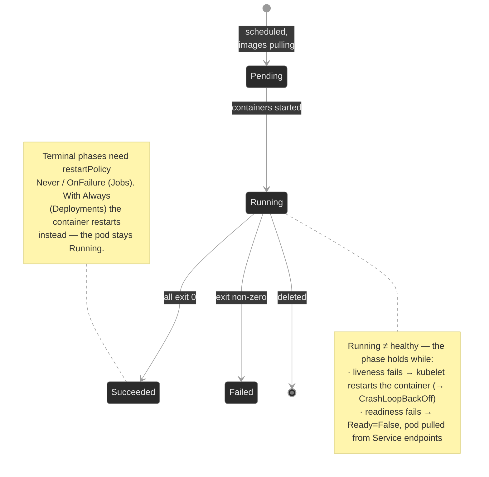
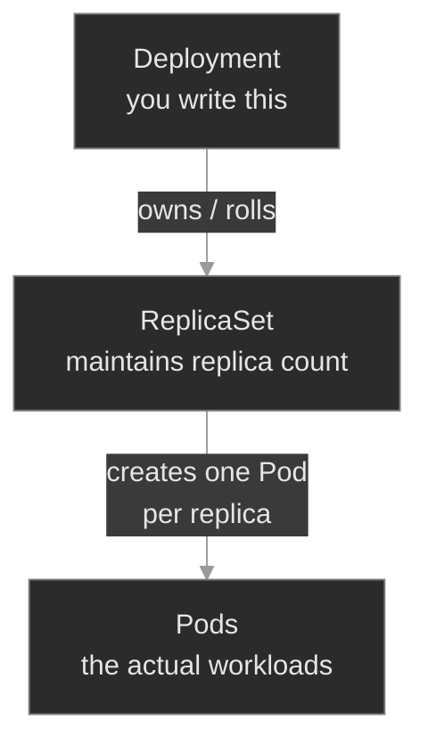

# `m01-workloads-i/`

## Concept

## M01 — Workloads I: Pods, Deployments, ReplicaSets

> What a Pod actually is, how its lifecycle works, how the three probes decide "alive" and "ready," and why graceful shutdown is the difference between a clean rollout and dropped calls.

### What you'll learn

- Describe the Pod lifecycle — phases, container states, and how `restartPolicy` drives restarts
- Distinguish the three probes — liveness, readiness, startup — by what each one decides and what failing each one does
- Trace the Deployment → ReplicaSet → Pod owner chain and explain what declarative reconciliation buys you
- Diagnose a `CrashLoopBackOff` and tell a real crash apart from a self-inflicted liveness loop
- Configure graceful shutdown so in-flight work drains instead of being killed mid-flight
- Explain why the Pod — not the container — is the unit of scheduling, and where init, sidecar, and ephemeral containers fit

### Why it matters

A Pod is the unit you actually operate. Every later module — Services, storage, scheduling, security — is ultimately about getting Pods to run, stay healthy, and shut down cleanly. The mistakes that page you at 3am are rarely exotic: a liveness probe pointed at a path the app doesn't serve, restarting a perfectly healthy container into a crash loop. A readiness probe on the wrong port, quietly pulling every replica out of rotation while the Pods themselves look fine. A `terminationGracePeriodSeconds` too short for the drain, so every rollout sheds a few live calls.

At Polyphone these are not hypotheticals. `session-broker` holds in-flight media sessions; kill it without draining and customers hear their calls drop. `sip-app` sits behind a Service; mark it not-ready and the Service has nowhere to route. The probes and the shutdown sequence are the controls that decide whether a routine deploy is invisible to customers or shows up on the status page. This module is where you learn to read and set them.

### Scope

**Covers:** the Pod lifecycle (phases, container states, `restartPolicy`, `CrashLoopBackOff`), the three probes and their distinct jobs, the Deployment → ReplicaSet → Pod controller chain and declarative reconciliation, graceful termination (`SIGTERM`, `preStop`, `terminationGracePeriodSeconds`), and the shape of a multi-container Pod (init, sidecar, and ephemeral containers, including native sidecar containers).

**Doesn't cover:** rollout strategy tuning and rollbacks in depth (M09), Services and how readiness feeds Endpoints in depth (M04 — touched here because readiness only makes sense alongside it), images and pull semantics (M02), Jobs and CronJobs (M01b), StatefulSets and DaemonSets (M07), scheduling and resources (M06), the service mesh that popularizes sidecars (M15 — here you learn the Pod-level mechanic, not the mesh).

**Assumes:** you finished M00 — the `spec`/`status` model, the `get → describe → events → logs` loop, and the owner-chain idea (a controller's failure event lands on the controller, not the thing it failed to create). You know a container is a packaged process.

### Vocabulary

| Term | Definition |
|------|------------|
| **Pod** | The smallest deployable unit. One or more containers sharing a network namespace (one IP), volumes, and a lifecycle. |
| **Pod phase** | The high-level lifecycle state in `status.phase`: `Pending`, `Running`, `Succeeded`, `Failed`, `Unknown`. |
| **Container state** | The per-container state inside a Pod: `Waiting`, `Running`, `Terminated`. Finer-grained than the Pod phase. |
| **restartPolicy** | Pod-level rule for restarting containers that exit: `Always` (default), `OnFailure`, `Never`. Deployments require `Always`. |
| **CrashLoopBackOff** | Not a crash itself — the kubelet's state for "this container keeps exiting, so I'm waiting (with exponential backoff) before restarting it again." |
| **Liveness probe** | Decides whether a container is alive. On failure the kubelet **restarts** the container. |
| **Readiness probe** | Decides whether a container can serve traffic. On failure the Pod is **removed from Service Endpoints** — no restart. |
| **Startup probe** | Protects slow-starting containers. Liveness and readiness checks are suppressed until it succeeds once. |
| **Probe handler** | How a probe checks: `httpGet` (2xx/3xx = pass), `tcpSocket` (connect = pass), `exec` (exit 0 = pass), `grpc`. |
| **Deployment** | Controller for stateless, fungible Pods. Owns a ReplicaSet; runs rolling updates when the Pod template changes. |
| **ReplicaSet** | Controller that maintains a target replica count. Created and rolled by the Deployment — you rarely write one yourself. |
| **Reconciliation** | The control loop: read `spec`, read `status`, act to close the gap. Continuous, not one-shot. |
| **preStop hook** | A command or HTTP call the kubelet runs **before** `SIGTERM`, inside the grace period. Used to drain connections. |
| **terminationGracePeriodSeconds** | How long the kubelet waits after starting termination before sending `SIGKILL`. Default 30. Bounds `preStop` + `SIGTERM` handling. |
| **Init container** | A container that runs to completion before the app containers start. Sequential; used for setup/wait-for-dependency. |
| **Ephemeral container** | A throwaway container injected into a running Pod for debugging (`kubectl debug`). No probes, no restarts. |
| **Sidecar container** | A helper that runs alongside the app for the Pod's whole life (proxy, log shipper, config reloader). The native form is an init container with `restartPolicy: Always`. |

### Mental model

A Pod moves through **phases**, but the phase is coarse. The fine-grained truth lives in **container states** and the **conditions** (`PodScheduled`, `Initialized`, `ContainersReady`, `Ready`). Probes are the inputs that flip the `Ready` condition and trigger restarts; `restartPolicy` decides what a container exit means. Hold this picture: the phase tells you roughly where the Pod is; the container state and conditions tell you *why*.



The load-bearing insight for this module: **a `Running` phase does not mean healthy.** A Pod can be `Running` and `0/1 READY` for an hour because its readiness probe fails. A Pod can be `Running` with 47 restarts because its liveness probe keeps killing it. The phase is the headline; the probes and container state are the story.

### Concept walkthrough

The walkthrough follows the life of a Pod: who creates it, how it lives, how its health is judged, and how it dies.

#### Who creates the Pod — declarative reconciliation

You don't create Pods directly. You write a Deployment, and a chain of controllers turns that into running Pods<sup><a href="https://kubernetes.io/docs/concepts/workloads/controllers/deployment/">[1]</a></sup>:



A Deployment is a contract: "always keep N copies of this Pod template running." The Deployment controller owns a ReplicaSet; the ReplicaSet controller keeps exactly N Pods alive<sup><a href="https://kubernetes.io/docs/concepts/workloads/controllers/replicaset/">[2]</a></sup>. Delete a Pod and the ReplicaSet makes a new one within seconds. Change the Pod template — a new image, a fixed probe — and the Deployment creates a *new* ReplicaSet and shifts replicas over: a **rolling update**.

This is why the owner chain matters for diagnosis (the M00 instinct): when a Pod can't be created, the failure event lands on the ReplicaSet, not on a Pod that doesn't exist. And it's why `kubectl edit`-ing a live Pod is almost always wrong — the ReplicaSet will replace it and your change vanishes. Edit the Deployment; let it roll.

#### The workload-controller family

Deployment is one of several controllers that manage Pods. They split cleanly by what they depend on, which is also the order you'll learn them:

| Controller | Use when | Where it's taught |
|------------|----------|-------------------|
| **ReplicaSet** | Never write one directly — a Deployment owns it | M01 (this module) |
| **Deployment** | Stateless, fungible Pods; rolling updates | M01 (this module) |
| **Job** | Run-to-completion batch work | M01b — Workloads: Batch |
| **CronJob** | Scheduled / recurring batch work | M01b — Workloads: Batch |
| **StatefulSet** | Stable identity + per-Pod storage + ordered start/stop | M07 (needs Services M04 + Storage M05) |
| **DaemonSet** | Exactly one Pod per node (node-local agents) | M07 (needs Scheduling M06) |

The first four — Deployment, ReplicaSet, Job, CronJob — need only the Pod lifecycle you're learning here, so they live in the "Workloads I" cluster (this module plus M01b). StatefulSets and DaemonSets are deferred to M07 because they only make sense once you've met headless Services (M04), PersistentVolumes (M05), and Scheduling (M06) — they're the *payoff* of those modules, not a prerequisite for them.

#### How the Pod lives — phases, states, and restartPolicy

`status.phase` is the coarse view. Underneath, each container is `Waiting`, `Running`, or `Terminated`, and `describe` shows the reason — `ContainerCreating`, `CrashLoopBackOff`, `Completed`, `Error`, `OOMKilled`<sup><a href="https://kubernetes.io/docs/concepts/workloads/pods/pod-lifecycle/">[3]</a></sup>.

When a container exits, `restartPolicy` decides what happens. It's set per Pod and applies to all containers:

- **`Always`** (the default, and the only value a Deployment allows) — restart on any exit, success or failure.
- **`OnFailure`** — restart only on non-zero exit. Used by Jobs (M07).
- **`Never`** — never restart; the Pod goes to `Succeeded` or `Failed`.

Restarts aren't instant. The kubelet backs off exponentially — 10s, 20s, 40s, … capped at 5 minutes — and a container stuck in that cycle reports `CrashLoopBackOff`<sup><a href="https://kubernetes.io/docs/concepts/workloads/pods/pod-lifecycle/#restart-policy">[3]</a></sup>. Read the name precisely: `CrashLoopBackOff` is not the crash. It's the kubelet *waiting between restart attempts*. The crash reason is one level down, in the container's last state:

```bash
kubectl describe pod <pod> -n <ns>        # in Containers:, read the Last State: block — Reason, Exit Code
kubectl logs <pod> -n <ns> --previous     # what the dead container said before it died
```

`--previous` is the key flag: the current container may have just started, so its logs are empty; `--previous` reads the *terminated* one that actually failed.

<details>
<summary>📖 Going deeper: is it really crashing, or is liveness killing it?<sup><a href="https://kubernetes.io/docs/tasks/configure-pod-container/configure-liveness-readiness-startup-probes/">[4]</a></sup></summary>

A `CrashLoopBackOff` has two very different root causes that look identical in `kubectl get pods`:

1. **The app genuinely crashes** — bad config, missing dependency, panic on startup. `kubectl logs --previous` shows the stack trace or error. Exit code is the app's.
2. **A liveness probe kills a healthy app** — the process is fine, but the probe checks something wrong (wrong port, a path that 404s, too tight a timeout), so the kubelet restarts it on a timer. `kubectl logs --previous` shows a *clean* log that just stops, and `kubectl describe pod` shows `Liveness probe failed` events with `Killing` right after.

The tell is in `describe`: a real crash shows `Last State: Terminated, Reason: Error` with the app's exit code and **no** liveness events. A liveness loop shows `Liveness probe failed: ...` followed by `Killing container with id ...`. Reading that distinction is the entire point of `breakfix-01`.

</details>

#### How health is judged — the three probes

Three probes, three different jobs. Confusing them is the most common probe mistake there is<sup><a href="https://kubernetes.io/docs/tasks/configure-pod-container/configure-liveness-readiness-startup-probes/">[4]</a></sup>.

| Probe | Question it answers | On failure | When you need it |
|-------|---------------------|------------|------------------|
| **liveness** | Is the process wedged and unrecoverable? | kubelet **restarts** the container | Deadlocks an app can't detect itself |
| **readiness** | Can this Pod serve traffic *right now*? | Pod **removed from Service Endpoints** (no restart) | Warm-up, loss of a dependency, backpressure |
| **startup** | Has a slow app finished booting? | container **killed** after `failureThreshold`; suppresses the other two until it passes | Apps with long, variable startup |

The distinction that matters most operationally is **liveness vs readiness**:

- A failing **liveness** probe is a *blunt* instrument — it restarts. If the cause isn't restart-fixable (a dependency is down), liveness turns a degraded service into a crash loop. **Default to no liveness probe, or a very conservative one.** Liveness should answer "this process is wedged and only a restart will help" — nothing else.
- A failing **readiness** probe is *gentle* — it pulls the Pod from rotation but leaves it running, so it can recover and rejoin. Lost a database connection? Fail readiness, keep the process, let the Service route elsewhere until it's back.

Every probe shares the same timing knobs: `initialDelaySeconds`, `periodSeconds`, `timeoutSeconds`, `successThreshold`, `failureThreshold`. A probe that's too aggressive (1s period, 1 failure threshold, tight timeout) will flap under normal load. Use a `startupProbe` for slow boots instead of inflating `initialDelaySeconds` on liveness — that's exactly what startup probes exist for<sup><a href="https://kubernetes.io/docs/tasks/configure-pod-container/configure-liveness-readiness-startup-probes/#define-startup-probes">[4]</a></sup>.

Readiness is the probe that ties into networking. A Service routes only to Pods whose `Ready` condition is true; a failed readiness probe drops the Pod from the Service's EndpointSlice and traffic stops arriving — even though the Pod is still `Running`. That's the "traffic blackhole" of `breakfix-02`: every replica `Running`, every replica `0/1 READY`, Service Endpoints empty, callers getting connection refused. (Services and Endpoints come in full in M04; here you only need the readiness → Endpoints link.)

#### How the Pod dies — graceful termination

Deletion is not instant, and it shouldn't be. When a Pod is deleted (directly, or because a rollout/scale-down is replacing it), the kubelet runs an ordered sequence<sup><a href="https://kubernetes.io/docs/concepts/workloads/pods/pod-lifecycle/#pod-termination">[3]</a></sup>:

```text
delete issued
   │
   ▼
Pod marked "Terminating"  →  dropped from Service Endpoints
                             (new traffic stops arriving)
   │
   ▼
┌─ terminationGracePeriodSeconds  (default 30s) ───────────────┐
│                                                              │
│ preStop hook runs (if defined)                               │
│       │                                                      │
│       ▼                                                      │
│ SIGTERM → PID 1   app should drain in-flight                 │
│                   work, then exit                            │
│       │                                                      │
│       ▼                                                      │
│ grace period expires                                         │
│                                                              │
└──────────────────────────────────────────────────────────────┘
   │
   ▼
SIGKILL (forced)  ─ container killed, pod object removed
```

Two controls shape this:

- **`preStop` hook** — a command or HTTP call the kubelet runs *before* `SIGTERM`<sup><a href="https://kubernetes.io/docs/concepts/containers/container-lifecycle-hooks/">[5]</a></sup>. The classic use is a short `sleep` to let load balancers and `kube-proxy` finish removing the Pod from rotation before the process starts refusing connections — endpoint removal and `SIGTERM` race otherwise.
- **`terminationGracePeriodSeconds`** — the total budget. `preStop` execution and `SIGTERM` handling both spend from it. If the budget is smaller than the drain takes, the kubelet sends `SIGKILL` mid-drain and in-flight work dies.

The failure mode: an app that needs, say, 15 seconds to finish in-flight sessions, behind a `terminationGracePeriodSeconds: 1`. The kubelet `SIGKILL`s it ~1 second in, every time it's replaced. Calls drop on every rollout. That's `breakfix-03` — and the fix is making the grace period exceed the real drain time, not removing the drain.

<details>
<summary>📖 Going deeper: the preStop / grace-period accounting<sup><a href="https://kubernetes.io/docs/concepts/workloads/pods/pod-lifecycle/#pod-termination">[3]</a></sup></summary>

The grace-period clock starts when termination begins and covers the **whole** sequence, `preStop` included. If your `preStop` sleeps 15s and `terminationGracePeriodSeconds` is 30, the app gets `SIGTERM` at ~15s and ~15s more to exit. If the grace period is 10, the kubelet kills the container while `preStop` is still sleeping — the hook is truncated and `SIGTERM` may never reach a draining app.

One subtlety: if a `preStop` hook is still running when the grace period expires, the kubelet grants a single short extension (about 2 seconds) before `SIGKILL` — enough to unwind, not enough to finish a real drain. Don't rely on it. Size the grace period for `preStop` + actual shutdown, with headroom.

Also: `SIGTERM` goes to PID 1 in the container. If your image launches the app under a shell (`sh -c "app"`), the shell is PID 1 and may not forward the signal — the app never hears `SIGTERM` and gets `SIGKILL`ed at grace expiry regardless. Use an init-like `tini`, exec-form `CMD`, or ensure the app is PID 1.

</details>

#### Why the Pod is the atom — init, sidecar, and ephemeral containers

You schedule Pods, not containers, because the containers in a Pod are a team: co-scheduled onto one node, sharing a network namespace (one IP; they reach each other on `localhost`), IPC, and volumes. That shared context is the reason the Pod is the unit at all — and it's what makes three secondary container types useful.

**Init containers** run to completion, in order, before any app container starts — used to wait for a dependency or prepare a volume<sup><a href="https://kubernetes.io/docs/concepts/workloads/pods/init-containers/">[6]</a></sup>; a Pod stuck in `Init:0/1` is an init container that hasn't finished.

**Sidecar containers** run *alongside* the app for the Pod's whole life — a mesh proxy, a log shipper, a config reloader. The modern form is a **native sidecar**: an init container with `restartPolicy: Always`<sup><a href="https://kubernetes.io/docs/concepts/workloads/pods/sidecar-containers/">[7]</a></sup> (beta and on by default since v1.29, GA in v1.33). Native sidecars fixed three long-standing problems with running a helper as an ordinary container — below.

**Ephemeral containers** are injected into a *running* Pod for debugging via `kubectl debug` — no probes, no restarts. They're how you debug a distroless or crashing Pod that `kubectl exec` can't help with (no shell to exec into): the ephemeral container brings its own tools and joins the Pod's namespaces without altering it.

<details>
<summary>📖 Going deeper: native sidecars and the three problems they solve<sup><a href="https://kubernetes.io/docs/concepts/workloads/pods/sidecar-containers/">[7]</a></sup></summary>

Before native sidecars, a helper ran as a normal entry in `containers`, which broke in three ways:

1. **Startup ordering.** Nothing guaranteed the proxy was ready before the app started taking traffic — the app could come up first and fail its first calls. A native sidecar (in `initContainers`) starts and becomes ready *before* later containers, so the app starts into a working proxy.
2. **Shutdown ordering.** On termination an ordinary sidecar could die before the app finished draining — cutting off the very path the app needed to drain through. The kubelet keeps native sidecars alive until the main containers exit, then shuts them down in reverse order: the graceful-shutdown story from this module, extended to multi-container Pods.
3. **Jobs never completing.** A Job's Pod is "done" only when *every* container exits. An ordinary sidecar that runs forever (a `tail -f` log shipper) keeps the Pod `Running` after the batch work finished, so the Job hangs at `0/1` forever. Native sidecars are terminated once the main container exits, so the Job completes. That exact failure — and the fix — is M01b `breakfix-04`.

The rule: if a helper must live as long as the app, make it a native sidecar (`initContainers` + `restartPolicy: Always`), not an ordinary container.

</details>

### Hands-on

Four scenarios, all on the full Polyphone fleet. The baseline shows what a well-configured workload looks like; each breakfix isolates one probe/lifecycle failure.

- **`baseline/`** — Tour a healthy, fully-configured `sip-app`: the Deployment → ReplicaSet → Pod chain, the lifecycle, all three probes reporting healthy, readiness feeding Service Endpoints, and a clean graceful shutdown. The reference for "what good looks like."
- **`breakfix-01-liveness-restart-loop/`** — A workload is in `CrashLoopBackOff`, but the app is fine. Tests telling a real crash from a liveness probe killing a healthy container.
- **`breakfix-02-readiness-traffic-blackhole/`** — Pods are `Running` but a Service has no endpoints and callers get nothing. Tests the readiness → Endpoints link, and the fact that readiness failures don't restart.
- **`breakfix-03-prestop-truncation/`** — A rollout drops in-flight work. Tests reading the termination sequence and sizing `terminationGracePeriodSeconds` against the real drain.

Check yourself against `ANSWER-KEY.md` after each one.

### Common failure modes

| Symptom | Likely cause | Where to look |
|---------|--------------|---------------|
| `CrashLoopBackOff`, app logs look clean and just stop | Liveness probe killing a healthy container | `describe pod` → `Liveness probe failed` + `Killing` events |
| `CrashLoopBackOff`, logs show an error/stack trace | App genuinely crashing | `kubectl logs --previous`; fix config/image |
| Pods `Running` but `0/1 READY`; Service has no endpoints | Readiness probe failing (wrong port/path) | `describe pod` → `Readiness probe failed`; `kubectl get endpoints <svc>` |
| Calls/requests drop on every deploy | `terminationGracePeriodSeconds` too short for the drain | `get pod -o yaml` → grace period vs `preStop`; time a deletion |
| Pod stuck `Init:0/1` | An init container hasn't completed | `kubectl logs <pod> -c <init-container>` |
| Liveness flaps under load | Probe too aggressive (period/timeout/threshold) | `describe pod` probe config; widen timing or use a startup probe |

### Recap

- A `Running` Pod is not a healthy Pod. Phase is the headline; container state, conditions, and probes are the story.
- The three probes have three jobs. **Liveness restarts** (use sparingly — a wrong one self-inflicts a crash loop). **Readiness gates traffic** (pulls from Endpoints, no restart). **Startup** protects slow boots and suppresses the other two until it passes.
- `CrashLoopBackOff` is the kubelet *backing off between restarts*, not the failure itself. The reason is in `lastState.terminated` and `logs --previous`.
- You write Deployments; controllers reconcile them into Pods continuously. Edit the Deployment, not the Pod — the ReplicaSet replaces Pods.
- Graceful shutdown is `preStop` then `SIGTERM`, all inside `terminationGracePeriodSeconds`. If the budget is smaller than the drain, work dies on every rollout.

### Production thinking

- A liveness probe restarts a container when it fails. Name a failure where restarting makes the incident *worse*, and decide whether that workload should have a liveness probe at all.
- Your readiness probe checks a downstream dependency. The dependency has a 30-second blip. What happens to every replica's `Ready` state at once, and what does that do to the Service — is the cure worse than the disease?
- You're setting `terminationGracePeriodSeconds` for a workload that holds long-lived sessions (a media leg, a websocket). How do you find the right number, and what's the cost of guessing too high versus too low?

### References

1. Kubernetes — Deployment: https://kubernetes.io/docs/concepts/workloads/controllers/deployment/
2. Kubernetes — ReplicaSet: https://kubernetes.io/docs/concepts/workloads/controllers/replicaset/
3. Kubernetes — Pod Lifecycle: https://kubernetes.io/docs/concepts/workloads/pods/pod-lifecycle/
4. Kubernetes — Configure Liveness, Readiness and Startup Probes: https://kubernetes.io/docs/tasks/configure-pod-container/configure-liveness-readiness-startup-probes/
5. Kubernetes — Container Lifecycle Hooks: https://kubernetes.io/docs/concepts/containers/container-lifecycle-hooks/
6. Kubernetes — Init Containers: https://kubernetes.io/docs/concepts/workloads/pods/init-containers/
7. Kubernetes — Sidecar Containers: https://kubernetes.io/docs/concepts/workloads/pods/sidecar-containers/


---

## Break/Fix Practice

## Break/fix 01 — Liveness Restart Loop

**Symptom — what you'd actually see:**

Alert: `route-engine` in `call-routing` is in `CrashLoopBackOff`. The restart count climbs every ~15 seconds.

**Think about this before you open the answer:**

Not fixing a probe path — that's trivial. The lesson is **telling a real crash from a probe killing a healthy app** before you waste an incident debugging code that was never broken. Self-grading questions:

- Did you run `kubectl logs --previous` and notice the log was *clean*?
- Did you read `describe` and spot `Liveness probe failed` + `Killing` (probe) versus a bare `Terminated/Error` with no probe events (real crash)?
- Did you resist "the app is broken, let me read the code" and instead ask "what's killing it"?

<details>
<summary>📖 Going deeper: should this workload have a liveness probe at all?<sup><a href="https://kubernetes.io/docs/tasks/configure-pod-container/configure-liveness-readiness-startup-probes/">[1]</a></sup></summary>

Liveness is a blunt instrument: its only action is restart. That helps exactly one failure class — a process wedged in a state only a restart clears (a deadlock it can't detect itself). For everything else, restarting is either useless or harmful:

- **Dependency down?** Restarting won't bring the database back; it just adds churn. Use readiness — stop taking traffic, keep the process, rejoin when the dependency recovers.
- **Slow under load?** A tight liveness timeout fires during a latency spike and restarts a busy-but-healthy pod, making the spike worse — a cascading-restart outage.

Rule of thumb: **default to no liveness probe.** Add one only when you can name the wedged state it rescues, and make it conservative (generous `timeoutSeconds`, `failureThreshold` ≥ 3). Use a `startupProbe` for slow boots rather than a long `initialDelaySeconds` on liveness.

</details>

<details>
<summary><b>Click to reveal: diagnostic commands, root cause, exact fix, verify</b></summary>

**Root cause:**

A `livenessProbe` with `httpGet` `path: /healthz` — a path nginx doesn't serve, so it returns `404`. Only HTTP `200`–`399` pass a probe, so liveness fails every period and the kubelet kills and restarts a perfectly healthy container<sup><a href="https://kubernetes.io/docs/tasks/configure-pod-container/configure-liveness-readiness-startup-probes/">[1]</a></sup>. The `CrashLoopBackOff` is the kubelet backing off between those forced restarts<sup><a href="https://kubernetes.io/docs/concepts/workloads/pods/pod-lifecycle/#restart-policy">[2]</a></sup> — not an application crash.

**Diagnostic commands (run in this order):**

```bash
# 1. Confirm it's a loop, not a one-off — restart count rising
kubectl get pods -n call-routing
```

```bash
# 2. Ask the dead container what happened. Clean log that just stops = app didn't crash.
POD=$(kubectl get pod -n call-routing -l app=route-engine -o jsonpath='{.items[0].metadata.name}')
kubectl logs $POD -n call-routing --previous
```

```bash
# 3. Find the killer. Liveness events + Killing = probe, not crash.
kubectl describe pod $POD -n call-routing
# Events: Liveness probe failed: HTTP probe failed with statuscode: 404
#         Killing container ... failed liveness probe
```

```bash
# 4. Read the offending probe — Pod Template's Liveness: line
kubectl describe deploy route-engine -n call-routing
#   Liveness:  http-get http://:http/healthz delay=0s timeout=1s period=10s #success=1 #failure=3
#   nginx serves / , not /healthz → every probe 404s
```

**Exact fix:**

```bash
# Option A: point the probe at a path the app serves
kubectl patch deployment route-engine -n call-routing --type=json \
  -p='[{"op":"replace","path":"/spec/template/spec/containers/0/livenessProbe/httpGet/path","value":"/"}]'

# Option B: kubectl edit, change path: /healthz → path: /
# Option C: if there's no real health endpoint, remove the liveness probe — a
#           wrong liveness probe is worse than none.
```

**Verify:**

```bash
kubectl rollout status deployment route-engine -n call-routing
kubectl get pods -n call-routing -w
# RESTARTS stops climbing; pods stay Running 1/1 READY
```

**Production thinking:**

The live `kubectl patch` stops the bleeding, but the bad probe is in your manifests — on the next Flux reconciliation the cluster drifts back to crash-looping. Real fix: PR to `platform-gitops` correcting (or removing) the probe, let Flux re-apply, then ask how a probe that never passed got merged — should CI have caught a liveness probe pointing at an unserved path? `kubectl` changes are temporary unless the source of truth agrees (Flux and the GitOps loop come in M18).

</details>

---

## Break/fix 02 — Readiness Traffic Blackhole

**Symptom — what you'd actually see:**

Alert: callers of the `directory` service in `app-services` get connection errors. The pods are `Running`. Nothing is restarting.

**Think about this before you open the answer:**

The readiness-vs-liveness distinction made concrete, and the readiness → Endpoints link. Self-grading questions:

- Did you read the `READY` column instead of stopping at `Running`?
- Did you check `kubectl get endpoints` — the command that proves the Service has no backends?
- Did you notice there were **no restarts and no `Killing` events**, and correctly conclude readiness (not liveness) was the cause?

<details>
<summary>📖 Going deeper: when readiness blackholes the whole service at once<sup><a href="https://kubernetes.io/docs/tasks/configure-pod-container/configure-liveness-readiness-startup-probes/">[1]</a></sup></summary>

Readiness is gentle per-Pod, but it has a dangerous failure mode at the fleet level. If a readiness probe checks a **shared downstream dependency** (the same database every replica uses), then when that dependency blips, *every replica fails readiness simultaneously* — and the Service drops to zero endpoints all at once. You've converted a brief dependency hiccup into a total outage of your own service.

Two guards:

- Keep readiness **local** — probe "can this process serve?", not "is the whole backend healthy?". Let a request to the dependency fail and be retried rather than de-registering every pod.
- If you must gate on a dependency, make the probe tolerant (high `failureThreshold`, longer `periodSeconds`) so a short blip doesn't empty the Service.

The general principle: a health check that all replicas evaluate identically against a shared input is a single point of failure wearing a health-check costume.

</details>

<details>
<summary><b>Click to reveal: diagnostic commands, root cause, exact fix, verify</b></summary>

**Root cause:**

A `readinessProbe` with `httpGet` `port: 8080`, but the container serves on `80`. The probe gets `connection refused` every period, so the Pod's `Ready` condition never goes true. A failing readiness probe does **not** restart the container — it removes the Pod from the Service's Endpoints<sup><a href="https://kubernetes.io/docs/tasks/configure-pod-container/configure-liveness-readiness-startup-probes/">[1]</a></sup>. With every replica unready, the Service has zero backends and blackholes traffic<sup><a href="https://kubernetes.io/docs/concepts/services-networking/service/">[3]</a></sup>.

**Diagnostic commands (run in this order):**

```bash
# 1. Read past the phase — Running but 0/1 READY, 0 RESTARTS
kubectl get pods -n app-services -l app=directory
```

```bash
# 2. Confirm the blackhole at the Service — no endpoints
kubectl get endpoints directory -n app-services
# ENDPOINTS   <none>
```

```bash
# 3. Why isn't it Ready? Conditions: Ready False, and NO Killing event (readiness ≠ restart)
POD=$(kubectl get pod -n app-services -l app=directory -o jsonpath='{.items[0].metadata.name}')
kubectl describe pod $POD -n app-services
# Conditions:  Ready  False
# Events:      Readiness probe failed: dial tcp 10.x.x.x:8080: connect: connection refused
```

```bash
# 4. Read the probe vs the served port — Pod Template's Port: and Readiness: lines
kubectl describe deploy directory -n app-services
#   Port:       80/TCP
#   Readiness:  http-get http://:8080/ ...   ← probes 8080, container serves 80
```

**Exact fix:**

```bash
# Point readiness at the served port. Named port 'http' is cleaner than a literal 80.
kubectl patch deployment directory -n app-services --type=json \
  -p='[{"op":"replace","path":"/spec/template/spec/containers/0/readinessProbe/httpGet/port","value":"http"}]'
# or kubectl edit, change port: 8080 → port: http (or 80)
```

**Verify:**

```bash
kubectl rollout status deployment directory -n app-services
kubectl get endpoints directory -n app-services
# ENDPOINTS now lists IP:80 entries — backends restored
kubectl get pods -n app-services -l app=directory
# Running, 1/1 READY
```

**Production thinking:**

Same GitOps story as breakfix-01 — patch to recover, PR to `platform-gitops` for the durable fix. The deeper question is detection: a probe that never passes should fail in staging, not production. Why did a readiness probe on the wrong port reach prod — no smoke test that the Service had endpoints after deploy? A synthetic check on `kubectl get endpoints <svc>` post-rollout would have caught it.

</details>

---

## Break/fix 03 — preStop Truncation

**Symptom — what you'd actually see:**

Report: `session-broker` in `media` drops in-flight call sessions every time it's rolled or scaled. `kubectl get pods` shows nothing wrong — the pod is `Running` and `Ready`.

**Think about this before you open the answer:**

Reading the termination sequence, and recognizing that a healthy-looking pod can still fail on shutdown. Self-grading questions:

- Did you look at the *shutdown controls* (`terminationGracePeriodSeconds`, `preStop`) instead of hunting for a problem in `get pods` (where there isn't one)?
- Did you reproduce the failure by **timing a delete**, rather than guessing?
- Did you fix it by sizing the budget to the drain — *keeping* the drain — rather than deleting the `preStop` hook to make the symptom vanish?

<details>
<summary>📖 Going deeper: grace-period accounting and the PID-1 trap<sup><a href="https://kubernetes.io/docs/concepts/workloads/pods/pod-lifecycle/#pod-termination">[2]</a></sup></summary>

The full sequence, precisely: on deletion the Pod is marked `Terminating` and removed from Endpoints; the kubelet runs `preStop`; then sends `SIGTERM` to PID 1; then waits out the remainder of `terminationGracePeriodSeconds`; then `SIGKILL`. `preStop` and the post-`SIGTERM` wait **share** the one budget. If `preStop` alone exceeds it, the kubelet grants a single ~2-second extension and kills — enough to unwind, not to finish a real drain. Size for `preStop` + app shutdown + headroom; don't lean on the extension.

Two traps beyond sizing:

1. **PID-1 signal forwarding.** `SIGTERM` goes to PID 1 in the container. If the image runs the app under a shell (`sh -c "app"`), the shell is PID 1 and often won't forward the signal — the app never hears `SIGTERM` and gets `SIGKILL`ed at grace expiry no matter how long the budget is. Use exec-form `CMD`, a tiny init like `tini`, or ensure the app itself is PID 1.

2. **Measuring, not guessing.** Don't pick the grace period by gut. Measure the real drain: how long does the longest in-flight unit of work take to complete (a media leg, a long request, a websocket close)? Set the grace period to the p99 of that plus headroom. Too low truncates work; too high makes rollouts and node drains crawl (every pod takes the full budget to leave).

</details>

<details>
<summary><b>Click to reveal: diagnostic commands, root cause, exact fix, verify</b></summary>

**Root cause:**

A `preStop` hook that drains for 15 seconds (`sleep 15`), behind a `terminationGracePeriodSeconds: 1`. The grace period is the total shutdown budget — `preStop` plus `SIGTERM` handling both spend from it<sup><a href="https://kubernetes.io/docs/concepts/containers/container-lifecycle-hooks/">[4]</a></sup>. With only 1 second, the kubelet grants one short (~2s) extension and then `SIGKILL`s the container while `preStop` is still draining<sup><a href="https://kubernetes.io/docs/concepts/workloads/pods/pod-lifecycle/#pod-termination">[2]</a></sup>. The drain is truncated on every termination, so in-flight sessions die.

**Diagnostic commands (run in this order):**

```bash
# 1. The bug is in the shutdown path — read the controls in the spec (describe hides them)
kubectl get deploy session-broker -n media -o yaml
#   terminationGracePeriodSeconds: 1        <- 1s budget
#   lifecycle: { preStop: { exec: { command: ["/bin/sleep","15"] } } }   <- 15s drain
```

```bash
# 2. Reproduce + time it. A delete runs the same sequence as a rollout/scale-down.
POD=$(kubectl get pod -n media -l app=session-broker -o jsonpath='{.items[0].metadata.name}')
time kubectl delete pod $POD -n media
# returns in ~1-3s, not the ~15s the drain needs → drain was cut short
```

**Exact fix:**

```bash
# Size the grace period to exceed the drain (15s) with headroom. Keep the drain.
kubectl patch deployment session-broker -n media \
  -p '{"spec":{"template":{"spec":{"terminationGracePeriodSeconds":30}}}}'
# or kubectl edit, terminationGracePeriodSeconds: 1 → 30
```

**Verify:**

```bash
kubectl rollout status deployment session-broker -n media
POD=$(kubectl get pod -n media -l app=session-broker -o jsonpath='{.items[0].metadata.name}')
time kubectl delete pod $POD -n media
# now blocks ~15s — the full drain runs to completion before the pod exits
```

**Production thinking:**

The patch fixes one workload; the pattern is what matters. Audit every workload that holds in-flight state (media, websockets, long requests) for a grace period that actually fits its drain — and tie it to node operations: `kubectl drain` and node autoscaling both respect `terminationGracePeriodSeconds`, so an undersized one drops work during routine node maintenance, not just deploys. Durable fix lives in `platform-gitops`; the audit and the measurement method are the real deliverable.

</details>

---
