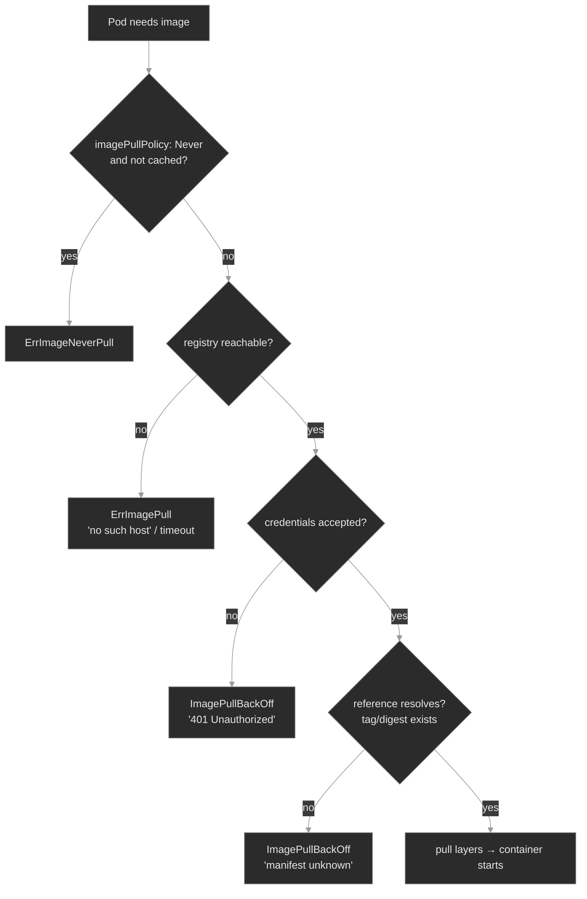

# `m02-images-registries/`

## Concept

## M02 — Container Images & Registries

> What a container image actually is, how a Pod *names* one, and every way the name can fail to become a running container. The pull-failure differential: read the kubelet's status and you know which link in registry → reference → policy → auth broke.

### What you'll learn

- Parse a full image reference — `registry/repository:tag@sha256:digest` — and explain why tags are mutable pointers and digests are immutable content addresses
- Predict what `imagePullPolicy` does given a tag, a digest, and what's already on the node — and recognize `ErrImageNeverPull`
- Pull from a private registry with an `imagePullSecret`, and diagnose the `401 Unauthorized` you get without one
- Work the **pull-failure differential**: map `ErrImagePull` / `ImagePullBackOff` / `ErrImageNeverPull` to a specific cause from the kubelet's message
- Place signing, scanning, mirrors, and promotion in the lifecycle, and know which module enforces each

### Why it matters

Every workload on the platform starts the same way: the kubelet reads a Pod's image reference, asks the container runtime to fetch it, and the runtime talks to a registry. When that handshake fails, the Pod never starts — and "didn't start" is one of the most common pages an SRE takes. The trap is that all the failures *look* the same at a glance: a Pod stuck in `ImagePullBackOff`, no logs (the container never ran, so there's nothing to log). The skill is not "restart it" — it's reading the *one line* in the kubelet's events that says whether the registry was unreachable, the credentials were rejected, the tag didn't exist, or the policy forbade the pull in the first place.

These failures also arrive at the worst times. A `:latest` tag that worked yesterday silently points at a new, broken build today. A registry credential rotates and every Pod that restarts across the fleet wedges at once. A digest pin protects you from exactly that — at the cost of an inscrutable `manifest unknown` when the digest is wrong. At Polyphone, `media-recorder` pulls a proprietary image from an internal registry; the difference between a two-minute fix and an hour of flailing is knowing the differential cold.

### Scope

**Covers:** image reference anatomy (registry, repository, tag, digest, manifest), the OCI image model at the level an operator needs it, `imagePullPolicy` and the node image cache, pulling from a private registry with `imagePullSecrets`, and the pull-failure differential (`ErrImagePull`, `ImagePullBackOff`, `ErrImageNeverPull`, auth vs not-found vs unreachable).

**Doesn't cover:** building images (Dockerfiles, BuildKit, multi-stage builds) — that's a CI concern, not a cluster one. Admission-time enforcement of signed/scanned images → M20 (Kyverno / signed-image admission). GitOps-driven promotion across environments → M16–M19. Mounting image content as config (ConfigMaps/Secrets) → M03. How images consume node CPU/memory and compete for capacity → M06.

**Assumes:** you finished M00 (the `get → describe → events → logs` diagnostic loop; that a failure event lands on the owner) and M01 (Pods, Deployments, container states, `CrashLoopBackOff`). You know a container is a process started from an image. This module is about the step *before* the process starts: turning an image *name* into image *bytes* on a node.

### Vocabulary

| Term | Definition |
|------|------------|
| **image** | A read-only bundle of filesystem layers plus a config (entrypoint, env, etc.), addressable by content. What a container is started from. |
| **registry** | A server that stores and serves images over the OCI distribution API. Docker Hub, GHCR, ECR, or an in-cluster `registry:2`. |
| **repository** | A named collection of related images within a registry (e.g. `polyphone/media-recorder`). |
| **image reference** | The full string a Pod uses to name an image: `[registry/]repository[:tag][@digest]`. |
| **tag** | A human-friendly, **mutable** pointer to an image within a repository (`:1.4.2`, `:latest`). Can be moved to point at different content later. |
| **digest** | A `sha256:` hash of the image's content — an **immutable**, content-addressed identifier. `@sha256:abc…` always names the exact same bytes. |
| **manifest** | The registry document listing an image's layers and config by digest. A **manifest list** (image index) maps platforms (amd64/arm64) to per-platform manifests. |
| **imagePullPolicy** | When the kubelet pulls vs reuses the node cache: `Always`, `IfNotPresent`, or `Never`. |
| **image cache** | Images already pulled onto a node by the runtime. `IfNotPresent` and `Never` read from it; `Always` checks the registry every time. |
| **imagePullSecret** | A Secret of type `kubernetes.io/dockerconfigjson` holding registry credentials, referenced by a Pod (or ServiceAccount) so the kubelet can authenticate the pull. |
| **ImagePullBackOff** | The kubelet tried to pull, failed, and is backing off retries. The *reason* (auth, not-found, unreachable) is in the events, not this status. |
| **ErrImageNeverPull** | `imagePullPolicy: Never` and the image isn't cached on the node — so the kubelet refuses to pull and the Pod can't start. |
| **mirror / pull-through cache** | A registry that fronts another, caching pulls — configured at the runtime (containerd `hosts.toml`), invisible to the Pod spec. |
| **signing / scanning** | Cryptographically attesting an image's provenance (cosign/sigstore) and inspecting it for known vulnerabilities (Trivy/Grype). Enforced at admission → M20. |

### Mental model

An image reference is a *name*; a running container needs the *bytes*. Everything in this module is one path — the kubelet resolving a name into bytes on a node — and the differential is just the set of points where that path can break. Read the kubelet's event message and you know which one.



The four red leaves are the four ways the path breaks, in the order the kubelet hits them: policy refused to pull, the registry was unreachable, the credentials were rejected, or the reference didn't resolve. The diagnostic instinct, inherited straight from M00: **the status tells you it's stuck; the event message tells you why.** Never fix an `ImagePullBackOff` without reading the message first.

### Concept walkthrough

#### Anatomy of an image reference: tags move, digests don't

A full reference has up to four parts:

```text
registry.example.com / polyphone/media-recorder : 1.4.2 @ sha256:9f2a…c1
└──── registry ──────┘ └──── repository ───────┘ └tag┘  └──── digest ────┘
```

Omit the registry and the runtime defaults to Docker Hub (`docker.io`); omit the tag and it defaults to `:latest`<sup><a href="https://kubernetes.io/docs/concepts/containers/images/">[1]</a></sup>. The load-bearing distinction is between the two ways to name the content:

- A **tag** is a mutable label. `polyphone/media-recorder:1.4.2` points at whatever the registry currently has under `1.4.2`. Someone can push new bytes to that same tag tomorrow, and every node that pulls it afterward gets different content. `:latest` is the extreme case — it moves constantly.
- A **digest** is the SHA-256 of the image's manifest. `@sha256:9f2a…` names *exactly those bytes* and can never name anything else — if the content changes, the digest changes. This is content addressing<sup><a href="https://github.com/opencontainers/image-spec/blob/main/spec.md">[4]</a></sup>.

This is why production deployments **pin by digest**: a tag is a promise the registry can break, a digest is a fact. Pinning guarantees every node, every restart, every region runs byte-identical code, and it's the foundation that signing and promotion build on. The cost: get the digest wrong and the pull fails closed with `manifest unknown` — the safety feature working, not a bug. There is no "close enough" for a content address; the registry has no manifest stored under that hash, so it refuses rather than serving something approximate.

<details>
<summary>📖 Going deeper: the digest is the trust anchor — signing and promotion both ride on it<sup><a href="https://docs.sigstore.dev/">[5]</a></sup></summary>

Because a digest is immutable and unforgeable, it's the thing you sign and the thing you promote. Image signing (cosign/sigstore) produces a signature *over a digest* and stores it alongside the image; `cosign verify <ref>@sha256:…` checks that a trusted key signed exactly those bytes<sup><a href="https://docs.sigstore.dev/">[5]</a></sup>. Promotion across environments (lab → stage → prod) should move the **same digest**, not re-resolve a tag in each environment — otherwise "what I tested in stage" and "what shipped to prod" can silently differ. A tag like `:1.4.2` can mean different bytes in two registries; a digest cannot.

So the supply-chain story is one chain: build → push → **digest** → sign the digest → scan the digest → admission verifies the signature on the digest → promote the digest unchanged. M02 teaches the anchor; M20 teaches the admission controller that *enforces* "only signed, scanned digests run here." Pinning by digest in your manifests is the prerequisite that makes all of it meaningful.

</details>

#### How — and whether — the kubelet pulls: `imagePullPolicy` and the node cache

Before the kubelet pulls anything, `imagePullPolicy` decides whether it *should*<sup><a href="https://kubernetes.io/docs/concepts/containers/images/#image-pull-policy">[3]</a></sup>:

- **`Always`** — check the registry on every Pod start; pull if the digest differs from cache. Safe for mutable tags, costs a registry round-trip each time.
- **`IfNotPresent`** — use the node's cached image if any copy exists; only pull when it's absent. Fast, but a stale cache can serve old bytes for a mutable tag.
- **`Never`** — never contact a registry. Use the cache or fail. For images side-loaded onto nodes out of band.

If you don't set it, Kubernetes defaults based on the reference: a `:latest` tag (or no tag) defaults to `Always`; any other tag or a digest defaults to `IfNotPresent`<sup><a href="https://kubernetes.io/docs/concepts/containers/images/#imagepullpolicy-defaulting">[3]</a></sup>. That default encodes the lesson: a moving tag should be re-checked every time; a pinned reference can trust the cache because the cache can't be wrong about immutable content.

The failure mode to know: `imagePullPolicy: Never` on an image the node has never cached. The kubelet won't pull it, so the Pod stalls at `ErrImageNeverPull` — distinct from `ImagePullBackOff` because *no pull was even attempted*. The same `Never`/`IfNotPresent` reliance on cache is also how the subtle "it ran the old code" incidents happen: a mutable tag plus a warm cache means a node can keep serving bytes the registry no longer has under that tag.

#### Pulling from a private registry: `imagePullSecrets` and registry auth

Public images (Docker Hub's library, most of the Polyphone fleet's `nginx:1.25`) pull anonymously. Internal images don't — the registry demands credentials, and an anonymous pull gets `401 Unauthorized`. You give the kubelet credentials with an `imagePullSecret`: a Secret of type `kubernetes.io/dockerconfigjson`, created most easily with<sup><a href="https://kubernetes.io/docs/tasks/configure-pod-container/pull-image-private-registry/">[2]</a></sup>:

```bash
kubectl create secret docker-registry regcred \
  --docker-server=<registry-host:port> \
  --docker-username=<user> --docker-password=<pass> \
  -n <namespace>
```

Then reference it from the Pod spec (`spec.imagePullSecrets: [{name: regcred}]`) or attach it to the Pod's ServiceAccount so every Pod inherits it. Two operational facts decide most auth incidents:

- **The secret is namespaced and matched by host.** A `regcred` in `media` does nothing for a Pod in `signaling`, and its `--docker-server` must match the image reference's registry host exactly — `localhost:5000` ≠ `registry.local:5000`.
- **The failure is silent until a pull happens.** Already-running Pods keep running on cached images. The page comes when something *restarts* — a node reboot, a rollout, a scale-up — and suddenly authenticates against a registry whose credential rotated. The blast radius is "everything that restarts," which is why a rotated-then-not-updated pull secret can take out a swath of the fleet at once.

Concretely, the auth branch of the differential: a Pod references the internal registry with no (or wrong) `imagePullSecret`, the registry returns `401`, and the Pod sits in `ImagePullBackOff` with `unauthorized` in its events.

<details>
<summary>📖 Going deeper: registry mirrors and pull-through caches live in the runtime, not the Pod<sup><a href="https://github.com/containerd/containerd/blob/main/docs/hosts.md">[6]</a></sup></summary>

At scale you don't want every node pulling every image straight from Docker Hub — rate limits, egress cost, and a single point of failure. A **pull-through cache** (or mirror) is a registry that fronts an upstream one and caches what it serves. The key operational point: this is configured at the **container runtime**, not in the Pod spec. For containerd, a host-config file at `/etc/containerd/certs.d/<host>/hosts.toml` redirects pulls for a registry to one or more mirror endpoints (and is also where you mark a registry as plain-HTTP/insecure)<sup><a href="https://github.com/containerd/containerd/blob/main/docs/hosts.md">[6]</a></sup>:

```toml
server = "https://registry-1.docker.io"
[host."https://mirror.internal:5000"]
  capabilities = ["pull", "resolve"]
```

A Pod still says `image: nginx:1.25`; the runtime transparently sources it from the mirror. The diagnostic implication: when a pull behaves differently on one node than another, suspect node-level runtime config (`hosts.toml`, the image cache) — not the Pod spec, which is identical everywhere. The same `hosts.toml` mechanism is what lets a runtime pull from a registry served over plain HTTP — an entry marking that host insecure is the only reason an untrusted-TLS or no-TLS registry resolves at all.

</details>

<details>
<summary>📖 Going deeper: scanning and the supply-chain gate (deferred to M20)<sup><a href="https://kubernetes.io/docs/concepts/security/supply-chain-security/">[7]</a></sup></summary>

Scanning (Trivy, Grype) inspects an image's layers against vulnerability databases and produces a report keyed by digest. Like signing, scanning *produces information*; it doesn't *block* anything on its own. The block happens at admission: a policy controller (Kyverno, OPA Gatekeeper) rejects a Pod whose image isn't signed by a trusted key, or whose scan shows criticals, before the kubelet ever pulls it. That enforcement layer is M20. M02's job is to make sure you understand what's being gated — a digest, an `imagePullSecret`, a reference — so the admission rules in M20 read as obvious rather than magic.

</details>

### Hands-on

Four steps in the baseline, four break/fix scenarios — all on the full Polyphone fleet, now with one image-focused workload layered on: **`media-recorder`** (`media`), which pulls a proprietary image from an **in-cluster authenticated registry** (`registry:2` on `localhost:5000`). It's the anchor for every scenario.

- **`baseline/`** — Anatomy of a reference, tags vs digests, `imagePullPolicy` and the cache, and a healthy private-registry pull with an `imagePullSecret`. What "good" looks like before the differential breaks it.
- **`breakfix-01-never-pull/`** — A Pod stuck in `ErrImageNeverPull`. Tests `imagePullPolicy` and the node cache — telling "wouldn't pull" from "couldn't pull." (No pull was attempted.)
- **`breakfix-02-registry-unreachable/`** — `ImagePullBackOff` with `no such host`. Tests reading the event for a reachability failure (wrong registry host) vs an auth or not-found one.
- **`breakfix-03-imagepull-auth/`** — `media-recorder` in `ImagePullBackOff` with `401 Unauthorized`. Tests wiring an `imagePullSecret` to the internal registry.
- **`breakfix-04-digest-mismatch/`** — A digest-pinned workload fails with `manifest unknown`. Tests references vs digests and fail-closed pinning.

The four scenarios walk the differential diagram top-to-bottom — `ErrImageNeverPull` → `no such host` → `401` → `manifest unknown` — so each isolates one cause and one kubelet message.

Check yourself against `ANSWER-KEY.md` after each.

### Common failure modes

| Symptom | Likely cause | Where to look |
|---------|--------------|---------------|
| `ImagePullBackOff`, event says `401 Unauthorized` / `denied` | Missing/wrong `imagePullSecret`, or rotated credential | `kubectl describe pod` events; `.spec.imagePullSecrets`; secret's `--docker-server` vs image host |
| `ImagePullBackOff`, event says `manifest unknown` / `not found` | Bad reference: wrong tag or wrong `@sha256:` digest | `.spec.containers[].image`; compare digest with `crane digest <ref>` |
| `ErrImageNeverPull` | `imagePullPolicy: Never` and image not cached on the node | `.spec.containers[].imagePullPolicy`; the node's image cache |
| `ImagePullBackOff`, event says `no such host` / `i/o timeout` | Registry host unreachable: typo, DNS, network, or runtime not configured for it | registry host in the reference; node DNS / `hosts.toml` |
| Pod `Running` but serving old/wrong code | Mutable tag + warm cache (`IfNotPresent`) served stale bytes | the tag in use; pin by digest; consider `Always` |
| One node pulls, another fails, same spec | Node-level runtime config or cache differs | containerd `hosts.toml`, per-node image cache |

### Recap

- An image reference is `registry/repository:tag@digest`. **Tags are mutable pointers; digests are immutable content addresses.** Pin by digest when you need "the exact same bytes everywhere," which is also the anchor signing and promotion ride on.
- `imagePullPolicy` decides *whether* to pull: `Always` re-checks the registry, `IfNotPresent`/`Never` trust the node cache. The default is `Always` for `:latest`, `IfNotPresent` otherwise — moving tags get re-checked, pinned ones don't.
- Private registries need an `imagePullSecret` (`dockerconfigjson`), namespaced and matched to the registry host. Auth failures are silent until a Pod restarts and re-pulls — blast radius is "everything that restarts."
- **The pull-failure differential:** `ErrImageNeverPull` = policy refused to pull; `401` = auth; `manifest unknown` = bad reference/digest; `no such host` = unreachable. The status says *stuck*; the event message says *why* — read it first.
- Signing, scanning, and mirrors are real but live elsewhere: signing/scanning *produce* trust info, admission (M20) *enforces* it; mirrors live in the runtime (`hosts.toml`), not the Pod spec.

### Production thinking

- A registry credential rotates Friday night. Nothing breaks immediately — running Pods hold their cached images. Over the weekend, nodes reboot and rollouts happen, and Monday a chunk of the fleet is in `ImagePullBackOff`. What would have caught this before the weekend, and how do you roll a pull-secret change without a thundering-herd of re-pulls?
- Your team pins images by digest for reproducibility. A developer asks why they can't just use `:latest` "so it always gets the newest build." Walk through the failure that convinces them — and the cost digest-pinning adds to the release process.
- You run one cluster per region and pull from a single central registry. What's the blast radius when that registry has an outage, and what does a pull-through cache or per-region mirror change about it?

### References

1. Kubernetes — Images: https://kubernetes.io/docs/concepts/containers/images/
2. Kubernetes — Pull an Image from a Private Registry: https://kubernetes.io/docs/tasks/configure-pod-container/pull-image-private-registry/
3. Kubernetes — Image pull policy: https://kubernetes.io/docs/concepts/containers/images/#image-pull-policy
4. OCI Image Format Specification: https://github.com/opencontainers/image-spec/blob/main/spec.md
5. Sigstore — cosign documentation: https://docs.sigstore.dev/
6. containerd — Registry host configuration (hosts.toml): https://github.com/containerd/containerd/blob/main/docs/hosts.md
7. Kubernetes — Software Supply Chain Security: https://kubernetes.io/docs/concepts/security/supply-chain-security/


---

## Break/Fix Practice

## Break/fix 01 — ErrImageNeverPull

**Symptom — what you'd actually see:**

`metrics-aggregator` in `analytics` never starts after a deploy. `kubectl logs` is empty (the container never ran). Status is **`ErrImageNeverPull`** — not `ImagePullBackOff`.

**Think about this before you open the answer:**

Telling "wouldn't pull" from "couldn't pull." Self-grading questions:

- Did you notice the status was `ErrImageNeverPull`, not `ImagePullBackOff` — and know that means *no pull was attempted*?
- Did you check *both* `imagePullPolicy` and whether the image was cached, rather than fixing one half?
- Did you avoid wasting time on registry/credentials/network (none of which were involved)?

<details>
<summary><b>Click to reveal: diagnostic commands, root cause, exact fix, verify</b></summary>

**Root cause:**

The container has `imagePullPolicy: Never` *and* an image (`nginx:1.27`) that isn't cached on the node — the fleet only ever pulled `nginx:1.25`. `Never` forbids contacting a registry, so with nothing cached the kubelet refuses to start the pod<sup><a href="https://kubernetes.io/docs/concepts/containers/images/#image-pull-policy">[3]</a></sup>. No registry was contacted; this is the one differential branch where *no pull is attempted*.

**Diagnostic commands (run in this order):**

```bash
# 1. The status itself is the first clue — Never, not BackOff
kubectl get pods -n analytics
# 2. The event confirms no pull was tried (Events: section at the bottom of describe)
kubectl describe pod -n analytics -l app=metrics-aggregator
#    "Container image \"nginx:1.27\" is not present with pull policy of Never"
# 3. The two fields that cause it, together (describe hides pull policy → read the yaml)
kubectl get deploy metrics-aggregator -n analytics -o yaml
#    image: nginx:1.27  /  imagePullPolicy: Never
```

**Exact fix:**

Let the kubelet pull (the right fix when the image is meant to come from a registry):

```bash
kubectl patch deployment metrics-aggregator -n analytics \
  --type=json -p='[{"op":"replace","path":"/spec/template/spec/containers/0/imagePullPolicy","value":"IfNotPresent"}]'
```

For a genuinely air-gapped node, the opposite fix: keep `Never`, but pre-load the image (`ctr image import`) or pin a tag already cached (`nginx:1.25`).

**Verify:**

```bash
kubectl get pods -n analytics   # metrics-aggregator Running 1/1
```

**Production thinking:**

`imagePullPolicy: Never` belongs to air-gapped or pre-baked-node setups, where images are side-loaded and pulling is deliberately disabled. The failure here is a process gap: a tag bumped without the matching image being loaded onto every node. The durable fix is either to drop `Never` (pull normally) or to make image pre-loading part of the node-provisioning pipeline so a new tag can't be referenced before it's present.

</details>

---

## Break/fix 02 — Registry Unreachable

**Symptom — what you'd actually see:**

`account-provisioner` in `provisioning` is in `ImagePullBackOff`; tenant onboarding stalled.

**Think about this before you open the answer:**

Classifying a pull failure by its message instead of assuming the pull secret. Self-grading questions:

- Did you read the event and see `no such host`, rather than jumping to "it's an auth problem"?
- Did you identify the *registry* portion of the reference as wrong (vs the repository or tag)?
- Did you understand that `no such host` means it never reached the registry — so auth and manifest are irrelevant?

<details>
<summary><b>Click to reveal: diagnostic commands, root cause, exact fix, verify</b></summary>

**Root cause:**

The image reference names a registry host that doesn't resolve — `registry.polyphone.example/library/nginx:1.25`. The kubelet tries to pull, but DNS can't resolve the host, so containerd never opens a connection<sup><a href="https://kubernetes.io/docs/concepts/containers/images/">[1]</a></sup>. The repository and tag are fine; the *registry* portion of the reference is wrong.

**Diagnostic commands (run in this order):**

```bash
# 1. Status says pull problem — category, not cause
kubectl get pods -n provisioning
# 2. The event message is the diagnosis: "no such host" (Events: section of describe)
kubectl describe pod -n provisioning -l app=account-provisioner
#    Failed to pull ... dial tcp: lookup registry.polyphone.example ... no such host
# 3. Read the reference; the registry host is the broken part (Pod Template's Image: line)
kubectl describe deploy account-provisioner -n provisioning
#    Image:  registry.polyphone.example/library/nginx:1.25
```

**Exact fix:**

Point the reference at a registry that resolves (for this image, Docker Hub):

```bash
kubectl set image deployment/account-provisioner app=nginx:1.25 -n provisioning
```

**Verify:**

```bash
kubectl get pods -n provisioning   # account-provisioner Running 1/1
```

**Production thinking:**

`no such host` / `i/o timeout` in the real world is rarely a typo — it's a decommissioned registry, broken cluster DNS, or egress blocked by a NetworkPolicy or firewall (NetworkPolicy is M14). The fix follows the cause: correct the host, restore DNS, or open the path. A pull-through cache or per-region mirror reduces the blast radius when a central registry is the unreachable thing.

</details>

---

## Break/fix 03 — 401 Unauthorized

**Symptom — what you'd actually see:**

`media-recorder` in `media` is in `ImagePullBackOff`; call recording degraded.

**Think about this before you open the answer:**

Recognizing an auth failure and wiring an `imagePullSecret` correctly. Self-grading questions:

- Did the `401` (vs `no such host` / `manifest unknown`) tell you this was auth, reached-and-rejected?
- Did you get *both* the namespace and the `--docker-server` host right (a mismatch on either silently fails)?
- Did you remember that creating the secret isn't enough — it must be referenced by the pod or ServiceAccount?

<details>
<summary><b>Click to reveal: diagnostic commands, root cause, exact fix, verify</b></summary>

**Root cause:**

`media-recorder` pulls from the authenticated private registry at `localhost:5000` but has no `imagePullSecret`, and no `regcred` secret exists in `media`. The kubelet's pull is anonymous, and the registry rejects it with `401 Unauthorized`<sup><a href="https://kubernetes.io/docs/tasks/configure-pod-container/pull-image-private-registry/">[2]</a></sup>. The host resolved and the registry answered — the credentials are the missing piece.

**Diagnostic commands (run in this order):**

```bash
# 1. The event message: 401, not "no such host" or "manifest unknown" (Events: in describe)
kubectl describe pod -n media -l app=media-recorder
#    ... unexpected status from HEAD request: 401 Unauthorized
# 2. Prove it's an auth gate, not a broken registry
curl -s -o /dev/null -w "%{http_code}\n" http://localhost:5000/v2/                  # 401
curl -s -o /dev/null -w "%{http_code}\n" -u polyphone:reg-pass http://localhost:5000/v2/   # 200
# 3. Confirm no pull secret is wired and none exists
kubectl get pod -n media -l app=media-recorder -o yaml   # no imagePullSecrets: field in spec
kubectl get secret -n media                              # no regcred row
```

**Exact fix:**

Create a `docker-registry` secret in the pod's namespace, matched to the registry host, and attach it:

```bash
kubectl create secret docker-registry regcred \
  --docker-server=localhost:5000 \
  --docker-username=polyphone --docker-password=reg-pass -n media
kubectl patch deployment media-recorder -n media \
  -p '{"spec":{"template":{"spec":{"imagePullSecrets":[{"name":"regcred"}]}}}}'
```

(Attaching the secret to the namespace's ServiceAccount instead makes every pod inherit it.)

**Verify:**

```bash
kubectl get pods -n media -l app=media-recorder   # Running 1/1
```

**Production thinking:**

This is the failure that hits a fleet *all at once*. A rotated credential breaks nothing while pods run on cached images — then a node reboot or rollout triggers re-pulls and a swath of workloads wedge together. Detection: alert on `ImagePullBackOff` rate across the fleet, not per-pod. Remediation: store the pull secret in your secret manager (M11) and roll credential changes ahead of restarts, not after. The durable source of the secret belongs in `platform-gitops`, not a hand-run `kubectl create`.

</details>

---

## Break/fix 04 — Digest Mismatch

**Symptom — what you'd actually see:**

`directory` in `app-services` is in `ImagePullBackOff`; the contacts service is down.

**Think about this before you open the answer:**

Reading `manifest unknown` as a bad-reference failure, and understanding digests. Self-grading questions:

- Did the message (`manifest unknown`, not `401` or `no such host`) tell you the registry was reachable and authenticated, but the reference resolved to nothing?
- Did you recognize the `@sha256:` pin and target the *digest* as wrong (vs the repository)?
- Did you re-pin a real digest (preserving reproducibility) rather than reflexively dropping to a tag?

<details>
<summary><b>Click to reveal: diagnostic commands, root cause, exact fix, verify</b></summary>

**Root cause:**

`directory` is pinned by digest to `nginx@sha256:0000…0000`, a manifest that doesn't exist in the registry. The host resolves and the pull is authenticated (public nginx), but the registry has no manifest for that digest, so the pull fails closed with `manifest unknown`<sup><a href="https://github.com/opencontainers/image-spec/blob/main/spec.md">[4]</a></sup>. A wrong digest can never silently run the wrong image — it refuses to run at all.

**Diagnostic commands (run in this order):**

```bash
# 1. The event message: manifest unknown / not found (Events: section of describe)
kubectl describe pod -n app-services -l app=directory
#    failed to resolve reference ... nginx@sha256:0000...: not found
# 2. The reference is digest-pinned; the digest is the wrong part (Pod Template's Image: line)
kubectl describe deploy directory -n app-services
#    Image:  nginx@sha256:0000000000…0000
# 3. Find a digest that actually exists
crane digest nginx:1.25
```

**Exact fix:**

Re-pin to a digest that resolves (keeps immutability):

```bash
kubectl set image deployment/directory app=nginx@$(crane digest nginx:1.25) -n app-services
# or fall back to the tag if digest-pinning isn't required here:
kubectl set image deployment/directory app=nginx:1.25 -n app-services
```

**Verify:**

```bash
kubectl get pods -n app-services -l app=directory   # Running 1/1
```

**Production thinking:**

A bad digest is almost always a *promotion* bug: a stage→prod promotion referenced the wrong sha, or a manifest was hand-edited. The fail-closed behavior is the system protecting you — far better than silently running the wrong image. The durable practice is to promote the *same* digest across environments mechanically (M16–M19), so the digest that passed stage is byte-for-byte what reaches prod, and never retype a sha by hand. Pinning by digest is also the foundation that signed-image admission (M20) verifies against.

</details>

---
