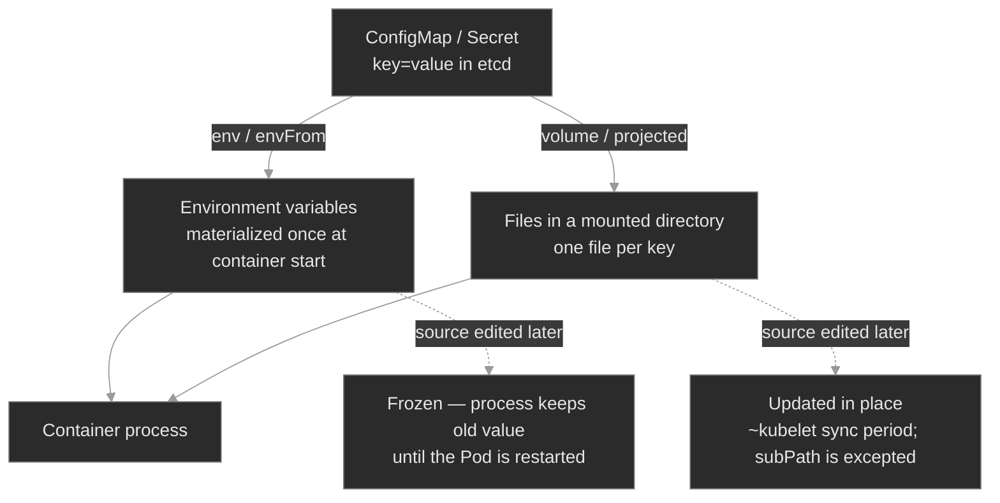

# `m03-configuration/`

## Concept

## M03 — Configuration

> How a Pod gets its configuration — ConfigMaps and Secrets, injected as environment variables or mounted as files — and the four ways that wiring breaks: the Pod won't start, won't update, or runs but reads the wrong value.

### What you'll learn

- Separate a workload's *config* from its *image*, and choose between the two delivery mechanisms: environment variables and mounted files
- Wire a Pod to a ConfigMap and a Secret with `env`, `envFrom`, and volume mounts — and predict the update behavior each one gives you
- Explain why an env var never changes after the container starts, while a mounted file does — eventually — and what `subPath` and `immutable` change about that
- Read a Secret's real contents and explain why base64 is encoding, not security
- Work the config-failure differential: tell `CreateContainerConfigError` from a stuck `ContainerCreating`, and both from a Pod that's `Running` on the wrong value

### Why it matters

The same image runs in `dev`, `stage`, and `prod`; what differs is configuration — the log level, the database host, the feature flags, the credentials. Kubernetes keeps that configuration out of the image, in ConfigMaps and Secrets, and injects it at container start. When the wiring is wrong, the failure lands in one of a few recognizable shapes, and an SRE who can name the shape fixes it in two minutes instead of twenty.

The traps are specific and they recur: a Pod that won't start because a referenced key doesn't exist; a Pod stuck in `ContainerCreating` mounting a Secret that was never created; a ConfigMap someone edited that changed nothing because the consuming Pods were never restarted; and the worst case — a Pod that is `Running` and `Ready` while serving a garbled credential. Each is a different root cause with a different fix, and each starts with reading the Pod's status and events — the instinct M00 and M02 drilled, pointed now at configuration.

### Scope

**Covers:** ConfigMaps and Secrets (Opaque and the common typed Secrets), the two ways a Pod consumes them — environment variables (`env`, `envFrom`) and mounted files (volume and projected volumes) — the update/propagation semantics of each, `immutable`, the downward API in passing, and the config-failure differential (`CreateContainerConfigError`, `FailedMount`, runs-but-wrong).

**Doesn't cover:** keeping Secrets *actually* secret at scale — encryption-at-rest config, External Secrets Operator, Vault, sealed-secrets, sops → M11 (Security II — Secrets at Scale). RBAC on who can read a Secret → M10. TLS material and cert issuance → M12. Templating config across environments (Kustomize/Helm overlays, the config-hash rollout pattern in anger) → M16–M19. This module is the *mechanics*: how config reaches a container and how that reach fails.

**Assumes:** M00 (`get → describe → events → logs`; spec vs status) and M01 (Pods, Deployments, container states, a rolling update). You know a container is a process started from an image (M02); this module is about handing that process its settings.

### Vocabulary

| Term | Definition |
|------|------------|
| **ConfigMap** | A namespaced API object holding non-confidential config as key/value pairs. Consumed as env vars or files. Capped at 1 MiB. |
| **Secret** | Like a ConfigMap, but for confidential data. Values are base64-encoded in `data` and stored in etcd. Encoding is not encryption. |
| **`data` / `stringData`** | A Secret's `data` holds base64-encoded values; `stringData` is a write-only convenience field — you write plaintext, the API server encodes it into `data` and never reads it back. |
| **Opaque** | The default Secret `type`. Other types (`kubernetes.io/dockerconfigjson`, `kubernetes.io/tls`, `kubernetes.io/service-account-token`) carry a required-key schema the kubelet understands. |
| **`env` / `envFrom`** | `env` injects one named key as an environment variable (`valueFrom.configMapKeyRef`/`secretKeyRef`); `envFrom` injects *every* key of a ConfigMap/Secret as env vars. |
| **volume mount** | Projecting a ConfigMap/Secret into a directory, one file per key. The other consumption mode; the one that updates live. |
| **projected volume** | A single mount that combines several sources — `configMap`, `secret`, `downwardAPI`, `serviceAccountToken` — into one directory. |
| **downward API** | A mechanism to expose Pod/container fields (name, namespace, IP, resource limits) to the container as env vars or files. |
| **`optional`** | A flag on a config reference that lets the Pod start even if the ConfigMap/Secret/key is absent, instead of failing. |
| **`immutable`** | A flag that freezes a ConfigMap/Secret's contents (delete-and-recreate to change) and lets the kubelet stop watching it. |
| **`CreateContainerConfigError`** | Container status: the kubelet couldn't assemble the container's config — usually a missing referenced key or object in an `env`/`envFrom` reference. |

### Mental model

Configuration lives in one place — a ConfigMap or Secret in etcd — and reaches a container by one of two paths. The path you pick decides everything downstream: how a missing reference fails, and whether a later edit ever reaches the running process.



Two consequences fall out of this split. **At start:** a missing env reference fails the container *during creation* (`CreateContainerConfigError`); a missing mounted object fails *before* creation, leaving the Pod stuck in `ContainerCreating` on a `FailedMount`. **After start:** an env value is frozen for the life of the container, while a mounted file tracks the source — unless it's a `subPath` mount. Read the status and you know which path broke; know the path and you know whether an edit will ever take.

### Concept walkthrough

#### ConfigMaps and Secrets: two objects, one shape

A ConfigMap is a bag of key/value pairs for non-confidential settings — log levels, hostnames, tuning parameters, whole config files as multi-line values<sup><a href="https://kubernetes.io/docs/concepts/configuration/configmap/">[1]</a></sup>. A Secret is the same shape for confidential data, with two differences: values are base64-encoded in `data`, and the API treats them with more care (typed Secrets, separate RBAC conventions, optional encryption at rest)<sup><a href="https://kubernetes.io/docs/concepts/configuration/secret/">[2]</a></sup>. Both are namespaced and capped at **1 MiB** — they live in etcd and every kubelet that mounts one holds it in memory, so they're for settings, not data blobs.

The base64 in a Secret is the single most misunderstood thing in this module. **Base64 is encoding, not encryption.** Anyone who can `get` the Secret, anyone with etcd access, and anyone who can create a Pod in the namespace can read every Secret in it<sup><a href="https://kubernetes.io/docs/concepts/configuration/secret/#information-security-for-secrets">[3]</a></sup>. The encoding exists so a Secret can carry arbitrary bytes (binary keys, certs) in a JSON field — not to hide anything. To author one without hand-encoding, write plaintext into `stringData`; the API server encodes it into `data` and drops `stringData` on read, so `kubectl get secret -o yaml` always shows base64 `data`.

<details>
<summary>📖 Going deeper: why "Secret" doesn't mean secret — and what actually protects it<sup><a href="https://kubernetes.io/docs/concepts/security/secrets-good-practices/">[4]</a></sup></summary>

The name oversells it. Out of the box a Secret is just base64 in etcd; confidentiality comes from three things layered on top, none on by default in a vanilla cluster<sup><a href="https://kubernetes.io/docs/concepts/configuration/secret/#information-security-for-secrets">[3]</a></sup>:

1. **Encryption at rest.** An `EncryptionConfiguration` on the API server encrypts Secret values before they hit etcd, ideally via a KMS<sup><a href="https://kubernetes.io/docs/tasks/administer-cluster/encrypt-data/">[5]</a></sup>. Without it, an etcd backup is every credential in the clear.
2. **RBAC least privilege.** `get`/`list` on Secrets is the access boundary — with a subtle hole: *anyone who can create a Pod in a namespace can mount any Secret in it and read it*. Namespace boundaries are part of your Secret blast radius, not just `get secret` rules (RBAC → M10).
3. **An external store.** At scale, don't keep long-lived Secrets in the cluster at all — sync them from Vault/cloud managers via the External Secrets Operator, or commit only encrypted material (sealed-secrets, sops) to Git. That's M11.

M03 is the mechanics; M10–M11 are where "secret" becomes true.

</details>

#### Two ways in: environment variables vs mounted files

A container reads config exactly two ways, and the choice is architectural, not cosmetic.

**As environment variables.** `envFrom` injects every key of a ConfigMap or Secret as an env var; `env` with a `valueFrom` injects one named key<sup><a href="https://kubernetes.io/docs/tasks/configure-pod-container/configure-pod-configmap/">[6]</a></sup>:

```yaml
envFrom:
  - configMapRef: { name: app-config }      # every key → an env var
env:
  - name: DB_PASSWORD                        # one key → one env var
    valueFrom:
      secretKeyRef: { name: database-creds, key: DB_PASSWORD }
```

Env vars are simple and universal — every language reads them — but they have two sharp edges. They're materialized once, at container start, and never change after (the next section). And `envFrom` silently skips any key that isn't a valid environment-variable name: a key like `app.properties` is legal in a ConfigMap but illegal as an env var (the dot), so it's dropped, the Pod starts fine, and the only trace is one `InvalidEnvironmentVariableNames` warning event.

**As mounted files.** A ConfigMap or Secret volume projects each key as a file in a directory — `/etc/app-config/LOG_LEVEL` containing `info`<sup><a href="https://kubernetes.io/docs/concepts/configuration/configmap/#using-configmaps">[1]</a></sup>. This suits whole config files and large values, keeps confidential bytes off the process environment, and — critically — tracks the source object when it changes. A **projected volume** combines a ConfigMap, a Secret, downward-API fields, and a ServiceAccount token into one directory<sup><a href="https://kubernetes.io/docs/concepts/storage/projected-volumes/">[7]</a></sup>; the short-lived ServiceAccount token every Pod carries is delivered this way.

The **downward API** is the third source worth naming: it exposes the Pod's own metadata — name, namespace, IP, node, resource requests/limits — as env vars or files, so a process can learn things about itself that aren't in any ConfigMap<sup><a href="https://kubernetes.io/docs/concepts/workloads/pods/downward-api/">[8]</a></sup>. A few fields (labels, annotations) are file-only, because they can change while env is frozen.

#### The update problem: env is frozen, files drift, nothing rolls

This is the concept that pages people. **A ConfigMap or Secret edit does not restart anything** — no controller watches config objects to roll your Deployments. What happens next depends entirely on the consumption path:

- **Environment variables never update.** The value was baked into the container's environment at start. Editing the source ConfigMap changes the object in etcd and nothing else; the running process keeps the old value until its Pod is replaced<sup><a href="https://kubernetes.io/docs/concepts/configuration/configmap/#mounted-configmaps-are-updated-automatically">[9]</a></sup>.
- **Mounted files do update — eventually.** The kubelet refreshes mounted ConfigMaps/Secrets on its periodic sync; the change appears in the file after roughly the kubelet sync period (default ~1 minute) plus cache propagation<sup><a href="https://kubernetes.io/docs/concepts/configuration/configmap/#mounted-configmaps-are-updated-automatically">[9]</a></sup>. The application still has to *re-read* the file — many don't without a SIGHUP or a restart, so "the file updated" and "the app picked it up" are two different things.
- **`subPath` mounts are the trap.** Mounting a single key with `subPath` (to drop one file into an existing directory without hiding its other contents) opts you out of live updates entirely — that file is frozen like an env var<sup><a href="https://kubernetes.io/docs/concepts/configuration/configmap/#mounted-configmaps-are-updated-automatically">[9]</a></sup>.

So when you need a config change to take effect, you make it. The blunt instrument is `kubectl rollout restart deployment/<name>` — it rolls every Pod, which re-reads everything. The durable, GitOps-native one is a **config-hash annotation**: put a checksum of the ConfigMap/Secret into the Pod template's annotations, so changing the config changes the template hash and triggers a normal rolling update — the restart encoded in the manifest, auditable rather than hand-run<sup><a href="https://helm.sh/docs/howto/charts_tips_and_tricks/#automatically-roll-deployments">[10]</a></sup>.

<details>
<summary>📖 Going deeper: <code>immutable</code>, and making config changes safe by construction<sup><a href="https://kubernetes.io/docs/concepts/configuration/configmap/#configmap-immutable">[11]</a></sup></summary>

Setting `immutable: true` on a ConfigMap or Secret does two things (GA since Kubernetes v1.24)<sup><a href="https://kubernetes.io/docs/concepts/configuration/configmap/#configmap-immutable">[11]</a></sup>: it blocks all edits — you must delete and recreate to change the contents — and it lets the kubelet stop watching the object, which materially cuts API-server watch load in clusters with thousands of config objects.

The two benefits compose into a pattern. Name config objects by content — `app-config-7f3a9`, the suffix a hash of the data — mark them `immutable`, and reference the hashed name from the Pod template. Now "changing config" means *creating a new immutable object and updating the reference*, which is itself a Pod-template change, which rolls the Deployment. You get safety (nothing mutates a live config out from under a running Pod), an automatic rollout (the reference changed), and a clean rollback (the old object still exists). The "I edited the ConfigMap and nothing happened" footgun becomes structurally impossible — and it's exactly what Kustomize's and Helm's config generators do for you, garbage-collecting the old objects too.

</details>

#### When config breaks the Pod: the start-up differential

When a config reference is wrong, the failure shape tells you which path broke — the same read-the-status-and-events discipline from M00, applied to configuration. Three shapes cover almost everything:

- **`CreateContainerConfigError`** — the kubelet scheduled the Pod and tried to *create the container*, but couldn't assemble its environment: a required `env`/`envFrom` reference points at a ConfigMap/Secret that doesn't exist, or a key that isn't in it. The describe event is explicit: `Error: couldn't find key MAX_CONNECTIONS in ConfigMap media/app-config`<sup><a href="https://kubernetes.io/docs/tasks/configure-pod-container/configure-pod-configmap/">[6]</a></sup>. This is an *environment-injection* failure — the Pod got far enough to attempt container creation.
- **Stuck `ContainerCreating`, `FailedMount` event** — the Pod references a Secret/ConfigMap as a *volume* that doesn't exist. Volume setup is a precondition to container creation, so the container is never even attempted; the Pod sits in `ContainerCreating` while the kubelet retries the mount and emits `MountVolume.SetUp failed for volume … secret "portal-secrets" not found`. Same root cause as the first shape — a missing referenced object — but a different lifecycle phase, so a different status and a different event to look for.
- **`Running`, but wrong** — no error at all. The reference resolved, the value was injected, the Pod is `Ready` — and the value is wrong: a Secret base64-encoded twice that decodes to a still-encoded string, or a stale env after an un-rolled config edit. This is configuration's instance of a theme that recurs at every layer — the headline status is green and the system is still wrong (M01's `Running` ≠ `Ready`, M01b's `Complete` ≠ correct). You find it not in the status but by reading the value the container actually got: `kubectl exec … -- printenv` or `cat` the mounted file.

The escape hatch for the first two is `optional: true` on the reference — a missing object or key is then skipped and the Pod starts<sup><a href="https://kubernetes.io/docs/tasks/configure-pod-container/configure-pod-configmap/">[6]</a></sup>. Use it where the app has a sane fallback; avoid it where you'd rather fail loudly than start on an empty value, because `optional` converts a `CreateContainerConfigError` you'd notice into a silent missing value you might not.

### Hands-on

Four steps in the baseline, four break/fix scenarios — all on the full Polyphone fleet, configured the way real workloads are: `session-broker` (`media`) reads an `app-config` ConfigMap both as env vars and as mounted files; `account-provisioner` (`provisioning`) takes its `database-creds` Secret as env; `portal-ui` (`admin-portal`) mounts a Secret as files.

- **`baseline/`** — ConfigMaps and Secrets across the fleet, the two consumption modes read out of running containers, mounted files vs env, and a Secret decoded to show base64 isn't security. What healthy config wiring looks like.
- **`breakfix-01-configmap-key-missing/`** — a Pod in `CreateContainerConfigError`. Tests reading the config-key failure: a required `env` reference to a key the ConfigMap doesn't have.
- **`breakfix-02-secret-volume-missing/`** — a Pod stuck in `ContainerCreating`. Tests recognizing a `FailedMount` for a Secret that was never created — a different failure surface from the env case.
- **`breakfix-03-stale-env-config/`** — a ConfigMap was updated but the workload still serves the old value. Tests the propagation gap: env is frozen, and a config edit rolls nothing until you make it.
- **`breakfix-04-secret-double-base64/`** — a Pod `Running` and `Ready` on a wrong credential. Tests finding a green-but-wrong config by reading the value the container actually got, and the base64 boundary that produced it.

Check yourself against `ANSWER-KEY.md` after each.

### Common failure modes

| Symptom | Likely cause | Where to look |
|---------|--------------|---------------|
| `CreateContainerConfigError` | Required `env`/`envFrom` ref to a missing ConfigMap/Secret or a missing key | `kubectl describe pod` events (`couldn't find key …`); the container's `env`/`envFrom`; does the key exist in the object |
| Stuck `ContainerCreating` (no logs) | Volume mount of a Secret/ConfigMap that doesn't exist | `describe pod` events (`FailedMount … not found`); the Pod's volumes; `kubectl get secret/configmap -n <ns>` |
| Edited a ConfigMap/Secret, nothing changed | Env consumers are frozen; nothing rolls on a config edit | Is it consumed as env or as a file; did the Pods restart; `rollout restart` or a hash-annotation |
| Mounted file still stale after minutes | `subPath` mount (no live update), or app never re-read the file | The volumeMount's `subPath`; whether the app reloads config without a restart |
| `Running` but behaving on wrong value | Double-base64'd Secret, wrong key, or stale env | `kubectl exec … -- printenv` / `cat` the file; decode the Secret with `base64 -d` and compare |
| `envFrom` key silently absent | A ConfigMap key that isn't a valid env-var name (e.g. has a `.` or `-`) was skipped | `describe pod` for an `InvalidEnvironmentVariableNames` warning; use a volume mount or rename the key |

### Recap

- Configuration is separated from the image and delivered at runtime by ConfigMaps (non-confidential) and Secrets (confidential, base64-in-etcd). **Base64 is encoding, not encryption** — RBAC, encryption-at-rest, and external stores are what actually protect a Secret.
- A container consumes config two ways — **environment variables or mounted files** — and the choice is load-bearing: it determines both how a bad reference fails and whether a later edit ever reaches the process.
- **Env vars are frozen at container start; mounted files update with the source (after ~the kubelet sync period), except `subPath`.** A config edit restarts nothing on its own — force it with `rollout restart` or, GitOps-natively, a config-hash annotation (and `immutable` makes change-by-recreate the only path).
- **The config-failure differential:** `CreateContainerConfigError` = a missing env key/object; stuck `ContainerCreating` + `FailedMount` = a missing mounted object; `Running`-but-wrong = a value that resolved but is incorrect. Status and events name the first two; only reading the injected value catches the third.
- A green Pod can still hold the wrong config. `Running` ≠ correct — the same "the headline status lies" instinct from `Running` ≠ `Ready` and `Complete` ≠ correct, now pointed at the values inside the container.

### Production thinking

- A credential rotates and you update the Secret, but the workloads consume it as env vars. Nothing changes — running Pods hold the old value, and they'll keep authenticating with it until something restarts them. How do you make a Secret rotation actually reach every consumer, and how would you detect the ones still running on the stale value?
- Your team is split: one service reads config from env vars, another from a mounted file, and only the file-based one picks up edits live. What's your standard — do you mandate one consumption mode, lean on `rollout restart` everywhere, or adopt hashed-immutable config objects so every change rolls by construction? What does each choice cost the release process?
- A developer base64-encodes a password by hand, gets it wrong, and ships a Pod that's `Running` and `Ready` on a broken credential — no alert fires, because nothing crashed. What in your pipeline or your manifests would have caught a green-but-wrong config before it reached prod?

### References

1. Kubernetes — ConfigMaps: https://kubernetes.io/docs/concepts/configuration/configmap/
2. Kubernetes — Secrets: https://kubernetes.io/docs/concepts/configuration/secret/
3. Kubernetes — Information security for Secrets: https://kubernetes.io/docs/concepts/configuration/secret/#information-security-for-secrets
4. Kubernetes — Good practices for Kubernetes Secrets: https://kubernetes.io/docs/concepts/security/secrets-good-practices/
5. Kubernetes — Encrypting Confidential Data at Rest: https://kubernetes.io/docs/tasks/administer-cluster/encrypt-data/
6. Kubernetes — Configure a Pod to Use a ConfigMap: https://kubernetes.io/docs/tasks/configure-pod-container/configure-pod-configmap/
7. Kubernetes — Projected Volumes: https://kubernetes.io/docs/concepts/storage/projected-volumes/
8. Kubernetes — Downward API: https://kubernetes.io/docs/concepts/workloads/pods/downward-api/
9. Kubernetes — Mounted ConfigMaps are updated automatically: https://kubernetes.io/docs/concepts/configuration/configmap/#mounted-configmaps-are-updated-automatically
10. Helm — Automatically Roll Deployments (config-hash annotation): https://helm.sh/docs/howto/charts_tips_and_tricks/#automatically-roll-deployments
11. Kubernetes — Immutable ConfigMaps: https://kubernetes.io/docs/concepts/configuration/configmap/#configmap-immutable


---

## Break/Fix Practice

## Break/fix 01 — CreateContainerConfigError

**Symptom — what you'd actually see:**

`session-broker` in `media` won't start after a change; `kubectl logs` is empty (the container never ran). Status is **`CreateContainerConfigError`** — not a crash, not a pull error.

**Think about this before you open the answer:**

Reading a config-key failure from the status and event. Self-grading questions:

- Did the `CreateContainerConfigError` status (vs `CrashLoopBackOff` or `ImagePullBackOff`) tell you this was config, not code or image?
- Did you let the event name the exact key (`couldn't find key MAX_CONNECTIONS`) instead of guessing?
- Did you check *both* sides — the reference and the ConfigMap's actual keys — before deciding which one to fix?

<details>
<summary><b>Click to reveal: diagnostic commands, root cause, exact fix, verify</b></summary>

**Root cause:**

The container has a required `env.valueFrom.configMapKeyRef` pointing at key `MAX_CONNECTIONS` in the `app-config` ConfigMap, and that key doesn't exist (the map has `LOG_LEVEL` and `MAX_SESSIONS`). The kubelet schedules the Pod, tries to assemble the container's environment, can't find the key, and fails container creation<sup><a href="https://kubernetes.io/docs/tasks/configure-pod-container/configure-pod-configmap/">[1]</a></sup>. This is the env-injection branch — the Pod got far enough to attempt container creation.

**Diagnostic commands (run in this order):**

```bash
# 1. The status itself is the first clue — a config error, not a crash or pull
kubectl get pods -n media
# 2. The event names the exact missing key (Events: at the bottom of describe)
kubectl describe pod -n media -l app=session-broker
#    Error: couldn't find key MAX_CONNECTIONS in ConfigMap media/app-config
# 3. Confirm both sides — the env reference in the Deployment yaml (find env:)…
kubectl get deploy session-broker -n media -o yaml
#    env: … configMapKeyRef → key: MAX_CONNECTIONS
# 4. …and the ConfigMap's actual keys (describe lists the Data section)
kubectl describe configmap app-config -n media
#    Data: LOG_LEVEL=info, MAX_SESSIONS=500 — no MAX_CONNECTIONS
```

**Exact fix:**

Make the reference resolve. The intended key here is `MAX_SESSIONS`:

```bash
kubectl patch deployment session-broker -n media --type=json \
  -p='[{"op":"replace","path":"/spec/template/spec/containers/0/env/0/valueFrom/configMapKeyRef/key","value":"MAX_SESSIONS"}]'
```

If the app genuinely needs a `MAX_CONNECTIONS` setting, fix the other side — `kubectl patch configmap app-config -n media -p '{"data":{"MAX_CONNECTIONS":"200"}}'` then `kubectl rollout restart deployment session-broker -n media` (env is frozen). Marking the ref `optional: true` lets the Pod start without the value — only where the app has a sane fallback.

**Verify:**

```bash
kubectl get pods -n media -l app=session-broker   # Running 1/1
```

**Production thinking:**

A `configMapKeyRef` to a non-existent key is usually a rename gone half-done — the manifest was updated to a new key name, the ConfigMap wasn't (or vice-versa). The durable fix keeps the two in lockstep: template the env reference and the ConfigMap from the same source (Kustomize/Helm), so a key rename touches both at once. `optional: true` is a deliberate choice, not a default — it trades a loud `CreateContainerConfigError` for a silent missing value, which is the right call only when the app degrades gracefully.

</details>

---

## Break/fix 02 — stuck ContainerCreating (FailedMount)

**Symptom — what you'd actually see:**

`portal-ui` in `admin-portal` is stuck `0/1` `ContainerCreating` and never goes `Ready`; the admin portal is down. No logs, no config error.

**Think about this before you open the answer:**

Recognizing a stuck-`ContainerCreating` as a volume problem, not a config-error or scheduling one. Self-grading questions:

- Did `ContainerCreating` + no logs + no `CreateContainerConfigError` lead you to a *mount*, not an env reference?
- Did you read the `FailedMount` event for the exact missing object rather than assuming a node/scheduling issue?
- Did you remember Secrets are namespaced — that the fix has to land in `admin-portal`, not wherever the Secret might already exist?

<details>
<summary><b>Click to reveal: diagnostic commands, root cause, exact fix, verify</b></summary>

**Root cause:**

The Pod mounts a Secret named `portal-secrets` as a volume, but that Secret was never created in the namespace. Volume setup is a precondition to container creation, so the container is never attempted — the Pod sits in `ContainerCreating` while the kubelet retries the mount<sup><a href="https://kubernetes.io/docs/concepts/configuration/secret/">[2]</a></sup>. Same family of root cause as break/fix 01 (a referenced object that isn't there) but a different consumption mode, caught at a different phase.

**Diagnostic commands (run in this order):**

```bash
# 1. Stuck ContainerCreating (not a config error, not a crash) → suspect a volume
kubectl get pods -n admin-portal
# 2. The FailedMount event names the missing object (Events: in describe)
kubectl describe pod -n admin-portal -l app=portal-ui
#    Warning  FailedMount  ... secret "portal-secrets" not found
# 3. Confirm both sides — the volume the pod mounts (find volumes: in the yaml)…
kubectl get deploy portal-ui -n admin-portal -o yaml
#    volumes: … secret → secretName: portal-secrets
# 4. …and whether the Secret exists
kubectl get secret -n admin-portal
#    no portal-secrets row
```

**Exact fix:**

Create the missing Secret in the Pod's namespace; the kubelet's retry loop finishes the mount and the Pod starts — no manual restart needed:

```bash
kubectl create secret generic portal-secrets \
  --from-literal=SESSION_SECRET=s3ssion-signing-key \
  --from-literal=ADMIN_API_KEY=adm-9f2a1c7e \
  -n admin-portal
```

**Verify:**

```bash
kubectl get pods -n admin-portal -l app=portal-ui   # both Running 1/1
```

**Production thinking:**

A missing mounted Secret is rarely "it never existed" — it's applied to the wrong namespace, renamed, or dropped from a manifest set during a refactor. The hand-run `kubectl create` recovers the incident, but the durable fix restores it from the source of truth (a sealed-secret in Git, or a sync from your secret manager — M11), so a redeploy can't lose it again. Alerting on Pods stuck in `ContainerCreating` beyond a threshold catches this class before a human notices the outage.

</details>

---

## Break/fix 03 — config edited, nothing changed

**Symptom — what you'd actually see:**

Someone raised `session-broker`'s log level to `debug` by editing the `app-config` ConfigMap. `kubectl get configmap` confirms `debug`, but the workload's logs never changed. The Pod is `Running` and `Ready`; nothing looks broken.

**Think about this before you open the answer:**

Knowing that a config edit doesn't propagate to env consumers on its own. Self-grading questions:

- When "the change didn't take," did you compare the ConfigMap value against the *running container's* value, rather than re-checking the ConfigMap (which looked fine)?
- Did you know *why* — env frozen at start, no auto-rollout on a config edit — rather than just blindly restarting?
- Could you say what would have been different if the value were a mounted file (live-updated, except `subPath`)?

<details>
<summary><b>Click to reveal: diagnostic commands, root cause, exact fix, verify</b></summary>

**Root cause:**

`session-broker` consumes `app-config` via `envFrom`, as environment variables. Env vars are materialized once, at container start, and never update; and a ConfigMap edit doesn't restart any consumers<sup><a href="https://kubernetes.io/docs/concepts/configuration/configmap/#mounted-configmaps-are-updated-automatically">[3]</a></sup>. So the edit updated the object in etcd while the running Pod kept the `info` value it was born with. (Had the value been a *mounted file*, the kubelet would have refreshed it within ~the sync period — env is the mode with no live-update path.)

**Diagnostic commands (run in this order):**

```bash
# 1. The source of truth — the ConfigMap holds the new value (Data section)
kubectl describe configmap app-config -n media                        # LOG_LEVEL: debug
# 2. The running container — still the old value
kubectl exec deploy/session-broker -n media -- printenv LOG_LEVEL                  # info
# 3. The pod is healthy and old — it never restarted to pick up the edit
kubectl get pods -n media -l app=session-broker   # Running 1/1, AGE predates the edit
```

**Exact fix:**

Restart the consumers so they re-read the config at start:

```bash
kubectl rollout restart deployment session-broker -n media
kubectl rollout status deployment session-broker -n media
```

**Verify:**

```bash
kubectl exec deploy/session-broker -n media -- printenv LOG_LEVEL   # debug
```

**Production thinking:**

`rollout restart` is the right incident tool, but it's imperative and invisible to Git. The durable pattern is a **config-hash annotation** on the Pod template — a checksum of the ConfigMap/Secret, so any config change changes the template hash and rolls the Deployment automatically<sup><a href="https://helm.sh/docs/howto/charts_tips_and_tricks/#automatically-roll-deployments">[4]</a></sup>. Kustomize and Helm config generators do this for you; pairing it with `immutable` + hashed-name config objects makes "change config" mean "create a new object and roll," which can't silently fail to propagate. To detect the stale ones, you'd compare consumed config against current — non-trivial for env, which is why the hash pattern (prevention) beats detection.

</details>

---

## Break/fix 04 — Running, but the credential is wrong

**Symptom — what you'd actually see:**

`account-provisioner` in `provisioning` is `Running` and `Ready`, but can't authenticate to its database — provisioning is failing. No crash, no restart, no error event.

**Think about this before you open the answer:**

Finding a green-but-wrong config by reading the injected value, and understanding the base64 boundary. Self-grading questions:

- With every status green, did you think to read the *value* (`printenv`) rather than trusting `Running`/`Ready`?
- Did you recognize a password-shaped-like-base64 as a double-encoding tell, and decode to confirm?
- Did you fix the encoding *and* roll the consumer — knowing the Secret fix alone wouldn't reach the running Pod (the break/fix 03 lesson)?

<details>
<summary><b>Click to reveal: diagnostic commands, root cause, exact fix, verify</b></summary>

**Root cause:**

The `database-creds` Secret's `DB_PASSWORD` was base64-encoded twice. A Secret's `data` is already base64, and the kubelet decodes it once before injecting — so a double-encoded value arrives at the container still encoded: the env `DB_PASSWORD` is the literal string `Y2hhbmdlbWU=` (base64 of `changeme`) instead of `changeme`<sup><a href="https://kubernetes.io/docs/concepts/configuration/secret/">[2]</a></sup>. The reference resolved and a value was injected, so every status is green; the value is just wrong.

**Diagnostic commands (run in this order):**

```bash
# 1. The pod is healthy — the problem is the value, not the state
kubectl get pods -n provisioning   # Running 1/1
# 2. Read the value the container actually got — it looks like base64, not a password
kubectl exec deploy/account-provisioner -n provisioning -- printenv DB_PASSWORD
#    Y2hhbmdlbWU=
# 3. Decode it — that's the intended password, encoded one extra time
echo 'Y2hhbmdlbWU=' | base64 -d; echo        # changeme
# 4. The Secret's data is double-encoded: one decode leaves it still base64
kubectl get secret database-creds -n provisioning -o yaml   # data: DB_PASSWORD: WTJoaGJtZGxiV1U9
#    WTJoaGJtZGxiV1U9   → base64 -d → Y2hhbmdlbWU=  → base64 -d → changeme
```

**Exact fix:**

Recreate the Secret with the value encoded exactly once — let the tooling encode it instead of doing it by hand — then roll the consumer (env is frozen):

```bash
kubectl create secret generic database-creds \
  --from-literal=DB_HOST=postgres.polyphone.example \
  --from-literal=DB_PASSWORD=changeme \
  -n provisioning --dry-run=client -o yaml | kubectl apply -f -
kubectl rollout restart deployment account-provisioner -n provisioning
```

(Authoring YAML directly? Put the plaintext in `stringData` and let the API server encode it once.)

**Verify:**

```bash
kubectl exec deploy/account-provisioner -n provisioning -- printenv DB_PASSWORD   # changeme
```

**Production thinking:**

Hand-base64'ing is the root mistake — `stringData`, `kubectl create --from-literal`, and every secret-management tool exist so a human never types base64. A green-but-wrong credential is dangerous precisely because nothing pages: the catch is upstream. A schema/lint check in CI that rejects a `data` value which is itself valid base64 of valid base64, or smoke-testing a real auth after a secret change, catches it before prod. And because env is frozen, any secret rotation needs a consumer roll — automate the roll with the config-hash pattern so a rotated-but-not-restarted fleet doesn't keep running on the old credential.

</details>

---
