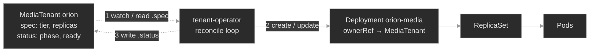

# `m08-crds-operators/`

## Concept

## M08 — CRDs & Operators

> The API server ships with a fixed vocabulary — Pods, Deployments, Services. A CustomResourceDefinition adds your own words to it; an operator is the program that makes those words mean something. Together they're how every capability above the built-ins — databases, certificates, mesh config — gets delivered, and how it quietly fails.

### What you'll learn

- Explain what a **CRD** does: it registers a new resource *type* (schema and all) with the API server, so a custom resource is first-class — `kubectl get/describe/explain`, RBAC, and admission validation all work on it — not a YAML blob you parse yourself.
- Read the anatomy of a **custom resource**: `.spec` (desired state, which you declare) vs. `.status` (observed state, which the controller writes on a separate subresource) — and why that split is the contract every operator follows.
- Describe the **controller/operator pattern**: a level-triggered **reconcile loop** that compares desired to observed and acts to close the gap — and see that an operator is just a CRD **plus** a controller.
- Read **operator-managed state** during an incident from the three surfaces that reveal it: the CR's `.status`/conditions, the child resources the operator created, and the operator's own logs.
- Diagnose **stuck reconciliation** — an operator that's `Running` but making no progress — and tell the causes apart: the controller is down, its RBAC forbids the action, or it watches a CRD version that isn't served.
- Trace **owner references**: how operator-created children point back to their CR, how cascading garbage collection follows that link, and how a missing or stale ownerReference produces orphans (and a finalizer, a stuck deletion).

### Why it matters

Everything above the built-in resource types on a real cluster is delivered by an operator. Cert-manager issues TLS certificates from a `Certificate`; the Prometheus operator turns a `ServiceMonitor` into scrape config; External Secrets syncs a `Secret` from a vault. Each is the same shape: a CRD that adds a type, and a controller that watches instances of it and makes the cluster match. You'll operate far more operators than you ever write, so the skill that matters is *reading* one under pressure — not building one.

At Polyphone the platform team ships an operator so product teams don't hand-write infrastructure. A team needing media capacity creates a **MediaTenant** — a custom resource declaring a tier and a replica count — and the **tenant-operator** turns that intent into a correctly-sized Deployment, linked back to the tenant, with progress in the tenant's `.status`. Self-service in, capacity out — a small version of exactly how the big operators work.

The reason this earns a lesson is that operators fail in ways built-in controllers don't, and they fail *quietly*: a stuck operator's Pod stays `Running` while nothing it manages progresses; a schema-invalid resource is rejected before the operator ever sees it; an un-owned child survives the cleanup that should have removed it. None shows up as a red status. You catch them by knowing the pattern — type, controller, reconcile, owner reference — and checking that each link held.

### Scope

**Covers:** the **CustomResourceDefinition** — how it registers a type (group/version/kind, plural, scope), the structural OpenAPI **schema** the API server validates every custom resource against, the `Established` condition, and `served`/`storage` versions; the **custom resource** — the `.spec`/`.status` split and the status **subresource**; the **controller/operator pattern** — level-triggered reconciliation, desired vs. observed state, reading operator-managed state, and the diagnostic signatures of **stuck reconciliation**; and **owner references** — controller references, cascading **garbage collection**, orphans, and (in a deep dive) finalizers.

**Doesn't cover:** *writing* an operator — Go, controller-runtime, Kubebuilder/Operator SDK, watches, and work queues are a development topic, not this one; the goal here is reading operators, not building them. Admission **webhooks** (validating/mutating) and CEL validation rules beyond basic schema → out of scope here. **Aggregated API servers**, the heavier alternative to CRDs for extending the API → out of scope. The full **RBAC** model an operator's ServiceAccount relies on → M10; this module defines just enough to diagnose a permission-denied reconcile. Packaging operators with Helm/Kustomize → M16–M17. Specific ecosystem operators live with their topics: Prometheus operator → M13, cert-manager → M12, External Secrets → M11.

**Assumes:** M00 (every object is `spec` + `status`; group/version/kind; namespaces; `kubectl get/describe/explain`), and M01 (a controller — not you — creates Pods, and a Deployment owns its ReplicaSet which owns its Pods; built-in controllers already reconcile). ServiceAccounts and RBAC are introduced here on first use and treated in full in M10.

### Vocabulary

| Term | Definition |
|------|------------|
| **CustomResourceDefinition (CRD)** | An object (`kind: CustomResourceDefinition`) that registers a new resource *type* with the API server. Its name is always `<plural>.<group>` (e.g. `mediatenants.polyphone.example`). Once it exists, the API server serves that type like a built-in. |
| **custom resource (CR)** | An instance of the type a CRD defines — e.g. a `MediaTenant` named `orion`. Stored, validated, and served by the API server exactly like a Pod or Deployment. |
| **group / version / kind (GVK)** | The three-part identity of a resource type. A CRD declares its `group` (`polyphone.example`), `versions` (`v1`), and `kind` (`MediaTenant`) — the same scheme built-ins use (`apps/v1` `Deployment`). |
| **structural schema** | The OpenAPI v3 schema in a CRD (`openAPIV3Schema`) constraining a CR's fields — types, enums, `required`, min/max. The API server validates every CR against it at admission, so a bad field is rejected, not stored. |
| **`Established`** | A CRD condition that flips `True` once the API server has registered the type and will serve it. Until then, `kubectl get <kind>` fails with "the server doesn't have a resource type." |
| **served / storage version** | Per-version flags. `served: true` means the API accepts that version; exactly one version is `storage: true`, the form persisted to etcd. Multiple served versions let consumers migrate gradually. |
| **controller** | A program running a control loop that watches a resource type and drives the cluster toward each object's declared state. Built-in controllers (Deployment, Job) ship in the control plane; a custom one you run yourself. |
| **reconcile loop / reconciliation** | The controller's core action: read desired state (`.spec`), observe actual state, take steps to close the gap — then repeat, forever. |
| **level-triggered** | The loop acts on the *current* desired-vs-observed difference, not a one-time event. A missed event is harmless — the next pass re-checks and corrects. This is why an unblocked operator recovers without a restart. |
| **operator** | A controller paired with one or more CRDs, encoding operational knowledge for a specific application. An operator = CRD(s) + controller. |
| **`.status` subresource** | A separate write path for `status` (enabled by `subresources: {status: {}}`). The controller updates `.status` through `/status`; a normal `apply` of `.spec` can't touch it — enforcing "you own spec, the controller owns status." |
| **owner reference** | A field in a child's `metadata.ownerReferences` naming an owner by kind, name, and **uid** — recording that the child belongs to that owner. With `controller: true` it's the single managing owner (a *controller reference*). |
| **garbage collection / cascading deletion** | The control-plane process that deletes an object's dependents when the owner is deleted, by finding every object whose `ownerReferences` names it. No ownerReference, no cascade. |
| **finalizer** | A key in `metadata.finalizers` that blocks hard deletion: the API server marks the object `Terminating` and waits until the responsible controller cleans up and removes the key. A finalizer whose controller is gone wedges the object in `Terminating`. |
| **ServiceAccount** | The in-cluster identity a Pod authenticates as. An operator runs as one and can only do what that identity's RBAC grants (full treatment: M10). |

### Mental model

Two pieces, one idea. A **CRD teaches the API server a new noun** — register `MediaTenant` and the server stores, validates, versions, and serves them, with RBAC and `kubectl` treating them like any built-in. But a noun with no verb is inert: creating a MediaTenant changes nothing on its own, just as a Deployment object would do nothing with no Deployment controller running. The **operator is the verb** — a control loop that watches MediaTenants and makes each one *mean* a running, correctly-sized Deployment.

The loop is **level-triggered**<sup><a href="https://kubernetes.io/docs/concepts/architecture/controller/">[4]</a></sup>. It doesn't handle "a MediaTenant was created" as a one-shot event; it repeatedly asks "for every MediaTenant that exists, does reality match its `.spec`?" and closes whatever gap it finds. That's why a healthy operator is self-correcting — delete a child it manages and the next pass recreates it — and why an unblocked operator recovers on its own, no restart needed.



Read it as one turn of the loop: the operator reads each MediaTenant's `.spec` (1), creates or updates the child Deployment to match (2), and writes what it observed back into `.status` (3). The Deployment owns its ReplicaSet, which owns its Pods — the built-in chain from M01 — so the whole tree hangs off the CR. That's literal: the child carries an **ownerReference** back to the MediaTenant, and that single link lets cascading deletion tear the tree down when the tenant is deleted. Read the other direction, it's your debugging aid — from any child find the CR that owns it, from a CR find everything it spawned.

Three failure surfaces fall out of this picture, one per link you'll break: the **type** can reject a CR (schema), the **loop** can stall (operator down, forbidden, or watching the wrong version), and the **owner link** can be missing (an orphan survives cleanup). Different link, different symptom, different place to look.

### Concept walkthrough

#### Extending the API with CRDs

A **CustomResourceDefinition** is an object you apply like any other, but applying it has an unusual effect: the API server gains a new endpoint and starts serving a new type<sup><a href="https://kubernetes.io/docs/concepts/extend-kubernetes/api-extension/custom-resources/">[1]</a></sup>. The CRD declares the type's identity — `group`, `versions`, `kind`, the `plural`/`singular`/`shortNames` you'll type — and its `scope` (`Namespaced` or `Cluster`). Its name is mechanical: always `<plural>.<group>`, here `mediatenants.polyphone.example`.

Registration isn't instant. When the type is ready to serve, the API server sets the `Established` condition `True`<sup><a href="https://kubernetes.io/docs/tasks/extend-kubernetes/custom-resources/custom-resource-definitions/">[2]</a></sup>. Before that flips, `kubectl get mediatenants` fails with "the server doesn't have a resource type" — the same error as a typo. So the first question when a custom type "doesn't exist" is: is the CRD installed, and `Established`?

What makes a custom resource *first-class* rather than a free-form blob is the **structural schema** — an OpenAPI v3 document embedded in the CRD's version<sup><a href="https://kubernetes.io/docs/tasks/extend-kubernetes/custom-resources/custom-resource-definitions/">[2]</a></sup>. It declares each field's type and constraints: `spec.tier` a string restricted to the enum `gold`/`silver`/`bronze`, `spec.replicas` an integer 1–5, both `required`. The API server validates every CR against it at admission, exactly as it validates a built-in — a MediaTenant with `tier: platinum` or a missing `replicas` is **rejected and never stored**. Operationally: "my custom resource won't apply" is almost always a schema mismatch, and the rejection message names the offending field. `kubectl explain mediatenant.spec` reads the same schema back, because `explain` is generated from it.

A CRD can serve more than one **version** at once. Each version flags whether it's `served` (the API accepts it) and which single one is `storage` (the form written to etcd)<sup><a href="https://kubernetes.io/docs/tasks/extend-kubernetes/custom-resources/custom-resource-definitions/">[2]</a></sup> — the machinery of schema migration, and a quiet source of operator breakage (see the deep dive).

<details>
<summary>📖 Going deeper: CRD versions, served vs. storage, and the version-skew trap<sup><a href="https://kubernetes.io/docs/tasks/extend-kubernetes/custom-resources/custom-resource-definitions/">[2]</a></sup></summary>

A type evolves. You ship `MediaTenant` at `v1alpha1`, then add fields and want `v1`. A CRD lets both versions be `served` at once so consumers migrate on their own schedule, while exactly one is `storage: true` — every object is persisted in the storage version and converted on read to whatever version the client asked for. Schema-compatible changes convert automatically; structural changes need a **conversion webhook**.

The operational trap is **version skew**. Say the operator watches `polyphone.example/v1`, but a CRD change left only `v1alpha1` served (someone dropped `served: true` from `v1`, or a controller upgrade lagged the CRD). The operator's watch now targets a version the API won't serve, so it sees *no* MediaTenants and reconciles nothing — every CR sits untouched. This looks identical to "the operator is asleep." The tell is in the CRD: `kubectl get crd mediatenants.polyphone.example -o jsonpath='{.spec.versions[*].name} {.spec.versions[*].served}'` shows which versions exist and which are served — compare that to the `apiVersion` the operator is built for. When you upgrade an operator, upgrade its CRD in lockstep, and never drop a served version consumers still use.

</details>

#### The controller pattern: reconciliation

A **controller** watches a resource type and drives the cluster toward each object's declared state<sup><a href="https://kubernetes.io/docs/concepts/architecture/controller/">[4]</a></sup>. You already rely on dozens — the Deployment controller reconciles Deployments into ReplicaSets, the Job controller runs Pods to completion. An **operator** is the same idea aimed at a *custom* type: a controller paired with a CRD, packaging the knowledge of running some specific thing<sup><a href="https://kubernetes.io/docs/concepts/extend-kubernetes/operator/">[3]</a></sup>. There's no magic ingredient — "operator" is just "custom controller + its CRD(s)."

The loop's discipline is **reconciliation**: read `.spec` (desired), observe what exists, take the steps that make reality match — then repeat, forever. Because it's **level-triggered**, it reasons about the current difference rather than a stream of events, so a dropped notification, a restart, or an API blip all self-heal on the next pass. The tenant-operator's loop is small enough to read in one breath — for each MediaTenant, ensure a child Deployment at the right replica count, stamp the ownerReference, write `.status` — but it has the full shape: observe, act, report.

That last step, **report**, is where operators talk back. A well-behaved controller writes what it observed into the CR's `.status` — here `phase` (`Provisioning` → `Ready`) and `readyReplicas` — through the **status subresource**<sup><a href="https://kubernetes.io/docs/tasks/extend-kubernetes/custom-resources/custom-resource-definitions/">[2]</a></sup>, which splits the halves at the API: you write `.spec`, the controller writes `.status`, neither clobbers the other. So **reading operator-managed state** means reading three surfaces together: the CR's `.status`/conditions (what the operator claims), the child resources (what exists), and the operator's **logs** (what it tried and what stopped it). Agreement means healthy; a gap localizes the fault.

Which raises the failure mode that trips people: **stuck reconciliation**. An operator can be a healthy *process* — Pod `Running`, no restarts — and a stalled *controller*; the Pod's status only says the program is alive, not that its loop progresses. When custom resources sit un-advanced, suspect three things: the controller is **down** (crashlooping, scaled to zero) — visible in `get pods`; it's **forbidden** — it runs as a ServiceAccount, and if that identity's RBAC lacks a verb the loop needs, every attempt is denied `403` (in the logs, and via `kubectl auth can-i --as=<the operator's SA>`), the most common cause; or it watches an unserved **CRD version** (the skew above). Same symptom, three surfaces — and the logs usually name which.

#### Owner references and the object graph

When the operator creates `orion-media`, it sets an **ownerReference** on it pointing back to the `orion` MediaTenant<sup><a href="https://kubernetes.io/docs/concepts/overview/working-with-objects/owners-dependents/">[5]</a></sup>. The reference names the owner by kind, name, and **uid** — the uid pins it to *this specific* MediaTenant, not something that merely shares the name — and with `controller: true` it marks the single managing owner, which is how a controller finds "its" objects and how the control plane identifies who's in charge.

Its headline job is **cascading deletion**. The **garbage collector** watches for deleted owners; delete a MediaTenant and it finds every object whose `ownerReferences` names it (by uid) and deletes those too<sup><a href="https://kubernetes.io/docs/concepts/architecture/garbage-collection/">[6]</a></sup>. That's why you never hand-delete an operator's children — remove the CR and the whole tree under it goes, each link a thread the collector follows. Read the reference the other way and it's a debugging map: from any child you find its parent, from a CR you enumerate what it spawned.

The failure is the absence. A child created **without** an ownerReference — by hand, or by an older operator that didn't stamp one — has no thread tying it to an owner. Delete its logical parent and the garbage collector has nothing to follow, so the child isn't collected: it becomes a silent **orphan**, running on, holding resources for something gone. Nothing errors; it just persists. You find orphans by comparing a suspect child's `ownerReferences` to a properly-managed sibling's, and by noticing children whose named owner no longer exists. The stale-uid variant bites from the other side: a reference to a uid that no longer exists marks the child for deletion, so a recreated parent (new uid) can leave old children pointing at a ghost.

<details>
<summary>📖 Going deeper: finalizers and the stuck-Terminating resource<sup><a href="https://kubernetes.io/docs/concepts/overview/working-with-objects/finalizers/">[7]</a></sup></summary>

Owner references handle *cascade*; **finalizers** handle *cleanup that must happen before* an object may disappear. A finalizer is a key in `metadata.finalizers`. Delete an object that has one and the API server doesn't remove it — it sets `metadata.deletionTimestamp`, moves the object to `Terminating`, and waits. The controller responsible notices the deletionTimestamp, does its external cleanup (deregister a load balancer, drain a volume, delete a cloud resource the CR represented), then removes its key. Only when the last finalizer is gone does the API server actually delete the object.

This is why `kubectl delete` sometimes hangs forever, stuck `Terminating`. The classic cause: the finalizer's controller is gone — you uninstalled the operator, or it crashed — so nobody removes the key. It's also why deleting a *namespace* can wedge: it won't finish while it holds objects with finalizers whose controllers are absent. The safe fix is to make the controller healthy again so it completes cleanup. Force-removing the finalizer by hand (`kubectl patch ... -p '{"metadata":{"finalizers":[]}}'`) is a **last resort** — it deletes the object immediately while skipping whatever external cleanup the finalizer guarded, potentially leaking the real resource it represented. Reach for it only when you're sure cleanup is already done or no longer matters.

</details>

### Hands-on

Four baseline steps, three break/fix scenarios — all on the full Polyphone fleet on a 2-node cluster (one tainted control-plane, one worker), plus the `MediaTenant` CRD and the `tenant-operator`. The baseline tours a healthy operator; each break/fix snaps one link in the chain.

- **`baseline/`** — the CRD as a registered type, two MediaTenants (`orion`, `lyra`) with the `.spec`/`.status` split, the operator reconciling them into child Deployments, and the ownerReferences cascading deletion follows. What "healthy" looks like across all three surfaces.
- **`breakfix-01-cr-schema-rejected`** — a new tenant never appears because its custom resource violates the CRD's enum and admission refuses it. Tests that a CRD's schema is real, API-server-enforced validation, and that a rejected resource fails silently downstream.
- **`breakfix-02-reconcile-stuck-rbac`** — the operator is `Running`, but every tenant sits `Provisioning` with no children: its ServiceAccount can't create Deployments, so reconciliation stalls at the first write. Tests reading `.status` + logs over Pod status, and RBAC as the usual cause.
- **`breakfix-03-orphaned-owner-reference`** — an offboarded tenant's child Deployment still runs because it carries no ownerReference, so cascading deletion never reached it. Tests owner references as the thread the garbage collector follows, and spotting an orphan by comparison.

Work them in order; the baseline makes each broken link obvious. Check yourself against `ANSWER-KEY.md` after each.

### Common failure modes

| Symptom | Likely cause | Where to look |
|---------|--------------|---------------|
| `kubectl get <kind>` → "the server doesn't have a resource type" | CRD not installed, not yet `Established`, or wrong plural/group | `kubectl get crd`; `kubectl api-resources \| grep <group>`; the CRD's `Established` condition |
| A custom resource won't apply — validation error | CR violates the structural schema (bad enum/type, missing `required` field) | the admission error message; `kubectl explain <kind>.spec`; the CRD's `openAPIV3Schema` |
| CR created, but `.status` stays empty and no child resources appear | Reconciliation stuck — operator down, RBAC-forbidden, or watching an unserved CRD version | `kubectl get pods -n <op-ns>`; operator **logs**; `kubectl auth can-i --as=<op SA>`; CRD served versions |
| CR `.status` shows an error/stuck condition | Operator reconciled but the desired state is unachievable (bad spec, missing dependency) | `kubectl describe <kind> <cr>` (conditions/events); operator logs |
| Deleted a CR, but its child resources keep running | Children lack an ownerReference to the CR (created out-of-band or by an older operator) | the child's `metadata.ownerReferences`; compare to a healthy CR's child |
| `kubectl delete <kind> <cr>` hangs in `Terminating` | A finalizer whose controller isn't removing it (operator gone/crashed) | the CR's `metadata.finalizers`; the controller that owns that finalizer |
| A child keeps getting deleted right after creation | Stale ownerReference — points at an owner uid that no longer exists | the child's `ownerReferences[].uid` vs. the current owner's `metadata.uid` |

### Recap

- **A CRD adds a type; an operator gives it meaning.** The CRD registers a first-class resource (schema-validated, RBAC-governed, `kubectl`-native); the controller is a level-triggered reconcile loop that makes instances of it *do* something. An operator is nothing more than a CRD plus a controller.
- **A CR's schema is real, API-server-enforced validation.** A custom resource that violates the CRD's structural schema is rejected at admission and never stored, so "it won't apply" is a schema mismatch you read from the error — not an operator problem.
- **An operator's Pod status is not its reconciliation status.** A `Running` operator can be making zero progress. When custom resources sit un-advanced, read the three surfaces — `.status`, child resources, and the operator's logs — and check the usual suspects: the controller is down, forbidden by RBAC, or watching an unserved version.
- **Owner references are the thread cascading deletion follows.** Operator-created children point back at their CR by name and uid; the garbage collector deletes dependents when the owner goes. A missing ownerReference orphans a child; a stale one can delete it prematurely; a finalizer can wedge deletion in `Terminating`.
- **Operators fail quietly.** No crash in the schema, stuck-reconcile, or orphan cases — the failure is a resource that never appeared, never progressed, or never left. You catch it by verifying each link held, not by waiting for something to go red.

### Production thinking

- An operator you didn't write has a custom resource stuck `Provisioning` for an hour. Lay out your diagnosis order and why: `.status`/conditions, then events, then the operator's logs, then its ServiceAccount's RBAC (`auth can-i --as=`), then whether the CRD version it watches is still `served`. Which does a "the Pod is Running, so it's fine" instinct skip, and why is that instinct wrong for controllers?
- You're deleting a namespace and it hangs `Terminating` for an hour on a single custom resource with a finalizer — and the operator that owned that finalizer was uninstalled last week. Explain what's blocking deletion, why the namespace can't finish, the *safe* way to unblock it, and why force-removing the finalizer is a last resort, not the first move.
- You're deciding whether a new platform capability should be a CRD + operator or just a Helm chart of built-in objects. What does an operator buy you that a chart doesn't (continuous reconciliation, drift correction, encoded day-2 knowledge, a typed API), and what does it cost (a controller to run and upgrade, its RBAC, CRD/version discipline)? Give one case where it's clearly worth it and one where it's over-engineering.

### References

1. Kubernetes — Custom Resources: https://kubernetes.io/docs/concepts/extend-kubernetes/api-extension/custom-resources/
2. Kubernetes — Extend the Kubernetes API with CustomResourceDefinitions: https://kubernetes.io/docs/tasks/extend-kubernetes/custom-resources/custom-resource-definitions/
3. Kubernetes — Operator pattern: https://kubernetes.io/docs/concepts/extend-kubernetes/operator/
4. Kubernetes — Controllers: https://kubernetes.io/docs/concepts/architecture/controller/
5. Kubernetes — Owners and Dependents: https://kubernetes.io/docs/concepts/overview/working-with-objects/owners-dependents/
6. Kubernetes — Garbage Collection: https://kubernetes.io/docs/concepts/architecture/garbage-collection/
7. Kubernetes — Finalizers: https://kubernetes.io/docs/concepts/overview/working-with-objects/finalizers/


---

## Break/Fix Practice

## Break/fix 01 — Custom Resource Rejected by Schema

**Symptom — what you'd actually see:**

A product team's new tenant, `vega`, never appears. `kubectl get mediatenants -A` lists only `orion` and `lyra`, and there's no `vega-media` Deployment. The operator is healthy — nothing crashed, nothing logged an error about `vega`. The manifest is at `/root/vega-tenant.yaml`.

**Think about this before you open the answer:**

Understanding that a CRD's schema is real, API-server-enforced validation, and that a rejected resource fails silently downstream. Self-grading:

- Did you read the *admission error* (by applying the manifest), rather than hunting for a crash or an operator log that doesn't exist?
- Did you find the constraint in the CRD's schema (`explain` / the enum), not guess?
- Do you see *why* there was no operator involvement — the resource was never stored, so the loop never saw it?

<details>
<summary><b>Click to reveal: diagnostic commands, root cause, exact fix, verify</b></summary>

**Root cause:**

The manifest sets `spec.tier: platinum`, but the CRD's structural schema constrains `spec.tier` to the enum `["gold","silver","bronze"]`. The API server validates every custom resource against the CRD's schema at admission, so it **rejects** the resource — `vega` is never stored<sup><a href="https://kubernetes.io/docs/tasks/extend-kubernetes/custom-resources/custom-resource-definitions/">[2]</a></sup>. The operator only reconciles resources that exist, so a rejected CR produces no child and no error: the failure is upstream of the operator entirely.

**Diagnostic commands (run in this order):**

```bash
# 1. vega isn't there — and there's no child for it either
kubectl get mediatenants -A                       # only orion, lyra
kubectl get deployments -n media -l managed-by=tenant-operator   # only orion-media, lyra-media

# 2. Apply the manifest and read the API server's rejection
kubectl apply -f /root/vega-tenant.yaml
#   The MediaTenant "vega" is invalid: spec.tier: Unsupported value: "platinum":
#   supported values: "gold", "silver", "bronze"

# 3. Read the schema you have to satisfy
kubectl explain mediatenant.spec.tier
kubectl get crd mediatenants.polyphone.example \
  -o jsonpath='{.spec.versions[0].schema.openAPIV3Schema.properties.spec.properties.tier.enum}'; echo  # [gold silver bronze]
grep tier /root/vega-tenant.yaml                  # tier: platinum
```

**Exact fix:**

Correct `spec.tier` to a valid enum value (confirm with the team which tier they meant; assume `gold`) and re-apply:

```bash
sed -i 's/tier: platinum/tier: gold/' /root/vega-tenant.yaml
kubectl apply -f /root/vega-tenant.yaml           # mediatenant.polyphone.example/vega created
```

**Verify:**

```bash
kubectl get mediatenants -A                       # vega now listed
kubectl get deployment vega-media -n media        # operator provisioned it
kubectl get mediatenant vega -n media -o jsonpath='{.status.phase}'; echo   # Ready
```

**Production thinking:**

This is the everyday CRD failure — a custom resource that a schema refuses. The API server's message names the field and the rule, so it's fast to fix once you apply and read it. Guard against it earlier: validate manifests in CI against the CRD's schema (`kubectl apply --dry-run=server`, or a schema linter) so a bad enum or missing required field fails the pipeline, not a 2 a.m. apply — and keep the schema tight, because a permissive schema pushes the same validation into the operator, where it's harder to see.

</details>

---

## Break/fix 02 — Reconciliation Stuck (Operator RBAC)

**Symptom — what you'd actually see:**

Both MediaTenants applied cleanly and show in `kubectl get mediatenants`, but neither reaches `Ready`: `PHASE Provisioning`, `READY 0`, and there are **no** child media Deployments. The `tenant-operator` Pod is `Running` with 0 restarts.

**Think about this before you open the answer:**

Reading operator-managed state (`.status` + logs) instead of trusting Pod status, and knowing RBAC is the usual reason a healthy-looking operator does nothing. Self-grading:

- Did you treat "Pod Running" as *not* proof the operator works, and go to `.status` + logs?
- Did the operator's own logs (the `Forbidden` line) point you at the permission, rather than guessing at the CRD or the CRs?
- Did you confirm with `auth can-i --as=<the operator's SA>` and grant *only* the needed verbs, not `*`?

<details>
<summary><b>Click to reveal: diagnostic commands, root cause, exact fix, verify</b></summary>

**Root cause:**

The operator's ClusterRole grants only `get`/`list`/`watch` on `deployments` — not `create`. The operator's reconcile loop reads both tenants and tries to create their child Deployments, but the API server denies each attempt `403 Forbidden` because the ServiceAccount it authenticates as (`system:serviceaccount:platform:tenant-operator`) lacks the verb<sup><a href="https://kubernetes.io/docs/concepts/architecture/controller/">[3]</a></sup>. The loop runs (the process is alive) but makes no progress (it can't perform its write), so every tenant stays `Provisioning`. The Pod's status says nothing is wrong — the signal is in `.status` and the operator's logs.

**Diagnostic commands (run in this order):**

```bash
# 1. Stuck status, and nothing built
kubectl get mediatenants -A                       # both PHASE Provisioning, READY 0
kubectl get deployments -n media -l managed-by=tenant-operator   # (none)

# 2. The operator is Running — so this isn't a crash
kubectl get pods -n platform                       # tenant-operator Running, 0 restarts

# 3. Ask the operator what's failing
kubectl logs deployment/tenant-operator -n platform --tail=12
#   Error from server (Forbidden): deployments.apps is forbidden: User
#   "system:serviceaccount:platform:tenant-operator" cannot create resource
#   "deployments" in API group "apps" in the namespace "media"

# 4. Confirm the missing permission from the identity's side
kubectl auth can-i create deployments -n media \
  --as=system:serviceaccount:platform:tenant-operator          # no
kubectl get clusterrole tenant-operator \
  -o jsonpath='{range .rules[?(@.resources[0]=="deployments")]}{.verbs}{"\n"}{end}'  # ["get","list","watch"]
```

**Exact fix:**

Grant the operator the write verbs its loop needs on `deployments` (re-apply the ClusterRole with the full set):

```bash
cat <<'EOF' | kubectl apply -f -
apiVersion: rbac.authorization.k8s.io/v1
kind: ClusterRole
metadata:
  name: tenant-operator
  labels: { plane: platform, tier: lab }
rules:
  - apiGroups: ["polyphone.example"]
    resources: ["mediatenants"]
    verbs: ["get", "list", "watch"]
  - apiGroups: ["polyphone.example"]
    resources: ["mediatenants/status"]
    verbs: ["get", "update", "patch"]
  - apiGroups: ["apps"]
    resources: ["deployments"]
    verbs: ["get", "list", "watch", "create", "update", "patch", "delete"]
EOF
```

No restart is needed — the loop is level-triggered and retries every few seconds.

**Verify:**

```bash
kubectl auth can-i create deployments -n media \
  --as=system:serviceaccount:platform:tenant-operator          # yes
kubectl get mediatenants -A                       # both move to PHASE Ready
kubectl get deployments -n media -l managed-by=tenant-operator   # orion-media, lyra-media appear
kubectl logs deployment/tenant-operator -n platform --tail=6     # Forbidden gone; phase=Ready
```

**Production thinking:**

RBAC is the number-one reason an operator silently stalls — a new controller version needs a verb its shipped ClusterRole didn't include, or an aggregation/label change breaks its access. Because the Pod stays healthy, alert on the *outcome*, not the process: a custom resource whose `.status` hasn't reached its ready phase within an SLO, or a rising count of `Forbidden` events for the operator's ServiceAccount. And scope the operator's role to exactly the resources and verbs it uses — broad `*` grants hide these gaps and widen blast radius (full RBAC discipline: M10).

</details>

---

## Break/fix 03 — Orphaned Child (Missing Owner Reference)

**Symptom — what you'd actually see:**

`vega-media` is `Running` in `media` (2 replicas), but there's no `vega` MediaTenant — the tenant was offboarded weeks ago. The operator is healthy (`orion`/`lyra` `Ready`) and doesn't touch `vega-media`. Cascading deletion should have removed it when `vega` was deleted.

**Think about this before you open the answer:**

Owner references as the thread cascading deletion follows, and identifying an orphan by comparison. Self-grading:

- Did you diagnose by *comparing* `vega-media`'s ownerReferences to a properly-managed child's, rather than just deleting the odd Deployment out?
- Do you understand *why* it wasn't collected — no ownerReference means the garbage collector can't associate it with the deleted CR?
- Did you leave the legitimate, owned children (`orion-media`, `lyra-media`) intact?

<details>
<summary><b>Click to reveal: diagnostic commands, root cause, exact fix, verify</b></summary>

**Root cause:**

`vega-media` has **no** `ownerReferences`. Cascading deletion works by the garbage collector finding every object whose `ownerReferences` names a deleted owner<sup><a href="https://kubernetes.io/docs/concepts/architecture/garbage-collection/">[5]</a></sup>. `vega-media` was created out-of-band (by an older operator that didn't stamp owner references), so it never had a link to the `vega` MediaTenant — when `vega` was deleted, the collector had nothing to follow and left the child running. It's now a permanent **orphan**<sup><a href="https://kubernetes.io/docs/concepts/overview/working-with-objects/owners-dependents/">[4]</a></sup>. The current operator only manages children of tenants that exist, so with no `vega` CR it ignores the orphan.

**Diagnostic commands (run in this order):**

```bash
# 1. A child with no living parent
kubectl get mediatenants -A                       # no vega
kubectl get deployments -n media -l managed-by=tenant-operator   # vega-media still Running

# 2. Compare owner references: a healthy child vs. the orphan
kubectl get deployment orion-media -n media -o jsonpath='{.metadata.ownerReferences}'; echo  # MediaTenant/orion, controller:true
kubectl get deployment vega-media  -n media -o jsonpath='{.metadata.ownerReferences}'; echo  # (empty)
```

`orion-media` points back at its MediaTenant; `vega-media` points nowhere. That absence is why the garbage collector never reclaimed it.

**Exact fix:**

The parent is already gone, so there's no cascade left to trigger — delete the orphan directly to reclaim its capacity:

```bash
kubectl delete deployment vega-media -n media
```

**Verify:**

```bash
kubectl get deployments -n media -l managed-by=tenant-operator   # vega-media gone; orion-media, lyra-media remain
kubectl get deployment orion-media -n media \
  -o jsonpath='{.metadata.ownerReferences[0].kind}/{.metadata.ownerReferences[0].name}'; echo  # MediaTenant/orion
```

The live children still carry their owner references, so *they* will cascade correctly when their tenants are offboarded — only the un-owned orphan needed manual removal.

**Production thinking:**

Orphans accumulate silently and cost real money — capacity for tenants, customers, or environments that no longer exist. Two habits catch them: when you adopt owner-reference stamping (or migrate to an operator that does), sweep once for pre-existing un-owned children, because only *new* resources get the link; and periodically reconcile "children whose owner no longer exists" as a cleanup job or an alert. The related failure worth knowing is the opposite — a **finalizer** on a CR whose operator is gone wedges deletion in `Terminating`; the safe fix is to restore the controller so it completes cleanup, with force-removing the finalizer as a last resort<sup><a href="https://kubernetes.io/docs/concepts/overview/working-with-objects/finalizers/">[6]</a></sup>.

</details>

---
