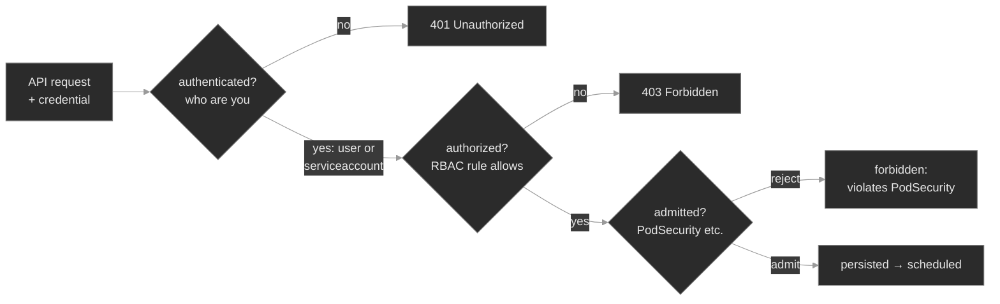

# `m10-security-rbac/`

## Concept

## M10 — Security I: RBAC & Pod Security

> The two questions every request to the API server must pass — *who are you* and *what may you do* — plus the admission gate that decides whether a Pod's security posture is allowed at all, and the handful of ways each one returns `Forbidden`.

### What you'll learn

- Trace a request through the API server's three gates — **authentication** (who), **authorization** (may they), **admission** (is this object allowed) — and tell which gate a `Forbidden` came from
- Read RBAC: a **Role**/**ClusterRole** as a set of rules (`apiGroups` × `resources` × `verbs`), a **RoleBinding**/**ClusterRoleBinding** tying a subject to a role, and the additive/deny-by-default evaluation
- Use `kubectl auth can-i` (with `--as` and `--list`) to reproduce and prove any authorization decision instead of guessing
- Understand a **ServiceAccount** as a Pod's API identity — `system:serviceaccount:<ns>:<name>`, the auto-projected short-lived token — and why the `default` SA is bound to nothing
- Set a container's **securityContext** (`runAsNonRoot`, `allowPrivilegeEscalation`, dropped capabilities, seccomp) and know which fields the `restricted` standard requires
- Enforce the **Pod Security Standards** with PodSecurity admission's namespace labels (`enforce`/`audit`/`warn`), and recognize an admission rejection — a Deployment with zero Pods and no `Pending` Pod
- Work the **`Forbidden` differential**: the same 403 from a missing verb vs. the wrong identity vs. the wrong scope — one phrase in the message tells them apart

### Why it matters

Security failures don't crash — they deny. A Pod that can't reach the API doesn't OOM or sit `Pending`; its app logs one line — `Forbidden` — and stalls, and every reflex from the workload modules (`logs`, `--previous`, restart) returns nothing useful. The signal is a single string from the API server that names the identity, the verb, the resource, and the scope. Read it and the fix is obvious; skim past it and you'll spend an hour editing an app that was never wrong.

At Polyphone the surface is everywhere. A discovery sidecar needs to `list endpoints` and someone granted it `get`. A workload ships without a ServiceAccount, so it authenticates as `default` — bound to nothing — and every API call is denied. A new component wants to read node labels and the RoleBinding that "grants" it silently does nothing, because nodes are cluster-scoped and a namespaced binding can't reach them. The security team enforces the `restricted` standard on a namespace and the next Deployment there creates zero Pods with no error on any Pod, because no Pod was ever admitted. Each is one field, in one of three gates. This module is about reading which gate said no, and why.

### Scope

**Covers:** the API request pipeline (authentication → authorization → admission) and where each says no; **RBAC** — Roles and ClusterRoles, RoleBindings and ClusterRoleBindings, the rule triple (`apiGroups`/`resources`/`verbs`), namespaced vs. cluster scope, additive/deny-by-default evaluation, and `kubectl auth can-i`; **ServiceAccounts** as Pod identity, the projected bound token, the `default` SA; **securityContext** at Pod and container level; the **Pod Security Standards** (privileged/baseline/restricted) and **PodSecurity admission** (the `enforce`/`audit`/`warn` namespace labels); and the `Forbidden` differential that ties RBAC and admission together.

**Doesn't cover:** user/group authentication mechanisms — client certs, OIDC, the fact that Kubernetes has no first-class User object — named where they intersect but the identity providers themselves are out; secrets management at scale (External Secrets, Vault, sealed-secrets) → M11; PKI, cert-manager, and mTLS between workloads → M12; NetworkPolicy and traffic isolation → M14; policy-as-code admission webhooks (Kyverno, OPA Gatekeeper) that go beyond built-in PodSecurity → M20–M21; the audit log that records every authorization decision → M13; image provenance (scanning, signing), covered in M02.

**Assumes:** M00 (`get → describe → events → logs`, and that a resource's story lives between `spec` and `status`), M01 (Pods, Deployments, ReplicaSets — a *controller*, not you, creates the Pods, which matters for how an admission rejection surfaces), M03 (a ServiceAccount token is mounted into a Pod the same way the projected Secret volumes there already are), and a working idea of an HTTP request carrying an `Authorization` header — because every `kubectl` command is exactly that.

### Vocabulary

| Term | Definition |
|------|------------|
| **authentication (authn)** | The API server deciding *who* is calling, from a token or client cert. The result is a username (or `system:serviceaccount:<ns>:<name>`) plus groups. Kubernetes stores no User objects; ServiceAccounts are the only first-class identities. |
| **authorization (authz)** | Deciding whether that identity may perform this **verb** on this **resource**. RBAC is the authorizer here. Deny-by-default: if no rule allows, the answer is no. |
| **admission** | The stage *after* authz (writes only) where admission controllers inspect the object and may reject or mutate it. PodSecurity is a built-in admission controller. |
| **RBAC** | Role-Based Access Control. Permissions are grouped into Roles; Roles are granted to subjects by Bindings. |
| **Role / ClusterRole** | A named set of **rules**. A **Role** is namespaced (rules apply in one namespace); a **ClusterRole** is cluster-scoped — usable in any namespace, and the only kind that can grant cluster-scoped resources. |
| **rule** | One line of a Role: `apiGroups` × `resources` × `verbs`, ANDed. A request is allowed if any rule matches all three. RBAC never denies explicitly; it only fails to allow. |
| **RoleBinding / ClusterRoleBinding** | Ties a **subject** to a Role/ClusterRole. A **RoleBinding** grants within its namespace; a **ClusterRoleBinding** grants cluster-wide. |
| **subject** | Who a binding grants to. For a Pod: `kind: ServiceAccount` with a `name` and `namespace`. |
| **verb** | The action: `get`, `list`, `watch`, `create`, `update`, `patch`, `delete`. Reading one named object is `get`; reading a collection is `list`. |
| **ServiceAccount (SA)** | A namespaced identity for processes in Pods. Every Pod runs as exactly one SA (`default` if unset) and authenticates as `system:serviceaccount:<ns>:<name>`. |
| **bound service account token** | The short-lived, audience- and Pod-bound JWT the kubelet projects into every Pod at `/var/run/secrets/kubernetes.io/serviceaccount/token`. Auto-rotated; invalid once the Pod is gone. Replaced the old permanent Secret-based tokens. |
| **securityContext** | Pod- and container-level fields setting the process's security posture: `runAsNonRoot`, `runAsUser`, `allowPrivilegeEscalation`, `capabilities`, `seccompProfile`, `readOnlyRootFilesystem`. |
| **Pod Security Standards** | Three named policies: **Privileged** (unrestricted), **Baseline** (blocks known escalations), **Restricted** (hardened best practice). |
| **PodSecurity admission** | The built-in controller that enforces a Standard per namespace via labels `pod-security.kubernetes.io/<mode>: <level>`, where mode is `enforce` (reject), `audit` (log), or `warn` (warn). |
| **capability** | A slice of root's power (e.g. `NET_BIND_SERVICE`). Dropping `ALL` and adding back only what's needed is the hardening default. |

### Mental model

Every `kubectl` command — and every API call your Pods make — is an HTTP request to the API server, and the server runs it through three gates, in order<sup><a href="https://kubernetes.io/docs/concepts/security/controlling-access/">[9]</a></sup>:

1. **Authentication** — *who are you?* The server validates your credential (a token, a client cert) and resolves it to a username and groups. A Pod's credential is its projected ServiceAccount token, which resolves to `system:serviceaccount:<ns>:<name>`.
2. **Authorization** — *may you do this?* With RBAC, the server looks for a rule — reachable from your identity through some binding — that allows this verb on this resource in this scope. There is no explicit deny; if nothing allows, you get `403 Forbidden`<sup><a href="https://kubernetes.io/docs/reference/access-authn-authz/rbac/">[1]</a></sup>.
3. **Admission** — *is this object allowed?* Writes only. Admission controllers see the object and can reject or modify it. PodSecurity checks a Pod's `securityContext` against the namespace's Standard<sup><a href="https://kubernetes.io/docs/concepts/security/pod-security-admission/">[6]</a></sup>.



The payoff is that a `Forbidden` names exactly which gate and why. An **authorization** Forbidden reads: `<resource> is forbidden: User "<identity>" cannot <verb> resource "<resource>" in API group "<group>" in the namespace "<ns>"` (or, for a cluster-scoped resource, `at the cluster scope`). Every field in that sentence is a place the fix could live: the **identity** (are you who you meant to be?), the **verb** and **resource** (does a rule cover them?), and the **scope** (namespace vs. cluster — did you use the right kind of binding?). An **admission** Forbidden reads differently — `pods "<name>" is forbidden: violates PodSecurity "restricted:latest": <fields>` — and it lands not on your command but on the ReplicaSet that tried to create the Pod, because the *controller*, not you, is the caller the server refused.

Two facts make RBAC quick to reason about. First, it is **purely additive and deny-by-default**: you can only grant, never deny, and a subject's permissions are the union of every binding that reaches it — so "why can't it?" is always "no rule allows it," never "something blocked it"<sup><a href="https://kubernetes.io/docs/reference/access-authn-authz/rbac/">[1]</a></sup>. Second, RBAC matches **strings**, not intent: `endpoints` and `endpoint`, `get` and `list`, apiGroup `""` and `"apps"` are different keys, and a near-miss is a silent denial. The fix is never to argue with the error; it is to make some rule, reachable from the right subject, match all three strings in the right scope.

### Concept walkthrough

#### RBAC: rules, bindings, and the two scopes

RBAC has exactly two kinds of object, each in a namespaced and a cluster-scoped form. A **Role** (or **ClusterRole**) is a bag of rules; a **RoleBinding** (or **ClusterRoleBinding**) grants a role to subjects. A rule is three lists ANDed together<sup><a href="https://kubernetes.io/docs/reference/access-authn-authz/rbac/">[1]</a></sup>:

```yaml
rules:
- apiGroups: [""]            # "" is the core group (pods, services, endpoints, secrets…)
  resources: ["endpoints"]
  verbs: ["get", "list", "watch"]
```

A request is authorized if some rule reachable from the caller matches its apiGroup, its resource, *and* its verb. Miss any one — ask to `list` when the rule only grants `get`, name `endpoints` when the rule says `services` — and no rule matches, so it's denied. There is no `deny` rule to look for; the *absence* of an allow is the denial.

The scope distinction is the part that bites. Roles and RoleBindings are **namespaced**: a RoleBinding grants its role's rules only within its own namespace, and a Role can only usefully grant namespaced resources. ClusterRoles and ClusterRoleBindings are **cluster-scoped**: a ClusterRoleBinding grants across every namespace, and — the load-bearing fact — a **cluster-scoped resource (`nodes`, `namespaces`, `persistentvolumes`) can only be granted by a ClusterRole through a ClusterRoleBinding**<sup><a href="https://kubernetes.io/docs/reference/access-authn-authz/rbac/">[1]</a></sup>. Put `nodes` in a namespaced Role, bind it with a RoleBinding, and RBAC accepts the YAML without complaint — but the grant does nothing: nodes live outside every namespace, so a namespaced binding can never reach them. The request is denied `at the cluster scope`, and that word — *scope* — is the whole tell.

One useful combination: a RoleBinding may reference a *ClusterRole*, which grants that ClusterRole's rules *only within the RoleBinding's namespace* — the standard way to reuse a built-in ClusterRole like `view` per namespace without copying its rules.

You don't have to reason about any of this in your head. `kubectl auth can-i` asks the API server the exact question the authorizer answers<sup><a href="https://kubernetes.io/docs/reference/access-authn-authz/authorization/">[2]</a></sup>:

```bash
kubectl auth can-i list endpoints -n media \
  --as=system:serviceaccount:media:endpoint-watcher            # yes / no
kubectl auth can-i --list \
  --as=system:serviceaccount:media:endpoint-watcher -n media   # everything that SA can do
```

`--as` impersonates any identity (you need impersonation rights, which cluster-admin has); `--list` dumps the full matrix. This is the first move on any Forbidden: reproduce it as a yes/no, then widen with `--list` to see what the subject actually holds.

<details>
<summary>📖 Going deeper: the built-in ClusterRoles, and why you rarely write rules from scratch<sup><a href="https://kubernetes.io/docs/reference/access-authn-authz/rbac/">[1]</a></sup></summary>

Kubernetes ships default ClusterRoles you should reach for before hand-writing rules. The four user-facing ones are namespace-grantable via a RoleBinding that references them:

- **view** — read-only on most namespaced resources, *excluding* Secrets (reading Secrets is a privilege escalation — a viewer who could read Secrets could read every ServiceAccount token in the namespace).
- **edit** — read/write on most namespaced resources; still no RBAC editing, and no Secret read by default.
- **admin** — everything `edit` has, plus managing Roles and RoleBindings *within* the namespace.
- **cluster-admin** — everything, everywhere. The built-in `system:masters` group maps here and bypasses RBAC entirely, which is why a leaked cluster-admin kubeconfig is game over.

Grant `view` in one namespace with `kubectl create rolebinding … --clusterrole=view --serviceaccount=ns:sa`. Prefer these to bespoke Roles: they track new resource types as the API grows, and they encode escalation boundaries (like the Secret exclusion) that are easy to get wrong by hand. Write a custom Role only when you need something *narrower* than `view` — a controller that lists exactly one resource, say.

</details>

#### ServiceAccounts: a Pod's identity

Authorization needs an identity, and for a Pod that identity is a **ServiceAccount**. Every Pod runs as exactly one SA — the one named in `spec.serviceAccountName`, or `default` if you don't set one — and the kubelet projects a token for that SA into the container at `/var/run/secrets/kubernetes.io/serviceaccount/`<sup><a href="https://kubernetes.io/docs/tasks/configure-pod-container/configure-service-account/">[3]</a></sup>. When the process calls the API with that token, the server authenticates it as `system:serviceaccount:<namespace>:<name>`. That string is the subject your RoleBindings must name — and the identity a Forbidden error quotes back at you.

The `default` SA is the trap. Kubernetes auto-creates a `default` ServiceAccount in every namespace, and it is **bound to nothing** — it can talk to the API server (authenticate) but is authorized for almost nothing<sup><a href="https://kubernetes.io/docs/concepts/security/service-accounts/">[4]</a></sup>. A Pod rolled out without `serviceAccountName` runs as `default`, so a workload that needs API access and whose author forgot the one line gets a `Forbidden` naming `…:default` — even when the Role and RoleBinding they carefully wrote are sitting right there, correct, granting the *intended* SA the Pod never adopted. The difference between "the permission is wrong" and "the caller isn't who you think" is one word in the error: the subject.

The token itself changed in a way worth knowing<sup><a href="https://kubernetes.io/docs/concepts/security/service-accounts/">[4]</a></sup>. Modern clusters project a **bound service account token**: a short-lived JWT, scoped to a specific audience and Pod, auto-rotated by the kubelet, and invalid the moment the Pod is gone. This replaced the old model where every SA got a permanent, non-expiring token stored in a Secret — a token that, if exfiltrated, worked forever. You no longer get an automatic Secret per SA; ask for a token explicitly with `kubectl create token <sa>` when you need one out-of-band. If a workload never calls the API, set `automountServiceAccountToken: false` and it gets no token to leak.

#### securityContext and the Pod Security Standards

Authorization governs what a Pod's *process* may ask the API. The last gate governs what the Pod itself may *be*. A container, by default, can run as root, escalate privileges, and hold a broad set of Linux capabilities — fine on a laptop, a liability in a multi-tenant cluster where a container escape becomes a node compromise. The **securityContext** is where you tighten that, at the Pod level (applies to all containers) or per container<sup><a href="https://kubernetes.io/docs/tasks/configure-pod-container/security-context/">[8]</a></sup>:

- `runAsNonRoot: true` — the kubelet refuses to start the container if its image would run as UID 0.
- `runAsUser: 1000` — pin the UID (needed alongside `runAsNonRoot` when the image defaults to root).
- `allowPrivilegeEscalation: false` — no child process can gain more privileges than its parent (blocks setuid escalation).
- `capabilities: { drop: ["ALL"] }` — start from zero Linux capabilities and add back only what's needed.
- `seccompProfile: { type: RuntimeDefault }` — apply the container runtime's default syscall filter.

Setting these on every workload by hand is error-prone, so Kubernetes standardizes them into three **Pod Security Standards** and enforces them per namespace<sup><a href="https://kubernetes.io/docs/concepts/security/pod-security-standards/">[5]</a></sup>:

- **Privileged** — unrestricted. The default when a namespace carries no label.
- **Baseline** — blocks the known-dangerous: no privileged containers, no host namespaces, no `hostPath`. Minimal friction.
- **Restricted** — the hardened profile: everything Baseline blocks, *plus* `runAsNonRoot`, `allowPrivilegeEscalation: false`, `capabilities: drop [ALL]`, and a `seccompProfile`. Exactly the fields listed above.

**PodSecurity admission** turns a Standard on for a namespace with a label, `pod-security.kubernetes.io/<mode>: <level>`, in three independent modes<sup><a href="https://kubernetes.io/docs/tasks/configure-pod-security-admission/enforce-standards-namespace-labels/">[7]</a></sup>:

```bash
kubectl label ns payments \
  pod-security.kubernetes.io/enforce=restricted \
  pod-security.kubernetes.io/warn=restricted
```

`enforce` **rejects** a non-compliant Pod at admission; `audit` records it in the audit log; `warn` returns a warning to the client but admits it. Because the three are independent, the safe rollout pattern is `warn`/`audit` first (learn what would break), then `enforce`.

The failure mode is specific and easy to misread. Because enforce runs at **admission**, a rejection lands on the object that *tries to create* the Pod — for a Deployment, that's the ReplicaSet — not on a Pod, because no Pod is ever created. So a Deployment in an enforced namespace can sit at `0/3` ready with **no Pods at all**, not even `Pending` ones, and the reason is an event on the ReplicaSet: `Error creating: … violates PodSecurity "restricted:latest": …`. `kubectl get pods` shows nothing to describe; you look at the controller or the namespace events. (This mirrors what M06 taught about `NoSchedule`: enforce gates *creation* — Pods already admitted before the label went on keep running.)

### Hands-on

Four steps in the baseline, four break/fix scenarios — all on the full Polyphone fleet on a 2-node cluster. The baseline reads the healthy security posture; each break/fix breaks exactly one gate so you practice reading a single denial at a time.

- **`baseline/`** — who the fleet's Pods are (their ServiceAccounts and projected tokens), what they may do (RBAC roles, bindings, and `kubectl auth can-i`), the `securityContext` they carry, and which namespaces enforce a Pod Security Standard. Healthy security, so a denial stands out later.
- **`breakfix-01-rbac-missing-verb`** — a reader Pod in `CrashLoopBackOff`, its logs a `403 Forbidden`: its Role grants `get`/`watch` on endpoints but the app does a `list`. Tests parsing the Forbidden and reading a Role's rules.
- **`breakfix-02-serviceaccount-default`** — the same 403, but the message names `…:default`: the Pod omits `serviceAccountName`, so the correctly-bound SA is never adopted. Tests reading *which identity* the error names, and fixing the Pod, not the RBAC.
- **`breakfix-03-rbac-cluster-scope`** — a 403 that ends `at the cluster scope`: a namespaced Role/RoleBinding trying to grant `nodes`, which only a ClusterRole can. Tests the scope distinction.
- **`breakfix-04-podsecurity-restricted`** — a Deployment stuck `0/1` with no Pods at all: a workload with no `securityContext` in a namespace that enforces `restricted`. Tests recognizing an admission rejection and writing a compliant `securityContext`.

The first three walk the `Forbidden` differential — one phrase in the message each — and the fourth flips to the admission gate. Check yourself against `ANSWER-KEY.md` after each.

### Common failure modes

| Symptom | Likely cause | Where to look |
|---------|--------------|---------------|
| App logs `Forbidden … cannot list … in the namespace` | An RBAC rule doesn't cover the verb/resource for this SA | `kubectl auth can-i --list --as=system:serviceaccount:ns:sa -n ns`; the Role's `rules` |
| `Forbidden` names `…:default` | Pod runs as the `default` SA (no `serviceAccountName`) | the Pod's `.spec.serviceAccountName`; the RoleBinding's subject |
| `Forbidden … at the cluster scope` | A cluster-scoped resource granted via a namespaced Role/RoleBinding | is it a Role or ClusterRole; `kubectl api-resources --namespaced=false` to confirm the resource is cluster-scoped |
| Deployment `0/N`, no Pods, no `Pending` Pod | PodSecurity `enforce` rejected the Pod at admission | `kubectl get events -n ns`; `kubectl describe rs`; the namespace's `pod-security…/enforce` label |
| Container won't start: `has runAsNonRoot and image will run as root` | `runAsNonRoot: true` but no non-root `runAsUser` and a root image | the `securityContext.runAsUser`; the image's default user |
| `auth can-i` says yes but the app still gets 403 | The Pod isn't using the SA you tested, or its token isn't mounted | the Pod's *actual* SA; `automountServiceAccountToken` |
| Everything denied for an SA that "has admin" | Binding subject name/namespace typo, or RoleBinding vs. ClusterRoleBinding mismatch | `kubectl describe rolebinding/clusterrolebinding`; the subject `kind`/`name`/`namespace` |

### Recap

- **Every API request passes three gates in order** — authentication (who), authorization (may they), admission (is the object allowed) — and a `Forbidden` names which gate and why. Read the gate before you touch the app.
- **RBAC is additive, deny-by-default, and matches strings.** A request is allowed only if some rule, reachable from the caller's identity through a binding, matches its apiGroup, resource, *and* verb. A near-miss (`get` vs. `list`, singular vs. plural) is a silent denial — there is nothing to "unblock," only a rule to make match.
- **A Pod's identity is its ServiceAccount**; unset means `default`, which is bound to nothing. The subject named in a Forbidden tells you whether the permission is wrong or the caller isn't who you meant — one is an RBAC fix, the other a one-line Pod fix.
- **Scope is a hard boundary.** Cluster-scoped resources (nodes, PVs, namespaces) can only be granted by a ClusterRole through a ClusterRoleBinding. A namespaced binding for them parses fine and grants nothing — the error ends `at the cluster scope`.
- **PodSecurity admission enforces the Standards per namespace by label.** `enforce` rejects at *creation*, so a rejected Deployment has zero Pods and the reason lives on the ReplicaSet, not on any Pod. `restricted` needs `runAsNonRoot`, no privilege escalation, dropped capabilities, and a seccomp profile.

### Production thinking

- A ServiceAccount is granted `cluster-admin` "to unblock a rollout" and never walked back. What's the blast radius of that one binding if the Pod using it is ever compromised, and how would you find out what the workload actually needs so you can scope it back down?
- You enforce `restricted` on a namespace that already runs a dozen workloads. Existing Pods keep running; the next deploy of any of them fails admission. How would you sequence turning enforcement on so you learn what breaks before it breaks a production rollout?
- A workload authenticates as `default` and someone "fixes" the Forbidden by granting `default` the permissions it needed. Why is that the wrong fix — what does it hand to every *other* Pod in the namespace that also uses `default`, and what should they have done instead?

### References

1. Kubernetes — Using RBAC Authorization: https://kubernetes.io/docs/reference/access-authn-authz/rbac/
2. Kubernetes — Authorization Overview (checking access, `can-i`): https://kubernetes.io/docs/reference/access-authn-authz/authorization/
3. Kubernetes — Configure Service Accounts for Pods: https://kubernetes.io/docs/tasks/configure-pod-container/configure-service-account/
4. Kubernetes — Service Accounts (concept): https://kubernetes.io/docs/concepts/security/service-accounts/
5. Kubernetes — Pod Security Standards: https://kubernetes.io/docs/concepts/security/pod-security-standards/
6. Kubernetes — Pod Security Admission: https://kubernetes.io/docs/concepts/security/pod-security-admission/
7. Kubernetes — Enforce Pod Security Standards with Namespace Labels: https://kubernetes.io/docs/tasks/configure-pod-security-admission/enforce-standards-namespace-labels/
8. Kubernetes — Configure a Security Context for a Pod or Container: https://kubernetes.io/docs/tasks/configure-pod-container/security-context/
9. Kubernetes — Controlling Access to the Kubernetes API: https://kubernetes.io/docs/concepts/security/controlling-access/


---

## Break/Fix Practice

## Break/fix 01 — RBAC: a missing verb

**Symptom — what you'd actually see:**

`endpoint-watcher` in `media` is a discovery reader that lists Service endpoints. Its Pod is in `CrashLoopBackOff` with the restart count climbing. This is not an app crash — the container's own logs show `GET /api/v1/namespaces/media/endpoints -> HTTP 403` and a `Forbidden` Status object, then the process exits non-zero.

**Think about this before you open the answer:**

Parsing a `Forbidden` and reading a Role's `rules`, plus the `get`-vs-`list` distinction. Self-grading questions:

- Did you read the logs and treat the CrashLoop as a *permission* failure, not reach for `--previous`, image, or scheduling checks?
- Did you notice the verb was `list` (a collection GET), not `get`, and match it against the Role's `Verbs: [get watch]`?
- Did you fix the Role rather than "solve" it by granting the SA `cluster-admin` or a wildcard verb?

<details>
<summary><b>Click to reveal: diagnostic commands, root cause, exact fix, verify</b></summary>

**Root cause:**

The `endpoint-reader` Role grants `verbs: ["get", "watch"]` on `endpoints` but not `list`. The reader does a `GET` on the endpoints *collection* URL, and a collection GET is governed by the **`list`** verb (a GET on a single named object is `get`). No rule reachable from the SA matches `list endpoints`, so RBAC — which is additive and has no explicit deny — simply fails to allow, and the API server returns 403. The identity, the RoleBinding, and the app are all correct; the Role is one verb too narrow<sup><a href="https://kubernetes.io/docs/reference/access-authn-authz/rbac/">[1]</a></sup>.

**Diagnostic commands (run in this order):**

```bash
# 1. It's crashing, but the Pod started — not an image/scheduling problem
kubectl get pods -n media -l app=endpoint-watcher            # CrashLoopBackOff

# 2. The logs are the diagnosis: read the Forbidden like a sentence
kubectl logs -n media deploy/endpoint-watcher --tail=8
#    ... "system:serviceaccount:media:endpoint-watcher" cannot LIST resource
#        "endpoints" in API group "" in the namespace "media"
#    identity = the SA we intended | verb = list | resource = endpoints | scope = namespace media

# 3. Reproduce as a yes/no, then see what the SA actually holds
kubectl auth can-i list endpoints -n media \
  --as=system:serviceaccount:media:endpoint-watcher          # no
kubectl auth can-i --list -n media \
  --as=system:serviceaccount:media:endpoint-watcher | grep -i endpoints
#    endpoints … [get watch]   — no list

# 4. Read the Role that identity is bound to
kubectl describe role endpoint-reader -n media               # Verbs: [get watch]
```

The identity in the message is the SA you meant (not `default`), so the caller is right — the permission is what's short. `list` is missing.

**Exact fix:**

Add the `list` verb to the Role (no restart needed for the *authorization* to flip; RBAC changes take effect immediately):

```bash
kubectl patch role endpoint-reader -n media --type=json \
  -p '[{"op":"replace","path":"/rules/0/verbs","value":["get","list","watch"]}]'
# or: kubectl edit role endpoint-reader -n media   → verbs: ["get","list","watch"]
```

**Verify:**

```bash
kubectl auth can-i list endpoints -n media \
  --as=system:serviceaccount:media:endpoint-watcher          # yes
# The Pod is still backing off from earlier failures — nudge it rather than wait
kubectl rollout restart deployment endpoint-watcher -n media
kubectl rollout status  deployment endpoint-watcher -n media --timeout=60s
kubectl logs -n media deploy/endpoint-watcher --tail=4       # HTTP 200 with the endpoints list
```

**Production thinking:**

Near-miss RBAC is the common case — a controller that was granted `get` and then started paging a collection, or `endpoints` vs. `endpointslices` after an API migration. Grant the exact verbs a workload uses (`kubectl auth can-i --list` on the running SA tells you what it exercises), and prefer a built-in ClusterRole like `view` per namespace over hand-written rules where you can, since the built-ins track new resource types and encode escalation boundaries (like excluding Secrets) that are easy to get wrong by hand. A wildcard verb "to make it work" turns a one-verb reader into something that can `delete` and `patch` — the opposite of least privilege.

</details>

---

## Break/fix 02 — ServiceAccount: the default identity

**Symptom — what you'd actually see:**

`route-watcher` in `call-routing` is the same kind of endpoint reader, and it too is in `CrashLoopBackOff` with a 403. Same shape as break/fix 01 — but read *who* the 403 names.

**Think about this before you open the answer:**

Reading *which identity* a Forbidden names, and fixing the Pod instead of the RBAC. Self-grading questions:

- Did the `…:default` in the message tell you the caller was wrong before you touched the Role or RoleBinding?
- Did you confirm the Pod's actual `serviceAccountName` was unset, rather than assuming the binding was broken?
- Critically: did you resist "fixing" it by granting `default` the permission? What would that have handed every *other* Pod in `call-routing` that also runs as `default`?

<details>
<summary><b>Click to reveal: diagnostic commands, root cause, exact fix, verify</b></summary>

**Root cause:**

The RBAC is correct: there is a `route-watcher` ServiceAccount, a `route-endpoint-reader` Role granting `get`/`list`/`watch` on endpoints, and a RoleBinding tying them together. The bug is on the Pod — its template omits `serviceAccountName`, so the Pod runs as the namespace **`default`** SA, which is bound to nothing. The reader authenticates as `system:serviceaccount:call-routing:default` and is denied. The permission is right; the caller isn't who you think<sup><a href="https://kubernetes.io/docs/concepts/security/service-accounts/">[3]</a></sup>.

**Diagnostic commands (run in this order):**

```bash
# 1. Crashing again
kubectl get pods -n call-routing -l app=route-watcher        # CrashLoopBackOff

# 2. Read the identity in the 403 — this is the whole diagnosis
kubectl logs -n call-routing deploy/route-watcher --tail=8
#    ... "system:serviceaccount:call-routing:DEFAULT" cannot list resource "endpoints" ...
#    same verb/resource as bf01, but the identity is :default, not route-watcher

# 3. Prove the RBAC is fine and that default is the unbound one
kubectl auth can-i list endpoints -n call-routing \
  --as=system:serviceaccount:call-routing:route-watcher      # yes  (the grant works)
kubectl auth can-i list endpoints -n call-routing \
  --as=system:serviceaccount:call-routing:default            # no   (default is bound to nothing)

# 4. Confirm which SA the Pod actually runs as
kubectl get deploy route-watcher -n call-routing \
  -o jsonpath='{.spec.template.spec.serviceAccountName}'; echo   # empty → default
```

`route-watcher` is authorized and `default` is not, yet the Pod runs as `default` — so the grant is correct and the Pod simply never adopted it.

**Exact fix:**

Point the Pod at its intended SA (this changes the template, so the Deployment rolls a new Pod that authenticates as `route-watcher`):

```bash
kubectl set serviceaccount deployment route-watcher route-watcher -n call-routing
# or: kubectl edit deployment route-watcher -n call-routing
#     under spec.template.spec:  serviceAccountName: route-watcher
```

**Verify:**

```bash
kubectl get deploy route-watcher -n call-routing \
  -o jsonpath='{.spec.template.spec.serviceAccountName}'; echo   # route-watcher
kubectl rollout status deployment route-watcher -n call-routing --timeout=60s
kubectl logs -n call-routing deploy/route-watcher --tail=4       # HTTP 200
```

**Production thinking:**

Granting `default` a permission is the seductive wrong fix — it clears the error and silently widens access to every unconfigured Pod in the namespace, since they all share `default`. The right pattern is one dedicated SA per workload, named in the Pod template, bound to exactly what it needs. Make it a review rule that any Deployment calling the API sets `serviceAccountName`, and consider `automountServiceAccountToken: false` on workloads that never talk to the API so there's no token to leak in the first place. The `default` SA is best left bound to nothing precisely so a forgotten `serviceAccountName` fails loudly here instead of quietly inheriting privilege.

</details>

---

## Break/fix 03 — RBAC: cluster scope

**Symptom — what you'd actually see:**

`node-inspector` in `analytics` reads the node inventory and is in `CrashLoopBackOff` with a 403. The verb it needs *is* granted and the identity is the one you intended — so read the message to its very last words.

**Think about this before you open the answer:**

The scope distinction — that cluster-scoped resources need a ClusterRole + ClusterRoleBinding, and that a namespaced grant for them is silently inert. Self-grading questions:

- Did the `at the cluster scope` ending (vs. `in the namespace …`) point you at scope rather than at the verb, which was already granted?
- Did you confirm `nodes` is cluster-scoped with `api-resources --namespaced=false` instead of guessing?
- Did you drop the `-n` when reproducing with `auth can-i`, since the question isn't about a namespace?

<details>
<summary><b>Click to reveal: diagnostic commands, root cause, exact fix, verify</b></summary>

**Root cause:**

`nodes` are a **cluster-scoped** resource — they don't live in any namespace. The grant was written as a namespaced **Role** + **RoleBinding**, which RBAC accepts as valid YAML, but a namespaced binding only grants within its own namespace and can never reach a resource that lives outside every namespace. So the grant is inert: the request is denied, and the message ends `at the cluster scope` rather than `in the namespace "analytics"`. A cluster-scoped resource can only be granted by a **ClusterRole** through a **ClusterRoleBinding**<sup><a href="https://kubernetes.io/docs/reference/access-authn-authz/rbac/">[1]</a></sup>.

**Diagnostic commands (run in this order):**

```bash
# 1. Crashing
kubectl get pods -n analytics -l app=node-inspector          # CrashLoopBackOff

# 2. The last words of the message are the tell — "at the cluster scope"
kubectl logs -n analytics deploy/node-inspector --tail=8
#    ... "system:serviceaccount:analytics:node-inspector" cannot list resource
#        "nodes" in API group "" AT THE CLUSTER SCOPE
#    identity right, verb (list) granted — but scope is cluster, not namespace

# 3. Prove the namespaced grant does nothing (no -n: the question is cluster-scoped)
kubectl auth can-i list nodes \
  --as=system:serviceaccount:analytics:node-inspector        # no

# 4. Confirm the grant is namespaced, and that nodes really are cluster-scoped
kubectl get role,rolebinding -n analytics | grep node        # a Role + a RoleBinding (both namespaced)
kubectl api-resources --namespaced=false | grep -E 'NAME|nodes'   # nodes → NAMESPACED false
```

The YAML parsed and the objects exist — but a namespaced RoleBinding for a cluster-scoped resource grants nothing. The word `scope` in the error is the whole diagnosis.

**Exact fix:**

Re-grant `list nodes` with a ClusterRole and a ClusterRoleBinding:

```bash
kubectl create clusterrole node-reader \
  --verb=get,list,watch --resource=nodes
kubectl create clusterrolebinding node-inspector \
  --clusterrole=node-reader \
  --serviceaccount=analytics:node-inspector
# the old namespaced Role/RoleBinding are inert — leave them or tidy up:
kubectl delete role node-reader rolebinding node-inspector-binding -n analytics
```

**Verify:**

```bash
kubectl auth can-i list nodes \
  --as=system:serviceaccount:analytics:node-inspector        # yes  (no -n — cluster-scoped)
kubectl rollout restart deployment node-inspector -n analytics
kubectl rollout status  deployment node-inspector -n analytics --timeout=60s
kubectl logs -n analytics deploy/node-inspector --tail=4     # HTTP 200 with the node list
```

**Production thinking:**

This is the grant that passes review and does nothing — YAML is valid, `kubectl apply` succeeds, and the failure only shows at runtime as a 403. It bites hardest for controllers and monitoring agents that read `nodes`, `persistentvolumes`, `namespaces`, or `storageclasses`. Scope a ClusterRole to exactly the cluster-scoped resources a workload needs, bind it with a ClusterRoleBinding, and remember the reach is cluster-wide — there is no "this ClusterRole but only for one namespace" for a cluster-scoped resource. When you only need a *namespaced* resource across namespaces, a RoleBinding that references a ClusterRole still confines the grant to that one namespace; that trick does not exist for `nodes`.

</details>

---

## Break/fix 04 — PodSecurity: restricted admission

**Symptom — what you'd actually see:**

The `payments-api` Deployment in the hardened `payments` namespace sits at `0/1` ready with **no Pods at all** — not `Pending`, not `CrashLoopBackOff`, nothing to describe. A Pod that merely failed to schedule would at least exist as `Pending`; here none was ever created.

**Think about this before you open the answer:**

Recognizing an admission rejection (zero Pods, not `Pending`) and writing a `restricted`-compliant `securityContext`. Self-grading questions:

- Did the absence of any Pod — not even `Pending` — tell you this was admission, not scheduling or a crash?
- Did you find the reason on the ReplicaSet's `FailedCreate` event rather than looking (in vain) for a Pod to describe?
- Did you set both levels — pod-level `runAsNonRoot`/`runAsUser`/`seccompProfile` and container-level `allowPrivilegeEscalation: false`/`capabilities.drop: [ALL]` — matching every line of the violation?

<details>
<summary><b>Click to reveal: diagnostic commands, root cause, exact fix, verify</b></summary>

**Root cause:**

The `payments` namespace enforces the `restricted` Pod Security Standard (`pod-security.kubernetes.io/enforce=restricted`). The Deployment's Pod template sets no `securityContext`, so every Pod its ReplicaSet tries to create is rejected at **admission** — the gate that runs before a Pod is persisted. Because enforcement rejects at *creation*, the caller the API server refuses is the ReplicaSet controller, not you, and no Pod object is ever written. The Deployment itself was admitted (it isn't a Pod); the failure surfaces as a `FailedCreate` event on the ReplicaSet<sup><a href="https://kubernetes.io/docs/concepts/security/pod-security-admission/">[5]</a></sup>.

**Diagnostic commands (run in this order):**

```bash
# 1. 0/1, a ReplicaSet wanting 1 with 0 current, and NO Pods — upstream of scheduling
kubectl get deploy,rs,pods -n payments

# 2. The rejection is a FailedCreate event on the ReplicaSet, and it's a checklist
kubectl get events -n payments | grep -i -E 'failed|forbidden'
#    Error creating: pods "payments-api-..." is forbidden: violates PodSecurity
#    "restricted:latest": allowPrivilegeEscalation != false (...), unrestricted
#    capabilities (...), runAsNonRoot != true (...), seccompProfile (...)

# 3. Confirm the namespace enforces restricted
kubectl get ns payments -o jsonpath='{.metadata.labels}'; echo
#    ... pod-security.kubernetes.io/enforce: restricted ...
```

No Pod to `logs` or `describe` is itself the signal: an empty Pod list under a `0/N` Deployment means admission, and the reason lives on the controller<sup><a href="https://kubernetes.io/docs/concepts/security/pod-security-standards/">[4]</a></sup>.

**Exact fix:**

Give the Pod template a `securityContext` that satisfies every line of the violation — exactly the `restricted` fields:

```bash
kubectl patch deployment payments-api -n payments -p '{
  "spec": {"template": {"spec": {
    "securityContext": {"runAsNonRoot": true, "runAsUser": 1000, "seccompProfile": {"type": "RuntimeDefault"}},
    "containers": [{"name": "app", "securityContext": {"allowPrivilegeEscalation": false, "capabilities": {"drop": ["ALL"]}}}]
  }}}
}'
# strategic-merge: the containers entry merges into the container named "app" by name,
# keeping its image/command and only adding the container-level securityContext.
```

**Verify:**

```bash
kubectl rollout status deployment payments-api -n payments --timeout=60s
kubectl get pods  -n payments                                # a Pod now exists and is Running
kubectl get deploy payments-api -n payments                  # 1/1 available
```

**Production thinking:**

Enforce gates *creation*, so turning `enforce=restricted` on a namespace that already runs workloads doesn't kill the running Pods — it fails their *next* deploy, which is a latent outage waiting for a rollout. Sequence the rollout: set `warn` and `audit` to `restricted` first to learn what would break without blocking anything, fix each workload's `securityContext`, then flip `enforce`. Bake the `restricted` fields into your base manifests (Kustomize/Helm) so every workload ships compliant and a hardened namespace is a no-op rather than a wall. And read the violation as the checklist it is — the message names the exact standard and every field to set.

</details>

---
