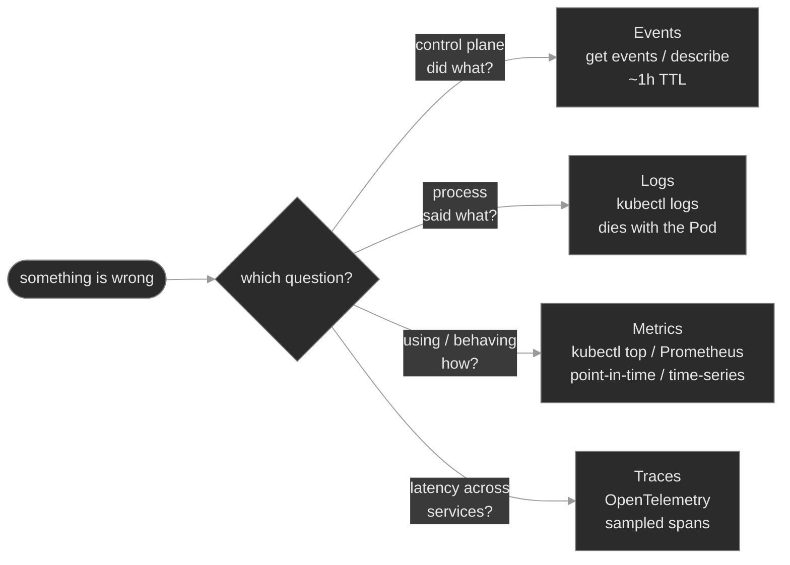

# `m13-observability/`

## Concept

## M13 — Observability

> The three signals a running cluster already gives you — **events**, **logs**, **metrics** — plus the fourth you add yourself, **traces**; which question each answers, why every one of them is ephemeral, and how to read the right signal instead of guessing.

### What you'll learn

- Separate the three built-in signals by the question each answers — **events** (what the control plane *did*), **logs** (what the process *said*), **metrics** (how much it's *using* / how it's *behaving*) — and reach for the right one first
- Read an **Event** as a structured object — `type` (Normal/Warning), `reason`, `involvedObject`, `count` — and survey the stream with `--field-selector` and `--sort-by`, knowing it's namespaced and expires (~1h TTL)
- Retrieve container logs under pressure: `--previous` for a container that already crashed, `-c` / `--all-containers` for the right container in a multi-container Pod, and `--since` / `--tail` / `-f` to scope the firehose
- Read the **container logging contract** — the kubelet captures only stdout/stderr, so an app that writes to a file inside the container is invisible to `kubectl logs` — and know the two fixes: log to stdout, or add a streaming **sidecar**
- Tell the **two metrics pipelines** apart — the **Resource Metrics API** (metrics-server → `kubectl top`, HPA) versus **application metrics** (Prometheus's pull/scrape model, the `/metrics` exposition format, ServiceMonitor) — and diagnose a scrape target that's silently down
- Place **traces** (OpenTelemetry) in the picture: what a span is, and why distributed tracing answers the cross-service latency question that logs and metrics structurally can't

### Why it matters

Observability is how you answer *what is this thing doing right now* without shelling into a box. Kubernetes ships three signals for free, and each answers a different question: an event tells you what the **control plane** tried and decided, a log line tells you what the **process** thought, a metric tells you how much it's **consuming** or how it's **behaving over time**. Reach for the wrong one and you burn an hour — reading app code for a scheduling failure, or staring at CPU graphs for a config bug the logs named in one line.

At Polyphone the split is constant. `session-broker` gets slow; events say the control plane is fine, logs say the app is fine, and only `kubectl top` shows it pinned at its memory limit — one workload, three signals, one answer. A monitoring sidecar quietly dies and the app keeps serving, so `get pods` reads `1/2` and nothing pages — you're blind on that workload until you read *which* container the event stream names. A scrape target's port is off by a digit and every dashboard for it goes flat, though the app is healthy and `kubectl top` still works, because that's a different pipeline.

The other half of the job is knowing that **all three built-in signals are ephemeral** — events expire (~1h TTL), logs die when the Pod is deleted, `kubectl top` keeps no history at all. That impermanence is the entire reason a real platform bolts durable pipelines on top. This module is about reading the live signal fast, and understanding what the durable stack is *for*.

### Scope

**Covers:** the three built-in signals and which question each answers; **Events** as first-class objects (`type`/`reason`/`involvedObject`/`count`/timestamps), their namespacing and TTL, surveying with `--field-selector` and `--sort-by`, and `describe`-aggregation versus `get events`; **container logs** — `kubectl logs` and its load-bearing flags (`--previous`, `-c`/`--all-containers`, `--since`/`--tail`/`-f`), the stdout/stderr contract, node-side rotation and log ephemerality, and the two shipping patterns (node-level collector DaemonSet, streaming sidecar); the **two metrics pipelines** — the Resource Metrics API (metrics-server, `kubectl top`, the HPA from M09) and the **Prometheus** pull model (the `/metrics` exposition format, the four metric types, the `prometheus.io/*` scrape convention, and the Prometheus Operator's ServiceMonitor); and **traces** / **OpenTelemetry** as a concept (spans, trace context, the Collector, OTLP).

**Doesn't cover:** installing and operating a full metrics/logging/tracing stack — Prometheus, Loki/Elasticsearch, Grafana, and an OTel Collector are *described*, not deployed, because each needs operator or storage infrastructure a single lab can't stand up (the same reason M09 kept VPA/KEDA/Cluster-Autoscaler concept-only); **PromQL**, recording/alerting rules, and SLO math; **dashboards**; the **audit log**, which records authorization decisions, not workload behavior → M10; and language-specific instrumentation SDKs.

**Assumes:** M00 (the `get → describe → events → logs` loop, `spec`/`status`, owner chains — this module goes deep on the last two of those commands), M01 (the Pod lifecycle and probes — a failing probe is an event you'll read; a crashing container is what `--previous` is for), M06 (requests and limits — a metric is only meaningful against a request), and M09 (the HPA reads the Resource Metrics API — the pipeline `kubectl top` reads).

### Vocabulary

| Term | Definition |
|------|------------|
| **Event** | A short-lived object recording something that happened to another object. Not a log line — it's the control plane (scheduler, kubelet, controllers) narrating its own actions. |
| **Normal / Warning** | An Event's `type`. `Normal` is routine (`Scheduled`, `Pulled`, `Started`); `Warning` is trouble (`Unhealthy`, `BackOff`, `FailedScheduling`). Triage reads Warnings first. |
| **reason** | An Event's short machine token for *what* happened — `Unhealthy`, `BackOff`, `Killing`, `OOMKilling`, `FailedMount`. The best `--field-selector` key. |
| **involvedObject** | The object an Event is about (`kind`/`name`/`uid`). `describe` finds an object's events by matching this to its UID. |
| **count / lastTimestamp** | Repeated identical events aggregate into one row with a `count` and a `lastTimestamp` — a line reading `count=47` recurred 47 times; you didn't miss 46. A high, climbing count is an active fire. |
| **event TTL** | Events are garbage-collected after a fixed age (default ~1 hour, `--event-ttl` on the API server). They are not durable history. |
| **container logging contract** | The kubelet captures a container's **stdout** and **stderr** only. Anything written to a file inside the container is invisible to `kubectl logs`. |
| **`--previous`** | `kubectl logs --previous` returns the logs of the *prior, terminated* instance of a container — the only way to see why a container that has since restarted actually died. |
| **sidecar (streaming)** | A second container in a Pod that `tail`s an app's log file (on a shared volume) to its own stdout, so a stdout-only log collector can ship it. |
| **Resource Metrics API** | The API (`metrics.k8s.io`) served by **metrics-server**: live CPU/memory per Pod and Node, point-in-time, no history. Powers `kubectl top` and the HPA. |
| **application metrics** | Numbers a workload publishes about *itself* (calls/sec, queue depth, error rate) at an HTTP `/metrics` endpoint, in the Prometheus exposition format. |
| **scrape / pull model** | Prometheus *pulls*: it periodically fetches `/metrics` from each target it discovers. The workload doesn't push; it just exposes an endpoint and waits to be scraped. |
| **exposition format** | The plain-text line format at `/metrics`: `metric_name{label="v"} value`, with `# HELP` / `# TYPE` headers. Metric types: **counter**, **gauge**, **histogram**, **summary**. |
| **ServiceMonitor** | A Prometheus Operator custom resource that declares *which* Services to scrape and on which port — the operator-managed alternative to hand-written scrape configs or `prometheus.io/*` annotations. |
| **span / trace / OTel** | A **span** is one timed operation (one service handling one request); a **trace** is the tree of spans for a single request crossing services, tied by a propagated trace ID. **OpenTelemetry** is the vendor-neutral standard for producing them (SDKs, the **OTLP** format, the **Collector**). |

### Mental model

Three signals come with the cluster, and a fourth you add. The trick is not memorizing commands — it's matching the *question* to the *signal*, because each answers exactly one kind of question and each has a different lifetime.



The load-bearing insight is the shared weakness: **the three built-in signals are all ephemeral.** Events expire, logs die with the Pod, `kubectl top` keeps no history. That's not a flaw to route around — it's the reason a production platform runs a durable layer on top: a log store fed by node collectors, a Prometheus time-series database fed by scrapes, a tracing backend fed by spans. `kubectl` reads the live, expiring signal at 3am; the stack answers "what happened last Tuesday." Know both, and know which one you're holding.

### Concept walkthrough

#### Events — the control plane narrating itself

An Event is not a log line. Your app doesn't write it; the **control plane** does — the scheduler, the kubelet, and the various controllers emit an Event whenever they do something worth recording *to* an object. `Scheduled`, `Pulling`, `Pulled`, `Created`, `Started` are the Normal lifecycle beats; `FailedScheduling`, `Unhealthy`, `BackOff`, `Killing`, `OOMKilling`, `FailedMount` are the Warnings. When a Pod is `Pending` and its own logs don't exist yet, the event stream is the *only* signal that exists.

Each Event is a structured object worth reading field by field<sup><a href="https://kubernetes.io/docs/reference/kubernetes-api/cluster-resources/event-v1/">[1]</a></sup>:

```text
LAST SEEN   TYPE      REASON      OBJECT             MESSAGE
2m (x47)    Warning   Unhealthy   pod/reg-proxy-0    Readiness probe failed: HTTP probe failed with statuscode: 404
```

- `type` — `Normal` or `Warning`. In triage you filter to `Warning` first.
- `reason` — the machine token (`Unhealthy`). It's stable, so it's the best thing to select on.
- `involvedObject` — what it's about (`pod/reg-proxy-0`). This is the key `describe` uses.
- `count` / `lastTimestamp` — the `x47` means this exact event fired 47 times and was aggregated into one row. A high, climbing count is a fast, ongoing failure; a count of 1 an hour ago is stale.

Two properties shape how you use them. Events are **namespaced** — `kubectl get events` shows only the current namespace, so reach for `-A` when you don't yet know where the problem lives. And they're **ephemeral**: the API server garbage-collects them after a TTL (~1 hour)<sup><a href="https://kubernetes.io/docs/concepts/cluster-administration/logging/">[2]</a></sup>, so a failure that recovered two hours ago has *no* events left — which is why teams run an event exporter to ship them somewhere durable.

Two ways to read them, for two questions. `kubectl describe <kind> <name>` shows the events for **one object** (matching `involvedObject` to its UID) — when you know the suspect. `kubectl get events` surveys the **stream**, shaped with selectors<sup><a href="https://kubernetes.io/docs/tasks/debug/debug-application/debug-running-pod/">[3]</a></sup>:

```bash
kubectl get events -n signaling --sort-by=.lastTimestamp          # oldest→newest; read the bottom
kubectl get events -A --field-selector type=Warning               # only the trouble, cluster-wide
kubectl get events -n signaling --field-selector reason=BackOff,involvedObject.name=reg-proxy-0
```

`get events` is unsorted by default — always add `--sort-by=.lastTimestamp` or you'll misread the order. When you don't know the object, survey by `type=Warning`; when you do, `describe` it.

<details>
<summary>📖 Going deeper: why <code>count</code> exists, and the two Event API groups<sup><a href="https://kubernetes.io/docs/reference/kubernetes-api/cluster-resources/event-v1/">[1]</a></sup></summary>

A crashlooping container could emit a `BackOff` event every ten seconds — thousands per hour, enough to strain etcd. Kubernetes deduplicates: identical events (same `reason`, `involvedObject`, message) collapse into one object whose `count` increments and `lastTimestamp` advances. So a `kubectl get events` row reading `(x2033)` is an aggregate, not a sample — and that `count` *is* the severity signal: the same Warning is a one-off at `count=1` and an active fire at `count=2033`.

Historically there are two Event APIs: the original `core/v1` `Event` that `describe` reads, and a newer `events.k8s.io/v1` carrying richer, better-deduplicated events that the kubelet emits through. `kubectl get events` shows a unified view; you'll see both `.involvedObject` (core) and `.regarding` (events.k8s.io) only if you dump raw YAML.

</details>

#### Logs — what the process said, and the contract behind them

`kubectl logs <pod>` returns a container's output — and it returns *only* stdout and stderr, because that's the entire **container logging contract**. The kubelet redirects the container's stdout/stderr to a file on the node (under `/var/log/pods/…`) and `kubectl logs` streams that file back through the API server<sup><a href="https://kubernetes.io/docs/concepts/cluster-administration/logging/">[2]</a></sup>. The corollary bites people: an app that writes its "logs" to a file *inside* the container — `/var/log/app/app.log` — produces an empty `kubectl logs`, because nothing went to stdout. The app is running and logging; you just can't see it. The fix is to make the app log to stdout (the twelve-factor convention), or, when you can't change the app, to run a **streaming sidecar**.

The flags that matter when it counts<sup><a href="https://kubernetes.io/docs/reference/kubectl/generated/kubectl_logs/">[4]</a></sup>:

- `--previous` (`-p`) — the logs of the **prior terminated instance**. When a container has restarted, `kubectl logs` shows the *fresh* start (often clean and misleading); `--previous` shows why the last one died. This is the single most important logs flag at 3am.
- `-c <container>` / `--all-containers` — a Pod with more than one container makes `kubectl logs` ambiguous; name the container, or read them all. A `1/2` Pod means one of two containers is down — read *that* one.
- `--since=15m` / `--tail=100` — scope the firehose to a window or a count.
- `-f` — follow (stream) live.

The other half of the story is that **logs are as ephemeral as the Pod**. They're files on the node, and the kubelet rotates them (a default cap around 10Mi per file, a few files kept — older lines are discarded)<sup><a href="https://kubernetes.io/docs/concepts/cluster-administration/logging/">[2]</a></sup>. Delete the Pod and the files go with it; `kubectl logs` on a gone Pod returns nothing. So anything you'll want *after* the Pod is gone has to be shipped off the node while it's still there — which is what the durable log stack does.

<details>
<summary>📖 Going deeper: the two log-shipping patterns<sup><a href="https://kubernetes.io/docs/concepts/cluster-administration/logging/">[2]</a></sup></summary>

Two standard ways to get logs off the node into a central store, for two situations.

- **Node-level collector (a DaemonSet).** One agent per node (Fluent Bit, Vector, Fluentd) tails every container's stdout/stderr files under `/var/log/pods`, tags each line with its Pod/namespace/labels, and forwards to a store (Loki, Elasticsearch, a cloud sink). This is the default: zero-config for the app *as long as it logs to stdout*, one agent covers every Pod on the node. It's why "log to stdout" is the whole contract — do that and the platform's collector already ships you.

- **Streaming sidecar.** When an app insists on writing to a file (a legacy binary, an access log it won't send to stdout), add a second container that shares a volume with the app and does `tail -F /var/log/app/app.log` to *its* stdout, so the file's contents flow to stdout and the node collector picks them up like any other container. It costs a container and some memory per Pod — the fallback, not the default.

</details>

#### Metrics — two pipelines, and never confuse them

"Metrics" in Kubernetes means two entirely separate pipelines. Confusing them is the most common metrics mistake, so pin the distinction first.

**Pipeline 1 — the Resource Metrics API.** `metrics-server` scrapes each kubelet for live CPU and memory per Pod and Node and serves it on the `metrics.k8s.io` API<sup><a href="https://kubernetes.io/docs/tasks/debug/debug-cluster/resource-metrics-pipeline/">[5]</a></sup>. That's the pipeline behind `kubectl top`:

```bash
kubectl top nodes                 # per-node CPU/memory usage vs. capacity
kubectl top pods -A --sort-by=memory
```

It is deliberately minimal: CPU and memory only, *right now* only, no history, no custom numbers. It answers "how loaded is this?" and feeds the HPA, which divides live usage by the Pod's **request** to get the utilization it scales on (M09). No metrics-server → `kubectl top` errors and the HPA reads `<unknown>` — same pipeline, same failure.

**Pipeline 2 — application metrics (the Prometheus model).** Anything richer — calls per second, queue depth, error ratio, p99 latency — the *workload* has to publish about itself, and the ecosystem standard is **Prometheus**<sup><a href="https://prometheus.io/docs/concepts/data_model/">[6]</a></sup>. The model is **pull**: each workload exposes an HTTP endpoint (by convention `/metrics`) in a plain-text **exposition format**, and Prometheus periodically *scrapes* it:

```text
## HELP sip_calls_active Currently active SIP calls.
## TYPE sip_calls_active gauge
sip_calls_active 42
## HELP sip_calls_total Total SIP calls processed since start.
## TYPE sip_calls_total counter
sip_calls_total 18734
```

The four metric types are worth knowing on sight: a **counter** only goes up (totals — you `rate()` it), a **gauge** goes up and down (a level — active calls, memory), a **histogram** buckets observations (latency distributions, for percentiles), and a **summary** is a client-side percentile. The workload doesn't push anywhere; it exposes and waits.

How does Prometheus know *what* to scrape? The lightweight convention is **Pod annotations** — `prometheus.io/scrape: "true"`, `prometheus.io/port: "80"`, `prometheus.io/path: "/metrics"`. The production one is the **Prometheus Operator**: install Prometheus as an operator (the CRD/controller pattern) and declare targets as **ServiceMonitor** or **PodMonitor** custom resources — "scrape every Pod behind this Service, on the port named `metrics`"<sup><a href="https://github.com/prometheus-operator/prometheus-operator/blob/main/Documentation/design.md">[7]</a></sup>. Either way the failure mode is the same and specific: if the declared **port** doesn't match the port the workload serves `/metrics` on, the scrape is refused, the target shows **DOWN**, and every graph for it goes flat — while the app is healthy and `kubectl top` (pipeline 1) still works. A metrics gap with a green `kubectl top` is almost always a pipeline-2 scrape problem, not a sick app. (One caution: every distinct label *value* is its own time series, so a label like `call_id` with millions of values — **high cardinality** — can bury the database. Keep labels bounded.)

#### Traces — the fourth signal

Metrics aggregate (p99 across *all* calls); logs are per-process (what *this* container said). Neither answers "for *this one slow call*, which of the eight services it touched ate the 900ms?" That's **distributed tracing**. A **span** is one timed operation — one service handling one request, with a start, duration, and attributes. A **trace** is the tree of spans for a single request as it flows `sip-proxy → sip-router → sip-app → route-engine`, stitched together because each hop propagates a shared **trace ID** (the W3C `traceparent` header). Read the trace and the slow hop is the long bar.

**OpenTelemetry (OTel)** is the vendor-neutral standard for producing this: instrumentation SDKs, the **OTLP** wire format, and the **Collector** — an in-cluster pipeline that receives spans, processes them, and exports to a backend (Jaeger, Tempo, a vendor)<sup><a href="https://opentelemetry.io/docs/concepts/signals/traces/">[8]</a></sup>. It isn't installed here — tracing needs app instrumentation and a backend a single lab can't stand up — so you'll learn its shape, not run it. The reflex to carry: when metrics say "slow" and logs say "each service looks fine," the missing signal is a trace across the call path.

### Hands-on

Four steps in the baseline, three break/fix scenarios — all on the full Polyphone fleet on a 2-node cluster. The baseline tours a healthy version of each signal; each break/fix breaks the reading of exactly one signal so you practice a single instrument at a time.

- **`baseline/`** — read all three live signals on a healthy fleet: survey the **event** stream (`--field-selector`, `--sort-by`, the `type`/`reason`/`count` fields); pull **logs** with `--previous`, `-c`, `--since`; read **resource metrics** with `kubectl top`; and inspect a healthy **application-metrics** target — its `/metrics` exposition output and `prometheus.io/*` annotations. What "observable" looks like before a signal goes dark.
- **`breakfix-01-logs-to-stdout`** — `session-logger` is `Running 1/1` but `kubectl logs` shows only a startup banner: the app writes its real logs to a file inside the container, breaking the stdout contract. Tests recognizing an empty-but-healthy log and restoring visibility (stdout, or a streaming sidecar).
- **`breakfix-02-sidecar-crashloop`** — `sip-monitor` sits at `1/2`: the app container is fine, but its telemetry **sidecar** crashloops. Tests reading *which* container the event stream names, then `logs -c <sidecar> --previous` to see why the dead instance died.
- **`breakfix-03-metrics-scrape-port`** — `call-metrics` is healthy and `kubectl top` works, but its dashboards are flat: the `prometheus.io/port` annotation points at a port nothing serves, so the scrape target is DOWN. Tests the two-pipeline distinction and fixing a scrape target.

Check yourself against `ANSWER-KEY.md` after each.

### Common failure modes

| Symptom | Likely cause | Where to look |
|---------|--------------|---------------|
| `kubectl logs` is empty but the Pod is `Running` | App writes logs to a file, not stdout/stderr | `kubectl exec … -- ls /var/log/…`; the container's log destination |
| `kubectl logs` shows a clean fresh start for a Pod that keeps restarting | You're reading the *current* instance, not the one that died | `kubectl logs --previous`; `describe` → `Last State` |
| Pod `1/2` (or `2/3`) and nothing obvious wrong | One container of several is down | `describe` events name the container; `kubectl logs -c <container> [--previous]` |
| A failure "has no events" | Events aged out (TTL), or you're in the wrong namespace | shorten the window / `get events -A`; capture events durably next time |
| `get events` looks out of order | It's unsorted by default | add `--sort-by=.lastTimestamp` |
| `kubectl top` errors: `Metrics API not available` | metrics-server missing/unhealthy (also breaks HPA) | metrics-server Deployment in `kube-system`; wait if it just started |
| App dashboards flat, but app healthy and `kubectl top` fine | Scrape target DOWN — wrong port/path (pipeline 2, not pipeline 1) | the `prometheus.io/port` (or ServiceMonitor port) vs. the port `/metrics` actually serves on |
| Prometheus slow / TSDB bloated | High-cardinality label (unbounded values) | the label set on the offending metric |

### Recap

- **Three built-in signals, three questions.** Events = what the *control plane* did; logs = what the *process* said; metrics = how much it's *using* / how it's *behaving*. Match the question to the signal before you start typing, and you skip the hour spent reading the wrong one.
- **All three are ephemeral** — events expire (~1h TTL), logs die with the Pod, `kubectl top` keeps no history. That impermanence is the whole reason a durable stack (log store, metrics TSDB, tracing backend) exists. `kubectl` reads live; the stack reads history.
- **Events are structured objects, not text.** Read `type`, `reason`, `involvedObject`, and `count`; `describe` for one object, `get events --field-selector type=Warning --sort-by=.lastTimestamp` to survey. A climbing `count` is an active fire.
- **The logging contract is stdout/stderr only.** An app that logs to a file is invisible to `kubectl logs` — fix it with stdout or a streaming sidecar. And `--previous` (plus `-c` for the right container) is how you read a container that already died.
- **Metrics are two pipelines.** The Resource Metrics API (metrics-server → `kubectl top`, HPA) is CPU/memory, point-in-time. Application metrics (Prometheus pull, `/metrics` exposition, ServiceMonitor) are everything else. A metrics gap with a healthy `kubectl top` is a scrape problem, not a sick app.

### Production thinking

- A failure happened at 02:00, self-healed by 02:20, and paged no one; at 09:00 you're asked what happened. The Pod's logs are gone (it was replaced), its events have aged out, and `kubectl top` has no history. Which of the three signals *could* have told the story if it had been shipped somewhere durable, and what would you stand up so next time it isn't a guess?
- A workload's `/metrics` endpoint adds a label keyed on `call_id`. Within a day Prometheus is slow and its disk is filling. What happened, why is unbounded label cardinality so expensive in a time-series database, and what's the review rule that keeps it from recurring?
- You standardize on "everything logs to stdout" so one node-level collector ships the whole fleet. A vendored component only writes to a file and can't be changed. What do you add for just that Pod, what does it cost, and why is that the exception rather than the default?

### References

1. Kubernetes — Event API reference: https://kubernetes.io/docs/reference/kubernetes-api/cluster-resources/event-v1/
2. Kubernetes — Logging Architecture: https://kubernetes.io/docs/concepts/cluster-administration/logging/
3. Kubernetes — Debug Running Pods: https://kubernetes.io/docs/tasks/debug/debug-application/debug-running-pod/
4. Kubernetes — `kubectl logs` reference: https://kubernetes.io/docs/reference/kubectl/generated/kubectl_logs/
5. Kubernetes — Resource Metrics Pipeline: https://kubernetes.io/docs/tasks/debug/debug-cluster/resource-metrics-pipeline/
6. Prometheus — Data model and metric types: https://prometheus.io/docs/concepts/data_model/
7. Prometheus Operator — Design (ServiceMonitor/PodMonitor): https://github.com/prometheus-operator/prometheus-operator/blob/main/Documentation/design.md
8. OpenTelemetry — Traces (spans, context, the Collector): https://opentelemetry.io/docs/concepts/signals/traces/


---

## Break/Fix Practice

## Break/fix 01 — Logs: an app that writes to a file

**Symptom — what you'd actually see:**

`session-logger` in `app-services` is `Running 1/1`, no restarts — healthy by every status check — but `kubectl logs deploy/session-logger` returns a single startup line and nothing else. The workload is obviously doing work (it was deployed to record per-session activity), yet its log is empty.

**Think about this before you open the answer:**

Recognizing that an empty log on a healthy Pod is a *logging-contract* problem, and bridging file output to stdout. Self-grading questions:

- Did you read the Pod as healthy (Running, 0 restarts) and treat the empty log as "not logging to stdout," rather than assuming a crash?
- Did the startup banner (or an `exec … ls /var/log`) lead you to the file, instead of concluding "this app has no logs"?
- Did you fix it by getting output to stdout (reconfigure or sidecar), rather than telling people to `exec` in and `tail` the file forever?

<details>
<summary><b>Click to reveal: diagnostic commands, root cause, exact fix, verify</b></summary>

**Root cause:**

The container writes its real output to a file *inside* the container, `/var/log/app/session.log`, instead of to stdout. The kubelet's logging pipeline captures **stdout/stderr only**, so `kubectl logs` sees only the one banner line the app prints to stdout at startup. The app is logging correctly *to the wrong place*; nothing is broken except the logging contract<sup><a href="https://kubernetes.io/docs/concepts/cluster-administration/logging/">[2]</a></sup>.

**Diagnostic commands (run in this order):**

```bash
# 1. Healthy Pod — not a crash, not scheduling
kubectl get pods -n app-services -l app=session-logger            # Running 1/1, 0 restarts

# 2. The log is nearly empty — and the one line it prints is the clue
kubectl logs -n app-services deploy/session-logger
#    [session-logger] starting; writing session events to /var/log/app/session.log
#    ^ it told you where it logs: a FILE, not stdout

# 3. Confirm the output is on disk, not on stdout
kubectl exec -n app-services deploy/session-logger -- ls -l /var/log/app
kubectl exec -n app-services deploy/session-logger -- tail -5 /var/log/app/session.log
#    a growing session.log full of "session sess-N established ..." lines
```

A `Running` Pod with an empty log is not a dead end — it means the app isn't writing to stdout. Read the banner (it often names the file); confirm with `exec`.

**Exact fix:**

Get that output onto stdout. Either reconfigure the app (preferred when you own it), or add a streaming sidecar (when you can't change it — the file already lives on a shared `emptyDir`):

```bash
# Option A — log to stdout (the twelve-factor default)
kubectl edit deployment session-logger -n app-services
#   in containers[0].args, drop the "  >> /var/log/app/session.log" redirect → echo to stdout

# Option B — streaming sidecar that tails the file to its stdout
kubectl patch deployment session-logger -n app-services --type=json -p='[
  {"op":"add","path":"/spec/template/spec/containers/-","value":{
    "name":"log-stream","image":"busybox:1.36",
    "command":["/bin/sh","-c","touch /var/log/app/session.log; exec tail -f /var/log/app/session.log"],
    "volumeMounts":[{"name":"logs","mountPath":"/var/log/app"}]}}]'
```

**Verify:**

```bash
kubectl rollout status deployment session-logger -n app-services --timeout=60s
kubectl logs -n app-services deploy/session-logger --all-containers=true --tail=6
#    the "session sess-N established ..." lines are now visible via kubectl logs
```

Use `--all-containers` — after the sidecar fix the lines come from `log-stream`, not `app`.

**Production thinking:**

The whole log stack keys on stdout/stderr — a node-level collector (Fluent Bit/Vector as a DaemonSet) tails every container's stdout and ships it centrally. An app that logs to a file is invisible to all of it, so its logs never leave the node and vanish when the Pod is replaced. Standardize on "log to stdout"; reserve the streaming sidecar for vendored binaries you genuinely can't change, and know it costs a container and some memory per Pod.

</details>

---

## Break/fix 02 — Logs & Events: a crashlooping sidecar

**Symptom — what you'd actually see:**

`sip-monitor` in `signaling` sits at `1/2` with a climbing restart count and `STATUS CrashLoopBackOff`. The SIP monitoring app itself serves fine; one of its two containers keeps dying, and nothing paged because the app never went down.

**Think about this before you open the answer:**

Isolating one failing container in a multi-container Pod, and the `-c` + `--previous` pair. Self-grading questions:

- Did the `1/2` push you to find *which* container (per-container status / the `BackOff` event) before touching anything?
- Did you reach for `--previous` — because the current instance is mid-restart and only the dead one carries the error — rather than reading empty live logs?
- Did you read `-c metrics-agent` specifically, not the default (`app`) container that was fine all along?

<details>
<summary><b>Click to reveal: diagnostic commands, root cause, exact fix, verify</b></summary>

**Root cause:**

The Pod runs two containers — `app` (nginx, healthy) and `metrics-agent` (a telemetry sidecar). The sidecar's command execs `/usr/local/bin/metrics-agent`, a binary that isn't present in its `busybox` image, so it exits 127 immediately and the kubelet restarts it forever. The Pod can never be Ready (readiness requires *all* containers), so it stays `1/2` and that workload's telemetry export is dark<sup><a href="https://kubernetes.io/docs/tasks/debug/debug-application/debug-running-pod/">[3]</a></sup>.

**Diagnostic commands (run in this order):**

```bash
# 1. 1/2 and CrashLoopBackOff — one of two containers is down
kubectl get pods -n signaling -l app=sip-monitor            # READY 1/2, RESTARTS climbing

# 2. WHICH container? Per-container status names it
kubectl get pod -n signaling -l app=sip-monitor -o \
  custom-columns='CONTAINER:.status.containerStatuses[*].name,READY:.status.containerStatuses[*].ready,RESTARTS:.status.containerStatuses[*].restartCount'
#    app=true, metrics-agent=false (restarts climbing)

# 3. The event stream names it too
kubectl describe pod -n signaling -l app=sip-monitor | sed -n '/Events:/,$p'
#    Warning  BackOff  ...  Back-off restarting failed container=metrics-agent

# 4. Read the DEAD instance's logs — the live one is mid-backoff
kubectl logs -n signaling deploy/sip-monitor -c metrics-agent --previous
#    [metrics-agent] starting; exporting sip-monitor telemetry
#    /bin/sh: exec: line 3: /usr/local/bin/metrics-agent: not found     (exit 127)
```

`get pods` aggregates; the per-container status and the `BackOff` event name the failing container; `-c … --previous` reads why the dead instance died.

**Exact fix:**

Correct the sidecar's command so it runs something the image can execute (in production you'd fix the image or the binary path). `metrics-agent` is container index `1`:

```bash
kubectl patch deployment sip-monitor -n signaling --type=json -p='[
  {"op":"replace","path":"/spec/template/spec/containers/1/args/0",
   "value":"echo \"[metrics-agent] starting; exporting sip-monitor telemetry\"\nwhile true; do echo \"[metrics-agent] exported telemetry batch\"; sleep 30; done\n"}]'
```

**Verify:**

```bash
kubectl rollout status deployment sip-monitor -n signaling --timeout=90s
kubectl get pods -n signaling -l app=sip-monitor                 # READY 2/2, Running
kubectl logs -n signaling deploy/sip-monitor -c metrics-agent --tail=3   # exporting again
```

**Production thinking:**

Sidecars *are* the observability topology — log shippers, metrics agents, mesh proxies all ride alongside the app. When one dies quietly, the app keeps serving and no alert fires, but you go blind on that workload. Alert on Pods that are `Ready < desired` for more than a few minutes (not just on Pods that are fully down), and treat a crashlooping telemetry sidecar as an incident, because the thing that would normally tell you something is wrong is itself the thing that's broken.

</details>

---

## Break/fix 03 — Metrics: a scrape target that's DOWN

**Symptom — what you'd actually see:**

`call-metrics` in `analytics` is `Running 1/1`, `kubectl top` shows it consuming CPU/memory normally, and its `/metrics` endpoint serves fine — but every dashboard and alert built on its metrics has gone flat. No new data is arriving.

**Think about this before you open the answer:**

The two-pipelines distinction, and fixing a scrape target rather than the app. Self-grading questions:

- Did a healthy `kubectl top` tell you the app and metrics-server were fine, steering you to the scrape rather than the workload?
- Did you prove the app exposes `/metrics` on its real port *before* concluding the app was fine — so the fault had to be in discovery/scraping?
- Did you compare the advertised scrape port to the serving port, and fix the annotation (or ServiceMonitor), not the app?

<details>
<summary><b>Click to reveal: diagnostic commands, root cause, exact fix, verify</b></summary>

**Root cause:**

Two separate metrics pipelines. The **resource metrics** pipeline (metrics-server → `kubectl top`) is healthy, which is why `top` still works. The **application metrics** pipeline is broken: the Pod's `prometheus.io/port` annotation advertises `9090`, but the container serves `/metrics` on `80`. A Prometheus discovers the Pod by its annotations and scrapes `podIP:9090`, gets connection-refused, and marks the target **DOWN** — so the metric never arrives and the graph flatlines<sup><a href="https://prometheus.io/docs/concepts/data_model/">[6]</a></sup>. The app is healthy; the scrape target is misconfigured.

**Diagnostic commands (run in this order):**

```bash
# 1. App healthy, and the OTHER pipeline (kubectl top) works
kubectl get pods -n analytics -l app=call-metrics          # Running 1/1
kubectl top  pod  -n analytics -l app=call-metrics          # CPU/mem returned → pipeline 1 fine

# 2. The app really exposes /metrics — on its real port (80)
POD_IP=$(kubectl get pod -n analytics -l app=call-metrics -o jsonpath='{.items[0].status.podIP}')
kubectl run obs-curl --rm -i --restart=Never --image=curlimages/curl:8.11.1 -n analytics \
  -- curl -s http://$POD_IP:80/metrics                      # exposition output returns

# 3. But the scrape annotation points elsewhere
kubectl get pod -n analytics -l app=call-metrics \
  -o jsonpath='{.items[0].metadata.annotations.prometheus\.io/port}{"\n"}'   # 9090

# 4. Reproduce the scrape at the advertised port → refused
kubectl run obs-curl --rm -i --restart=Never --image=curlimages/curl:8.11.1 -n analytics \
  -- curl -s -m 5 -o /dev/null -w "HTTP %{http_code}\n" http://$POD_IP:9090/metrics   # HTTP 000
```

A healthy `kubectl top` with flat app dashboards is the tell: pipeline 1 is fine, so the fault is in pipeline 2 — the scrape.

**Exact fix:**

Point the scrape port at the port `/metrics` is actually served on (80). With annotations:

```bash
kubectl patch deployment call-metrics -n analytics -p \
  '{"spec":{"template":{"metadata":{"annotations":{"prometheus.io/port":"80"}}}}}'
# With the Prometheus Operator, you'd fix the ServiceMonitor's `port` instead — same mismatch.
```

**Verify:**

```bash
kubectl rollout status deployment call-metrics -n analytics --timeout=60s
kubectl get deploy call-metrics -n analytics \
  -o jsonpath='{.spec.template.metadata.annotations.prometheus\.io/port}{"\n"}'   # 80
POD_IP=$(kubectl get pod -n analytics -l app=call-metrics -o jsonpath='{.items[0].status.podIP}')
kubectl run obs-curl --rm -i --restart=Never --image=curlimages/curl:8.11.1 -n analytics \
  -- curl -s -o /dev/null -w "HTTP %{http_code}\n" http://$POD_IP:80/metrics        # HTTP 200
```

**Production thinking:**

A one-digit port typo silently drops an entire workload from monitoring — no error on the app, no failed deploy, just a target that reads DOWN in Prometheus and graphs that go flat. This is why teams alert on `up == 0` (the scrape-health metric Prometheus records for every target) in addition to app-level metrics: it catches the workload that fell out of monitoring before someone notices the dashboard is blank during an incident. Bake the scrape port into the same manifest as the container port so the two can't drift, and prefer a ServiceMonitor that references the port *by name* over a hard-coded number.

</details>

---
