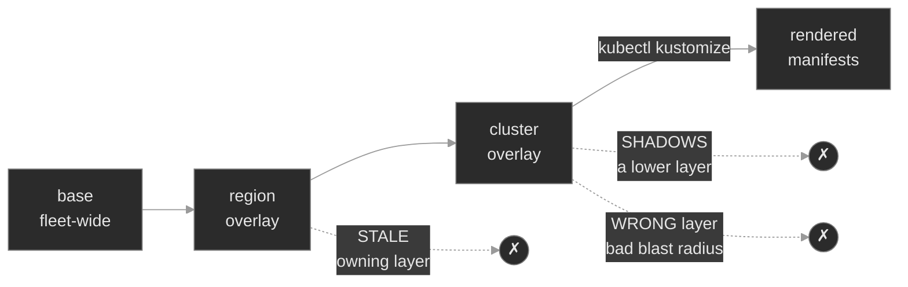

# `m19-multi-cluster/`

## Concept

## M19 — Multi-cluster Fleet

> One repo, many clusters. How a fleet's desired state is composed per-cluster from shared layers — and the three ways a value ends up wrong for one cluster while every other cluster is fine.

### What you'll learn

- Structure a fleet repository as **base → region → cluster** layers, and read any cluster's `kustomization.yaml` as a path through that stack
- Render exactly one cluster's manifests with `kubectl kustomize clusters/<cluster>` and **trace every field to the layer that set it**
- Reason about **cluster variables** — the per-cluster and per-region values (region, tier, capacity, image) that differentiate otherwise-identical clusters — and know which layer owns each
- Understand **composition order** and why, when two layers set the same field, the later one wins (last-writer-wins)
- Run a change through **promotion** (lab → stage → prod) and internalize that the layer you edit *is* the blast radius
- Locate a fleet misconfiguration to the layer that owns it, because at fleet scale "the value is wrong" has three distinct root causes and each is fixed in a different place

### Why it matters

Polyphone doesn't run a cluster; it runs a fleet — four regions crossed with several tiers, dozens of clusters that must be *nearly* identical. Same workloads, same contracts, differing only where they genuinely must: where a region places its Pods, how much capacity a tier is sized for, which image is currently under test. The unit of operation is no longer a single cluster, and the source of truth is no longer any one API server — it's a git repository that describes the whole fleet at once. Get the layering right and a security fix committed to the base reaches forty clusters on the next reconcile. Get it wrong and one region quietly runs last quarter's config for a month before anyone notices.

M16 taught base plus overlay for one workload in one place. A fleet is that same idea under load: many overlays, two axes of variation — *where* a cluster runs and *how ripe* its tier is — and the operational discipline of moving a change through tiers without it landing everywhere at once. The failure surface changes with it. A broken Deployment shows up in `kubectl describe`. A *fleet* misconfiguration renders as perfectly valid YAML, applies cleanly, runs — and is simply wrong for that one cluster: the right value sitting in the wrong layer, or a stale value the owning layer never had updated. There is no error to read and nothing to `describe`. The tool is the render, and the skill is tracing a surprising value back to the layer that produced it.

### Scope

**Covers:** the base → region → cluster layering that composes a fleet; **cluster variables** and the rule that each has exactly one owning layer; **rendering trace** (`kubectl kustomize <cluster>`) and **composition order** / last-writer-wins; **promotion** across tiers and how the edited layer sets blast radius; per-region overlays as the geographic axis of variation.

**Doesn't cover:** how a render is *delivered* to real clusters — a GitOps controller reconciling each cluster's path, drift detection, and dependency ordering is Flux (M18); Helm-templated fleets and the Kustomize-vs-Helm choice (M17); secrets across a fleet (M11); and the Kustomize mechanics themselves — patches, generators and the name-suffix hash, the `labels`/`images` transformers, `behavior: merge`, the immutable-selector trap — which M16 taught and this module assumes cold.

**Assumes:** M16 in full (bases and overlays, patches, `configMapGenerator` and the content-hash suffix, the `labels` and `images` transformers, `behavior: merge`, `kubectl kustomize` vs `kubectl apply -k`); you can read a Deployment, Service, and ConfigMap (M01, M03, M04); labels and that a Deployment's selector is immutable (M00, M04).

### Vocabulary

| Term | Definition |
|------|------------|
| **Fleet** | The set of clusters you operate as one unit. Differentiated, not independent: the same workloads, with per-cluster departures. |
| **Layer** | One kustomization in the composition stack. This module uses three: base, region overlay, cluster overlay. |
| **Base layer** | The fleet-wide source of truth — what every cluster runs, identically. A change here reaches the whole fleet. |
| **Region overlay** | A layer that owns region-scoped values (placement, `REGION`, regional capacity). Every cluster in a region composes it. |
| **Cluster overlay** | The leaf a single cluster is built from. It composes a region overlay and pins that cluster's tier, replicas, image, and per-cluster config. |
| **Cluster variable** | A value that differentiates one cluster or region from another — `REGION`, `tier`, replica count, capacity, image tag. Carried as a generator literal, a patch, or a transformer in the layer that owns it. |
| **Composition order** | The order layers accumulate: base first, then region, then cluster. Later layers override earlier ones on the same field. |
| **Last-writer-wins** | The consequence of composition order — when two layers set the same field, the layer later in the stack (the more specific one) wins. |
| **Rendering trace** | Reading `kubectl kustomize <cluster>` and attributing each rendered field to the layer that set it. The core fleet-debugging skill. |
| **Promotion** | Moving a change through tiers in sequence (lab → stage → prod), gating at each. Implemented by advancing a pin from one tier's overlay to the next. |
| **Blast radius** | How many clusters a single edit affects — set entirely by which layer you edit. The base hits the fleet; a cluster overlay hits one cluster. |
| **`kubectl kustomize clusters/<cluster>`** | Render exactly what that one cluster would receive. Touches no cluster; it is the trace tool. |

### Mental model

A fleet repository is a **function you evaluate once per cluster**. `kubectl kustomize clusters/prod-us-east-1` takes the layers that cluster composes — the base, its region overlay, its own overlay — and folds them, *in that order*, into one stream of plain manifests<sup><a href="https://kubernetes.io/docs/tasks/manage-kubernetes-objects/kustomization/">[1]</a></sup>. Every cluster is the same base evaluated with different arguments. As in M16, the cluster's API server never learns Kustomize exists; a GitOps controller (M18) renders the path and applies the result<sup><a href="https://fluxcd.io/flux/guides/repository-structure/">[6]</a></sup>. Killercoda gives you a single cluster, so here you *render* every fleet member and *apply* the one you're inspecting — the multi-cluster-ness lives entirely in the repo's structure.

Two properties of that fold are the whole module.

First, **composition is ordered, and later layers win.** The base sets `MAX_SESSIONS=500`; the `us-east-1` region raises it to `8000`; if a cluster overlay sets it too, the cluster's value wins. Reading the final render is never enough — you have to know *which layer* put each value there, because that is where you fix it.



Second, **the layer you edit is the blast radius.** The same one-line change is a fleet-wide rollout or a single-cluster tweak depending only on the file it lands in. That is the entire theory of promotion: you don't copy a change into every cluster, you move it *up* the layers deliberately — into lab's overlay first, then stage's, then prod's — so each tier is a gate a change has to clear.

Hold both. Every failure in this module is a value that is wrong *for a cluster*, and the diagnosis is always the same shape — render the cluster, find the surprising value, trace it to its layer. The layer decides the fix:

- **Stale in the owning layer** — the right layer owns the value, but its copy is out of date (a region overlay cloned from its sibling, its `REGION` never changed). Fix in that layer.
- **Shadowed by a later layer** — the owning layer is correct, but a more-specific layer overrides it (a leftover per-cluster pin winning over the region standard). Fix by removing the shadow.
- **Right value, wrong layer** — the change itself is correct but landed where the blast radius is wrong (a promotion pinned in prod instead of stage). Fix by moving it.

### Concept walkthrough

#### The fleet as layers

A fleet repo is a tree of kustomizations wired together by `resources:`, exactly as in M16 — only now the chain is three deep and fans out at the leaves:

```
fleet/
  base/                          # what every cluster runs (deployment, service, config defaults)
  regions/
    us-east-1/                   # region-scoped values: REGION, regional capacity, placement
    eu-central-1/
  clusters/
    lab-us-east-1/               # a leaf: composes regions/us-east-1, pins tier + image + replicas
    stage-us-east-1/
    prod-us-east-1/
    prod-eu-central-1/           # composes regions/eu-central-1 instead
```

Each cluster overlay's `resources:` names its region overlay, whose `resources:` names the base. So `clusters/prod-us-east-1` reads as a *path*: base → `regions/us-east-1` → this leaf. That path is the two axes made concrete — the region axis is which region overlay you compose, the tier axis is what the leaf pins. Four clusters, one base, and the only copied text is the small leaf that says "I am prod, in us-east-1, on this image."

The base is the fleet-wide contract. It renders on its own and captures everything identical across every cluster: the Deployment shape, the Service, the config keys and their conservative defaults. A fix to the base — a dropped capability, a corrected probe — reaches every cluster the next time each one is rendered. That reach is the reason the base exists, and also the reason you are careful about what you put in it (more on that under promotion).

#### Cluster variables: what differs, and where it lives

A **cluster variable** is any value that makes one cluster or region different from the identical majority. `REGION` and regional capacity differ per *region*; `tier`, replica count, and the image under test differ per *cluster*. The one rule that keeps a fleet legible: **each variable has exactly one owning layer.** `REGION` lives in the region overlay and nowhere else. Tier lives in the cluster overlay. Fleet-wide defaults live in the base. When a value has one home, "where do I change this?" has one answer, and a rendering trace has one place to land.

Kustomize carries these variables with the mechanisms M16 taught — a `configMapGenerator` literal with `behavior: merge`, a strategic-merge patch, an `images`<sup><a href="https://kubectl.docs.kubernetes.io/references/kustomize/kustomization/images/">[4]</a></sup> or `labels`<sup><a href="https://kubectl.docs.kubernetes.io/references/kustomize/kustomization/labels/">[5]</a></sup> transformer — but the fleet discipline is about *placement*, not mechanism. Capacity is a merged generator literal in the region overlay because capacity is regional; replica count is a patch in the cluster overlay because it is per-cluster.

Here is the sharp edge. A new region overlay is almost always born by copying its nearest sibling — you clone `regions/us-east-1/` to make `regions/eu-central-1/` because 90% of it is identical. Copy-paste is how the region overlay is created, and copy-paste is how its `REGION` variable ends up stale: the clone still says `REGION=us-east-1` and nobody caught it, because the render is valid, the apply succeeds, and the workload runs — it just reports the wrong region to everything downstream that reads it. This is the single most common multi-cluster bug, and it is invisible to every tool except the render.

#### Rendering trace and composition order

`kubectl kustomize clusters/<cluster>` is your microscope. It folds the cluster's whole layer path into final manifests and shows you exactly what that one cluster would receive — no cluster, no apply, no guessing. When a value is wrong, you render the cluster, find it, then walk *up* the path to see which layer set it.

The rule that makes the walk deterministic is **composition order**. Layers accumulate base-first, then region, then cluster; when more than one layer sets the same field, the one later in the accumulation — the more specific layer — wins<sup><a href="https://kubectl.docs.kubernetes.io/references/kustomize/kustomization/">[2]</a></sup>. Follow `MAX_SESSIONS` through `prod-us-east-1`:

- **base** sets `MAX_SESSIONS=500` — the fleet floor, what a region gets if it says nothing.
- **`regions/us-east-1`** merges `MAX_SESSIONS=8000` onto the base generator — the regional capacity standard. It wins over the base.
- the **cluster overlay** doesn't set it, so `8000` survives to the render.

The render shows `8000`. To attribute it, you don't guess — you grep each layer in the path for the key and take the *last* one that sets it. That is the entire trace algorithm, and it is why generators must share a name across layers: `behavior: merge` binds to the base generator only when the names match, exactly the name-match rule from M16, now operating up a three-layer stack<sup><a href="https://kubectl.docs.kubernetes.io/references/kustomize/kustomization/configmapgenerator/">[3]</a></sup>.

Composition order is also a trap. If a cluster overlay carries a *leftover* value — a per-cluster `MAX_SESSIONS` that made sense two quarters ago — it sits later in the stack than the region overlay and silently wins over the new regional standard. The region says `8000`, the cluster still says `5000`, and `5000` is what renders, because the cluster layer writes last. The owning layer is correct; a more-specific layer is shadowing it. You cannot see this by reading the region overlay you just edited — only the render, traced to the shadowing layer, reveals it.

<details>
<summary>📖 Going deeper: reading a trace by hand<sup><a href="https://kubectl.docs.kubernetes.io/references/kustomize/kustomization/">[2]</a></sup></summary>

When a rendered value surprises you, resist opening files at random. Work the path top-down, then confirm bottom-up:

1. **Render the leaf and read the value.** `kubectl kustomize clusters/prod-us-east-1 | grep MAX_SESSIONS` — this is ground truth, the thing the cluster actually gets.
2. **List the path.** The leaf's `resources:` names its region; the region's `resources:` names the base. Three files can set any given field.
3. **Grep each layer for who sets it,** base → region → cluster. For a generator literal: `grep -rn MAX_SESSIONS base regions/us-east-1 clusters/prod-us-east-1`. Every hit is a layer that touched the field.
4. **The last hit in composition order is the winner.** If the render disagrees with the layer you *thought* owned the value, a later layer is shadowing it — that later layer is your bug (or the value belongs there and your mental model of ownership is wrong).

The same walk works for an image (`images:` transformers), replicas (a patch), or a label (`labels:`). The mechanism differs; the "last layer to touch it wins, so grep the whole path" algorithm does not.

</details>

#### Promotion and blast radius

A change is promoted by moving it through tiers in order — lab, then stage, then prod — so each tier is a gate that catches a bad change one environment before it reaches customers<sup><a href="https://fluxcd.io/flux/guides/repository-structure/">[6]</a></sup>. In a layered fleet, promotion is not a copy into every cluster; it is *advancing a pin* from one tier's overlay to the next. A new image clears lab by being pinned in `clusters/lab-us-east-1`; it is promoted to stage by adding the same pin to `clusters/stage-us-east-1`; it reaches prod only when `clusters/prod-us-east-1` gets it. Between promotions, the tiers legitimately run different images — that is the gate working, not drift.

Which means **the layer you edit is the blast radius, and choosing the wrong layer breaks the gate two ways.** Pin the new image in the **base** and you have handed it to lab, stage, *and* prod in one commit — the gate is bypassed and an untested image is in front of customers. Pin it in the **wrong tier's overlay** — prod's instead of stage's — and prod overshoots the gate while stage never advances: the tier you meant to promote is unchanged and the tier you didn't is ahead of it. The image tag `1.27` renders in prod, `1.25` still renders in stage, and both are exactly backwards from what you intended.

The base is reserved for changes every cluster must take *at once* and on purpose — a security floor, a dropped-capability fix, a corrected default. Everything with a per-tier or per-cluster rollout — images, capacity bumps, feature flags — lives in the tier or cluster overlay that owns that step of the rollout, so the blast radius matches the intent. When you promote, you render the source tier and the target tier and diff them; the only field that should differ afterward is the one you moved.

### Hands-on

Four Killercoda scenarios, each on the full Polyphone fleet plus one Kustomize-managed fleet workload, `edge-relay`, whose repo lives at `/root/fleet`. The tree is base → `regions/{us-east-1,eu-central-1}` → `clusters/{lab,stage,prod}-us-east-1` and `prod-eu-central-1`.

- **`baseline/`** — the healthy fleet: read the layout, render two clusters and trace each field to its layer, watch the same image promote lab → stage → prod, and apply one cluster to see that the API server holds only rendered objects. No fix; the point is to see layers, cluster vars, composition order, and promotion all working.
- **`breakfix-01-stale-cluster-var`** — a region overlay was cloned from its sibling and its `REGION` variable never updated. `prod-eu-central-1` renders, applies, and runs — reporting the wrong region. The value is **stale in its owning layer**.
- **`breakfix-02-shadowed-override`** — the `us-east-1` region raised its session ceiling, but a leftover per-cluster override in `prod-us-east-1` sits later in the stack and wins. The value is **shadowed by a later layer**.
- **`breakfix-03-promotion-wrong-overlay`** — an image promotion meant for stage was pinned in prod's overlay instead. Prod overshot the gate; stage never advanced. The value is **right, in the wrong layer**.

Work them in order and check each against `ANSWER-KEY.md`. The three are one differential: same symptom shape (a value is wrong for one cluster), three different layers at fault, three different fixes.

### Common failure modes

| Symptom | Likely cause | Where to look |
|---------|--------------|---------------|
| A cluster runs fine but reports the wrong region/value | A cluster var is stale in its owning layer (cloned overlay, never updated) | The owning layer's literal/patch vs the render: `kubectl kustomize <cluster> \| grep <VAR>` |
| A layer you edited doesn't change the render | A later (more-specific) layer sets the same field and wins | Grep the whole path base→region→cluster; the last hit is the winner |
| A tier you promoted to didn't change | The pin was added to a different tier's overlay | `diff <(kubectl kustomize clusters/<src>) <(kubectl kustomize clusters/<dst>)` |
| A change reached every tier at once | The change was committed to the base, not a tier overlay | The base kustomization — a per-tier value doesn't belong there |
| `may not add resource with an already registered id` | A generator/resource is pulled in twice across layers, or a `behavior:` is missing | The `configMapGenerator` `behavior:` and names up the stack |
| Generated ConfigMap "not found" at runtime | A reference name drifted from the generator name across layers | Compare the reference to the generator name (M16's name-match rule) |
| Two regions diverge on a value that should be shared | The value lives in each region overlay instead of the base | Move the shared value down to the base; keep only the differences in regions |

### Recap

- **A fleet repo is a function evaluated once per cluster.** `kubectl kustomize clusters/<cluster>` folds base → region → cluster into the exact manifests that cluster receives. The cluster never sees Kustomize; a GitOps controller renders the path and applies it.
- **Composition is ordered; the last layer to set a field wins.** Reading the render is never enough — trace each surprising value up its layer path and take the last layer that set it.
- **Every cluster variable has one owning layer.** Region-scoped values in the region overlay, per-cluster values in the cluster overlay, fleet-wide defaults in the base. One home per value keeps "where do I fix this?" answerable.
- **The layer you edit is the blast radius.** The base hits the whole fleet; a cluster overlay hits one cluster. Promotion is advancing a pin lab → stage → prod, never editing the base for a per-tier change.
- **"The value is wrong" has three root causes at fleet scale** — stale in the owning layer, shadowed by a later layer, or right value in the wrong layer — and each is fixed in a different place. The render tells you which.

### Production thinking

- A stale cluster variable renders as valid YAML and runs. Nothing in `kubectl describe` catches it. What check would you add to CI so a cloned region overlay whose `REGION` still names the sibling never merges — and what would that check actually assert about the render?
- Composition order means a leftover per-cluster override silently wins over a new fleet-wide standard forever. Six months after you raise a regional default, how do you find every cluster still shadowing it — and is that a one-time audit or a standing lint?
- Promotion works only if the tiers are allowed to differ between gates. How do you tell a real, intended tier difference (stage is ahead of prod on purpose) from drift (someone edited prod directly)? Which of those is a job for M18's drift detection rather than a diff?
- You have forty clusters and a security fix that every one must take today. Base change, or forty cluster-overlay edits? What does putting it in the base cost you the *next* time you want a gated, per-tier rollout from the same repo?
- The base/region/cluster split works for two axes. When a third axis appears — say a per-tenant variant crossed with region and tier — does another overlay level scale, or is that the point where a component (M16) or a generated matrix of clusters serves you better?

### References

1. Kubernetes — Declarative Management of Kubernetes Objects Using Kustomize: https://kubernetes.io/docs/tasks/manage-kubernetes-objects/kustomization/
2. Kustomize — `kustomization` reference (resources, composition, accumulation order): https://kubectl.docs.kubernetes.io/references/kustomize/kustomization/
3. Kustomize — `configMapGenerator` field reference (`behavior: merge`, name match): https://kubectl.docs.kubernetes.io/references/kustomize/kustomization/configmapgenerator/
4. Kustomize — `images` field reference: https://kubectl.docs.kubernetes.io/references/kustomize/kustomization/images/
5. Kustomize — `labels` / `commonLabels` field reference: https://kubectl.docs.kubernetes.io/references/kustomize/kustomization/labels/
6. Flux — Ways of structuring your repositories (fleet layout, environments, promotion): https://fluxcd.io/flux/guides/repository-structure/


---

## Break/Fix Practice

## Break/fix 01 — Stale Cluster Variable

**Symptom — what you'd actually see:**

`edge-relay` in `eu-central-1` is healthy and `Running`, but it emits `us-east-1` in its telemetry. The `prod-eu-central-1` cluster renders and applies cleanly; only the `REGION` value is wrong, and only for this region. The rest of the fleet is fine.

**Think about this before you open the answer:**

- When a fleet value is wrong but the workload is healthy, did you render the cluster instead of reaching for `describe`/`logs` (which have nothing to show)?
- Did you trace the value up its layer path and land on the *one* file that owns it, rather than editing the leaf or the base at random?
- Do you understand that fixing the owning layer corrects every cluster that inherits it — the payoff of one home per variable?

The anti-pattern: patch the live ConfigMap by hand. The next render regenerates the stale value and the drift returns.

<details>
<summary><b>Click to reveal: diagnostic commands, root cause, exact fix, verify</b></summary>

**Root cause:**

`regions/eu-central-1/kustomization.yaml` was created by cloning `regions/us-east-1/` and its `REGION` generator literal was never changed — it still reads `us-east-1`. The region overlay is the **owning layer** for `REGION` (a region-scoped cluster variable), so every cluster in `eu-central-1` inherits the stale value<sup><a href="https://kubectl.docs.kubernetes.io/references/kustomize/kustomization/configmapgenerator/">[3]</a></sup>. The `region:` label<sup><a href="https://kubectl.docs.kubernetes.io/references/kustomize/kustomization/labels/">[5]</a></sup> was updated in the clone; the `REGION` config literal was the one line missed. The render is valid and the workload runs — the value is simply stale in the layer that owns it.

**Diagnostic commands (run in this order):**

```bash
# 1. Confirm healthy, not crashing — this is a wrong value, not a failure
kubectl get pods -n edge -l app=edge-relay          # Running

# 2. Read what the affected cluster actually renders
cd /root/fleet
kubectl kustomize clusters/prod-eu-central-1 | grep -E 'REGION|region:'
#   region: eu-central-1  (label, correct)   REGION: us-east-1  (config, WRONG)

# 3. Trace REGION up the layer path — which layer owns it?
grep -rn REGION base regions/eu-central-1 clusters/prod-eu-central-1
#   only regions/eu-central-1 sets it, and it says us-east-1 — the owning layer is stale

# 4. See the drift against the sibling it was cloned from
diff regions/us-east-1/kustomization.yaml regions/eu-central-1/kustomization.yaml
#   differ on label + MAX_SESSIONS (correct); agree on REGION=us-east-1 (the miss)
```

**Exact fix:**

Correct the value in its owning layer.

```bash
sed -i 's/REGION=us-east-1/REGION=eu-central-1/' regions/eu-central-1/kustomization.yaml
# (us-east-1 appears only on the stale literal in this file, so the substitution is precise.
#  Fix it once here and every cluster in eu-central-1 inherits the correction.)
```

**Verify:**

```bash
kubectl kustomize clusters/prod-eu-central-1 | grep -E 'REGION|region:'   # both eu-central-1
kubectl apply -k clusters/prod-eu-central-1
kubectl rollout status deployment/edge-relay -n edge --timeout=90s
REF=$(kubectl get deploy edge-relay -n edge -o jsonpath='{.spec.template.spec.containers[0].envFrom[0].configMapRef.name}')
kubectl get configmap "$REF" -n edge -o jsonpath='REGION={.data.REGION}{"\n"}'   # eu-central-1
```

**Production thinking:**

This is invisible to every runtime check — the Pod is `Ready`, events are clean, `describe` is silent. It's caught at the render, so the guard belongs in CI: assert that each `regions/<r>/` overlay renders `REGION=<r>` (the folder name and the variable must agree). A cloned overlay whose `REGION` still names the sibling then fails the pipeline instead of a customer's telemetry. The fix belongs in git, not a live `kubectl edit` — a GitOps controller (M18) re-renders the committed overlay and would overwrite an out-of-band patch on the next reconcile.

</details>

---

## Break/fix 02 — Shadowed Override

**Symptom — what you'd actually see:**

Capacity planning raised the `us-east-1` session ceiling to `8000` in the region overlay, but `prod-us-east-1` still renders `MAX_SESSIONS=5000`. The region file plainly reads `8000`; the render disagrees with it. The cluster is healthy, running on the shadowed `5000`.

**Think about this before you open the answer:**

- When editing the layer that "owns" a value doesn't change the render, did you grep the *whole* path and take the last writer — instead of assuming the region file was being ignored?
- Do you understand composition order well enough to know a cluster overlay always wins over its region, and that a stale per-cluster override therefore shadows every regional update silently?
- Did you remove the shadow rather than duplicate the region's value into the leaf (which would leave two homes for one variable and re-create the drift risk)?

<details>
<summary><b>Click to reveal: diagnostic commands, root cause, exact fix, verify</b></summary>

**Root cause:**

`clusters/prod-us-east-1/kustomization.yaml` carries a leftover per-cluster `configMapGenerator` merge pinning `MAX_SESSIONS=5000`, from before capacity moved to the region layer. Composition order is base → region → cluster, and the **last layer to set a field wins**<sup><a href="https://kubectl.docs.kubernetes.io/references/kustomize/kustomization/">[2]</a></sup>. The cluster overlay writes after the region, so its `5000` shadows the region's new `8000`. The owning layer is correct; a more-specific layer overrides it<sup><a href="https://kubectl.docs.kubernetes.io/references/kustomize/kustomization/configmapgenerator/">[3]</a></sup>. Editing the region changes nothing, because the shadow sits on top of it.

**Diagnostic commands (run in this order):**

```bash
# 1. The layer you'd fix is already correct; the render disagrees
cd /root/fleet
grep MAX_SESSIONS regions/us-east-1/kustomization.yaml     # 8000
kubectl kustomize clusters/prod-us-east-1 | grep MAX_SESSIONS   # 5000 — the render wins

# 2. Grep the whole path, take the last writer
grep -rn MAX_SESSIONS base regions/us-east-1 clusters/prod-us-east-1
#   base=500, region=8000, cluster=5000 — the cluster writes last, so 5000 wins

# 3. Read the shadow
cat clusters/prod-us-east-1/kustomization.yaml
#   a per-cluster configMapGenerator merge pinning MAX_SESSIONS=5000
```

**Exact fix:**

Remove the shadow so the owning layer's value flows through.

```bash
# delete the leftover per-cluster override block
sed -i '/^# Leftover/,$d' clusters/prod-us-east-1/kustomization.yaml
# (or reconcile it to 8000 if per-cluster capacity were intended — here the
#  standard is regional, so removing the shadow is the correct fix)
```

**Verify:**

```bash
kubectl kustomize clusters/prod-us-east-1 | grep MAX_SESSIONS   # 8000
kubectl apply -k clusters/prod-us-east-1
kubectl rollout status deployment/edge-relay -n edge --timeout=90s
REF=$(kubectl get deploy edge-relay -n edge -o jsonpath='{.spec.template.spec.containers[0].envFrom[0].configMapRef.name}')
kubectl get configmap "$REF" -n edge -o jsonpath='MAX_SESSIONS={.data.MAX_SESSIONS}{"\n"}'   # 8000
```

**Production thinking:**

A shadow is a landmine — it silently defeats every future change to the owning layer, forever, with no error. After you move any value to a shared layer (base or region), the operational follow-up is to sweep for leftovers that still set it more specifically: `grep -rn MAX_SESSIONS clusters/` across the fleet. That's a good standing lint, not a one-time cleanup — new overlays clone old ones, and the shadow comes back. This is also the argument for keeping overlays *thin*: the less a leaf sets, the less it can shadow.

</details>

---

## Break/fix 03 — Promotion in the Wrong Overlay

**Symptom — what you'd actually see:**

`nginx:1.27` was promoted to stage, but stage still runs `1.25` while prod renders `1.27`. The promotion ladder is non-monotonic — stage is *behind* prod. Two symptoms at once: the target tier didn't advance, and a later tier overshot to a tag it was never approved for.

**Think about this before you open the answer:**

- Did you read the *ladder* rather than one tier in isolation? The bug is only visible as a relationship — stage behind prod — not as a single wrong value.
- Do you understand that the layer sets the blast radius, so a per-tier pin in the wrong tier both fails to advance the target and overshoots another?
- Did you *move* the pin (advance one, remove the other) rather than just bumping stage — which would leave prod wrongly on `1.27`?

<details>
<summary><b>Click to reveal: diagnostic commands, root cause, exact fix, verify</b></summary>

**Root cause:**

The `images:` pin for `1.27` was written into `clusters/prod-us-east-1/kustomization.yaml` instead of `clusters/stage-us-east-1/`. Prod's overlay is supposed to carry no image pin and inherit the base default `1.25`<sup><a href="https://kubectl.docs.kubernetes.io/references/kustomize/kustomization/images/">[4]</a></sup>; the stray pin makes it overshoot the gate to `1.27`, and stage — where the pin belonged — was left on `1.25`. The value is correct; it's in the wrong layer, and **the layer you edit is the blast radius**<sup><a href="https://fluxcd.io/flux/guides/repository-structure/">[6]</a></sup>. Promotion is *moving* a pin one tier at a time, not editing an arbitrary overlay.

**Diagnostic commands (run in this order):**

```bash
# 1. Read the ladder — it should be monotonic (no tier behind the one after it)
cd /root/fleet
for t in lab stage prod; do echo -n "$t: "; kubectl kustomize clusters/$t-us-east-1 | grep -m1 'image: nginx'; done
#   lab 1.27, stage 1.25, prod 1.27 — stage is behind prod: wrong

# 2. The applied stage cluster confirms the stall
kubectl get deploy edge-relay -n edge -o jsonpath='{.spec.template.spec.containers[0].image}{"\n"}'   # nginx:1.25

# 3. Find where the pin actually landed
grep -rn 'newTag' clusters/lab-us-east-1 clusters/stage-us-east-1 clusters/prod-us-east-1
#   lab 1.27 (ok), stage 1.25 (never advanced), prod 1.27 (should have NO pin)
cat clusters/prod-us-east-1/kustomization.yaml   # the images: block that doesn't belong
```

**Exact fix:**

Move the pin — advance stage, unpin prod.

```bash
sed -i 's/newTag: "1.25"/newTag: "1.27"/' clusters/stage-us-east-1/kustomization.yaml
sed -i '/^images:/,/newTag/d' clusters/prod-us-east-1/kustomization.yaml
# (by hand: set stage's newTag to 1.27, and delete the whole images: block from prod)
```

**Verify:**

```bash
for t in lab stage prod; do echo -n "$t: "; kubectl kustomize clusters/$t-us-east-1 | grep -m1 'image: nginx'; done
#   lab 1.27, stage 1.27, prod 1.25 — monotonic again
kubectl apply -k clusters/stage-us-east-1
kubectl rollout status deployment/edge-relay -n edge --timeout=90s
kubectl get deploy edge-relay -n edge -o jsonpath='stage running {.spec.template.spec.containers[0].image}{"\n"}'   # nginx:1.27
```

**Production thinking:**

A monotonic-ladder check is a cheap, high-value CI gate: render every tier of a workload and assert the promotion order (prod's tag is never ahead of stage's, stage's never ahead of lab's). It catches both a stalled promotion and an overshoot in one assertion. The deeper discipline: promotion is a *move*, ideally a reviewed diff whose only change is the one pin advancing one tier — anything else in the diff is a mistake. And keep per-tier rollouts out of the base entirely; a tag in the base hands every tier the change at once and there is no gate left to catch it. Drift where someone edited a tier directly (rather than promoting into it) is exactly what M18's drift detection exists to surface.

</details>

---
