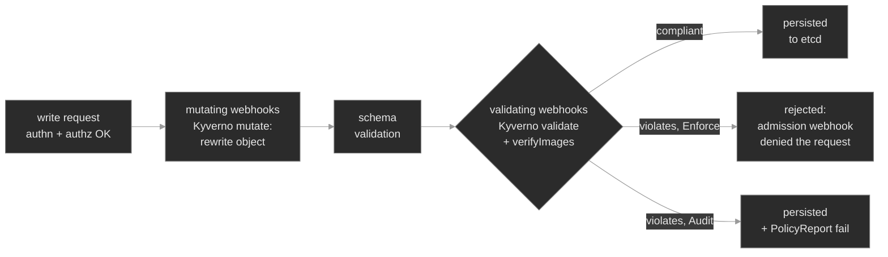

# `m20-kyverno-opa/`

## Concept

## M20 — Policy as Code: Kyverno & OPA Gatekeeper

> One more gate on every write to the API server — a policy engine that runs your organization's rules as admission webhooks: rejecting non-compliant objects, silently rewriting them to a safe default, and refusing images you didn't sanction — plus the handful of ways each of those goes wrong.

### What you'll learn

- Place a policy engine in the request pipeline: it plugs in as **admission webhooks** — mutating first, then validating — after RBAC has said yes and before the object is persisted
- Read a Kyverno **ClusterPolicy** the way you read a Role: `match` (which objects), the rule type (`validate` / `mutate` / `verifyImages`), and the `failureAction` (`Enforce` rejects, `Audit` only reports)
- Recognize a **validation rejection** — the `admission webhook … denied the request` message, which policy and rule failed, and *where* it lands (at `kubectl apply`, or on the ReplicaSet for a controller-created Pod)
- Understand a **mutation** as an admission-time rewrite: the stored object differs from the YAML you applied, and — the trap — the rewrite never touches Pods already running
- Gate images at admission: restrict registries, forbid the `latest` tag, and verify **cosign signatures** with `verifyImages` — the supply-chain half of "what may run here"
- Tell Kyverno from **OPA Gatekeeper** — the two CNCF engines — and why one writes policies in YAML and the other in Rego
- Reason about the engine's own failure modes: **autogen** deciding where a denial surfaces, and `failurePolicy` deciding whether an unreachable webhook fails open or closed

### Why it matters

RBAC (M10) answers *may this identity make this call*. It cannot answer *is this a good object*. Nothing in stock Kubernetes stops a team from shipping a Pod with no resource limits, a `latest` tag that silently changes under them, a `hostPath` into the node's root filesystem, or an image from a registry no one vetted. Those aren't authorization questions — the identity is allowed to create Pods. They're *policy* questions, and the place to enforce a policy on an object's *content* is admission, the last gate before it's written.

A policy engine puts those rules in the gate as code instead of in a wiki no one reads. At Polyphone the platform team encodes them once — every tenant workload must declare limits, carry an owner label, pin its image tag, come from the approved registry — and the API server enforces them on every deploy, in every namespace, without a human in the loop. That is leverage, and a new way for things to break, because the failure no longer lives in your workload. A Deployment sits at `0/3` for a policy you didn't write. An image that built fine yesterday is rejected today. A field you never set appears in your running Pod. And the sharpest: the engine itself goes unhealthy, and on one line of webhook config, either policies quietly stop enforcing or *every deploy in the cluster* fails. An SRE reads these as policy events, not workload bugs.

### Scope

**Covers:** the policy-as-code model on top of Kubernetes admission — a policy engine as dynamic **admission webhooks**; **Kyverno** as the primary engine (its `ClusterPolicy`/`Policy` CRDs, `match`/`exclude` selectors, and the three rule types worked here: **validate**, **mutate**, **verifyImages**); `failureAction` `Enforce` vs `Audit` and the **PolicyReport** audit writes; **autogen** for pod controllers and how it decides where a rejection surfaces; image admission end to end (registry allow-lists, tag discipline, cosign signatures); and a working comparison to **OPA Gatekeeper** (Rego, `ConstraintTemplate` + `Constraint`). Throughout: the `admission webhook denied` signature and the path from it back to the offending rule.

**Doesn't cover:** the raw `ValidatingWebhookConfiguration` / `MutatingWebhookConfiguration` machinery, webhook ordering, reinvocation, and timeout tuning — the mechanism *beneath* a policy engine → M21; writing non-trivial Rego and OPA outside Kubernetes; Kyverno's `generate` rules and `mutateExisting`/`cleanup`, named where they intersect but not worked; the built-in **PodSecurity** admission controller and RBAC → M10 (a policy engine is the *general* form of what PodSecurity does for one fixed ruleset); and image *build/scan* provenance → M02.

**Assumes:** M10 is load-bearing — the three-gate request pipeline (authn → authz → admission), that admission is the write-only gate that inspects the object, and that an admission rejection of a controller-created Pod surfaces on the ReplicaSet (a Deployment at `0/N` with no Pods). M01 (Deployments create ReplicaSets create Pods) and M06 (requests/limits and QoS) are the substance the example policies check. M02's registries and image references are what the image rules gate.

### Vocabulary

| Term | Definition |
|------|------------|
| **admission** | The write-only gate after authentication and authorization where controllers inspect an object and may reject or modify it before it is persisted. Where policy-as-code plugs in. |
| **admission webhook** | An external HTTPS endpoint the API server calls during admission. **Mutating** webhooks (can change the object) run first; **validating** webhooks (accept or reject only) run after<sup><a href="https://kubernetes.io/docs/reference/access-authn-authz/extensible-admission-controllers/">[2]</a></sup>. A policy engine registers as both. |
| **policy engine** | A controller that reads high-level policy objects and enforces them as admission webhooks. Kyverno and OPA Gatekeeper are the two CNCF ones. |
| **Kyverno** | A Kubernetes-native policy engine: policies are Kubernetes YAML, no separate language<sup><a href="https://kyverno.io/docs/introduction/">[1]</a></sup>. Installed<sup><a href="https://kyverno.io/docs/installation/">[11]</a></sup> into the `kyverno` namespace as an admission controller plus background, reports, and cleanup controllers. |
| **ClusterPolicy / Policy** | Kyverno's policy CRDs. A **ClusterPolicy** is cluster-scoped; a **Policy** is namespaced. Each holds a list of **rules**. |
| **rule** | One unit of policy: a `match` (and optional `exclude`) selecting objects, plus exactly one action — `validate`, `mutate`, `generate`, or `verifyImages`. |
| **validate** | A rule that *checks* an object against a `pattern` (or CEL/deny condition) and, on failure, rejects it or records a violation<sup><a href="https://kyverno.io/docs/policy-types/cluster-policy/validate/">[3]</a></sup>. |
| **failureAction** | Per validate rule (`spec.rules[].validate.failureAction`): **`Enforce`** blocks a violation; **`Audit`** admits it and records a PolicyReport. (Older policies set `spec.validationFailureAction` once — same values, deprecated.) |
| **mutate** | A rule that *rewrites* the object at admission — adds a label, injects a sidecar, sets a field — so the stored object differs from what was submitted<sup><a href="https://kyverno.io/docs/policy-types/cluster-policy/mutate/">[4]</a></sup>. |
| **verifyImages** | A rule that checks image signatures/attestations (cosign, sigstore) before admitting a Pod, and can pin the image to its digest<sup><a href="https://kyverno.io/docs/policy-types/cluster-policy/verify-images/">[5]</a></sup>. |
| **autogen** | Kyverno auto-generating, from a rule matching `Pod`, sibling rules matching pod *controllers* (Deployment, Job, …) so the same rule guards the controller<sup><a href="https://kyverno.io/docs/policy-types/cluster-policy/autogen/">[6]</a></sup>. Decides whether a violating Deployment is rejected at `apply` or its Pods on the ReplicaSet. |
| **PolicyReport** | A CRD holding pass/fail results per resource — the audit trail for `Audit` rules and background scans<sup><a href="https://kyverno.io/docs/policy-reports/">[7]</a></sup>. |
| **failurePolicy** | Webhook setting for when the engine is *unreachable*: **`Fail`** (deny — fail closed) or **`Ignore`** (admit — fail open). |
| **OPA Gatekeeper** | The other CNCF engine: policies in **Rego** inside a **`ConstraintTemplate`**, instantiated by a **`Constraint`**<sup><a href="https://open-policy-agent.github.io/gatekeeper/website/docs/">[8]</a></sup>. |
| **Rego** | Open Policy Agent's declarative query language for policy. Gatekeeper's language; Kyverno uses none. |

### Mental model

You already know the three gates a request crosses (M10): **authentication** (who), **authorization** (may they), **admission** (is this object allowed). A policy engine lives entirely in that third gate. RBAC has already said yes by the time it runs; it inspects the *object* and decides whether this specific YAML is acceptable, rejecting or fixing it if not<sup><a href="https://kubernetes.io/docs/reference/access-authn-authz/admission-controllers/">[9]</a></sup>.

Admission has an order, and it matters. For a write, the API server calls **mutating** webhooks first — each may change the object — then validates against the schema, then calls **validating** webhooks, which may only accept or reject<sup><a href="https://kubernetes.io/docs/reference/access-authn-authz/extensible-admission-controllers/">[2]</a></sup>. A policy engine registers on both sides: `mutate` rules run in the mutating phase, `validate` and `verifyImages` in the validating phase. So mutation happens *before* validation — a default a mutate rule injects is present by the time a validate rule checks for it.



The engine reads its rules from policy objects you apply — for Kyverno, `ClusterPolicy` and `Policy` resources<sup><a href="https://kyverno.io/docs/introduction/">[1]</a></sup>. Kyverno *dynamically* registers the matching webhooks, so it only intercepts the kinds and namespaces some policy actually cares about — a policy matching only Pods in `tenant-apps` doesn't put the engine in the path of anything else. That scoping is what keeps it from being a single point of failure for the whole API.

Two decisions define what a rule *does*. First the rule type — `validate` (check, maybe reject), `mutate` (rewrite), `verifyImages` (check signatures). Second, for validate, `failureAction`: **`Enforce`** turns a violation into a hard rejection (`admission webhook "validate.kyverno.svc-fail" denied the request: …`); **`Audit`** admits the object and records the violation in a PolicyReport<sup><a href="https://kyverno.io/docs/policy-types/cluster-policy/validate/">[3]</a></sup>. Same `enforce`/`audit` split PodSecurity gave you in M10, generalized from one built-in ruleset to any rule you can write — and the safe rollout is identical: land as `Audit`, read the reports for what *would* break, then flip to `Enforce`.

The reflex to build: `admission webhook denied` is not your workload misbehaving. RBAC let the request in; a policy rejected the object. The message names the webhook, the policy, and the rule — read those, then read the rule's `match` and its check against your object. The fix is to make the object comply or to correct the policy, and the message tells you which.

### Concept walkthrough

#### Validation: rejecting the non-compliant

A validate rule is the workhorse: a `match` that selects objects and a check they must satisfy<sup><a href="https://kyverno.io/docs/policy-types/cluster-policy/validate/">[3]</a></sup>. The simplest check is a `pattern` — a partial object the target must match, `'?*'` meaning "any non-empty value." The platform's rule forcing every tenant Pod to declare limits:

```yaml
apiVersion: kyverno.io/v1
kind: ClusterPolicy
metadata:
  name: require-resource-limits
spec:
  rules:
    - name: require-limits
      match:
        any:
          - resources:
              kinds: [Pod]
              namespaces: [tenant-apps]      # scope: this rule governs only tenant-apps
      validate:
        failureAction: Enforce               # block violations (vs Audit = report only)
        message: "CPU and memory limits are required."
        pattern:
          spec:
            containers:
              - name: "*"
                resources:
                  limits:
                    memory: "?*"             # every container must set memory limit
                    cpu: "?*"
```

Apply a Pod in `tenant-apps` with no limits and the API server returns the denial; comply and it admits. Two things about that denial matter. First, its shape: `admission webhook "validate.kyverno.svc-fail" denied the request: … blocked due to the following policies … require-resource-limits: require-limits: 'validation error: CPU and memory limits are required. …'`. The webhook, the policy, the rule, and your message — everything you need to find the rule is in the string, exactly as M10's `Forbidden` named the identity, verb, resource, and scope.

Second, *where* it lands, which depends on **autogen**. By default a rule matching `Pod` makes Kyverno auto-generate sibling rules matching pod controllers, so the same requirement is checked on the controller too<sup><a href="https://kyverno.io/docs/policy-types/cluster-policy/autogen/">[6]</a></sup>. With autogen on (default), a non-compliant Deployment is rejected the instant you `kubectl apply` it — it never gets created, and `kubectl`/CI shows the error directly. Disable autogen (annotation `pod-policies.kyverno.io/autogen-controllers: none`) and the policy only guards bare `Pod` creates: the Deployment is admitted, but the rejection surfaces when its *ReplicaSet* tries to create the Pod — stuck at `0/N`, no Pods, the denial on a `FailedCreate` event on the ReplicaSet. That's the M10 PodSecurity signature — the one to recognize when a rollout stalls with no Pod to describe. Same policy, two very different failures, one annotation.

<details>
<summary>📖 Going deeper: patterns, CEL, and reading a PolicyReport<sup><a href="https://kyverno.io/docs/policy-reports/">[7]</a></sup></summary>

`pattern` matching is the readable default, but validate rules also take a `deny` block with `conditions` ("reject when …") and **CEL** expressions (`validate.cel`, the language Kubernetes' built-in ValidatingAdmissionPolicy uses) for logic a pattern can't express. Reach for `pattern` first — it's what most policies need.

`Audit` rules don't reject, so their output lives in **PolicyReports** — one per namespace (plus a cluster-wide `ClusterPolicyReport`), a result per resource-per-rule:

```bash
kubectl get policyreport -A                     # PASS / FAIL / WARN counts per namespace
kubectl get policyreport -n tenant-apps -o yaml # which resource failed which rule, and why
```

That's both the audit trail and the rollout tool: apply new policy as `Audit`, let the background controller scan, then read the reports to see what `Enforce` would reject before you flip the switch.

</details>

#### Mutation: rewriting at admission

A mutate rule changes the object on its way in<sup><a href="https://kyverno.io/docs/policy-types/cluster-policy/mutate/">[4]</a></sup>. The platform uses it to supply defaults authors can't forget — here, an `owner` label used downstream for cost attribution and on-call routing:

```yaml
apiVersion: kyverno.io/v1
kind: ClusterPolicy
metadata:
  name: add-owner-label
spec:
  rules:
    - name: add-owner
      match:
        any:
          - resources:
              kinds: [Pod]
              namespaces: [tenant-apps]
      mutate:
        patchStrategicMerge:
          metadata:
            labels:
              +(owner): platform          # +() = add only if absent; don't overwrite
```

The consequence that defines mutation: **the stored object is not the one you submitted.** `kubectl get pod -o yaml` shows an `owner` label no one wrote. That's a feature — safe defaults enforced centrally — and a trap: when a field doesn't match the YAML on disk, a mutate policy is the suspect, and `kubectl get clusterpolicy` plus reading each `mutate` block tells you which touched it.

The load-bearing fact is *when* mutation runs: **at admission, and only at admission.** A mutate rule fires on create and update — the moments the object passes through the webhook — and does nothing to Pods already running, nor to a Pod its `match` doesn't select. So a missing injected default has two causes that look identical from the Pod: either the policy didn't `match` it (wrong `kinds`, a typo'd namespace, so the Pod was never a candidate), or the policy is correct but the Pod was admitted *before* the policy existed. The first is fixed by correcting the `match`; the second by triggering fresh admission — `kubectl rollout restart deployment/<name>` creates new Pods that pass the webhook and get mutated. Fixing the policy alone never retro-fixes running Pods. (Kyverno's `mutateExisting` can patch existing resources, but that's a separate background path, not the admission rewrite.)

#### Image admission: what is allowed to run here

The last family gates *images* — the supply-chain question — at three levels, cheapest to strongest:

- **Tag discipline.** Forbid the mutable `latest` tag (and bare tags, which default to it): `latest` means "whatever was pushed most recently," so the image under a running Pod can change with no manifest change — reproducibility gone, a classic supply-chain foothold. A `disallow-latest-tag` validate rule rejects any image ending in `:latest` or carrying no tag, forcing a pinned version.
- **Registry allow-lists.** Require every image to come from an approved registry — `registry.polyphone.example/*` — so a typo'd or malicious public image (`docker.io/somebody/nginx`) is rejected at admission rather than pulled and run. Also a validate rule, on the registry prefix of `image`.
- **Signature verification.** The strongest: prove the image was signed by a key you trust before it runs. That's `verifyImages`<sup><a href="https://kyverno.io/docs/policy-types/cluster-policy/verify-images/">[5]</a></sup> — what the curriculum means by "signed-image admission," refusing any image not cryptographically attested.

All three answer *is this image allowed to run here* at the one place you can still say no cheaply, before the image is ever pulled onto a node.

<details>
<summary>📖 Going deeper: signed images with cosign and <code>verifyImages</code><sup><a href="https://docs.sigstore.dev/">[10]</a></sup></summary>

Image signing closes the gap tag-pinning leaves: even a pinned digest says "this specific image," not "an image *we* approved." **cosign** (from the sigstore project) signs an image and stores the signature in the registry beside it; verification checks it against a public key or a keyless OIDC identity in a public transparency log<sup><a href="https://docs.sigstore.dev/">[10]</a></sup>. A `verifyImages` rule puts that check at admission:

```yaml
      verifyImages:
        - imageReferences:
            - "registry.polyphone.example/*"
          mutateDigest: true              # pin the verified image to its digest
          attestors:
            - entries:
                - keys:
                    publicKeys: |-
                      -----BEGIN PUBLIC KEY-----
                      ...platform signing key...
                      -----END PUBLIC KEY-----
```

At admission Kyverno resolves each matching image, fetches its signature, and verifies it against the `attestors`. Unsigned or wrong-key images are rejected; verified ones are admitted and, with `mutateDigest`, pinned from a mutable tag to the exact `@sha256:…` digest verified — so what runs is provably what was checked. It's the difference between "only images from our registry" (anyone who can push passes) and "only images our pipeline signed" (a compromised registry push still fails).

</details>

#### Two engines: Kyverno and OPA Gatekeeper

Kyverno is one of two CNCF policy engines; the other is **OPA Gatekeeper**, and the difference is where the policy logic lives. Kyverno policies *are* Kubernetes resources — YAML, matched and patterned like every other manifest, which is why a `ClusterPolicy` reads like the objects it governs<sup><a href="https://kyverno.io/docs/introduction/">[1]</a></sup>. Gatekeeper integrates **Open Policy Agent**, and its policies are written in **Rego**, OPA's query language, in a two-part model<sup><a href="https://open-policy-agent.github.io/gatekeeper/website/docs/">[8]</a></sup>: a **`ConstraintTemplate`** defines the rule *logic* in Rego (and a new CRD kind), and a **`Constraint`** instance *applies* it with parameters and a match scope. Write the Rego once, instantiate it many times.

| | Kyverno | OPA Gatekeeper |
|---|---|---|
| Policy language | Kubernetes YAML (patterns, CEL) | Rego (in a ConstraintTemplate) |
| Model | `ClusterPolicy` / `Policy` with rules | `ConstraintTemplate` (logic) + `Constraint` (instance) |
| Mutation | Yes (`mutate` rules) | Yes (separate mutation resources) |
| Image verification | Built in (`verifyImages`) | Via external data / Rego |
| Learning curve | Low — no new language | Higher — learn Rego |

Neither is "correct." Kyverno's YAML reads well for the common cases (require, default, restrict), which is why this module uses it hands-on; Gatekeeper's Rego is more expressive and the incumbent in many established platforms. The concepts transfer: both are admission webhooks, both split enforce-vs-audit (Gatekeeper calls it `enforcementAction`), both surface the same `denied the request` errors. Learn one and you can read the other.

### Hands-on

Four steps in the baseline, three break/fix scenarios — all on the full Polyphone fleet, plus a `tenant-apps` namespace the platform governs with policy. The baseline installs Kyverno and applies a healthy policy set (a validate, a mutate, an image rule) scoped to `tenant-apps`, then deploys a compliant workload so you see admission, mutation, and image-gating working before the differential breaks them.

- **`baseline/`** — Kyverno as admission webhooks; three `ClusterPolicy` objects scoped to `tenant-apps`; a compliant `tenant-web` that's admitted, gets its `owner` label injected, and passes the image rule. What "governed, compliant" looks like.
- **`breakfix-01-require-limits-rejected/`** — a Deployment stuck at `0/N`, no Pods: no resource limits, rejected by the `Enforce` validate rule at the ReplicaSet. Tests reading a Kyverno denial and fixing the *workload* to comply.
- **`breakfix-02-mutation-not-applied/`** — a workload that runs fine but lacks its injected `owner` label. The mutate policy's `match` names the wrong namespace, so it never selected the Pods. Tests spotting a mutation gap, fixing the *policy*, and re-admitting to apply it.
- **`breakfix-03-image-tag-rejected/`** — another `0/N` Deployment: an image pinned to `:latest`, rejected by the image policy. Tests reading the image-rule denial and pinning the tag.

The first and third share the `admission denied → 0 Pods` signature but differ in the rule and the fix (a field vs the image); the second flips it — the object is admitted, and the *absence* of a mutation is the tell. Check yourself against `ANSWER-KEY.md` after each.

### Common failure modes

| Symptom | Likely cause | Where to look |
|---------|--------------|---------------|
| `kubectl apply` fails: `admission webhook "validate.kyverno…" denied the request` | A validate rule (`Enforce`) rejected the object; autogen caught it at the controller | the message names policy + rule; `kubectl get clusterpolicy`; read that rule's `validate` |
| Deployment `0/N`, no Pods, no `Pending` Pod | An `Enforce` policy with autogen off rejects Pods at the ReplicaSet | `kubectl describe rs <name>` / events for `FailedCreate` + the denial; the policy's rule |
| A field in the running Pod doesn't match the manifest | A `mutate` rule rewrote it at admission | `kubectl get clusterpolicy`; read each `mutate` block; `kubectl get pod -o yaml` |
| Expected injected default is missing on a Pod | Mutate rule's `match` didn't select it, or the Pod predates the policy | the rule's `match` (kinds/namespaces) vs the Pod; `rollout restart` to re-admit |
| Image rejected: `… failed to verify` / registry or tag denied | An image rule (`verifyImages`, registry allow-list, or `disallow-latest-tag`) blocked it | the policy's `verifyImages`/`validate`; the Pod's `image` (tag, registry, signature) |
| **Every** create/update in scope suddenly fails, engine looks unhealthy | Webhook `failurePolicy: Fail` + the engine is unreachable → fail closed | `kubectl get pods -n kyverno`; the webhook's `failurePolicy`; engine logs/health |
| Policy applied, nothing enforced | Policy is `Audit`, its `match` selects nothing, or the webhook isn't registered yet | `failureAction`; the `match`; `kubectl get validatingwebhookconfiguration` |

### Recap

- **A policy engine is admission-as-code.** It plugs into the third gate — after RBAC — as mutating and validating webhooks judging an object's *content*. `admission webhook denied` is a policy event, not a workload bug; the message names the policy and rule, and that's where the fix is.
- **Validate rejects or audits; the split is the safe-rollout tool.** `Enforce` blocks, `Audit` records a PolicyReport. Land as `Audit`, read the reports for what would break, then flip to `Enforce` — the PodSecurity rollout from M10, generalized.
- **Autogen decides where a rejection surfaces.** On (default), a violating Deployment is rejected at `kubectl apply`; off, it's admitted and its Pods fail on the ReplicaSet — a `0/N` with nothing to describe. Same policy, two signatures.
- **Mutation happens only at admission.** The stored object differs from the submitted one; a missing injected default means the rule didn't match *or* the Pod predates it. Fix the policy, then re-admit (`rollout restart`) — correcting it never retro-fixes running Pods.
- **Image admission is the supply-chain gate.** Pin tags, allow-list registries, verify signatures (`verifyImages`/cosign) at the one place you can refuse an image before it's pulled. Signatures are the strongest form — "an image *we* signed," not just "from our registry."
- **The engine has its own blast radius.** `failurePolicy: Fail` makes an unreachable webhook fail *closed* — secure, but a down engine blocks every deploy in scope. `Ignore` fails open — deploys flow, unpoliced. Know which your cluster runs.

### Production thinking

- You're rolling out `require-resource-limits` across a cluster of hundreds of workloads, many without limits. Applying it as `Enforce` would reject the next deploy of every non-compliant one. What's the sequence — audit mode, PolicyReports, `failureActionOverrides` per namespace — that finds and fixes violations before any becomes a failed 3am rollout?
- Your engine's admission Pods go unready during a node drain. With `failurePolicy: Fail`, what happens to every deploy in scope during that window — and with `Ignore`, what happens to your security posture instead? Which would you pick for a *validating* image-signature webhook versus a *mutating* label-injection one, and why aren't they the same answer?
- A developer swears their Pod's YAML is correct, but the running Pod has an extra sidecar and a label they never wrote, and behaves differently in `tenant-apps` than in their own namespace. What one class of object explains all of it — and what does that say about reading the *live* object with `kubectl get -o yaml` rather than the manifest on disk?

### References

1. Kyverno — Introduction: https://kyverno.io/docs/introduction/
2. Kubernetes — Dynamic Admission Control (admission webhooks): https://kubernetes.io/docs/reference/access-authn-authz/extensible-admission-controllers/
3. Kyverno — Validate Rules: https://kyverno.io/docs/policy-types/cluster-policy/validate/
4. Kyverno — Mutate Rules: https://kyverno.io/docs/policy-types/cluster-policy/mutate/
5. Kyverno — Verify Images: https://kyverno.io/docs/policy-types/cluster-policy/verify-images/
6. Kyverno — Auto-Gen Rules for Pod Controllers: https://kyverno.io/docs/policy-types/cluster-policy/autogen/
7. Kyverno — Policy Reports: https://kyverno.io/docs/policy-reports/
8. OPA Gatekeeper — Documentation: https://open-policy-agent.github.io/gatekeeper/website/docs/
9. Kubernetes — Admission Controllers Reference: https://kubernetes.io/docs/reference/access-authn-authz/admission-controllers/
10. Sigstore — Documentation (cosign): https://docs.sigstore.dev/
11. Kyverno — Installation: https://kyverno.io/docs/installation/


---

## Break/Fix Practice

## Break/fix 01 — Validation rejects a rollout

**Symptom — what you'd actually see:**

`billing-api` in `tenant-apps` is `0/1` with **no Pods at all** — not `Pending`, not `ImagePullBackOff`, nothing to `logs` or `describe` at the Pod level. The Deployment and ReplicaSet exist; the Pod count is zero.

**Think about this before you open the answer:**

Reading a Kyverno denial and recognizing an admission rejection of controller-created Pods. Self-grading questions:

- Did you look at the **ReplicaSet's events** (where the reason lives) rather than hunting for a Pod that doesn't exist?
- Did you read the denial for the **policy and rule name**, instead of assuming a scheduling or image problem?
- Did you fix the **workload** to comply, understanding the policy was doing its job — not disable or delete the policy?

<details>
<summary><b>Click to reveal: diagnostic commands, root cause, exact fix, verify</b></summary>

**Root cause:**

`require-resource-limits` is a Kyverno validate `ClusterPolicy` with `failureAction: Enforce`<sup><a href="https://kyverno.io/docs/policy-types/cluster-policy/validate/">[1]</a></sup>, scoped to `tenant-apps`, requiring every container to set CPU and memory `limits`. `billing-api` declares only `requests`. Because the policy disables autogen<sup><a href="https://kyverno.io/docs/policy-types/cluster-policy/autogen/">[3]</a></sup>, it guards bare `Pod` creates, so the Deployment is admitted but every Pod its ReplicaSet tries to create is rejected at admission — the `0/N`-no-Pods signature M10 taught for PodSecurity. The image is `nginx:1.25`, so `disallow-latest-tag` is satisfied; the only violation is the missing limits.

**Diagnostic commands (run in this order):**

```bash
# 1. No Pods, and the reason is on the ReplicaSet, not a Pod
kubectl get deploy,rs,pods -n tenant-apps -l app=billing-api        # deploy 0/1, rs CURRENT 0, no pods
kubectl describe rs -n tenant-apps -l app=billing-api | sed -n '/Events/,$p'
#    Error creating: admission webhook "validate.kyverno.svc-fail" denied the request:
#    ... require-resource-limits ... "Resource limits (cpu and memory) are required ..."

# 2. Read the rule against the workload
kubectl get clusterpolicy require-resource-limits -o yaml | grep -A15 'rules:'   # requires limits.cpu/memory
kubectl get deploy billing-api -n tenant-apps \
  -o jsonpath='{.spec.template.spec.containers[0].resources}' ; echo             # requests only, no limits
```

**Exact fix:**

Make the workload comply — add the `limits` the rule requires (the policy is correct):

```bash
kubectl patch deployment billing-api -n tenant-apps --type=json -p '[
  {"op":"add","path":"/spec/template/spec/containers/0/resources/limits",
   "value":{"cpu":"100m","memory":"64Mi"}}]'
```

**Verify:**

```bash
kubectl rollout status deployment/billing-api -n tenant-apps --timeout=60s
kubectl get pods -n tenant-apps -l app=billing-api                  # 1/1 Running
```

**Production thinking:**

This is what a new compliance policy does the first time it meets a non-compliant workload. Roll such policies out as `Audit` first<sup><a href="https://kyverno.io/docs/policy-reports/">[4]</a></sup> — read the PolicyReports to see what *would* be rejected — then flip to `Enforce`, so you find violations in a report instead of in a failed rollout. And note autogen: with it on (the default), this same violation is rejected at `kubectl apply`, which is friendlier for CI but leaves no object to inspect.

</details>

---

## Break/fix 02 — A mutation that never fired

**Symptom — what you'd actually see:**

`tenant-portal` in `tenant-apps` is `1/1` and healthy, but its Pod has no `owner` label — the one the platform's `mutate` policy is supposed to inject on every tenant Pod. Nothing was rejected, nothing logs an error; the failure is an *absence*.

**Think about this before you open the answer:**

Recognizing a mutation gap and the admission-time-only rule. Self-grading questions:

- Did you treat the **absence** of a field as the symptom, rather than looking for a crash or a rejection that isn't there?
- Did you read the policy's `match` and spot that it selected the **wrong namespace**, fixing the *policy* (not the workload)?
- Did you know that correcting the policy **doesn't** retro-fix the running Pod, and `rollout restart` to re-admit it? (Just fixing the policy and re-checking would show the label still missing.)

<details>
<summary><b>Click to reveal: diagnostic commands, root cause, exact fix, verify</b></summary>

**Root cause:**

`add-owner-label` is a Kyverno `mutate` policy that injects `owner=platform` when absent<sup><a href="https://kyverno.io/docs/policy-types/cluster-policy/mutate/">[2]</a></sup>. Its rule `match` names `namespaces: [tenant-app]` — a typo; the real namespace is `tenant-apps`. The selector matches nothing, so the rule never fired on `tenant-portal`'s Pods. A mutation that doesn't match simply does nothing — no error surfaces, which is why the policy *looks* fine.

**Diagnostic commands (run in this order):**

```bash
# 1. Healthy Pod, missing label
kubectl get pods -n tenant-apps -L owner                    # tenant-portal Running, OWNER empty
kubectl get clusterpolicy add-owner-label                   # READY: true — the engine is fine

# 2. Read the rule's match against the Pod's actual namespace
kubectl get clusterpolicy add-owner-label -o yaml | grep -A10 'match:'   # namespaces: [tenant-app]
kubectl get pod -n tenant-apps -l app=tenant-portal \
  -o jsonpath='{.items[0].metadata.namespace}' ; echo                    # tenant-apps  (the 's' is missing above)
```

**Exact fix:**

Correct the policy's `match` namespace, **then re-admit** the Pod — mutation happens only at admission, so fixing the policy alone doesn't relabel a running Pod:

```bash
# correct the namespace (re-apply the policy with namespaces: [tenant-apps]), then:
kubectl rollout restart deployment/tenant-portal -n tenant-apps
kubectl rollout status  deployment/tenant-portal -n tenant-apps --timeout=60s
```

**Verify:**

```bash
kubectl get pods -n tenant-apps -L owner                    # tenant-portal's new Pod now shows owner=platform
```

**Production thinking:**

Silent mutation gaps are the dangerous kind — a defaulting policy that quietly stops applying (a typo, a `match` narrowed in a refactor) leaves workloads missing a guardrail with no alarm. Alert on the *outcome* (e.g. tenant Pods lacking `owner`) rather than trusting the policy to be `READY`. And treat "does anything already running need re-admitting?" as part of every mutate-policy change — Kyverno's `mutateExisting` exists precisely because the admission rewrite doesn't reach live resources.

</details>

---

## Break/fix 03 — Image admission rejects the tag

**Symptom — what you'd actually see:**

`call-recorder` in `tenant-apps` is `0/1` with no Pods — the same shape as breakfix-01. Deployment and ReplicaSet exist; zero Pods; the reason is on the ReplicaSet.

**Think about this before you open the answer:**

Telling an image rejection from a limits rejection (both `0/N`), and reading the image rule. Self-grading questions:

- Did the **policy name in the denial** (`disallow-latest-tag`, not `require-resource-limits`) tell you it was the image, so you inspected the tag rather than the resources?
- Did you pin to an **explicit tag** rather than trying to weaken or exclude the policy?
- Did you notice the limits were fine, so you didn't waste time on a resources fix?

<details>
<summary><b>Click to reveal: diagnostic commands, root cause, exact fix, verify</b></summary>

**Root cause:**

`disallow-latest-tag` is a Kyverno validate `ClusterPolicy` (`Enforce`, autogen off) that refuses any container image matching `*:latest`. `call-recorder` is pinned to `nginx:latest`, so every Pod its ReplicaSet creates is rejected at admission. It declares `limits`, so `require-resource-limits` passes — the only violation is the mutable tag. The denial names `disallow-latest-tag`, which is how you tell this apart from breakfix-01 at a glance. (This is the practical, always-available rung of image admission; the strongest rung is cosign signature verification via `verifyImages`<sup><a href="https://kyverno.io/docs/policy-types/cluster-policy/verify-images/">[5]</a></sup>.)

**Diagnostic commands (run in this order):**

```bash
# 1. Same 0/N-no-Pods shape; read which policy the denial names
kubectl get deploy,rs,pods -n tenant-apps -l app=call-recorder
kubectl describe rs -n tenant-apps -l app=call-recorder | sed -n '/Events/,$p'
#    ... admission webhook ... denied the request: ... disallow-latest-tag ... :latest ...

# 2. Read the offending image against the rule
kubectl get deploy call-recorder -n tenant-apps \
  -o jsonpath='{.spec.template.spec.containers[0].image}' ; echo        # nginx:latest
kubectl get clusterpolicy disallow-latest-tag -o yaml | grep -A6 'validate:'   # image: "!*:latest"
```

**Exact fix:**

Pin the image to an explicit, non-`latest` tag:

```bash
kubectl set image deployment/call-recorder app=nginx:1.25 -n tenant-apps
```

**Verify:**

```bash
kubectl rollout status deployment/call-recorder -n tenant-apps --timeout=60s
kubectl get pods -n tenant-apps -l app=call-recorder               # 1/1 Running on nginx:1.25
```

**Production thinking:**

`:latest` ships when a manifest is copied or a quick fix skips pinning, and it's a real supply-chain risk — the image under a running Pod can change with no manifest change. Pinning a tag is the floor; a digest (`@sha256:…`) is stronger, and `verifyImages` with cosign is strongest — it proves the image was signed by a key you trust, not merely that it came from somewhere. Enforce image policy at admission because it's the one place you can refuse an image *before* it's pulled onto a node.

</details>

---
