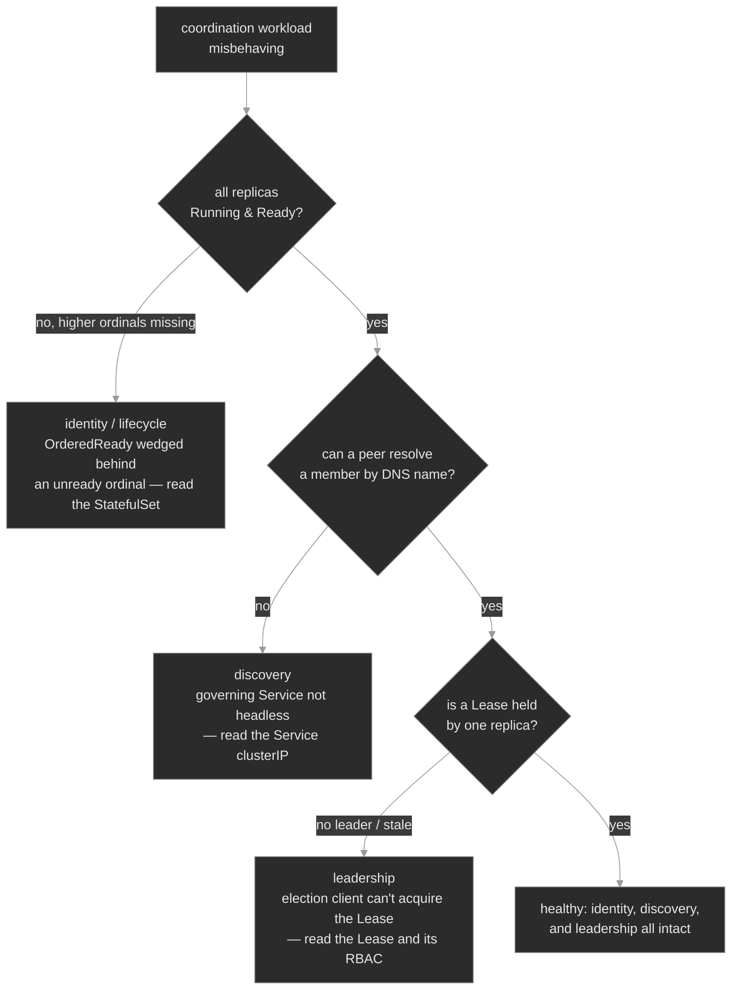

# `m24-stateful-coordination/`

## Concept

## M24 — Stateful Coordination: Identity, Discovery & Leadership

> How a set of Pods stops being interchangeable and becomes a coordinated cluster — stable identity, per-Pod DNS for discovery, an ordered lifecycle, and a Lease-based leader — and the three links on that path that break while every Pod still looks healthy.

### What you'll learn

- Explain why some workloads can't be stateless herds: they need **stable identity** (a member that stays itself across restarts), **direct addressing** (reach one specific member, not a load-balanced VIP), and **coordinated leadership** (exactly one member does the singleton work)
- Read a **StatefulSet**'s ordinal identity (`session-cache-0/1/2`) and its per-Pod `volumeClaimTemplates` storage — the persistent cache that follows an identity, not a Pod
- Use a **headless Service** (`clusterIP: None`) and the per-Pod DNS names it publishes (`pod.service.namespace.svc.cluster.local`) to let peers discover and address each other
- Reason about the **`OrderedReady`** lifecycle — why members come up one at a time, and why an unready low ordinal halts every higher one
- Read a **`coordination.k8s.io` Lease** as a distributed lock: `holderIdentity`, `renewTime`, `leaseDurationSeconds`, and the RBAC an election client needs to acquire and renew it
- Split a misbehaving coordination workload three ways — identity/lifecycle, discovery, or leadership — and know which object to read for each

### Why it matters

Most of Kubernetes is built to make Pods interchangeable. A Deployment behind a Service is a herd: any replica answers, a Pod that dies is replaced by an equivalent one with a new name and a fresh empty filesystem, and a single VIP hides which replica you actually reached. That design is why stateless services scale and heal so easily, and it's exactly wrong for a class of workloads Polyphone depends on.

A replicated session cache has to let a peer address *one specific member* to find the session it owns. A database's replicas have to know which one is the primary. A router that writes the authoritative call-routing table must guarantee that *exactly one* instance writes it at a time — two writers is a split-brain incident, not a scaling event. These workloads need **coordination**: members that keep a stable identity, can find and address each other directly, come up in a known order, and agree on who leads.

Kubernetes provides the primitives — StatefulSets for identity and ordered lifecycle, headless Services for peer discovery, Leases for leadership — and the failures they produce share one cruel property: **the Pods often look fine.** The set is wedged with two-thirds of its members simply never created; peers can't resolve each other while every Pod is `Running`; a leaderless singleton sits idle with both replicas healthy. An SRE who reaches for `kubectl logs` and Pod restarts on these will lose an hour, because nothing crashed. The diagnosis lives in the *coordination* objects — the StatefulSet's ordinal status, the governing Service's `clusterIP`, the Lease's holder — not in the Pods.

### Scope

**Covers:** StatefulSet stable ordinal identity and the per-Pod persistent cache (`volumeClaimTemplates`); the `OrderedReady` vs `Parallel` pod management policies and the ordered-startup wedge; headless Services (`clusterIP: None`) and the per-Pod DNS records they publish for peer discovery, plus `publishNotReadyAddresses` for bootstrap; leader election via `coordination.k8s.io` Leases — `holderIdentity` / `renewTime` / `leaseDurationSeconds`, the acquire-renew-expire loop, the RBAC a leader-election client needs on `leases`, and split-brain / fencing at a concept level; and the identity-vs-discovery-vs-leadership differential for a misbehaving coordination workload.

**Doesn't cover:** the full StatefulSet and DaemonSet treatment — update strategies, `partition` rollouts, `podManagementPolicy` edge cases, DaemonSets — → M07, which owns the primitive; this module recaps only the ordinal-identity and `OrderedReady` leg the coordination differential turns on; PV/PVC binding, StorageClasses, and access-mode failures → M05 (the persistent cache stands on that storage; its storage-side breakages live there); the general RBAC model → M10 (the leader-election slice is the one piece here); operators and CRD controllers that *perform* the electing → M08; and application-level consensus internals — Raft, Paxos, etcd's quorum — beyond naming them. This module is the coordination layer Kubernetes gives you, not the distributed-systems theory underneath it.

**Assumes:** M00 (`get → describe → events`; spec vs status), M01 (Pods, Deployments, ReplicaSets, readiness probes), M04 (Services, ClusterIP, DNS names, Endpoints), M05 (PVCs and `volumeClaimTemplates`, glossed here), and M07 (StatefulSet ordinal identity, the `OrderedReady` lifecycle, and per-Pod storage — recapped here only as it bears on coordination). The M04 fact that a normal Service is one VIP fronting many Pods is the baseline the headless Service inverts.

### Vocabulary

| Term | Definition |
|------|------------|
| **StatefulSet** | A controller for Pods that need stable identity. Unlike a Deployment, it names its Pods by a fixed **ordinal index** (`-0`, `-1`, …), brings them up and down in order, and gives each its own persistent volume. |
| **ordinal identity** | The stable `<name>-<N>` a StatefulSet assigns each replica, counting from 0. `session-cache-0` is always the same logical member; a replacement Pod takes the same name. |
| **stable network identity** | The property that each StatefulSet Pod has a fixed DNS hostname that survives restarts, published through the governing headless Service. |
| **headless Service** | A Service with `clusterIP: None`. It has no virtual IP; instead cluster DNS returns the Pod IPs directly, and (for a StatefulSet's governing Service) publishes a per-Pod DNS name. |
| **governing Service / `serviceName`** | The headless Service a StatefulSet names in `spec.serviceName`. It's what wires up the per-Pod DNS records for that set's Pods. |
| **per-Pod DNS** | The record `<pod>.<service>.<namespace>.svc.cluster.local`, resolvable to one specific member — the address peers use to reach each other. Published only for a headless governing Service. |
| **`volumeClaimTemplates`** | A StatefulSet field that mints one PVC per Pod (`data-session-cache-0`, …), a durable per-member volume that follows the ordinal identity across reschedules. The workload's **persistent cache**. |
| **`podManagementPolicy`** | `OrderedReady` (default): create/remove Pods one ordinal at a time, each waiting for the previous to be Ready. `Parallel`: act on all Pods at once. |
| **Lease** | A small `coordination.k8s.io` object used as a distributed lock. Its holder renews it to keep the lock; if renewal stops, another party may claim it. Kubernetes' own components elect leaders this way. |
| **leader election** | The protocol by which replicas of a singleton agree on one active member, implemented as a race to acquire and renew a Lease. |
| **`holderIdentity` / `renewTime` / `leaseDurationSeconds`** | On a Lease: who currently holds the lock, when they last proved liveness, and how long the lock stays valid without a renewal. |
| **split-brain** | Two members both believing they lead, each doing singleton work — the failure leader election exists to prevent. |
| **`publishNotReadyAddresses`** | A headless-Service field that publishes DNS for not-yet-Ready Pods too, so peers can find each other during cluster bootstrap. |

### Mental model

A coordinated workload stands on three primitives, and each answers a different question: **identity** (which member is this, and does its state survive?), **discovery** (how does a peer reach a specific member?), and **leadership** (which member does the singleton work?). When such a workload misbehaves, the fastest path is to ask those three questions in order — each has one object that answers it, and none of them is the Pod's logs.



The three red leaves are the three ways coordination breaks, and each maps to one object you read: the **StatefulSet** (are all ordinals created and Ready?), the **Service** (`clusterIP: None` or a VIP?), and the **Lease** (held, and can the holder renew it?). The single instinct, the same one M05 built on `get pvc`: **the Pod's status tells you it's stuck; the coordination object tells you why.**

### Concept walkthrough

#### Stable identity and the ordered lifecycle

You know the **StatefulSet** from M07: it gives Pods what a Deployment denies them — a durable **ordinal index** starting at zero (`session-cache-0`, `session-cache-1`, `session-cache-2`) that is sticky, so a deleted `session-cache-1` is replaced by another `session-cache-1` on the same identity, not a new random member<sup><a href="https://kubernetes.io/docs/concepts/workloads/controllers/statefulset/">[1]</a></sup>. What matters *here* is what that stability buys coordination: a peer can remember "the shard I want is member 1" and have that statement stay true across restarts — the precondition for everything below.

Each ordinal also carries its own storage: **`volumeClaimTemplates`** mints one PVC per Pod (`data-session-cache-0`, …), and that binding is permanent — delete the Pod and its replacement re-mounts the same PVC<sup><a href="https://kubernetes.io/docs/tutorials/stateful-application/basic-stateful-set/">[8]</a></sup>. This is the workload's **persistent cache**, pinned to the *identity*, not the Pod, and not deleted on scale-down so a member can leave and rejoin with its state intact. (The PVC/PV mechanics are M05; the full StatefulSet treatment is M07; the point here is the pinning.)

The third piece of identity is *order*. By default a StatefulSet uses **`podManagementPolicy: OrderedReady`**, which brings members up strictly one at a time: ordinal N+1 is not created until ordinal N is Running **and** Ready, and on scale-down the highest ordinal is removed first<sup><a href="https://kubernetes.io/docs/concepts/workloads/controllers/statefulset/#pod-management-policies">[4]</a></sup>. That serialization matters for workloads where member 0 must bootstrap a cluster before member 1 can join it. It also has a sharp consequence: **the set is only as available as its lowest unready ordinal.** If `session-cache-0` never becomes Ready — a broken readiness probe, an unschedulable Pod, a failing init — the controller waits, and `session-cache-1` and `-2` are *never created*. You see three replicas declared but a single Pod, stuck, with no Pending Pods to describe: the higher ordinals don't exist yet. The instinct that this is a scheduling or capacity problem is wrong; it's an ordering problem, and the fix is to diagnose the *first* unready ordinal, not the missing ones. Correcting that ordinal's spec is only half of it: `OrderedReady` will not reroll a template onto a Pod that was never Ready, so the wedged Pod must be deleted before the correction can take<sup><a href="https://kubernetes.io/docs/concepts/workloads/controllers/statefulset/#forced-rollback">[9]</a></sup>. (The `Parallel` policy acts on all Pods at once: faster, but only safe when members don't depend on startup order.)

#### Headless Services and per-Pod DNS

Stable identity is only useful if a peer can *reach* a named member, and here the normal Service model works against you. A standard Service allocates one virtual IP and load-balances connections across its Pods — its entire job is to hide which replica you reached (M04). For coordination you need the opposite: connect to `session-cache-1` specifically. The primitive for that is a **headless Service**, declared with `clusterIP: None`<sup><a href="https://kubernetes.io/docs/concepts/services-networking/service/#headless-services">[2]</a></sup>. A headless Service has no VIP. Instead, cluster DNS resolves the Service name to the full set of Pod IPs behind it, and — the part that matters for StatefulSets — publishes a **per-Pod DNS name** for each member.

That per-Pod name has the form `<pod>.<service>.<namespace>.svc.cluster.local`, e.g. `session-cache-0.session-cache.media.svc.cluster.local`, and it resolves to exactly one member's IP<sup><a href="https://kubernetes.io/docs/concepts/services-networking/dns-pod-service/">[3]</a></sup>. A StatefulSet wires this up through its **`spec.serviceName`** field, which names the governing headless Service; DNS then publishes a stable hostname for each ordinal. This is peer discovery: a member enumerates the set through the Service name, then addresses any specific peer through its per-Pod name, and both survive restarts because they're tied to the stable identity.

The load-bearing detail — the one that produces a baffling failure — is that **per-Pod DNS records exist only for a *headless* governing Service.** The records are published because the Service has no clusterIP; give that Service a VIP (make it a normal `ClusterIP` Service) and the per-Pod records vanish, while the Service name now resolves to a single load-balancing IP that hides members instead of exposing them. The Pods are untouched and perfectly healthy; only discovery breaks. And the field that controls this — `clusterIP` — is immutable once assigned, so you cannot edit a VIP Service back to headless; you delete and recreate it. A headless Service is also how you'd solve the bootstrap chicken-and-egg where peers must find each other *before* any is Ready — that's what `publishNotReadyAddresses` is for.

<details>
<summary>📖 Going deeper: the DNS records a headless Service publishes, and the bootstrap problem<sup><a href="https://kubernetes.io/docs/concepts/services-networking/dns-pod-service/">[3]</a></sup></summary>

A headless Service with a selector produces two kinds of DNS record. The **Service name** (`session-cache.media.svc.cluster.local`) resolves to A/AAAA records for the IPs of *all* the ready Pods it selects — a client that queries it gets the whole membership, not a VIP. Each StatefulSet Pod additionally gets a **per-Pod A/AAAA record** at `<pod>.<service>.<namespace>.svc.cluster.local`, resolving to that one Pod's IP. There are also **SRV records** for the Service's named ports, which a peer can use to discover both the members and the ports they serve. None of this is published for a Pod behind a non-headless Service: a normal Service gives you the clusterIP for the Service name and no stable per-Pod hostname at all.

By default a Pod's records — Service-level and per-Pod — are only published once the Pod is **Ready**. That creates a bootstrap deadlock for some clustering software: member 0 won't pass readiness until it can talk to its peers, but its peers have no DNS records until *they* are Ready. The escape hatch is **`publishNotReadyAddresses: true`** on the headless Service, which tells DNS to publish records for not-yet-Ready endpoints too. Peers can then resolve and reach each other during startup, form the cluster, and *then* go Ready. It's a deliberate trade — you're advertising addresses that may not yet serve traffic — which is why it's opt-in and reserved for workloads whose discovery has to precede their readiness.

</details>

#### Leader election with Leases

Identity and discovery let members find each other; **leadership** decides which one does the work that only one may do at a time. Kubernetes' primitive for this is a **Lease**, a small object in the `coordination.k8s.io` API group that functions as a distributed lock<sup><a href="https://kubernetes.io/docs/concepts/architecture/leases/">[5]</a></sup>. The control plane runs on it: the scheduler and controller-manager run multiple replicas but only one is active, and that active instance is simply the one currently holding a Lease named for the component. Your own singletons use the identical mechanism.

A Lease's `spec` is the whole protocol in four fields<sup><a href="https://kubernetes.io/docs/reference/kubernetes-api/cluster-resources/lease-v1/">[6]</a></sup>. `holderIdentity` names the current leader — the replica that owns the lock; every other replica reads this and stays passive. `leaseDurationSeconds` is how long the lock is considered valid without a renewal. `renewTime` is when the holder last proved it was alive; a live leader bumps it every few seconds, and a `renewTime` that stops advancing is a leader that has died or stalled. `acquireTime` records when the current holder first took the lock. The election loop is exactly those fields in motion: acquire the lock by writing your identity, renew before the duration expires to keep it, and if you ever find the lock expired (the holder went silent past `leaseDurationSeconds`), take it over.

Because acquiring and renewing a Lease means *writing* that object, leader election is gated by RBAC — and this is where it most often fails. A leader-election client acts as its Pod's **ServiceAccount**, and that identity must be granted `get`, `create`, and `update` on `leases` in the resource-lock namespace<sup><a href="https://kubernetes.io/docs/reference/access-authn-authz/rbac/">[7]</a></sup>. Miss any of those verbs and the client is *forbidden from the lock object*: it can never acquire leadership, no Lease is ever held, and the singleton work never runs — while both Pods sit `Running` and healthy, because the failure is a permission on an object the Pod's status never mentions. `kubectl auth can-i <verb> leases.coordination.k8s.io -n <ns> --as=system:serviceaccount:<ns>:<sa>` reproduces it in one line: a `no` where you need a `yes` is the whole diagnosis. The reason a leaderless singleton is almost always an RBAC problem and not a Pod problem is that the Pods being up tells you nothing — leadership lives in the Lease, and the ability to take it lives in the Role.

<details>
<summary>📖 Going deeper: the acquire-renew-expire timing, and why a Lease is not a fence<sup><a href="https://kubernetes.io/docs/concepts/architecture/leases/">[5]</a></sup></summary>

A leader-election client runs three clocks. **`retryPeriod`** is how often it tries to acquire or renew (the fastest clock). **`renewDeadline`** is how long the current leader keeps trying to renew before it gives up and *voluntarily steps down*. **`leaseDurationSeconds`** is how long a *challenger* waits, seeing no renewal, before it declares the lock expired and claims it. The correctness invariant is `leaseDuration > renewDeadline > retryPeriod`: the outgoing leader must give up (at `renewDeadline`) strictly before a challenger is allowed to take over (at `leaseDuration`), leaving a safety gap where no one holds the lock. Set them wrong — a `leaseDuration` shorter than `renewDeadline` — and a healthy leader can be declared dead while it still thinks it leads: two leaders, a split-brain.

The caveat every SRE must internalize: **a Lease is a cooperative lock, not a fence.** It coordinates well-behaved clients that all agree to check the Lease before acting, but it cannot *stop* a process that ignores it. A leader that hangs on a long GC pause past `leaseDuration`, has its lock stolen by a challenger, then wakes up still believing it leads, will happily keep writing — and the Lease did nothing to prevent it. Real safety against a zombie leader needs **fencing**: the shared resource itself (a database, a storage volume) must reject writes from a stale leadership epoch, using a monotonic fencing token the resource checks. Kubernetes leader election gives you coordination and fast failover, not fencing; if two-writers-at-once would corrupt data, the protection has to live in the resource, not the Lease.

</details>

### Hands-on

Four steps in the baseline, three break/fix scenarios — on the full Polyphone fleet plus two coordination workloads layered on for the module: `session-cache` (a 3-replica StatefulSet with a headless Service, `OrderedReady`, and a per-Pod PVC) and `call-coordinator` (a 2-replica leader-elected singleton with its ServiceAccount, RBAC, and Lease).

- **`baseline/`** — coordination working end to end: stable ordinal identity and per-Pod persistent storage, a headless Service resolving per-Pod DNS, the `OrderedReady` lifecycle and its scale ordering, and a Lease recording the elected leader with the RBAC that lets its holder renew it. What healthy looks like before the differential breaks it.
- **`breakfix-01-headless-service-clusterip/`** — discovery gone. The governing Service was created without `clusterIP: None`, so it's an ordinary VIP Service and per-Pod DNS is no longer published; peers can't resolve a specific member though every Pod is healthy.
- **`breakfix-02-statefulset-ordered-wedge/`** — the set wedged. A broken readiness probe keeps `session-cache-0` from ever becoming Ready, and `OrderedReady` never creates `-1` or `-2` — three replicas declared, one Pod present.
- **`breakfix-03-leader-election-rbac/`** — no leader. The coordinator's leader-election Role is missing the `leases` verbs it needs, so the election client can't acquire the Lease; both Pods run, but nothing leads.

The three scenarios walk the mental-model tree — identity/lifecycle → discovery → leadership — so each isolates one primitive and one object to read. Check yourself against `ANSWER-KEY.md` after each.

### Common failure modes

| Symptom | Likely cause | Where to look |
|---------|--------------|---------------|
| StatefulSet shows `READY 0/3` with only ordinal 0 present | `OrderedReady` wedged: ordinal 0 is Running but not Ready, so higher ordinals are never created | `kubectl get statefulset`; `describe pod <name>-0` for the readiness failure |
| `<pod>.<svc>.<ns>.svc` won't resolve; the Service name returns one VIP | The governing Service isn't headless — it has a `clusterIP` instead of `None` | `kubectl get svc <name>` `CLUSTER-IP` column; fix = delete + recreate headless (`clusterIP` is immutable) |
| Per-Pod DNS never resolves even though the Service is headless | `spec.serviceName` on the StatefulSet doesn't match the headless Service's name | compare `statefulset ... .spec.serviceName` with `kubectl get svc` |
| Peers can't find each other during startup, work once all Ready | Records withheld until Ready; bootstrap chicken-and-egg | set `publishNotReadyAddresses: true` on the headless Service |
| Singleton has healthy Pods but does nothing; no Lease held | Leader-election client can't acquire the Lease — missing `get`/`create`/`update` on `leases` | `kubectl get lease -n <ns>`; `auth can-i update leases ... --as=<sa>` |
| A Lease exists but `renewTime` is stale and won't advance | The holder died/stalled and no standby can take over (often the same RBAC gap, or a crashed client) | `kubectl get lease <name> -o yaml`; check the holder Pod and the client's logs |
| Two replicas both acting as leader | Split-brain: different Lease names/namespaces, or `leaseDuration` < `renewDeadline` | confirm both use one Lease; check the election timing config |

### Recap

- **StatefulSets trade interchangeability for identity.** Ordinal names (`-0`, `-1`, …) are sticky, and `volumeClaimTemplates` pins a durable per-member cache to that identity, not the Pod — a member can restart or rejoin as *itself*. Read identity and its state in the StatefulSet and its PVCs.
- **`OrderedReady` makes a set only as available as its lowest unready ordinal.** Missing higher ordinals aren't a scheduling failure — they were never created because a lower one isn't Ready. Diagnose the first unready ordinal.
- **Per-Pod DNS is a property of a *headless* Service.** `clusterIP: None` publishes `<pod>.<svc>.<ns>.svc` names that let peers address specific members; a VIP hides them. `clusterIP` is immutable, so making a Service headless is a delete-and-recreate.
- **A Lease is a lock, and taking it needs permission.** Leadership is `holderIdentity` on a `coordination.k8s.io` Lease, renewed before `leaseDurationSeconds`; an election client can't acquire it without `get`/`create`/`update` on `leases`. A leaderless singleton with healthy Pods is almost always RBAC on the lock.
- **A Lease coordinates, it does not fence.** It gives fast, cooperative failover, not protection against a zombie leader that ignores it. If two writers would corrupt data, the fencing has to live in the shared resource.

### Production thinking

- A team scales a StatefulSet from 1 to 5 replicas for headroom and files a ticket: "only the first Pod ever came up, the rest are missing, and there are no Pending Pods to look at." Nothing crashed. What's the single most likely cause, which object tells you, and why is "the scheduler is out of capacity" the wrong first guess?
- A clustered cache "works in dev but the members can't find each other in stage." Both clusters run the same StatefulSet; the only difference is that someone gave the governing Service a `clusterIP` in stage to "make it show up in the service list." What broke, and what's the one-command check that distinguishes this from a plain DNS typo — and why can't you just `kubectl edit` the Service back?
- Your leader-elected router runs two replicas for HA, and during a node drain the standby never takes over — the workload goes dark for minutes until the old leader's Pod is force-deleted. The Lease's `renewTime` was stale but no challenger claimed it. Walk the two independent causes (an RBAC gap on the standby vs. a `leaseDuration`/`renewDeadline` misconfig), how you'd tell them apart, and why "the Pods were healthy the whole time" is exactly what you'd expect either way.

### References

1. Kubernetes — StatefulSets: https://kubernetes.io/docs/concepts/workloads/controllers/statefulset/
2. Kubernetes — Headless Services: https://kubernetes.io/docs/concepts/services-networking/service/#headless-services
3. Kubernetes — DNS for Services and Pods: https://kubernetes.io/docs/concepts/services-networking/dns-pod-service/
4. Kubernetes — StatefulSet Pod Management Policies: https://kubernetes.io/docs/concepts/workloads/controllers/statefulset/#pod-management-policies
5. Kubernetes — Leases: https://kubernetes.io/docs/concepts/architecture/leases/
6. Kubernetes — Lease API reference (v1): https://kubernetes.io/docs/reference/kubernetes-api/cluster-resources/lease-v1/
7. Kubernetes — RBAC Authorization: https://kubernetes.io/docs/reference/access-authn-authz/rbac/
8. Kubernetes — StatefulSet Basics (stable identity & per-Pod storage): https://kubernetes.io/docs/tutorials/stateful-application/basic-stateful-set/
9. Kubernetes — StatefulSet Forced Rollback: https://kubernetes.io/docs/concepts/workloads/controllers/statefulset/#forced-rollback


---

## Break/Fix Practice

## Break/fix 01 — Per-Pod DNS gone: Service lost `clusterIP: None`

**Symptom — what you'd actually see:**

`session-cache`'s Pods (`-0/-1/-2`) are all `Running`, nothing crashing, but a peer that tries to resolve `session-cache-0.session-cache.media.svc.cluster.local` gets `NXDOMAIN`. The cache can't form a cluster because no member can address another by name. Identity is intact; discovery is not.

**Think about this before you open the answer:**

That you separate identity from discovery and read the Service, not the Pods. Self-grading:

- Did you resist `kubectl logs` / Pod restarts once you saw every Pod `Running`, and go to DNS + the Service instead?
- Did you spot `CLUSTER-IP` being an IP rather than `None` as the root cause — and know that a VIP means no per-Pod records?
- Did you delete-and-recreate rather than fight the immutable `clusterIP` with `patch`/`edit`?

<details>
<summary><b>Click to reveal: diagnostic commands, root cause, exact fix, verify</b></summary>

**Root cause:**

The governing Service was created without `clusterIP: None`, so it's an ordinary ClusterIP Service with a real VIP. Per-Pod stable DNS records (`<pod>.<service>.<ns>.svc.cluster.local`) are published **only** for a *headless* governing Service<sup><a href="https://kubernetes.io/docs/concepts/services-networking/dns-pod-service/">[4]</a></sup>; the moment the Service got a VIP those records disappeared, and the Service name now resolves to a single round-robin IP that hides members instead of exposing them<sup><a href="https://kubernetes.io/docs/concepts/services-networking/service/#headless-services">[3]</a></sup>. The StatefulSet's `serviceName` still matches, so it's not a naming mismatch — the Service simply isn't headless.

**Diagnostic commands (run in this order):**

```bash
# 1. The Pods are fine — establish that first
kubectl get pods -n media -l app=session-cache -o wide   # all Running, stable ordinals

# 2. The per-Pod name won't resolve; the Service name resolves to ONE IP
kubectl run dns --rm -i --restart=Never --image=busybox:1.36 -n media -- \
  nslookup session-cache-0.session-cache.media.svc.cluster.local   # can't resolve / NXDOMAIN
kubectl run dns --rm -i --restart=Never --image=busybox:1.36 -n media -- \
  nslookup session-cache.media.svc.cluster.local                   # one VIP, not the Pod set

# 3. The tell: the Service has a clusterIP, not None
kubectl get svc -n media session-cache                             # CLUSTER-IP is a real IP
kubectl get svc session-cache -n media -o jsonpath='{.spec.clusterIP}'; echo   # 10.96.x.x, not None
```

**Exact fix:**

`clusterIP` is **immutable**, so you can't edit it back — a `patch` is rejected (`may not change once set`). Delete and recreate the Service headless (this touches neither the Pods nor their PVCs):

```bash
kubectl delete svc session-cache -n media
kubectl apply -f - <<'EOF'
apiVersion: v1
kind: Service
metadata:
  name: session-cache
  namespace: media
  labels: { app: session-cache, plane: media, tier: lab }
spec:
  clusterIP: None
  selector: { app: session-cache }
  ports: [{ port: 6379, name: cache }]
EOF
```

**Verify:**

```bash
kubectl get svc session-cache -n media                             # CLUSTER-IP: None
kubectl run dns --rm -i --restart=Never --image=busybox:1.36 -n media -- \
  nslookup session-cache-0.session-cache.media.svc.cluster.local   # resolves to Pod-0's IP
```

**Production thinking:**

This is the classic "works in dev, breaks in stage" where someone gave the governing Service a `clusterIP` to "make it show up in the service list," not realizing that headlessness *is* the feature. The one-command discriminator between this and a plain DNS typo is `get svc … clusterIP`: `None` vs. an IP<sup><a href="https://kubernetes.io/docs/concepts/services-networking/service/#headless-services">[3]</a></sup>. Guard it by templating the Service with `clusterIP: None` in the same chart as the StatefulSet (M16–M17) and by an admission policy that rejects a governing Service that isn't headless (M20). Because `clusterIP` is immutable, the recovery is always delete-and-recreate — cheap for a headless Service (no VIP to lose), but worth knowing before the incident, not during it.

</details>

---

## Break/fix 02 — StatefulSet wedged behind ordinal 0

**Symptom — what you'd actually see:**

`session-cache` is declared `replicas: 3` but only `session-cache-0` exists, stuck `0/1 Running` (Running, never Ready). No `session-cache-1`, no `session-cache-2` — and no Pending Pod to describe, because the higher ordinals were never created. `kubectl get statefulset` reads `READY 0/3`.

**Think about this before you open the answer:**

That you read the *order* of a StatefulSet's failure, not just the missing Pods. Self-grading:

- Did you recognize that missing higher ordinals are *not created*, not `Pending` — so it's an ordering problem, not a scheduling/capacity one?
- Did you diagnose the **first** unready ordinal (0) rather than hunting for why `-1`/`-2` are "missing"?
- Did you fix the probe port (the thing keeping 0 unready), then notice the patch alone leaves the set wedged — and delete the stuck ordinal-0 Pod so `OrderedReady` reruns it on the corrected template?

<details>
<summary><b>Click to reveal: diagnostic commands, root cause, exact fix, verify</b></summary>

**Root cause:**

The container's readiness probe does an HTTP GET on **port 8080**, but the container is nginx, which serves on **port 80** — nothing listens on 8080, so every probe returns `connection refused` and ordinal 0 never crosses into Ready. With the default `podManagementPolicy: OrderedReady`, the controller will not create ordinal N+1 until ordinal N is Running **and** Ready<sup><a href="https://kubernetes.io/docs/concepts/workloads/controllers/statefulset/#pod-management-policies">[2]</a></sup>. So the whole set is wedged behind a single unready ordinal: the container is healthy, the *probe* points at the wrong port, and that one wrong port halts every higher member<sup><a href="https://kubernetes.io/docs/concepts/workloads/controllers/statefulset/">[1]</a></sup>.

**Diagnostic commands (run in this order):**

```bash
# 1. Only ordinal 0 exists, and it isn't Ready
kubectl get statefulset session-cache -n media            # READY 0/3
kubectl get pods -n media -l app=session-cache            # one Pod: session-cache-0, 0/1 Running

# 2. Why isn't it Ready? The readiness probe is failing
kubectl describe pod session-cache-0 -n media | grep -A8 Events
#    Readiness probe failed: ... connection refused

# 3. Read what the probe actually checks
kubectl get statefulset session-cache -n media \
  -o jsonpath='{.spec.template.spec.containers[0].readinessProbe.httpGet}'; echo   # port 8080 (nginx serves on 80)
```

**Exact fix:**

The Pod template is mutable, so `patch` (or `edit`) the probe port to 80 — but that alone won't recover the set. Under `OrderedReady`, a StatefulSet won't roll a corrected template onto a Pod that was never Ready (a documented "forced rollback"<sup><a href="https://kubernetes.io/docs/concepts/workloads/controllers/statefulset/#forced-rollback">[7]</a></sup>), so you must also delete the stuck ordinal-0 Pod; its replacement is created from the corrected template, goes Ready, and the cascade unblocks:

```bash
kubectl patch statefulset session-cache -n media --type=json \
  -p='[{"op":"replace","path":"/spec/template/spec/containers/0/readinessProbe/httpGet/port","value":80}]'
# or: kubectl edit statefulset session-cache -n media  → readinessProbe.httpGet.port 8080 → 80
kubectl delete pod session-cache-0 -n media          # forced rollback: the bad-revision Pod must go
kubectl rollout status statefulset session-cache -n media --timeout=120s
```

**Verify:**

```bash
kubectl get statefulset session-cache -n media           # READY 3/3
kubectl get pods -n media -l app=session-cache           # session-cache-0/-1/-2 all 1/1 Running
```

**Production thinking:**

`OrderedReady` makes a set only as available as its lowest unready ordinal — a property that's a feature (member 0 bootstraps before 1 joins) and a foot-gun (one bad probe or a wedged init dark-outs the whole set). When ordered startup isn't a real dependency, `podManagementPolicy: Parallel` removes this single point of stall by bringing all Pods up at once<sup><a href="https://kubernetes.io/docs/concepts/workloads/controllers/statefulset/#pod-management-policies">[2]</a></sup>. Recovery carries its own trap: correcting the template doesn't heal a Pod that was never Ready, so automation that "just applies the fix" and waits will hang until someone deletes the wedged Pod by hand<sup><a href="https://kubernetes.io/docs/concepts/workloads/controllers/statefulset/#forced-rollback">[7]</a></sup>. Probe-port drift is a common trigger: pin the probe port to the container's named port so a port rename can't silently orphan the probe, and alert on a StatefulSet whose `readyReplicas` sits below `replicas` for longer than a rollout should take — that gap, not a Pod crash, is the signal here.

</details>

---

## Break/fix 03 — No leader elected: leader-election RBAC gap

**Symptom — what you'd actually see:**

`call-coordinator`'s two replicas are both `Running`, `1/1`, nothing crashing — but no leader is ever elected and `kubectl get lease call-coordinator -n call-routing` returns `NotFound`. The singleton work never runs: the workload is up but idle. Pod health is a red herring.

**Think about this before you open the answer:**

That a leaderless singleton sends you to the Lease and its RBAC, not the Pods. Self-grading:

- Did you look for the Lease (and find it absent) rather than restarting the "idle" Pods?
- Did you use `auth can-i --as=system:serviceaccount:…` to prove the permission gap in one line, instead of guessing?
- Did you fix the Role's *verbs* on `leases` (`get`/`create`/`update`), not the RoleBinding, the ServiceAccount, or the Deployment?

<details>
<summary><b>Click to reveal: diagnostic commands, root cause, exact fix, verify</b></summary>

**Root cause:**

Acquiring a Lease means *writing* that object (`get`, then `create` on first win, then `update` to renew), and the client does this as its Pod's ServiceAccount<sup><a href="https://kubernetes.io/docs/concepts/architecture/leases/">[5]</a></sup>. The `leader-election` Role bound to the `coordinator` ServiceAccount grants only `list` and `watch` on `leases` — the `get`, `create`, and `update` verbs the election client needs are missing. The identity can *see* Leases but never *hold* one, so it's forbidden from the lock, no Lease is ever created, and no replica leads<sup><a href="https://kubernetes.io/docs/reference/access-authn-authz/rbac/">[6]</a></sup>. (In a real controller the client logs `leases.coordination.k8s.io … is forbidden` and retries forever.)

**Diagnostic commands (run in this order):**

```bash
# 1. Pods up, but the leadership lock is absent
kubectl get pods -n call-routing -l app=call-coordinator   # both 1/1 Running
kubectl get lease call-coordinator -n call-routing         # Error ... NotFound

# 2. Can the SA acquire the lock? Impersonate it with --as
kubectl auth can-i get    leases.coordination.k8s.io -n call-routing --as=system:serviceaccount:call-routing:coordinator
kubectl auth can-i create leases.coordination.k8s.io -n call-routing --as=system:serviceaccount:call-routing:coordinator
kubectl auth can-i update leases.coordination.k8s.io -n call-routing --as=system:serviceaccount:call-routing:coordinator
#    all three: no

# 3. Find the gap in the Role behind the binding
kubectl describe rolebinding leader-election -n call-routing
kubectl get role leader-election -n call-routing -o yaml | grep -A4 'coordination.k8s.io'   # only list, watch
```

**Exact fix:**

A Role is freely mutable — re-apply it with the full leader-election verb set. No Pod restart is needed; the binding already points at it:

```bash
kubectl apply -f - <<'EOF'
apiVersion: rbac.authorization.k8s.io/v1
kind: Role
metadata: { name: leader-election, namespace: call-routing }
rules:
  - apiGroups: ["coordination.k8s.io"]
    resources: ["leases"]
    verbs: ["get", "list", "watch", "create", "update", "patch", "delete"]
  - apiGroups: [""]
    resources: ["events"]
    verbs: ["create", "patch"]
EOF
```

**Verify:**

```bash
# The permission (root-cause fix) is restored
for v in get create update; do
  kubectl auth can-i $v leases.coordination.k8s.io -n call-routing \
    --as=system:serviceaccount:call-routing:coordinator; done          # yes, yes, yes
# Prove it end to end — acquire the lock AS the SA, exactly as the client would
kubectl create -f - --as=system:serviceaccount:call-routing:coordinator <<'EOF'
apiVersion: coordination.k8s.io/v1
kind: Lease
metadata: { name: call-coordinator, namespace: call-routing }
spec: { holderIdentity: call-coordinator-leader, leaseDurationSeconds: 15 }
EOF
kubectl get lease call-coordinator -n call-routing                     # exists, with a HOLDER
```

**Production thinking:**

A leaderless singleton with healthy Pods is almost always RBAC on the lock object — the Pods being up tells you nothing, because leadership lives in the Lease and the ability to take it lives in the Role<sup><a href="https://kubernetes.io/docs/reference/access-authn-authz/rbac/">[6]</a></sup>. Two related failures wear the same face: a challenger that can't take over a dead leader's stale Lease (same RBAC gap on the standby) and a `leaseDuration`/`renewDeadline` misconfig that lets a healthy leader be declared dead — a split-brain. Keep the invariant `leaseDuration > renewDeadline > retryPeriod` in your election config, and remember a Lease is a *cooperative* lock, not a fence<sup><a href="https://kubernetes.io/docs/concepts/architecture/leases/">[5]</a></sup>: if two writers at once would corrupt data, the fencing (a monotonic token the shared resource rejects on) has to live in the resource, not the Lease.

</details>

---
